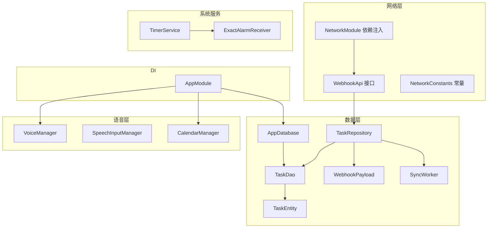
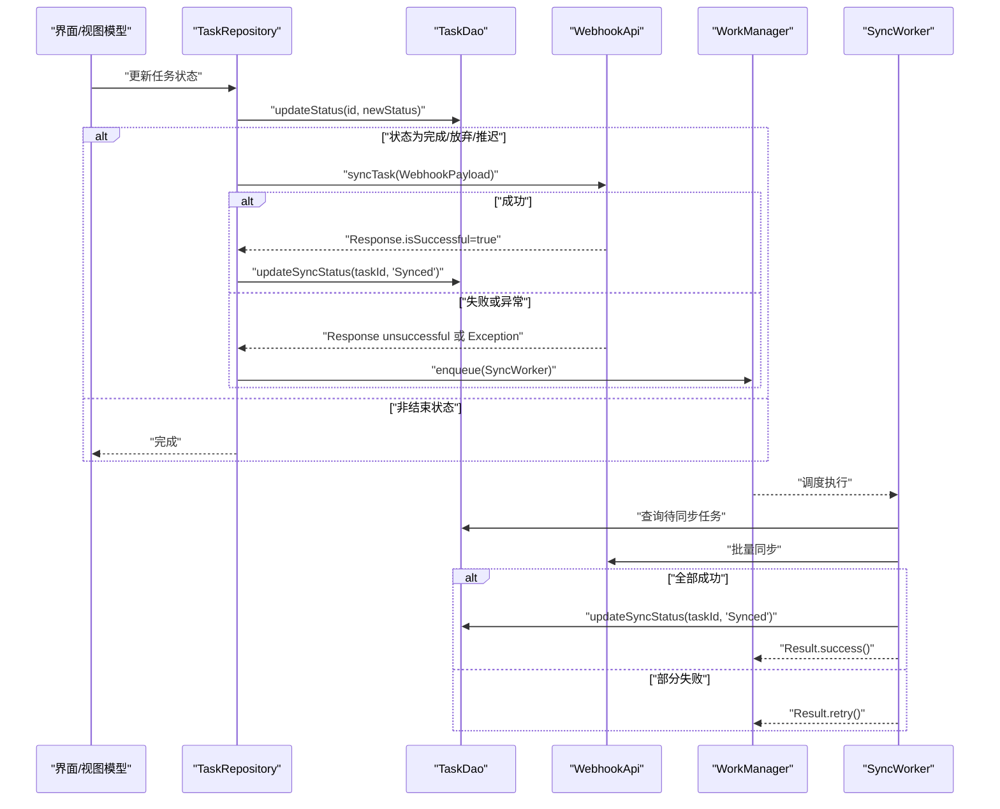
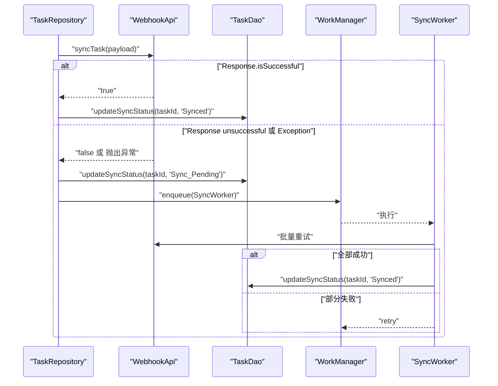
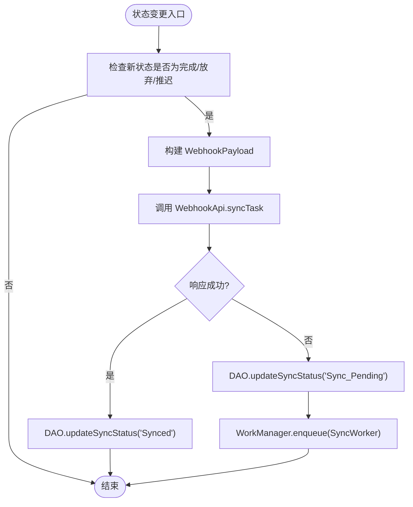
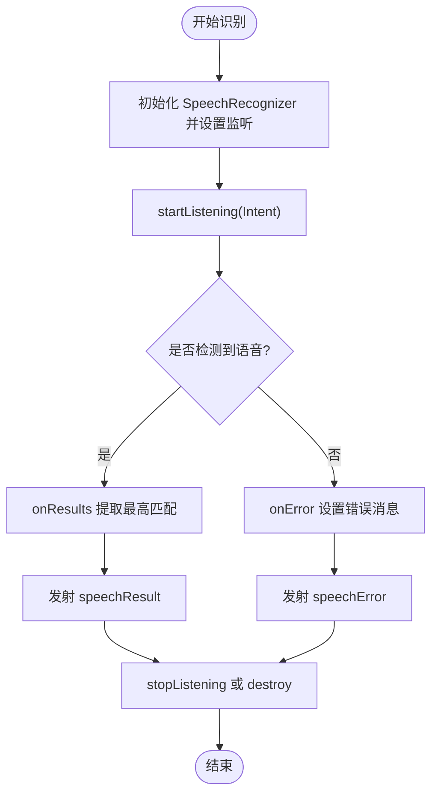
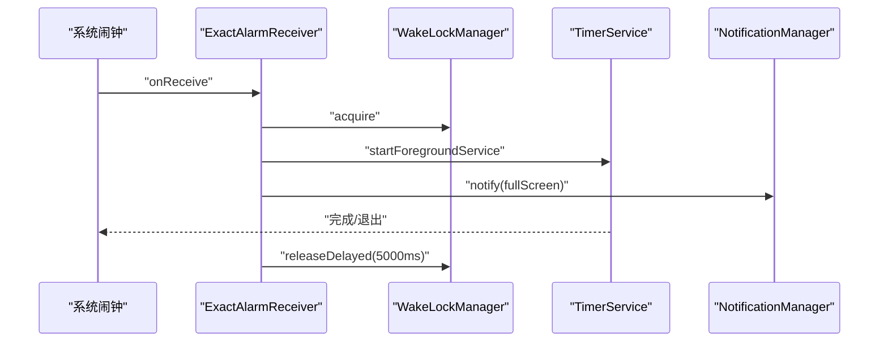
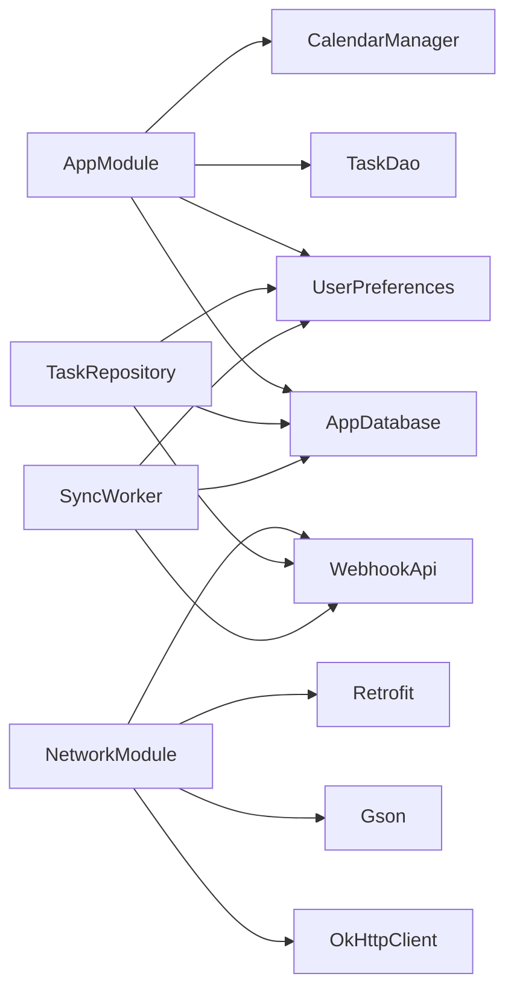

# API参考

<cite>
**本文引用的文件**
- [WebhookApi.kt](file://app/src/main/java/com/pomodoroalert/network/WebhookApi.kt)
- [NetworkConstants.kt](file://app/src/main/java/com/pomodoroalert/network/NetworkConstants.kt)
- [NetworkModule.kt](file://app/src/main/java/com/pomodoroalert/di/NetworkModule.kt)
- [AppDatabase.kt](file://app/src/main/java/com/pomodoroalert/data/AppDatabase.kt)
- [TaskDao.kt](file://app/src/main/java/com/pomodoroalert/data/TaskDao.kt)
- [TaskEntity.kt](file://app/src/main/java/com/pomodoroalert/data/TaskEntity.kt)
- [TaskRepository.kt](file://app/src/main/java/com/pomodoroalert/data/TaskRepository.kt)
- [WebhookPayload.kt](file://app/src/main/java/com/pomodoroalert/data/WebhookPayload.kt)
- [SyncWorker.kt](file://app/src/main/java/com/pomodoroalert/worker/SyncWorker.kt)
- [TimerService.kt](file://app/src/main/java/com/pomodoroalert/service/TimerService.kt)
- [ExactAlarmReceiver.kt](file://app/src/main/java/com/pomodoroalert/receiver/ExactAlarmReceiver.kt)
- [VoiceManager.kt](file://app/src/main/java/com/pomodoroalert/voice/VoiceManager.kt)
- [SpeechInputManager.kt](file://app/src/main/java/com/pomodoroalert/voice/SpeechInputManager.kt)
- [CalendarManager.kt](file://app/src/main/java/com/pomodoroalert/voice/CalendarManager.kt)
- [AppModule.kt](file://app/src/main/java/com/pomodoroalert/di/AppModule.kt)
</cite>

## 目录
1. [简介](#简介)
2. [项目结构](#项目结构)
3. [核心组件](#核心组件)
4. [架构总览](#架构总览)
5. [详细组件分析](#详细组件分析)
6. [依赖关系分析](#依赖关系分析)
7. [性能考量](#性能考量)
8. [故障排查指南](#故障排查指南)
9. [结论](#结论)
10. [附录](#附录)

## 简介
本API参考面向PomodoroAlert应用的开发者与集成方，覆盖以下能力域：
- 网络API：云端Webhook同步接口，用于上报任务完成/放弃/推迟状态与来源。
- 数据库API：基于Room的任务数据持久化接口（DAO）。
- 语音API：语音识别输入、TTS播报、日历事件读取。
- 系统服务API：前台服务计时器、精确闹钟广播接收器。

文档提供各接口的调用方式、参数与返回、错误处理、性能建议与最佳实践，并给出版本兼容与迁移指引。

## 项目结构
应用采用模块化分层组织：
- 网络层：Retrofit接口定义与依赖注入配置。
- 数据层：Room数据库、实体、DAO与仓库。
- 语音层：TTS与语音识别管理器、日历访问。
- 服务层：前台服务计时器、精确闹钟广播接收器。
- 工作线程：后台同步工作器，处理断网重试。
- DI：Hilt模块提供数据库、网络、语音与统计等依赖。

图表来源
- [NetworkModule.kt:1-53](file://app/src/main/java/com/pomodoroalert/di/NetworkModule.kt#L1-L53)
- [AppModule.kt:1-61](file://app/src/main/java/com/pomodoroalert/di/AppModule.kt#L1-L61)
- [AppDatabase.kt:1-10](file://app/src/main/java/com/pomodoroalert/data/AppDatabase.kt#L1-L10)
- [TaskDao.kt:1-29](file://app/src/main/java/com/pomodoroalert/data/TaskDao.kt#L1-L29)
- [TaskEntity.kt:1-19](file://app/src/main/java/com/pomodoroalert/data/TaskEntity.kt#L1-L19)
- [TaskRepository.kt:1-101](file://app/src/main/java/com/pomodoroalert/data/TaskRepository.kt#L1-L101)
- [WebhookPayload.kt:1-18](file://app/src/main/java/com/pomodoroalert/data/WebhookPayload.kt#L1-L18)
- [SyncWorker.kt:1-78](file://app/src/main/java/com/pomodoroalert/worker/SyncWorker.kt#L1-L78)
- [VoiceManager.kt:1-63](file://app/src/main/java/com/pomodoroalert/voice/VoiceManager.kt#L1-L63)
- [SpeechInputManager.kt:1-66](file://app/src/main/java/com/pomodoroalert/voice/SpeechInputManager.kt#L1-L66)
- [CalendarManager.kt:1-66](file://app/src/main/java/com/pomodoroalert/voice/CalendarManager.kt#L1-L66)
- [TimerService.kt:1-103](file://app/src/main/java/com/pomodoroalert/service/TimerService.kt#L1-L103)
- [ExactAlarmReceiver.kt:1-49](file://app/src/main/java/com/pomodoroalert/receiver/ExactAlarmReceiver.kt#L1-L49)

章节来源
- [NetworkModule.kt:1-53](file://app/src/main/java/com/pomodoroalert/di/NetworkModule.kt#L1-L53)
- [AppModule.kt:1-61](file://app/src/main/java/com/pomodoroalert/di/AppModule.kt#L1-L61)
- [AppDatabase.kt:1-10](file://app/src/main/java/com/pomodoroalert/data/AppDatabase.kt#L1-L10)

## 核心组件
- 网络API：通过Retrofit接口定义云端Webhook同步方法，支持动态URL与JSON载荷。
- 数据库API：Room DAO提供增删改查、流式查询与同步状态管理。
- 语音API：TTS播报、语音识别输入、日历事件读取。
- 系统服务API：前台服务计时器、精确闹钟广播接收器。

章节来源
- [WebhookApi.kt:1-16](file://app/src/main/java/com/pomodoroalert/network/WebhookApi.kt#L1-L16)
- [TaskDao.kt:1-29](file://app/src/main/java/com/pomodoroalert/data/TaskDao.kt#L1-L29)
- [VoiceManager.kt:1-63](file://app/src/main/java/com/pomodoroalert/voice/VoiceManager.kt#L1-L63)
- [SpeechInputManager.kt:1-66](file://app/src/main/java/com/pomodoroalert/voice/SpeechInputManager.kt#L1-L66)
- [CalendarManager.kt:1-66](file://app/src/main/java/com/pomodoroalert/voice/CalendarManager.kt#L1-L66)
- [TimerService.kt:1-103](file://app/src/main/java/com/pomodoroalert/service/TimerService.kt#L1-L103)
- [ExactAlarmReceiver.kt:1-49](file://app/src/main/java/com/pomodoroalert/receiver/ExactAlarmReceiver.kt#L1-L49)

## 架构总览
下图展示从任务状态变更到云端同步的关键流程，包括直接触发与后台重试两种路径。

图表来源
- [TaskRepository.kt:32-80](file://app/src/main/java/com/pomodoroalert/data/TaskRepository.kt#L32-L80)
- [WebhookApi.kt:9-15](file://app/src/main/java/com/pomodoroalert/network/WebhookApi.kt#L9-L15)
- [SyncWorker.kt:24-71](file://app/src/main/java/com/pomodoroalert/worker/SyncWorker.kt#L24-L71)
- [TaskDao.kt:20-27](file://app/src/main/java/com/pomodoroalert/data/TaskDao.kt#L20-L27)

## 详细组件分析

### 网络API（Webhook 同步）
- 接口定义
  - 方法：POST
  - 路径：支持动态URL（@Url），默认使用常量基地址
  - 请求体：WebhookPayload
  - 返回：Retrofit Response<Unit>
- 认证与安全
  - 当前实现未包含鉴权头或签名；请在接入端自行配置鉴权策略
- 请求/响应格式
  - Content-Type：application/json
  - 请求体字段：见“数据模型”小节
- 错误处理
  - 非2xx视为失败，进入“待同步”状态并由后台工作器重试
  - 异常捕获后同样标记待同步并重试
- 性能与可靠性
  - 客户端超时：连接/读/写均为15秒
  - 断网重试：通过WorkManager与SyncWorker实现

章节来源
- [WebhookApi.kt:9-15](file://app/src/main/java/com/pomodoroalert/network/WebhookApi.kt#L9-L15)
- [NetworkConstants.kt:3-6](file://app/src/main/java/com/pomodoroalert/network/NetworkConstants.kt#L3-L6)
- [NetworkModule.kt:20-45](file://app/src/main/java/com/pomodoroalert/di/NetworkModule.kt#L20-L45)
- [TaskRepository.kt:68-80](file://app/src/main/java/com/pomodoroalert/data/TaskRepository.kt#L68-L80)
- [SyncWorker.kt:57-71](file://app/src/main/java/com/pomodoroalert/worker/SyncWorker.kt#L57-L71)

#### API定义表
- 终端节点
  - 方法：POST
  - URL：动态传入（@Url），默认基地址由Retrofit配置
- 请求头
  - Content-Type：application/json
  - 鉴权：按接入端策略配置（如Authorization）
- 请求体
  - 类型：WebhookPayload
  - 字段：见“数据模型”小节
- 响应
  - 成功：2xx，标记为已同步
  - 失败：非2xx或异常，标记为待同步并重试

章节来源
- [WebhookApi.kt:9-15](file://app/src/main/java/com/pomodoroalert/network/WebhookApi.kt#L9-L15)
- [NetworkModule.kt:38-45](file://app/src/main/java/com/pomodoroalert/di/NetworkModule.kt#L38-L45)

#### 数据模型
- WebhookPayload
  - 字段
    - log_id：字符串
    - task_name：字符串
    - plan_duration：整数（分钟）
    - actual_status：字符串枚举（Completed/Abandoned/Postponed）
    - trigger_source：字符串枚举（Manual/Voice/Calendar）
    - start_time：字符串（ISO格式）
    - end_time：字符串（ISO格式）
    - voice_id：字符串

章节来源
- [WebhookPayload.kt:8-17](file://app/src/main/java/com/pomodoroalert/data/WebhookPayload.kt#L8-L17)

#### 调用序列图（状态变更触发同步）

图表来源
- [TaskRepository.kt:68-80](file://app/src/main/java/com/pomodoroalert/data/TaskRepository.kt#L68-L80)
- [SyncWorker.kt:57-71](file://app/src/main/java/com/pomodoroalert/worker/SyncWorker.kt#L57-L71)

### 数据库API（Room）
- 数据库与实体
  - AppDatabase：声明实体列表与版本
  - TaskEntity：任务实体，含主键、名称、持续时间、状态、创建时间、来源、同步状态
- DAO接口
  - insert：插入或替换
  - getActiveTasks：流式查询未放弃任务
  - getTaskById：按ID查询
  - updateStatus：更新任务状态
  - getPendingSyncTasks：查询待同步任务
  - updateSyncStatus：更新同步状态
- 仓库职责
  - 将业务逻辑封装为状态变更与同步触发
  - 在结束状态时构造WebhookPayload并调用网络层
  - 失败时标记待同步并调度后台工作器

章节来源
- [AppDatabase.kt:6-9](file://app/src/main/java/com/pomodoroalert/data/AppDatabase.kt#L6-L9)
- [TaskEntity.kt:8-18](file://app/src/main/java/com/pomodoroalert/data/TaskEntity.kt#L8-L18)
- [TaskDao.kt:10-28](file://app/src/main/java/com/pomodoroalert/data/TaskDao.kt#L10-L28)
- [TaskRepository.kt:28-80](file://app/src/main/java/com/pomodoroalert/data/TaskRepository.kt#L28-L80)

#### DAO方法概览
- insert(task)
  - 参数：TaskEntity
  - 返回：无
  - 冲突策略：REPLACE
- getActiveTasks()
  - 返回：Flow<List<TaskEntity>>
  - 条件：status != '已放弃'
  - 排序：createdAt降序
- getTaskById(id)
  - 参数：String
  - 返回：TaskEntity?
- updateStatus(id, newStatus)
  - 参数：id: String, newStatus: String
  - 返回：无
- getPendingSyncTasks()
  - 返回：List<TaskEntity>
  - 条件：sync_status = 'Sync_Pending'
- updateSyncStatus(id, syncStatus)
  - 参数：id: String, syncStatus: String
  - 返回：无

章节来源
- [TaskDao.kt:11-27](file://app/src/main/java/com/pomodoroalert/data/TaskDao.kt#L11-L27)

#### 仓库流程图（状态变更到同步）

图表来源
- [TaskRepository.kt:32-80](file://app/src/main/java/com/pomodoroalert/data/TaskRepository.kt#L32-L80)

### 语音API
- TTS播报（VoiceManager）
  - 功能：申请音频焦点（可静音其他声音）、设置音频属性、播放文本、监听播报完成/错误自动释放焦点
  - 关键方法：requestFocusDuck、abandonFocus、speak
- 语音识别（SpeechInputManager）
  - 功能：启动/停止识别、错误回调、结果流式输出
  - 关键方法：startListening、stopListening、destroy
  - 状态流：isListening、speechResult、speechError
- 日历访问（CalendarManager）
  - 功能：查询当日事件，转换为任务实体列表
  - 关键方法：fetchTodayEvents

章节来源
- [VoiceManager.kt:28-61](file://app/src/main/java/com/pomodoroalert/voice/VoiceManager.kt#L28-L61)
- [SpeechInputManager.kt:48-64](file://app/src/main/java/com/pomodoroalert/voice/SpeechInputManager.kt#L48-L64)
- [CalendarManager.kt:10-64](file://app/src/main/java/com/pomodoroalert/voice/CalendarManager.kt#L10-L64)

#### 语音识别流程图

图表来源
- [SpeechInputManager.kt:13-65](file://app/src/main/java/com/pomodoroalert/voice/SpeechInputManager.kt#L13-L65)

### 系统服务API
- 前台服务计时器（TimerService）
  - 功能：前台服务、倒计时通知、时间到后启动全屏唤醒页面
  - 关键点：通知渠道、延迟1秒更新、结束时触发闹钟
- 精确闹钟广播接收器（ExactAlarmReceiver）
  - 功能：唤醒设备、启动前台服务、显示全屏通知、短暂保持唤醒锁
  - 关键点：根据系统版本选择startForegroundService或startService

章节来源
- [TimerService.kt:24-99](file://app/src/main/java/com/pomodoroalert/service/TimerService.kt#L24-L99)
- [ExactAlarmReceiver.kt:13-47](file://app/src/main/java/com/pomodoroalert/receiver/ExactAlarmReceiver.kt#L13-L47)

#### 闹钟触发序列图

图表来源
- [ExactAlarmReceiver.kt:14-47](file://app/src/main/java/com/pomodoroalert/receiver/ExactAlarmReceiver.kt#L14-L47)
- [TimerService.kt:38-66](file://app/src/main/java/com/pomodoroalert/service/TimerService.kt#L38-L66)

## 依赖关系分析
- 依赖注入
  - AppModule：提供数据库、DAO、用户偏好、统计仓库、日历管理器
  - NetworkModule：提供Gson、OkHttpClient、Retrofit、WebhookApi
- 组件耦合
  - TaskRepository依赖AppDatabase与WebhookApi，承担业务编排
  - SyncWorker在后台独立执行，避免阻塞主线程
  - 语音与日历管理器通过DI提供，便于测试与替换

图表来源
- [AppModule.kt:23-60](file://app/src/main/java/com/pomodoroalert/di/AppModule.kt#L23-L60)
- [NetworkModule.kt:20-51](file://app/src/main/java/com/pomodoroalert/di/NetworkModule.kt#L20-L51)
- [TaskRepository.kt:20-25](file://app/src/main/java/com/pomodoroalert/data/TaskRepository.kt#L20-L25)
- [SyncWorker.kt:16-22](file://app/src/main/java/com/pomodoroalert/worker/SyncWorker.kt#L16-L22)

章节来源
- [AppModule.kt:1-61](file://app/src/main/java/com/pomodoroalert/di/AppModule.kt#L1-L61)
- [NetworkModule.kt:1-53](file://app/src/main/java/com/pomodoroalert/di/NetworkModule.kt#L1-L53)

## 性能考量
- 网络层
  - 超时设置：连接/读/写均为15秒，避免长时间阻塞
  - JSON解析：使用Gson，默认配置
- 数据层
  - 流式查询：getActiveTasks返回Flow，避免阻塞UI线程
  - 批量同步：SyncWorker逐条重试，失败后整体重试
- 语音层
  - TTS播报完成后自动释放音频焦点，降低资源占用
  - 语音识别使用异步回调与状态流，避免阻塞
- 服务层
  - 前台服务通知低重要性，减少打扰
  - 闹钟触发后短暂持有唤醒锁，防止系统休眠影响体验

[本节为通用性能建议，不直接分析具体文件]

## 故障排查指南
- 网络同步失败
  - 现象：状态更新后未同步，任务标记为“待同步”
  - 排查：检查网络可用性、目标URL可达性、鉴权配置
  - 处理：等待WorkManager重试或手动触发重试
- 语音识别错误
  - 现象：speechError流出现错误提示
  - 排查：确认设备麦克风权限、网络连通性（离线模型需额外配置）
  - 处理：切换为手动输入或稍后重试
- TTS播报无声
  - 现象：speak调用后无声音
  - 排查：检查音频焦点申请、设备音量与静音状态
  - 处理：确保应用具有音频播放权限并允许焦点静音
- 闹钟未触发
  - 现象：到达设定时间无通知或唤醒
  - 排查：检查系统省电策略、前台服务启动方式、通知渠道配置
  - 处理：允许后台启动与通知显示

章节来源
- [TaskRepository.kt:72-78](file://app/src/main/java/com/pomodoroalert/data/TaskRepository.kt#L72-L78)
- [SpeechInputManager.kt:33-36](file://app/src/main/java/com/pomodoroalert/voice/SpeechInputManager.kt#L33-L36)
- [VoiceManager.kt:46-61](file://app/src/main/java/com/pomodoroalert/voice/VoiceManager.kt#L46-L61)
- [ExactAlarmReceiver.kt:14-47](file://app/src/main/java/com/pomodoroalert/receiver/ExactAlarmReceiver.kt#L14-L47)

## 结论
本API参考覆盖了PomodoroAlert的核心能力域：云端同步、本地持久化、语音交互与系统服务。通过清晰的接口定义、健壮的错误处理与后台重试机制，确保在弱网与复杂场景下的稳定性。建议在接入端补充鉴权与监控埋点，以满足生产环境的安全与可观测性要求。

[本节为总结性内容，不直接分析具体文件]

## 附录

### API版本兼容与迁移指南
- 版本语义
  - 数据库：AppDatabase声明版本号，升级时需提供迁移脚本
  - 网络：当前仅一个Webhook端点，新增端点建议以URL参数或子路径区分版本
- 迁移建议
  - 数据库：Room迁移需显式提供Migration对象，避免破坏性变更
  - 网络：若需变更WebhookPayload字段，建议向后兼容或引入版本字段
  - 语音：TTS与语音识别行为受系统版本影响，建议在不同Android版本做兼容测试

章节来源
- [AppDatabase.kt:6-9](file://app/src/main/java/com/pomodoroalert/data/AppDatabase.kt#L6-L9)
- [WebhookPayload.kt:8-17](file://app/src/main/java/com/pomodoroalert/data/WebhookPayload.kt#L8-L17)

### 最佳实践清单
- 网络
  - 明确鉴权方案并在拦截器中统一注入
  - 对非2xx响应记录日志并区分重试与失败
- 数据库
  - 使用Flow观察数据变化，避免在主线程执行耗时操作
  - 对批量写入使用事务或合并请求
- 语音
  - 在speak前后正确申请/释放音频焦点
  - 对识别错误进行用户提示与兜底输入
- 服务
  - 前台服务通知需及时更新，避免用户困惑
  - 闹钟触发后尽快释放唤醒锁，避免耗电

[本节为通用最佳实践，不直接分析具体文件]