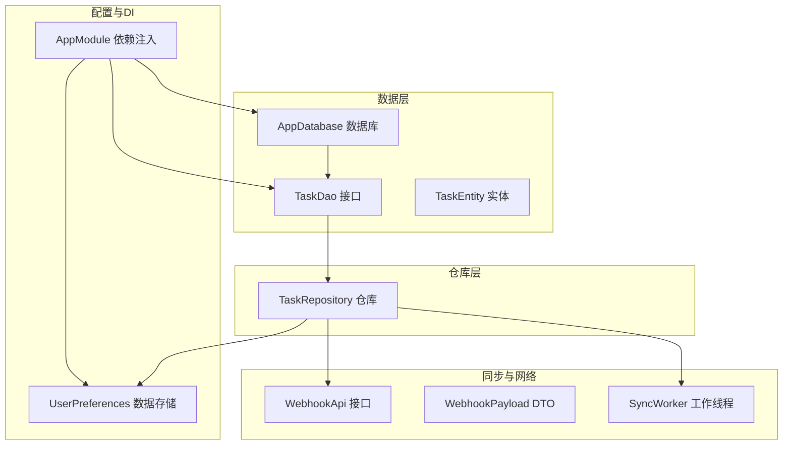
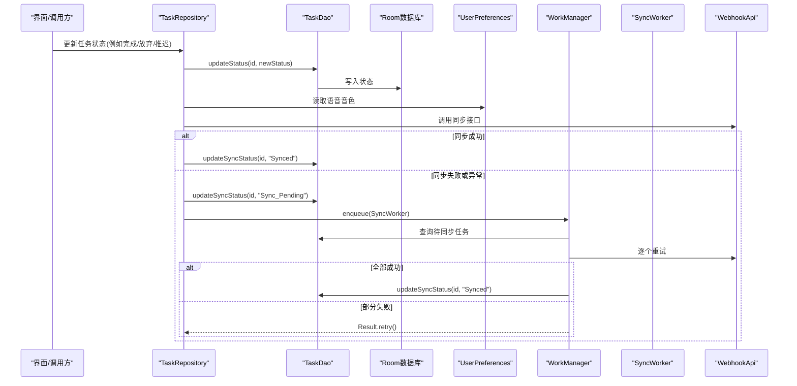
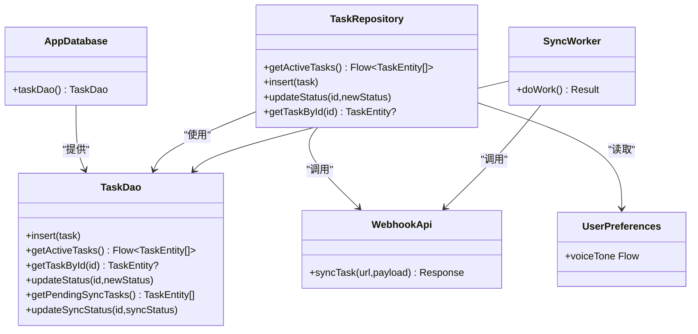

# 数据库API

<cite>
**本文引用的文件**
- [TaskDao.kt](file://app/src/main/java/com/pomodoroalert/data/TaskDao.kt)
- [TaskEntity.kt](file://app/src/main/java/com/pomodoroalert/data/TaskEntity.kt)
- [AppDatabase.kt](file://app/src/main/java/com/pomodoroalert/data/AppDatabase.kt)
- [TaskRepository.kt](file://app/src/main/java/com/pomodoroalert/data/TaskRepository.kt)
- [WebhookPayload.kt](file://app/src/main/java/com/pomodoroalert/data/WebhookPayload.kt)
- [SyncWorker.kt](file://app/src/main/java/com/pomodoroalert/worker/SyncWorker.kt)
- [WebhookApi.kt](file://app/src/main/java/com/pomodoroalert/network/WebhookApi.kt)
- [NetworkConstants.kt](file://app/src/main/java/com/pomodoroalert/network/NetworkConstants.kt)
- [UserPreferences.kt](file://app/src/main/java/com/pomodoroalert/data/UserPreferences.kt)
- [AppModule.kt](file://app/src/main/java/com/pomodoroalert/di/AppModule.kt)
</cite>

## 目录
1. [简介](#简介)
2. [项目结构](#项目结构)
3. [核心组件](#核心组件)
4. [架构总览](#架构总览)
5. [详细组件分析](#详细组件分析)
6. [依赖关系分析](#依赖关系分析)
7. [性能与优化](#性能与优化)
8. [故障排查指南](#故障排查指南)
9. [结论](#结论)
10. [附录](#附录)

## 简介
本文件面向PomodoroAlert应用的数据库API，聚焦于TaskDao接口的数据访问方法、TaskEntity实体模型、Room数据库配置与集成，以及围绕任务状态变更触发的云端同步流程。文档同时覆盖查询示例思路、事务与批量操作建议、并发访问控制、性能优化与内存使用最佳实践，并对数据库版本升级策略给出可扩展的指导。

## 项目结构
数据库相关代码主要位于以下模块：
- 数据层：TaskDao、TaskEntity、AppDatabase
- 仓库层：TaskRepository
- 同步与网络：WebhookApi、WebhookPayload、SyncWorker
- 配置与DI：UserPreferences、AppModule
- 常量：NetworkConstants

图表来源
- [AppDatabase.kt:6-9](file://app/src/main/java/com/pomodoroalert/data/AppDatabase.kt#L6-L9)
- [TaskDao.kt:9-28](file://app/src/main/java/com/pomodoroalert/data/TaskDao.kt#L9-L28)
- [TaskRepository.kt:20-25](file://app/src/main/java/com/pomodoroalert/data/TaskRepository.kt#L20-L25)
- [WebhookApi.kt:9-15](file://app/src/main/java/com/pomodoroalert/network/WebhookApi.kt#L9-L15)
- [SyncWorker.kt:15-22](file://app/src/main/java/com/pomodoroalert/worker/SyncWorker.kt#L15-L22)
- [UserPreferences.kt:15-35](file://app/src/main/java/com/pomodoroalert/data/UserPreferences.kt#L15-L35)
- [AppModule.kt:23-31](file://app/src/main/java/com/pomodoroalert/di/AppModule.kt#L23-L31)

章节来源
- [AppDatabase.kt:6-9](file://app/src/main/java/com/pomodoroalert/data/AppDatabase.kt#L6-L9)
- [TaskDao.kt:9-28](file://app/src/main/java/com/pomodoroalert/data/TaskDao.kt#L9-L28)
- [TaskRepository.kt:20-25](file://app/src/main/java/com/pomodoroalert/data/TaskRepository.kt#L20-L25)
- [AppModule.kt:23-31](file://app/src/main/java/com/pomodoroalert/di/AppModule.kt#L23-L31)

## 核心组件
- TaskDao：定义了任务的增删改查与状态管理相关查询，使用协程挂起函数与Flow流式查询。
- TaskEntity：任务实体，包含主键、名称、时长、状态、创建时间、来源、同步状态等字段。
- AppDatabase：Room数据库入口，声明实体与版本号。
- TaskRepository：封装DAO调用，负责状态变更后的同步触发与重试调度。
- WebhookApi/WebhookPayload/SyncWorker：云端同步链路，将本地任务转换为WebhookPayload并通过API发送，失败时标记待同步并由WorkManager重试。
- UserPreferences：通过DataStore持久化用户偏好（如语音音色），供同步流程使用。
- AppModule：提供数据库、DAO、仓库与偏好等单例依赖。

章节来源
- [TaskDao.kt:9-28](file://app/src/main/java/com/pomodoroalert/data/TaskDao.kt#L9-L28)
- [TaskEntity.kt:8-18](file://app/src/main/java/com/pomodoroalert/data/TaskEntity.kt#L8-L18)
- [AppDatabase.kt:6-9](file://app/src/main/java/com/pomodoroalert/data/AppDatabase.kt#L6-L9)
- [TaskRepository.kt:20-25](file://app/src/main/java/com/pomodoroalert/data/TaskRepository.kt#L20-L25)
- [WebhookApi.kt:9-15](file://app/src/main/java/com/pomodoroalert/network/WebhookApi.kt#L9-L15)
- [WebhookPayload.kt:8-17](file://app/src/main/java/com/pomodoroalert/data/WebhookPayload.kt#L8-L17)
- [SyncWorker.kt:15-22](file://app/src/main/java/com/pomodoroalert/worker/SyncWorker.kt#L15-L22)
- [UserPreferences.kt:15-35](file://app/src/main/java/com/pomodoroalert/data/UserPreferences.kt#L15-L35)
- [AppModule.kt:23-31](file://app/src/main/java/com/pomodoroalert/di/AppModule.kt#L23-L31)

## 架构总览
数据库API采用Room + Repository + WorkManager + Retrofit的分层设计：
- Room负责本地持久化与查询。
- Repository封装业务逻辑，协调DAO与网络层。
- WorkManager用于异步重试与后台同步。
- Retrofit负责云端同步请求。

图表来源
- [TaskRepository.kt:32-80](file://app/src/main/java/com/pomodoroalert/data/TaskRepository.kt#L32-L80)
- [TaskDao.kt:20-27](file://app/src/main/java/com/pomodoroalert/data/TaskDao.kt#L20-L27)
- [SyncWorker.kt:24-71](file://app/src/main/java/com/pomodoroalert/worker/SyncWorker.kt#L24-L71)
- [WebhookApi.kt:9-15](file://app/src/main/java/com/pomodoroalert/network/WebhookApi.kt#L9-L15)
- [UserPreferences.kt:22-24](file://app/src/main/java/com/pomodoroalert/data/UserPreferences.kt#L22-L24)

## 详细组件分析

### TaskDao 接口与数据访问方法
- 方法概览与职责
  - insert(task: TaskEntity)
    - 功能：插入或替换现有任务（冲突策略REPLACE）
    - 参数：TaskEntity
    - 返回：无（suspend）
    - 异常：Room底层异常（如约束冲突、数据库不可用）
  - getActiveTasks(): Flow<List<TaskEntity>>
    - 功能：查询未被放弃的任务，按创建时间倒序
    - 参数：无
    - 返回：Flow<List<TaskEntity>>（响应式）
    - 异常：数据库查询异常
  - getTaskById(id: String): TaskEntity?
    - 功能：按主键查询任务
    - 参数：id: String
    - 返回：TaskEntity?（可能为空）
    - 异常：数据库查询异常
  - updateStatus(id: String, newStatus: String)
    - 功能：更新任务状态
    - 参数：id: String, newStatus: String
    - 返回：无（suspend）
    - 异常：数据库写入异常
  - getPendingSyncTasks(): List<TaskEntity>
    - 功能：查询待同步任务
    - 参数：无
    - 返回：List<TaskEntity>
    - 异常：数据库查询异常
  - updateSyncStatus(id: String, syncStatus: String)
    - 功能：更新同步状态
    - 参数：id: String, syncStatus: String
    - 返回：无（suspend）
    - 异常：数据库写入异常

- 参数类型与返回值
  - 所有DAO方法均使用Room注解声明SQL，参数类型为基本类型或实体类属性类型；返回类型为suspend函数或Flow流式集合。

- 异常处理机制
  - DAO层未显式捕获异常，异常由Room框架抛出。上层仓库层在同步流程中捕获异常并进入重试路径。

- 并发与一致性
  - 使用suspend函数保证协程安全；Flow查询天然支持响应式更新。
  - 冲突策略REPLACE用于insert，避免重复主键导致的写入失败。

章节来源
- [TaskDao.kt:11-27](file://app/src/main/java/com/pomodoroalert/data/TaskDao.kt#L11-L27)

### TaskEntity 实体模型
- 字段定义与类型
  - taskId: String（主键，默认UUID）
  - taskName: String（任务名）
  - duration: Long（毫秒）
  - status: String（状态枚举：待开始/进行中/已完成/已放弃）
  - createdAt: Long（创建时间戳）
  - source: String（来源：手动/语音/日历）
  - syncStatus: String（默认“Synced”，可为“Sync_Pending”）

- 约束与索引
  - 主键：taskId
  - 当前未显式声明其他索引；getActiveTasks按createdAt排序，建议在生产环境考虑为createdAt建立索引以提升排序查询性能。

- 数据校验与业务约束
  - 状态字段为字符串枚举，仓库层在更新状态后触发同步逻辑，需确保状态值符合预期。
  - syncStatus用于幂等同步控制，避免重复同步。

- 外部依赖
  - sync_status列名通过@ColumnInfo映射，便于后续迁移时保持兼容。

章节来源
- [TaskEntity.kt:8-18](file://app/src/main/java/com/pomodoroalert/data/TaskEntity.kt#L8-L18)

### AppDatabase 与依赖注入
- 数据库配置
  - entities: [TaskEntity::class]
  - version: 1
  - exportSchema: false
  - 提供taskDao(): TaskDao抽象方法

- DI提供
  - AppModule通过Room.databaseBuilder构建数据库实例，命名为“pomodoro_db”
  - 提供TaskDao单例，供仓库层注入使用

- 版本升级策略
  - 当前版本为1，未实现迁移逻辑。后续升级时应基于Room Migration类实现版本间迁移。

章节来源
- [AppDatabase.kt:6-9](file://app/src/main/java/com/pomodoroalert/data/AppDatabase.kt#L6-L9)
- [AppModule.kt:25-31](file://app/src/main/java/com/pomodoroalert/di/AppModule.kt#L25-L31)

### TaskRepository 业务逻辑与同步流程
- 关键职责
  - 暴露Flow查询与插入方法
  - 在更新状态后根据状态决定是否触发云端同步
  - 同步成功则更新syncStatus为“Synced”，否则标记为“Sync_Pending”并调度WorkManager重试

- 同步流程要点
  - 将TaskEntity转换为WebhookPayload，包含任务标识、计划时长、实际状态、触发来源、起止时间、语音音色等
  - 通过WebhookApi调用云端接口；若失败或异常，则标记待同步并enqueue SyncWorker
  - SyncWorker遍历待同步任务，逐个重试，全部成功则更新为“Synced”，否则返回retry

- 并发与线程
  - 使用CoroutineScope(Dispatchers.IO)执行同步逻辑，避免阻塞主线程
  - Flow查询在数据库线程池中执行，返回到UI线程由收集者消费

章节来源
- [TaskRepository.kt:28-99](file://app/src/main/java/com/pomodoroalert/data/TaskRepository.kt#L28-L99)
- [WebhookPayload.kt:8-17](file://app/src/main/java/com/pomodoroalert/data/WebhookPayload.kt#L8-L17)
- [WebhookApi.kt:9-15](file://app/src/main/java/com/pomodoroalert/network/WebhookApi.kt#L9-L15)
- [SyncWorker.kt:24-71](file://app/src/main/java/com/pomodoroalert/worker/SyncWorker.kt#L24-L71)

### 同步链路与错误处理
- 错误处理策略
  - 同步异常捕获后标记为“Sync_Pending”，并使用WorkManager在满足网络条件时重试
  - SyncWorker内部逐条重试，全部成功才认为整体成功，否则返回retry交由系统继续调度

- 重试与幂等
  - 通过syncStatus实现幂等：已同步的任务不会重复上报
  - WorkManager具备退避与重试能力，适合弱网场景

章节来源
- [TaskRepository.kt:68-94](file://app/src/main/java/com/pomodoroalert/data/TaskRepository.kt#L68-L94)
- [SyncWorker.kt:57-71](file://app/src/main/java/com/pomodoroalert/worker/SyncWorker.kt#L57-L71)

## 依赖关系分析
- 组件耦合
  - TaskRepository强依赖TaskDao与WebhookApi；通过UserPreferences读取偏好
  - SyncWorker同样依赖TaskDao与WebhookApi，形成独立的后台同步通道
  - AppModule集中提供数据库与DAO单例，降低各层直接依赖

- 可能的循环依赖
  - 当前未发现循环依赖；DAO与Repository之间为单向依赖

- 外部依赖
  - Room、Retrofit、WorkManager、DataStore

图表来源
- [AppDatabase.kt:6-9](file://app/src/main/java/com/pomodoroalert/data/AppDatabase.kt#L6-L9)
- [TaskDao.kt:9-28](file://app/src/main/java/com/pomodoroalert/data/TaskDao.kt#L9-L28)
- [TaskRepository.kt:20-25](file://app/src/main/java/com/pomodoroalert/data/TaskRepository.kt#L20-L25)
- [WebhookApi.kt:9-15](file://app/src/main/java/com/pomodoroalert/network/WebhookApi.kt#L9-L15)
- [SyncWorker.kt:15-22](file://app/src/main/java/com/pomodoroalert/worker/SyncWorker.kt#L15-L22)
- [UserPreferences.kt:15-35](file://app/src/main/java/com/pomodoroalert/data/UserPreferences.kt#L15-L35)

## 性能与优化
- 查询优化
  - 为createdAt建立索引以加速排序查询（getActiveTasks）
  - 对常用过滤条件（status、source）考虑建立复合索引
  - 使用Flow进行响应式查询，避免不必要的全量刷新

- 事务与批量操作
  - Room支持事务块；对于批量插入/更新，建议在单个事务中执行以减少开销
  - 批量同步时，先查询待同步列表，再逐条重试，避免一次性大事务

- 内存与协程
  - 使用IO调度器执行网络与数据库操作
  - Flow收集时注意生命周期绑定，避免内存泄漏
  - 合理使用协程作用域与取消机制

- 缓存与去抖
  - 对频繁查询的结果进行短期缓存，减少重复查询
  - 对状态变更事件进行去抖，避免短时间内多次触发同步

- 网络与重试
  - 使用WorkManager的退避策略与网络约束，降低功耗与流量消耗
  - 对云端接口增加超时与重试上限，避免无限重试

## 故障排查指南
- 常见问题
  - 同步失败：检查网络连接、云端URL配置、WebhookApi返回码
  - 任务未同步：确认syncStatus是否为“Sync_Pending”，查看WorkManager调度状态
  - Flow不更新：确认上游写入是否在正确的协程调度器中执行
  - 数据库异常：检查Room版本与迁移脚本是否匹配

- 定位步骤
  - 查看TaskRepository与SyncWorker中的异常捕获与日志输出
  - 核对UserPreferences中的语音音色配置是否正确
  - 检查AppModule中数据库构建参数与命名

章节来源
- [TaskRepository.kt:68-94](file://app/src/main/java/com/pomodoroalert/data/TaskRepository.kt#L68-L94)
- [SyncWorker.kt:57-71](file://app/src/main/java/com/pomodoroalert/worker/SyncWorker.kt#L57-L71)
- [NetworkConstants.kt:4-6](file://app/src/main/java/com/pomodoroalert/network/NetworkConstants.kt#L4-L6)
- [AppModule.kt:25-31](file://app/src/main/java/com/pomodoroalert/di/AppModule.kt#L25-L31)

## 结论
本数据库API以Room为核心，结合Repository与WorkManager实现了本地与云端的可靠同步。TaskDao提供了简洁明确的数据访问方法，TaskEntity模型清晰表达业务语义。当前版本为1，未包含迁移逻辑；后续可通过Room Migration扩展版本升级能力。建议在生产环境中补充索引、事务与批量操作、网络退避策略与更完善的错误日志，以进一步提升稳定性与性能。

## 附录

### 查询示例（思路与路径）
- 复杂查询（排序+过滤）
  - 示例思路：按创建时间倒序列出未放弃任务
  - 路径参考：[TaskDao.kt:14-15](file://app/src/main/java/com/pomodoroalert/data/TaskDao.kt#L14-L15)
- 事务处理（建议）
  - 示例思路：在单个事务中批量插入/更新任务
  - 路径参考：[TaskDao.kt:11-12](file://app/src/main/java/com/pomodoroalert/data/TaskDao.kt#L11-L12)
- 批量操作（建议）
  - 示例思路：先查询待同步列表，再逐条重试
  - 路径参考：[SyncWorker.kt:24-71](file://app/src/main/java/com/pomodoroalert/worker/SyncWorker.kt#L24-L71)

### 数据库版本升级策略与迁移脚本规范
- 升级策略
  - 新增表：使用createTable与alterTable
  - 修改列：添加新列并迁移旧数据，最后删除旧列
  - 删除表：先备份数据，再删除旧表
- 迁移脚本规范
  - 明确fromVersion与toVersion
  - 保证幂等性与原子性
  - 测试覆盖新增/修改/删除场景
- 当前版本
  - AppDatabase.version = 1，未实现迁移

章节来源
- [AppDatabase.kt:6-9](file://app/src/main/java/com/pomodoroalert/data/AppDatabase.kt#L6-L9)

### 数据验证规则与业务约束
- 状态枚举：待开始/进行中/已完成/已放弃
- 来源枚举：手动/语音/日历
- 同步状态：Synced/Sync_Pending
- 校验建议：在插入/更新前对关键字段进行范围与格式校验

章节来源
- [TaskEntity.kt:10-17](file://app/src/main/java/com/pomodoroalert/data/TaskEntity.kt#L10-L17)

### 并发访问控制
- DAO方法均为suspend，避免阻塞UI线程
- Flow查询自动响应数据库变化
- 同步流程在IO调度器中执行，WorkManager保障后台重试

章节来源
- [TaskDao.kt:14-15](file://app/src/main/java/com/pomodoroalert/data/TaskDao.kt#L14-L15)
- [TaskRepository.kt:42-80](file://app/src/main/java/com/pomodoroalert/data/TaskRepository.kt#L42-L80)
- [SyncWorker.kt:24-71](file://app/src/main/java/com/pomodoroalert/worker/SyncWorker.kt#L24-L71)