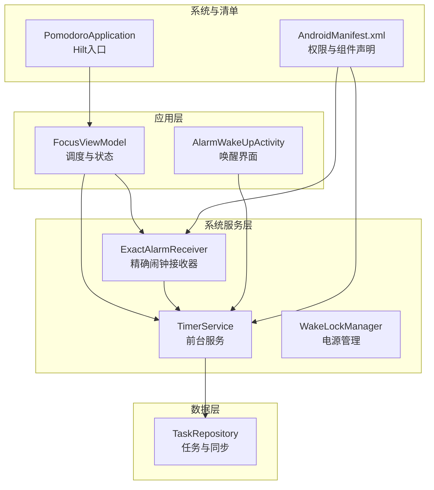
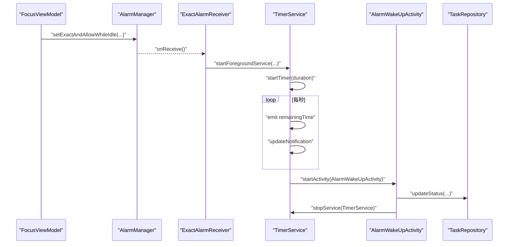
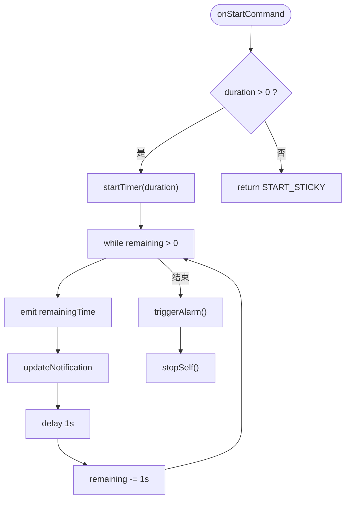
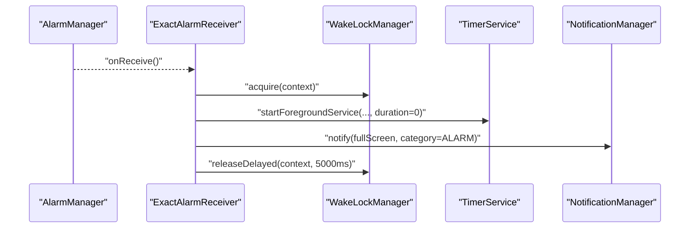
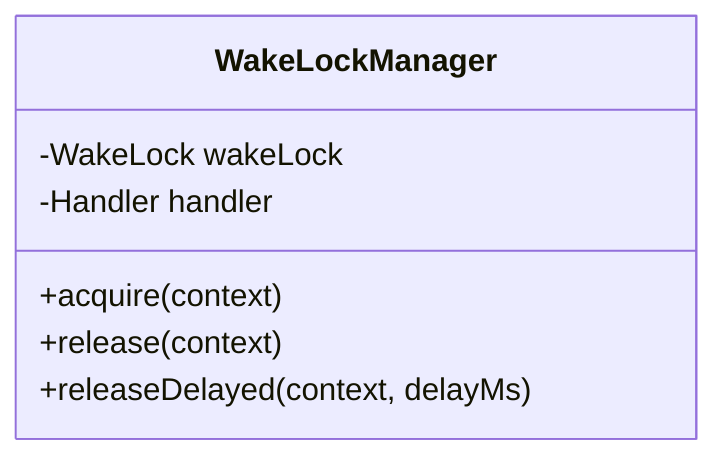
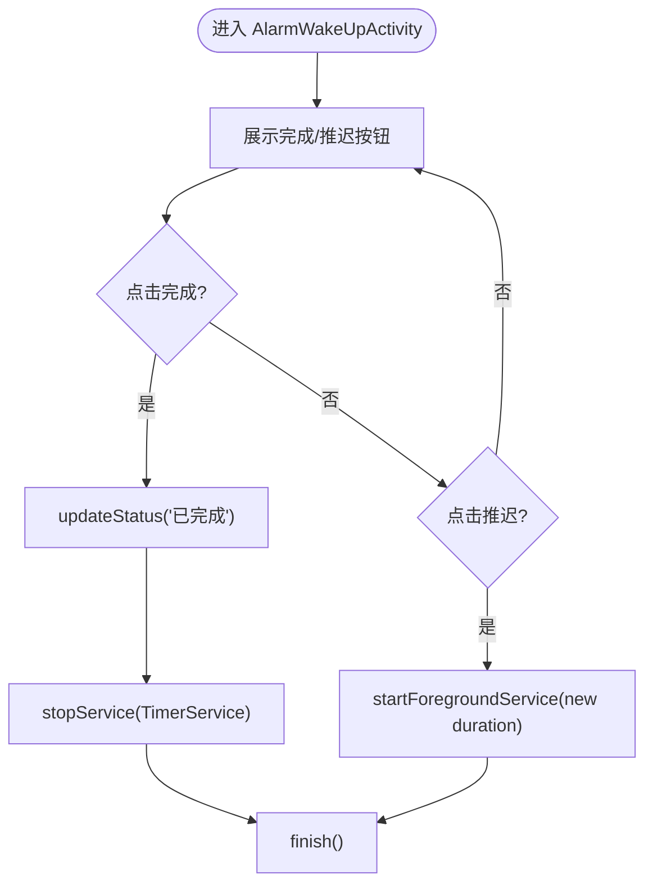
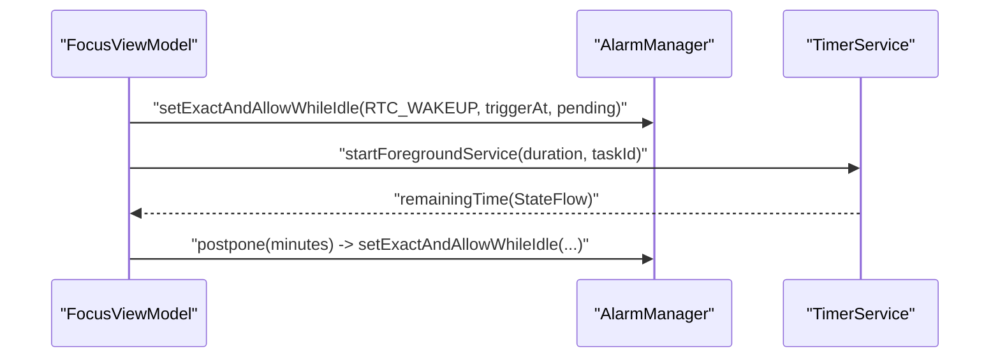
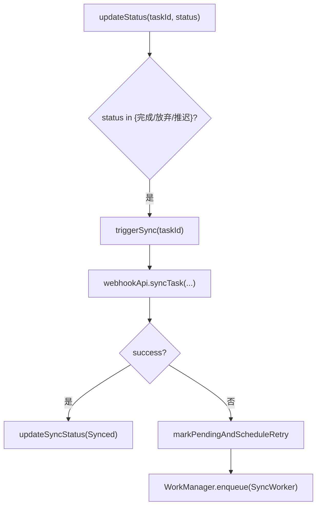
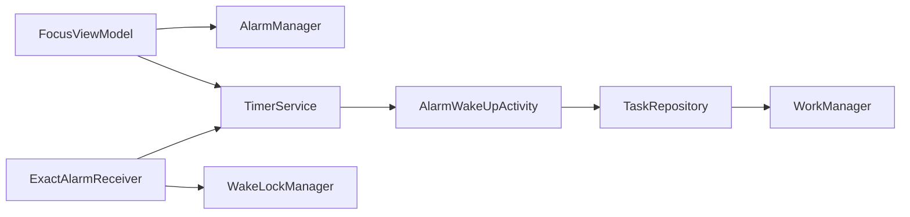

# 系统服务API

<cite>
**本文引用的文件**
- [TimerService.kt](file://app/src/main/java/com/pomodoroalert/service/TimerService.kt)
- [ExactAlarmReceiver.kt](file://app/src/main/java/com/pomodoroalert/receiver/ExactAlarmReceiver.kt)
- [WakeLockManager.kt](file://app/src/main/java/com/pomodoroalert/receiver/WakeLockManager.kt)
- [AndroidManifest.xml](file://app/src/main/AndroidManifest.xml)
- [AlarmWakeUpActivity.kt](file://app/src/main/java/com/pomodoroalert/ui/AlarmWakeUpActivity.kt)
- [FocusViewModel.kt](file://app/src/main/java/com/pomodoroalert/ui/viewmodel/FocusViewModel.kt)
- [PomodoroApplication.kt](file://app/src/main/java/com/pomodoroalert/PomodoroApplication.kt)
- [TaskRepository.kt](file://app/src/main/java/com/pomodoroalert/data/TaskRepository.kt)
</cite>

## 目录
1. [简介](#简介)
2. [项目结构](#项目结构)
3. [核心组件](#核心组件)
4. [架构总览](#架构总览)
5. [详细组件分析](#详细组件分析)
6. [依赖关系分析](#依赖关系分析)
7. [性能与资源管理](#性能与资源管理)
8. [权限与配置](#权限与配置)
9. [调试与故障排除](#调试与故障排除)
10. [结论](#结论)

## 简介
本文件面向PomodoroAlert的系统服务API，聚焦以下目标：
- TimerService前台服务的生命周期管理、服务绑定机制与状态通知接口
- ExactAlarmReceiver精确闹钟接收器的实现：闹钟设置、重复模式、系统唤醒机制
- WakeLockManager电源管理API：唤醒锁获取、释放时机、电池优化考虑
- Android系统权限要求、服务注册配置、广播接收器声明
- 系统资源管理、内存泄漏防护、性能监控最佳实践
- 与其他系统组件的交互协议、IPC通信机制、跨进程数据共享
- 调试工具使用指南、日志分析方法、故障排除步骤

## 项目结构
本项目采用按功能域分层的组织方式，核心系统服务API位于以下包：
- service：前台服务实现（TimerService）
- receiver：广播接收器与电源管理（ExactAlarmReceiver、WakeLockManager）
- ui：界面与唤醒活动（AlarmWakeUpActivity）
- ui/viewmodel：视图模型与AlarmManager调度（FocusViewModel）
- data：数据仓库与同步（TaskRepository）
- 应用入口与清单：PomodoroApplication、AndroidManifest.xml

图表来源
- [AndroidManifest.xml:11-38](file://app/src/main/AndroidManifest.xml#L11-L38)
- [TimerService.kt:24-103](file://app/src/main/java/com/pomodoroalert/service/TimerService.kt#L24-L103)
- [ExactAlarmReceiver.kt:13-49](file://app/src/main/java/com/pomodoroalert/receiver/ExactAlarmReceiver.kt#L13-L49)
- [WakeLockManager.kt:8-31](file://app/src/main/java/com/pomodoroalert/receiver/WakeLockManager.kt#L8-L31)
- [AlarmWakeUpActivity.kt:25-105](file://app/src/main/java/com/pomodoroalert/ui/AlarmWakeUpActivity.kt#L25-L105)
- [FocusViewModel.kt:21-85](file://app/src/main/java/com/pomodoroalert/ui/viewmodel/FocusViewModel.kt#L21-L85)
- [TaskRepository.kt:19-101](file://app/src/main/java/com/pomodoroalert/data/TaskRepository.kt#L19-L101)
- [PomodoroApplication.kt:6-8](file://app/src/main/java/com/pomodoroalert/PomodoroApplication.kt#L6-L8)

章节来源
- [AndroidManifest.xml:11-38](file://app/src/main/AndroidManifest.xml#L11-L38)
- [PomodoroApplication.kt:6-8](file://app/src/main/java/com/pomodoroalert/PomodoroApplication.kt#L6-L8)

## 核心组件
- TimerService：前台服务，负责倒计时、通知更新、闹钟触发与服务自停。
- ExactAlarmReceiver：精确闹钟接收器，负责在闹钟触发时唤醒系统、启动前台服务、显示全屏通知、短暂持有唤醒锁。
- WakeLockManager：电源管理工具，提供唤醒锁获取与延迟释放，避免长时间占用CPU。
- AlarmWakeUpActivity：锁屏全屏唤醒界面，支持完成/推迟操作，并与任务仓库协作进行状态更新与同步。
- FocusViewModel：负责通过AlarmManager设置精确闹钟、启动前台服务、处理推迟逻辑。
- TaskRepository：任务状态变更后触发同步流程，必要时通过WorkManager安排重试。

章节来源
- [TimerService.kt:24-103](file://app/src/main/java/com/pomodoroalert/service/TimerService.kt#L24-L103)
- [ExactAlarmReceiver.kt:13-49](file://app/src/main/java/com/pomodoroalert/receiver/ExactAlarmReceiver.kt#L13-L49)
- [WakeLockManager.kt:8-31](file://app/src/main/java/com/pomodoroalert/receiver/WakeLockManager.kt#L8-L31)
- [AlarmWakeUpActivity.kt:25-105](file://app/src/main/java/com/pomodoroalert/ui/AlarmWakeUpActivity.kt#L25-L105)
- [FocusViewModel.kt:21-85](file://app/src/main/java/com/pomodoroalert/ui/viewmodel/FocusViewModel.kt#L21-L85)
- [TaskRepository.kt:19-101](file://app/src/main/java/com/pomodoroalert/data/TaskRepository.kt#L19-L101)

## 架构总览
系统围绕“精确闹钟 + 前台服务 + 锁屏唤醒界面”的闭环工作流展开：
- 视图模型通过AlarmManager设置精确闹钟（允许设备休眠时唤醒）
- 闹钟触发后由广播接收器短暂获取唤醒锁，启动前台服务并显示全屏通知
- 前台服务持续倒计时并通过通知栏展示剩余时间；时间到后启动唤醒界面
- 用户在唤醒界面选择完成或推迟，完成后停止前台服务并更新任务状态，必要时触发同步

图表来源
- [FocusViewModel.kt:52-62](file://app/src/main/java/com/pomodoroalert/ui/viewmodel/FocusViewModel.kt#L52-L62)
- [ExactAlarmReceiver.kt:14-47](file://app/src/main/java/com/pomodoroalert/receiver/ExactAlarmReceiver.kt#L14-L47)
- [TimerService.kt:38-66](file://app/src/main/java/com/pomodoroalert/service/TimerService.kt#L38-L66)
- [AlarmWakeUpActivity.kt:75-98](file://app/src/main/java/com/pomodoroalert/ui/AlarmWakeUpActivity.kt#L75-L98)
- [TaskRepository.kt:32-38](file://app/src/main/java/com/pomodoroalert/data/TaskRepository.kt#L32-L38)

## 详细组件分析

### TimerService 前台服务
- 生命周期管理
  - onCreate：创建通知渠道并以前台服务启动，保持通知常驻
  - onStartCommand：接收带时长的启动意图，若时长大于0则启动倒计时；返回START_STICKY确保被系统杀死后重启
  - onBind：返回空，表示不支持绑定（无客户端-服务端绑定）
- 状态通知接口
  - 使用协程与MutableStateFlow暴露remainingTime，供上层订阅
- 通知与交互
  - 构建通知渠道、构建前台通知、更新通知内容
  - 倒计时结束时启动唤醒界面Activity
- 资源与线程
  - 使用默认调度器的协程作用域执行倒计时循环，每秒更新一次

图表来源
- [TimerService.kt:38-66](file://app/src/main/java/com/pomodoroalert/service/TimerService.kt#L38-L66)

章节来源
- [TimerService.kt:24-103](file://app/src/main/java/com/pomodoroalert/service/TimerService.kt#L24-L103)

### ExactAlarmReceiver 精确闹钟接收器
- 触发路径
  - 由AlarmManager在指定时刻调用onReceive
  - 短暂获取唤醒锁，避免系统休眠导致无法及时响应
  - 启动前台服务（携带duration=0标识闹钟触发），随后显示全屏通知以强制解锁屏幕
  - 5秒后释放唤醒锁，避免过度耗电
- 重复模式
  - 当前实现为一次性闹钟；推迟操作通过视图模型重新设置下一次闹钟
- 系统唤醒机制
  - 使用前台服务启动，确保在低功耗状态下仍可执行
  - 全屏通知优先级最高，类别为ALARM，具备打断锁屏的能力

图表来源
- [ExactAlarmReceiver.kt:14-47](file://app/src/main/java/com/pomodoroalert/receiver/ExactAlarmReceiver.kt#L14-L47)
- [WakeLockManager.kt:12-29](file://app/src/main/java/com/pomodoroalert/receiver/WakeLockManager.kt#L12-L29)

章节来源
- [ExactAlarmReceiver.kt:13-49](file://app/src/main/java/com/pomodoroalert/receiver/ExactAlarmReceiver.kt#L13-L49)

### WakeLockManager 电源管理API
- 获取与释放
  - acquire：创建PARTIAL_WAKE_LOCK，最大持有10秒，避免重复获取
  - release：释放当前持有的唤醒锁并置空引用
  - releaseDelayed：通过主线程Handler延时释放，确保关键路径有足够时间执行
- 电池优化考虑
  - 限制最长持有时间，防止长时间占用CPU
  - 在全屏通知场景下仅短时持有，降低对续航的影响
- 内存泄漏防护
  - 使用对象单例持有WakeLock引用，避免外部持有上下文导致泄漏
  - 释放时显式置空引用，避免悬挂引用

图表来源
- [WakeLockManager.kt:8-31](file://app/src/main/java/com/pomodoroalert/receiver/WakeLockManager.kt#L8-L31)

章节来源
- [WakeLockManager.kt:8-31](file://app/src/main/java/com/pomodoroalert/receiver/WakeLockManager.kt#L8-L31)

### AlarmWakeUpActivity 唤醒界面
- 功能职责
  - 显示“时间到，请休息”提示，提供完成/推迟按钮
  - 完成：更新任务状态为“已完成”，停止前台服务并退出
  - 推迟：将闹钟推迟10分钟，重新启动前台服务
- 电源与界面
  - showWhenLocked与turnScreenOn确保在锁屏下可见与点亮
  - onDestroy时释放语音焦点，避免资源泄露

图表来源
- [AlarmWakeUpActivity.kt:75-98](file://app/src/main/java/com/pomodoroalert/ui/AlarmWakeUpActivity.kt#L75-L98)

章节来源
- [AlarmWakeUpActivity.kt:25-105](file://app/src/main/java/com/pomodoroalert/ui/AlarmWakeUpActivity.kt#L25-L105)

### FocusViewModel 闹钟调度与状态
- 闹钟设置
  - 使用AlarmManager.setExactAndAllowWhileIdle设置精确闹钟，允许设备休眠时唤醒
  - PendingIntent指向ExactAlarmReceiver
- 倒计时与前台服务
  - 启动TimerService并传入任务时长与任务ID
  - 订阅TimerService暴露的remainingTime进行UI更新
- 推迟逻辑
  - 将推迟时长转换为毫秒，计算触发时刻，重新设置闹钟
  - 更新remainingTime以反映新的倒计时

图表来源
- [FocusViewModel.kt:32-47](file://app/src/main/java/com/pomodoroalert/ui/viewmodel/FocusViewModel.kt#L32-L47)
- [FocusViewModel.kt:49-65](file://app/src/main/java/com/pomodoroalert/ui/viewmodel/FocusViewModel.kt#L49-L65)

章节来源
- [FocusViewModel.kt:21-85](file://app/src/main/java/com/pomodoroalert/ui/viewmodel/FocusViewModel.kt#L21-L85)

### TaskRepository 任务与同步
- 状态变更触发同步
  - 当任务状态为“已完成/已放弃/推迟”时，触发同步流程
- 同步策略
  - 直接调用WebhookApi尝试同步；失败则标记为“Sync_Pending”，并通过WorkManager安排一次性重试
- 数据一致性
  - 同步成功后更新数据库同步状态，失败则保留待重试状态

图表来源
- [TaskRepository.kt:32-38](file://app/src/main/java/com/pomodoroalert/data/TaskRepository.kt#L32-L38)
- [TaskRepository.kt:82-94](file://app/src/main/java/com/pomodoroalert/data/TaskRepository.kt#L82-L94)

章节来源
- [TaskRepository.kt:19-101](file://app/src/main/java/com/pomodoroalert/data/TaskRepository.kt#L19-L101)

## 依赖关系分析
- 组件耦合
  - FocusViewModel直接依赖AlarmManager与TimerService，间接依赖TaskRepository
  - ExactAlarmReceiver依赖WakeLockManager与TimerService
  - TimerService依赖AlarmWakeUpActivity用于闹钟触发后的界面跳转
  - AlarmWakeUpActivity依赖TaskRepository进行状态更新
- 外部依赖
  - AlarmManager用于精确闹钟
  - NotificationManager用于前台通知与全屏通知
  - WorkManager用于失败后的重试同步
- 可能的循环依赖
  - 当前未发现直接循环依赖；各组件职责清晰，通过Intent与回调解耦

图表来源
- [FocusViewModel.kt:32-47](file://app/src/main/java/com/pomodoroalert/ui/viewmodel/FocusViewModel.kt#L32-L47)
- [ExactAlarmReceiver.kt:14-25](file://app/src/main/java/com/pomodoroalert/receiver/ExactAlarmReceiver.kt#L14-L25)
- [TimerService.kt:61-66](file://app/src/main/java/com/pomodoroalert/service/TimerService.kt#L61-L66)
- [AlarmWakeUpActivity.kt:75-82](file://app/src/main/java/com/pomodoroalert/ui/AlarmWakeUpActivity.kt#L75-L82)
- [TaskRepository.kt:82-94](file://app/src/main/java/com/pomodoroalert/data/TaskRepository.kt#L82-L94)

章节来源
- [AndroidManifest.xml:33-36](file://app/src/main/AndroidManifest.xml#L33-L36)

## 性能与资源管理
- 协程与线程
  - TimerService使用默认调度器的协程作用域，避免阻塞主线程；每秒一次的轮询频率合理且可配置
- 通知与前台服务
  - 前台服务使用低重要性通知渠道，减少打扰；通知内容包含剩余时间，便于用户感知
- 电源管理
  - WakeLockManager限制最大持有时间为10秒，避免长时间占用CPU；全屏通知场景下仅短时持有
- 内存泄漏防护
  - WakeLockManager使用单例持有WakeLock引用，释放时置空；AlarmWakeUpActivity在destroy时释放语音焦点
- 同步与网络
  - 同步失败时通过WorkManager安排重试，避免阻塞主线程；网络约束为连接可用时再执行
- 性能监控建议
  - 建议在TimerService中增加日志埋点，记录每次倒计时更新与通知更新的时间戳，便于分析性能波动
  - 对AlarmManager设置与触发延迟进行统计，识别系统节流影响

[本节为通用指导，无需列出具体文件来源]

## 权限与配置
- 必需权限
  - FOREGROUND_SERVICE：前台服务类型为媒体播放
  - WAKE_LOCK：获取唤醒锁
  - REQUEST_IGNORE_BATTERY_OPTIMIZATIONS：请求忽略电池优化（根据需要）
  - RECORD_AUDIO：语音输入能力
  - READ_CALENDAR：日历集成能力
  - POST_NOTIFICATIONS：通知权限（Android 13+）
- 组件声明
  - AlarmWakeUpActivity：showWhenLocked=true，turnScreenOn=true
  - TimerService：foregroundServiceType=mediaPlayback
  - ExactAlarmReceiver：静态注册
- 应用入口
  - Hilt注解的Application类作为依赖注入入口

章节来源
- [AndroidManifest.xml:4-9](file://app/src/main/AndroidManifest.xml#L4-L9)
- [AndroidManifest.xml:19-36](file://app/src/main/AndroidManifest.xml#L19-L36)
- [PomodoroApplication.kt:6-8](file://app/src/main/java/com/pomodoroalert/PomodoroApplication.kt#L6-L8)

## 调试与故障排除
- 日志分析
  - TimerService：记录onStartCommand接收的时长、每次倒计时更新与通知更新
  - ExactAlarmReceiver：记录onReceive触发时间、唤醒锁获取与释放时间
  - AlarmWakeUpActivity：记录完成/推迟操作与服务停止时机
- 常见问题与解决
  - 闹钟未触发：检查AlarmManager是否正确设置，确认PendingIntent未被覆盖；验证设备省电策略
  - 前台服务被系统回收：确认使用了前台服务类型与通知渠道；检查START_STICKY行为
  - 唤醒界面无法打断锁屏：确认showWhenLocked与turnScreenOn设置；检查通知类别与优先级
  - 唤醒锁未释放：检查releaseDelayed调用是否执行；避免重复acquire未释放
- 调试工具
  - 使用adb shell dumpsys alarm查看AlarmManager队列
  - 使用adb shell dumpsys power查看WakeLock状态
  - 使用Logcat过滤特定组件日志（如TimerService、ExactAlarmReceiver）

[本节为通用指导，无需列出具体文件来源]

## 结论
本系统服务API围绕精确闹钟、前台服务与锁屏唤醒界面形成闭环，配合电源管理与任务同步机制，实现了稳定可靠的专注计时体验。通过合理的权限配置、前台服务通知与唤醒锁策略，系统在保证用户体验的同时兼顾了电池续航与系统资源的合理使用。建议后续在性能监控与异常重试方面进一步完善，以提升系统的鲁棒性与可观测性。