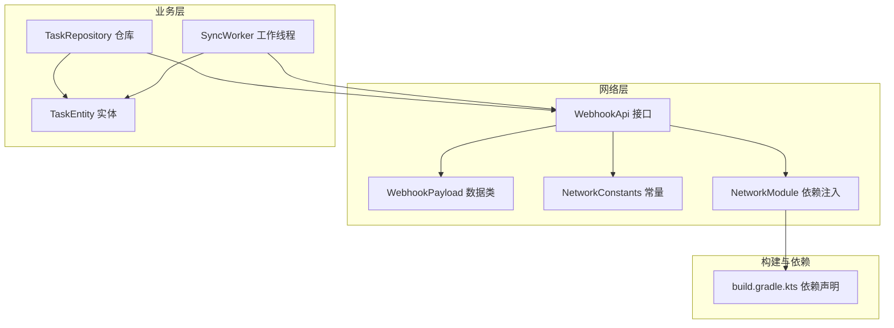
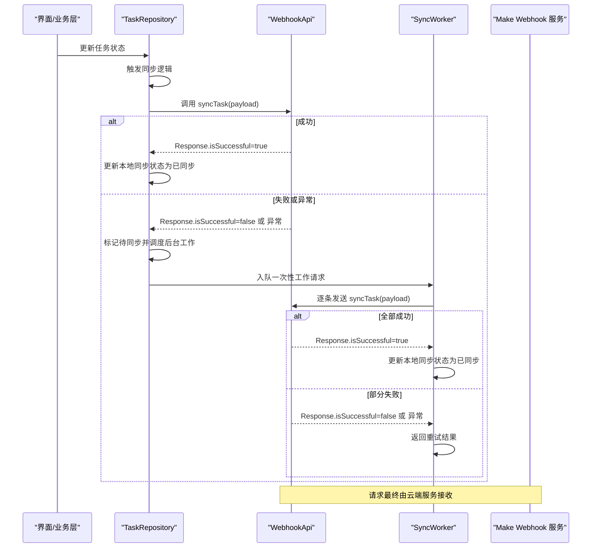
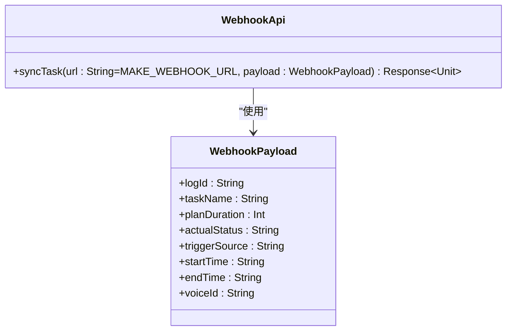
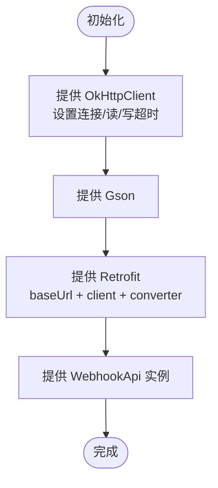
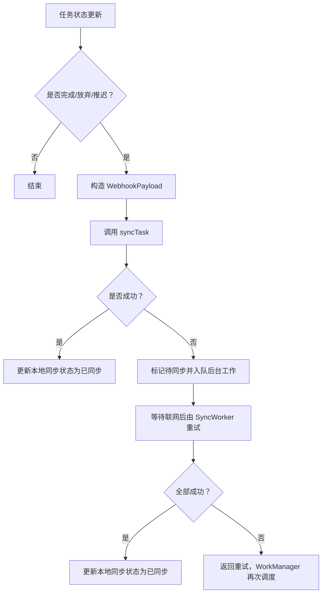
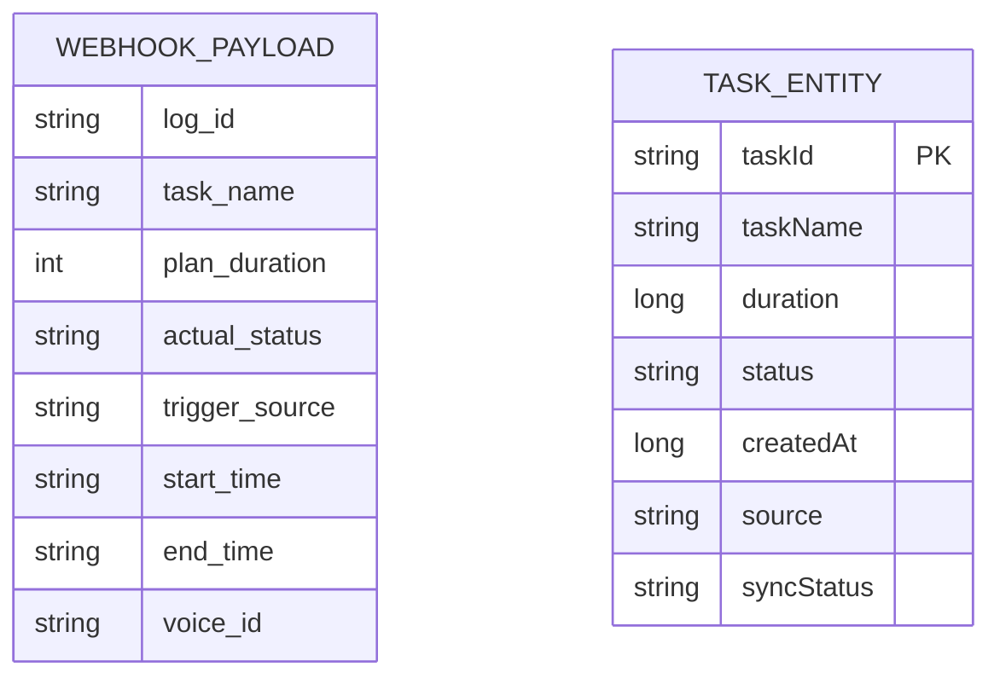
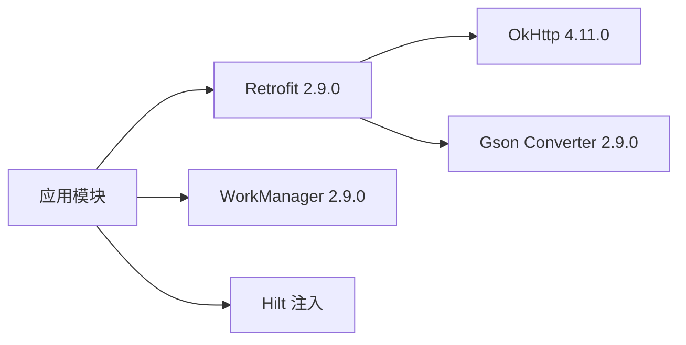

# 网络API

<cite>
**本文引用的文件**
- [WebhookApi.kt](file://app/src/main/java/com/pomodoroalert/network/WebhookApi.kt)
- [WebhookPayload.kt](file://app/src/main/java/com/pomodoroalert/data/WebhookPayload.kt)
- [NetworkConstants.kt](file://app/src/main/java/com/pomodoroalert/network/NetworkConstants.kt)
- [NetworkModule.kt](file://app/src/main/java/com/pomodoroalert/di/NetworkModule.kt)
- [SyncWorker.kt](file://app/src/main/java/com/pomodoroalert/worker/SyncWorker.kt)
- [TaskRepository.kt](file://app/src/main/java/com/pomodoroalert/data/TaskRepository.kt)
- [TaskEntity.kt](file://app/src/main/java/com/pomodoroalert/data/TaskEntity.kt)
- [build.gradle.kts](file://app/build.gradle.kts)
</cite>

## 目录
1. [简介](#简介)
2. [项目结构](#项目结构)
3. [核心组件](#核心组件)
4. [架构总览](#架构总览)
5. [详细组件分析](#详细组件分析)
6. [依赖关系分析](#依赖关系分析)
7. [性能与可靠性](#性能与可靠性)
8. [故障排查指南](#故障排查指南)
9. [结论](#结论)
10. [附录：API规范与示例](#附录api规范与示例)

## 简介
本文件面向PomodoroAlert应用的网络API，聚焦于WebhookApi接口的syncTask同步任务端点。文档从架构、数据模型、调用流程、错误处理、性能与可靠性、安全与认证、客户端示例与常见问题等维度，提供系统化说明，帮助开发者正确集成与扩展该Webhook能力。

## 项目结构
围绕网络层的关键文件组织如下：
- 接口定义：WebhookApi.kt
- 数据传输对象：WebhookPayload.kt
- 常量配置：NetworkConstants.kt
- 网络模块与依赖注入：NetworkModule.kt
- 同步工作流：SyncWorker.kt
- 业务仓库与触发逻辑：TaskRepository.kt
- 数据实体：TaskEntity.kt
- 构建脚本与依赖声明：build.gradle.kts

图表来源
- [WebhookApi.kt:1-16](file://app/src/main/java/com/pomodoroalert/network/WebhookApi.kt#L1-L16)
- [WebhookPayload.kt:1-18](file://app/src/main/java/com/pomodoroalert/data/WebhookPayload.kt#L1-L18)
- [NetworkConstants.kt:1-7](file://app/src/main/java/com/pomodoroalert/network/NetworkConstants.kt#L1-L7)
- [NetworkModule.kt:1-53](file://app/src/main/java/com/pomodoroalert/di/NetworkModule.kt#L1-L53)
- [TaskRepository.kt:1-101](file://app/src/main/java/com/pomodoroalert/data/TaskRepository.kt#L1-L101)
- [SyncWorker.kt:1-78](file://app/src/main/java/com/pomodoroalert/worker/SyncWorker.kt#L1-L78)
- [TaskEntity.kt:1-19](file://app/src/main/java/com/pomodoroalert/data/TaskEntity.kt#L1-L19)
- [build.gradle.kts:65-71](file://app/build.gradle.kts#L65-L71)

章节来源
- [WebhookApi.kt:1-16](file://app/src/main/java/com/pomodoroalert/network/WebhookApi.kt#L1-L16)
- [NetworkModule.kt:1-53](file://app/src/main/java/com/pomodoroalert/di/NetworkModule.kt#L1-L53)
- [build.gradle.kts:65-71](file://app/build.gradle.kts#L65-L71)

## 核心组件
- WebhookApi：定义syncTask端点，使用Retrofit注解声明HTTP方法、URL与请求体。
- WebhookPayload：承载同步任务的请求载荷，字段映射云端Webhook Schema。
- NetworkConstants：集中管理Webhook基础URL占位符。
- NetworkModule：提供Gson、OkHttpClient、Retrofit与WebhookApi实例，统一配置超时与序列化。
- TaskRepository：在任务状态变更完成后触发同步，直接调用WebhookApi；失败则标记待同步并调度后台工作。
- SyncWorker：离线重试工作线程，批量拉取待同步任务并逐条发送至云端。
- TaskEntity：本地数据库实体，包含任务元信息与同步状态字段。

章节来源
- [WebhookApi.kt:1-16](file://app/src/main/java/com/pomodoroalert/network/WebhookApi.kt#L1-L16)
- [WebhookPayload.kt:1-18](file://app/src/main/java/com/pomodoroalert/data/WebhookPayload.kt#L1-L18)
- [NetworkConstants.kt:1-7](file://app/src/main/java/com/pomodoroalert/network/NetworkConstants.kt#L1-L7)
- [NetworkModule.kt:1-53](file://app/src/main/java/com/pomodoroalert/di/NetworkModule.kt#L1-L53)
- [TaskRepository.kt:1-101](file://app/src/main/java/com/pomodoroalert/data/TaskRepository.kt#L1-L101)
- [SyncWorker.kt:1-78](file://app/src/main/java/com/pomodoroalert/worker/SyncWorker.kt#L1-L78)
- [TaskEntity.kt:1-19](file://app/src/main/java/com/pomodoroalert/data/TaskEntity.kt#L1-L19)

## 架构总览
下图展示从任务状态更新到云端Webhook同步的整体流程，包括直连同步与离线重试两条路径。

图表来源
- [TaskRepository.kt:32-80](file://app/src/main/java/com/pomodoroalert/data/TaskRepository.kt#L32-L80)
- [SyncWorker.kt:24-71](file://app/src/main/java/com/pomodoroalert/worker/SyncWorker.kt#L24-L71)
- [WebhookApi.kt:9-15](file://app/src/main/java/com/pomodoroalert/network/WebhookApi.kt#L9-L15)

## 详细组件分析

### WebhookApi 接口
- 定义：syncTask端点，使用HTTP POST方法。
- URL：默认使用NetworkConstants.MAKE_WEBHOOK_URL作为动态URL，可通过@Url参数覆盖。
- 请求体：WebhookPayload对象，包含任务标识、名称、计划时长、实际状态、触发来源、起止时间、语音ID等字段。
- 响应：Retrofit Response<Unit>，仅关注HTTP状态码与是否成功。
- 认证：当前实现未显式添加鉴权头，具体鉴权由Make Webhook服务端策略决定。

图表来源
- [WebhookApi.kt:9-15](file://app/src/main/java/com/pomodoroalert/network/WebhookApi.kt#L9-L15)
- [WebhookPayload.kt:8-17](file://app/src/main/java/com/pomodoroalert/data/WebhookPayload.kt#L8-L17)

章节来源
- [WebhookApi.kt:9-15](file://app/src/main/java/com/pomodoroalert/network/WebhookApi.kt#L9-L15)
- [WebhookPayload.kt:8-17](file://app/src/main/java/com/pomodoroalert/data/WebhookPayload.kt#L8-L17)

### 网络配置与依赖注入
- Retrofit基础URL：当前配置为Make Webhook的基础URL占位符，实际请求通过@Url动态传入完整地址。
- OkHttpClient超时：连接、读、写均设置为15秒。
- Gson序列化：默认Gson用于JSON转换。
- 作用域：单例提供，确保全局一致的网络行为。

图表来源
- [NetworkModule.kt:26-51](file://app/src/main/java/com/pomodoroalert/di/NetworkModule.kt#L26-L51)

章节来源
- [NetworkModule.kt:26-51](file://app/src/main/java/com/pomodoroalert/di/NetworkModule.kt#L26-L51)

### 同步触发与重试机制
- 触发时机：当任务状态变为“已完成/已放弃/推迟”时，立即尝试同步。
- 同步策略：
  - 直连同步：直接调用WebhookApi.syncTask，若失败则标记为待同步并调度后台工作。
  - 离线重试：SyncWorker遍历待同步任务，逐条发送；全部成功返回成功，否则返回重试以供WorkManager再次调度。
- 网络约束：后台工作要求设备处于联网状态。

图表来源
- [TaskRepository.kt:32-94](file://app/src/main/java/com/pomodoroalert/data/TaskRepository.kt#L32-L94)
- [SyncWorker.kt:24-71](file://app/src/main/java/com/pomodoroalert/worker/SyncWorker.kt#L24-L71)

章节来源
- [TaskRepository.kt:32-94](file://app/src/main/java/com/pomodoroalert/data/TaskRepository.kt#L32-L94)
- [SyncWorker.kt:24-71](file://app/src/main/java/com/pomodoroalert/worker/SyncWorker.kt#L24-L71)

### 数据模型与字段说明
- WebhookPayload字段映射云端Schema，字段均为字符串或整数，便于跨平台传输。
- TaskEntity包含任务主键、名称、持续时长（毫秒）、状态、创建时间、来源、同步状态等字段。

图表来源
- [WebhookPayload.kt:8-17](file://app/src/main/java/com/pomodoroalert/data/WebhookPayload.kt#L8-L17)
- [TaskEntity.kt:8-18](file://app/src/main/java/com/pomodoroalert/data/TaskEntity.kt#L8-L18)

章节来源
- [WebhookPayload.kt:8-17](file://app/src/main/java/com/pomodoroalert/data/WebhookPayload.kt#L8-L17)
- [TaskEntity.kt:8-18](file://app/src/main/java/com/pomodoroalert/data/TaskEntity.kt#L8-L18)

## 依赖关系分析
- Retrofit版本：2.9.0
- Gson转换器：2.9.0
- OkHttp版本：4.11.0
- WorkManager：2.9.0（用于离线重试）
- Hilt：用于依赖注入（在NetworkModule与Worker中体现）

图表来源
- [build.gradle.kts:67-71](file://app/build.gradle.kts#L67-L71)

章节来源
- [build.gradle.kts:67-71](file://app/build.gradle.kts#L67-L71)

## 性能与可靠性
- 超时设置：连接/读/写均为15秒，避免长时间阻塞。
- 序列化：默认Gson，简洁可靠；如需自定义字段命名或空值策略，可在GsonBuilder中扩展。
- 重试策略：
  - 直连失败：标记待同步并入队WorkManager，按系统策略重试。
  - 后台重试：SyncWorker逐条发送，全部成功才认为整体成功，否则返回重试。
- 网络约束：后台工作要求联网，减少无效请求。
- 建议优化：
  - 在GsonBuilder中启用严格模式与空值处理策略，提升健壮性。
  - 对频繁触发的任务，可考虑合并批量上报或去抖动策略，降低请求频率。
  - 在云端Webhook端对重复提交做幂等校验（基于log_id）。

[本节为通用性能建议，不直接分析具体文件]

## 故障排查指南
- 常见问题
  - 无法连接：检查网络权限与设备联网状态；确认@Url传入了有效URL。
  - 4xx/5xx：查看云端返回状态码与响应体，定位业务错误。
  - 重试循环：若多次失败，检查云端服务可用性与鉴权配置。
- 日志与调试
  - 本地异常捕获：仓库与工作线程均捕获异常并打印堆栈，便于定位。
  - 同步状态：通过本地数据库的sync_status字段判断是否已同步或待同步。
- 建议
  - 在云端Webhook端增加请求日志与错误码映射，便于快速诊断。
  - 对关键字段（如log_id）做唯一性与格式校验。

章节来源
- [TaskRepository.kt:68-78](file://app/src/main/java/com/pomodoroalert/data/TaskRepository.kt#L68-L78)
- [SyncWorker.kt:57-67](file://app/src/main/java/com/pomodoroalert/worker/SyncWorker.kt#L57-L67)

## 结论
本网络API以简洁的WebhookPayload为核心，结合Retrofit与WorkManager实现了高可靠的任务同步能力。通过直连同步与离线重试双通道，既保证实时性又兼顾弱网环境下的稳定性。建议在后续迭代中完善鉴权、日志与幂等校验，并根据业务增长引入批量上报与去抖策略。

[本节为总结性内容，不直接分析具体文件]

## 附录：API规范与示例

### syncTask 同步任务接口
- HTTP方法：POST
- URL路径：动态URL，使用@Url参数传入完整地址；默认值来自NetworkConstants.MAKE_WEBHOOK_URL。
- 请求头：无特殊头，默认使用Retrofit配置。
- 请求体：WebhookPayload JSON对象
- 响应体：无（Response<Unit>），仅依据HTTP状态码判断成功与否。
- 状态码含义
  - 200 OK：同步成功，云端已接收。
  - 4xx：客户端错误（参数缺失、鉴权失败等）。
  - 5xx：服务器内部错误，建议稍后重试。
- 错误处理机制
  - 直连失败：标记待同步并入队后台工作。
  - 后台重试：逐条发送，全部成功返回成功，否则返回重试。

章节来源
- [WebhookApi.kt:9-15](file://app/src/main/java/com/pomodoroalert/network/WebhookApi.kt#L9-L15)
- [NetworkConstants.kt:3-6](file://app/src/main/java/com/pomodoroalert/network/NetworkConstants.kt#L3-L6)
- [TaskRepository.kt:68-78](file://app/src/main/java/com/pomodoroalert/data/TaskRepository.kt#L68-L78)
- [SyncWorker.kt:57-67](file://app/src/main/java/com/pomodoroalert/worker/SyncWorker.kt#L57-L67)

### 请求与响应示例
- 请求体（JSON）字段说明
  - log_id：字符串，唯一标识本次任务日志，建议使用任务主键。
  - task_name：字符串，任务名称。
  - plan_duration：整数，分钟数，由任务持续时长换算。
  - actual_status：字符串，枚举值"Completed"/"Abandoned"/"Postponed"。
  - trigger_source：字符串，枚举值"Manual"/"Voice"/"Calendar"。
  - start_time/end_time：字符串，ISO风格时间戳（yyyy-MM-dd HH:mm:ss）。
  - voice_id：字符串，语音音色标识。
- 必填字段：log_id、task_name、plan_duration、actual_status、trigger_source、start_time、end_time、voice_id。
- 可选字段：当前实现未定义可选字段，建议云端保持向后兼容。
- 示例（请求体JSON结构示意）
  - {
      "log_id": "任务唯一ID",
      "task_name": "任务名称",
      "plan_duration": 25,
      "actual_status": "Completed",
      "trigger_source": "Manual",
      "start_time": "2025-01-01 09:00:00",
      "end_time": "2025-01-01 09:25:00",
      "voice_id": "default_voice"
    }

章节来源
- [WebhookPayload.kt:8-17](file://app/src/main/java/com/pomodoroalert/data/WebhookPayload.kt#L8-L17)
- [TaskRepository.kt:47-66](file://app/src/main/java/com/pomodoroalert/data/TaskRepository.kt#L47-L66)
- [SyncWorker.kt:36-55](file://app/src/main/java/com/pomodoroalert/worker/SyncWorker.kt#L36-L55)

### 网络配置参数
- 超时设置：连接/读/写均为15秒。
- 序列化：Gson默认配置。
- 基础URL：占位符，实际请求通过@Url传入完整地址。
- 依赖版本：Retrofit 2.9.0、OkHttp 4.11.0、Gson Converter 2.9.0、WorkManager 2.9.0。

章节来源
- [NetworkModule.kt:26-51](file://app/src/main/java/com/pomodoroalert/di/NetworkModule.kt#L26-L51)
- [build.gradle.kts:67-71](file://app/build.gradle.kts#L67-L71)

### 客户端调用示例（伪代码思路）
- 直连同步
  - 构造WebhookPayload并调用WebhookApi.syncTask。
  - 若Response.isSuccessful为true，更新本地同步状态为已同步；否则标记待同步并入队后台工作。
- 后台重试
  - SyncWorker遍历待同步任务，逐条发送；全部成功返回成功，否则返回重试。
- 注意事项
  - 确保@Url传入有效云端Webhook地址。
  - 如需鉴权，请在云端服务端策略中明确，并在客户端配合实现（当前实现未显式添加鉴权头）。

章节来源
- [TaskRepository.kt:68-94](file://app/src/main/java/com/pomodoroalert/data/TaskRepository.kt#L68-L94)
- [SyncWorker.kt:24-71](file://app/src/main/java/com/pomodoroalert/worker/SyncWorker.kt#L24-L71)

### 安全与认证
- 当前实现未在客户端显式添加鉴权头，具体鉴权策略由Make Webhook服务端决定。
- 建议
  - 在云端Webhook端启用鉴权（如签名、Token等），并在客户端实现对应头注入。
  - 对敏感字段（如voice_id）进行访问控制与审计。

[本节为通用安全建议，不直接分析具体文件]