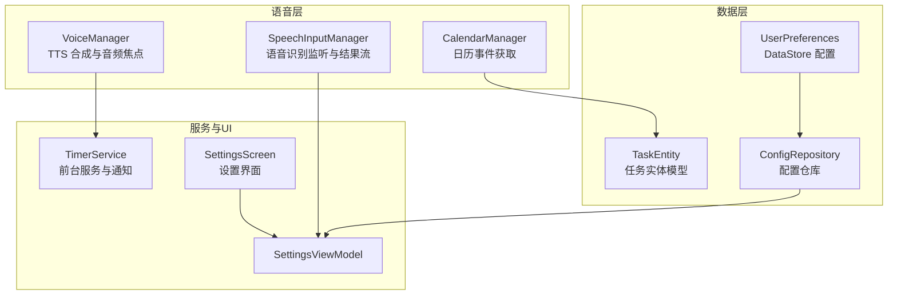
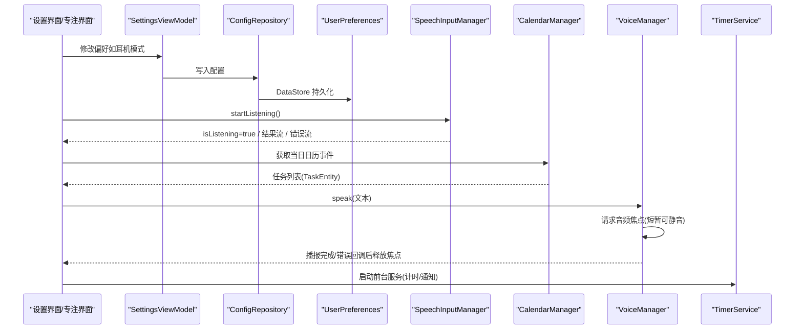
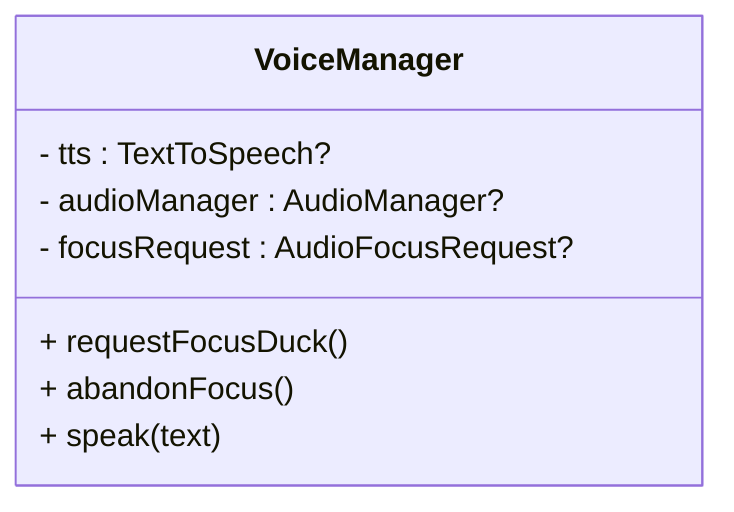
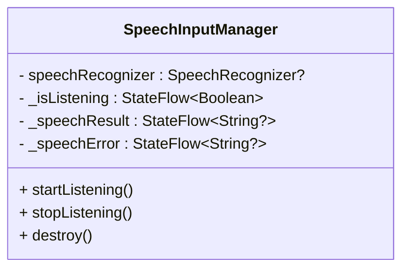
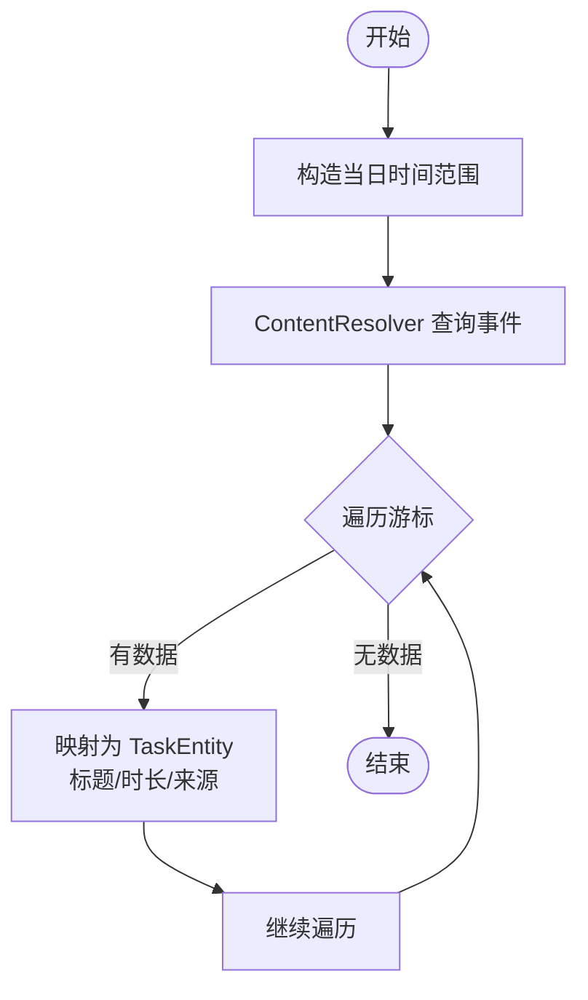
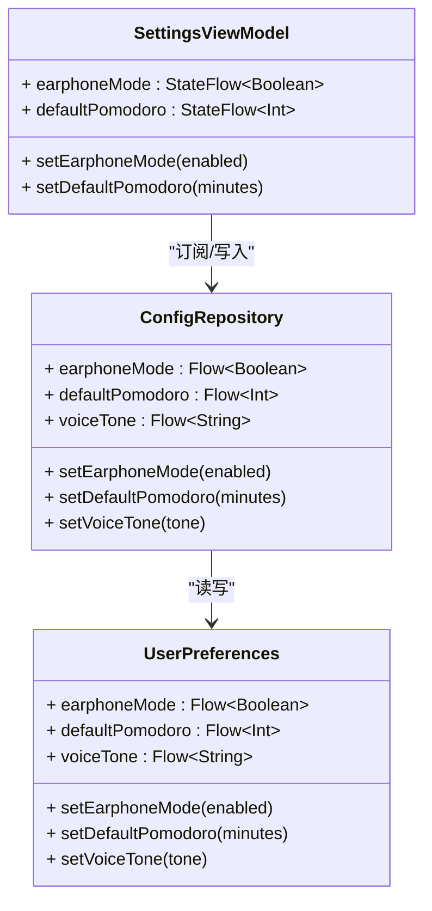
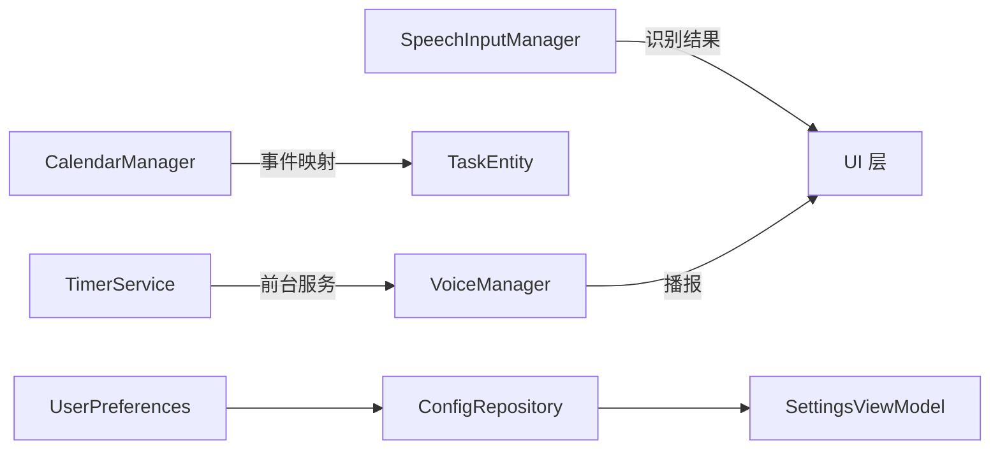

# 语音API

<cite>
**本文引用的文件**
- [VoiceManager.kt](file://app/src/main/java/com/pomodoroalert/voice/VoiceManager.kt)
- [SpeechInputManager.kt](file://app/src/main/java/com/pomodoroalert/voice/SpeechInputManager.kt)
- [CalendarManager.kt](file://app/src/main/java/com/pomodoroalert/voice/CalendarManager.kt)
- [AndroidManifest.xml](file://app/src/main/AndroidManifest.xml)
- [TaskEntity.kt](file://app/src/main/java/com/pomodoroalert/data/TaskEntity.kt)
- [TimerService.kt](file://app/src/main/java/com/pomodoroalert/service/TimerService.kt)
- [SettingsScreen.kt](file://app/src/main/java/com/pomodoroalert/ui/screens/SettingsScreen.kt)
- [SettingsViewModel.kt](file://app/src/main/java/com/pomodoroalert/ui/viewmodel/SettingsViewModel.kt)
- [ConfigRepository.kt](file://app/src/main/java/com/pomodoroalert/data/ConfigRepository.kt)
- [UserPreferences.kt](file://app/src/main/java/com/pomodoroalert/data/UserPreferences.kt)
</cite>

## 目录
1. [简介](#简介)
2. [项目结构](#项目结构)
3. [核心组件](#核心组件)
4. [架构总览](#架构总览)
5. [详细组件分析](#详细组件分析)
6. [依赖关系分析](#依赖关系分析)
7. [性能与优化](#性能与优化)
8. [故障排查指南](#故障排查指南)
9. [结论](#结论)
10. [附录](#附录)

## 简介
本文件面向开发者，系统性梳理PomodoroAlert中的语音功能API，涵盖以下内容：
- 语音合成（TTS）接口：VoiceManager 的音频焦点管理、播放控制与生命周期回调。
- 语音识别（STT）接口：SpeechInputManager 的启动/停止监听、结果流式输出与错误处理。
- 日历集成：CalendarManager 的事件获取与任务实体映射。
- 权限与后台处理：录音、日历读取权限，音频焦点策略，前台服务与通知。
- 准确性与鲁棒性：识别精度、噪声抑制、方言适配建议。
- 错误处理与性能监控：常见错误码、异常恢复、性能观测点。

## 项目结构
语音相关能力位于 voice 包，配合数据层 TaskEntity、配置层 UserPreferences/ConfigRepository、前台服务 TimerService 与 UI 设置界面协同工作。

图表来源
- [VoiceManager.kt:12-62](file://app/src/main/java/com/pomodoroalert/voice/VoiceManager.kt#L12-L62)
- [SpeechInputManager.kt:13-65](file://app/src/main/java/com/pomodoroalert/voice/SpeechInputManager.kt#L13-L65)
- [CalendarManager.kt:10-64](file://app/src/main/java/com/pomodoroalert/voice/CalendarManager.kt#L10-L64)
- [TaskEntity.kt:8-18](file://app/src/main/java/com/pomodoroalert/data/TaskEntity.kt#L8-L18)
- [TimerService.kt:24-102](file://app/src/main/java/com/pomodoroalert/service/TimerService.kt#L24-L102)
- [SettingsScreen.kt:15-61](file://app/src/main/java/com/pomodoroalert/ui/screens/SettingsScreen.kt#L15-L61)
- [SettingsViewModel.kt:14-30](file://app/src/main/java/com/pomodoroalert/ui/viewmodel/SettingsViewModel.kt#L14-L30)
- [ConfigRepository.kt:7-18](file://app/src/main/java/com/pomodoroalert/data/ConfigRepository.kt#L7-L18)
- [UserPreferences.kt:15-34](file://app/src/main/java/com/pomodoroalert/data/UserPreferences.kt#L15-L34)

章节来源
- [VoiceManager.kt:12-62](file://app/src/main/java/com/pomodoroalert/voice/VoiceManager.kt#L12-L62)
- [SpeechInputManager.kt:13-65](file://app/src/main/java/com/pomodoroalert/voice/SpeechInputManager.kt#L13-L65)
- [CalendarManager.kt:10-64](file://app/src/main/java/com/pomodoroalert/voice/CalendarManager.kt#L10-L64)
- [TaskEntity.kt:8-18](file://app/src/main/java/com/pomodoroalert/data/TaskEntity.kt#L8-L18)
- [TimerService.kt:24-102](file://app/src/main/java/com/pomodoroalert/service/TimerService.kt#L24-L102)
- [SettingsScreen.kt:15-61](file://app/src/main/java/com/pomodoroalert/ui/screens/SettingsScreen.kt#L15-L61)
- [SettingsViewModel.kt:14-30](file://app/src/main/java/com/pomodoroalert/ui/viewmodel/SettingsViewModel.kt#L14-L30)
- [ConfigRepository.kt:7-18](file://app/src/main/java/com/pomodoroalert/data/ConfigRepository.kt#L7-L18)
- [UserPreferences.kt:15-34](file://app/src/main/java/com/pomodoroalert/data/UserPreferences.kt#L15-L34)

## 核心组件
- VoiceManager：封装 TextToSpeech 初始化、音频焦点请求（短暂可静音）、TTS 播放与结束回调释放焦点。
- SpeechInputManager：封装 SpeechRecognizer 的创建、RecognitionListener 回调、状态流（是否在听、识别结果、错误信息）与生命周期销毁。
- CalendarManager：基于 ContentResolver 查询当日日历事件，映射为 TaskEntity 列表。
- TimerService：前台服务驱动计时与通知更新，用于语音播报场景下的持续运行环境。
- 配置层：UserPreferences/ConfigRepository 提供耳机模式、默认时长、音色等配置项，SettingsScreen/SettingsViewModel 提供 UI 展示与写入。

章节来源
- [VoiceManager.kt:12-62](file://app/src/main/java/com/pomodoroalert/voice/VoiceManager.kt#L12-L62)
- [SpeechInputManager.kt:13-65](file://app/src/main/java/com/pomodoroalert/voice/SpeechInputManager.kt#L13-L65)
- [CalendarManager.kt:10-64](file://app/src/main/java/com/pomodoroalert/voice/CalendarManager.kt#L10-L64)
- [TaskEntity.kt:8-18](file://app/src/main/java/com/pomodoroalert/data/TaskEntity.kt#L8-L18)
- [TimerService.kt:24-102](file://app/src/main/java/com/pomodoroalert/service/TimerService.kt#L24-L102)
- [SettingsScreen.kt:15-61](file://app/src/main/java/com/pomodoroalert/ui/screens/SettingsScreen.kt#L15-L61)
- [SettingsViewModel.kt:14-30](file://app/src/main/java/com/pomodoroalert/ui/viewmodel/SettingsViewModel.kt#L14-L30)
- [ConfigRepository.kt:7-18](file://app/src/main/java/com/pomodoroalert/data/ConfigRepository.kt#L7-L18)
- [UserPreferences.kt:15-34](file://app/src/main/java/com/pomodoroalert/data/UserPreferences.kt#L15-L34)

## 架构总览
语音功能在应用内的交互路径如下：

图表来源
- [SettingsScreen.kt:15-61](file://app/src/main/java/com/pomodoroalert/ui/screens/SettingsScreen.kt#L15-L61)
- [SettingsViewModel.kt:14-30](file://app/src/main/java/com/pomodoroalert/ui/viewmodel/SettingsViewModel.kt#L14-L30)
- [ConfigRepository.kt:7-18](file://app/src/main/java/com/pomodoroalert/data/ConfigRepository.kt#L7-L18)
- [UserPreferences.kt:15-34](file://app/src/main/java/com/pomodoroalert/data/UserPreferences.kt#L15-L34)
- [SpeechInputManager.kt:13-65](file://app/src/main/java/com/pomodoroalert/voice/SpeechInputManager.kt#L13-L65)
- [CalendarManager.kt:10-64](file://app/src/main/java/com/pomodoroalert/voice/CalendarManager.kt#L10-L64)
- [VoiceManager.kt:12-62](file://app/src/main/java/com/pomodoroalert/voice/VoiceManager.kt#L12-L62)
- [TimerService.kt:24-102](file://app/src/main/java/com/pomodoroalert/service/TimerService.kt#L24-L102)

## 详细组件分析

### VoiceManager（TTS 语音合成）
- 职责
  - 初始化 TextToSpeech 并设置默认语言。
  - 通过 AudioFocusRequest 申请“短暂可静音”的音频焦点，避免打断其他媒体。
  - 使用 USAGE_ALARM + CONTENT_TYPE_SPEECH 的音频属性进行播报。
  - 在 TTS 播放完成或出错时释放音频焦点。
- 关键方法
  - requestFocusDuck()：构建 AudioFocusRequest 并请求焦点。
  - abandonFocus()：释放已申请的焦点。
  - speak(text)：设置音频属性并播放文本，注册 UtteranceProgressListener 在完成/错误时释放焦点。
- 使用建议
  - 在需要播报的场景（如计时结束、任务变更）调用 speak。
  - 若需在耳机模式下播报，结合配置层的耳机模式开关进行条件判断后再调用。
- 生命周期
  - 由上层组件持有并在合适时机释放；注意在 Activity/Fragment 销毁前避免悬挂引用。

图表来源
- [VoiceManager.kt:12-62](file://app/src/main/java/com/pomodoroalert/voice/VoiceManager.kt#L12-L62)

章节来源
- [VoiceManager.kt:12-62](file://app/src/main/java/com/pomodoroalert/voice/VoiceManager.kt#L12-L62)

### SpeechInputManager（语音识别）
- 职责
  - 创建并配置 SpeechRecognizer，设置 RecognitionListener。
  - 暴露 isListening、speechResult、speechError 三个 StateFlow 供 UI 订阅。
  - 提供 startListening、stopListening、destroy 方法。
- 关键行为
  - onReadyForSpeech/onEndOfSpeech 控制 isListening 状态。
  - onResults 解析 RESULTS_RECOGNITION 第一个候选项作为最终结果。
  - onError 将错误码封装为用户可读提示并清空监听状态。
- 使用建议
  - 在 UI 中订阅 isListening/speechResult/speechError，实现“按下说话-显示结果-错误提示”的闭环。
  - 识别前确保设备具备可用的语音引擎（系统自带或第三方）。
- 复杂度与性能
  - 识别过程为异步回调，UI 不阻塞；结果流为单值（首个最佳候选），避免过度计算。

图表来源
- [SpeechInputManager.kt:13-65](file://app/src/main/java/com/pomodoroalert/voice/SpeechInputManager.kt#L13-L65)

章节来源
- [SpeechInputManager.kt:13-65](file://app/src/main/java/com/pomodoroalert/voice/SpeechInputManager.kt#L13-L65)

### CalendarManager（日历集成）
- 职责
  - 查询当日日历事件，投影标题、开始/结束时间。
  - 将日历事件映射为 TaskEntity 列表，便于后续任务管理与语音播报。
- 查询范围
  - 当日 00:00:00 至 23:59:59。
- 映射规则
  - 标题为空时回退为“未命名任务”。
  - 时长 duration 优先使用结束-开始，否则回退为 25 分钟。
  - 来源 source 设为“日历”，便于区分任务来源。
- 使用建议
  - 在“今日任务”或“语音创建任务”场景调用，结合 UI 展示与用户确认。

图表来源
- [CalendarManager.kt:10-64](file://app/src/main/java/com/pomodoroalert/voice/CalendarManager.kt#L10-L64)
- [TaskEntity.kt:8-18](file://app/src/main/java/com/pomodoroalert/data/TaskEntity.kt#L8-L18)

章节来源
- [CalendarManager.kt:10-64](file://app/src/main/java/com/pomodoroalert/voice/CalendarManager.kt#L10-L64)
- [TaskEntity.kt:8-18](file://app/src/main/java/com/pomodoroalert/data/TaskEntity.kt#L8-L18)

### 配置与设置（耳机模式、默认时长、音色）
- 配置项
  - 耳机模式：仅在耳机插入时播报。
  - 默认专注时长：分钟级滑条设置。
  - 语音音色：字符串键值（当前默认“default”）。
- 数据存储
  - UserPreferences 基于 DataStore 存储布尔/整数/字符串键值。
  - ConfigRepository 暴露 StateFlow 供 ViewModel 订阅。
- UI 层
  - SettingsScreen 提供卡片式设置项与滑条控件。
  - SettingsViewModel 读取与写入配置。

图表来源
- [UserPreferences.kt:15-34](file://app/src/main/java/com/pomodoroalert/data/UserPreferences.kt#L15-L34)
- [ConfigRepository.kt:7-18](file://app/src/main/java/com/pomodoroalert/data/ConfigRepository.kt#L7-L18)
- [SettingsScreen.kt:15-61](file://app/src/main/java/com/pomodoroalert/ui/screens/SettingsScreen.kt#L15-L61)
- [SettingsViewModel.kt:14-30](file://app/src/main/java/com/pomodoroalert/ui/viewmodel/SettingsViewModel.kt#L14-L30)

章节来源
- [UserPreferences.kt:15-34](file://app/src/main/java/com/pomodoroalert/data/UserPreferences.kt#L15-L34)
- [ConfigRepository.kt:7-18](file://app/src/main/java/com/pomodoroalert/data/ConfigRepository.kt#L7-L18)
- [SettingsScreen.kt:15-61](file://app/src/main/java/com/pomodoroalert/ui/screens/SettingsScreen.kt#L15-L61)
- [SettingsViewModel.kt:14-30](file://app/src/main/java/com/pomodoroalert/ui/viewmodel/SettingsViewModel.kt#L14-L30)

## 依赖关系分析
- 组件耦合
  - VoiceManager 与 AudioManager/TextToSpeech 强耦合，但通过 Context 注入降低模块间直接依赖。
  - SpeechInputManager 与 SpeechRecognizer/RecognitionListener 强耦合，状态通过 Kotlin Flow 对外暴露。
  - CalendarManager 依赖 Android Provider（日历），返回领域模型 TaskEntity。
  - TimerService 为前台服务，与 VoiceManager 协同在后台播报。
- 外部依赖
  - Android 系统语音引擎（STT/TTS）。
  - DataStore（配置持久化）。
  - AndroidManifest 权限声明（RECORD_AUDIO、READ_CALENDAR）。

图表来源
- [SpeechInputManager.kt:13-65](file://app/src/main/java/com/pomodoroalert/voice/SpeechInputManager.kt#L13-L65)
- [CalendarManager.kt:10-64](file://app/src/main/java/com/pomodoroalert/voice/CalendarManager.kt#L10-L64)
- [TaskEntity.kt:8-18](file://app/src/main/java/com/pomodoroalert/data/TaskEntity.kt#L8-L18)
- [VoiceManager.kt:12-62](file://app/src/main/java/com/pomodoroalert/voice/VoiceManager.kt#L12-L62)
- [TimerService.kt:24-102](file://app/src/main/java/com/pomodoroalert/service/TimerService.kt#L24-L102)
- [ConfigRepository.kt:7-18](file://app/src/main/java/com/pomodoroalert/data/ConfigRepository.kt#L7-L18)
- [UserPreferences.kt:15-34](file://app/src/main/java/com/pomodoroalert/data/UserPreferences.kt#L15-L34)

章节来源
- [SpeechInputManager.kt:13-65](file://app/src/main/java/com/pomodoroalert/voice/SpeechInputManager.kt#L13-L65)
- [CalendarManager.kt:10-64](file://app/src/main/java/com/pomodoroalert/voice/CalendarManager.kt#L10-L64)
- [TaskEntity.kt:8-18](file://app/src/main/java/com/pomodoroalert/data/TaskEntity.kt#L8-L18)
- [VoiceManager.kt:12-62](file://app/src/main/java/com/pomodoroalert/voice/VoiceManager.kt#L12-L62)
- [TimerService.kt:24-102](file://app/src/main/java/com/pomodoroalert/service/TimerService.kt#L24-L102)
- [ConfigRepository.kt:7-18](file://app/src/main/java/com/pomodoroalert/data/ConfigRepository.kt#L7-L18)
- [UserPreferences.kt:15-34](file://app/src/main/java/com/pomodoroalert/data/UserPreferences.kt#L15-L34)

## 性能与优化
- 识别精度与稳定性
  - 使用自由语模型（LANGUAGE_MODEL_FREE_FORM）提升通用场景识别率。
  - 在嘈杂环境下建议增加“安静环境”提示，引导用户靠近麦克风或减少背景噪音。
  - 对于方言/口音差异较大的用户，可在设置中提供“方言适配”开关（若系统支持），或引导至系统语言设置。
- 噪声抑制
  - 语音识别通常由系统引擎处理，应用侧可通过 UI 提示用户在安静环境使用。
  - 若需自定义降噪，可考虑引入第三方 SDK（需评估合规与性能影响）。
- 后台与电量
  - 使用前台服务（TimerService）保障播报与计时稳定性，避免被系统回收。
  - TTS 播放完成后及时释放音频焦点，避免长时间占用音频资源。
- 流式结果与内存
  - 识别结果仅保留最佳候选，避免对多候选排序带来的额外开销。
  - UI 订阅 StateFlow，避免重复解析与频繁重组。

[本节为通用指导，不直接分析具体文件]

## 故障排查指南
- 识别错误码
  - onError 回调会将错误码封装为用户提示，常见错误包括网络问题、无可用引擎、超时等。
  - 建议在 UI 层展示简明提示并提供“重试/切换手动输入”入口。
- 权限问题
  - 录音权限：RECORD_AUDIO。
  - 日历读取权限：READ_CALENDAR。
  - 若权限未授予，识别/日历查询会失败，需引导用户前往设置授权。
- 音频焦点冲突
  - 若其他应用长时间占用音频焦点，可能导致播报延迟或无声。
  - VoiceManager 已采用短暂可静音策略，必要时可提示用户关闭其他媒体应用。
- 前台服务与通知
  - TimerService 为前台服务，若通知被误删或权限不足，可能影响播报与计时。
  - 建议在设置中提供“前台服务类型”与“通知权限”检查入口。

章节来源
- [SpeechInputManager.kt:33-36](file://app/src/main/java/com/pomodoroalert/voice/SpeechInputManager.kt#L33-L36)
- [AndroidManifest.xml:7-8](file://app/src/main/AndroidManifest.xml#L7-L8)
- [VoiceManager.kt:28-43](file://app/src/main/java/com/pomodoroalert/voice/VoiceManager.kt#L28-L43)
- [TimerService.kt:24-102](file://app/src/main/java/com/pomodoroalert/service/TimerService.kt#L24-L102)

## 结论
本语音API围绕 TTS 与 STT 的基础能力构建，结合日历事件映射与前台服务播报，形成从“语音输入—任务创建—语音播报—计时提醒”的完整链路。通过配置层与 UI 层解耦，开发者可按需扩展方言适配、音色定制与后台稳定性策略。

[本节为总结性内容，不直接分析具体文件]

## 附录

### API 参考与使用示例（路径指引）
- 语音识别
  - 开始监听：[SpeechInputManager.startListening:48-54](file://app/src/main/java/com/pomodoroalert/voice/SpeechInputManager.kt#L48-L54)
  - 停止监听：[SpeechInputManager.stopListening:57-59](file://app/src/main/java/com/pomodoroalert/voice/SpeechInputManager.kt#L57-L59)
  - 结果与错误订阅：[SpeechInputManager.isListening/speechResult/speechError:16-23](file://app/src/main/java/com/pomodoroalert/voice/SpeechInputManager.kt#L16-L23)
- 语音合成
  - 播报文本：[VoiceManager.speak:46-61](file://app/src/main/java/com/pomodoroalert/voice/VoiceManager.kt#L46-L61)
  - 申请/释放音频焦点：[VoiceManager.requestFocusDuck/abandonFocus:29-43](file://app/src/main/java/com/pomodoroalert/voice/VoiceManager.kt#L29-L43)
- 日历集成
  - 获取当日事件：[CalendarManager.fetchTodayEvents:11-64](file://app/src/main/java/com/pomodoroalert/voice/CalendarManager.kt#L11-L64)
  - 任务实体字段：[TaskEntity:8-18](file://app/src/main/java/com/pomodoroalert/data/TaskEntity.kt#L8-L18)
- 配置与设置
  - 设置界面：[SettingsScreen:15-61](file://app/src/main/java/com/pomodoroalert/ui/screens/SettingsScreen.kt#L15-L61)
  - 设置视图模型：[SettingsViewModel:14-30](file://app/src/main/java/com/pomodoroalert/ui/viewmodel/SettingsViewModel.kt#L14-L30)
  - 配置仓库：[ConfigRepository:7-18](file://app/src/main/java/com/pomodoroalert/data/ConfigRepository.kt#L7-L18)
  - 用户偏好：[UserPreferences:15-34](file://app/src/main/java/com/pomodoroalert/data/UserPreferences.kt#L15-L34)
- 权限与前台服务
  - 权限声明：[AndroidManifest.xml:7-8](file://app/src/main/AndroidManifest.xml#L7-L8)
  - 前台服务：[TimerService:24-102](file://app/src/main/java/com/pomodoroalert/service/TimerService.kt#L24-L102)

### 错误处理与性能监控建议
- 错误处理
  - 识别错误：UI 层订阅 speechError，展示简明提示并提供重试/手动输入入口。
  - 权限缺失：检测权限状态并在设置页引导授权。
  - 音频焦点：在播报完成后统一释放，避免长期占用。
- 性能监控
  - 识别耗时：记录 startListening 到 onResults 的时延。
  - 播报时延：记录 speak 调用到 onDone 的时延。
  - 前台服务存活：监控通知与服务状态，异常时重启服务并弹出提示。

[本节为通用指导，不直接分析具体文件]