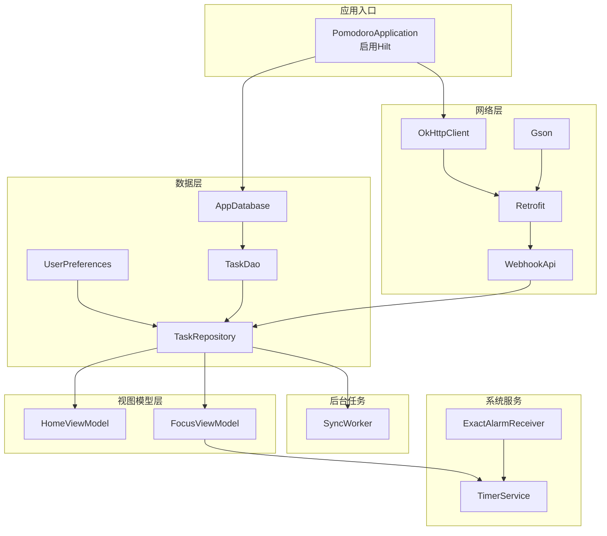
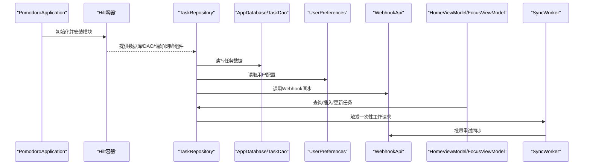
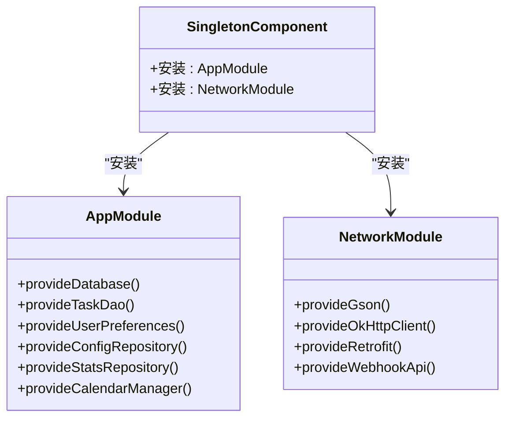
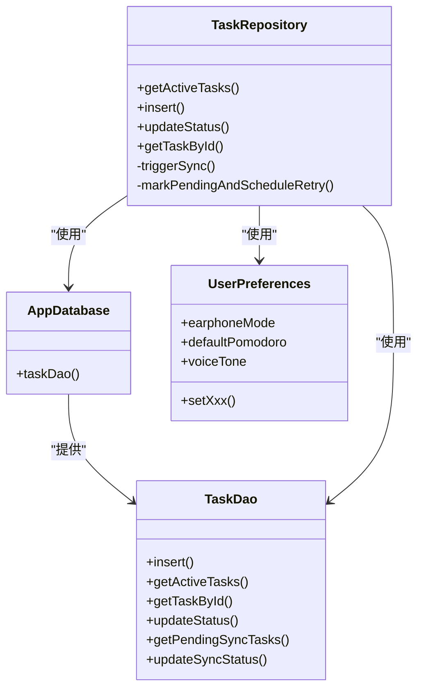
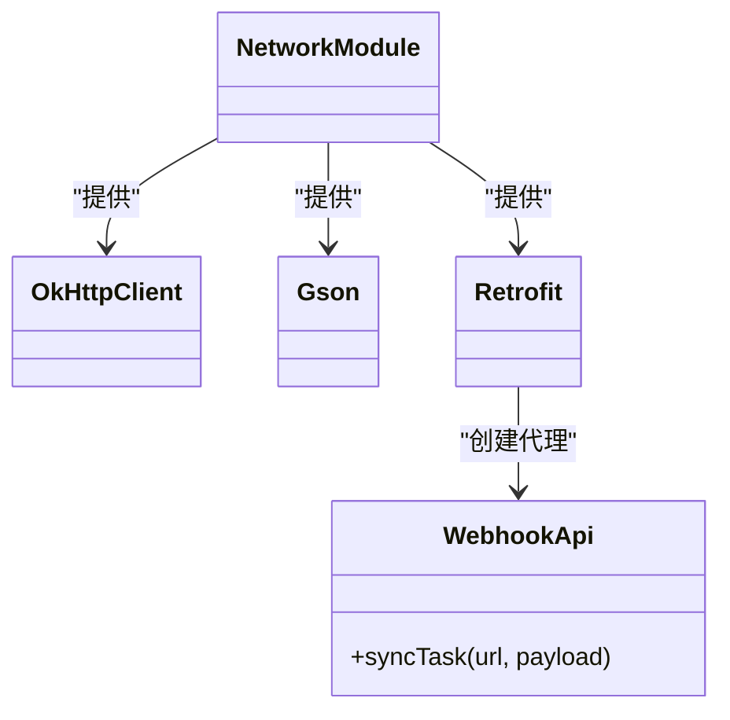
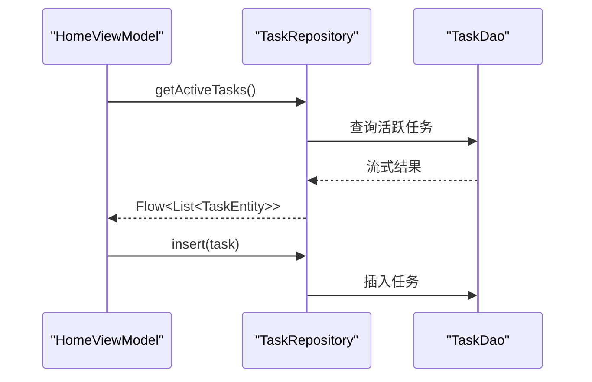
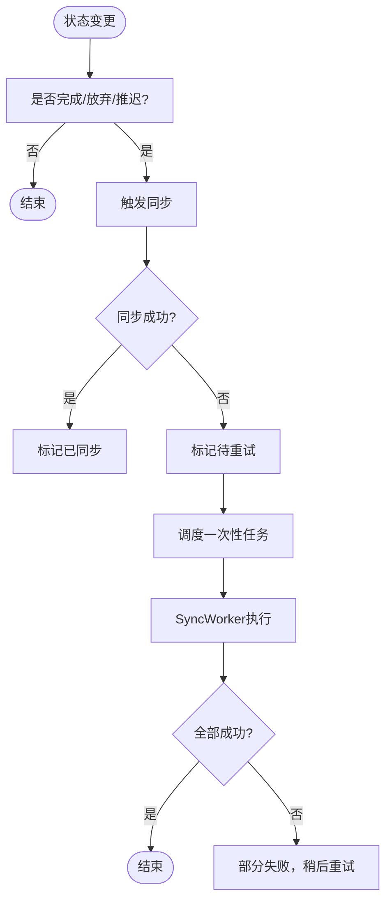
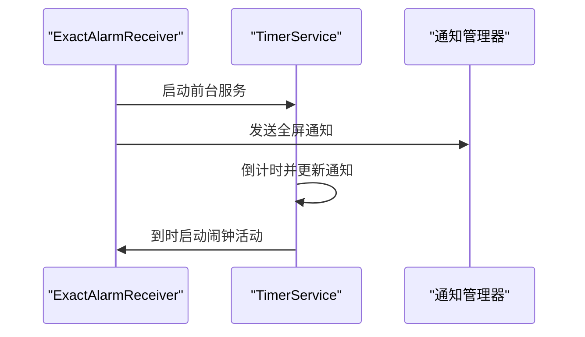
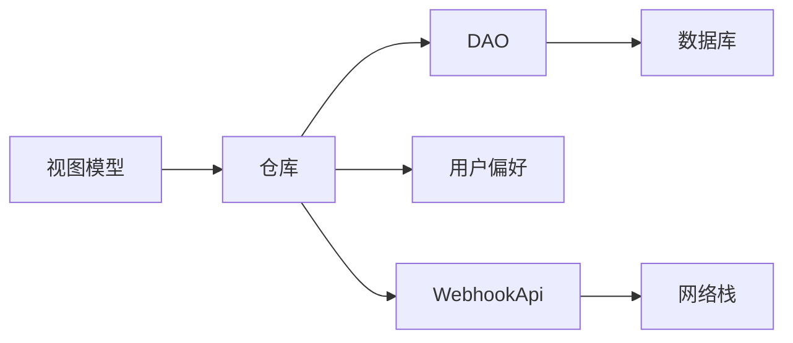

# 依赖注入

<cite>
**本文引用的文件**
- [AppModule.kt](file://app/src/main/java/com/pomodoroalert/di/AppModule.kt)
- [NetworkModule.kt](file://app/src/main/java/com/pomodoroalert/di/NetworkModule.kt)
- [PomodoroApplication.kt](file://app/src/main/java/com/pomodoroalert/PomodoroApplication.kt)
- [AppDatabase.kt](file://app/src/main/java/com/pomodoroalert/data/AppDatabase.kt)
- [TaskDao.kt](file://app/src/main/java/com/pomodoroalert/data/TaskDao.kt)
- [UserPreferences.kt](file://app/src/main/java/com/pomodoroalert/data/UserPreferences.kt)
- [TaskRepository.kt](file://app/src/main/java/com/pomodoroalert/data/TaskRepository.kt)
- [WebhookApi.kt](file://app/src/main/java/com/pomodoroalert/network/WebhookApi.kt)
- [NetworkConstants.kt](file://app/src/main/java/com/pomodoroalert/network/NetworkConstants.kt)
- [HomeViewModel.kt](file://app/src/main/java/com/pomodoroalert/ui/viewmodel/HomeViewModel.kt)
- [FocusViewModel.kt](file://app/src/main/java/com/pomodoroalert/ui/viewmodel/FocusViewModel.kt)
- [SyncWorker.kt](file://app/src/main/java/com/pomodoroalert/worker/SyncWorker.kt)
- [TimerService.kt](file://app/src/main/java/com/pomodoroalert/service/TimerService.kt)
- [ExactAlarmReceiver.kt](file://app/src/main/java/com/pomodoroalert/receiver/ExactAlarmReceiver.kt)
- [app/build.gradle.kts](file://app/build.gradle.kts)
</cite>

## 目录
1. [引言](#引言)
2. [项目结构](#项目结构)
3. [核心组件](#核心组件)
4. [架构总览](#架构总览)
5. [详细组件分析](#详细组件分析)
6. [依赖关系分析](#依赖关系分析)
7. [性能考虑](#性能考虑)
8. [故障排查指南](#故障排查指南)
9. [结论](#结论)
10. [附录](#附录)

## 引言
本文件面向PomodoroAlert应用的依赖注入体系，基于Hilt框架进行系统化梳理与说明。内容涵盖模块定义、组件层次、作用域管理、跨层依赖注入策略、设计原则与最佳实践、调试技巧、性能优化以及单元与集成测试策略。读者无需深入掌握Hilt即可理解整体架构与注入配置。

## 项目结构
应用采用按功能分层与按模块划分相结合的组织方式：
- 应用入口与全局配置：Application类启用Hilt，构建全局单例容器
- 数据层（data）：Room数据库、DAO接口、仓库与偏好存储
- 网络层（network）：Retrofit客户端与Webhook接口
- 视图模型（ui/viewmodel）：使用HiltViewModel注解的MVVM组件
- 后台任务（worker）：使用HiltWorker的后台同步任务
- 其他组件：服务、广播接收器等

图表来源
- [PomodoroApplication.kt:1-8](file://app/src/main/java/com/pomodoroalert/PomodoroApplication.kt#L1-L8)
- [AppModule.kt:19-60](file://app/src/main/java/com/pomodoroalert/di/AppModule.kt#L19-L60)
- [NetworkModule.kt:16-52](file://app/src/main/java/com/pomodoroalert/di/NetworkModule.kt#L16-L52)
- [AppDatabase.kt:6-9](file://app/src/main/java/com/pomodoroalert/data/AppDatabase.kt#L6-L9)
- [TaskDao.kt:10-28](file://app/src/main/java/com/pomodoroalert/data/TaskDao.kt#L10-L28)
- [UserPreferences.kt:15-35](file://app/src/main/java/com/pomodoroalert/data/UserPreferences.kt#L15-L35)
- [TaskRepository.kt:19-25](file://app/src/main/java/com/pomodoroalert/data/TaskRepository.kt#L19-L25)
- [WebhookApi.kt:9-15](file://app/src/main/java/com/pomodoroalert/network/WebhookApi.kt#L9-L15)
- [HomeViewModel.kt:15-19](file://app/src/main/java/com/pomodoroalert/ui/viewmodel/HomeViewModel.kt#L15-L19)
- [FocusViewModel.kt:21-24](file://app/src/main/java/com/pomodoroalert/ui/viewmodel/FocusViewModel.kt#L21-L24)
- [SyncWorker.kt:15-22](file://app/src/main/java/com/pomodoroalert/worker/SyncWorker.kt#L15-L22)
- [TimerService.kt:24-103](file://app/src/main/java/com/pomodoroalert/service/TimerService.kt#L24-L103)
- [ExactAlarmReceiver.kt:13-49](file://app/src/main/java/com/pomodoroalert/receiver/ExactAlarmReceiver.kt#L13-L49)

章节来源
- [PomodoroApplication.kt:1-8](file://app/src/main/java/com/pomodoroalert/PomodoroApplication.kt#L1-L8)
- [app/build.gradle.kts:1-81](file://app/build.gradle.kts#L1-L81)

## 核心组件
- 应用级入口：通过注解启用Hilt，使全局单例容器可用
- 模块化提供者：
  - 数据模块：提供数据库、DAO、用户偏好、统计与配置仓库
  - 网络模块：提供OkHttp、Gson、Retrofit与Webhook接口
- 业务组件：
  - 仓库：封装数据访问与业务逻辑（如任务状态变更与Webhook同步）
  - 视图模型：声明式状态与交互逻辑，依赖仓库
  - 后台任务：周期性或一次性执行的离线重试
- 系统组件：前台服务与闹钟广播接收器

章节来源
- [AppModule.kt:19-60](file://app/src/main/java/com/pomodoroalert/di/AppModule.kt#L19-L60)
- [NetworkModule.kt:16-52](file://app/src/main/java/com/pomodoroalert/di/NetworkModule.kt#L16-L52)
- [TaskRepository.kt:19-25](file://app/src/main/java/com/pomodoroalert/data/TaskRepository.kt#L19-L25)
- [HomeViewModel.kt:15-19](file://app/src/main/java/com/pomodoroalert/ui/viewmodel/HomeViewModel.kt#L15-L19)
- [FocusViewModel.kt:21-24](file://app/src/main/java/com/pomodoroalert/ui/viewmodel/FocusViewModel.kt#L21-L24)
- [SyncWorker.kt:15-22](file://app/src/main/java/com/pomodoroalert/worker/SyncWorker.kt#L15-L22)

## 架构总览
下图展示从应用启动到各层组件协作的依赖注入流程与调用链：

图表来源
- [PomodoroApplication.kt:6-7](file://app/src/main/java/com/pomodoroalert/PomodoroApplication.kt#L6-L7)
- [AppModule.kt:23-59](file://app/src/main/java/com/pomodoroalert/di/AppModule.kt#L23-L59)
- [NetworkModule.kt:20-51](file://app/src/main/java/com/pomodoroalert/di/NetworkModule.kt#L20-L51)
- [TaskRepository.kt:20-94](file://app/src/main/java/com/pomodoroalert/data/TaskRepository.kt#L20-L94)
- [HomeViewModel.kt:16-51](file://app/src/main/java/com/pomodoroalert/ui/viewmodel/HomeViewModel.kt#L16-L51)
- [FocusViewModel.kt:22-83](file://app/src/main/java/com/pomodoroalert/ui/viewmodel/FocusViewModel.kt#L22-L83)
- [SyncWorker.kt:24-71](file://app/src/main/java/com/pomodoroalert/worker/SyncWorker.kt#L24-L71)

## 详细组件分析

### 模块与组件层次
- 组件层次：所有模块安装在单例组件上，确保全局唯一实例
- 模块职责：
  - 数据模块：集中提供数据库、DAO、用户偏好、仓库
  - 网络模块：集中提供网络栈（OkHttp、Gson、Retrofit、API）

图表来源
- [AppModule.kt:20-60](file://app/src/main/java/com/pomodoroalert/di/AppModule.kt#L20-L60)
- [NetworkModule.kt:17-52](file://app/src/main/java/com/pomodoroalert/di/NetworkModule.kt#L17-L52)

章节来源
- [AppModule.kt:19-60](file://app/src/main/java/com/pomodoroalert/di/AppModule.kt#L19-L60)
- [NetworkModule.kt:16-52](file://app/src/main/java/com/pomodoroalert/di/NetworkModule.kt#L16-L52)

### 数据层注入与仓库模式
- 数据库与DAO：通过Room提供单例数据库与DAO实例
- 用户偏好：DataStore封装的偏好读写
- 仓库：聚合DAO与偏好，负责业务规则与同步触发
- 作用域：仓库标注单例，确保状态一致性与资源复用

图表来源
- [AppDatabase.kt:6-9](file://app/src/main/java/com/pomodoroalert/data/AppDatabase.kt#L6-L9)
- [TaskDao.kt:10-28](file://app/src/main/java/com/pomodoroalert/data/TaskDao.kt#L10-L28)
- [UserPreferences.kt:15-35](file://app/src/main/java/com/pomodoroalert/data/UserPreferences.kt#L15-L35)
- [TaskRepository.kt:19-94](file://app/src/main/java/com/pomodoroalert/data/TaskRepository.kt#L19-L94)

章节来源
- [AppDatabase.kt:6-9](file://app/src/main/java/com/pomodoroalert/data/AppDatabase.kt#L6-L9)
- [TaskDao.kt:10-28](file://app/src/main/java/com/pomodoroalert/data/TaskDao.kt#L10-L28)
- [UserPreferences.kt:15-35](file://app/src/main/java/com/pomodoroalert/data/UserPreferences.kt#L15-L35)
- [TaskRepository.kt:19-94](file://app/src/main/java/com/pomodoroalert/data/TaskRepository.kt#L19-L94)

### 网络层注入与Webhook集成
- 客户端：OkHttp提供连接、读写超时
- 序列化：Gson用于JSON转换
- 适配器：Retrofit创建API代理
- 接口：WebhookApi定义同步接口，支持动态URL

图表来源
- [NetworkModule.kt:20-51](file://app/src/main/java/com/pomodoroalert/di/NetworkModule.kt#L20-L51)
- [WebhookApi.kt:9-15](file://app/src/main/java/com/pomodoroalert/network/WebhookApi.kt#L9-L15)

章节来源
- [NetworkModule.kt:16-52](file://app/src/main/java/com/pomodoroalert/di/NetworkModule.kt#L16-L52)
- [WebhookApi.kt:9-15](file://app/src/main/java/com/pomodoroalert/network/WebhookApi.kt#L9-L15)
- [NetworkConstants.kt:3-6](file://app/src/main/java/com/pomodoroalert/network/NetworkConstants.kt#L3-L6)

### 视图模型与生命周期注入
- 使用HiltViewModel注解，自动注入仓库与上下文
- HomeViewModel：订阅活跃任务流，新增任务
- FocusViewModel：启动前台服务、设置闹钟、完成/放弃任务

图表来源
- [HomeViewModel.kt:16-32](file://app/src/main/java/com/pomodoroalert/ui/viewmodel/HomeViewModel.kt#L16-L32)
- [TaskRepository.kt:20-31](file://app/src/main/java/com/pomodoroalert/data/TaskRepository.kt#L20-L31)
- [TaskDao.kt:14-15](file://app/src/main/java/com/pomodoroalert/data/TaskDao.kt#L14-L15)

章节来源
- [HomeViewModel.kt:15-53](file://app/src/main/java/com/pomodoroalert/ui/viewmodel/HomeViewModel.kt#L15-L53)
- [FocusViewModel.kt:21-85](file://app/src/main/java/com/pomodoroalert/ui/viewmodel/FocusViewModel.kt#L21-L85)

### 后台任务与离线重试
- 仓库在任务状态变更时触发同步；失败或未完成的任务进入待重试队列
- SyncWorker轮询待重试任务，逐条调用Webhook并更新状态
- 使用HiltWorker与AssistedInject注入依赖

图表来源
- [TaskRepository.kt:32-94](file://app/src/main/java/com/pomodoroalert/data/TaskRepository.kt#L32-L94)
- [SyncWorker.kt:24-71](file://app/src/main/java/com/pomodoroalert/worker/SyncWorker.kt#L24-L71)

章节来源
- [TaskRepository.kt:32-94](file://app/src/main/java/com/pomodoroalert/data/TaskRepository.kt#L32-L94)
- [SyncWorker.kt:15-78](file://app/src/main/java/com/pomodoroalert/worker/SyncWorker.kt#L15-L78)

### 系统服务与闹钟集成
- TimerService：前台服务，显示通知并倒计时
- ExactAlarmReceiver：闹钟触发后启动服务并弹出全屏通知
- WakeLockManager：在广播接收器中获取唤醒锁以保证执行

图表来源
- [ExactAlarmReceiver.kt:14-47](file://app/src/main/java/com/pomodoroalert/receiver/ExactAlarmReceiver.kt#L14-L47)
- [TimerService.kt:38-66](file://app/src/main/java/com/pomodoroalert/service/TimerService.kt#L38-L66)

章节来源
- [TimerService.kt:24-103](file://app/src/main/java/com/pomodoroalert/service/TimerService.kt#L24-L103)
- [ExactAlarmReceiver.kt:13-49](file://app/src/main/java/com/pomodoroalert/receiver/ExactAlarmReceiver.kt#L13-L49)

## 依赖关系分析
- 单例作用域：数据库、DAO、OkHttp、Gson、Retrofit、仓库、偏好等均在单例范围内，降低内存占用与重复初始化成本
- 循环依赖规避：仓库聚合DAO与偏好，但不反向持有上层视图模型；视图模型仅持有仓库，避免双向依赖
- 层间耦合：数据层与网络层通过仓库解耦；UI层通过仓库与网络层解耦
- 可测试性：仓库与网络接口可被替换；视图模型可通过参数注入替换依赖

图表来源
- [HomeViewModel.kt:16-18](file://app/src/main/java/com/pomodoroalert/ui/viewmodel/HomeViewModel.kt#L16-L18)
- [FocusViewModel.kt:22-24](file://app/src/main/java/com/pomodoroalert/ui/viewmodel/FocusViewModel.kt#L22-L24)
- [TaskRepository.kt:20-24](file://app/src/main/java/com/pomodoroalert/data/TaskRepository.kt#L20-L24)
- [WebhookApi.kt:9-15](file://app/src/main/java/com/pomodoroalert/network/WebhookApi.kt#L9-L15)

章节来源
- [HomeViewModel.kt:15-53](file://app/src/main/java/com/pomodoroalert/ui/viewmodel/HomeViewModel.kt#L15-L53)
- [FocusViewModel.kt:21-85](file://app/src/main/java/com/pomodoroalert/ui/viewmodel/FocusViewModel.kt#L21-L85)
- [TaskRepository.kt:19-94](file://app/src/main/java/com/pomodoroalert/data/TaskRepository.kt#L19-L94)

## 性能考虑
- 单例复用：数据库、OkHttp、Retrofit、Gson均为单例，减少对象创建与GC压力
- 流式数据：DAO返回Flow，避免频繁查询与主线程阻塞
- 后台重试：使用WorkManager异步重试，避免阻塞主线程
- 通知与前台服务：前台服务降低被系统回收概率，提升稳定性
- 超时控制：OkHttp设置连接/读写超时，防止阻塞与资源浪费

## 故障排查指南
- 注入失败
  - 检查模块是否安装在正确的组件（单例组件）
  - 确认构造函数参数类型与Qualifier匹配
  - 验证Provider方法签名与返回类型一致
- 网络异常
  - 核对基础URL与动态URL拼接逻辑
  - 检查OkHttp超时配置与网络权限
- 同步失败
  - 查看仓库触发逻辑与状态更新
  - 检查待重试队列与WorkManager调度
- 视图模型状态不同步
  - 确认Flow收集与协程作用域
  - 检查仓库返回的Flow是否正确映射

章节来源
- [NetworkModule.kt:28-44](file://app/src/main/java/com/pomodoroalert/di/NetworkModule.kt#L28-L44)
- [TaskRepository.kt:68-79](file://app/src/main/java/com/pomodoroalert/data/TaskRepository.kt#L68-L79)
- [SyncWorker.kt:57-68](file://app/src/main/java/com/pomodoroalert/worker/SyncWorker.kt#L57-L68)

## 结论
本项目通过Hilt实现了清晰的模块化依赖注入，数据层、网络层与UI层职责分离，单例作用域与后台重试机制保障了性能与可靠性。遵循本文的设计原则与最佳实践，可在保持代码可维护性的同时提升开发效率与运行稳定性。

## 附录

### 依赖注入最佳实践
- 作用域管理
  - 全局单例：数据库、网络栈、仓库、偏好
  - 视图模型：按生命周期管理，避免持有过期引用
- 循环依赖避免
  - 通过仓库聚合DAO与偏好，UI层仅依赖仓库
- 测试支持
  - 使用Hilt测试工具替换依赖，隔离单元测试
  - 对视图模型与仓库分别编写单元测试与集成测试
- 调试技巧
  - 使用Hilt Devtools查看绑定关系
  - 在Provider方法中添加日志定位注入问题
  - 分模块逐步验证依赖链路

### 单元测试与集成测试策略
- 单元测试
  - 视图模型：使用Hilt测试规则替换仓库依赖，断言状态流与交互
  - 仓库：Mock DAO与Webhook API，验证状态变更与同步逻辑
- 集成测试
  - 端到端验证：从UI触发到数据库与网络的完整链路
  - 后台任务：验证WorkManager调度与重试行为
- 测试环境
  - 使用Hilt测试编译器与测试依赖，确保注入在测试中可用