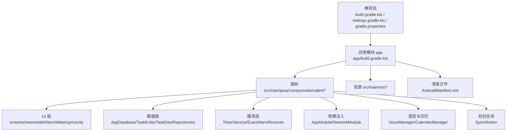
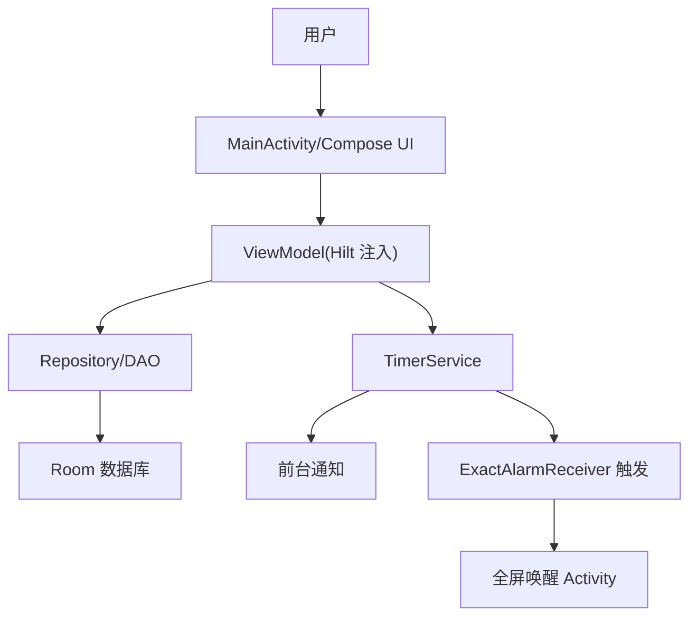
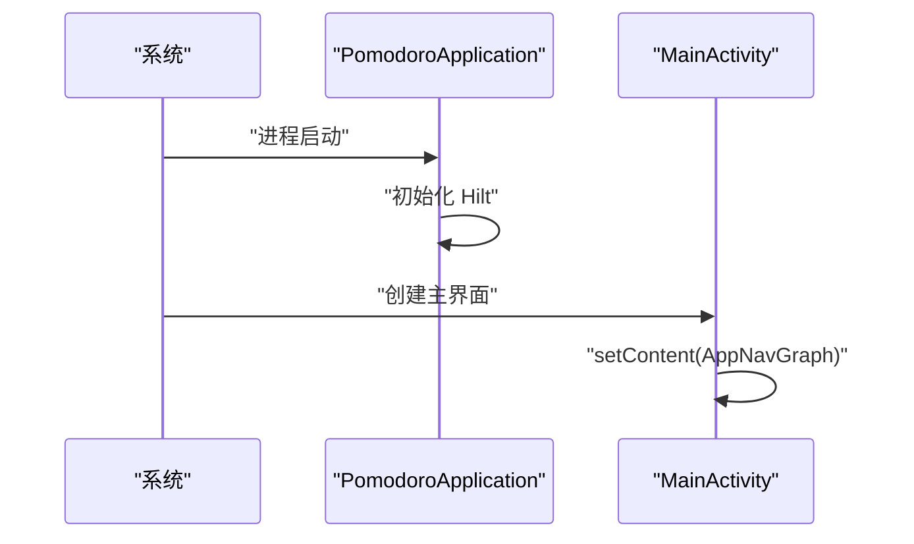
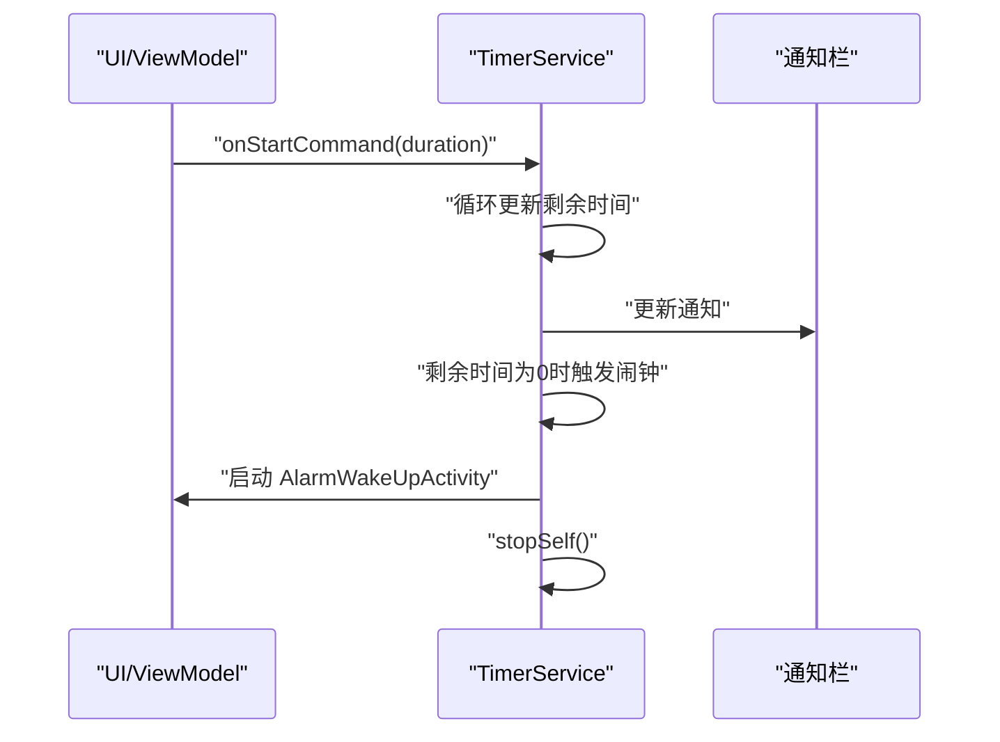
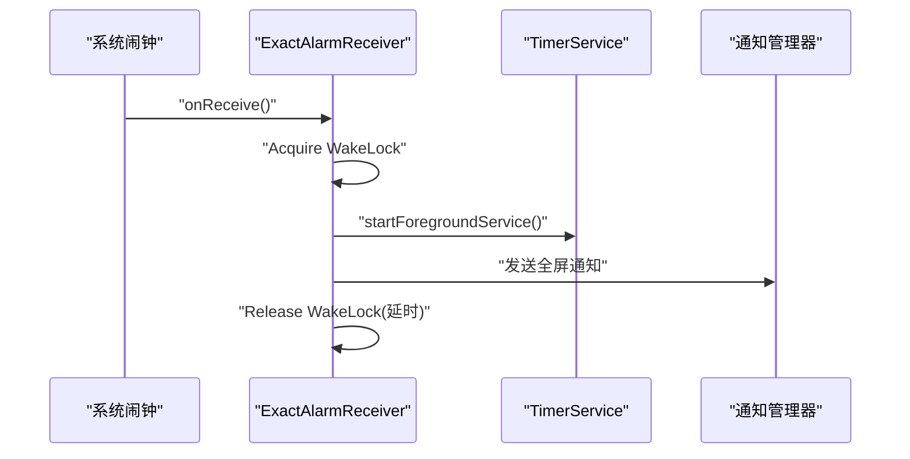
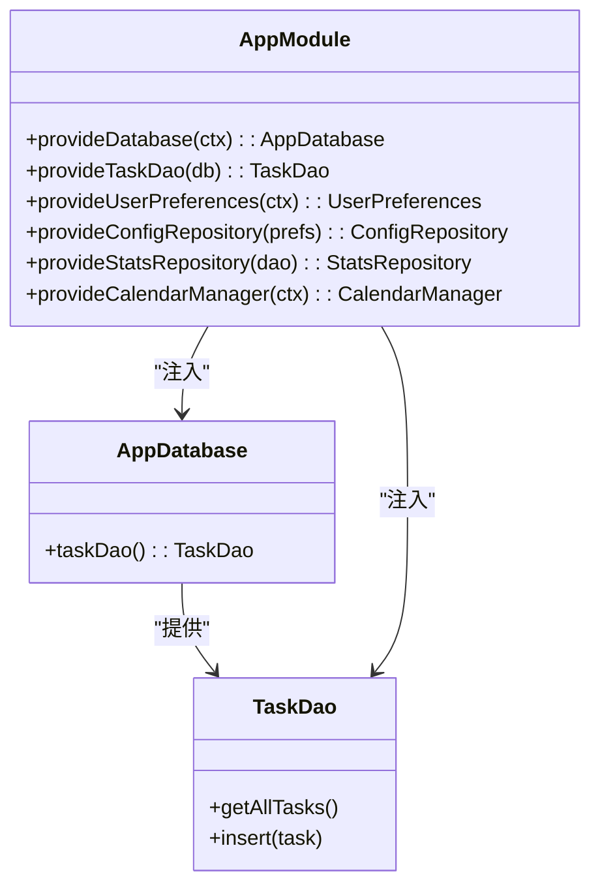
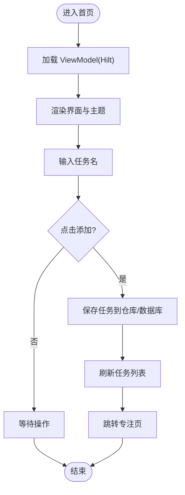
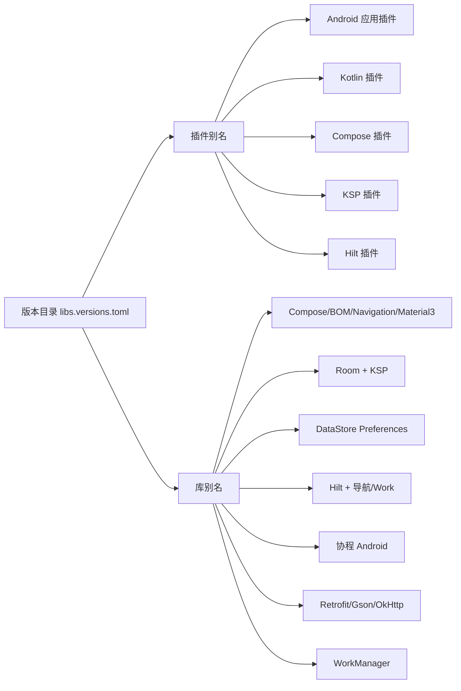

# 快速开始

<cite>
**本文引用的文件**
- [build.gradle.kts](file://build.gradle.kts)
- [app/build.gradle.kts](file://app/build.gradle.kts)
- [settings.gradle.kts](file://settings.gradle.kts)
- [gradle.properties](file://gradle.properties)
- [gradle/libs.versions.toml](file://gradle/libs.versions.toml)
- [local.properties](file://local.properties)
- [gradlew.bat](file://gradlew.bat)
- [app/src/main/AndroidManifest.xml](file://app/src/main/AndroidManifest.xml)
- [app/src/main/java/com/pomodoroalert/MainActivity.kt](file://app/src/main/java/com/pomodoroalert/MainActivity.kt)
- [app/src/main/java/com/pomodoroalert/PomodoroApplication.kt](file://app/src/main/java/com/pomodoroalert/PomodoroApplication.kt)
- [app/src/main/java/com/pomodoroalert/service/TimerService.kt](file://app/src/main/java/com/pomodoroalert/service/TimerService.kt)
- [app/src/main/java/com/pomodoroalert/receiver/ExactAlarmReceiver.kt](file://app/src/main/java/com/pomodoroalert/receiver/ExactAlarmReceiver.kt)
- [app/src/main/java/com/pomodoroalert/data/AppDatabase.kt](file://app/src/main/java/com/pomodoroalert/data/AppDatabase.kt)
- [app/src/main/java/com/pomodoroalert/di/AppModule.kt](file://app/src/main/java/com/pomodoroalert/di/AppModule.kt)
- [app/src/main/res/values/strings.xml](file://app/src/main/res/values/strings.xml)
- [app/src/main/res/values/themes.xml](file://app/src/main/res/values/themes.xml)
</cite>

## 目录
1. [简介](#简介)
2. [项目结构](#项目结构)
3. [核心组件](#核心组件)
4. [架构总览](#架构总览)
5. [详细组件分析](#详细组件分析)
6. [依赖分析](#依赖分析)
7. [性能考虑](#性能考虑)
8. [故障排除指南](#故障排除指南)
9. [结论](#结论)
10. [附录](#附录)

## 简介
本指南面向首次接触 PomodoroAlert 的开发者，帮助你在最短时间内完成环境准备、项目克隆与构建、首次运行（模拟器/真机），并理解项目的构建配置与依赖管理方式。项目采用 Kotlin、Jetpack Compose、Room、Hilt、WorkManager 等现代 Android 技术栈，围绕“番茄工作法”任务管理与专注计时功能展开。

## 项目结构
仓库采用标准的 Android 应用 Gradle 多模块结构，根目录包含全局构建脚本与版本目录，app 模块为实际应用工程，源码位于 app/src/main 下，资源位于 app/src/main/res，测试位于 app/src/androidTest 与 app/src/test。

图表来源
- [settings.gradle.kts:16-18](file://settings.gradle.kts#L16-L18)
- [app/build.gradle.kts:1-81](file://app/build.gradle.kts#L1-L81)
- [app/src/main/AndroidManifest.xml:11-38](file://app/src/main/AndroidManifest.xml#L11-L38)

章节来源
- [settings.gradle.kts:1-18](file://settings.gradle.kts#L1-L18)
- [app/build.gradle.kts:1-81](file://app/build.gradle.kts#L1-L81)

## 核心组件
- 应用入口与导航
  - 应用程序类负责 Hilt 初始化与全局配置。
  - 主界面使用 Jetpack Compose 构建，通过导航图展示首页、专注页、统计页、设置页。
- 数据层
  - 使用 Room 进行本地数据库持久化，提供 DAO 访问与实体映射。
  - 通过 Hilt 提供的仓库与偏好封装，统一数据访问入口。
- 后台服务与闹钟
  - 前台服务用于倒计时显示通知并驱动专注流程。
  - 广播接收器在系统闹钟触发后唤醒界面并释放屏幕锁。
- 语音与日历集成
  - 支持语音输入与日历同步能力，便于任务创建与日程联动。
- 网络与后台任务
  - Retrofit/OkHttp 实现网络请求；WorkManager 负责离线重试与后台同步。

章节来源
- [PomodoroApplication.kt:1-8](file://app/src/main/java/com/pomodoroalert/PomodoroApplication.kt#L1-L8)
- [MainActivity.kt:1-24](file://app/src/main/java/com/pomodoroalert/MainActivity.kt#L1-L24)
- [AppDatabase.kt:1-10](file://app/src/main/java/com/pomodoroalert/data/AppDatabase.kt#L1-L10)
- [TimerService.kt:1-103](file://app/src/main/java/com/pomodoroalert/service/TimerService.kt#L1-L103)
- [ExactAlarmReceiver.kt:1-49](file://app/src/main/java/com/pomodoroalert/receiver/ExactAlarmReceiver.kt#L1-L49)

## 架构总览
下图展示了从用户交互到后台服务与数据层的整体调用关系，体现 MVVM + 依赖注入 + 前台服务 + 闹钟广播的架构风格。

图表来源
- [MainActivity.kt:11-23](file://app/src/main/java/com/pomodoroalert/MainActivity.kt#L11-L23)
- [TimerService.kt:38-66](file://app/src/main/java/com/pomodoroalert/service/TimerService.kt#L38-L66)
- [ExactAlarmReceiver.kt:14-47](file://app/src/main/java/com/pomodoroalert/receiver/ExactAlarmReceiver.kt#L14-L47)
- [AppModule.kt:23-60](file://app/src/main/java/com/pomodoroalert/di/AppModule.kt#L23-L60)

## 详细组件分析

### 组件一：应用生命周期与入口
- 应用类启用 Hilt 全局依赖注入。
- 主 Activity 设置 Compose 内容并通过导航图承载页面。

图表来源
- [PomodoroApplication.kt:6-7](file://app/src/main/java/com/pomodoroalert/PomodoroApplication.kt#L6-L7)
- [MainActivity.kt:13-22](file://app/src/main/java/com/pomodoroalert/MainActivity.kt#L13-L22)

章节来源
- [PomodoroApplication.kt:1-8](file://app/src/main/java/com/pomodoroalert/PomodoroApplication.kt#L1-L8)
- [MainActivity.kt:1-24](file://app/src/main/java/com/pomodoroalert/MainActivity.kt#L1-L24)

### 组件二：前台服务与倒计时通知
- 服务在前台运行，持续更新通知并暴露剩余时间状态流。
- 到时触发闹钟唤醒界面并停止自身。

图表来源
- [TimerService.kt:38-66](file://app/src/main/java/com/pomodoroalert/service/TimerService.kt#L38-L66)
- [TimerService.kt:68-87](file://app/src/main/java/com/pomodoroalert/service/TimerService.kt#L68-L87)

章节来源
- [TimerService.kt:1-103](file://app/src/main/java/com/pomodoroalert/service/TimerService.kt#L1-L103)

### 组件三：闹钟广播与全屏唤醒
- 广播接收器在系统闹钟触发后启动前台服务，并发送全屏通知以解锁屏幕。

图表来源
- [ExactAlarmReceiver.kt:14-47](file://app/src/main/java/com/pomodoroalert/receiver/ExactAlarmReceiver.kt#L14-L47)

章节来源
- [ExactAlarmReceiver.kt:1-49](file://app/src/main/java/com/pomodoroalert/receiver/ExactAlarmReceiver.kt#L1-L49)

### 组件四：数据层与依赖注入
- Room 数据库提供 DAO 访问；Hilt 在单例作用域内提供数据库、DAO、仓库与偏好封装。

图表来源
- [AppDatabase.kt:6-9](file://app/src/main/java/com/pomodoroalert/data/AppDatabase.kt#L6-L9)
- [AppModule.kt:23-60](file://app/src/main/java/com/pomodoroalert/di/AppModule.kt#L23-L60)

章节来源
- [AppDatabase.kt:1-10](file://app/src/main/java/com/pomodoroalert/data/AppDatabase.kt#L1-L10)
- [AppModule.kt:1-61](file://app/src/main/java/com/pomodoroalert/di/AppModule.kt#L1-L61)

### 组件五：首页与任务列表
- 首页提供任务输入、语音与日历入口、任务列表展示与跳转专注页的能力。

图表来源
- [HomeScreen.kt:48-204](file://app/src/main/java/com/pomodoroalert/ui/screens/HomeScreen.kt#L48-L204)

章节来源
- [HomeScreen.kt:1-206](file://app/src/main/java/com/pomodoroalert/ui/screens/HomeScreen.kt#L1-L206)

## 依赖分析
- 版本管理
  - 顶层版本目录集中声明各依赖版本与插件版本，app 模块通过别名引用，避免版本漂移。
- 插件与编译选项
  - 应用插件：Android 应用、Kotlin Android、Compose 编译器、KSP、Hilt。
  - 编译目标：Java 17/Kotlin 2.0，启用 Compose 构建特性。
- 关键依赖
  - Jetpack Compose 生态：BOM 管理 UI/Material3/Navigation。
  - Room + KSP 编译器；DataStore Preferences；Hilt 及其导航/Work 扩展。
  - 协程 Android；Retrofit/Gson/OkHttp；WorkManager；测试 JUnit/Espresso。

图表来源
- [gradle/libs.versions.toml:1-55](file://gradle/libs.versions.toml#L1-L55)
- [app/build.gradle.kts:43-79](file://app/build.gradle.kts#L43-L79)

章节来源
- [gradle/libs.versions.toml:1-55](file://gradle/libs.versions.toml#L1-L55)
- [app/build.gradle.kts:1-81](file://app/build.gradle.kts#L1-L81)

## 性能考虑
- 前台服务与通知
  - 使用前台服务保持运行稳定性，注意通知通道与通知内容的简洁性，避免频繁更新导致电量消耗。
- 依赖注入与单例
  - 通过 Hilt 提供单例组件，减少重复初始化开销。
- Compose 渲染
  - 合理使用状态收集与重组边界，避免不必要的重组。
- 数据库与 IO
  - Room 查询尽量在后台线程执行，避免阻塞主线程。
- 电池优化
  - 针对部分厂商的电池优化策略，可在应用内引导用户关闭优化或申请白名单。

## 故障排除指南
- 无法找到 SDK 或构建失败
  - 检查本地 SDK 路径是否正确，确保 local.properties 中 sdk.dir 指向有效路径。
  - 章节来源
    - [local.properties:8](file://local.properties#L8)
- Java 版本不匹配
  - 确认系统已安装并配置了与项目一致的 JDK 版本（Java 17）。
  - 章节来源
    - [app/build.gradle.kts:31-37](file://app/build.gradle.kts#L31-L37)
- 依赖解析失败
  - 确保网络可访问 Google/Maven Central，必要时配置代理。
  - 章节来源
    - [settings.gradle.kts:8-14](file://settings.gradle.kts#L8-L14)
- 构建脚本找不到 Gradle Wrapper
  - 使用仓库自带的 gradlew.bat（Windows）或 gradlew（Unix）执行构建，避免外部环境差异。
  - 章节来源
    - [gradlew.bat:17-75](file://gradlew.bat#L17-L75)
- Compose/编译错误
  - 确认 Kotlin/Compose/Hilt 插件版本与 libs.versions.toml 中的别名一致。
  - 章节来源
    - [gradle/libs.versions.toml:49-55](file://gradle/libs.versions.toml#L49-L55)
    - [app/build.gradle.kts:1-7](file://app/build.gradle.kts#L1-L7)
- 运行时权限相关崩溃
  - 确认清单中已声明所需权限（前台服务、WAKE_LOCK、RECORD_AUDIO、READ_CALENDAR、POST_NOTIFICATIONS 等）。
  - 章节来源
    - [app/src/main/AndroidManifest.xml:4-9](file://app/src/main/AndroidManifest.xml#L4-L9)
- 通知渠道未创建导致异常
  - 确保前台服务在 API 26+ 上已创建通知渠道。
  - 章节来源
    - [TimerService.kt:89-99](file://app/src/main/java/com/pomodoroalert/service/TimerService.kt#L89-L99)

## 结论
通过本指南，你应已完成环境准备、项目构建与首次运行验证。建议在开发过程中遵循版本统一、依赖集中管理、前台服务与通知规范、权限与电池优化策略等最佳实践，以获得稳定高效的开发体验。

## 附录

### A. 环境与工具安装清单
- Android Studio（含 Android SDK、平台工具）
- JDK 17
- Android 模拟器或真机（满足 minSdk 26）

### B. 克隆与构建步骤
- 克隆仓库至本地后，使用命令行进入项目根目录。
- 使用自带的 Gradle Wrapper 执行构建：
  - Windows：执行 gradlew.bat assembleDebug
  - Unix/Linux/macOS：执行 ./gradlew assembleDebug
- 如需安装依赖但不构建，可执行：./gradlew :app:assembleDebug（或对应平台脚本）

章节来源
- [gradlew.bat:17-75](file://gradlew.bat#L17-L75)
- [app/build.gradle.kts:22-30](file://app/build.gradle.kts#L22-L30)

### C. 首次运行步骤
- 启动模拟器或连接真机，确保设备可被 ADB 识别。
- 在 Android Studio 中选择目标设备并点击运行。
- 若出现权限弹窗，按提示授予所需权限。
- 首次进入首页，可添加任务并跳转专注页进行体验。

章节来源
- [app/src/main/AndroidManifest.xml:4-9](file://app/src/main/AndroidManifest.xml#L4-L9)
- [HomeScreen.kt:48-204](file://app/src/main/java/com/pomodoroalert/ui/screens/HomeScreen.kt#L48-L204)

### D. 构建配置与依赖管理要点
- 版本与插件：通过 libs.versions.toml 统一管理，app 模块以别名形式引用。
- 仓库源：settings.gradle.kts 中集中配置 Google/Maven Central。
- AndroidX：gradle.properties 已开启 AndroidX/Jetifier。
- Compose：在 app 模块启用 buildFeatures.compose。

章节来源
- [gradle/libs.versions.toml:1-55](file://gradle/libs.versions.toml#L1-L55)
- [settings.gradle.kts:8-14](file://settings.gradle.kts#L8-L14)
- [gradle.properties:5-6](file://gradle.properties#L5-L6)
- [app/build.gradle.kts:38-41](file://app/build.gradle.kts#L38-L41)

### E. 开发环境最佳实践
- 使用 Hilt 管理依赖，避免手动实例化。
- 将 UI 与业务逻辑分离，ViewModel 仅持有状态与命令。
- Room 查询在协程或线程池中执行，避免阻塞主线程。
- 对于需要常驻的通知场景，优先使用前台服务并合理设计通知内容。
- 遵循权限最小化原则，在需要时再申请权限。