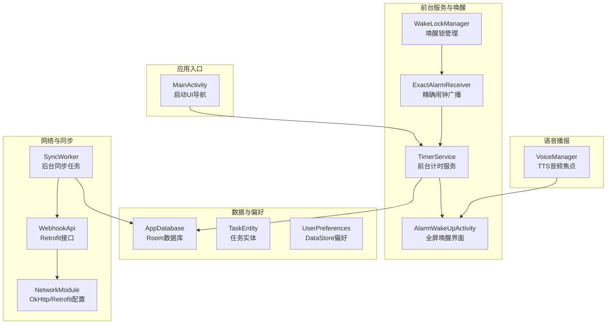
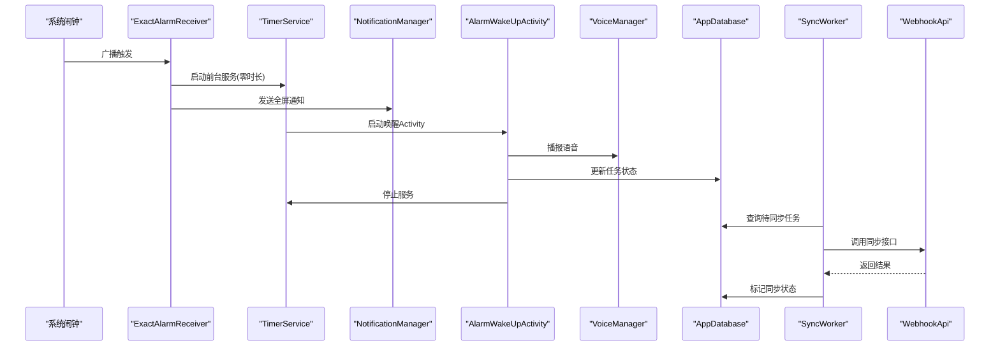
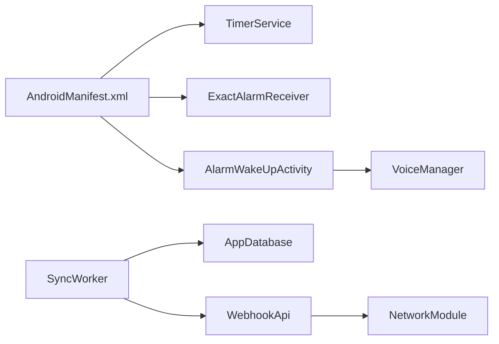

# 故障排除

<cite>
**本文引用的文件**
- [MainActivity.kt](file://app/src/main/java/com/pomodoroalert/MainActivity.kt)
- [TimerService.kt](file://app/src/main/java/com/pomodoroalert/service/TimerService.kt)
- [ExactAlarmReceiver.kt](file://app/src/main/java/com/pomodoroalert/receiver/ExactAlarmReceiver.kt)
- [WakeLockManager.kt](file://app/src/main/java/com/pomodoroalert/receiver/WakeLockManager.kt)
- [AlarmWakeUpActivity.kt](file://app/src/main/java/com/pomodoroalert/ui/AlarmWakeUpActivity.kt)
- [SyncWorker.kt](file://app/src/main/java/com/pomodoroalert/worker/SyncWorker.kt)
- [VoiceManager.kt](file://app/src/main/java/com/pomodoroalert/voice/VoiceManager.kt)
- [AppDatabase.kt](file://app/src/main/java/com/pomodoroalert/data/AppDatabase.kt)
- [TaskEntity.kt](file://app/src/main/java/com/pomodoroalert/data/TaskEntity.kt)
- [UserPreferences.kt](file://app/src/main/java/com/pomodoroalert/data/UserPreferences.kt)
- [WebhookApi.kt](file://app/src/main/java/com/pomodoroalert/network/WebhookApi.kt)
- [NetworkModule.kt](file://app/src/main/java/com/pomodoroalert/di/NetworkModule.kt)
- [AndroidManifest.xml](file://app/src/main/AndroidManifest.xml)
- [app/build.gradle.kts](file://app/build.gradle.kts)
</cite>

## 目录
1. [简介](#简介)
2. [项目结构](#项目结构)
3. [核心组件](#核心组件)
4. [架构总览](#架构总览)
5. [详细组件分析与故障排除](#详细组件分析与故障排除)
6. [依赖关系分析](#依赖关系分析)
7. [性能考虑与资源管理](#性能考虑与资源管理)
8. [故障排除清单](#故障排除清单)
9. [日志与调试技巧](#日志与调试技巧)
10. [用户反馈与问题报告流程](#用户反馈与问题报告流程)
11. [结论](#结论)

## 简介
本指南面向PomodoroAlert项目的维护者与开发者，聚焦于常见问题的诊断与修复，覆盖应用崩溃、功能异常、性能问题、计时服务、网络同步、语音播报等模块。文档提供可操作的排查步骤、可视化流程图与最佳实践，帮助快速定位与解决问题。

## 项目结构
应用采用分层架构：UI层（Compose + Activity）、服务层（前台服务、广播接收器、后台任务）、数据层（Room数据库、DataStore）、网络层（Retrofit + OkHttp）。关键入口为MainActivity，计时与唤醒通过TimerService与AlarmWakeUpActivity协作，后台同步由SyncWorker驱动，语音播报由VoiceManager负责。

图表来源
- [MainActivity.kt:11-23](file://app/src/main/java/com/pomodoroalert/MainActivity.kt#L11-L23)
- [TimerService.kt:24-102](file://app/src/main/java/com/pomodoroalert/service/TimerService.kt#L24-L102)
- [ExactAlarmReceiver.kt:13-48](file://app/src/main/java/com/pomodoroalert/receiver/ExactAlarmReceiver.kt#L13-L48)
- [AlarmWakeUpActivity.kt:24-104](file://app/src/main/java/com/pomodoroalert/ui/AlarmWakeUpActivity.kt#L24-L104)
- [SyncWorker.kt:15-77](file://app/src/main/java/com/pomodoroalert/worker/SyncWorker.kt#L15-L77)
- [VoiceManager.kt:12-62](file://app/src/main/java/com/pomodoroalert/voice/VoiceManager.kt#L12-L62)
- [AppDatabase.kt:6-9](file://app/src/main/java/com/pomodoroalert/data/AppDatabase.kt#L6-L9)
- [TaskEntity.kt:8-18](file://app/src/main/java/com/pomodoroalert/data/TaskEntity.kt#L8-L18)
- [UserPreferences.kt:15-35](file://app/src/main/java/com/pomodoroalert/data/UserPreferences.kt#L15-L35)
- [WebhookApi.kt:9-15](file://app/src/main/java/com/pomodoroalert/network/WebhookApi.kt#L9-L15)
- [NetworkModule.kt:16-52](file://app/src/main/java/com/pomodoroalert/di/NetworkModule.kt#L16-L52)

章节来源
- [MainActivity.kt:11-23](file://app/src/main/java/com/pomodoroalert/MainActivity.kt#L11-L23)
- [AndroidManifest.xml:11-37](file://app/src/main/AndroidManifest.xml#L11-L37)

## 核心组件
- 计时服务：前台服务持续倒计时，更新通知并触发唤醒界面；支持从广播触发或显式启动。
- 精确闹钟：广播接收器在系统闹钟触发后启动服务、显示全屏通知并短暂保持唤醒锁。
- 唤醒界面：全屏Activity展示按钮供用户完成或推迟任务，播报语音提示。
- 后台同步：基于WorkManager的CoroutineWorker批量同步未同步任务至云端。
- 语音播报：使用TextToSpeech与音频焦点控制，避免打断其他媒体。
- 数据与偏好：Room持久化任务，DataStore保存用户偏好（默认时长、耳麦模式、音色）。
- 网络层：Retrofit + OkHttp，超时配置合理，支持动态URL。

章节来源
- [TimerService.kt:24-102](file://app/src/main/java/com/pomodoroalert/service/TimerService.kt#L24-L102)
- [ExactAlarmReceiver.kt:13-48](file://app/src/main/java/com/pomodoroalert/receiver/ExactAlarmReceiver.kt#L13-L48)
- [AlarmWakeUpActivity.kt:24-104](file://app/src/main/java/com/pomodoroalert/ui/AlarmWakeUpActivity.kt#L24-L104)
- [SyncWorker.kt:15-77](file://app/src/main/java/com/pomodoroalert/worker/SyncWorker.kt#L15-L77)
- [VoiceManager.kt:12-62](file://app/src/main/java/com/pomodoroalert/voice/VoiceManager.kt#L12-L62)
- [AppDatabase.kt:6-9](file://app/src/main/java/com/pomodoroalert/data/AppDatabase.kt#L6-L9)
- [UserPreferences.kt:15-35](file://app/src/main/java/com/pomodoroalert/data/UserPreferences.kt#L15-L35)
- [WebhookApi.kt:9-15](file://app/src/main/java/com/pomodoroalert/network/WebhookApi.kt#L9-L15)
- [NetworkModule.kt:16-52](file://app/src/main/java/com/pomodoroalert/di/NetworkModule.kt#L16-L52)

## 架构总览
下图展示从系统闹钟到用户交互与数据同步的关键路径，便于定位问题环节。

图表来源
- [ExactAlarmReceiver.kt:14-47](file://app/src/main/java/com/pomodoroalert/receiver/ExactAlarmReceiver.kt#L14-L47)
- [TimerService.kt:38-66](file://app/src/main/java/com/pomodoroalert/service/TimerService.kt#L38-L66)
- [AlarmWakeUpActivity.kt:30-98](file://app/src/main/java/com/pomodoroalert/ui/AlarmWakeUpActivity.kt#L30-L98)
- [SyncWorker.kt:24-71](file://app/src/main/java/com/pomodoroalert/worker/SyncWorker.kt#L24-L71)
- [WebhookApi.kt:9-15](file://app/src/main/java/com/pomodoroalert/network/WebhookApi.kt#L9-L15)

## 详细组件分析与故障排除

### 计时服务（TimerService）
- 典型问题
  - 服务无法启动或前台通知缺失
  - 倒计时不更新或提前结束
  - 唤醒后无法停止服务
- 诊断要点
  - 检查前台服务类型与通知渠道是否正确创建
  - 验证onStartCommand参数与duration传递
  - 观察通知更新频率与stopSelf调用时机
- 修复步骤
  - 确保在onCreate中创建通知渠道并在前台启动
  - 使用显式Intent携带duration，区分“启动计时”与“零时长触发”
  - 在倒计时循环结束后调用stopSelf，避免服务常驻
- 关键路径参考
  - [TimerService.kt:32-36](file://app/src/main/java/com/pomodoroalert/service/TimerService.kt#L32-L36)
  - [TimerService.kt:38-44](file://app/src/main/java/com/pomodoroalert/service/TimerService.kt#L38-L44)
  - [TimerService.kt:46-59](file://app/src/main/java/com/pomodoroalert/service/TimerService.kt#L46-L59)
  - [TimerService.kt:61-66](file://app/src/main/java/com/pomodoroalert/service/TimerService.kt#L61-L66)

章节来源
- [TimerService.kt:24-102](file://app/src/main/java/com/pomodoroalert/service/TimerService.kt#L24-L102)

### 精确闹钟与唤醒（ExactAlarmReceiver + AlarmWakeUpActivity）
- 典型问题
  - 闹钟未响或无全屏通知
  - 唤醒界面无法显示或黑屏
  - 语音播报失败或被系统静音
- 诊断要点
  - 检查WAKE_LOCK权限与WakeLockManager的acquire/release配对
  - 确认AlarmWakeUpActivity的showWhenLocked/turnScreenOn设置
  - 验证通知优先级与全屏意图配置
- 修复步骤
  - 在广播接收器中先acquire唤醒锁，再延时release
  - 在Activity销毁时释放音频焦点
  - 确保通知渠道存在且优先级足够高
- 关键路径参考
  - [ExactAlarmReceiver.kt:14-47](file://app/src/main/java/com/pomodoroalert/receiver/ExactAlarmReceiver.kt#L14-L47)
  - [AlarmWakeUpActivity.kt:30-73](file://app/src/main/java/com/pomodoroalert/ui/AlarmWakeUpActivity.kt#L30-L73)
  - [WakeLockManager.kt:12-29](file://app/src/main/java/com/pomodoroalert/receiver/WakeLockManager.kt#L12-L29)
  - [VoiceManager.kt:46-61](file://app/src/main/java/com/pomodoroalert/voice/VoiceManager.kt#L46-L61)

章节来源
- [ExactAlarmReceiver.kt:13-48](file://app/src/main/java/com/pomodoroalert/receiver/ExactAlarmReceiver.kt#L13-L48)
- [AlarmWakeUpActivity.kt:24-104](file://app/src/main/java/com/pomodoroalert/ui/AlarmWakeUpActivity.kt#L24-L104)
- [WakeLockManager.kt:8-30](file://app/src/main/java/com/pomodoroalert/receiver/WakeLockManager.kt#L8-L30)
- [VoiceManager.kt:12-62](file://app/src/main/java/com/pomodoroalert/voice/VoiceManager.kt#L12-L62)

### 后台同步（SyncWorker + WebhookApi）
- 典型问题
  - 同步任务堆积且不推进
  - 网络错误导致无限重试或吞异常
  - 云端字段映射不一致
- 诊断要点
  - 检查待同步任务查询与同步状态更新
  - 校验payload字段映射与时间格式
  - 观察Result.success/Result.retry返回逻辑
- 修复步骤
  - 对每个任务独立try-catch，失败时记录并标记为未同步
  - 统一时间格式，必要时在DAO层补充endTime字段
  - 为网络层增加超时与重试策略（已在网络模块配置）
- 关键路径参考
  - [SyncWorker.kt:24-71](file://app/src/main/java/com/pomodoroalert/worker/SyncWorker.kt#L24-L71)
  - [WebhookApi.kt:9-15](file://app/src/main/java/com/pomodoroalert/network/WebhookApi.kt#L9-L15)
  - [NetworkModule.kt:28-44](file://app/src/main/java/com/pomodoroalert/di/NetworkModule.kt#L28-L44)

章节来源
- [SyncWorker.kt:15-77](file://app/src/main/java/com/pomodoroalert/worker/SyncWorker.kt#L15-L77)
- [WebhookApi.kt:9-15](file://app/src/main/java/com/pomodoroalert/network/WebhookApi.kt#L9-L15)
- [NetworkModule.kt:16-52](file://app/src/main/java/com/pomodoroalert/di/NetworkModule.kt#L16-L52)

### 语音播报（VoiceManager）
- 典型问题
  - 语音不播放或播放后无声
  - 与其他媒体冲突导致静音
- 诊断要点
  - 检查音频焦点请求与释放时机
  - 确认TTS初始化成功与语言设置
- 修复步骤
  - 使用临时音频焦点（may_duck），在Utterance回调中及时释放
  - 设置合适的AudioAttributes（USAGE_ALARM/CONTENT_TYPE_SONIFICATION）
- 关键路径参考
  - [VoiceManager.kt:22-26](file://app/src/main/java/com/pomodoroalert/voice/VoiceManager.kt#L22-L26)
  - [VoiceManager.kt:28-43](file://app/src/main/java/com/pomodoroalert/voice/VoiceManager.kt#L28-L43)
  - [VoiceManager.kt:45-61](file://app/src/main/java/com/pomodoroalert/voice/VoiceManager.kt#L45-L61)

章节来源
- [VoiceManager.kt:12-62](file://app/src/main/java/com/pomodoroalert/voice/VoiceManager.kt#L12-L62)

### 数据与偏好（AppDatabase + TaskEntity + UserPreferences）
- 典型问题
  - 任务状态不同步或丢失
  - 偏好读取异常或默认值不生效
- 诊断要点
  - 检查Room实体字段与DAO查询
  - 确认DataStore键名与默认值
- 修复步骤
  - 补充必要的列（如endTime）以保证payload完整性
  - 使用first()读取DataStore流时提供合理默认值
- 关键路径参考
  - [AppDatabase.kt:6-9](file://app/src/main/java/com/pomodoroalert/data/AppDatabase.kt#L6-L9)
  - [TaskEntity.kt:8-18](file://app/src/main/java/com/pomodoroalert/data/TaskEntity.kt#L8-L18)
  - [UserPreferences.kt:22-24](file://app/src/main/java/com/pomodoroalert/data/UserPreferences.kt#L22-L24)

章节来源
- [AppDatabase.kt:6-9](file://app/src/main/java/com/pomodoroalert/data/AppDatabase.kt#L6-L9)
- [TaskEntity.kt:8-18](file://app/src/main/java/com/pomodoroalert/data/TaskEntity.kt#L8-L18)
- [UserPreferences.kt:15-35](file://app/src/main/java/com/pomodoroalert/data/UserPreferences.kt#L15-L35)

## 依赖关系分析
- 运行时权限与声明
  - 前台服务、唤醒锁、忽略电池优化、录音、日历读取、通知权限均在清单中声明
- 构建与依赖
  - Compose、Hilt、Room、WorkManager、Retrofit、OkHttp版本齐备
- 关键耦合点
  - AlarmWakeUpActivity直接依赖VoiceManager与TaskRepository
  - SyncWorker依赖AppDatabase与WebhookApi
  - ExactAlarmReceiver依赖TimerService与WakeLockManager

图表来源
- [AndroidManifest.xml:11-37](file://app/src/main/AndroidManifest.xml#L11-L37)
- [app/build.gradle.kts:43-79](file://app/build.gradle.kts#L43-L79)

章节来源
- [AndroidManifest.xml:3-9](file://app/src/main/AndroidManifest.xml#L3-L9)
- [app/build.gradle.kts:43-79](file://app/build.gradle.kts#L43-L79)

## 性能考虑与资源管理
- CPU与电量
  - 使用前台服务时尽量降低UI刷新频率，通知更新周期建议≥1s
  - 避免在主线程执行IO或网络请求
- 内存与GC
  - 控制协程作用域生命周期，避免泄漏
  - 及时释放音频焦点与唤醒锁
- 网络与重试
  - 已配置连接/读/写超时，建议结合指数退避策略
- 数据库
  - 大量同步前先批量处理，减少事务次数
- 语音
  - 使用临时音频焦点，缩短占用时间

[本节为通用指导，无需特定文件引用]

## 故障排除清单

### 计时服务问题
- 症状：服务启动失败、通知不更新、无法停止
- 检查项
  - 前台服务类型与通知渠道是否创建
  - onStartCommand是否收到有效duration
  - 通知更新与stopSelf调用是否执行
- 处理步骤
  - 确保在onCreate中创建通知渠道
  - 显式Intent携带duration，区分“启动计时”与“零时长触发”
  - 倒计时结束后stopSelf

章节来源
- [TimerService.kt:32-36](file://app/src/main/java/com/pomodoroalert/service/TimerService.kt#L32-L36)
- [TimerService.kt:38-44](file://app/src/main/java/com/pomodoroalert/service/TimerService.kt#L38-L44)
- [TimerService.kt:46-59](file://app/src/main/java/com/pomodoroalert/service/TimerService.kt#L46-L59)

### 网络同步问题
- 症状：任务长时间未同步、同步失败但不重试
- 检查项
  - DAO查询是否返回待同步任务
  - payload字段映射与时间格式是否正确
  - 网络层超时与重试策略
- 处理步骤
  - 对单个任务try-catch，失败时不更新状态
  - 统一时间格式，必要时扩展实体字段
  - 结合Result.retry实现可控重试

章节来源
- [SyncWorker.kt:24-71](file://app/src/main/java/com/pomodoroalert/worker/SyncWorker.kt#L24-L71)
- [WebhookApi.kt:9-15](file://app/src/main/java/com/pomodoroalert/network/WebhookApi.kt#L9-L15)
- [NetworkModule.kt:28-44](file://app/src/main/java/com/pomodoroalert/di/NetworkModule.kt#L28-L44)

### 语音功能问题
- 症状：语音不播放、播放后无声、与其他媒体冲突
- 检查项
  - 音频焦点请求与释放时机
  - TTS初始化状态与语言设置
- 处理步骤
  - 使用临时音频焦点（may_duck），在Utterance回调中释放
  - 设置合适的AudioAttributes

章节来源
- [VoiceManager.kt:22-26](file://app/src/main/java/com/pomodoroalert/voice/VoiceManager.kt#L22-L26)
- [VoiceManager.kt:28-43](file://app/src/main/java/com/pomodoroalert/voice/VoiceManager.kt#L28-L43)
- [VoiceManager.kt:45-61](file://app/src/main/java/com/pomodoroalert/voice/VoiceManager.kt#L45-L61)

### 唤醒与通知问题
- 症状：闹钟无响、全屏通知无效、屏幕不亮
- 检查项
  - WakeLockManager是否acquire/release配对
  - AlarmWakeUpActivity的showWhenLocked/turnScreenOn
  - 通知优先级与全屏意图
- 处理步骤
  - 广播接收器中先acquire，延时release
  - Activity销毁时释放音频焦点
  - 确保通知渠道存在且优先级足够高

章节来源
- [ExactAlarmReceiver.kt:14-47](file://app/src/main/java/com/pomodoroalert/receiver/ExactAlarmReceiver.kt#L14-L47)
- [AlarmWakeUpActivity.kt:30-73](file://app/src/main/java/com/pomodoroalert/ui/AlarmWakeUpActivity.kt#L30-L73)
- [WakeLockManager.kt:12-29](file://app/src/main/java/com/pomodoroalert/receiver/WakeLockManager.kt#L12-L29)

### 数据一致性问题
- 症状：任务状态不同步、偏好读取异常
- 检查项
  - Room实体字段与DAO查询
  - DataStore键名与默认值
- 处理步骤
  - 补充必要字段（如endTime）
  - 提供合理的默认值与空值保护

章节来源
- [TaskEntity.kt:8-18](file://app/src/main/java/com/pomodoroalert/data/TaskEntity.kt#L8-L18)
- [UserPreferences.kt:22-24](file://app/src/main/java/com/pomodoroalert/data/UserPreferences.kt#L22-L24)

## 日志与调试技巧
- 日志采集
  - 使用系统日志catlog查看前台服务、通知、广播接收器与WorkManager调度
  - 在SyncWorker中捕获异常并记录错误码与响应体
- 调试工具
  - 使用adb shell dumpsys查看PowerManager与NotificationManager状态
  - 使用adb shell am start-activity验证Activity属性（showWhenLocked/turnScreenOn）
- 本地化与权限
  - 检查DataStore文件是否存在与可读写
  - 确认录音、日历、通知权限授权状态

[本节为通用指导，无需特定文件引用]

## 用户反馈与问题报告流程
- 收集信息
  - 设备型号、系统版本、应用版本
  - 重现步骤、期望行为与实际行为
  - 日志片段（catlog输出）与截图
- 分类与优先级
  - 崩溃类：最高优先级，立即修复
  - 功能异常：中优先级，按影响范围排序
  - 性能问题：低优先级，纳入优化计划
- 处理与跟踪
  - 创建Issue并分配责任人
  - 修复后回归测试并关闭Issue
- 预防与监控
  - 引入崩溃上报（如集成崩溃SDK）
  - 建立关键指标监控（同步成功率、唤醒成功率）

[本节为通用指导，无需特定文件引用]

## 结论
通过以上分模块的故障排除清单、诊断流程与优化建议，可以系统性地定位与解决PomodoroAlert中的计时、唤醒、同步与语音相关问题。建议在后续版本中完善日志与监控体系，并持续优化网络与资源管理策略，提升稳定性与用户体验。