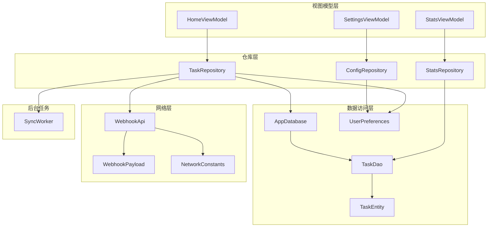
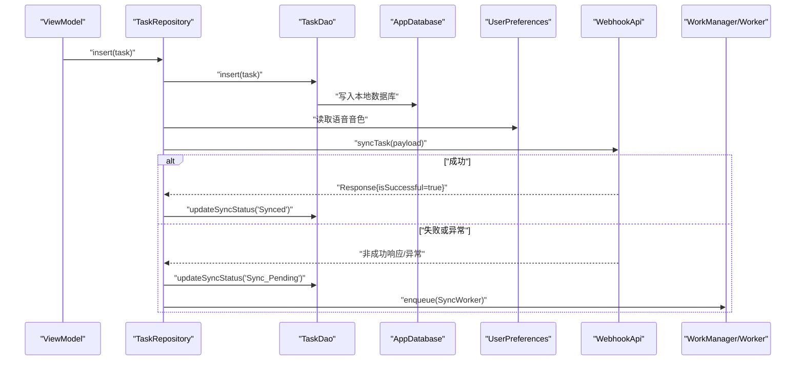
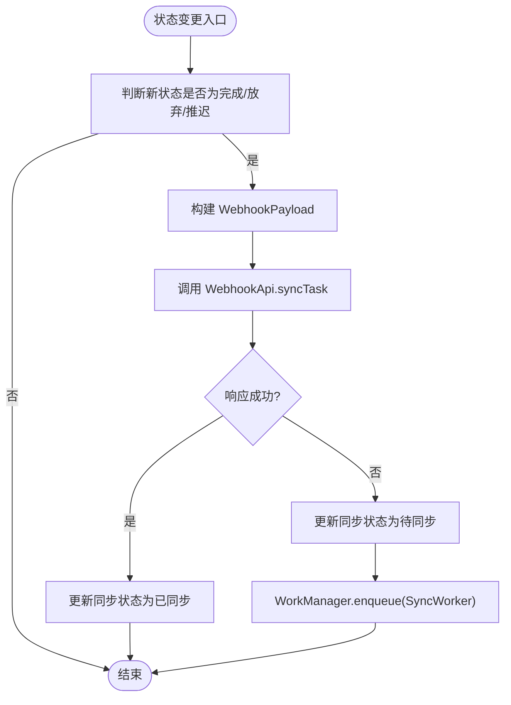
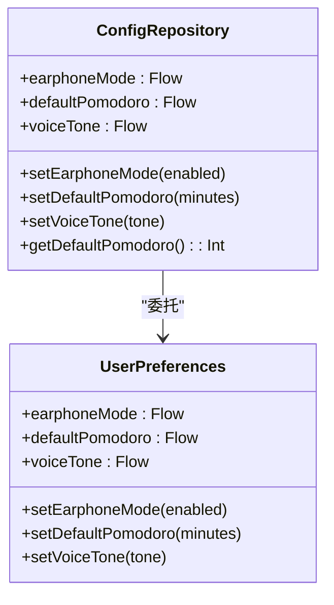
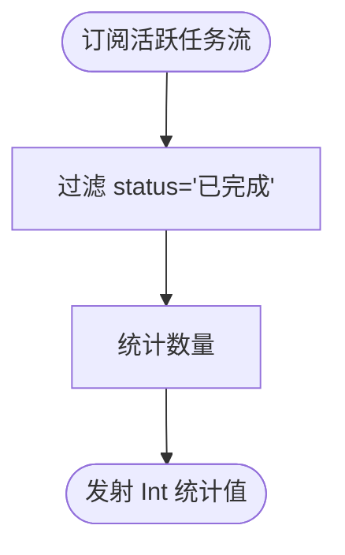
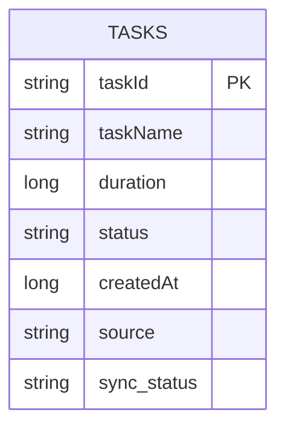
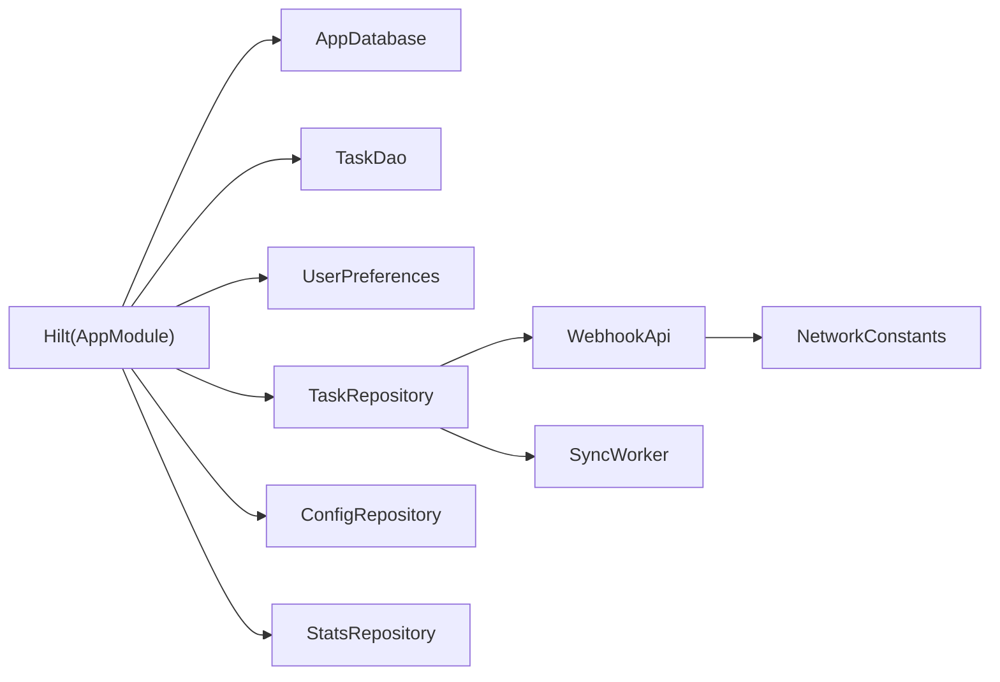

# 仓库模式实现

<cite>
**本文引用的文件**
- [TaskRepository.kt](file://app/src/main/java/com/pomodoroalert/data/TaskRepository.kt)
- [ConfigRepository.kt](file://app/src/main/java/com/pomodoroalert/data/ConfigRepository.kt)
- [StatsRepository.kt](file://app/src/main/java/com/pomodoroalert/data/StatsRepository.kt)
- [AppDatabase.kt](file://app/src/main/java/com/pomodoroalert/data/AppDatabase.kt)
- [TaskDao.kt](file://app/src/main/java/com/pomodoroalert/data/TaskDao.kt)
- [TaskEntity.kt](file://app/src/main/java/com/pomodoroalert/data/TaskEntity.kt)
- [UserPreferences.kt](file://app/src/main/java/com/pomodoroalert/data/UserPreferences.kt)
- [WebhookApi.kt](file://app/src/main/java/com/pomodoroalert/network/WebhookApi.kt)
- [NetworkConstants.kt](file://app/src/main/java/com/pomodoroalert/network/NetworkConstants.kt)
- [WebhookPayload.kt](file://app/src/main/java/com/pomodoroalert/data/WebhookPayload.kt)
- [SyncWorker.kt](file://app/src/main/java/com/pomodoroalert/worker/SyncWorker.kt)
- [AppModule.kt](file://app/src/main/java/com/pomodoroalert/di/AppModule.kt)
- [HomeViewModel.kt](file://app/src/main/java/com/pomodoroalert/ui/viewmodel/HomeViewModel.kt)
- [SettingsViewModel.kt](file://app/src/main/java/com/pomodoroalert/ui/viewmodel/SettingsViewModel.kt)
- [StatsViewModel.kt](file://app/src/main/java/com/pomodoroalert/ui/viewmodel/StatsViewModel.kt)
</cite>

## 目录
1. [引言](#引言)
2. [项目结构](#项目结构)
3. [核心组件](#核心组件)
4. [架构总览](#架构总览)
5. [详细组件分析](#详细组件分析)
6. [依赖关系分析](#依赖关系分析)
7. [性能考虑](#性能考虑)
8. [故障排查指南](#故障排查指南)
9. [结论](#结论)
10. [附录](#附录)

## 引言
本文件围绕 PomodoroAlert 的仓库（Repository）模式实现展开，系统阐述其在 MVVM 架构中的角色与价值，并深入解析 TaskRepository、ConfigRepository、StatsRepository 三大仓库类的职责边界、数据来源抽象、缓存与一致性策略、异步处理与错误传播、以及数据同步与冲突解决方法。同时给出最佳实践与性能优化建议，并通过序列图与流程图展示真实调用链路与决策过程。

## 项目结构
仓库模式位于数据层，向上为 ViewModel 提供稳定的数据接口，向下统一对接本地数据库、远程 API、偏好设置等多源数据。核心模块如下：
- 数据层：Room 数据库、DAO、实体；DataStore 偏好设置；Webhook 远程 API；同步工作器
- 依赖注入：Hilt 模块提供数据库、DAO、仓库实例
- 视图模型：Home、Settings、Stats 等 ViewModel 通过仓库暴露的状态流驱动 UI

图表来源
- [AppModule.kt:19-60](file://app/src/main/java/com/pomodoroalert/di/AppModule.kt#L19-L60)
- [TaskRepository.kt:19-25](file://app/src/main/java/com/pomodoroalert/data/TaskRepository.kt#L19-L25)
- [ConfigRepository.kt:7-18](file://app/src/main/java/com/pomodoroalert/data/ConfigRepository.kt#L7-L18)
- [StatsRepository.kt:6-17](file://app/src/main/java/com/pomodoroalert/data/StatsRepository.kt#L6-L17)
- [AppDatabase.kt:6-9](file://app/src/main/java/com/pomodoroalert/data/AppDatabase.kt#L6-L9)
- [TaskDao.kt:10-28](file://app/src/main/java/com/pomodoroalert/data/TaskDao.kt#L10-L28)
- [TaskEntity.kt:8-18](file://app/src/main/java/com/pomodoroalert/data/TaskEntity.kt#L8-L18)
- [UserPreferences.kt:15-34](file://app/src/main/java/com/pomodoroalert/data/UserPreferences.kt#L15-L34)
- [WebhookApi.kt:9-15](file://app/src/main/java/com/pomodoroalert/network/WebhookApi.kt#L9-L15)
- [WebhookPayload.kt:8-17](file://app/src/main/java/com/pomodoroalert/data/WebhookPayload.kt#L8-L17)
- [NetworkConstants.kt:3-6](file://app/src/main/java/com/pomodoroalert/network/NetworkConstants.kt#L3-L6)
- [SyncWorker.kt:15-77](file://app/src/main/java/com/pomodoroalert/worker/SyncWorker.kt#L15-L77)

章节来源
- [AppModule.kt:19-60](file://app/src/main/java/com/pomodoroalert/di/AppModule.kt#L19-L60)

## 核心组件
- TaskRepository：负责任务的增删改查、状态变更、本地持久化、云端同步触发与重试调度
- ConfigRepository：封装用户配置项（如默认番茄钟时长、耳麦模式、语音音色），以 Flow 暴露并支持更新
- StatsRepository：基于 DAO 的活跃任务流计算统计指标（已完成任务数、当日完成的番茄钟数）

章节来源
- [TaskRepository.kt:19-25](file://app/src/main/java/com/pomodoroalert/data/TaskRepository.kt#L19-L25)
- [ConfigRepository.kt:7-18](file://app/src/main/java/com/pomodoroalert/data/ConfigRepository.kt#L7-L18)
- [StatsRepository.kt:6-17](file://app/src/main/java/com/pomodoroalert/data/StatsRepository.kt#L6-L17)

## 架构总览
仓库模式在 MVVM 中的作用：
- 隔离数据来源差异：本地 Room、DataStore、远程 Webhook
- 统一对外接口：以 Flow 或 suspend 函数暴露，屏蔽并发与错误细节
- 协调异步与缓存：在仓库内组织协程、调度后台任务、维护一致性
- 降低 ViewModel 负担：ViewModel 仅消费状态流，不直接操作数据源

图表来源
- [TaskRepository.kt:30-94](file://app/src/main/java/com/pomodoroalert/data/TaskRepository.kt#L30-L94)
- [TaskDao.kt:11-27](file://app/src/main/java/com/pomodoroalert/data/TaskDao.kt#L11-L27)
- [UserPreferences.kt:22-24](file://app/src/main/java/com/pomodoroalert/data/UserPreferences.kt#L22-L24)
- [WebhookApi.kt:9-15](file://app/src/main/java/com/pomodoroalert/network/WebhookApi.kt#L9-L15)
- [SyncWorker.kt:24-71](file://app/src/main/java/com/pomodoroalert/worker/SyncWorker.kt#L24-L71)

## 详细组件分析

### TaskRepository 分析
职责与设计要点：
- 数据来源抽象：本地 Room（TaskDao）、远端 Webhook（WebhookApi）、用户偏好（UserPreferences）
- 状态变更与同步：当任务状态变为“已完成/已放弃/推迟”时，立即构造 WebhookPayload 并尝试同步；成功则标记为已同步，否则标记为待同步并调度后台重试
- 后台重试：通过 WorkManager + SyncWorker 批量重试待同步任务，具备网络约束与失败重试能力
- 时间格式化：统一时间格式用于上报
- 错误传播：网络异常或非成功响应均进入“待同步+调度重试”的路径

图表来源
- [TaskRepository.kt:32-94](file://app/src/main/java/com/pomodoroalert/data/TaskRepository.kt#L32-L94)
- [WebhookApi.kt:9-15](file://app/src/main/java/com/pomodoroalert/network/WebhookApi.kt#L9-L15)
- [SyncWorker.kt:24-71](file://app/src/main/java/com/pomodoroalert/worker/SyncWorker.kt#L24-L71)

章节来源
- [TaskRepository.kt:19-101](file://app/src/main/java/com/pomodoroalert/data/TaskRepository.kt#L19-L101)

### ConfigRepository 分析
职责与设计要点：
- 配置项封装：耳麦模式、默认番茄钟时长、语音音色，均以 Flow 暴露，便于 UI 订阅
- 更新接口：提供 suspend 方法写入 DataStore，确保原子性与一致性
- ViewModel 辅助：提供阻塞式读取当前默认番茄钟时长的方法，简化 ViewModel 初始化逻辑

图表来源
- [ConfigRepository.kt:7-18](file://app/src/main/java/com/pomodoroalert/data/ConfigRepository.kt#L7-L18)
- [UserPreferences.kt:15-34](file://app/src/main/java/com/pomodoroalert/data/UserPreferences.kt#L15-L34)

章节来源
- [ConfigRepository.kt:1-19](file://app/src/main/java/com/pomodoroalert/data/ConfigRepository.kt#L1-L19)
- [UserPreferences.kt:1-36](file://app/src/main/java/com/pomodoroalert/data/UserPreferences.kt#L1-L36)

### StatsRepository 分析
职责与设计要点：
- 统计计算：基于活跃任务流，统计“已完成”任务数量；V1 将完成任务数视为当日完成的番茄钟数
- 数据来源：直接依赖 TaskDao，保持统计逻辑与数据访问解耦
- 流式输出：返回 Flow<Int>，便于 ViewModel 以 stateIn 订阅

图表来源
- [StatsRepository.kt:7-16](file://app/src/main/java/com/pomodoroalert/data/StatsRepository.kt#L7-L16)
- [TaskDao.kt:14-15](file://app/src/main/java/com/pomodoroalert/data/TaskDao.kt#L14-L15)

章节来源
- [StatsRepository.kt:1-18](file://app/src/main/java/com/pomodoroalert/data/StatsRepository.kt#L1-L18)

### 数据模型与数据源抽象
- 实体与表结构：TaskEntity 定义了任务字段及默认同步状态
- 本地存储：AppDatabase + TaskDao 提供 Room ORM 能力，支持 Flow 订阅与批量查询
- 偏好设置：UserPreferences 使用 DataStore Preferences，提供键值型配置的读写与 Flow 化
- 远程同步：WebhookApi 定义同步接口，WebhookPayload 作为 DTO 与云端约定一致

图表来源
- [TaskEntity.kt:8-18](file://app/src/main/java/com/pomodoroalert/data/TaskEntity.kt#L8-L18)

章节来源
- [AppDatabase.kt:6-9](file://app/src/main/java/com/pomodoroalert/data/AppDatabase.kt#L6-L9)
- [TaskDao.kt:10-28](file://app/src/main/java/com/pomodoroalert/data/TaskDao.kt#L10-L28)
- [TaskEntity.kt:8-18](file://app/src/main/java/com/pomodoroalert/data/TaskEntity.kt#L8-L18)
- [UserPreferences.kt:15-34](file://app/src/main/java/com/pomodoroalert/data/UserPreferences.kt#L15-L34)
- [WebhookApi.kt:9-15](file://app/src/main/java/com/pomodoroalert/network/WebhookApi.kt#L9-L15)
- [WebhookPayload.kt:8-17](file://app/src/main/java/com/pomodoroalert/data/WebhookPayload.kt#L8-L17)

### 异步处理与错误传播
- 协程使用：仓库内部使用 Dispatchers.IO 与 viewModelScope/CoroutineScope 处理耗时操作
- Flow 订阅：ViewModel 通过 stateIn 订阅仓库返回的 Flow，自动响应数据变化
- 错误处理：网络异常或非成功响应统一走“标记待同步+调度重试”路径，避免 UI 直接触发错误
- 重试机制：SyncWorker 批量重试待同步任务，失败返回 retry，由 WorkManager 自动退避重试

章节来源
- [TaskRepository.kt:42-94](file://app/src/main/java/com/pomodoroalert/data/TaskRepository.kt#L42-L94)
- [SyncWorker.kt:24-71](file://app/src/main/java/com/pomodoroalert/worker/SyncWorker.kt#L24-L71)
- [HomeViewModel.kt:26-32](file://app/src/main/java/com/pomodoroalert/ui/viewmodel/HomeViewModel.kt#L26-L32)
- [SettingsViewModel.kt:17-21](file://app/src/main/java/com/pomodoroalert/ui/viewmodel/SettingsViewModel.kt#L17-L21)
- [StatsViewModel.kt:16-21](file://app/src/main/java/com/pomodoroalert/ui/viewmodel/StatsViewModel.kt#L16-L21)

### 数据同步策略与冲突解决
- 写后即发：任务状态变更后立即尝试同步，减少离线窗口
- 待同步队列：失败或异常时标记为“待同步”，由后台 Worker 批量重试
- 网络约束：WorkManager 在网络可用时才执行重试，避免无效重试
- 冲突最小化：云端以 taskId 作为幂等键，仓库仅在状态变化时触发同步，降低并发冲突概率

章节来源
- [TaskRepository.kt:32-94](file://app/src/main/java/com/pomodoroalert/data/TaskRepository.kt#L32-L94)
- [SyncWorker.kt:24-71](file://app/src/main/java/com/pomodoroalert/worker/SyncWorker.kt#L24-L71)

### 在 MVVM 中的使用示例
- HomeViewModel：订阅 TaskRepository 的活跃任务流，新增任务时读取 ConfigRepository 的默认时长
- SettingsViewModel：直接暴露 ConfigRepository 的 Flow，支持设置更新
- StatsViewModel：订阅 StatsRepository 的统计流，展示完成任务与当日番茄钟数

章节来源
- [HomeViewModel.kt:16-52](file://app/src/main/java/com/pomodoroalert/ui/viewmodel/HomeViewModel.kt#L16-L52)
- [SettingsViewModel.kt:14-30](file://app/src/main/java/com/pomodoroalert/ui/viewmodel/SettingsViewModel.kt#L14-L30)
- [StatsViewModel.kt:12-21](file://app/src/main/java/com/pomodoroalert/ui/viewmodel/StatsViewModel.kt#L12-L21)

## 依赖关系分析
- 依赖注入：AppModule 提供数据库、DAO、UserPreferences、各仓库实例，确保单例与可测试性
- 组件耦合：仓库对底层数据源采用组合聚合，避免直接耦合具体实现
- 外部集成：WebhookApi 通过 NetworkConstants 注入 URL，便于替换与测试

图表来源
- [AppModule.kt:23-60](file://app/src/main/java/com/pomodoroalert/di/AppModule.kt#L23-L60)
- [TaskRepository.kt:20-24](file://app/src/main/java/com/pomodoroalert/data/TaskRepository.kt#L20-L24)
- [WebhookApi.kt:9-15](file://app/src/main/java/com/pomodoroalert/network/WebhookApi.kt#L9-L15)
- [NetworkConstants.kt:3-6](file://app/src/main/java/com/pomodoroalert/network/NetworkConstants.kt#L3-L6)
- [SyncWorker.kt:16-22](file://app/src/main/java/com/pomodoroalert/worker/SyncWorker.kt#L16-L22)

章节来源
- [AppModule.kt:19-60](file://app/src/main/java/com/pomodoroalert/di/AppModule.kt#L19-L60)

## 性能考虑
- 数据库写入：使用 REPLACE 冲突策略，避免重复插入导致的索引膨胀
- Flow 订阅：ViewModel 使用 stateIn 并设置 WhileSubscribed 策略，减少无订阅时的资源占用
- 协程调度：IO 线程池用于网络与数据库操作，避免阻塞主线程
- 后台重试：WorkManager 自带退避与约束，降低频繁唤醒带来的能耗
- 统计计算：在仓库层进行聚合，避免 ViewModel 层重复计算

## 故障排查指南
- 同步未生效
  - 检查任务状态是否为目标完成态
  - 查看数据库中同步状态是否被标记为“待同步”
  - 确认 WorkManager 是否成功入队
- 网络错误
  - 查看 WebhookApi 返回状态码与异常栈
  - 确认 NetworkConstants 中 URL 已正确配置
- 配置不生效
  - 确认 DataStore 写入成功且 Flow 订阅正常
- 统计异常
  - 检查活跃任务查询条件与状态枚举是否一致

章节来源
- [TaskRepository.kt:68-78](file://app/src/main/java/com/pomodoroalert/data/TaskRepository.kt#L68-L78)
- [SyncWorker.kt:57-67](file://app/src/main/java/com/pomodoroalert/worker/SyncWorker.kt#L57-L67)
- [NetworkConstants.kt:3-6](file://app/src/main/java/com/pomodoroalert/network/NetworkConstants.kt#L3-L6)
- [UserPreferences.kt:22-34](file://app/src/main/java/com/pomodoroalert/data/UserPreferences.kt#L22-L34)
- [TaskDao.kt:14-27](file://app/src/main/java/com/pomodoroalert/data/TaskDao.kt#L14-L27)

## 结论
仓库模式在本项目中有效实现了数据来源的统一抽象与异步处理的集中化管理。TaskRepository 通过本地持久化与云端同步的协同，保障了数据的一致性与可靠性；ConfigRepository 与 StatsRepository 则分别承担配置与统计的职责边界，使 ViewModel 能够专注于 UI 表达。配合 Hilt 的依赖注入、WorkManager 的后台重试与 DataStore 的流式偏好设置，整体架构具备良好的可维护性与扩展性。

## 附录
- 最佳实践
  - 仓库只暴露必要的接口，避免 ViewModel 直接访问底层数据源
  - 对外统一使用 Flow 或 suspend 函数，隐藏并发细节
  - 将错误处理与重试逻辑收敛到仓库或 Worker，UI 仅负责渲染
  - 使用 DataStore 替代 SharedPreferences，获得更好的类型安全与异步能力
- 性能优化建议
  - 对高频查询建立合适的索引（如按状态与创建时间）
  - 控制 Flow 订阅范围，避免过度刷新
  - 合理设置 WorkManager 的约束与退避策略，平衡及时性与能耗