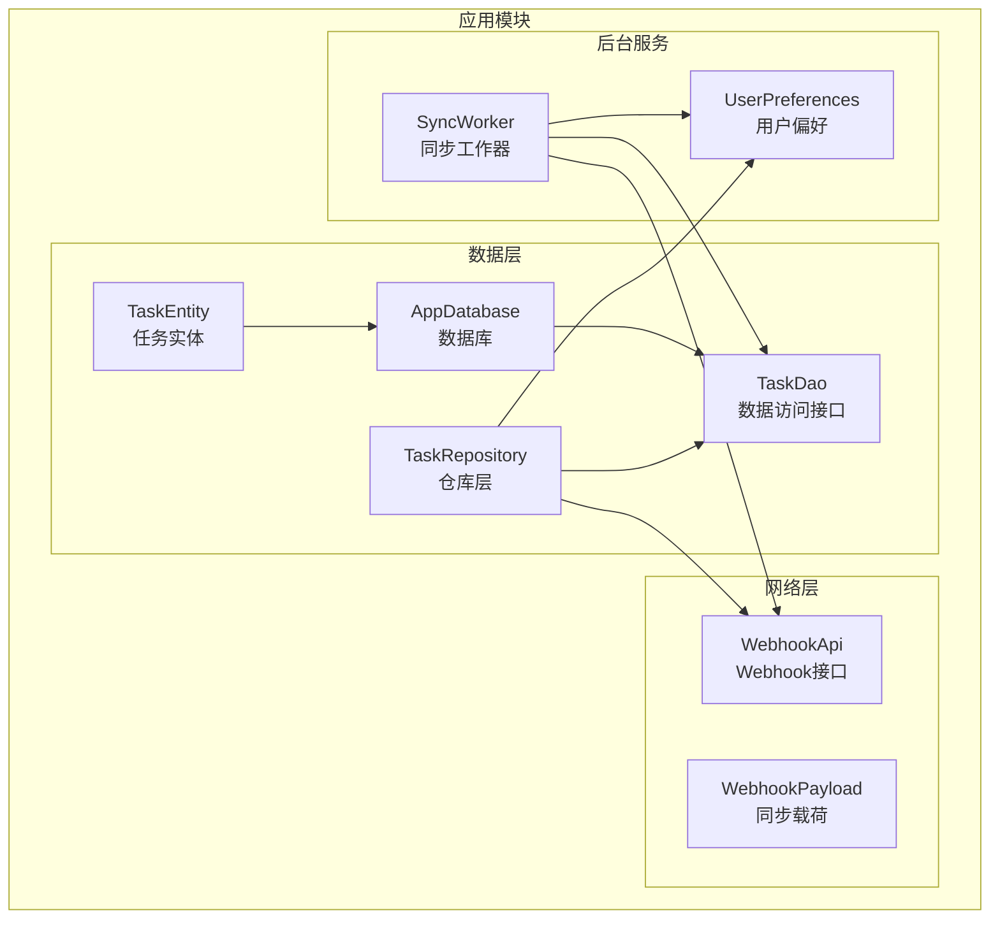
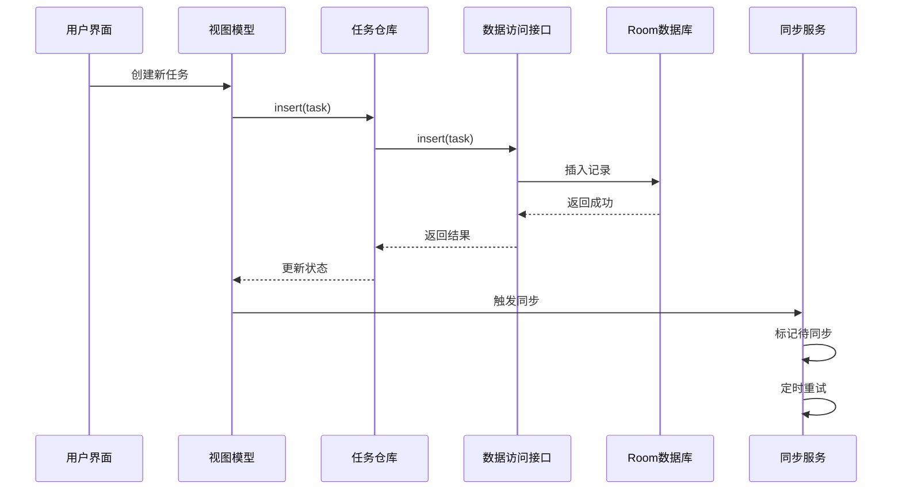
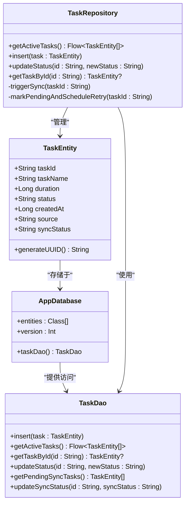
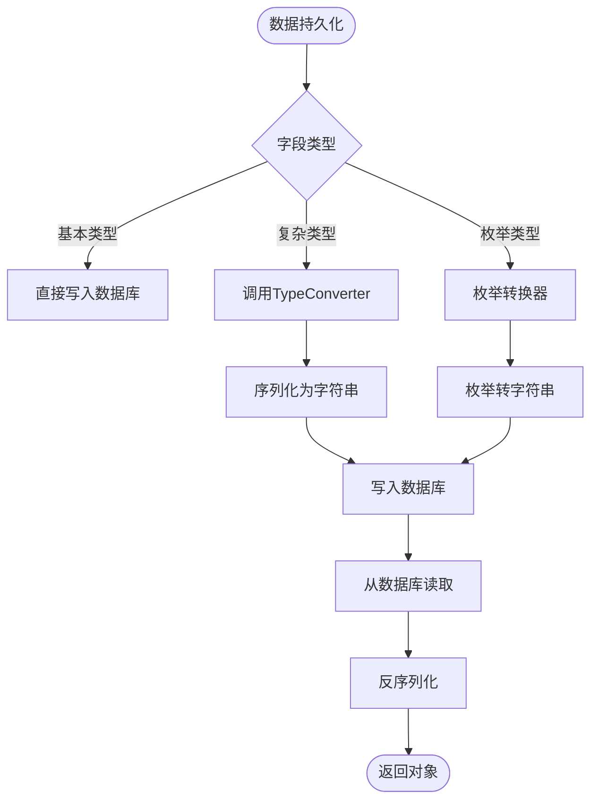
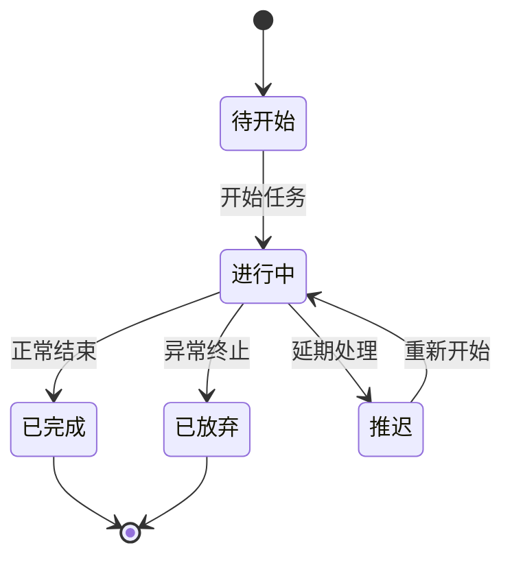
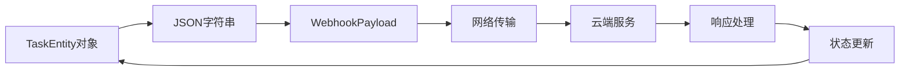
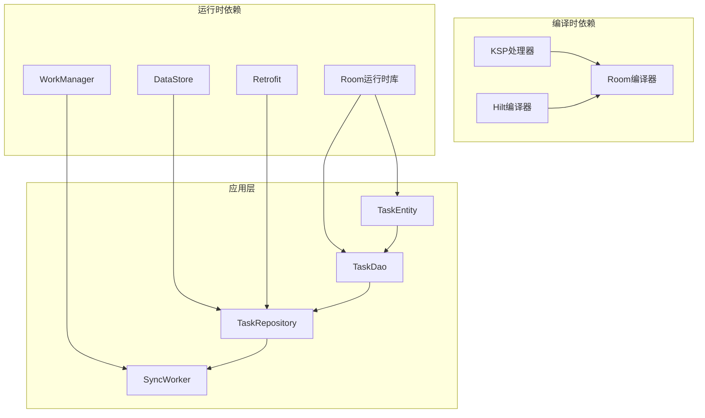

# 实体模型

<cite>
**本文档引用的文件**
- [TaskEntity.kt](file://app/src/main/java/com/pomodoroalert/data/TaskEntity.kt)
- [AppDatabase.kt](file://app/src/main/java/com/pomodoroalert/data/AppDatabase.kt)
- [TaskDao.kt](file://app/src/main/java/com/pomodoroalert/data/TaskDao.kt)
- [TaskRepository.kt](file://app/src/main/java/com/pomodoroalert/data/TaskRepository.kt)
- [UserPreferences.kt](file://app/src/main/java/com/pomodoroalert/data/UserPreferences.kt)
- [WebhookPayload.kt](file://app/src/main/java/com/pomodoroalert/data/WebhookPayload.kt)
- [SyncWorker.kt](file://app/src/main/java/com/pomodoroalert/worker/SyncWorker.kt)
- [build.gradle.kts](file://app/build.gradle.kts)
</cite>

## 目录
1. [简介](#简介)
2. [项目结构](#项目结构)
3. [核心组件](#核心组件)
4. [架构概览](#架构概览)
5. [详细组件分析](#详细组件分析)
6. [依赖关系分析](#依赖关系分析)
7. [性能考虑](#性能考虑)
8. [故障排除指南](#故障排除指南)
9. [结论](#结论)

## 简介

本文档深入分析PomodoroAlert应用中的TaskEntity任务实体模型，这是一个基于Android Room数据库框架设计的数据持久化实体。该实体模型采用现代Android开发最佳实践，结合了Room的注解驱动设计、数据转换器支持、以及完整的数据同步机制。

TaskEntity作为应用的核心数据模型，负责存储用户任务信息，包括任务名称、持续时间、状态管理、来源标识等关键属性。该实体不仅体现了良好的面向对象设计原则，还展现了完整的数据生命周期管理能力。

## 项目结构

PomodoroAlert项目采用标准的Android应用目录结构，其中数据层位于`app/src/main/java/com/pomodoroalert/data/`目录下，包含了完整的实体模型、数据访问层和仓库模式实现。



**图表来源**
- [TaskEntity.kt:1-19](file://app/src/main/java/com/pomodoroalert/data/TaskEntity.kt#L1-L19)
- [AppDatabase.kt:1-10](file://app/src/main/java/com/pomodoroalert/data/AppDatabase.kt#L1-L10)
- [TaskDao.kt:1-29](file://app/src/main/java/com/pomodoroalert/data/TaskDao.kt#L1-L29)
- [TaskRepository.kt:1-101](file://app/src/main/java/com/pomodoroalert/data/TaskRepository.kt#L1-L101)

**章节来源**
- [TaskEntity.kt:1-19](file://app/src/main/java/com/pomodoroalert/data/TaskEntity.kt#L1-L19)
- [AppDatabase.kt:1-10](file://app/src/main/java/com/pomodoroalert/data/AppDatabase.kt#L1-L10)
- [TaskDao.kt:1-29](file://app/src/main/java/com/pomodoroalert/data/TaskDao.kt#L1-L29)
- [TaskRepository.kt:1-101](file://app/src/main/java/com/pomodoroalert/data/TaskRepository.kt#L1-L101)

## 核心组件

### TaskEntity实体模型

TaskEntity是应用的核心数据模型，采用Kotlin数据类设计，具有以下关键特性：

#### 主键生成策略
- **UUID主键**: 使用`UUID.randomUUID().toString()`生成全局唯一标识符
- **运行时生成**: 主键在对象实例化时自动生成，确保每个任务都有唯一的标识
- **字符串类型**: 选择String类型便于跨平台兼容性和JSON序列化

#### 字段设计哲学
- **强类型约束**: 每个字段都有明确的数据类型定义
- **业务语义明确**: 字段命名直接反映业务含义
- **国际化支持**: 状态值和来源值采用中文本地化

#### 数据库映射配置
- **表名映射**: `@Entity(tableName = "tasks")`指定数据库表名为"tasks"
- **列名映射**: 使用@ColumnInfo注解自定义列名，如"sync_status"
- **默认值策略**: 部分字段提供默认值，简化插入操作

**章节来源**
- [TaskEntity.kt:8-18](file://app/src/main/java/com/pomodoroalert/data/TaskEntity.kt#L8-L18)

## 架构概览

TaskEntity在整个应用架构中扮演着核心数据持久化角色，通过清晰的分层设计实现了数据的完整生命周期管理。



**图表来源**
- [TaskRepository.kt:32-80](file://app/src/main/java/com/pomodoroalert/data/TaskRepository.kt#L32-L80)
- [TaskDao.kt:11-12](file://app/src/main/java/com/pomodoroalert/data/TaskDao.kt#L11-L12)

## 详细组件分析

### TaskEntity类深度解析

#### 设计理念
TaskEntity采用了简洁而强大的设计理念，通过最小化的字段集合满足核心业务需求，同时保持了良好的扩展性。



**图表来源**
- [TaskEntity.kt:8-18](file://app/src/main/java/com/pomodoroalert/data/TaskEntity.kt#L8-L18)
- [AppDatabase.kt:6-8](file://app/src/main/java/com/pomodoroalert/data/AppDatabase.kt#L6-L8)
- [TaskDao.kt:9-28](file://app/src/main/java/com/pomodoroalert/data/TaskDao.kt#L9-L28)
- [TaskRepository.kt:19-25](file://app/src/main/java/com/pomodoroalert/data/TaskRepository.kt#L19-L25)

#### 字段类型选择分析

| 字段名 | 类型 | 用途 | 设计考虑 |
|--------|------|------|----------|
| taskId | String | 唯一标识符 | UUID保证全局唯一性 |
| taskName | String | 任务名称 | 用户可读的中文名称 |
| duration | Long | 持续时间(ms) | 精确到毫秒的时间戳 |
| status | String | 任务状态 | 四种状态枚举值 |
| createdAt | Long | 创建时间 | Unix时间戳格式 |
| source | String | 任务来源 | 三种来源类型 |
| syncStatus | String | 同步状态 | 默认已同步 |

#### 注解使用详解

**@Entity注解配置**
- `tableName = "tasks"`: 明确指定数据库表名
- 支持Room自动代码生成，无需手动编写SQL

**@PrimaryKey注解配置**
- `val taskId: String = UUID.randomUUID().toString()`
- 运行时生成主键，避免重复插入问题

**@ColumnInfo注解配置**
- `@ColumnInfo(name = "sync_status")`: 自定义列名映射
- 解决数据库列名与Kotlin属性名不一致的问题

**章节来源**
- [TaskEntity.kt:3-18](file://app/src/main/java/com/pomodoroalert/data/TaskEntity.kt#L3-L18)

### 数据类型转换器(TypeConverter)实现

虽然当前TaskEntity没有显式的TypeConverter实现，但Room框架提供了完整的类型转换支持机制：

#### 内置类型支持
- **基本类型**: String、Int、Long、Boolean等原生类型
- **包装类型**: Integer、Long、Boolean等可空类型
- **复杂类型**: Date、UUID、自定义对象等需要转换

#### TypeConverter使用场景


**图表来源**
- [TaskEntity.kt:10-17](file://app/src/main/java/com/pomodoroalert/data/TaskEntity.kt#L10-L17)

### 实体关系设计

#### 当前关系状态
TaskEntity目前采用扁平化设计，所有字段都存储在同一张表中，这种设计的优势在于：
- **简单查询**: 无需复杂的JOIN操作
- **高性能**: 单表查询速度快
- **易维护**: 结构简单，易于理解和修改

#### 关系扩展可能性
如果未来需要扩展关系设计，可以考虑以下方案：

**一对一关系示例**:
```kotlin
// 可能的关联实体
@Entity(foreignKeys = [
    ForeignKey(entity = TaskEntity::class, parentColumns = ["taskId"], childColumns = ["taskId"])
])
data class TaskMetadata(
    @PrimaryKey val metadataId: String,
    val taskId: String,
    val notes: String,
    val tags: List<String>
)
```

**一对多关系示例**:
```kotlin
// 多个任务对应一个项目
@Entity(foreignKeys = [
    ForeignKey(entity = ProjectEntity::class, parentColumns = ["projectId"], childColumns = ["projectId"])
])
data class TaskEntity(
    @PrimaryKey val taskId: String,
    val projectId: String,
    val taskName: String,
    // 其他字段...
)
```

**章节来源**
- [TaskEntity.kt:8-18](file://app/src/main/java/com/pomodoroalert/data/TaskEntity.kt#L8-L18)

### 业务逻辑验证规则

TaskEntity遵循严格的业务规则和数据校验机制：

#### 状态流转规则


#### 数据完整性约束
- **必填字段**: taskName、duration、status、createdAt、source
- **格式约束**: taskId必须为有效的UUID格式
- **范围约束**: duration必须为正数
- **枚举约束**: status和source必须在预定义集合内

#### 同步状态管理
- **默认状态**: "Synced"表示已同步
- **待同步状态**: "Sync_Pending"表示需要重试
- **自动重试**: 通过WorkManager实现定时重试机制

**章节来源**
- [TaskEntity.kt:11-17](file://app/src/main/java/com/pomodoroalert/data/TaskEntity.kt#L11-L17)
- [TaskRepository.kt:32-38](file://app/src/main/java/com/pomodoroalert/data/TaskRepository.kt#L32-L38)

### 序列化和反序列化处理

#### 数据库序列化
TaskEntity通过Room框架自动处理数据库层面的序列化和反序列化：

**字段映射规则**:
- Kotlin属性名与数据库列名的映射关系
- 基本类型的自动转换
- 复杂类型的TypeConverter支持

**JSON序列化支持**:


**图表来源**
- [WebhookPayload.kt:8-17](file://app/src/main/java/com/pomodoroalert/data/WebhookPayload.kt#L8-L17)
- [TaskRepository.kt:47-66](file://app/src/main/java/com/pomodoroalert/data/TaskRepository.kt#L47-L66)

#### 数据库映射关系

| Kotlin属性 | 数据库列 | 类型 | 约束 | 默认值 |
|------------|----------|------|------|--------|
| taskId | task_id | TEXT | PRIMARY KEY | 自动生成 |
| taskName | task_name | TEXT | NOT NULL | 无 |
| duration | duration | INTEGER | NOT NULL | 无 |
| status | status | TEXT | NOT NULL | 无 |
| createdAt | created_at | INTEGER | NOT NULL | 无 |
| source | source | TEXT | NOT NULL | 无 |
| syncStatus | sync_status | TEXT | DEFAULT 'Synced' | "Synced" |

**章节来源**
- [TaskEntity.kt:10-17](file://app/src/main/java/com/pomodoroalert/data/TaskEntity.kt#L10-L17)
- [TaskDao.kt:16-17](file://app/src/main/java/com/pomodoroalert/data/TaskDao.kt#L16-L17)

## 依赖关系分析

### 核心依赖链



**图表来源**
- [build.gradle.kts:56-69](file://app/build.gradle.kts#L56-L69)
- [TaskEntity.kt:3-6](file://app/src/main/java/com/pomodoroalert/data/TaskEntity.kt#L3-L6)

### 依赖注入集成

TaskEntity与Hilt依赖注入框架完美集成，通过构造函数注入实现松耦合设计：

**注入流程**:
1. AppDatabase通过Hilt自动注入
2. TaskDao作为抽象方法由Room生成
3. TaskRepository接收所有依赖项
4. TaskEntity独立存在，无外部依赖

**章节来源**
- [TaskRepository.kt:20-25](file://app/src/main/java/com/pomodoroalert/data/TaskRepository.kt#L20-L25)
- [AppDatabase.kt:6-8](file://app/src/main/java/com/pomodoroalert/data/AppDatabase.kt#L6-L8)

## 性能考虑

### 查询优化策略

#### 索引设计建议
虽然当前实现未显式定义索引，但基于查询模式可以考虑以下优化：

**常用查询索引**:
- `status`字段索引：支持状态过滤查询
- `createdAt`字段索引：支持时间排序查询
- `sync_status`字段索引：支持同步状态查询

#### 缓存策略
- **内存缓存**: 使用Flow实现响应式数据流
- **磁盘缓存**: Room数据库提供持久化存储
- **网络缓存**: Webhook响应结果缓存

### 内存管理
- **数据类优化**: Kotlin数据类提供高效的equals和hashCode实现
- **不可变性**: 任务数据在数据库层面保持不可变性
- **流式处理**: 使用Flow避免一次性加载大量数据

## 故障排除指南

### 常见问题诊断

#### 数据库迁移问题
**症状**: 应用启动时报数据库版本错误
**解决方案**: 
1. 检查AppDatabase的version参数
2. 实现适当的迁移脚本
3. 考虑使用fallbackToDestructiveMigration

#### 同步失败处理
**症状**: 任务状态无法正确同步到云端
**解决方案**:
1. 检查网络连接状态
2. 验证Webhook API端点
3. 查看SyncWorker的日志输出

#### 数据一致性问题
**症状**: 数据库中出现重复或不一致的记录
**解决方案**:
1. 确认UUID主键生成逻辑
2. 检查冲突解决策略
3. 验证事务处理机制

### 调试技巧

#### 日志记录
- 在TaskRepository中添加详细的日志输出
- 使用Room的查询日志功能
- 监控WorkManager的工作状态

#### 性能监控
- 监控数据库查询执行时间
- 跟踪网络请求响应时间
- 分析内存使用情况

**章节来源**
- [TaskRepository.kt:75-78](file://app/src/main/java/com/pomodoroalert/data/TaskRepository.kt#L75-L78)
- [SyncWorker.kt:64-67](file://app/src/main/java/com/pomodoroalert/worker/SyncWorker.kt#L64-L67)

## 结论

TaskEntity实体模型展现了现代Android应用开发的最佳实践，通过精心设计的字段结构、完善的注解配置和完整的数据生命周期管理，为PomodoroAlert应用提供了可靠的数据持久化基础。

该模型的主要优势包括：
- **简洁而强大**: 最小化的字段集合满足核心业务需求
- **类型安全**: 强类型设计确保数据完整性
- **扩展性强**: 支持未来的功能扩展和关系设计
- **性能优化**: 通过合理的索引和缓存策略提升性能
- **可靠性高**: 完善的错误处理和重试机制

随着应用功能的不断发展，TaskEntity模型将继续演进，为用户提供更好的任务管理和跟踪体验。