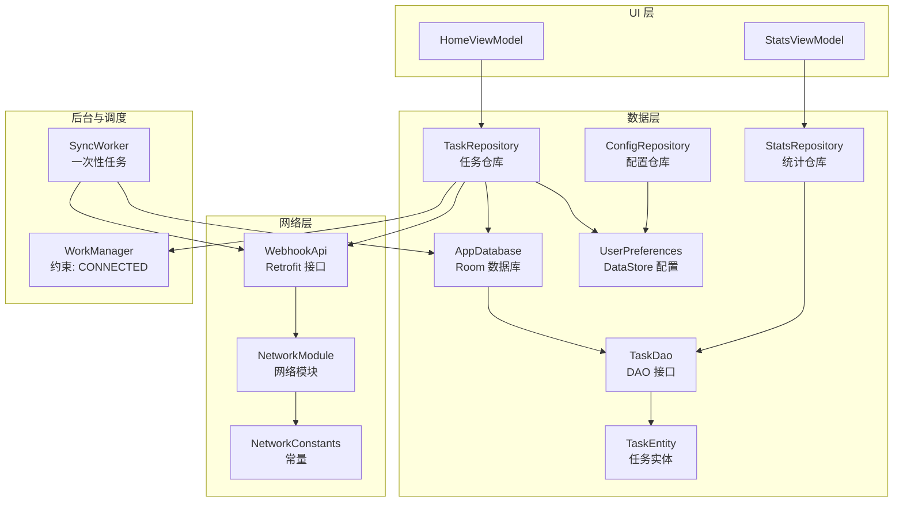
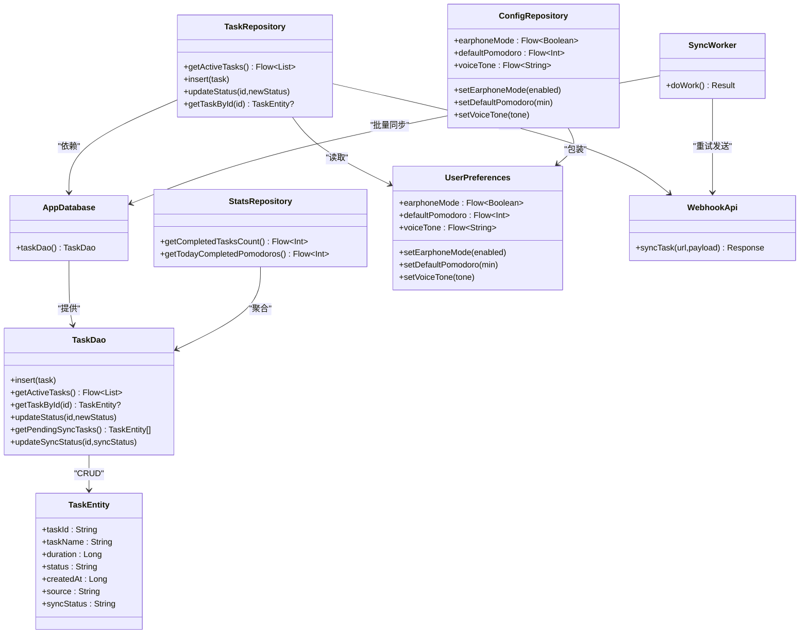
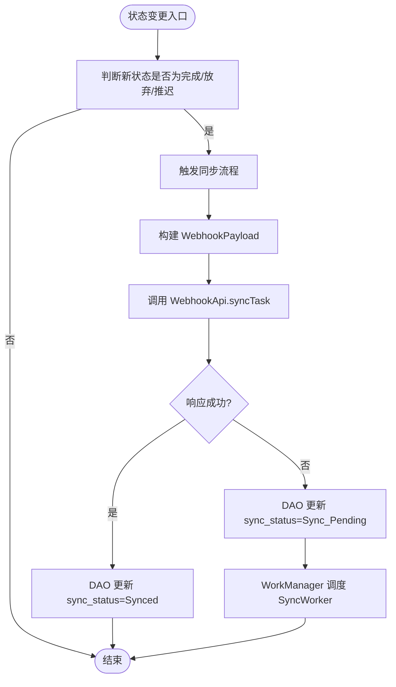
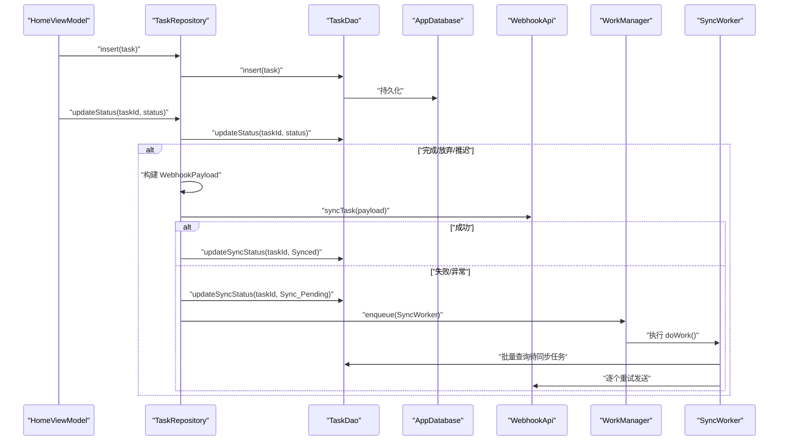
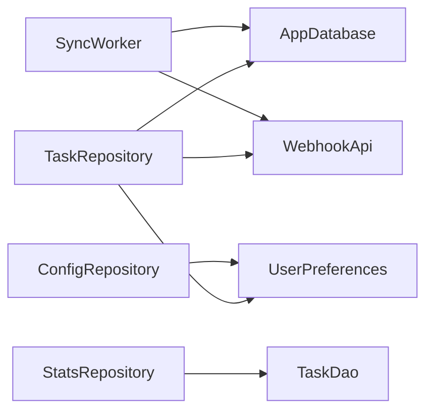

# 数据层设计

<cite>
**本文引用的文件**
- [AppDatabase.kt](file://app/src/main/java/com/pomodoroalert/data/AppDatabase.kt)
- [TaskEntity.kt](file://app/src/main/java/com/pomodoroalert/data/TaskEntity.kt)
- [TaskDao.kt](file://app/src/main/java/com/pomodoroalert/data/TaskDao.kt)
- [TaskRepository.kt](file://app/src/main/java/com/pomodoroalert/data/TaskRepository.kt)
- [ConfigRepository.kt](file://app/src/main/java/com/pomodoroalert/data/ConfigRepository.kt)
- [StatsRepository.kt](file://app/src/main/java/com/pomodoroalert/data/StatsRepository.kt)
- [UserPreferences.kt](file://app/src/main/java/com/pomodoroalert/data/UserPreferences.kt)
- [WebhookPayload.kt](file://app/src/main/java/com/pomodoroalert/data/WebhookPayload.kt)
- [AppModule.kt](file://app/src/main/java/com/pomodoroalert/di/AppModule.kt)
- [NetworkModule.kt](file://app/src/main/java/com/pomodoroalert/di/NetworkModule.kt)
- [WebhookApi.kt](file://app/src/main/java/com/pomodoroalert/network/WebhookApi.kt)
- [NetworkConstants.kt](file://app/src/main/java/com/pomodoroalert/network/NetworkConstants.kt)
- [SyncWorker.kt](file://app/src/main/java/com/pomodoroalert/worker/SyncWorker.kt)
- [HomeViewModel.kt](file://app/src/main/java/com/pomodoroalert/ui/viewmodel/HomeViewModel.kt)
- [StatsViewModel.kt](file://app/src/main/java/com/pomodoroalert/ui/viewmodel/StatsViewModel.kt)
</cite>

## 目录
1. [引言](#引言)
2. [项目结构](#项目结构)
3. [核心组件](#核心组件)
4. [架构总览](#架构总览)
5. [详细组件分析](#详细组件分析)
6. [依赖分析](#依赖分析)
7. [性能考虑](#性能考虑)
8. [故障排查指南](#故障排查指南)
9. [结论](#结论)
10. [附录](#附录)

## 引言
本文件系统性梳理 PomodoroAlert 的数据层架构，覆盖 Room 数据库设计与实现（实体、DAO、迁移）、Repository 模式与数据访问抽象、数据模型字段与约束、缓存与离线存储、数据同步策略、性能优化、数据安全与完整性保障，以及与应用其他层的集成关系。目标是帮助开发者快速理解并维护数据层。

## 项目结构
数据层位于 app/src/main/java/com/pomodoroalert/data，围绕 Room 任务表与 DataStore 用户偏好，通过 Repository 抽象对外提供统一的数据访问能力；网络层通过 Retrofit 提供 Webhook 同步能力，配合 WorkManager 实现后台重试与批量同步。

图表来源
- [AppDatabase.kt:1-10](file://app/src/main/java/com/pomodoroalert/data/AppDatabase.kt#L1-L10)
- [TaskDao.kt:1-29](file://app/src/main/java/com/pomodoroalert/data/TaskDao.kt#L1-L29)
- [TaskEntity.kt:1-19](file://app/src/main/java/com/pomodoroalert/data/TaskEntity.kt#L1-L19)
- [UserPreferences.kt:1-36](file://app/src/main/java/com/pomodoroalert/data/UserPreferences.kt#L1-L36)
- [TaskRepository.kt:1-101](file://app/src/main/java/com/pomodoroalert/data/TaskRepository.kt#L1-L101)
- [ConfigRepository.kt:1-19](file://app/src/main/java/com/pomodoroalert/data/ConfigRepository.kt#L1-L19)
- [StatsRepository.kt:1-18](file://app/src/main/java/com/pomodoroalert/data/StatsRepository.kt#L1-L18)
- [WebhookApi.kt:1-16](file://app/src/main/java/com/pomodoroalert/network/WebhookApi.kt#L1-L16)
- [NetworkModule.kt:1-53](file://app/src/main/java/com/pomodoroalert/di/NetworkModule.kt#L1-L53)
- [NetworkConstants.kt:1-7](file://app/src/main/java/com/pomodoroalert/network/NetworkConstants.kt#L1-L7)
- [SyncWorker.kt:1-78](file://app/src/main/java/com/pomodoroalert/worker/SyncWorker.kt#L1-L78)
- [HomeViewModel.kt:1-53](file://app/src/main/java/com/pomodoroalert/ui/viewmodel/HomeViewModel.kt#L1-L53)
- [StatsViewModel.kt:1-22](file://app/src/main/java/com/pomodoroalert/ui/viewmodel/StatsViewModel.kt#L1-L22)

章节来源
- [AppDatabase.kt:1-10](file://app/src/main/java/com/pomodoroalert/data/AppDatabase.kt#L1-L10)
- [AppModule.kt:1-61](file://app/src/main/java/com/pomodoroalert/di/AppModule.kt#L1-L61)

## 核心组件
- Room 数据库与实体
  - AppDatabase：声明实体与 DAO 访问入口，版本号当前为 1。
  - TaskEntity：任务表映射，主键 taskId，包含名称、时长、状态、创建时间、来源、同步状态等字段。
- DAO 与 Repository
  - TaskDao：提供插入、查询活动任务、按 ID 查询、更新状态、查询待同步任务、更新同步状态等方法。
  - TaskRepository：封装数据访问与业务逻辑，负责触发同步、处理异常与重试、格式化时间戳。
  - ConfigRepository：暴露用户偏好流并提供写入方法。
  - StatsRepository：基于 DAO 的聚合统计（已完成任务数、今日完成的番茄钟数）。
- 存储与同步
  - UserPreferences：基于 DataStore 的轻量配置存储（耳机模式、默认番茄钟、音色）。
  - SyncWorker：后台一次性任务，批量重试待同步任务。
  - WebhookApi：Retrofit 接口，用于向云端 Webhook 发送任务记录。
- DI 与模块
  - AppModule：提供数据库、DAO、UserPreferences、ConfigRepository、StatsRepository、日历管理器等单例。
  - NetworkModule：提供 Gson、OkHttpClient、Retrofit、WebhookApi。

章节来源
- [TaskEntity.kt:1-19](file://app/src/main/java/com/pomodoroalert/data/TaskEntity.kt#L1-L19)
- [TaskDao.kt:1-29](file://app/src/main/java/com/pomodoroalert/data/TaskDao.kt#L1-L29)
- [TaskRepository.kt:1-101](file://app/src/main/java/com/pomodoroalert/data/TaskRepository.kt#L1-L101)
- [ConfigRepository.kt:1-19](file://app/src/main/java/com/pomodoroalert/data/ConfigRepository.kt#L1-L19)
- [StatsRepository.kt:1-18](file://app/src/main/java/com/pomodoroalert/data/StatsRepository.kt#L1-L18)
- [UserPreferences.kt:1-36](file://app/src/main/java/com/pomodoroalert/data/UserPreferences.kt#L1-L36)
- [SyncWorker.kt:1-78](file://app/src/main/java/com/pomodoroalert/worker/SyncWorker.kt#L1-L78)
- [WebhookApi.kt:1-16](file://app/src/main/java/com/pomodoroalert/network/WebhookApi.kt#L1-L16)
- [AppModule.kt:1-61](file://app/src/main/java/com/pomodoroalert/di/AppModule.kt#L1-L61)
- [NetworkModule.kt:1-53](file://app/src/main/java/com/pomodoroalert/di/NetworkModule.kt#L1-L53)

## 架构总览
数据层采用 Repository 模式对 Room 与 DataStore 进行抽象，向上提供稳定的接口，向下屏蔽数据库与网络细节。UI 层通过 ViewModel 订阅 Flow，实现响应式更新；后台通过 WorkManager 与一次性任务保证离线场景下的数据同步。

图表来源
- [AppDatabase.kt:1-10](file://app/src/main/java/com/pomodoroalert/data/AppDatabase.kt#L1-L10)
- [TaskDao.kt:1-29](file://app/src/main/java/com/pomodoroalert/data/TaskDao.kt#L1-L29)
- [TaskEntity.kt:1-19](file://app/src/main/java/com/pomodoroalert/data/TaskEntity.kt#L1-L19)
- [TaskRepository.kt:1-101](file://app/src/main/java/com/pomodoroalert/data/TaskRepository.kt#L1-L101)
- [ConfigRepository.kt:1-19](file://app/src/main/java/com/pomodoroalert/data/ConfigRepository.kt#L1-L19)
- [StatsRepository.kt:1-18](file://app/src/main/java/com/pomodoroalert/data/StatsRepository.kt#L1-L18)
- [UserPreferences.kt:1-36](file://app/src/main/java/com/pomodoroalert/data/UserPreferences.kt#L1-L36)
- [WebhookApi.kt:1-16](file://app/src/main/java/com/pomodoroalert/network/WebhookApi.kt#L1-L16)
- [SyncWorker.kt:1-78](file://app/src/main/java/com/pomodoroalert/worker/SyncWorker.kt#L1-L78)

## 详细组件分析

### Room 数据库与实体
- 数据库定义
  - AppDatabase 使用注解声明实体集合、版本号与导出 Schema。
- 实体设计
  - 表名 tasks，主键 taskId（UUID 字符串），字段包含任务名、时长（毫秒）、状态、创建时间、来源、同步状态。
  - 同步状态字段用于区分“已同步”和“待同步”，支持离线优先与后续重试。
- DAO 设计
  - 插入策略：REPLACE 冲突策略，避免重复主键导致失败。
  - 查询策略：
    - 活动任务：过滤“已放弃”，按创建时间倒序，返回 Flow 支持实时 UI 更新。
    - 按 ID 查询：支持根据 taskId 获取单条记录。
    - 状态更新：按 taskId 更新状态。
    - 待同步查询：筛选 sync_status = "Sync_Pending"，供后台批量重试。
    - 同步状态更新：成功后置为 "Synced"，失败或异常则标记为 "Sync_Pending" 并调度重试。

图表来源
- [TaskRepository.kt:32-80](file://app/src/main/java/com/pomodoroalert/data/TaskRepository.kt#L32-L80)
- [TaskDao.kt:20-27](file://app/src/main/java/com/pomodoroalert/data/TaskDao.kt#L20-L27)
- [SyncWorker.kt:24-71](file://app/src/main/java/com/pomodoroalert/worker/SyncWorker.kt#L24-L71)

章节来源
- [AppDatabase.kt:1-10](file://app/src/main/java/com/pomodoroalert/data/AppDatabase.kt#L1-L10)
- [TaskEntity.kt:1-19](file://app/src/main/java/com/pomodoroalert/data/TaskEntity.kt#L1-L19)
- [TaskDao.kt:1-29](file://app/src/main/java/com/pomodoroalert/data/TaskDao.kt#L1-L29)

### Repository 模式与数据访问抽象
- TaskRepository
  - 对外暴露 Flow 接口以支持响应式 UI。
  - 在状态变更时自动触发同步，若失败则标记待同步并调度后台重试。
  - 将中文状态与来源映射为英文，便于云端对接。
- ConfigRepository
  - 包装 UserPreferences 的流与写入方法，向 ViewModel 提供统一配置访问。
- StatsRepository
  - 基于 DAO 的聚合统计，计算已完成任务数与今日完成的番茄钟数（V1：以任务计数）。

图表来源
- [HomeViewModel.kt:38-51](file://app/src/main/java/com/pomodoroalert/ui/viewmodel/HomeViewModel.kt#L38-L51)
- [TaskRepository.kt:32-94](file://app/src/main/java/com/pomodoroalert/data/TaskRepository.kt#L32-L94)
- [TaskDao.kt:14-27](file://app/src/main/java/com/pomodoroalert/data/TaskDao.kt#L14-L27)
- [WebhookApi.kt:9-15](file://app/src/main/java/com/pomodoroalert/network/WebhookApi.kt#L9-L15)
- [SyncWorker.kt:24-71](file://app/src/main/java/com/pomodoroalert/worker/SyncWorker.kt#L24-L71)

章节来源
- [TaskRepository.kt:1-101](file://app/src/main/java/com/pomodoroalert/data/TaskRepository.kt#L1-L101)
- [ConfigRepository.kt:1-19](file://app/src/main/java/com/pomodoroalert/data/ConfigRepository.kt#L1-L19)
- [StatsRepository.kt:1-18](file://app/src/main/java/com/pomodoroalert/data/StatsRepository.kt#L1-L18)

### 数据模型字段定义、约束与业务校验
- 字段定义
  - taskId：主键，唯一标识每条任务。
  - taskName：任务名称，非空。
  - duration：计划时长（毫秒），用于 UI 计时与统计。
  - status：任务状态，枚举值包括“待开始/进行中/已完成/已放弃/推迟”。
  - createdAt：创建时间戳，用于排序与统计。
  - source：触发来源，“手动/语音/日历”。
  - syncStatus：同步状态，“Synced/Sync_Pending”。
- 约束与默认值
  - 主键约束：Room 自动保证。
  - 默认 syncStatus：未显式设置时默认为“Synced”。
  - 默认 source：新增任务时默认“手动”。
- 业务逻辑验证
  - 状态变更触发同步：当状态进入“已完成/已放弃/推迟”时，自动尝试同步至云端。
  - 同步失败回退：标记为“Sync_Pending”，由后台任务重试。
  - 统计逻辑：已完成任务数与今日完成的番茄钟数均基于活动任务集合过滤计算。

章节来源
- [TaskEntity.kt:8-18](file://app/src/main/java/com/pomodoroalert/data/TaskEntity.kt#L8-L18)
- [TaskDao.kt:14-27](file://app/src/main/java/com/pomodoroalert/data/TaskDao.kt#L14-L27)
- [TaskRepository.kt:32-38](file://app/src/main/java/com/pomodoroalert/data/TaskRepository.kt#L32-L38)
- [StatsRepository.kt:7-16](file://app/src/main/java/com/pomodoroalert/data/StatsRepository.kt#L7-L16)

### 缓存策略、离线存储与数据同步
- 缓存与离线
  - Room 作为本地缓存层，提供实时查询与 Flow 响应式更新。
  - DataStore 保存用户偏好，具备原子写入与流式读取能力。
- 同步方案
  - 前台状态变更即时尝试同步；失败则标记待同步并调度后台重试。
  - SyncWorker 批量扫描待同步任务，逐个发送至云端 Webhook。
  - 仅在有网络时执行重试（WorkManager 约束 CONNECTED）。

章节来源
- [TaskRepository.kt:42-94](file://app/src/main/java/com/pomodoroalert/data/TaskRepository.kt#L42-L94)
- [SyncWorker.kt:24-71](file://app/src/main/java/com/pomodoroalert/worker/SyncWorker.kt#L24-L71)
- [UserPreferences.kt:22-24](file://app/src/main/java/com/pomodoroalert/data/UserPreferences.kt#L22-L24)

### 性能优化与查询优化
- 查询优化
  - 使用 Flow 返回活动任务，避免阻塞 UI 线程；仅对必要字段建立索引（建议：createdAt、status、sync_status）。
  - 使用 REPLACE 冲突策略减少重复插入失败开销。
- 网络与后台
  - OkHttp 设置连接/读/写超时，降低弱网环境下的卡顿风险。
  - WorkManager 结合网络约束，避免无意义的重试。
- UI 响应
  - ViewModel 通过 stateIn 与 WhileSubscribed 控制订阅生命周期，避免内存泄漏与过度刷新。

章节来源
- [TaskDao.kt:14-15](file://app/src/main/java/com/pomodoroalert/data/TaskDao.kt#L14-L15)
- [NetworkModule.kt:28-34](file://app/src/main/java/com/pomodoroalert/di/NetworkModule.kt#L28-L34)
- [StatsViewModel.kt:16-21](file://app/src/main/java/com/pomodoroalert/ui/viewmodel/StatsViewModel.kt#L16-L21)

### 数据安全、备份与完整性
- 数据安全
  - Webhook 请求通过 Retrofit 发送，URL 可动态指定；网络层使用 OkHttp 客户端，可扩展 TLS/认证。
  - 敏感信息不存储在本地数据库，用户偏好通过 DataStore 保存。
- 备份与恢复
  - Room 数据库随应用安装包备份；可通过系统备份策略或迁移至新设备恢复。
  - DataStore 文件结构简单，易于迁移与备份。
- 完整性保障
  - 主键约束确保任务唯一性；状态与来源字段采用受控枚举字符串，减少脏数据。
  - 同步状态字段保证最终一致性；失败自动重试，提升可靠性。

章节来源
- [WebhookApi.kt:9-15](file://app/src/main/java/com/pomodoroalert/network/WebhookApi.kt#L9-L15)
- [NetworkConstants.kt:3-6](file://app/src/main/java/com/pomodoroalert/network/NetworkConstants.kt#L3-L6)
- [TaskEntity.kt:10-17](file://app/src/main/java/com/pomodoroalert/data/TaskEntity.kt#L10-L17)

### 与其他架构层的集成
- 与 UI 层
  - HomeViewModel 订阅活动任务 Flow，实时展示；通过 ConfigRepository 获取默认时长。
  - StatsViewModel 订阅统计 Flow，展示完成数与今日番茄钟数。
- 与网络层
  - WebhookApi 通过 Retrofit 注入，网络模块统一提供客户端与转换器。
- 与后台层
  - TaskRepository 与 SyncWorker 通过 WorkManager 协作，实现后台重试与批量同步。

章节来源
- [HomeViewModel.kt:26-32](file://app/src/main/java/com/pomodoroalert/ui/viewmodel/HomeViewModel.kt#L26-L32)
- [HomeViewModel.kt:38-51](file://app/src/main/java/com/pomodoroalert/ui/viewmodel/HomeViewModel.kt#L38-L51)
- [StatsViewModel.kt:16-21](file://app/src/main/java/com/pomodoroalert/ui/viewmodel/StatsViewModel.kt#L16-L21)
- [NetworkModule.kt:38-51](file://app/src/main/java/com/pomodoroalert/di/NetworkModule.kt#L38-L51)
- [TaskRepository.kt:82-94](file://app/src/main/java/com/pomodoroalert/data/TaskRepository.kt#L82-L94)

## 依赖分析
- 组件耦合
  - TaskRepository 依赖 AppDatabase、WebhookApi、UserPreferences，承担业务协调职责。
  - StatsRepository 仅依赖 TaskDao，保持低耦合与高内聚。
  - ConfigRepository 仅包装 UserPreferences，职责单一。
- 外部依赖
  - Room 提供本地持久化；DataStore 提供偏好存储；Retrofit/OkHttp 提供网络通信；WorkManager 提供后台调度。
- 潜在循环依赖
  - 当前模块未见循环依赖；DI 模块集中提供依赖，避免横向耦合。

图表来源
- [TaskRepository.kt:20-25](file://app/src/main/java/com/pomodoroalert/data/TaskRepository.kt#L20-L25)
- [StatsRepository.kt:6](file://app/src/main/java/com/pomodoroalert/data/StatsRepository.kt#L6)
- [ConfigRepository.kt:7](file://app/src/main/java/com/pomodoroalert/data/ConfigRepository.kt#L7)
- [SyncWorker.kt:16-22](file://app/src/main/java/com/pomodoroalert/worker/SyncWorker.kt#L16-L22)

章节来源
- [AppModule.kt:23-60](file://app/src/main/java/com/pomodoroalert/di/AppModule.kt#L23-L60)
- [NetworkModule.kt:20-51](file://app/src/main/java/com/pomodoroalert/di/NetworkModule.kt#L20-L51)

## 性能考虑
- 数据库层面
  - 为高频查询字段（如 status、createdAt、sync_status）建立索引，提升排序与过滤效率。
  - 使用 Flow 替代 LiveData，减少不必要的中间对象与转换成本。
- 网络层面
  - 合理设置 OkHttp 超时参数，避免长时间阻塞；对重试策略设置上限与抖动，防止风暴。
- 后台层面
  - WorkManager 的网络约束与指数退避结合，降低功耗与流量消耗。
- UI 层面
  - 使用 stateIn 控制订阅生命周期，避免频繁重组；对列表渲染使用懒加载与分页（如需）。

## 故障排查指南
- 同步失败
  - 现象：任务状态变更后未上报云端。
  - 排查：检查 WebhookApi 响应码与异常栈；确认 WorkManager 是否正确调度 SyncWorker。
- 数据不一致
  - 现象：UI 显示与云端不一致。
  - 排查：核对 sync_status 字段；检查 DAO 更新路径与 WorkManager 重试结果。
- 配置读取异常
  - 现象：默认时长或音色未生效。
  - 排查：确认 DataStore 写入是否成功；检查 ConfigRepository 流订阅与默认值回退逻辑。

章节来源
- [TaskRepository.kt:68-79](file://app/src/main/java/com/pomodoroalert/data/TaskRepository.kt#L68-L79)
- [SyncWorker.kt:57-68](file://app/src/main/java/com/pomodoroalert/worker/SyncWorker.kt#L57-L68)
- [UserPreferences.kt:22-24](file://app/src/main/java/com/pomodoroalert/data/UserPreferences.kt#L22-L24)

## 结论
本数据层以 Room 为核心，结合 DataStore 与 Retrofit/WorkManager，形成“本地优先、云端对账”的可靠方案。Repository 模式有效隔离了数据源差异，使 UI 与业务逻辑解耦；Flow 与 WorkManager 则分别保障了实时性与离线能力。建议后续完善索引、错误重试上限与日志埋点，持续优化用户体验与数据一致性。

## 附录
- 数据库迁移策略
  - 当前版本 1，后续升级时建议使用 Room Migration 类型安全迁移，保留历史数据并逐步添加/调整列。
- 字段与约束清单
  - 主键：taskId
  - 约束：非空（taskName、duration、status、createdAt、source）
  - 默认值：syncStatus="Synced"，source="手动"
- 关键流程路径
  - 新增任务：HomeViewModel → TaskRepository → TaskDao → AppDatabase
  - 状态变更与同步：TaskRepository → WebhookApi → SyncWorker（必要时）