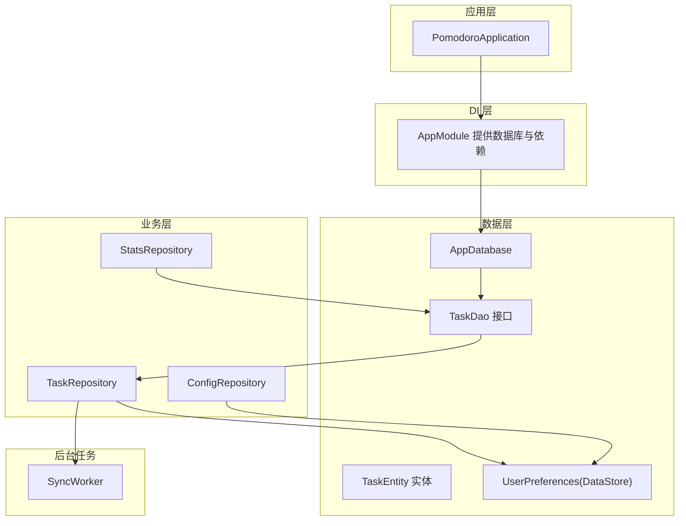
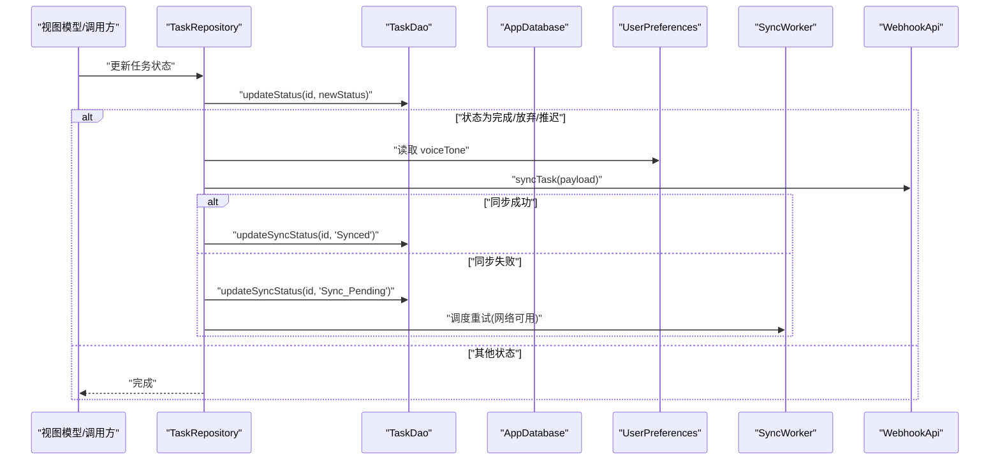
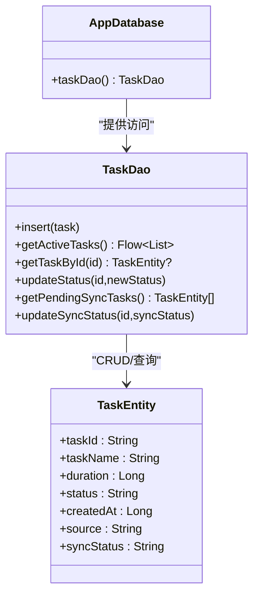
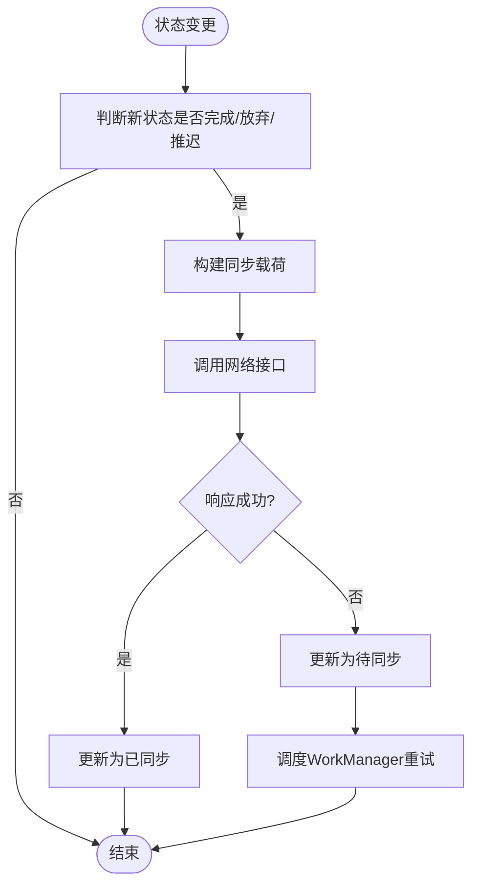
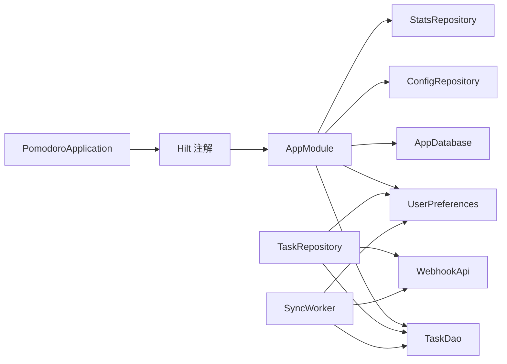

# 数据库设计

<cite>
**本文引用的文件**
- [AppDatabase.kt](file://app/src/main/java/com/pomodoroalert/data/AppDatabase.kt)
- [TaskEntity.kt](file://app/src/main/java/com/pomodoroalert/data/TaskEntity.kt)
- [TaskDao.kt](file://app/src/main/java/com/pomodoroalert/data/TaskDao.kt)
- [TaskRepository.kt](file://app/src/main/java/com/pomodoroalert/data/TaskRepository.kt)
- [AppModule.kt](file://app/src/main/java/com/pomodoroalert/di/AppModule.kt)
- [SyncWorker.kt](file://app/src/main/java/com/pomodoroalert/worker/SyncWorker.kt)
- [UserPreferences.kt](file://app/src/main/java/com/pomodoroalert/data/UserPreferences.kt)
- [ConfigRepository.kt](file://app/src/main/java/com/pomodoroalert/data/ConfigRepository.kt)
- [StatsRepository.kt](file://app/src/main/java/com/pomodoroalert/data/StatsRepository.kt)
- [PomodoroApplication.kt](file://app/src/main/java/com/pomodoroalert/PomodoroApplication.kt)
- [app/build.gradle.kts](file://app/build.gradle.kts)
</cite>

## 目录
1. [简介](#简介)
2. [项目结构](#项目结构)
3. [核心组件](#核心组件)
4. [架构总览](#架构总览)
5. [详细组件分析](#详细组件分析)
6. [依赖关系分析](#依赖关系分析)
7. [性能考虑](#性能考虑)
8. [故障排查指南](#故障排查指南)
9. [结论](#结论)
10. [附录](#附录)

## 简介
本文件围绕 PomodoroAlert 的 Room 数据库设计展开，系统性阐述 AppDatabase 类的架构与职责、实体类注册机制、数据库初始化流程、Room 注解的使用方式（如 @Entity、@Database、DAO 查询等），以及当前版本下的数据库迁移现状与扩展建议。同时给出性能优化、索引与查询优化、内存管理、备份恢复与数据完整性保障的实践建议，并提供可落地的最佳实践与参考路径。

## 项目结构
本应用采用基于模块化的分层组织，数据库相关代码集中在 data 包下，配合 DI 模块在 di 包中提供数据库实例与 DAO 绑定；同步逻辑通过独立的 worker 包实现离线重试；用户偏好使用 DataStore 存储。

图表来源
- [PomodoroApplication.kt:1-8](file://app/src/main/java/com/pomodoroalert/PomodoroApplication.kt#L1-L8)
- [AppModule.kt:1-61](file://app/src/main/java/com/pomodoroalert/di/AppModule.kt#L1-L61)
- [AppDatabase.kt:1-10](file://app/src/main/java/com/pomodoroalert/data/AppDatabase.kt#L1-L10)
- [TaskDao.kt:1-29](file://app/src/main/java/com/pomodoroalert/data/TaskDao.kt#L1-L29)
- [TaskEntity.kt:1-19](file://app/src/main/java/com/pomodoroalert/data/TaskEntity.kt#L1-L19)
- [TaskRepository.kt:1-101](file://app/src/main/java/com/pomodoroalert/data/TaskRepository.kt#L1-L101)
- [StatsRepository.kt:1-18](file://app/src/main/java/com/pomodoroalert/data/StatsRepository.kt#L1-L18)
- [ConfigRepository.kt:1-19](file://app/src/main/java/com/pomodoroalert/data/ConfigRepository.kt#L1-L19)
- [UserPreferences.kt:1-36](file://app/src/main/java/com/pomodoroalert/data/UserPreferences.kt#L1-L36)
- [SyncWorker.kt:1-78](file://app/src/main/java/com/pomodoroalert/worker/SyncWorker.kt#L1-L78)

章节来源
- [PomodoroApplication.kt:1-8](file://app/src/main/java/com/pomodoroalert/PomodoroApplication.kt#L1-L8)
- [AppModule.kt:1-61](file://app/src/main/java/com/pomodoroalert/di/AppModule.kt#L1-L61)
- [app/build.gradle.kts:43-79](file://app/build.gradle.kts#L43-L79)

## 核心组件
- AppDatabase：Room 数据库入口，声明实体集合、版本号与 DAO 访问器。
- TaskEntity：单表 tasks 的实体映射，包含主键、字段与列名别名。
- TaskDao：定义增删改查与流式查询接口，支撑仓库层业务。
- TaskRepository：封装业务逻辑，负责状态变更触发同步、失败时标记并调度重试。
- SyncWorker：后台任务，批量拉取待同步任务并调用网络接口，成功则更新状态。
- UserPreferences：使用 DataStore 存储用户偏好，作为同步 payload 的部分数据源。
- ConfigRepository/StatsRepository：分别提供配置读取与统计计算能力。

章节来源
- [AppDatabase.kt:1-10](file://app/src/main/java/com/pomodoroalert/data/AppDatabase.kt#L1-L10)
- [TaskEntity.kt:1-19](file://app/src/main/java/com/pomodoroalert/data/TaskEntity.kt#L1-L19)
- [TaskDao.kt:1-29](file://app/src/main/java/com/pomodoroalert/data/TaskDao.kt#L1-L29)
- [TaskRepository.kt:1-101](file://app/src/main/java/com/pomodoroalert/data/TaskRepository.kt#L1-L101)
- [SyncWorker.kt:1-78](file://app/src/main/java/com/pomodoroalert/worker/SyncWorker.kt#L1-L78)
- [UserPreferences.kt:1-36](file://app/src/main/java/com/pomodoroalert/data/UserPreferences.kt#L1-L36)
- [ConfigRepository.kt:1-19](file://app/src/main/java/com/pomodoroalert/data/ConfigRepository.kt#L1-L19)
- [StatsRepository.kt:1-18](file://app/src/main/java/com/pomodoroalert/data/StatsRepository.kt#L1-L18)

## 架构总览
Room 在本项目中的定位是本地持久化层，结合 Hilt 进行依赖注入，DAO 返回 Flow 支持响应式 UI 更新；业务层在状态变更后触发同步，若网络异常则标记待同步并通过 WorkManager 定时重试。

图表来源
- [TaskRepository.kt:32-80](file://app/src/main/java/com/pomodoroalert/data/TaskRepository.kt#L32-L80)
- [TaskDao.kt:20-27](file://app/src/main/java/com/pomodoroalert/data/TaskDao.kt#L20-L27)
- [UserPreferences.kt:22-24](file://app/src/main/java/com/pomodoroalert/data/UserPreferences.kt#L22-L24)
- [SyncWorker.kt:24-71](file://app/src/main/java/com/pomodoroalert/worker/SyncWorker.kt#L24-L71)

## 详细组件分析

### AppDatabase 设计与初始化
- 数据库版本：当前版本为 1，exportSchema 关闭以避免生成数据库模式文件。
- 实体注册：仅注册 TaskEntity，后续新增实体需在此处补充。
- DAO 提供：暴露 taskDao() 访问器，供仓库层使用。
- 初始化：通过 AppModule 使用 Room.databaseBuilder 创建数据库实例，指定数据库名称。

图表来源
- [AppDatabase.kt:6-9](file://app/src/main/java/com/pomodoroalert/data/AppDatabase.kt#L6-L9)
- [TaskDao.kt:9-28](file://app/src/main/java/com/pomodoroalert/data/TaskDao.kt#L9-L28)
- [TaskEntity.kt:8-18](file://app/src/main/java/com/pomodoroalert/data/TaskEntity.kt#L8-L18)

章节来源
- [AppDatabase.kt:6-9](file://app/src/main/java/com/pomodoroalert/data/AppDatabase.kt#L6-L9)
- [AppModule.kt:25-31](file://app/src/main/java/com/pomodoroalert/di/AppModule.kt#L25-L31)

### 实体与注解使用
- @Entity：定义表名为 tasks，主键为 taskId，列名通过 ColumnInfo 映射。
- @PrimaryKey：使用字符串主键，初始值为 UUID。
- 字段语义：包含任务名、持续时间（毫秒）、状态、创建时间、来源、同步状态。
- 列名别名：sync_status 用于区分是否需要同步。

章节来源
- [TaskEntity.kt:8-18](file://app/src/main/java/com/pomodoroalert/data/TaskEntity.kt#L8-L18)

### DAO 查询与策略
- 插入策略：REPLACE 冲突策略，避免重复主键导致插入失败。
- 流式查询：getActiveTasks 返回 Flow，支持响应式 UI 订阅。
- 条件查询：按 taskId 查询单条记录；按 sync_status 查询待同步任务。
- 状态更新：支持按 id 更新状态与同步状态。

章节来源
- [TaskDao.kt:11-27](file://app/src/main/java/com/pomodoroalert/data/TaskDao.kt#L11-L27)

### 同步与重试机制
- 触发条件：当任务状态变为“已完成/已放弃/推迟”时触发同步。
- 成功/失败处理：成功则更新为已同步；失败则标记为待同步并调度 WorkManager。
- 后台重试：SyncWorker 批量处理待同步任务，逐个调用网络接口，全部成功返回成功，否则返回重试。

图表来源
- [TaskRepository.kt:32-80](file://app/src/main/java/com/pomodoroalert/data/TaskRepository.kt#L32-L80)
- [SyncWorker.kt:24-71](file://app/src/main/java/com/pomodoroalert/worker/SyncWorker.kt#L24-L71)

章节来源
- [TaskRepository.kt:32-94](file://app/src/main/java/com/pomodoroalert/data/TaskRepository.kt#L32-L94)
- [SyncWorker.kt:24-71](file://app/src/main/java/com/pomodoroalert/worker/SyncWorker.kt#L24-L71)

### 用户偏好与配置仓库
- UserPreferences：使用 DataStore 存储布尔、整型、字符串偏好键，提供 Flow 读取与 suspend 写入。
- ConfigRepository：对外暴露偏好 Flow 并提供设置方法，便于 ViewModel 获取默认参数。

章节来源
- [UserPreferences.kt:15-35](file://app/src/main/java/com/pomodoroalert/data/UserPreferences.kt#L15-L35)
- [ConfigRepository.kt:7-18](file://app/src/main/java/com/pomodoroalert/data/ConfigRepository.kt#L7-L18)

### 统计仓库
- StatsRepository 基于 DAO 的 Flow 计算已完成任务数量，并将其映射为“当日完成的番茄钟数”。

章节来源
- [StatsRepository.kt:6-17](file://app/src/main/java/com/pomodoroalert/data/StatsRepository.kt#L6-L17)

## 依赖关系分析
- 依赖注入：AppModule 提供 AppDatabase、TaskDao、UserPreferences、ConfigRepository、StatsRepository 等单例依赖。
- 数据库与 DAO：AppDatabase 暴露 DAO；TaskRepository 通过构造注入使用 DAO。
- 同步链路：TaskRepository 调用网络接口与 DAO；SyncWorker 作为后台任务复用相同 DAO 与网络接口。
- 应用启动：PomodoroApplication 使用 Hilt 注解启用依赖注入。

图表来源
- [PomodoroApplication.kt:6-7](file://app/src/main/java/com/pomodoroalert/PomodoroApplication.kt#L6-L7)
- [AppModule.kt:23-60](file://app/src/main/java/com/pomodoroalert/di/AppModule.kt#L23-L60)
- [TaskRepository.kt:20-25](file://app/src/main/java/com/pomodoroalert/data/TaskRepository.kt#L20-L25)
- [SyncWorker.kt:15-22](file://app/src/main/java/com/pomodoroalert/worker/SyncWorker.kt#L15-L22)

章节来源
- [AppModule.kt:23-60](file://app/src/main/java/com/pomodoroalert/di/AppModule.kt#L23-L60)
- [PomodoroApplication.kt:6-7](file://app/src/main/java/com/pomodoroalert/PomodoroApplication.kt#L6-L7)

## 性能考虑
- 查询优化
  - 使用 Flow 订阅 getActiveTasks 可减少不必要的 UI 重建，但需注意上游数据量增长带来的内存压力。
  - 对频繁过滤的字段（如 status、sync_status）建立索引可显著提升查询效率（见“索引设计”）。
- 索引设计
  - 建议对 status、sync_status、taskId 等常用过滤/连接字段添加索引，避免全表扫描。
  - 对 createdAt 添加索引以支持高效排序与范围查询。
- 内存管理
  - 避免一次性加载大量历史数据；使用分页或限制返回条数。
  - Flow 订阅应与生命周期绑定，防止泄漏。
- 数据库大小控制
  - 定期清理“已放弃”等无效任务，降低数据库体积。
  - 对历史数据进行归档或压缩存储（如外部文件或压缩表）。
- I/O 与并发
  - 将耗时操作（网络同步）放入 IO 协程或后台任务，避免阻塞主线程。
  - 批量写入优于多次小事务，减少 WAL 切换开销。

## 故障排查指南
- 同步失败重试
  - 若网络异常，标记为待同步并由 SyncWorker 重试；检查 WorkManager 约束与队列状态。
- 数据不一致
  - 当状态与同步状态不一致时，可通过 DAO 的 getPendingSyncTasks 与 updateSyncStatus 进行修复。
- 数据库版本问题
  - 当前版本为 1，尚未实现迁移；升级时务必提供 Migration 并确保向后兼容。
- 日志与调试
  - 在 TaskRepository 与 SyncWorker 中捕获异常并打印日志，定位具体失败点。

章节来源
- [TaskRepository.kt:68-79](file://app/src/main/java/com/pomodoroalert/data/TaskRepository.kt#L68-L79)
- [SyncWorker.kt:64-67](file://app/src/main/java/com/pomodoroalert/worker/SyncWorker.kt#L64-L67)

## 结论
当前数据库设计简洁清晰，以 TaskEntity 为核心，结合 Flow 实现响应式 UI，通过 TaskRepository 与 SyncWorker 实现状态驱动的同步与重试。建议在后续版本中完善数据库迁移、索引与查询优化、备份恢复与数据完整性保障，以满足更复杂的业务场景与更高的可靠性要求。

## 附录

### Room 注解使用要点
- @Database：声明实体列表、版本号与导出模式；本项目关闭导出。
- @Entity：定义表名与主键；建议为主键添加索引。
- @PrimaryKey/@ColumnInfo：主键与列名映射。
- @Dao/@Insert/@Query：定义数据访问接口与查询语句。
- @HiltWorker/@AssistedInject：在后台任务中注入数据库与网络接口。

章节来源
- [AppDatabase.kt:6](file://app/src/main/java/com/pomodoroalert/data/AppDatabase.kt#L6)
- [TaskEntity.kt:8-18](file://app/src/main/java/com/pomodoroalert/data/TaskEntity.kt#L8-L18)
- [TaskDao.kt:9-28](file://app/src/main/java/com/pomodoroalert/data/TaskDao.kt#L9-L28)
- [SyncWorker.kt:15-22](file://app/src/main/java/com/pomodoroalert/worker/SyncWorker.kt#L15-L22)

### 数据库迁移与版本升级
- 当前状态：版本 1，无迁移脚本。
- 升级建议：
  - 新增表或列时，提供从旧版本到新版本的 Migration。
  - 使用 AutoMigrationSpec 或自定义 Migration，确保数据安全。
  - 迁移前后进行数据校验与回滚预案。
  - 发布前在测试环境验证迁移脚本。

章节来源
- [AppDatabase.kt:6](file://app/src/main/java/com/pomodoroalert/data/AppDatabase.kt#L6)

### 备份与恢复方案
- 备份策略
  - 使用 Room 的备份 API 或导出 SQL 文件（需在测试版开启 exportSchema 并谨慎处理）。
  - 对重要数据定期导出为 JSON/CSV，便于人工审计与恢复。
- 恢复流程
  - 从备份文件导入数据，校验主键唯一性与外键一致性。
  - 对比版本号与迁移状态，必要时执行回滚迁移。
- 数据完整性
  - 使用事务包裹批量导入/导出，保证原子性。
  - 导入后运行一致性检查（如去重、校验状态枚举）。

### 最佳实践清单
- 为高频过滤字段建立索引，避免全表扫描。
- 使用 Flow 订阅替代回调，简化生命周期管理。
- 将网络请求与数据库更新分离，统一通过仓库层协调。
- 对异常进行分类处理，区分可重试与不可重试错误。
- 在发布前完成迁移脚本与回归测试。