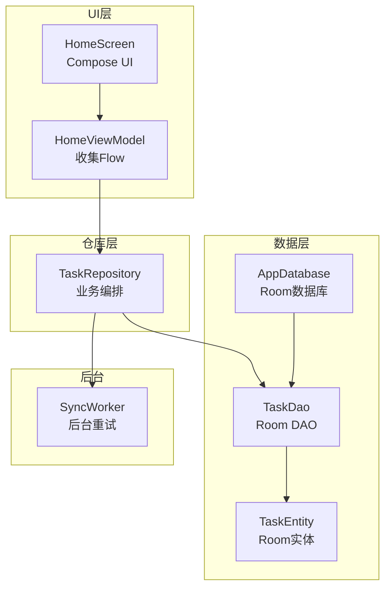
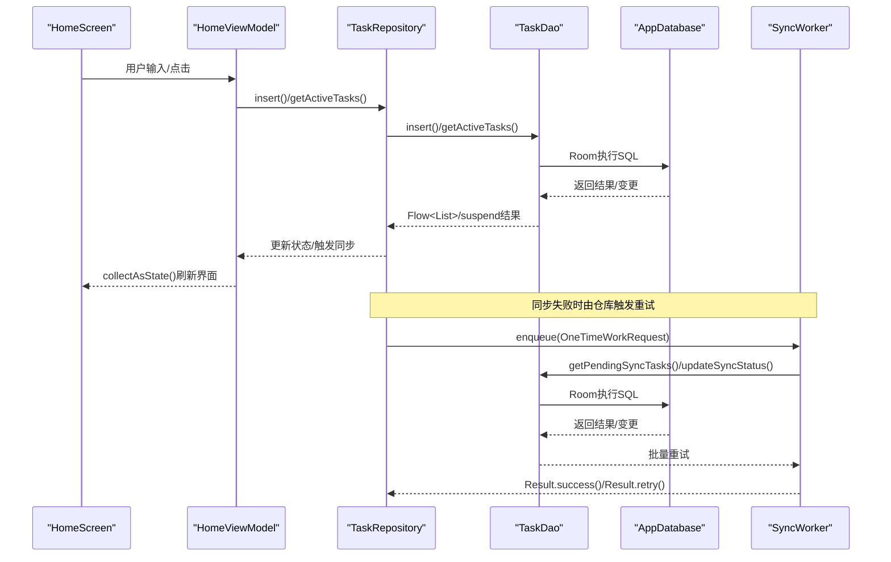
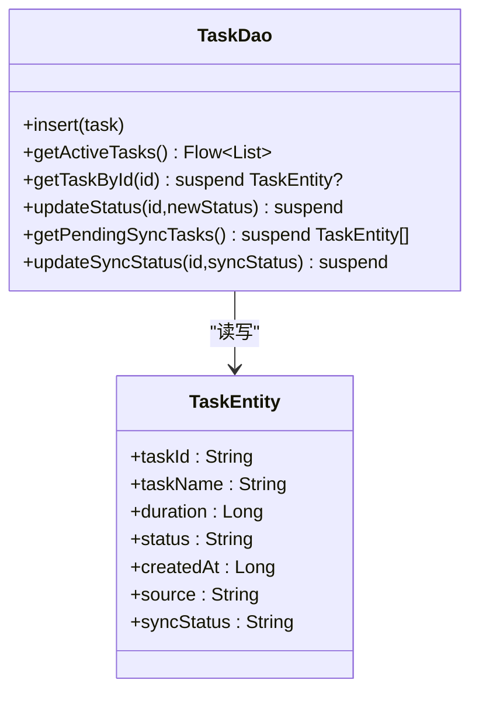
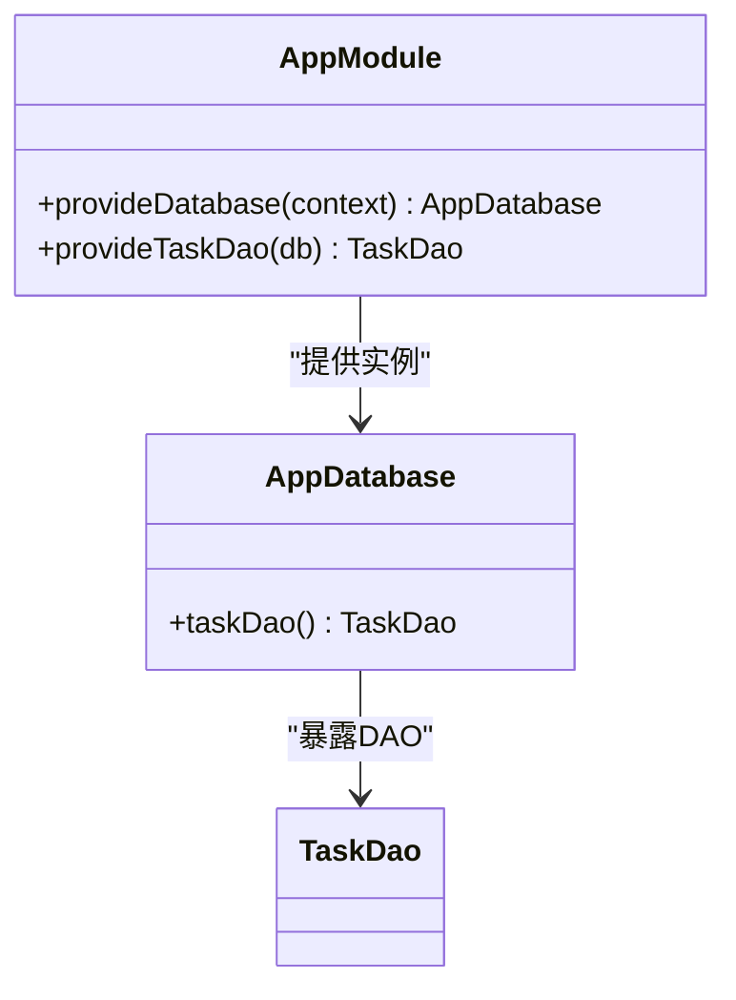
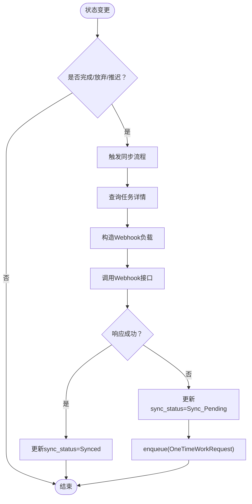
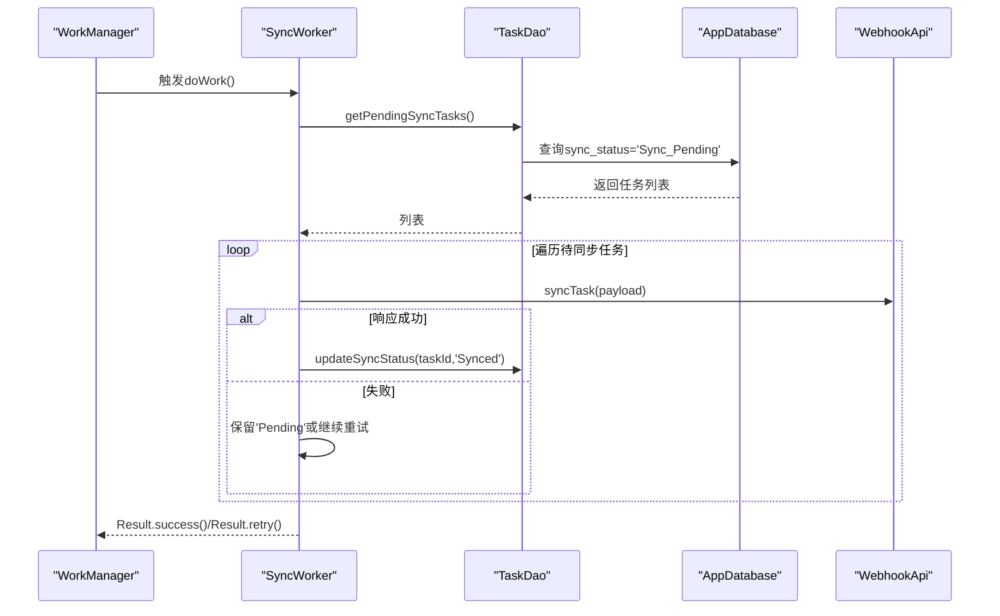
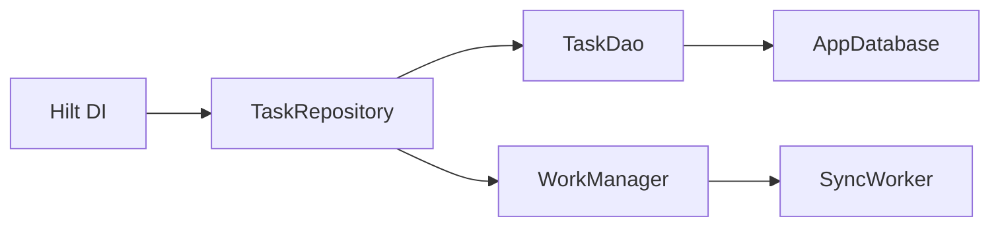

# 数据访问对象

<cite>
**本文引用的文件列表**
- [TaskDao.kt](file://app/src/main/java/com/pomodoroalert/data/TaskDao.kt)
- [TaskEntity.kt](file://app/src/main/java/com/pomodoroalert/data/TaskEntity.kt)
- [AppDatabase.kt](file://app/src/main/java/com/pomodoroalert/data/AppDatabase.kt)
- [TaskRepository.kt](file://app/src/main/java/com/pomodoroalert/data/TaskRepository.kt)
- [AppModule.kt](file://app/src/main/java/com/pomodoroalert/di/AppModule.kt)
- [HomeViewModel.kt](file://app/src/main/java/com/pomodoroalert/ui/viewmodel/HomeViewModel.kt)
- [HomeScreen.kt](file://app/src/main/java/com/pomodoroalert/ui/screens/HomeScreen.kt)
- [SyncWorker.kt](file://app/src/main/java/com/pomodoroalert/worker/SyncWorker.kt)
</cite>

## 目录
1. [简介](#简介)
2. [项目结构](#项目结构)
3. [核心组件](#核心组件)
4. [架构总览](#架构总览)
5. [详细组件分析](#详细组件分析)
6. [依赖关系分析](#依赖关系分析)
7. [性能与异步设计](#性能与异步设计)
8. [查询与SQL实现细节](#查询与sql实现细节)
9. [错误处理与重试策略](#错误处理与重试策略)
10. [查询优化与索引建议](#查询优化与索引建议)
11. [故障排查指南](#故障排查指南)
12. [结论](#结论)

## 简介
本文件聚焦于PomodoroAlert应用中的数据访问层，围绕TaskDao接口展开，系统性阐述其在Room框架下的设计与实现，覆盖：
- DAO接口设计模式与Room注解使用（@Dao、@Query、@Insert、@Update、@Delete）
- 异步查询实现（Flow、suspend函数、协程调度）
- 复杂查询构建（条件过滤、排序、分页、聚合）
- 查询优化与索引最佳实践
- 错误处理与重试机制
- 实际使用模式与代码路径指引

## 项目结构
本项目采用典型的Android MVVM + Hilt + Room架构：
- 数据模型：TaskEntity（Room实体）
- 数据库：AppDatabase（Room数据库）
- 数据访问：TaskDao（Room DAO）
- 仓库层：TaskRepository（业务编排与异步协调）
- 视图模型：HomeViewModel（收集Flow并驱动UI）
- 工作线程：SyncWorker（后台重试与批量同步）

图表来源
- [AppDatabase.kt:6-9](file://app/src/main/java/com/pomodoroalert/data/AppDatabase.kt#L6-L9)
- [TaskDao.kt:9-28](file://app/src/main/java/com/pomodoroalert/data/TaskDao.kt#L9-L28)
- [TaskEntity.kt:8-18](file://app/src/main/java/com/pomodoroalert/data/TaskEntity.kt#L8-L18)
- [TaskRepository.kt:20-28](file://app/src/main/java/com/pomodoroalert/data/TaskRepository.kt#L20-L28)
- [HomeViewModel.kt:26-32](file://app/src/main/java/com/pomodoroalert/ui/viewmodel/HomeViewModel.kt#L26-L32)
- [SyncWorker.kt:24-71](file://app/src/main/java/com/pomodoroalert/worker/SyncWorker.kt#L24-L71)

章节来源
- [AppDatabase.kt:6-9](file://app/src/main/java/com/pomodoroalert/data/AppDatabase.kt#L6-L9)
- [TaskDao.kt:9-28](file://app/src/main/java/com/pomodoroalert/data/TaskDao.kt#L9-L28)
- [TaskEntity.kt:8-18](file://app/src/main/java/com/pomodoroalert/data/TaskEntity.kt#L8-L18)
- [TaskRepository.kt:20-28](file://app/src/main/java/com/pomodoroalert/data/TaskRepository.kt#L20-L28)
- [HomeViewModel.kt:26-32](file://app/src/main/java/com/pomodoroalert/ui/viewmodel/HomeViewModel.kt#L26-L32)
- [SyncWorker.kt:24-71](file://app/src/main/java/com/pomodoroalert/worker/SyncWorker.kt#L24-L71)

## 核心组件
- TaskEntity：定义表结构与字段，含主键、列名映射与默认值。
- AppDatabase：声明实体集合与DAO暴露方法。
- TaskDao：定义增删改查与复杂查询，返回Flow或suspend函数。
- TaskRepository：封装业务逻辑，触发同步流程与重试。
- SyncWorker：后台批量重试同步，失败时返回重试结果。
- HomeViewModel：订阅Flow并更新UI状态。

章节来源
- [TaskEntity.kt:8-18](file://app/src/main/java/com/pomodoroalert/data/TaskEntity.kt#L8-L18)
- [AppDatabase.kt:6-9](file://app/src/main/java/com/pomodoroalert/data/AppDatabase.kt#L6-L9)
- [TaskDao.kt:9-28](file://app/src/main/java/com/pomodoroalert/data/TaskDao.kt#L9-L28)
- [TaskRepository.kt:20-28](file://app/src/main/java/com/pomodoroalert/data/TaskRepository.kt#L20-L28)
- [SyncWorker.kt:24-71](file://app/src/main/java/com/pomodoroalert/worker/SyncWorker.kt#L24-L71)
- [HomeViewModel.kt:26-32](file://app/src/main/java/com/pomodoroalert/ui/viewmodel/HomeViewModel.kt#L26-L32)

## 架构总览
下图展示了从UI到数据库的数据流与异步交互：

图表来源
- [HomeScreen.kt:116-127](file://app/src/main/java/com/pomodoroalert/ui/screens/HomeScreen.kt#L116-L127)
- [HomeViewModel.kt:26-32](file://app/src/main/java/com/pomodoroalert/ui/viewmodel/HomeViewModel.kt#L26-L32)
- [TaskRepository.kt:32-38](file://app/src/main/java/com/pomodoroalert/data/TaskRepository.kt#L32-L38)
- [TaskRepository.kt:82-94](file://app/src/main/java/com/pomodoroalert/data/TaskRepository.kt#L82-L94)
- [TaskDao.kt:14-27](file://app/src/main/java/com/pomodoroalert/data/TaskDao.kt#L14-L27)
- [SyncWorker.kt:24-71](file://app/src/main/java/com/pomodoroalert/worker/SyncWorker.kt#L24-L71)

## 详细组件分析

### TaskDao 接口与Room注解使用
- @Dao：标记接口为Room DAO。
- @Insert：插入单条记录，冲突策略为替换。
- @Query：编写SQL查询，支持参数绑定与返回类型：
  - SELECT + WHERE + ORDER BY：用于筛选与排序。
  - UPDATE：按主键或条件更新字段。
  - SELECT WHERE IN/比较：用于状态过滤与条件查询。
- @Update/@Delete：可选的更新与删除方法（当前未在接口中使用）。

图表来源
- [TaskDao.kt:9-28](file://app/src/main/java/com/pomodoroalert/data/TaskDao.kt#L9-L28)
- [TaskEntity.kt:8-18](file://app/src/main/java/com/pomodoroalert/data/TaskEntity.kt#L8-L18)

章节来源
- [TaskDao.kt:9-28](file://app/src/main/java/com/pomodoroalert/data/TaskDao.kt#L9-L28)
- [TaskEntity.kt:8-18](file://app/src/main/java/com/pomodoroalert/data/TaskEntity.kt#L8-L18)

### AppDatabase 与依赖注入
- AppDatabase声明实体集合与版本号，并暴露taskDao()抽象方法。
- AppModule通过Hilt提供AppDatabase实例与TaskDao单例，供上层注入使用。

图表来源
- [AppDatabase.kt:6-9](file://app/src/main/java/com/pomodoroalert/data/AppDatabase.kt#L6-L9)
- [AppModule.kt:23-35](file://app/src/main/java/com/pomodoroalert/di/AppModule.kt#L23-L35)

章节来源
- [AppDatabase.kt:6-9](file://app/src/main/java/com/pomodoroalert/data/AppDatabase.kt#L6-L9)
- [AppModule.kt:23-35](file://app/src/main/java/com/pomodoroalert/di/AppModule.kt#L23-L35)

### TaskRepository 业务编排与异步
- 将Flow直接透传给UI层，保持响应式更新。
- 在状态变更后触发同步流程，若失败则标记“待同步”并安排后台重试。
- 使用协程在IO调度器中执行网络请求与数据库更新。

图表来源
- [TaskRepository.kt:32-38](file://app/src/main/java/com/pomodoroalert/data/TaskRepository.kt#L32-L38)
- [TaskRepository.kt:68-78](file://app/src/main/java/com/pomodoroalert/data/TaskRepository.kt#L68-L78)
- [TaskRepository.kt:82-94](file://app/src/main/java/com/pomodoroalert/data/TaskRepository.kt#L82-L94)

章节来源
- [TaskRepository.kt:32-38](file://app/src/main/java/com/pomodoroalert/data/TaskRepository.kt#L32-L38)
- [TaskRepository.kt:68-78](file://app/src/main/java/com/pomodoroalert/data/TaskRepository.kt#L68-L78)
- [TaskRepository.kt:82-94](file://app/src/main/java/com/pomodoroalert/data/TaskRepository.kt#L82-L94)

### SyncWorker 后台重试
- 轮询“待同步”任务，逐个尝试同步。
- 成功则更新状态为“已同步”，否则保留“待同步”并允许后续重试。
- 返回Result.success()或Result.retry()以控制WorkManager调度策略。

图表来源
- [SyncWorker.kt:24-71](file://app/src/main/java/com/pomodoroalert/worker/SyncWorker.kt#L24-L71)
- [TaskDao.kt:23-27](file://app/src/main/java/com/pomodoroalert/data/TaskDao.kt#L23-L27)

章节来源
- [SyncWorker.kt:24-71](file://app/src/main/java/com/pomodoroalert/worker/SyncWorker.kt#L24-L71)
- [TaskDao.kt:23-27](file://app/src/main/java/com/pomodoroalert/data/TaskDao.kt#L23-L27)

## 依赖关系分析
- UI层通过Hilt注入TaskRepository，再由TaskRepository调用TaskDao。
- TaskDao依赖AppDatabase提供的Room连接。
- 同步失败时，TaskRepository通过WorkManager调度SyncWorker。
- AppModule统一提供数据库与DAO单例，确保全局一致性。

图表来源
- [AppModule.kt:23-35](file://app/src/main/java/com/pomodoroalert/di/AppModule.kt#L23-L35)
- [TaskRepository.kt:32-38](file://app/src/main/java/com/pomodoroalert/data/TaskRepository.kt#L32-L38)
- [SyncWorker.kt:89-93](file://app/src/main/java/com/pomodoroalert/worker/SyncWorker.kt#L89-L93)

章节来源
- [AppModule.kt:23-35](file://app/src/main/java/com/pomodoroalert/di/AppModule.kt#L23-L35)
- [TaskRepository.kt:32-38](file://app/src/main/java/com/pomodoroalert/data/TaskRepository.kt#L32-L38)
- [SyncWorker.kt:89-93](file://app/src/main/java/com/pomodoroalert/worker/SyncWorker.kt#L89-L93)

## 性能与异步设计
- Flow用于实时响应数据库变化，避免手动轮询，降低CPU与电量消耗。
- suspend函数用于一次性查询或更新，适合UI触发的即时操作。
- 协程调度：网络请求在IO调度器执行，避免阻塞主线程。
- 数据库写入采用REPLACE冲突策略，保证幂等性与一致性。
- 后台重试：通过WorkManager与Result.retry()实现指数退避与网络可用时自动重试。

章节来源
- [TaskDao.kt:14-15](file://app/src/main/java/com/pomodoroalert/data/TaskDao.kt#L14-L15)
- [TaskRepository.kt:42-78](file://app/src/main/java/com/pomodoroalert/data/TaskRepository.kt#L42-L78)
- [SyncWorker.kt:57-70](file://app/src/main/java/com/pomodoroalert/worker/SyncWorker.kt#L57-L70)

## 查询与SQL实现细节
- 条件查询
  - 按状态过滤：WHERE status != '已放弃'
  - 按主键查询：WHERE taskId = :id
  - 按同步状态过滤：WHERE sync_status = 'Sync_Pending'
- 排序
  - 按创建时间降序：ORDER BY createdAt DESC
- 更新
  - 更新任务状态：UPDATE tasks SET status = :newStatus WHERE taskId = :id
  - 更新同步状态：UPDATE tasks SET sync_status = :syncStatus WHERE taskId = :id
- 插入
  - 使用REPLACE冲突策略，确保重复主键时更新而非报错

章节来源
- [TaskDao.kt:14-27](file://app/src/main/java/com/pomodoroalert/data/TaskDao.kt#L14-L27)

## 错误处理与重试策略
- 同步失败处理
  - 仓库层：捕获异常并标记“待同步”，随后通过WorkManager调度SyncWorker。
  - SyncWorker：遍历待同步任务，逐一尝试同步；全部成功返回success，否则返回retry。
- UI层
  - 通过collectAsState()观察Flow，无需手动轮询即可实时更新。
- 线程安全
  - 所有数据库操作在Room线程池中执行，网络请求在IO调度器执行。

章节来源
- [TaskRepository.kt:68-78](file://app/src/main/java/com/pomodoroalert/data/TaskRepository.kt#L68-L78)
- [TaskRepository.kt:82-94](file://app/src/main/java/com/pomodoroalert/data/TaskRepository.kt#L82-L94)
- [SyncWorker.kt:57-70](file://app/src/main/java/com/pomodoroalert/worker/SyncWorker.kt#L57-L70)
- [HomeViewModel.kt:26-32](file://app/src/main/java/com/pomodoroalert/ui/viewmodel/HomeViewModel.kt#L26-L32)

## 查询优化与索引建议
- 当前查询
  - getActiveTasks：基于status过滤+createdAt排序，适用于小到中等规模数据。
  - getPendingSyncTasks：基于sync_status过滤，适合后台批量重试。
- 建议的索引与优化
  - 为status与createdAt建立复合索引，加速“活跃任务”查询。
  - 为sync_status建立独立索引，提升后台重试效率。
  - 对taskId建立主键索引（Room默认），确保按主键查询高效。
  - 若数据量增长，考虑分页查询（LIMIT/OFFSET）或游标分页，减少一次性加载。
  - 避免SELECT *，仅选择必要字段，降低序列化开销。
- 迁移与版本管理
  - 当前数据库版本为1，后续升级需提供Migration，确保schema演进与数据安全。

章节来源
- [TaskDao.kt:14-27](file://app/src/main/java/com/pomodoroalert/data/TaskDao.kt#L14-L27)
- [AppDatabase.kt:6](file://app/src/main/java/com/pomodoroalert/data/AppDatabase.kt#L6)

## 故障排查指南
- Flow不更新
  - 检查TaskRepository是否正确返回DAO的Flow。
  - 确认UI层使用collectAsState()或collect()收集。
- 同步失败未重试
  - 检查TaskRepository是否调用markPendingAndScheduleRetry。
  - 确认WorkManager约束与网络权限配置。
- 主键冲突或重复
  - 确认插入使用REPLACE策略，避免重复主键导致异常。
- 数据库版本问题
  - 若出现schema不匹配，检查AppDatabase版本与Migration实现。

章节来源
- [TaskRepository.kt:28](file://app/src/main/java/com/pomodoroalert/data/TaskRepository.kt#L28)
- [HomeViewModel.kt:26-32](file://app/src/main/java/com/pomodoroalert/ui/viewmodel/HomeViewModel.kt#L26-L32)
- [TaskRepository.kt:82-94](file://app/src/main/java/com/pomodoroalert/data/TaskRepository.kt#L82-L94)
- [AppDatabase.kt:6](file://app/src/main/java/com/pomodoroalert/data/AppDatabase.kt#L6)

## 结论
TaskDao作为Room数据访问的核心抽象，结合Flow与suspend函数实现了高效的响应式数据流与异步操作。通过合理的查询设计、冲突处理与后台重试机制，系统在保证数据一致性的同时，兼顾了性能与用户体验。建议在未来引入索引与分页策略，以支撑更大规模的数据集与更复杂的查询场景。