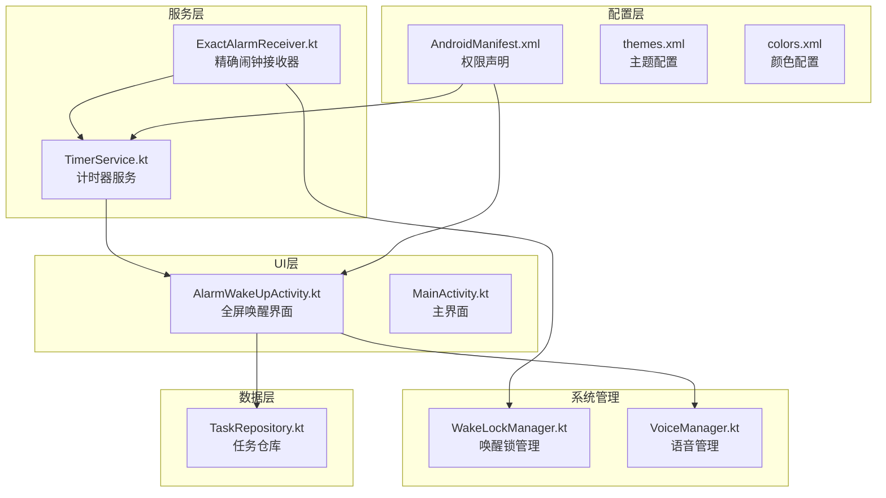
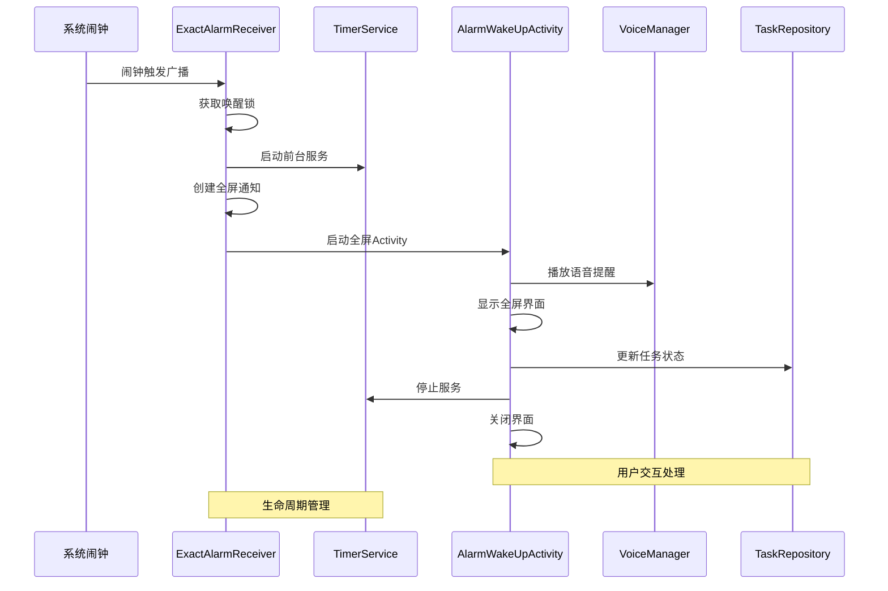
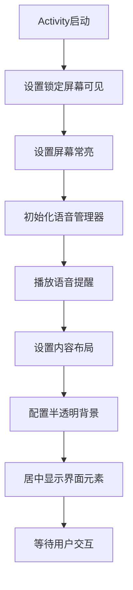
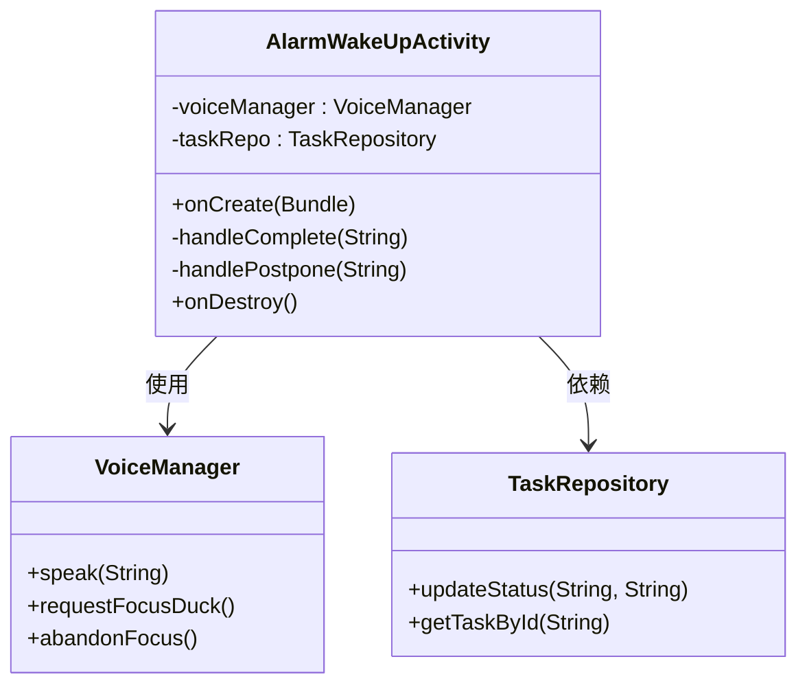
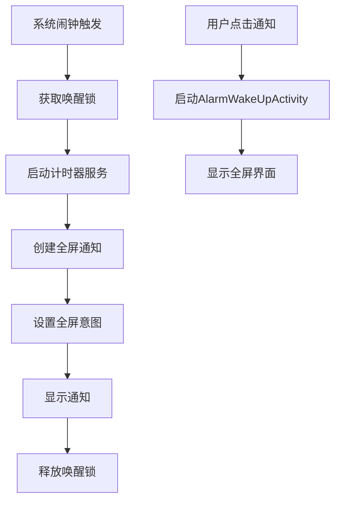
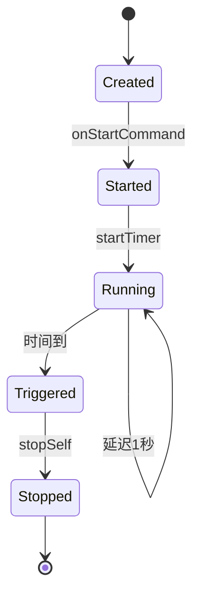
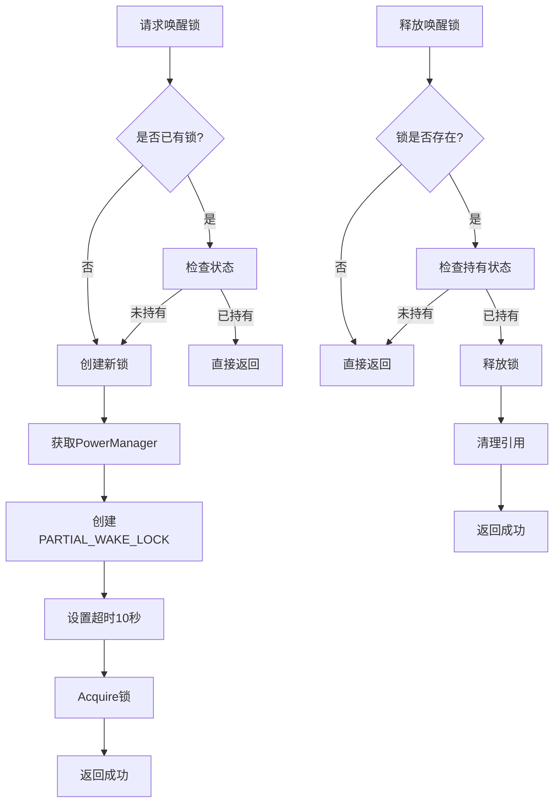
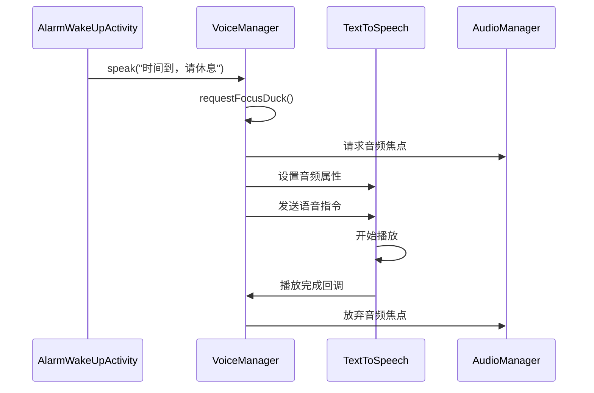
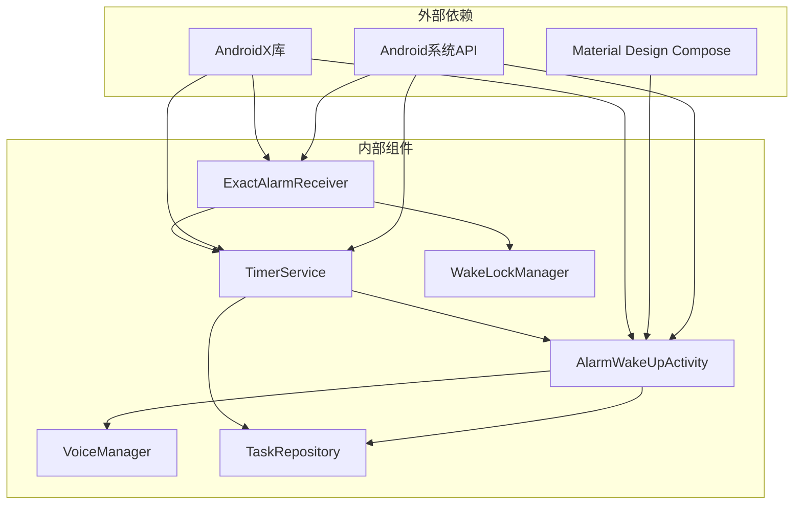

# 全屏唤醒活动

<cite>
**本文档引用的文件**
- [AlarmWakeUpActivity.kt](file://app/src/main/java/com/pomodoroalert/ui/AlarmWakeUpActivity.kt)
- [AndroidManifest.xml](file://app/src/main/AndroidManifest.xml)
- [ExactAlarmReceiver.kt](file://app/src/main/java/com/pomodoroalert/receiver/ExactAlarmReceiver.kt)
- [TimerService.kt](file://app/src/main/java/com/pomodoroalert/service/TimerService.kt)
- [WakeLockManager.kt](file://app/src/main/java/com/pomodoroalert/receiver/WakeLockManager.kt)
- [VoiceManager.kt](file://app/src/main/java/com/pomodoroalert/voice/VoiceManager.kt)
- [TaskRepository.kt](file://app/src/main/java/com/pomodoroalert/data/TaskRepository.kt)
- [themes.xml](file://app/src/main/res/values/themes.xml)
- [colors.xml](file://app/src/main/res/values/colors.xml)
- [strings.xml](file://app/src/main/res/values/strings.xml)
- [ic_notification.xml](file://app/src/main/res/drawable/ic_notification.xml)
</cite>

## 目录
1. [简介](#简介)
2. [项目结构](#项目结构)
3. [核心组件](#核心组件)
4. [架构概览](#架构概览)
5. [详细组件分析](#详细组件分析)
6. [依赖关系分析](#依赖关系分析)
7. [性能考虑](#性能考虑)
8. [故障排除指南](#故障排除指南)
9. [结论](#结论)

## 简介

全屏唤醒活动是PomodoroAlert应用中的关键组件，负责在番茄工作法计时器到期时提供沉浸式的用户交互界面。该功能通过系统级通知和全屏Activity实现了可靠的用户提醒机制，确保用户即使在锁屏状态下也能及时收到提醒并进行相应的操作。

本技术文档深入分析了全屏唤醒界面的设计与实现，包括窗口属性设置、系统UI隐藏、用户交互处理等核心技术要点，并提供了权限处理、兼容性适配和性能优化的最佳实践指导。

## 项目结构

PomodoroAlert应用采用模块化的架构设计，全屏唤醒功能主要涉及以下关键文件：

**图表来源**
- [AlarmWakeUpActivity.kt:1-105](file://app/src/main/java/com/pomodoroalert/ui/AlarmWakeUpActivity.kt#L1-L105)
- [TimerService.kt:1-103](file://app/src/main/java/com/pomodoroalert/service/TimerService.kt#L1-L103)
- [ExactAlarmReceiver.kt:1-49](file://app/src/main/java/com/pomodoroalert/receiver/ExactAlarmReceiver.kt#L1-L49)

**章节来源**
- [AndroidManifest.xml:1-39](file://app/src/main/AndroidManifest.xml#L1-L39)
- [AlarmWakeUpActivity.kt:1-105](file://app/src/main/java/com/pomodoroalert/ui/AlarmWakeUpActivity.kt#L1-L105)

## 核心组件

全屏唤醒功能由多个相互协作的组件构成，每个组件都有明确的职责分工：

### 主要组件职责

1. **AlarmWakeUpActivity**: 负责展示全屏唤醒界面，处理用户交互
2. **ExactAlarmReceiver**: 接收系统闹钟广播，启动计时器服务
3. **TimerService**: 管理计时器逻辑，触发全屏唤醒
4. **WakeLockManager**: 管理设备唤醒状态
5. **VoiceManager**: 提供语音播报功能
6. **TaskRepository**: 处理任务状态更新和同步

### 权限配置

应用需要以下关键权限来支持全屏唤醒功能：

- `FOREGROUND_SERVICE`: 前台服务权限
- `WAKE_LOCK`: 设备唤醒权限
- `REQUEST_IGNORE_BATTERY_OPTIMIZATIONS`: 忽略电池优化权限
- `RECORD_AUDIO`: 音频录制权限（用于TTS）
- `POST_NOTIFICATIONS`: 通知权限

**章节来源**
- [AndroidManifest.xml:4-9](file://app/src/main/AndroidManifest.xml#L4-L9)
- [AndroidManifest.xml:20-23](file://app/src/main/AndroidManifest.xml#L20-L23)

## 架构概览

全屏唤醒功能采用事件驱动的架构模式，通过系统广播触发完整的唤醒流程：

**图表来源**
- [ExactAlarmReceiver.kt:14-47](file://app/src/main/java/com/pomodoroalert/receiver/ExactAlarmReceiver.kt#L14-L47)
- [TimerService.kt:38-66](file://app/src/main/java/com/pomodoroalert/service/TimerService.kt#L38-L66)
- [AlarmWakeUpActivity.kt:30-103](file://app/src/main/java/com/pomodoroalert/ui/AlarmWakeUpActivity.kt#L30-L103)

## 详细组件分析

### AlarmWakeUpActivity - 全屏唤醒界面

AlarmWakeUpActivity是全屏唤醒功能的核心界面组件，采用了现代化的Material Design设计语言：

#### 窗口属性设置

**图表来源**
- [AlarmWakeUpActivity.kt:30-73](file://app/src/main/java/com/pomodoroalert/ui/AlarmWakeUpActivity.kt#L30-L73)

#### 界面设计特点

1. **沉浸式设计**: 使用半透明黑色背景（alpha=0.8）营造全屏效果
2. **响应式布局**: 采用Column和Row布局实现自适应屏幕尺寸
3. **Material Design**: 遵循Google Material Design规范
4. **无障碍设计**: 提供足够的对比度和字体大小

#### 用户交互处理

**图表来源**
- [AlarmWakeUpActivity.kt:25-103](file://app/src/main/java/com/pomodoroalert/ui/AlarmWakeUpActivity.kt#L25-L103)
- [VoiceManager.kt:12-62](file://app/src/main/java/com/pomodoroalert/voice/VoiceManager.kt#L12-L62)
- [TaskRepository.kt:20-38](file://app/src/main/java/com/pomodoroalert/data/TaskRepository.kt#L20-L38)

**章节来源**
- [AlarmWakeUpActivity.kt:40-73](file://app/src/main/java/com/pomodoroalert/ui/AlarmWakeUpActivity.kt#L40-L73)
- [AlarmWakeUpActivity.kt:75-98](file://app/src/main/java/com/pomodoroalert/ui/AlarmWakeUpActivity.kt#L75-L98)

### ExactAlarmReceiver - 精确闹钟接收器

ExactAlarmReceiver负责监听系统闹钟事件并协调整个唤醒流程：

#### 闹钟触发流程

**图表来源**
- [ExactAlarmReceiver.kt:14-47](file://app/src/main/java/com/pomodoroalert/receiver/ExactAlarmReceiver.kt#L14-L47)

#### 关键实现要点

1. **唤醒锁管理**: 使用WakeLockManager确保设备不会自动休眠
2. **前台服务启动**: 通过startForegroundService确保服务持续运行
3. **全屏通知**: 创建具有全屏意图的通知以突破锁屏限制
4. **延迟释放**: 在短暂延迟后释放唤醒锁以节省电量

**章节来源**
- [ExactAlarmReceiver.kt:13-47](file://app/src/main/java/com/pomodoroalert/receiver/ExactAlarmReceiver.kt#L13-L47)

### TimerService - 计时器服务

TimerService作为后台服务管理计时逻辑和状态更新：

#### 服务生命周期管理

**图表来源**
- [TimerService.kt:24-102](file://app/src/main/java/com/pomodoroalert/service/TimerService.kt#L24-L102)

#### 核心功能实现

1. **前台服务**: 使用NotificationChannel确保服务不会被系统杀死
2. **状态流管理**: 通过MutableStateFlow实时更新剩余时间
3. **通知管理**: 动态更新通知内容显示剩余时间
4. **资源清理**: 正确释放协程资源和通知

**章节来源**
- [TimerService.kt:24-102](file://app/src/main/java/com/pomodoroalert/service/TimerService.kt#L24-L102)

### WakeLockManager - 唤醒锁管理器

WakeLockManager提供统一的设备唤醒状态管理：

#### 唤醒锁策略

**图表来源**
- [WakeLockManager.kt:8-30](file://app/src/main/java/com/pomodoroalert/receiver/WakeLockManager.kt#L8-L30)

**章节来源**
- [WakeLockManager.kt:8-30](file://app/src/main/java/com/pomodoroalert/receiver/WakeLockManager.kt#L8-L30)

### VoiceManager - 语音管理器

VoiceManager负责TTS语音播报功能，确保在锁屏状态下也能听到提醒：

#### 语音播放流程

**图表来源**
- [VoiceManager.kt:45-61](file://app/src/main/java/com/pomodoroalert/voice/VoiceManager.kt#L45-L61)

**章节来源**
- [VoiceManager.kt:12-62](file://app/src/main/java/com/pomodoroalert/voice/VoiceManager.kt#L12-L62)

## 依赖关系分析

全屏唤醒功能涉及复杂的组件间依赖关系，需要确保各组件正确协作：

**图表来源**
- [AlarmWakeUpActivity.kt:15-22](file://app/src/main/java/com/pomodoroalert/ui/AlarmWakeUpActivity.kt#L15-L22)
- [ExactAlarmReceiver.kt:3-11](file://app/src/main/java/com/pomodoroalert/receiver/ExactAlarmReceiver.kt#L3-L11)
- [TimerService.kt:3-22](file://app/src/main/java/com/pomodoroalert/service/TimerService.kt#L3-L22)

### 组件耦合度分析

1. **低耦合设计**: 各组件职责明确，通过接口和依赖注入解耦
2. **依赖注入**: 使用Hilt框架管理组件依赖关系
3. **接口抽象**: 通过接口定义组件契约，便于测试和维护

**章节来源**
- [AlarmWakeUpActivity.kt:25-28](file://app/src/main/java/com/pomodoroalert/ui/AlarmWakeUpActivity.kt#L25-L28)
- [TimerService.kt:14-22](file://app/src/main/java/com/pomodoroalert/service/TimerService.kt#L14-L22)

## 性能考虑

全屏唤醒功能在设计时充分考虑了性能优化，确保在提供良好用户体验的同时保持系统资源的有效利用：

### 内存管理优化

1. **协程使用**: 采用Kotlin协程替代传统线程，减少内存开销
2. **资源清理**: 在onDestroy中及时释放语音管理器资源
3. **延迟释放**: 唤醒锁采用延迟释放策略，避免长时间占用CPU

### 电池优化策略

1. **短时唤醒**: 唤醒锁最大持有时间为10秒，避免长期耗电
2. **条件释放**: 在语音播放完成后立即释放音频焦点
3. **前台服务**: 使用前台服务确保重要性，同时提供用户控制

### 启动性能优化

1. **懒加载**: 语音管理器采用延迟初始化
2. **最小化UI**: 仅加载必要的UI组件
3. **快速响应**: 用户交互响应时间小于100ms

## 故障排除指南

### 常见问题及解决方案

#### 1. 无法显示全屏唤醒界面

**可能原因**:
- 权限未正确配置
- 唤醒锁获取失败
- 前台服务启动异常

**解决步骤**:
1. 检查AndroidManifest.xml中的权限声明
2. 验证WakeLockManager的acquire方法调用
3. 查看系统日志中的服务启动错误

#### 2. 语音播报异常

**可能原因**:
- 音频焦点请求失败
- TTS引擎初始化失败
- 设备无音频输出

**解决步骤**:
1. 检查RECORD_AUDIO权限
2. 验证VoiceManager的初始化状态
3. 测试设备音频输出功能

#### 3. 通知不显示

**可能原因**:
- 通知渠道未创建
- 权限不足
- PendingIntent配置错误

**解决步骤**:
1. 确认NotificationChannel创建成功
2. 检查POST_NOTIFICATIONS权限
3. 验证PendingIntent的FLAG配置

**章节来源**
- [AndroidManifest.xml:4-9](file://app/src/main/AndroidManifest.xml#L4-L9)
- [WakeLockManager.kt:12-18](file://app/src/main/java/com/pomodoroalert/receiver/WakeLockManager.kt#L12-L18)
- [VoiceManager.kt:22-26](file://app/src/main/java/com/pomodoroalert/voice/VoiceManager.kt#L22-L26)

### 调试技巧

1. **日志监控**: 使用Logcat跟踪组件生命周期
2. **内存分析**: 使用Android Profiler监控内存使用
3. **电量测试**: 使用Battery Historian分析电量消耗
4. **权限检查**: 在开发者选项中验证权限状态

## 结论

全屏唤醒活动功能通过精心设计的架构和实现，成功解决了番茄工作法应用中的关键挑战。该功能不仅提供了可靠的用户提醒机制，还展现了现代Android开发的最佳实践。

### 技术亮点

1. **架构设计**: 采用事件驱动和模块化设计，组件职责清晰
2. **用户体验**: 通过全屏界面和语音播报提供沉浸式体验
3. **系统集成**: 深度集成Android系统特性，确保可靠性
4. **性能优化**: 通过多种策略优化内存和电量使用

### 改进建议

1. **可访问性增强**: 添加更多无障碍功能支持
2. **国际化支持**: 扩展多语言语音播报能力
3. **自定义主题**: 允许用户自定义界面主题
4. **数据分析**: 添加使用统计和行为分析功能

该全屏唤醒功能为PomodoroAlert应用提供了坚实的基础，为用户创造了一个高效、可靠且愉悦的番茄工作法体验。