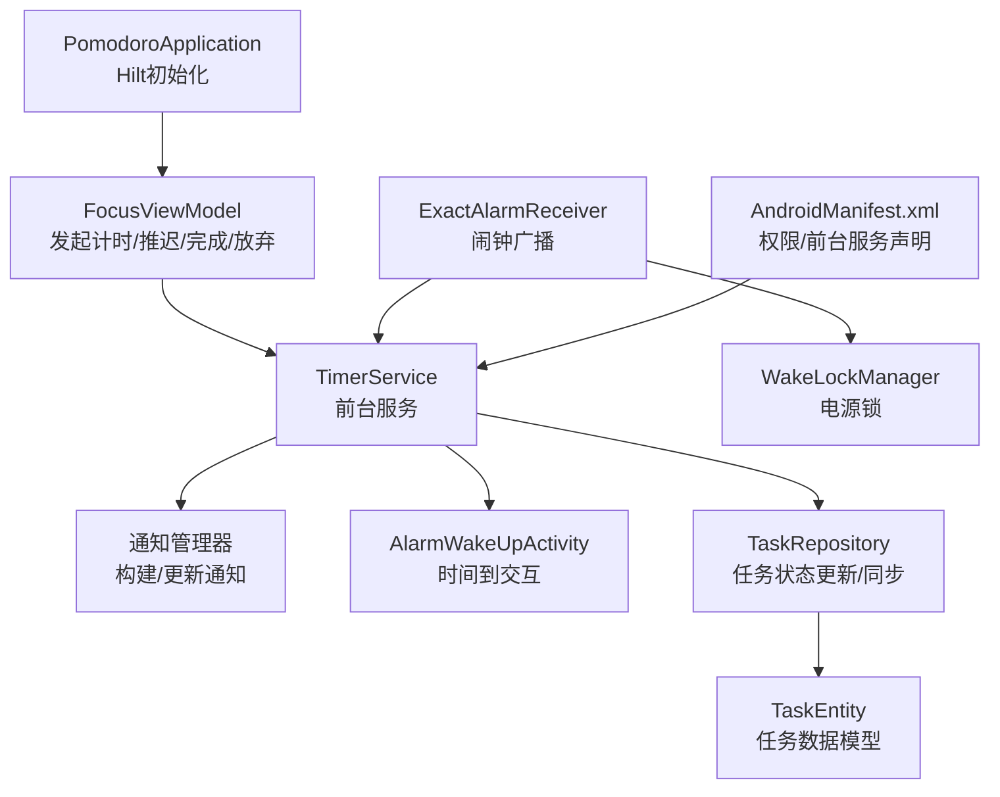
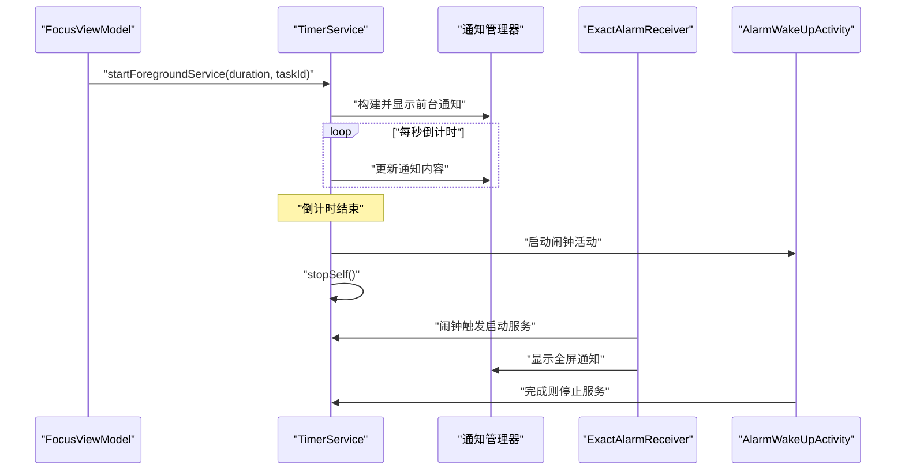
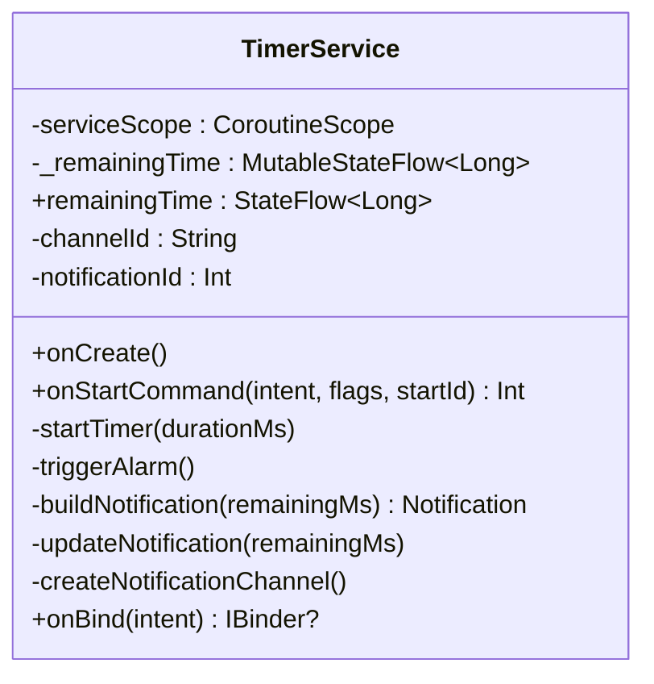
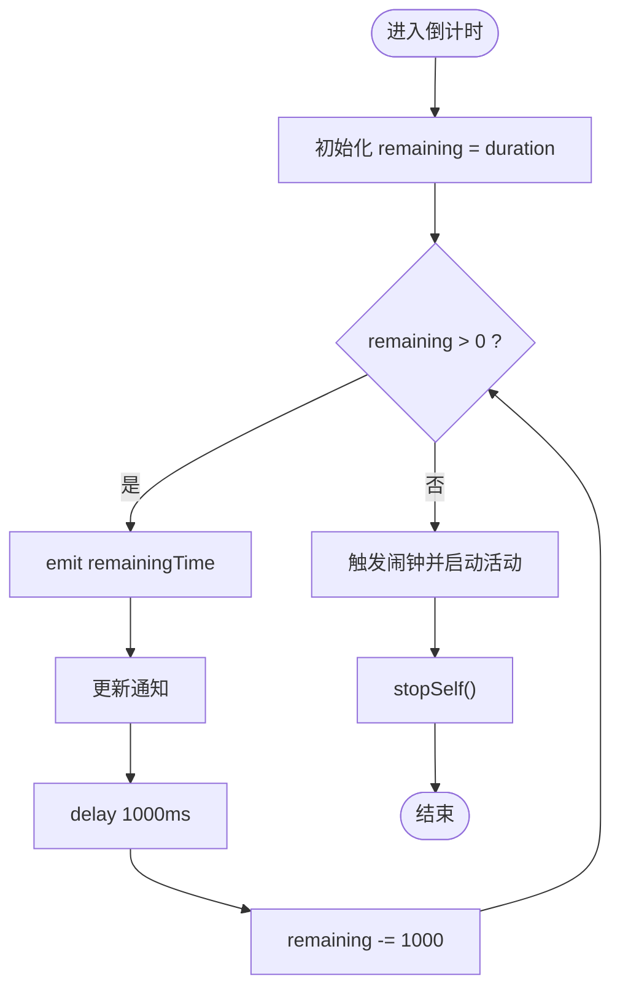
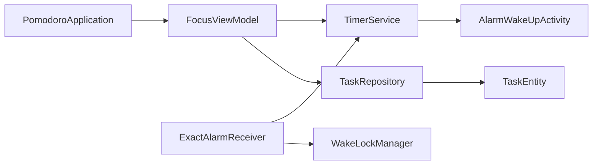

# 前台计时服务

<cite>
**本文引用的文件列表**
- [TimerService.kt](file://app/src/main/java/com/pomodoroalert/service/TimerService.kt)
- [FocusViewModel.kt](file://app/src/main/java/com/pomodoroalert/ui/viewmodel/FocusViewModel.kt)
- [AlarmWakeUpActivity.kt](file://app/src/main/java/com/pomodoroalert/ui/AlarmWakeUpActivity.kt)
- [ExactAlarmReceiver.kt](file://app/src/main/java/com/pomodoroalert/receiver/ExactAlarmReceiver.kt)
- [WakeLockManager.kt](file://app/src/main/java/com/pomodoroalert/receiver/WakeLockManager.kt)
- [TaskRepository.kt](file://app/src/main/java/com/pomodoroalert/data/TaskRepository.kt)
- [TaskEntity.kt](file://app/src/main/java/com/pomodoroalert/data/TaskEntity.kt)
- [AndroidManifest.xml](file://app/src/main/AndroidManifest.xml)
- [PomodoroApplication.kt](file://app/src/main/java/com/pomodoroalert/PomodoroApplication.kt)
</cite>

## 目录
1. [简介](#简介)
2. [项目结构](#项目结构)
3. [核心组件](#核心组件)
4. [架构总览](#架构总览)
5. [详细组件分析](#详细组件分析)
6. [依赖关系分析](#依赖关系分析)
7. [性能与内存考量](#性能与内存考量)
8. [故障排查指南](#故障排查指南)
9. [结论](#结论)

## 简介
本文件面向PomodoroAlert应用中的前台计时服务（TimerService），系统性阐述其服务生命周期管理、协程作用域设计、状态管理机制、通知系统实现、计时算法细节、服务启动参数处理、内存与性能优化策略，以及稳定性保障、异常处理与调试技巧。目标是帮助开发者在不直接阅读源码的情况下，也能快速理解并维护该服务。

## 项目结构
围绕前台计时服务的关键模块与文件如下：
- 服务层：TimerService（前台服务，负责倒计时、通知更新、闹钟触发）
- 视图模型：FocusViewModel（发起计时、处理推迟、完成/放弃任务）
- 广播接收器：ExactAlarmReceiver（闹钟触发入口，唤醒设备并显示全屏通知）
- 活动：AlarmWakeUpActivity（时间到后的交互界面，支持完成/推迟）
- 工具：WakeLockManager（电源锁管理）
- 数据层：TaskRepository、TaskEntity（任务状态持久化与同步）
- 应用配置：AndroidManifest.xml（权限与前台服务声明）、PomodoroApplication（Hilt初始化）

图表来源
- [TimerService.kt:24-102](file://app/src/main/java/com/pomodoroalert/service/TimerService.kt#L24-L102)
- [FocusViewModel.kt:22-84](file://app/src/main/java/com/pomodoroalert/ui/viewmodel/FocusViewModel.kt#L22-L84)
- [AlarmWakeUpActivity.kt:24-104](file://app/src/main/java/com/pomodoroalert/ui/AlarmWakeUpActivity.kt#L24-L104)
- [ExactAlarmReceiver.kt:13-48](file://app/src/main/java/com/pomodoroalert/receiver/ExactAlarmReceiver.kt#L13-L48)
- [WakeLockManager.kt:8-30](file://app/src/main/java/com/pomodoroalert/receiver/WakeLockManager.kt#L8-L30)
- [TaskRepository.kt:19-100](file://app/src/main/java/com/pomodoroalert/data/TaskRepository.kt#L19-L100)
- [TaskEntity.kt:8-18](file://app/src/main/java/com/pomodoroalert/data/TaskEntity.kt#L8-L18)
- [AndroidManifest.xml:33-35](file://app/src/main/AndroidManifest.xml#L33-L35)
- [PomodoroApplication.kt:6-7](file://app/src/main/java/com/pomodoroalert/PomodoroApplication.kt#L6-L7)

章节来源
- [AndroidManifest.xml:11-39](file://app/src/main/AndroidManifest.xml#L11-L39)
- [PomodoroApplication.kt:6-7](file://app/src/main/java/com/pomodoroalert/PomodoroApplication.kt#L6-L7)

## 核心组件
- TimerService：前台服务，使用协程进行倒计时，通过通知通道向用户反馈剩余时间；倒计时结束时启动闹钟活动并停止自身。
- FocusViewModel：负责从数据库加载任务、设置初始剩余时间，并通过Intent携带“duration”和“taskId”启动前台服务。
- ExactAlarmReceiver：当系统闹钟触发时，启动前台服务并显示全屏通知，同时短暂持有电源锁以确保唤醒。
- AlarmWakeUpActivity：时间到后的交互界面，支持完成或推迟任务；完成后会停止前台服务。
- WakeLockManager：管理电源锁的获取与释放，避免CPU休眠影响闹钟触发。
- TaskRepository/TaskEntity：维护任务状态与同步逻辑，完成/放弃后触发网络同步。

章节来源
- [TimerService.kt:24-102](file://app/src/main/java/com/pomodoroalert/service/TimerService.kt#L24-L102)
- [FocusViewModel.kt:22-84](file://app/src/main/java/com/pomodoroalert/ui/viewmodel/FocusViewModel.kt#L22-L84)
- [ExactAlarmReceiver.kt:13-48](file://app/src/main/java/com/pomodoroalert/receiver/ExactAlarmReceiver.kt#L13-L48)
- [AlarmWakeUpActivity.kt:24-104](file://app/src/main/java/com/pomodoroalert/ui/AlarmWakeUpActivity.kt#L24-L104)
- [WakeLockManager.kt:8-30](file://app/src/main/java/com/pomodoroalert/receiver/WakeLockManager.kt#L8-L30)
- [TaskRepository.kt:19-100](file://app/src/main/java/com/pomodoroalert/data/TaskRepository.kt#L19-L100)
- [TaskEntity.kt:8-18](file://app/src/main/java/com/pomodoroalert/data/TaskEntity.kt#L8-L18)

## 架构总览
前台计时服务采用“视图模型驱动服务”的模式：UI通过ViewModel发起计时，服务在前台运行并持续更新通知；系统闹钟触发后由广播接收器启动服务并展示全屏通知，最终由用户交互决定完成或推迟。

图表来源
- [FocusViewModel.kt:32-46](file://app/src/main/java/com/pomodoroalert/ui/viewmodel/FocusViewModel.kt#L32-L46)
- [TimerService.kt:38-66](file://app/src/main/java/com/pomodoroalert/service/TimerService.kt#L38-L66)
- [ExactAlarmReceiver.kt:14-47](file://app/src/main/java/com/pomodoroalert/receiver/ExactAlarmReceiver.kt#L14-L47)
- [AlarmWakeUpActivity.kt:75-98](file://app/src/main/java/com/pomodoroalert/ui/AlarmWakeUpActivity.kt#L75-L98)

## 详细组件分析

### TimerService 实现架构
- 生命周期管理
  - onCreate：创建通知通道并以前台服务方式启动，绑定通知ID与通道ID。
  - onStartCommand：读取Intent中的“duration”，若大于0则启动倒计时；返回START_STICKY以提升稳定性。
  - onBind：返回空，表示该服务不支持绑定。
- 协程作用域设计
  - 使用默认调度器的CoroutineScope与Job组合，保证后台计算与通知更新解耦。
  - 启动倒计时协程，逐秒更新状态流与通知，结束后触发闹钟并停止服务。
- 状态管理机制
  - 使用MutableStateFlow暴露remainingTime，供UI订阅；内部私有，避免外部直接修改。
  - 倒计时循环中emit当前剩余毫秒数，通知根据此值格式化显示。
- 通知系统
  - 通知通道：在Android O+创建低重要性的通知通道，名称为“番茄钟前台服务”。
  - 通知构建：标题“番茄钟运行中”，内容显示剩余秒数，小图标来自资源，点击跳转主界面。
  - 通知更新：每次倒计时周期调用notify更新内容，保持前台可见。
- 闹钟触发与服务停止
  - 倒计时结束启动AlarmWakeUpActivity，随后stopSelf()停止服务。
  - 若由广播接收器触发（duration为0），服务仍会尝试处理并显示全屏通知。

图表来源
- [TimerService.kt:24-102](file://app/src/main/java/com/pomodoroalert/service/TimerService.kt#L24-L102)

章节来源
- [TimerService.kt:24-102](file://app/src/main/java/com/pomodoroalert/service/TimerService.kt#L24-L102)

### 计时算法与状态流
- 时间倒计时逻辑
  - 以1秒为步进，每次减少1000毫秒，emit当前剩余时间，更新通知。
  - 当remaining <= 0时，触发闹钟并停止服务。
- 状态流管理
  - remainingTime为只读StateFlow，UI可订阅；服务内部通过MutableStateFlow emit新值。
  - 通知文本基于剩余毫秒数转换为秒显示，确保UI与通知一致。
- 通知实时更新
  - 每次循环调用notify，确保前台通知内容随时间变化而刷新。

图表来源
- [TimerService.kt:46-59](file://app/src/main/java/com/pomodoroalert/service/TimerService.kt#L46-L59)

章节来源
- [TimerService.kt:46-59](file://app/src/main/java/com/pomodoroalert/service/TimerService.kt#L46-L59)

### 通知系统实现
- 通知通道创建
  - 在Android O及以上版本创建通知通道，重要性设为低，通道ID固定。
- 通知更新逻辑
  - 构建通知时设置标题、内容、小图标、点击意图（跳转主界面）。
  - 每次倒计时周期调用notify，确保内容实时更新。
- 前台服务绑定
  - onCreate阶段即以前台服务方式启动，避免被系统回收。
- 全屏通知（闹钟场景）
  - 广播接收器在闹钟触发时构建全屏通知并设置点击意图，用于强制解锁屏幕。

章节来源
- [TimerService.kt:29-99](file://app/src/main/java/com/pomodoroalert/service/TimerService.kt#L29-L99)
- [ExactAlarmReceiver.kt:14-47](file://app/src/main/java/com/pomodoroalert/receiver/ExactAlarmReceiver.kt#L14-L47)

### 服务启动参数处理
- duration参数
  - 来自Intent的“duration”字段，单位为毫秒；仅当大于0时才启动倒计时。
- taskId参数
  - 由ViewModel传递给服务，用于后续任务状态更新与同步。
- 版本兼容
  - 针对Android O+使用startForegroundService，否则使用startService，避免崩溃。

章节来源
- [FocusViewModel.kt:37-45](file://app/src/main/java/com/pomodoroalert/ui/viewmodel/FocusViewModel.kt#L37-L45)
- [TimerService.kt:39-43](file://app/src/main/java/com/pomodoroalert/service/TimerService.kt#L39-L43)

### 与任务状态的集成
- 完成/放弃任务
  - 用户在闹钟活动界面选择完成或推迟，完成后通过stopService停止前台服务。
  - ViewModel在完成/放弃时调用TaskRepository更新状态，并停止服务。
- 任务实体与同步
  - TaskEntity包含任务ID、名称、持续时间、状态、来源与同步状态。
  - TaskRepository在任务状态变为“已完成/已放弃/推迟”时触发同步流程，失败则安排后台重试。

章节来源
- [AlarmWakeUpActivity.kt:75-98](file://app/src/main/java/com/pomodoroalert/ui/AlarmWakeUpActivity.kt#L75-L98)
- [FocusViewModel.kt:67-83](file://app/src/main/java/com/pomodoroalert/ui/viewmodel/FocusViewModel.kt#L67-L83)
- [TaskRepository.kt:32-80](file://app/src/main/java/com/pomodoroalert/data/TaskRepository.kt#L32-L80)
- [TaskEntity.kt:8-18](file://app/src/main/java/com/pomodoroalert/data/TaskEntity.kt#L8-L18)

## 依赖关系分析
- 组件耦合
  - FocusViewModel依赖TimerService与TaskRepository；AlarmWakeUpActivity依赖TaskRepository与TimerService。
  - TimerService依赖通知管理器与AlarmWakeUpActivity；与AlarmManager无直接耦合，通过广播接收器间接关联。
- 外部依赖
  - Android系统服务：NotificationManager、AlarmManager、PowerManager。
  - 第三方库：Kotlin协程、AndroidX核心库、Dagger Hilt（通过Application类启用）。
- 潜在风险
  - 服务未绑定导致无法onUnbind；通知通道需在首次启动时创建。
  - 闹钟触发可能因省电策略延迟，建议使用精确闹钟并配合电源锁。

图表来源
- [FocusViewModel.kt:22-84](file://app/src/main/java/com/pomodoroalert/ui/viewmodel/FocusViewModel.kt#L22-L84)
- [TimerService.kt:24-102](file://app/src/main/java/com/pomodoroalert/service/TimerService.kt#L24-L102)
- [AlarmWakeUpActivity.kt:24-104](file://app/src/main/java/com/pomodoroalert/ui/AlarmWakeUpActivity.kt#L24-L104)
- [ExactAlarmReceiver.kt:13-48](file://app/src/main/java/com/pomodoroalert/receiver/ExactAlarmReceiver.kt#L13-L48)
- [WakeLockManager.kt:8-30](file://app/src/main/java/com/pomodoroalert/receiver/WakeLockManager.kt#L8-L30)
- [TaskRepository.kt:19-100](file://app/src/main/java/com/pomodoroalert/data/TaskRepository.kt#L19-L100)
- [TaskEntity.kt:8-18](file://app/src/main/java/com/pomodoroalert/data/TaskEntity.kt#L8-L18)
- [PomodoroApplication.kt:6-7](file://app/src/main/java/com/pomodoroalert/PomodoroApplication.kt#L6-L7)

## 性能与内存考量
- 协程与调度
  - 使用默认调度器执行倒计时，避免阻塞主线程；每秒一次的频率对性能影响较小。
- 内存管理
  - 服务内持有单例级CoroutineScope，注意在服务销毁前取消任务，防止泄漏。
  - 通知更新为轻量操作，但应避免在高频事件中重复创建对象。
- 通知与前台服务
  - 前台服务占用系统资源，应在倒计时结束后及时stopSelf()。
  - 通知通道只需创建一次，避免重复创建造成资源浪费。
- 电源与唤醒
  - 广播接收器使用WakeLockManager短暂持有电源锁，建议在短时间后释放，避免耗电。
- 网络同步
  - 任务完成后触发同步，失败时通过后台任务重试，降低前台线程压力。

章节来源
- [TimerService.kt:25-27](file://app/src/main/java/com/pomodoroalert/service/TimerService.kt#L25-L27)
- [WakeLockManager.kt:12-29](file://app/src/main/java/com/pomodoroalert/receiver/WakeLockManager.kt#L12-L29)
- [TaskRepository.kt:82-94](file://app/src/main/java/com/pomodoroalert/data/TaskRepository.kt#L82-L94)

## 故障排查指南
- 服务未启动或前台通知缺失
  - 检查AndroidManifest中是否声明前台服务类型与权限。
  - 确认启动时传入了“duration”且大于0。
- 通知不更新
  - 确认通知通道已创建；检查notify调用是否在倒计时循环中执行。
- 闹钟未触发
  - 检查AlarmManager设置是否正确；确认ExactAlarmReceiver已注册。
  - 查看电源锁是否及时释放，避免系统节电策略影响。
- 服务崩溃或异常
  - 在倒计时循环中捕获异常并记录日志；确保stopSelf()在异常路径也能执行。
- 调试技巧
  - 使用日志输出remainingTime与通知更新时机，定位UI与通知不同步问题。
  - 在AlarmWakeUpActivity中验证完成/推迟逻辑与服务停止行为。

章节来源
- [AndroidManifest.xml:33-35](file://app/src/main/AndroidManifest.xml#L33-L35)
- [TimerService.kt:32-36](file://app/src/main/java/com/pomodoroalert/service/TimerService.kt#L32-L36)
- [TimerService.kt:46-59](file://app/src/main/java/com/pomodoroalert/service/TimerService.kt#L46-L59)
- [ExactAlarmReceiver.kt:14-47](file://app/src/main/java/com/pomodoroalert/receiver/ExactAlarmReceiver.kt#L14-L47)
- [AlarmWakeUpActivity.kt:75-98](file://app/src/main/java/com/pomodoroalert/ui/AlarmWakeUpActivity.kt#L75-L98)

## 结论
TimerService通过清晰的服务生命周期、稳定的协程倒计时与可靠的通知更新，实现了可靠的前台计时体验。结合广播接收器与闹钟活动，形成从“开始计时”到“时间到交互”的完整闭环。建议在生产环境中进一步完善异常处理、资源清理与日志监控，以提升稳定性与可维护性。