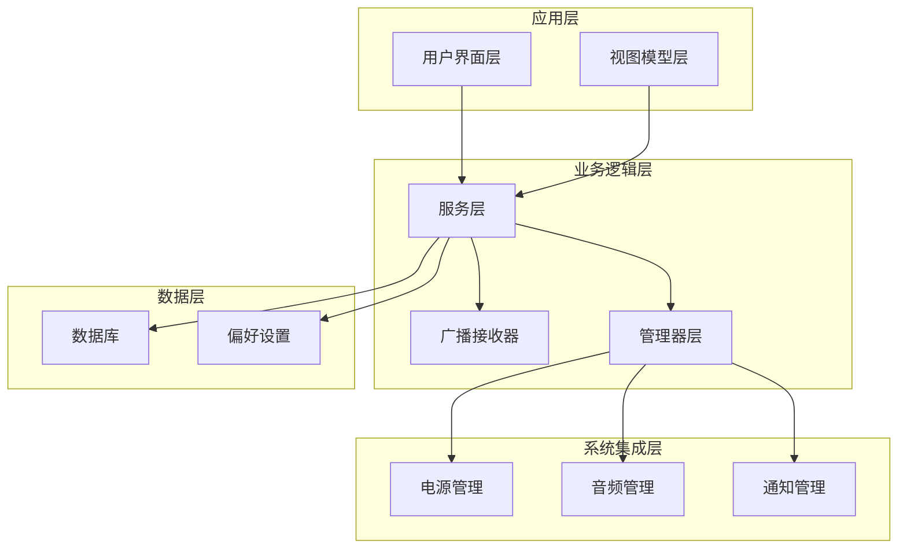
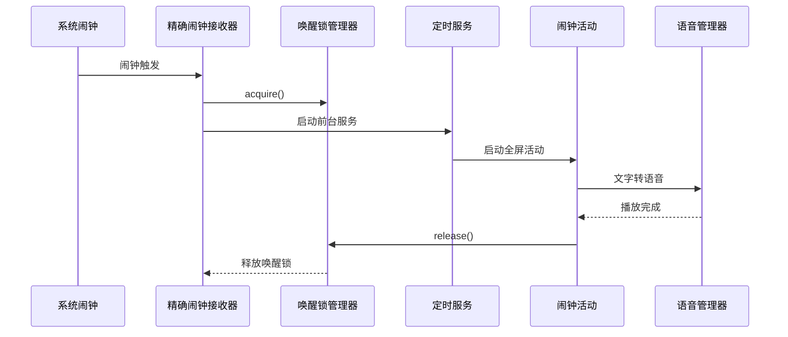
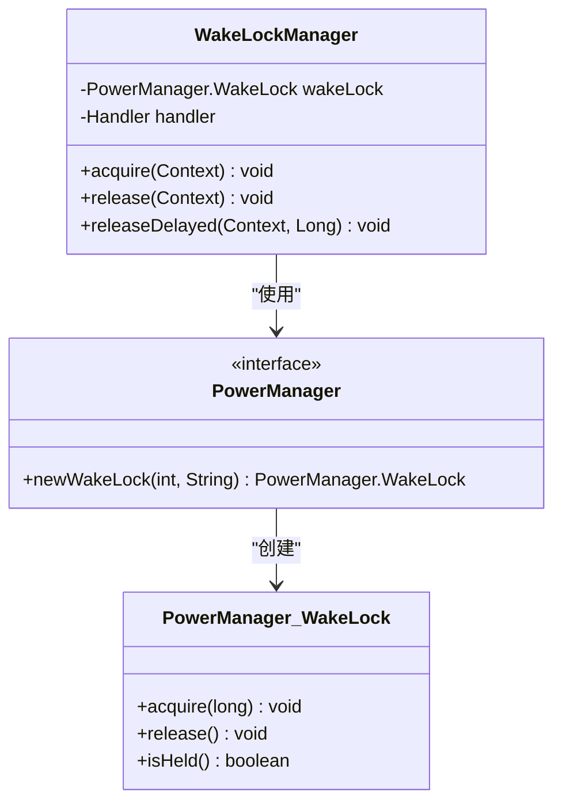
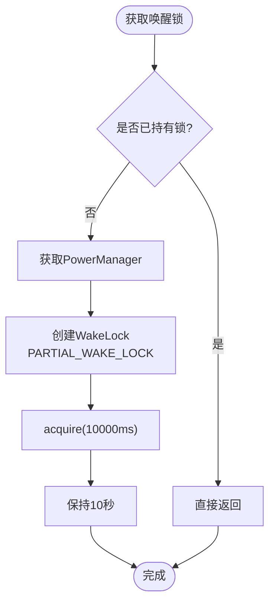
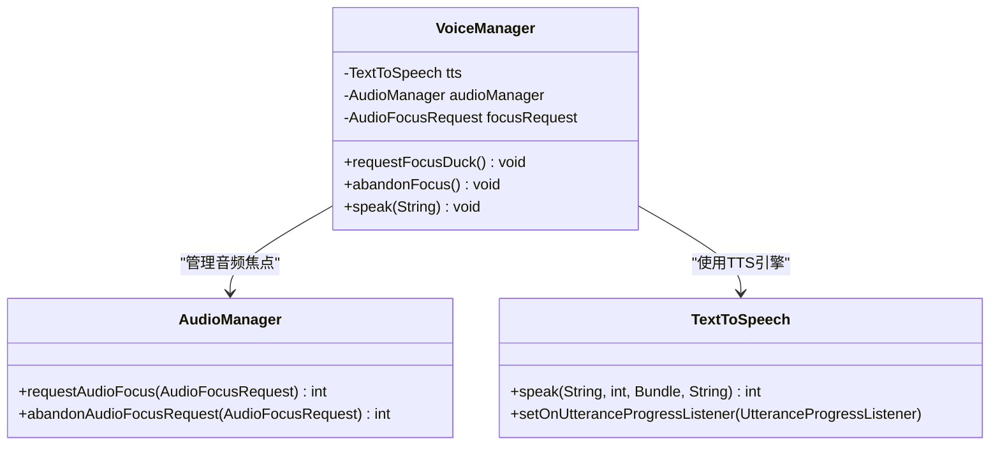
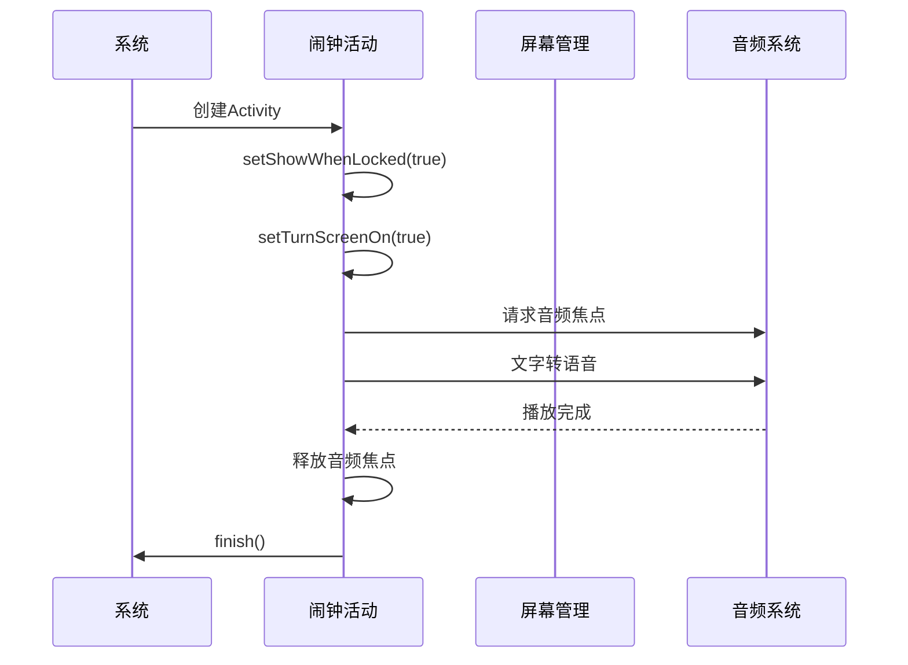
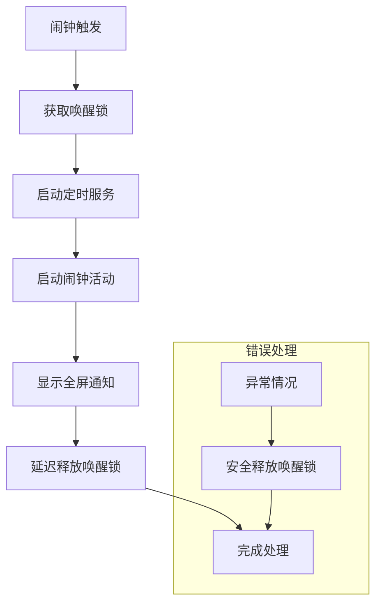
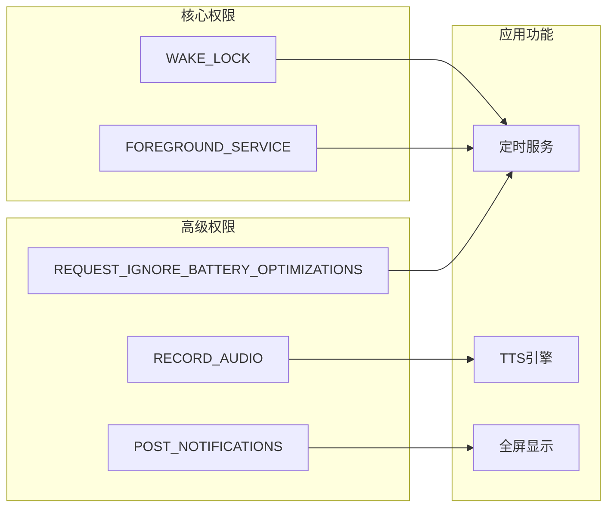
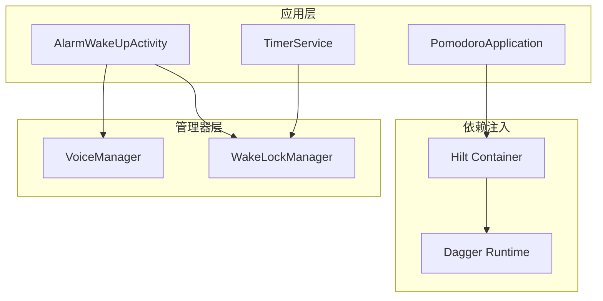

# 唤醒锁管理器

<cite>
**本文档引用的文件**
- [WakeLockManager.kt](file://app/src/main/java/com/pomodoroalert/receiver/WakeLockManager.kt)
- [ExactAlarmReceiver.kt](file://app/src/main/java/com/pomodoroalert/receiver/ExactAlarmReceiver.kt)
- [TimerService.kt](file://app/src/main/java/com/pomodoroalert/service/TimerService.kt)
- [AlarmWakeUpActivity.kt](file://app/src/main/java/com/pomodoroalert/ui/AlarmWakeUpActivity.kt)
- [VoiceManager.kt](file://app/src/main/java/com/pomodoroalert/voice/VoiceManager.kt)
- [AndroidManifest.xml](file://app/src/main/AndroidManifest.xml)
- [PomodoroApplication.kt](file://app/src/main/java/com/pomodoroalert/PomodoroApplication.kt)
- [build.gradle.kts](file://app/build.gradle.kts)
</cite>

## 目录
1. [简介](#简介)
2. [项目结构](#项目结构)
3. [核心组件](#核心组件)
4. [架构概览](#架构概览)
5. [详细组件分析](#详细组件分析)
6. [依赖关系分析](#依赖关系分析)
7. [性能考虑](#性能考虑)
8. [故障排除指南](#故障排除指南)
9. [结论](#结论)

## 简介

PomodoroAlert 是一个基于 Android 的番茄工作法计时应用，其唤醒锁管理器是系统资源管理的核心组件。该管理器负责在关键操作期间保持设备唤醒状态，确保音频播放、屏幕点亮和系统资源的正确管理。

本技术文档深入解析了唤醒锁的工作原理和实现机制，包括：
- PowerManager.WakeLock 的使用策略
- CPU 唤醒控制和屏幕点亮处理
- 音频播放时的系统资源管理（音频焦点、媒体会话、音量控制）
- 不同 Android 版本的兼容性处理和 API 差异适配
- 电源管理优化和电池消耗控制的最佳实践

## 项目结构

PomodoroAlert 采用模块化架构设计，主要包含以下核心模块：

**图表来源**
- [PomodoroApplication.kt:1-8](file://app/src/main/java/com/pomodoroalert/PomodoroApplication.kt#L1-L8)
- [AndroidManifest.xml:11-39](file://app/src/main/AndroidManifest.xml#L11-L39)

**章节来源**
- [build.gradle.kts:9-41](file://app/build.gradle.kts#L9-L41)
- [AndroidManifest.xml:1-39](file://app/src/main/AndroidManifest.xml#L1-L39)

## 核心组件

### 唤醒锁管理器 (WakeLockManager)

WakeLockManager 是单例模式的唤醒锁管理器，负责在整个应用生命周期中协调唤醒锁的获取和释放。

**主要特性：**
- 使用 PARTIAL_WAKE_LOCK 类型保持 CPU 活跃
- 最大持有时间为 10 秒，防止过度耗电
- 主线程 Handler 确保线程安全
- 自动检查锁状态，避免重复获取

**关键实现要点：**
- 唤醒锁类型：PARTIAL_WAKE_LOCK
- 超时机制：10 秒自动释放
- 延迟释放：5 秒延迟释放策略
- 线程安全保障：主线程 Handler

**章节来源**
- [WakeLockManager.kt:8-30](file://app/src/main/java/com/pomodoroalert/receiver/WakeLockManager.kt#L8-L30)

### 定时服务 (TimerService)

TimerService 是前台服务，负责计时管理和闹钟触发逻辑。

**核心功能：**
- 前台服务运行，提高系统优先级
- 实时更新通知显示剩余时间
- 触发闹钟时启动全屏活动
- 支持不同 Android 版本的服务启动方式

**章节来源**
- [TimerService.kt:24-103](file://app/src/main/java/com/pomodoroalert/service/TimerService.kt#L24-L103)

### 全屏闹钟活动 (AlarmWakeUpActivity)

AlarmWakeUpActivity 处理闹钟触发后的用户交互场景。

**主要功能：**
- 锁屏状态下显示全屏界面
- 屏幕自动点亮
- 文字转语音播报
- 用户操作响应（完成/推迟）

**章节来源**
- [AlarmWakeUpActivity.kt:25-105](file://app/src/main/java/com/pomodoroalert/ui/AlarmWakeUpActivity.kt#L25-L105)

### 精确闹钟接收器 (ExactAlarmReceiver)

ExactAlarmReceiver 处理系统闹钟触发事件。

**核心流程：**
- 获取唤醒锁保护关键操作
- 启动定时服务处理逻辑
- 显示全屏通知打破锁屏
- 延迟释放唤醒锁

**章节来源**
- [ExactAlarmReceiver.kt:13-49](file://app/src/main/java/com/pomodoroalert/receiver/ExactAlarmReceiver.kt#L13-L49)

## 架构概览

PomodoroAlert 的唤醒锁管理架构体现了良好的分层设计和职责分离：

**图表来源**
- [ExactAlarmReceiver.kt:14-47](file://app/src/main/java/com/pomodoroalert/receiver/ExactAlarmReceiver.kt#L14-L47)
- [WakeLockManager.kt:12-29](file://app/src/main/java/com/pomodoroalert/receiver/WakeLockManager.kt#L12-L29)
- [TimerService.kt:61-66](file://app/src/main/java/com/pomodoroalert/service/TimerService.kt#L61-L66)

## 详细组件分析

### 唤醒锁管理器深度分析

#### 类结构设计

**图表来源**
- [WakeLockManager.kt:8-30](file://app/src/main/java/com/pomodoroalert/receiver/WakeLockManager.kt#L8-L30)

#### 唤醒锁获取流程

**图表来源**
- [WakeLockManager.kt:12-18](file://app/src/main/java/com/pomodoroalert/receiver/WakeLockManager.kt#L12-L18)

#### 延迟释放机制

延迟释放是防止系统过早进入休眠状态的关键策略：

**释放时机选择：**
- 立即释放：适用于短时间操作
- 延迟释放：适用于需要系统资源的操作
- 最大超时：10 秒保护机制

**章节来源**
- [WakeLockManager.kt:20-29](file://app/src/main/java/com/pomodoroalert/receiver/WakeLockManager.kt#L20-L29)

### 音频焦点管理系统

#### VoiceManager 设计架构

VoiceManager 实现了完整的音频焦点管理：

**图表来源**
- [VoiceManager.kt:12-62](file://app/src/main/java/com/pomodoroalert/voice/VoiceManager.kt#L12-L62)

#### 音频焦点策略

**焦点类型：** AUDIOFOCUS_GAIN_TRANSIENT_MAY_DUCK
- 允许其他应用短暂降低音量
- 适合闹钟和提醒场景
- 自动恢复焦点

**音频属性配置：**
- 使用 USAGE_ALARM 类型
- CONTENT_TYPE_SONIFICATION 内容类型
- 支持暂停和降音功能

**章节来源**
- [VoiceManager.kt:28-43](file://app/src/main/java/com/pomodoroalert/voice/VoiceManager.kt#L28-L43)

### 屏幕点亮和锁屏处理

#### 锁屏活动配置

AlarmWakeUpActivity 实现了完整的锁屏交互：

**图表来源**
- [AlarmWakeUpActivity.kt:30-73](file://app/src/main/java/com/pomodoroalert/ui/AlarmWakeUpActivity.kt#L30-L73)

#### 锁屏交互特性

**关键配置：**
- showWhenLocked: true - 在锁屏状态下显示
- turnScreenOn: true - 自动点亮屏幕
- 全屏布局设计 - 提供沉浸式体验
- 用户操作按钮 - 完成/推迟选项

**章节来源**
- [AlarmWakeUpActivity.kt:30-73](file://app/src/main/java/com/pomodoroalert/ui/AlarmWakeUpActivity.kt#L30-L73)

### 广播接收器集成

#### 精确闹钟处理流程

**图表来源**
- [ExactAlarmReceiver.kt:14-47](file://app/src/main/java/com/pomodoroalert/receiver/ExactAlarmReceiver.kt#L14-L47)

**章节来源**
- [ExactAlarmReceiver.kt:13-49](file://app/src/main/java/com/pomodoroalert/receiver/ExactAlarmReceiver.kt#L13-L49)

## 依赖关系分析

### 系统权限依赖

PomodoroAlert 对 Android 系统权限有明确要求：

**图表来源**
- [AndroidManifest.xml:4-9](file://app/src/main/AndroidManifest.xml#L4-L9)

### 版本兼容性策略

#### Android 版本适配

| Android 版本 | 特性支持 | 兼容性处理 |
|------------|----------|-----------|
| API 26+ | Foreground Service Type | 使用 mediaPlayback 类型 |
| API 28+ | PendingIntent 标志位 | 使用 FLAG_IMMUTABLE |
| API 29+ | 通知权限 | 动态请求 POST_NOTIFICATIONS |
| API 31+ | 电池优化豁免 | 可选的忽略优化权限 |

**章节来源**
- [AndroidManifest.xml:33-35](file://app/src/main/AndroidManifest.xml#L33-L35)
- [TimerService.kt:69-74](file://app/src/main/java/com/pomodoroalert/service/TimerService.kt#L69-L74)

### 依赖注入集成

应用使用 Hilt 进行依赖注入管理：

**图表来源**
- [PomodoroApplication.kt:6](file://app/src/main/java/com/pomodoroalert/PomodoroApplication.kt#L6)
- [AlarmWakeUpActivity.kt:24-28](file://app/src/main/java/com/pomodoroalert/ui/AlarmWakeUpActivity.kt#L24-L28)

**章节来源**
- [PomodoroApplication.kt:1-8](file://app/src/main/java/com/pomodoroalert/PomodoroApplication.kt#L1-L8)

## 性能考虑

### 电源管理优化策略

#### 唤醒锁使用最佳实践

**时间限制策略：**
- 设置最大持有时间：10 秒
- 使用延迟释放机制：5 秒延时
- 避免长时间持有唤醒锁

**内存管理：**
- 及时释放 WakeLock 实例
- 防止内存泄漏
- 线程安全的 Handler 使用

#### 音频播放优化

**音频焦点管理：**
- 使用临时焦点（AUDIOFOCUS_GAIN_TRANSIENT_MAY_DUCK）
- 自动降音支持
- 播放完成后及时释放

**资源清理：**
- TTS 引擎的正确关闭
- 音频焦点请求的撤销
- 回调监听器的移除

### 电池消耗控制

#### 低功耗设计原则

**唤醒锁策略：**
- 最小必要原则：只在关键操作时获取
- 短时持有：10 秒超时保护
- 延迟释放：避免立即休眠

**服务优化：**
- 前台服务的必要性
- 通知的重要性
- 后台执行限制

**章节来源**
- [WakeLockManager.kt:15-17](file://app/src/main/java/com/pomodoroalert/receiver/WakeLockManager.kt#L15-L17)
- [VoiceManager.kt:41-43](file://app/src/main/java/com/pomodoroalert/voice/VoiceManager.kt#L41-L43)

## 故障排除指南

### 常见问题及解决方案

#### 唤醒锁相关问题

**问题：唤醒锁无法获取**
- 检查 WAKE_LOCK 权限声明
- 验证 PowerManager 服务可用性
- 确认应用具有前台服务权限

**问题：唤醒锁持有时间过长**
- 检查延迟释放调用
- 验证 Handler 线程安全性
- 确认异常情况下的安全释放

#### 音频播放问题

**问题：TTS 播放失败**
- 检查 TextToSpeech 初始化状态
- 验证音频焦点请求结果
- 确认音频属性配置正确

**问题：音频被其他应用中断**
- 检查音频焦点类型设置
- 验证 MAY_DUCK 降音支持
- 确认播放完成回调处理

#### 锁屏显示问题

**问题：锁屏状态下无法显示**
- 检查 showWhenLocked 配置
- 验证 turnScreenOn 设置
- 确认 Activity 权限声明

**章节来源**
- [WakeLockManager.kt:12-25](file://app/src/main/java/com/pomodoroalert/receiver/WakeLockManager.kt#L12-L25)
- [AlarmWakeUpActivity.kt:30-36](file://app/src/main/java/com/pomodoroalert/ui/AlarmWakeUpActivity.kt#L30-L36)

### 调试建议

#### 日志记录策略

**关键调试点：**
- 唤醒锁获取/释放日志
- 音频焦点请求结果
- Activity 生命周期事件
- 服务启动和停止状态

**性能监控：**
- 唤醒锁持有时间统计
- 音频播放时长记录
- 内存使用情况监控

#### 测试场景

**边界条件测试：**
- 应用在后台运行时的唤醒锁行为
- 多个闹钟同时触发的处理
- 电池优化模式下的表现
- 不同 Android 版本的兼容性

## 结论

PomodoroAlert 的唤醒锁管理器展现了现代 Android 应用在系统资源管理方面的最佳实践。通过精心设计的唤醒锁策略、音频焦点管理和锁屏交互处理，该系统实现了：

**技术优势：**
- 精确的唤醒锁控制，平衡性能与功耗
- 完整的音频焦点管理，确保良好的用户体验
- 全面的锁屏交互支持，提供沉浸式提醒体验
- 优秀的版本兼容性，覆盖主流 Android 版本

**设计亮点：**
- 单例模式的 WakeLockManager 提供统一的资源管理
- 前台服务确保关键任务的可靠执行
- 延迟释放机制防止系统过早休眠
- 完整的异常处理和资源清理策略

**改进建议：**
- 添加更详细的日志记录和性能监控
- 考虑添加电池优化豁免的用户引导
- 实现更灵活的唤醒锁配置选项
- 增加更多测试场景覆盖

该实现为 Android 应用中的系统资源管理提供了优秀的参考范例，特别是在唤醒锁使用、音频焦点处理和锁屏交互方面展现了专业的工程实践。