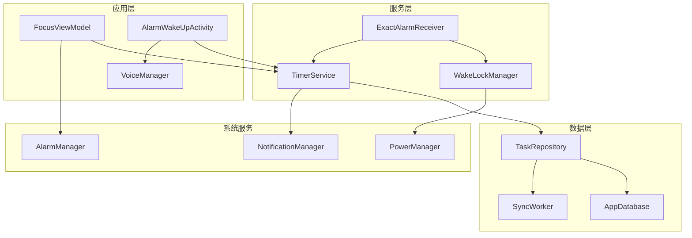
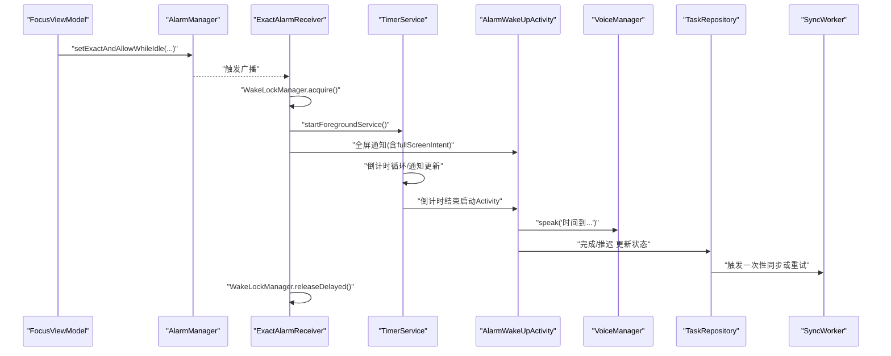
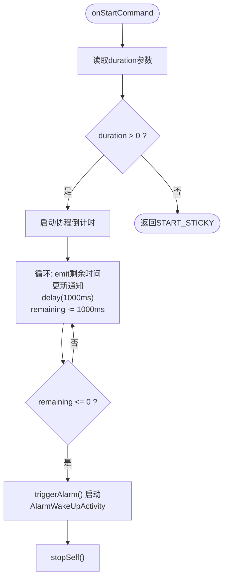
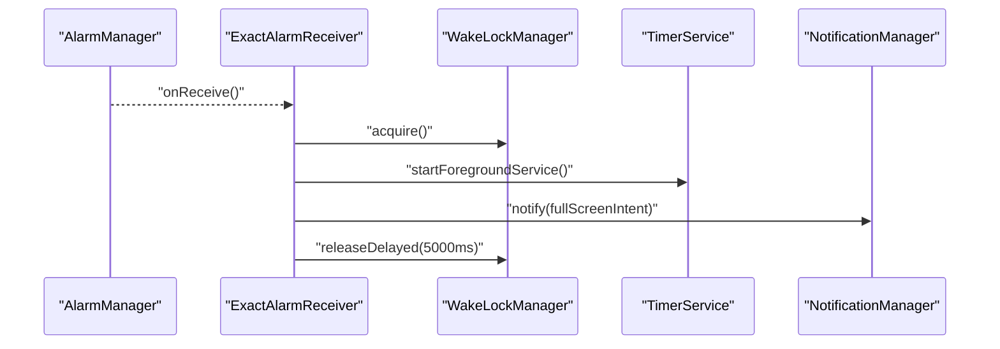
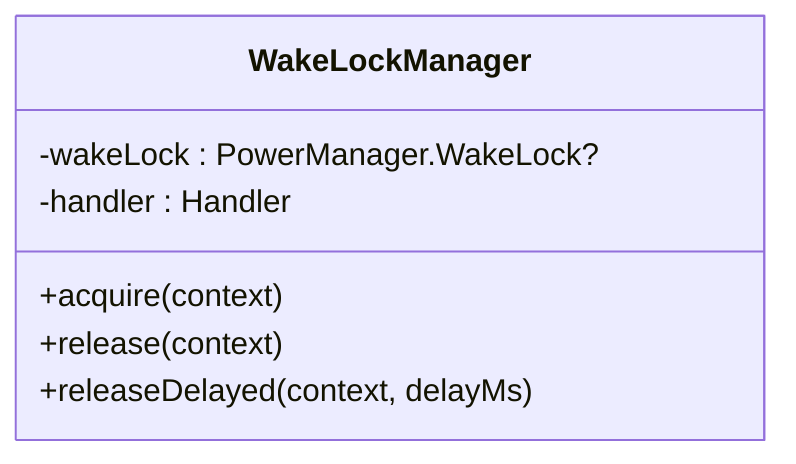
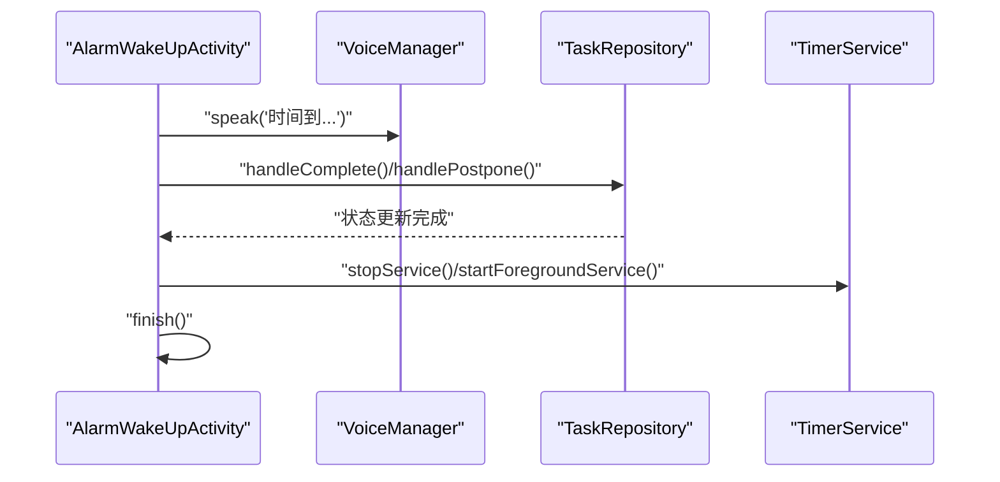
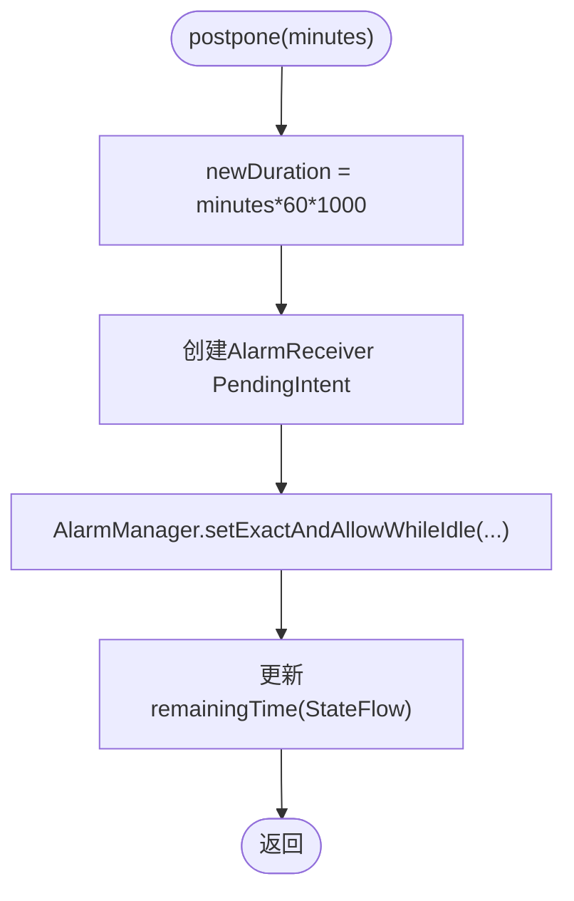
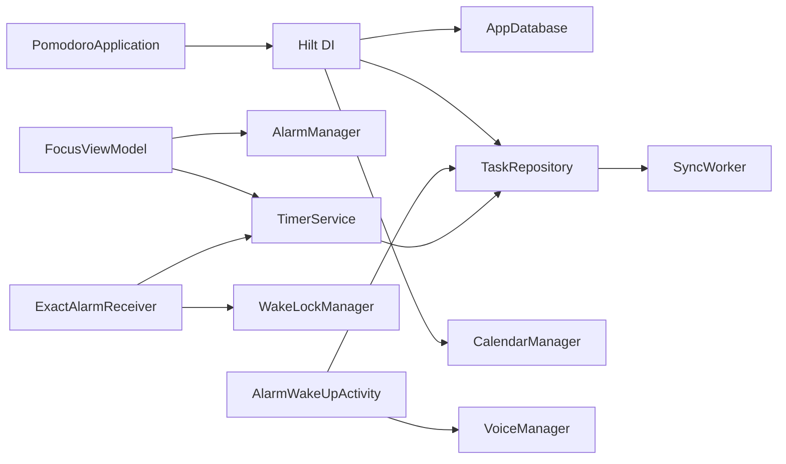

# 服务系统

<cite>
**本文引用的文件**
- [TimerService.kt](file://app/src/main/java/com/pomodoroalert/service/TimerService.kt)
- [ExactAlarmReceiver.kt](file://app/src/main/java/com/pomodoroalert/receiver/ExactAlarmReceiver.kt)
- [WakeLockManager.kt](file://app/src/main/java/com/pomodoroalert/receiver/WakeLockManager.kt)
- [AlarmWakeUpActivity.kt](file://app/src/main/java/com/pomodoroalert/ui/AlarmWakeUpActivity.kt)
- [FocusViewModel.kt](file://app/src/main/java/com/pomodoroalert/ui/viewmodel/FocusViewModel.kt)
- [VoiceManager.kt](file://app/src/main/java/com/pomodoroalert/voice/VoiceManager.kt)
- [TaskRepository.kt](file://app/src/main/java/com/pomodoroalert/data/TaskRepository.kt)
- [SyncWorker.kt](file://app/src/main/java/com/pomodoroalert/worker/SyncWorker.kt)
- [AppModule.kt](file://app/src/main/java/com/pomodoroalert/di/AppModule.kt)
- [PomodoroApplication.kt](file://app/src/main/java/com/pomodoroalert/PomodoroApplication.kt)
- [AndroidManifest.xml](file://app/src/main/AndroidManifest.xml)
</cite>

## 目录
1. [简介](#简介)
2. [项目结构](#项目结构)
3. [核心组件](#核心组件)
4. [架构总览](#架构总览)
5. [详细组件分析](#详细组件分析)
6. [依赖关系分析](#依赖关系分析)
7. [性能与资源优化](#性能与资源优化)
8. [故障排查指南](#故障排查指南)
9. [结论](#结论)
10. [附录](#附录)

## 简介
本文件面向PomodoroAlert的服务系统，围绕前台服务、精确闹钟、唤醒锁管理、全屏唤醒活动等核心能力进行深入技术说明。内容涵盖服务生命周期、通知管理、系统资源优化、时间计算与系统适配、CPU唤醒与屏幕点亮、音频播放、全屏交互、性能优化与电池控制、稳定性与异常处理等，帮助开发者与运维人员快速理解并维护该服务系统。

## 项目结构
服务系统主要由以下模块构成：
- 前台服务：TimerService 负责倒计时、通知更新与闹钟触发。
- 精确闹钟：通过 AlarmManager 设置精确触发点，广播接收器 ExactAlarmReceiver 在触发后启动服务并展示全屏通知。
- 唤醒锁管理：WakeLockManager 提供短时 CPU 唤醒，避免系统休眠影响任务执行。
- 全屏唤醒活动：AlarmWakeUpActivity 展示黑底半透明界面、语音播报、完成/推迟交互。
- 视图模型与数据层：FocusViewModel 配置精确闹钟；TaskRepository 负责任务状态变更与同步；SyncWorker 异步重试同步。
- 应用与依赖注入：PomodoroApplication 启动 Hilt；AppModule 提供数据库与仓库实例。

图表来源
- [FocusViewModel.kt:32-65](file://app/src/main/java/com/pomodoroalert/ui/viewmodel/FocusViewModel.kt#L32-L65)
- [TimerService.kt:38-66](file://app/src/main/java/com/pomodoroalert/service/TimerService.kt#L38-L66)
- [ExactAlarmReceiver.kt:14-47](file://app/src/main/java/com/pomodoroalert/receiver/ExactAlarmReceiver.kt#L14-L47)
- [WakeLockManager.kt:12-29](file://app/src/main/java/com/pomodoroalert/receiver/WakeLockManager.kt#L12-L29)
- [AlarmWakeUpActivity.kt:30-98](file://app/src/main/java/com/pomodoroalert/ui/AlarmWakeUpActivity.kt#L30-L98)
- [TaskRepository.kt:32-80](file://app/src/main/java/com/pomodoroalert/data/TaskRepository.kt#L32-L80)
- [SyncWorker.kt:24-71](file://app/src/main/java/com/pomodoroalert/worker/SyncWorker.kt#L24-L71)

章节来源
- [AndroidManifest.xml:11-38](file://app/src/main/AndroidManifest.xml#L11-L38)
- [PomodoroApplication.kt:6](file://app/src/main/java/com/pomodoroalert/PomodoroApplication.kt#L6)
- [AppModule.kt:19-60](file://app/src/main/java/com/pomodoroalert/di/AppModule.kt#L19-L60)

## 核心组件
- 前台服务 TimerService：负责倒计时、通知更新、闹钟触发与服务自停。
- 精确闹钟广播接收器 ExactAlarmReceiver：在闹钟触发时获取唤醒锁、启动前台服务、发送全屏通知并释放唤醒锁。
- 唤醒锁管理 WakeLockManager：短时 PARTIAL_WAKE_LOCK，避免系统休眠。
- 全屏唤醒活动 AlarmWakeUpActivity：展示黑底半透明界面、语音播报、完成/推迟交互。
- 视图模型 FocusViewModel：配置 AlarmManager 的精确闹钟，启动前台服务。
- 语音播报 VoiceManager：请求音频焦点、使用 TTS 播放提示音。
- 数据与同步 TaskRepository/SyncWorker：任务状态变更后触发网络同步或延迟重试。
- 依赖注入与应用入口：AppModule、PomodoroApplication。

章节来源
- [TimerService.kt:24-102](file://app/src/main/java/com/pomodoroalert/service/TimerService.kt#L24-L102)
- [ExactAlarmReceiver.kt:13-48](file://app/src/main/java/com/pomodoroalert/receiver/ExactAlarmReceiver.kt#L13-L48)
- [WakeLockManager.kt:8-30](file://app/src/main/java/com/pomodoroalert/receiver/WakeLockManager.kt#L8-L30)
- [AlarmWakeUpActivity.kt:25-104](file://app/src/main/java/com/pomodoroalert/ui/AlarmWakeUpActivity.kt#L25-L104)
- [FocusViewModel.kt:22-84](file://app/src/main/java/com/pomodoroalert/ui/viewmodel/FocusViewModel.kt#L22-L84)
- [VoiceManager.kt:12-62](file://app/src/main/java/com/pomodoroalert/voice/VoiceManager.kt#L12-L62)
- [TaskRepository.kt:19-100](file://app/src/main/java/com/pomodoroalert/data/TaskRepository.kt#L19-L100)
- [SyncWorker.kt:15-77](file://app/src/main/java/com/pomodoroalert/worker/SyncWorker.kt#L15-77)

## 架构总览
服务系统采用“视图模型驱动闹钟、广播接收器协调服务与唤醒、前台服务维持通知、全屏活动承载交互”的分层设计。AlarmManager 精确触发，WakeLockManager 确保短暂系统唤醒，TimerService 负责倒计时与通知，AlarmWakeUpActivity 承载用户交互与语音播报，TaskRepository 与 SyncWorker 负责状态持久化与网络同步。

图表来源
- [FocusViewModel.kt:52-62](file://app/src/main/java/com/pomodoroalert/ui/viewmodel/FocusViewModel.kt#L52-L62)
- [ExactAlarmReceiver.kt:14-47](file://app/src/main/java/com/pomodoroalert/receiver/ExactAlarmReceiver.kt#L14-L47)
- [TimerService.kt:46-66](file://app/src/main/java/com/pomodoroalert/service/TimerService.kt#L46-L66)
- [AlarmWakeUpActivity.kt:35-36](file://app/src/main/java/com/pomodoroalert/ui/AlarmWakeUpActivity.kt#L35-L36)
- [TaskRepository.kt:32-80](file://app/src/main/java/com/pomodoroalert/data/TaskRepository.kt#L32-L80)
- [SyncWorker.kt:24-71](file://app/src/main/java/com/pomodoroalert/worker/SyncWorker.kt#L24-L71)

## 详细组件分析

### 前台服务 TimerService
- 生命周期与职责
  - onCreate：创建通知通道并以前台服务方式启动，持续显示通知。
  - onStartCommand：接收时长参数，启动倒计时协程；当剩余时间为0时触发闹钟并停止自身。
  - 通知管理：构建通知、更新通知、前台通知ID固定。
- 协程与状态流
  - 使用协程作用域与 StateFlow 暴露剩余时间，每秒更新一次。
- 闹钟触发
  - 倒计时结束后启动 AlarmWakeUpActivity，完成从后台到前台的过渡。

图表来源
- [TimerService.kt:38-59](file://app/src/main/java/com/pomodoroalert/service/TimerService.kt#L38-L59)
- [TimerService.kt:61-66](file://app/src/main/java/com/pomodoroalert/service/TimerService.kt#L61-L66)

章节来源
- [TimerService.kt:24-102](file://app/src/main/java/com/pomodoroalert/service/TimerService.kt#L24-L102)

### 精确闹钟与广播接收器 ExactAlarmReceiver
- 触发流程
  - AlarmManager 精确触发后，系统回调广播接收器。
  - 接收器先获取唤醒锁，再启动前台服务处理后续逻辑。
  - 发送全屏通知（包含 fullScreenIntent），确保解锁可见。
  - 短延时后释放唤醒锁，避免长时间占用电源。
- 与系统版本兼容
  - 使用条件判断选择 startForegroundService 或 startService，保证兼容性。

图表来源
- [ExactAlarmReceiver.kt:14-47](file://app/src/main/java/com/pomodoroalert/receiver/ExactAlarmReceiver.kt#L14-L47)
- [WakeLockManager.kt:12-29](file://app/src/main/java/com/pomodoroalert/receiver/WakeLockManager.kt#L12-L29)

章节来源
- [ExactAlarmReceiver.kt:13-48](file://app/src/main/java/com/pomodoroalert/receiver/ExactAlarmReceiver.kt#L13-L48)

### 唤醒锁管理器 WakeLockManager
- 设计要点
  - 使用 PARTIAL_WAKE_LOCK，限定最大持有时间，避免过度耗电。
  - 提供立即释放与延迟释放接口，配合广播接收器的短时唤醒策略。
- 安全性
  - 若已持有则跳过重复获取，防止泄漏。
  - 释放时检查持有状态，确保幂等。

图表来源
- [WakeLockManager.kt:8-30](file://app/src/main/java/com/pomodoroalert/receiver/WakeLockManager.kt#L8-L30)

章节来源
- [WakeLockManager.kt:8-30](file://app/src/main/java/com/pomodoroalert/receiver/WakeLockManager.kt#L8-L30)

### 全屏唤醒活动 AlarmWakeUpActivity
- 窗口属性
  - setShowWhenLocked(true)、setTurnScreenOn(true)，确保锁屏可见与点亮。
- 用户交互
  - 提供“完成”和“推迟 10 分钟”按钮，分别更新任务状态并停止服务或重启定时。
- 语音播报
  - 通过 VoiceManager 请求音频焦点并播放提示语，结束后释放焦点。
- 生命周期
  - onDestroy 中释放音频焦点，避免资源泄漏。

图表来源
- [AlarmWakeUpActivity.kt:30-98](file://app/src/main/java/com/pomodoroalert/ui/AlarmWakeUpActivity.kt#L30-L98)
- [VoiceManager.kt:28-61](file://app/src/main/java/com/pomodoroalert/voice/VoiceManager.kt#L28-L61)
- [TaskRepository.kt:32-80](file://app/src/main/java/com/pomodoroalert/data/TaskRepository.kt#L32-L80)

章节来源
- [AlarmWakeUpActivity.kt:25-104](file://app/src/main/java/com/pomodoroalert/ui/AlarmWakeUpActivity.kt#L25-L104)

### 视图模型与精确闹钟配置 FocusViewModel
- 启动前台服务
  - 根据任务时长启动 TimerService，传递 taskId 以便后续状态更新。
- 精确闹钟
  - 使用 AlarmManager.setExactAndAllowWhileIdle 设置 RTC_WAKEUP，支持设备休眠时唤醒。
  - 计算触发时刻为当前时间加上推迟分钟数转换为毫秒。
- 任务完成/放弃
  - 更新状态并停止服务，清空当前任务状态。

图表来源
- [FocusViewModel.kt:49-65](file://app/src/main/java/com/pomodoroalert/ui/viewmodel/FocusViewModel.kt#L49-L65)

章节来源
- [FocusViewModel.kt:22-84](file://app/src/main/java/com/pomodoroalert/ui/viewmodel/FocusViewModel.kt#L22-L84)

### 语音播报 VoiceManager
- 音频焦点
  - 使用 USAGE_ALARM + CONTENT_TYPE_SONIFICATION 的组合请求 AUDIOFOCUS_GAIN_TRANSIENT_MAY_DUCK，允许系统降音。
- TTS 播放
  - 设置音频属性为 USAGE_ALARM + CONTENT_TYPE_SPEECH，使用 QUEUE_FLUSH 立即播放。
  - 注册 UtteranceProgressListener，在完成或错误时自动释放音频焦点。
- 资源释放
  - onDestroy 中调用 abandonFocus，确保焦点回收。

章节来源
- [VoiceManager.kt:12-62](file://app/src/main/java/com/pomodoroalert/voice/VoiceManager.kt#L12-L62)

### 数据与同步 TaskRepository 与 SyncWorker
- 状态变更触发同步
  - 当任务状态为“已完成/已放弃/推迟”时，构造 WebhookPayload 并尝试同步。
  - 同步成功更新同步状态为“Synced”，失败则标记为“Sync_Pending”并调度一次性工作。
- 异常处理与重试
  - 捕获异常并记录，将失败任务纳入待重试队列。
  - SyncWorker 逐条重试，全部成功返回 success，否则返回 retry，交由 WorkManager 自动退避重试。

章节来源
- [TaskRepository.kt:32-94](file://app/src/main/java/com/pomodoroalert/data/TaskRepository.kt#L32-L94)
- [SyncWorker.kt:24-71](file://app/src/main/java/com/pomodoroalert/worker/SyncWorker.kt#L24-L71)

## 依赖关系分析
- 应用与注入
  - @HiltAndroidApp 标注应用类，AppModule 提供数据库、DAO、UserPreferences、仓库等单例。
- 组件耦合
  - FocusViewModel 依赖 AlarmManager 与 TimerService；AlarmWakeUpActivity 依赖 VoiceManager 与 TaskRepository。
  - ExactAlarmReceiver 依赖 WakeLockManager 与 TimerService；TimerService 依赖通知与任务仓库。
- 权限与声明
  - AndroidManifest 声明前台服务、唤醒锁、忽略电池优化、录音、日历读取、通知权限。

图表来源
- [PomodoroApplication.kt:6](file://app/src/main/java/com/pomodoroalert/PomodoroApplication.kt#L6)
- [AppModule.kt:23-59](file://app/src/main/java/com/pomodoroalert/di/AppModule.kt#L23-L59)
- [FocusViewModel.kt:22-46](file://app/src/main/java/com/pomodoroalert/ui/viewmodel/FocusViewModel.kt#L22-L46)
- [ExactAlarmReceiver.kt:13-25](file://app/src/main/java/com/pomodoroalert/receiver/ExactAlarmReceiver.kt#L13-L25)
- [AlarmWakeUpActivity.kt:27-28](file://app/src/main/java/com/pomodoroalert/ui/AlarmWakeUpActivity.kt#L27-L28)

章节来源
- [AndroidManifest.xml:4-9](file://app/src/main/AndroidManifest.xml#L4-L9)
- [AndroidManifest.xml:33-36](file://app/src/main/AndroidManifest.xml#L33-L36)

## 性能与资源优化
- 电池与功耗控制
  - WakeLockManager 仅短时持有唤醒锁（约10秒），并在广播接收器中延迟释放，降低耗电风险。
  - AlarmManager 使用 setExactAndAllowWhileIdle，确保在节电模式下仍可唤醒，但尽量缩短唤醒窗口。
- 内存与线程
  - TimerService 使用协程作用域与 StateFlow，避免频繁创建线程；通知更新按秒级频率，避免高频 IO。
  - AlarmWakeUpActivity 在 onDestroy 中释放音频焦点，避免后台残留占用。
- 同步与网络
  - TaskRepository 成功后立即同步，失败标记为待重试并通过 WorkManager 异步重试，减少主线程阻塞。
- 前台服务类型
  - 清晰声明 foregroundServiceType="mediaPlayback"，符合通知与媒体播放场景，提升系统信任度。

章节来源
- [WakeLockManager.kt:12-29](file://app/src/main/java/com/pomodoroalert/receiver/WakeLockManager.kt#L12-L29)
- [FocusViewModel.kt:52-62](file://app/src/main/java/com/pomodoroalert/ui/viewmodel/FocusViewModel.kt#L52-L62)
- [TimerService.kt:25-27](file://app/src/main/java/com/pomodoroalert/service/TimerService.kt#L25-L27)
- [AlarmWakeUpActivity.kt:100-103](file://app/src/main/java/com/pomodoroalert/ui/AlarmWakeUpActivity.kt#L100-L103)
- [TaskRepository.kt:32-80](file://app/src/main/java/com/pomodoroalert/data/TaskRepository.kt#L32-L80)
- [AndroidManifest.xml:35](file://app/src/main/AndroidManifest.xml#L35)

## 故障排查指南
- 闹钟未触发
  - 检查 AlarmManager 是否正确设置 setExactAndAllowWhileIdle，确认 PendingIntent 标志位与系统版本兼容。
  - 确认 ExactAlarmReceiver 已在清单中声明且未被系统限制。
- 无法点亮屏幕或锁屏不可见
  - 检查 AlarmWakeUpActivity 的 showWhenLocked 与 turnScreenOn 是否启用。
  - 确认全屏通知的 fullScreenIntent 是否正确构建并携带 FLAG_ACTIVITY_NEW_TASK/CLEAR_TOP。
- 唤醒锁导致耗电
  - 检查 WakeLockManager.acquire/release 是否成对调用，是否存在重复获取或未释放。
  - 确认 releaseDelayed 是否在合理时间内执行。
- 语音播报无声或冲突
  - 检查音频焦点请求是否成功，确认 USAGE_ALARM 与 CONTENT_TYPE 设置。
  - 确认 UtteranceProgressListener 是否在完成/错误时释放焦点。
- 同步失败或未触发
  - 查看 TaskRepository 的异常捕获与待重试标记，确认 WorkManager 的约束与一次性任务是否入队。
  - 检查网络可用性与 Webhook 返回状态。

章节来源
- [FocusViewModel.kt:52-62](file://app/src/main/java/com/pomodoroalert/ui/viewmodel/FocusViewModel.kt#L52-L62)
- [AlarmWakeUpActivity.kt:32-33](file://app/src/main/java/com/pomodoroalert/ui/AlarmWakeUpActivity.kt#L32-L33)
- [ExactAlarmReceiver.kt:27-44](file://app/src/main/java/com/pomodoroalert/receiver/ExactAlarmReceiver.kt#L27-L44)
- [WakeLockManager.kt:12-29](file://app/src/main/java/com/pomodoroalert/receiver/WakeLockManager.kt#L12-L29)
- [VoiceManager.kt:28-61](file://app/src/main/java/com/pomodoroalert/voice/VoiceManager.kt#L28-L61)
- [TaskRepository.kt:68-79](file://app/src/main/java/com/pomodoroalert/data/TaskRepository.kt#L68-L79)
- [SyncWorker.kt:57-71](file://app/src/main/java/com/pomodoroalert/worker/SyncWorker.kt#L57-L71)

## 结论
该服务系统通过 AlarmManager 精确触发、WakeLockManager 短时唤醒、前台服务持续通知、全屏活动承载交互与语音播报，形成完整的番茄钟提醒闭环。配合 TaskRepository 与 SyncWorker 的异步同步机制，实现了稳定的任务状态管理与网络可靠性。遵循系统权限与前台服务类型声明，有助于在现代 Android 上获得更好的运行环境与用户体验。

## 附录
- 关键流程图（算法实现）
  - 倒计时与通知更新流程已在“前台服务 TimerService”部分给出。
  - 精确闹钟设置流程已在“视图模型与精确闹钟配置 FocusViewModel”部分给出。
  - 唤醒锁释放流程已在“唤醒锁管理器 WakeLockManager”部分给出。