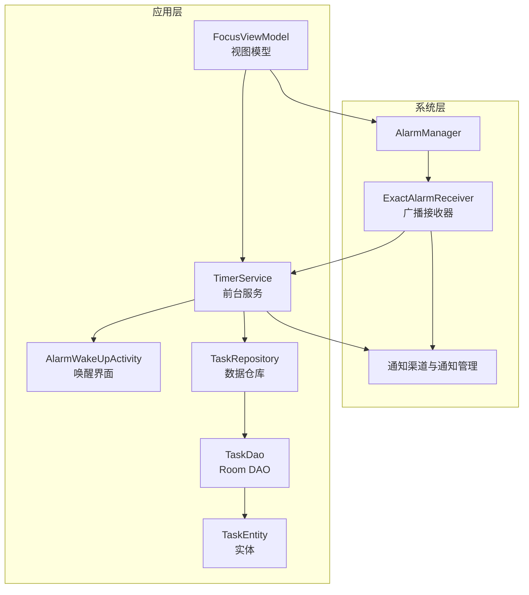
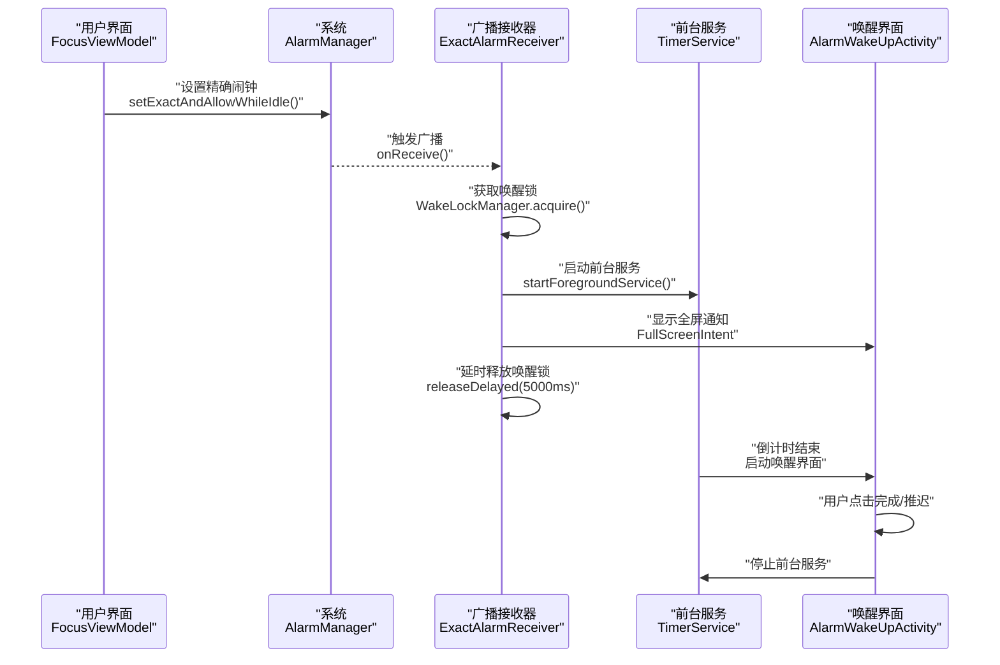
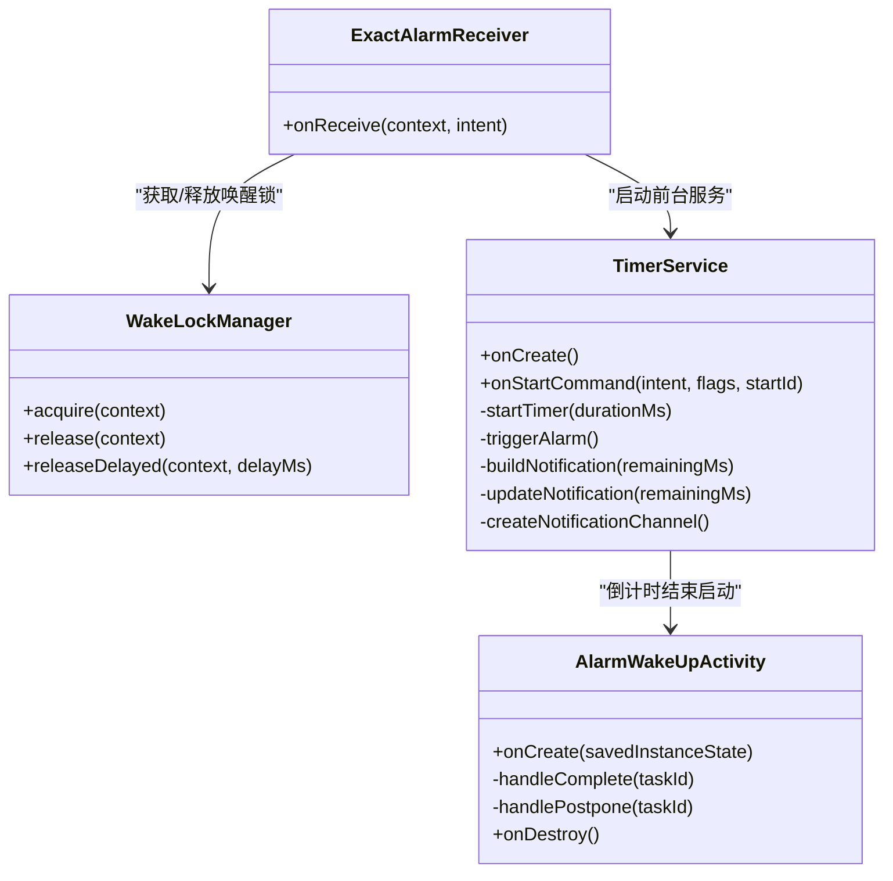
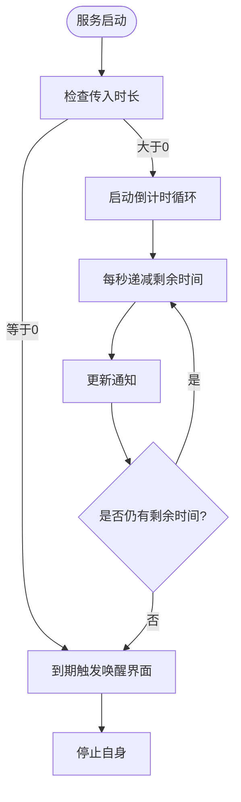
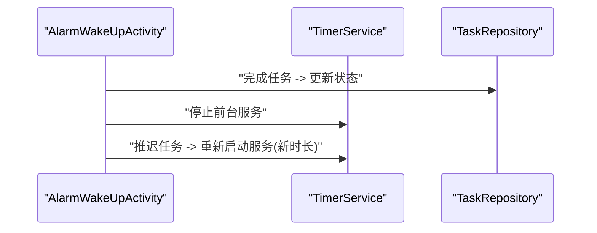
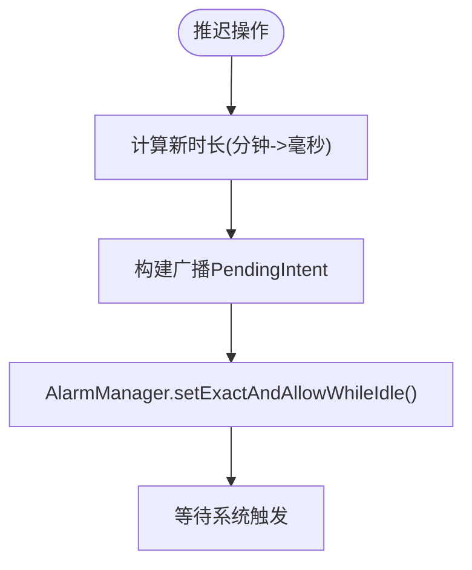
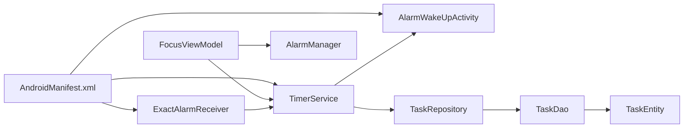

# 系统广播接收器

<cite>
**本文引用的文件**
- [ExactAlarmReceiver.kt](file://app/src/main/java/com/pomodoroalert/receiver/ExactAlarmReceiver.kt)
- [WakeLockManager.kt](file://app/src/main/java/com/pomodoroalert/receiver/WakeLockManager.kt)
- [TimerService.kt](file://app/src/main/java/com/pomodoroalert/service/TimerService.kt)
- [AlarmWakeUpActivity.kt](file://app/src/main/java/com/pomodoroalert/ui/AlarmWakeUpActivity.kt)
- [FocusViewModel.kt](file://app/src/main/java/com/pomodoroalert/ui/viewmodel/FocusViewModel.kt)
- [AndroidManifest.xml](file://app/src/main/AndroidManifest.xml)
- [TaskRepository.kt](file://app/src/main/java/com/pomodoroalert/data/TaskRepository.kt)
- [TaskEntity.kt](file://app/src/main/java/com/pomodoroalert/data/TaskEntity.kt)
- [TaskDao.kt](file://app/src/main/java/com/pomodoroalert/data/TaskDao.kt)
- [PomodoroApplication.kt](file://app/src/main/java/com/pomodoroalert/PomodoroApplication.kt)
</cite>

## 目录
1. [简介](#简介)
2. [项目结构](#项目结构)
3. [核心组件](#核心组件)
4. [架构总览](#架构总览)
5. [详细组件分析](#详细组件分析)
6. [依赖关系分析](#依赖关系分析)
7. [性能考虑](#性能考虑)
8. [故障排查指南](#故障排查指南)
9. [结论](#结论)

## 简介
本文件针对 PomodoroAlert 的“系统广播接收器”（精确闹钟）实现进行全面技术说明，重点覆盖以下方面：
- AlarmManager 的使用方式与时间计算逻辑
- 广播接收器的注册机制、权限配置与系统适配策略
- 闹钟触发后的处理流程：任务状态更新、通知发送、用户提醒
- 精确时间控制、电池优化与系统限制应对
- 常见问题排查与性能优化建议

## 项目结构
围绕“精确闹钟”的关键模块与文件组织如下：
- 广播接收器：负责在系统闹钟触发时唤醒应用处理流程
- 前台服务：负责倒计时与通知更新，并在到期时启动唤醒界面
- 唤醒界面：展示提醒内容，支持完成/推迟操作
- 视图模型：负责与 AlarmManager 对接，设置精确闹钟
- 数据层：负责任务状态持久化与同步
- 权限与清单：声明前台服务、唤醒锁、忽略电池优化等权限



图表来源
- [AndroidManifest.xml:36](file://app/src/main/AndroidManifest.xml#L36)
- [FocusViewModel.kt:52-62](file://app/src/main/java/com/pomodoroalert/ui/viewmodel/FocusViewModel.kt#L52-L62)
- [ExactAlarmReceiver.kt:13-47](file://app/src/main/java/com/pomodoroalert/receiver/ExactAlarmReceiver.kt#L13-L47)
- [TimerService.kt:24-99](file://app/src/main/java/com/pomodoroalert/service/TimerService.kt#L24-L99)
- [AlarmWakeUpActivity.kt:25-98](file://app/src/main/java/com/pomodoroalert/ui/AlarmWakeUpActivity.kt#L25-L98)
- [TaskRepository.kt:20-94](file://app/src/main/java/com/pomodoroalert/data/TaskRepository.kt#L20-L94)
- [TaskDao.kt:9-28](file://app/src/main/java/com/pomodoroalert/data/TaskDao.kt#L9-L28)
- [TaskEntity.kt:8-18](file://app/src/main/java/com/pomodoroalert/data/TaskEntity.kt#L8-L18)

章节来源
- [AndroidManifest.xml:11-37](file://app/src/main/AndroidManifest.xml#L11-L37)
- [PomodoroApplication.kt:6](file://app/src/main/java/com/pomodoroalert/PomodoroApplication.kt#L6)

## 核心组件
- 广播接收器（ExactAlarmReceiver）
  - 在系统闹钟触发时被调用，负责短暂持有唤醒锁、启动前台服务、显示全屏通知以强制解锁屏幕，并在短延迟后释放唤醒锁。
- 前台服务（TimerService）
  - 在前台运行，持续更新通知；当倒计时结束时启动唤醒界面。
- 唤醒界面（AlarmWakeUpActivity）
  - 展示“时间到”的提示，提供完成/推迟按钮；完成时更新任务状态并停止服务。
- 视图模型（FocusViewModel）
  - 使用 AlarmManager 设置精确闹钟（允许在待机时唤醒），并通过 PendingIntent 指向广播接收器。
- 数据层（TaskRepository/TaskDao/TaskEntity）
  - 负责任务状态持久化与完成后触发的同步流程。

章节来源
- [ExactAlarmReceiver.kt:13-47](file://app/src/main/java/com/pomodoroalert/receiver/ExactAlarmReceiver.kt#L13-L47)
- [TimerService.kt:24-99](file://app/src/main/java/com/pomodoroalert/service/TimerService.kt#L24-L99)
- [AlarmWakeUpActivity.kt:25-98](file://app/src/main/java/com/pomodoroalert/ui/AlarmWakeUpActivity.kt#L25-L98)
- [FocusViewModel.kt:32-65](file://app/src/main/java/com/pomodoroalert/ui/viewmodel/FocusViewModel.kt#L32-L65)
- [TaskRepository.kt:20-94](file://app/src/main/java/com/pomodoroalert/data/TaskRepository.kt#L20-L94)
- [TaskDao.kt:9-28](file://app/src/main/java/com/pomodoroalert/data/TaskDao.kt#L9-L28)
- [TaskEntity.kt:8-18](file://app/src/main/java/com/pomodoroalert/data/TaskEntity.kt#L8-L18)

## 架构总览
下图展示了从“设置精确闹钟”到“闹钟触发并完成提醒”的完整链路：



图表来源
- [FocusViewModel.kt:52-62](file://app/src/main/java/com/pomodoroalert/ui/viewmodel/FocusViewModel.kt#L52-L62)
- [ExactAlarmReceiver.kt:13-47](file://app/src/main/java/com/pomodoroalert/receiver/ExactAlarmReceiver.kt#L13-L47)
- [TimerService.kt:46-66](file://app/src/main/java/com/pomodoroalert/service/TimerService.kt#L46-L66)
- [AlarmWakeUpActivity.kt:75-98](file://app/src/main/java/com/pomodoroalert/ui/AlarmWakeUpActivity.kt#L75-L98)

## 详细组件分析

### 广播接收器（ExactAlarmReceiver）
- 触发时机：由系统在 AlarmManager 的精确闹钟到达时回调。
- 关键职责：
  - 获取唤醒锁，确保 CPU 不会休眠导致处理中断
  - 启动前台服务以继续处理倒计时或直接进入唤醒界面
  - 发送全屏通知以强制解锁屏幕并引导用户操作
  - 在短延迟后释放唤醒锁，避免长时间占用电源
- 兼容性处理：
  - 使用条件分支区分 Android O 及以上版本的前台服务启动方式
  - PendingIntent 标志根据 SDK 版本设置为不可变
- 通知策略：
  - 使用高优先级与“闹钟”类别，确保在锁屏状态下可见
  - 通过全屏 Intent 直接打开唤醒界面



图表来源
- [ExactAlarmReceiver.kt:13-47](file://app/src/main/java/com/pomodoroalert/receiver/ExactAlarmReceiver.kt#L13-L47)
- [WakeLockManager.kt:8-30](file://app/src/main/java/com/pomodoroalert/receiver/WakeLockManager.kt#L8-L30)
- [TimerService.kt:24-99](file://app/src/main/java/com/pomodoroalert/service/TimerService.kt#L24-L99)
- [AlarmWakeUpActivity.kt:25-98](file://app/src/main/java/com/pomodoroalert/ui/AlarmWakeUpActivity.kt#L25-L98)

章节来源
- [ExactAlarmReceiver.kt:13-47](file://app/src/main/java/com/pomodoroalert/receiver/ExactAlarmReceiver.kt#L13-L47)
- [WakeLockManager.kt:8-30](file://app/src/main/java/com/pomodoroalert/receiver/WakeLockManager.kt#L8-L30)

### 前台服务（TimerService）
- 生命周期：
  - 创建时建立通知通道并以前台服务形式运行
  - 接收启动命令后根据传入的时长执行倒计时
- 倒计时逻辑：
  - 每秒更新一次剩余时间并刷新通知
  - 到期后启动唤醒界面
- 通知策略：
  - 使用低重要性的通知通道，避免打扰
  - 内容包含剩余时间，便于用户感知



图表来源
- [TimerService.kt:38-66](file://app/src/main/java/com/pomodoroalert/service/TimerService.kt#L38-L66)

章节来源
- [TimerService.kt:24-99](file://app/src/main/java/com/pomodoroalert/service/TimerService.kt#L24-L99)

### 唤醒界面（AlarmWakeUpActivity）
- 功能：
  - 显示“时间到”的提示与半透明背景
  - 提供“完成”和“推迟10分钟”按钮
  - 完成时更新任务状态并停止前台服务
  - 推迟时重新启动前台服务并传入新的时长
- 交互细节：
  - 设置“显示在锁屏上”和“点亮屏幕”
  - 使用 TTS 播放语音提醒



图表来源
- [AlarmWakeUpActivity.kt:75-98](file://app/src/main/java/com/pomodoroalert/ui/AlarmWakeUpActivity.kt#L75-L98)
- [TaskRepository.kt:32-38](file://app/src/main/java/com/pomodoroalert/data/TaskRepository.kt#L32-L38)

章节来源
- [AlarmWakeUpActivity.kt:25-98](file://app/src/main/java/com/pomodoroalert/ui/AlarmWakeUpActivity.kt#L25-L98)

### 视图模型与 AlarmManager（精确闹钟设置）
- 设置流程：
  - 计算触发时刻：当前时间 + 推迟时长
  - 创建指向广播接收器的 PendingIntent
  - 使用 AlarmManager 的“精确+允许在待机时唤醒”接口设置闹钟
- 时间计算：
  - 推迟分钟数转换为毫秒作为新时长
  - 通过 PendingIntent 传递给广播接收器，再由前台服务处理



图表来源
- [FocusViewModel.kt:49-65](file://app/src/main/java/com/pomodoroalert/ui/viewmodel/FocusViewModel.kt#L49-L65)

章节来源
- [FocusViewModel.kt:32-65](file://app/src/main/java/com/pomodoroalert/ui/viewmodel/FocusViewModel.kt#L32-L65)

### 数据层（任务状态与同步）
- 任务状态更新：
  - 完成/放弃/推迟后触发同步流程
- 同步策略：
  - 成功则标记为已同步
  - 失败或异常则标记为待同步并安排后台任务重试

```mermaid
erDiagram
TASK_ENTITY {
string taskId PK
string taskName
long duration
string status
long createdAt
string source
string syncStatus
}
TASK_DAO {
insert(task)
getActiveTasks()
getTaskById(id)
updateStatus(id, newStatus)
getPendingSyncTasks()
updateSyncStatus(id, syncStatus)
}
TASK_REPOSITORY {
updateStatus(id, newStatus)
triggerSync(taskId)
markPendingAndScheduleRetry(taskId)
}
TASK_REPOSITORY --> TASK_DAO : "使用"
TASK_DAO --> TASK_ENTITY : "持久化"
```

图表来源
- [TaskEntity.kt:8-18](file://app/src/main/java/com/pomodoroalert/data/TaskEntity.kt#L8-L18)
- [TaskDao.kt:9-28](file://app/src/main/java/com/pomodoroalert/data/TaskDao.kt#L9-L28)
- [TaskRepository.kt:20-94](file://app/src/main/java/com/pomodoroalert/data/TaskRepository.kt#L20-L94)

章节来源
- [TaskRepository.kt:20-94](file://app/src/main/java/com/pomodoroalert/data/TaskRepository.kt#L20-L94)
- [TaskDao.kt:9-28](file://app/src/main/java/com/pomodoroalert/data/TaskDao.kt#L9-L28)
- [TaskEntity.kt:8-18](file://app/src/main/java/com/pomodoroalert/data/TaskEntity.kt#L8-L18)

## 依赖关系分析
- 组件耦合：
  - 广播接收器依赖唤醒锁管理器与前台服务
  - 前台服务依赖唤醒界面与通知管理
  - 视图模型依赖 AlarmManager 与前台服务
  - 数据层通过 DAO 与实体进行持久化
- 清单与权限：
  - 声明前台服务、唤醒锁、忽略电池优化、通知权限
  - 广播接收器在清单中注册



图表来源
- [AndroidManifest.xml:3-9](file://app/src/main/AndroidManifest.xml#L3-L9)
- [AndroidManifest.xml:33-36](file://app/src/main/AndroidManifest.xml#L33-L36)
- [PomodoroApplication.kt:6](file://app/src/main/java/com/pomodoroalert/PomodoroApplication.kt#L6)

章节来源
- [AndroidManifest.xml:3-9](file://app/src/main/AndroidManifest.xml#L3-L9)
- [AndroidManifest.xml:33-36](file://app/src/main/AndroidManifest.xml#L33-L36)

## 性能考虑
- 精确时间控制
  - 使用“精确+允许在待机时唤醒”的闹钟模式，确保在系统节电策略下仍可按时触发
  - 避免使用重复闹钟，减少系统唤醒频率
- 电池优化与系统限制
  - 申请忽略电池优化权限，降低系统对应用进程的限制
  - 使用前台服务与通知通道，提升系统对关键任务的容忍度
- 唤醒锁管理
  - 仅在必要时获取唤醒锁，且在短延迟后释放，避免过度耗电
- 通知策略
  - 锁屏全屏通知用于强制唤醒，但应尽量缩短持有时间，减少对用户体验的影响
- 后台同步
  - 失败时采用“待同步+后台重试”的策略，避免阻塞主线程

## 故障排查指南
- 闹钟不触发
  - 检查是否正确设置了“精确+允许在待机时唤醒”的闹钟
  - 确认 PendingIntent 的标志与 SDK 版本匹配
  - 核对系统省电策略与忽略电池优化权限状态
- 无法唤醒屏幕
  - 确认全屏通知已正确设置并具有高优先级
  - 检查 Activity 是否声明了“显示在锁屏上”和“点亮屏幕”
- 唤醒界面未出现
  - 检查广播接收器是否成功启动前台服务
  - 确认通知渠道已创建且未被禁用
- 任务状态未更新
  - 检查数据仓库的同步逻辑与 DAO 的状态更新语句
  - 确认失败路径是否正确标记为“待同步”并安排重试

章节来源
- [FocusViewModel.kt:52-62](file://app/src/main/java/com/pomodoroalert/ui/viewmodel/FocusViewModel.kt#L52-L62)
- [AndroidManifest.xml:19-23](file://app/src/main/AndroidManifest.xml#L19-L23)
- [TaskRepository.kt:32-38](file://app/src/main/java/com/pomodoroalert/data/TaskRepository.kt#L32-L38)

## 结论
该实现通过“AlarmManager + 广播接收器 + 前台服务 + 唤醒界面”的组合，实现了可靠的精确闹钟与用户提醒流程。其关键优势在于：
- 使用精确闹钟保证时间准确性
- 前台服务与通知维持用户体验连续性
- 唤醒界面提供明确的操作入口
- 数据层具备失败重试与同步保障

在实际部署中，建议关注系统省电策略与权限配置，结合本文提供的排查与优化建议，进一步提升稳定性与续航表现。