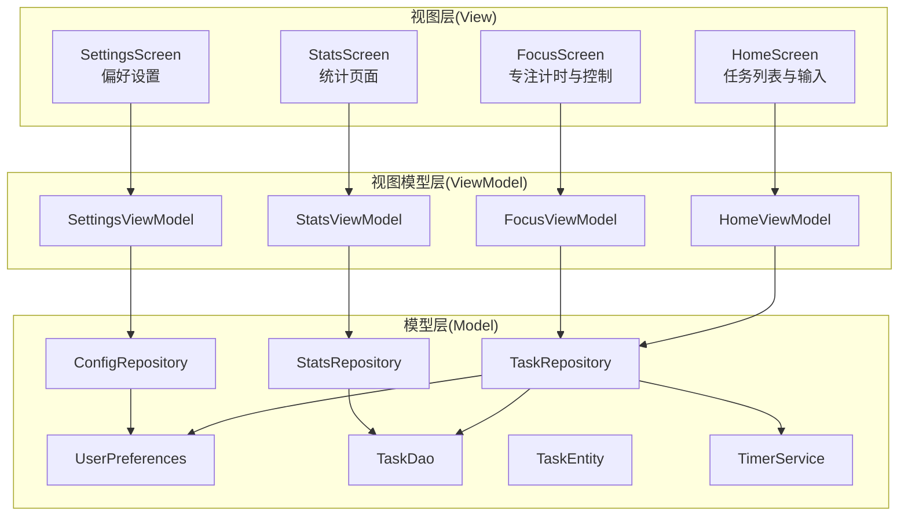
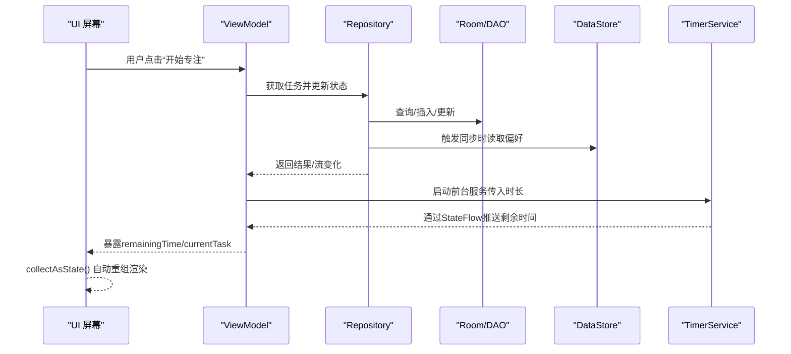
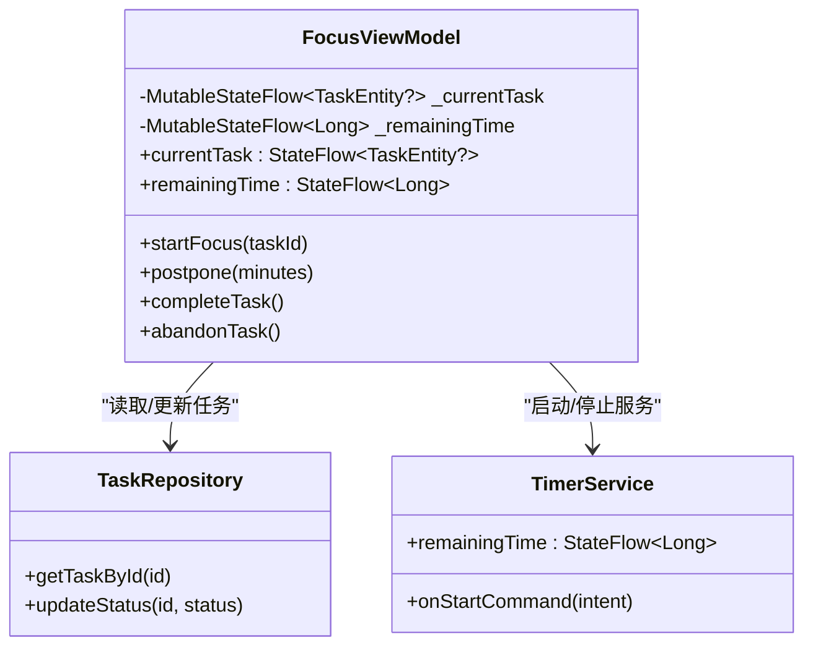
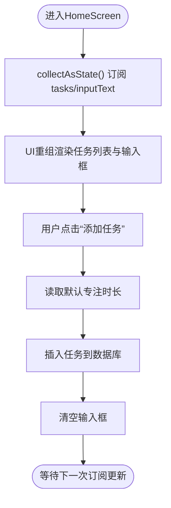
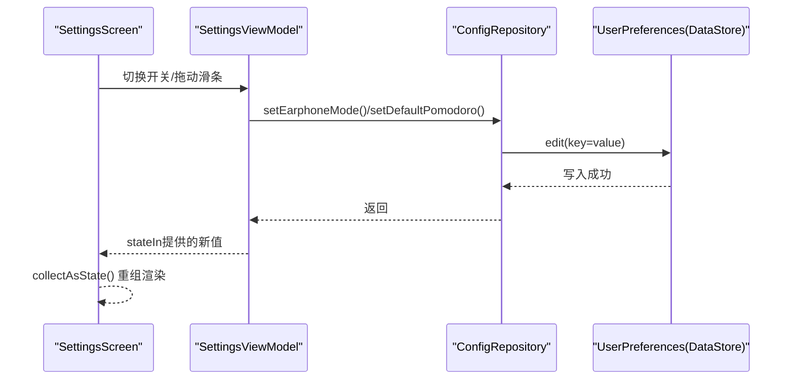
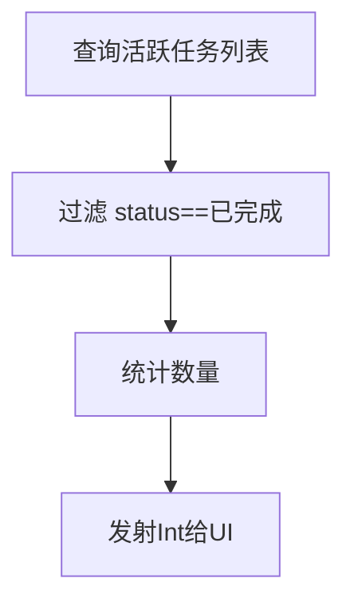
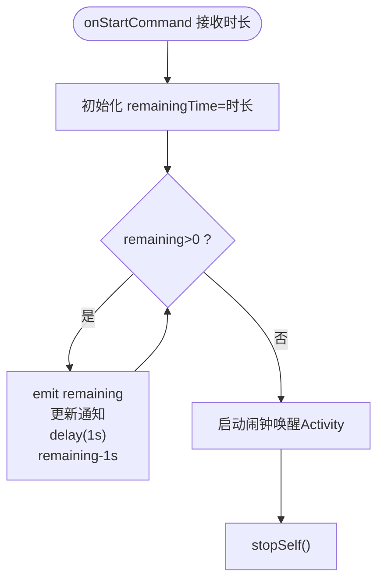
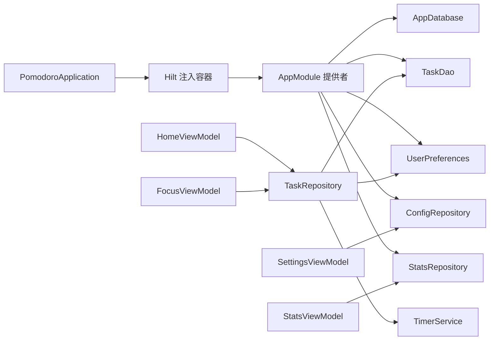

# MVVM架构模式

<cite>
**本文引用的文件**
- [FocusViewModel.kt](file://app/src/main/java/com/pomodoroalert/ui/viewmodel/FocusViewModel.kt)
- [HomeViewModel.kt](file://app/src/main/java/com/pomodoroalert/ui/viewmodel/HomeViewModel.kt)
- [SettingsViewModel.kt](file://app/src/main/java/com/pomodoroalert/ui/viewmodel/SettingsViewModel.kt)
- [StatsViewModel.kt](file://app/src/main/java/com/pomodoroalert/ui/viewmodel/StatsViewModel.kt)
- [TaskRepository.kt](file://app/src/main/java/com/pomodoroalert/data/TaskRepository.kt)
- [ConfigRepository.kt](file://app/src/main/java/com/pomodoroalert/data/ConfigRepository.kt)
- [StatsRepository.kt](file://app/src/main/java/com/pomodoroalert/data/StatsRepository.kt)
- [AppModule.kt](file://app/src/main/java/com/pomodoroalert/di/AppModule.kt)
- [UserPreferences.kt](file://app/src/main/java/com/pomodoroalert/data/UserPreferences.kt)
- [TaskEntity.kt](file://app/src/main/java/com/pomodoroalert/data/TaskEntity.kt)
- [TaskDao.kt](file://app/src/main/java/com/pomodoroalert/data/TaskDao.kt)
- [HomeScreen.kt](file://app/src/main/java/com/pomodoroalert/ui/screens/HomeScreen.kt)
- [FocusScreen.kt](file://app/src/main/java/com/pomodoroalert/ui/screens/FocusScreen.kt)
- [SettingsScreen.kt](file://app/src/main/java/com/pomodoroalert/ui/screens/SettingsScreen.kt)
- [StatsScreen.kt](file://app/src/main/java/com/pomodoroalert/ui/screens/StatsScreen.kt)
- [TimerService.kt](file://app/src/main/java/com/pomodoroalert/service/TimerService.kt)
- [PomodoroApplication.kt](file://app/src/main/java/com/pomodoroalert/PomodoroApplication.kt)
- [app/build.gradle.kts](file://app/build.gradle.kts)
</cite>

## 目录
1. [简介](#简介)
2. [项目结构](#项目结构)
3. [核心组件](#核心组件)
4. [架构总览](#架构总览)
5. [详细组件分析](#详细组件分析)
6. [依赖关系分析](#依赖关系分析)
7. [性能考量](#性能考量)
8. [故障排查指南](#故障排查指南)
9. [结论](#结论)
10. [附录](#附录)

## 简介
本文件系统性阐述PomodoroAlert应用的MVVM架构实现，重点覆盖以下方面：
- ViewModel生命周期与状态管理：如何通过viewModelScope管理协程生命周期，以及StateFlow/Flow驱动的状态流。
- 数据绑定与响应式更新：从Repository到ViewModel再到Compose UI的单向数据流。
- ViewModel作为View与Model之间的桥梁：封装业务逻辑、协调数据转换与持久化。
- 响应式编程实践：StateFlow、Flow、stateIn、SharingStarted等特性在实际场景中的应用。
- 完整流程示例：从用户交互到UI更新的端到端路径（如“开始专注”）。

## 项目结构
应用采用按功能模块划分的目录组织方式，MVVM各层分布如下：
- Model层：数据仓库与实体、DAO、数据库、偏好存储、网络接口。
- View层：Jetpack Compose屏幕与导航。
- ViewModel层：负责状态暴露、业务编排与协程调度。
- DI层：Hilt模块提供依赖注入与作用域管理。

图表来源
- [HomeScreen.kt](file://app/src/main/java/com/pomodoroalert/ui/screens/HomeScreen.kt)
- [FocusScreen.kt](file://app/src/main/java/com/pomodoroalert/ui/screens/FocusScreen.kt)
- [SettingsScreen.kt](file://app/src/main/java/com/pomodoroalert/ui/screens/SettingsScreen.kt)
- [StatsScreen.kt](file://app/src/main/java/com/pomodoroalert/ui/screens/StatsScreen.kt)
- [HomeViewModel.kt](file://app/src/main/java/com/pomodoroalert/ui/viewmodel/HomeViewModel.kt)
- [FocusViewModel.kt](file://app/src/main/java/com/pomodoroalert/ui/viewmodel/FocusViewModel.kt)
- [SettingsViewModel.kt](file://app/src/main/java/com/pomodoroalert/ui/viewmodel/SettingsViewModel.kt)
- [StatsViewModel.kt](file://app/src/main/java/com/pomodoroalert/ui/viewmodel/StatsViewModel.kt)
- [TaskRepository.kt](file://app/src/main/java/com/pomodoroalert/data/TaskRepository.kt)
- [ConfigRepository.kt](file://app/src/main/java/com/pomodoroalert/data/ConfigRepository.kt)
- [StatsRepository.kt](file://app/src/main/java/com/pomodoroalert/data/StatsRepository.kt)
- [UserPreferences.kt](file://app/src/main/java/com/pomodoroalert/data/UserPreferences.kt)
- [TaskDao.kt](file://app/src/main/java/com/pomodoroalert/data/TaskDao.kt)
- [TaskEntity.kt](file://app/src/main/java/com/pomodoroalert/data/TaskEntity.kt)
- [TimerService.kt](file://app/src/main/java/com/pomodoroalert/service/TimerService.kt)

章节来源
- [HomeScreen.kt](file://app/src/main/java/com/pomodoroalert/ui/screens/HomeScreen.kt)
- [FocusScreen.kt](file://app/src/main/java/com/pomodoroalert/ui/screens/FocusScreen.kt)
- [SettingsScreen.kt](file://app/src/main/java/com/pomodoroalert/ui/screens/SettingsScreen.kt)
- [StatsScreen.kt](file://app/src/main/java/com/pomodoroalert/ui/screens/StatsScreen.kt)
- [HomeViewModel.kt](file://app/src/main/java/com/pomodoroalert/ui/viewmodel/HomeViewModel.kt)
- [FocusViewModel.kt](file://app/src/main/java/com/pomodoroalert/ui/viewmodel/FocusViewModel.kt)
- [SettingsViewModel.kt](file://app/src/main/java/com/pomodoroalert/ui/viewmodel/SettingsViewModel.kt)
- [StatsViewModel.kt](file://app/src/main/java/com/pomodoroalert/ui/viewmodel/StatsViewModel.kt)
- [TaskRepository.kt](file://app/src/main/java/com/pomodoroalert/data/TaskRepository.kt)
- [ConfigRepository.kt](file://app/src/main/java/com/pomodoroalert/data/ConfigRepository.kt)
- [StatsRepository.kt](file://app/src/main/java/com/pomodoroalert/data/StatsRepository.kt)
- [UserPreferences.kt](file://app/src/main/java/com/pomodoroalert/data/UserPreferences.kt)
- [TaskDao.kt](file://app/src/main/java/com/pomodoroalert/data/TaskDao.kt)
- [TaskEntity.kt](file://app/src/main/java/com/pomodoroalert/data/TaskEntity.kt)
- [TimerService.kt](file://app/src/main/java/com/pomodoroalert/service/TimerService.kt)

## 核心组件
- ViewModel层
  - HomeViewModel：维护任务列表与输入框文本状态，初始化时订阅活跃任务流，支持新增任务。
  - FocusViewModel：维护当前任务与剩余时间状态，负责启动/停止前台服务、处理推迟与完成/放弃操作。
  - SettingsViewModel：暴露配置项状态（耳机模式、默认专注时长），提供修改接口。
  - StatsViewModel：暴露统计数据（今日完成任务数、今日完成番茄数）。
- Repository层
  - TaskRepository：封装DAO与偏好访问，负责插入、更新状态、触发同步与离线重试。
  - ConfigRepository：包装UserPreferences，提供配置读取与写入。
  - StatsRepository：基于TaskDao计算统计指标。
- Model层
  - TaskEntity：Room实体，定义任务字段与默认同步状态。
  - TaskDao：Room DAO，提供查询、插入、更新、同步状态查询等接口。
  - UserPreferences：DataStore封装，提供布尔、整型、字符串键值的Flow读写。
- Service层
  - TimerService：前台服务，内部使用StateFlow驱动倒计时与通知更新，时间到后唤醒闹钟界面。

章节来源
- [HomeViewModel.kt](file://app/src/main/java/com/pomodoroalert/ui/viewmodel/HomeViewModel.kt)
- [FocusViewModel.kt](file://app/src/main/java/com/pomodoroalert/ui/viewmodel/FocusViewModel.kt)
- [SettingsViewModel.kt](file://app/src/main/java/com/pomodoroalert/ui/viewmodel/SettingsViewModel.kt)
- [StatsViewModel.kt](file://app/src/main/java/com/pomodoroalert/ui/viewmodel/StatsViewModel.kt)
- [TaskRepository.kt](file://app/src/main/java/com/pomodoroalert/data/TaskRepository.kt)
- [ConfigRepository.kt](file://app/src/main/java/com/pomodoroalert/data/ConfigRepository.kt)
- [StatsRepository.kt](file://app/src/main/java/com/pomodoroalert/data/StatsRepository.kt)
- [TaskEntity.kt](file://app/src/main/java/com/pomodoroalert/data/TaskEntity.kt)
- [TaskDao.kt](file://app/src/main/java/com/pomodoroalert/data/TaskDao.kt)
- [UserPreferences.kt](file://app/src/main/java/com/pomodoroalert/data/UserPreferences.kt)
- [TimerService.kt](file://app/src/main/java/com/pomodoroalert/service/TimerService.kt)

## 架构总览
MVVM在本应用中的落地要点：
- 单向数据流：UI只订阅状态，不直接调用Repository；事件由UI发起，经由ViewModel处理，再由Repository与数据库/网络交互。
- 响应式状态：ViewModel以StateFlow暴露状态，UI通过collectAsState收集并在重组时自动刷新。
- 生命周期安全：使用viewModelScope确保协程随ViewModel销毁而取消，避免内存泄漏。
- 依赖注入：通过Hilt在各层注入依赖，降低耦合度。

图表来源
- [FocusScreen.kt](file://app/src/main/java/com/pomodoroalert/ui/screens/FocusScreen.kt)
- [FocusViewModel.kt](file://app/src/main/java/com/pomodoroalert/ui/viewmodel/FocusViewModel.kt)
- [TaskRepository.kt](file://app/src/main/java/com/pomodoroalert/data/TaskRepository.kt)
- [TimerService.kt](file://app/src/main/java/com/pomodoroalert/service/TimerService.kt)

## 详细组件分析

### FocusViewModel：专注流程与状态管理
- 状态设计
  - currentTask：当前专注任务，用于显示任务名与状态切换。
  - remainingTime：毫秒级剩余时间，供UI格式化显示。
- 关键行为
  - startFocus：根据任务ID加载任务、初始化剩余时间、启动前台服务。
  - postpone：基于minutes参数计算新时长，设置精确闹钟，更新剩余时间。
  - completeTask/abandonTask：更新任务状态、停止服务、清空当前任务。
- 生命周期与协程
  - 使用viewModelScope.launch保证协程随ViewModel销毁而取消。
  - 通过MutableStateFlow保护可变状态，对外暴露StateFlow确保不可变读取。

图表来源
- [FocusViewModel.kt](file://app/src/main/java/com/pomodoroalert/ui/viewmodel/FocusViewModel.kt)
- [TaskRepository.kt](file://app/src/main/java/com/pomodoroalert/data/TaskRepository.kt)
- [TimerService.kt](file://app/src/main/java/com/pomodoroalert/service/TimerService.kt)

章节来源
- [FocusViewModel.kt](file://app/src/main/java/com/pomodoroalert/ui/viewmodel/FocusViewModel.kt)
- [FocusScreen.kt](file://app/src/main/java/com/pomodoroalert/ui/screens/FocusScreen.kt)
- [TimerService.kt](file://app/src/main/java/com/pomodoroalert/service/TimerService.kt)

### HomeViewModel：任务列表与输入状态
- 状态设计
  - tasks：活跃任务列表，由Repository提供的Flow驱动。
  - inputText：输入框文本，支持双向绑定式更新。
- 初始化与更新
  - init块中订阅activeTasks流，实时更新UI。
  - addTask：读取默认专注时长，构造TaskEntity并插入数据库，清空输入框。

图表来源
- [HomeScreen.kt](file://app/src/main/java/com/pomodoroalert/ui/screens/HomeScreen.kt)
- [HomeViewModel.kt](file://app/src/main/java/com/pomodoroalert/ui/viewmodel/HomeViewModel.kt)
- [ConfigRepository.kt](file://app/src/main/java/com/pomodoroalert/data/ConfigRepository.kt)

章节来源
- [HomeViewModel.kt](file://app/src/main/java/com/pomodoroalert/ui/viewmodel/HomeViewModel.kt)
- [HomeScreen.kt](file://app/src/main/java/com/pomodoroalert/ui/screens/HomeScreen.kt)
- [ConfigRepository.kt](file://app/src/main/java/com/pomodoroalert/data/ConfigRepository.kt)

### SettingsViewModel：配置项状态与修改
- 状态设计
  - earphoneMode：耳机模式开关，使用stateIn在订阅时提供默认值。
  - defaultPomodoro：默认专注时长，使用stateIn提供默认值与共享策略。
- 修改接口
  - setEarphoneMode/setDefaultPomodoro：通过ConfigRepository写入UserPreferences。

图表来源
- [SettingsScreen.kt](file://app/src/main/java/com/pomodoroalert/ui/screens/SettingsScreen.kt)
- [SettingsViewModel.kt](file://app/src/main/java/com/pomodoroalert/ui/viewmodel/SettingsViewModel.kt)
- [ConfigRepository.kt](file://app/src/main/java/com/pomodoroalert/data/ConfigRepository.kt)
- [UserPreferences.kt](file://app/src/main/java/com/pomodoroalert/data/UserPreferences.kt)

章节来源
- [SettingsViewModel.kt](file://app/src/main/java/com/pomodoroalert/ui/viewmodel/SettingsViewModel.kt)
- [SettingsScreen.kt](file://app/src/main/java/com/pomodoroalert/ui/screens/SettingsScreen.kt)
- [ConfigRepository.kt](file://app/src/main/java/com/pomodoroalert/data/ConfigRepository.kt)
- [UserPreferences.kt](file://app/src/main/java/com/pomodoroalert/data/UserPreferences.kt)

### StatsViewModel：统计指标
- 统计逻辑
  - completedTasks：统计status为“已完成”的任务数量。
  - completedPomodoros：当前版本等价于completedTasks。
- 数据来源
  - 基于TaskDao的activeTasks流映射计算。

图表来源
- [StatsViewModel.kt](file://app/src/main/java/com/pomodoroalert/ui/viewmodel/StatsViewModel.kt)
- [StatsRepository.kt](file://app/src/main/java/com/pomodoroalert/data/StatsRepository.kt)
- [TaskDao.kt](file://app/src/main/java/com/pomodoroalert/data/TaskDao.kt)

章节来源
- [StatsViewModel.kt](file://app/src/main/java/com/pomodoroalert/ui/viewmodel/StatsViewModel.kt)
- [StatsRepository.kt](file://app/src/main/java/com/pomodoroalert/data/StatsRepository.kt)
- [TaskDao.kt](file://app/src/main/java/com/pomodoroalert/data/TaskDao.kt)

### TimerService：后台计时与通知
- 状态与通知
  - remainingTime：服务内部StateFlow，每秒更新一次。
  - 前台服务通知：显示剩余秒数，点击跳转主界面。
- 行为流程
  - 接收启动命令携带时长，启动倒计时循环，逐秒emit新值并更新通知。
  - 倒计时结束触发闹钟唤醒Activity并停止服务。

图表来源
- [TimerService.kt](file://app/src/main/java/com/pomodoroalert/service/TimerService.kt)

章节来源
- [TimerService.kt](file://app/src/main/java/com/pomodoroalert/service/TimerService.kt)

## 依赖关系分析
- 依赖注入
  - AppModule提供数据库、DAO、UserPreferences、仓库与日历管理器的单例实例。
  - Hilt在Application级别启用，ViewModel通过注解自动注入依赖。
- 外部库
  - Hilt、Room、DataStore、WorkManager、Retrofit、Navigation Compose、Coroutines等。

图表来源
- [PomodoroApplication.kt](file://app/src/main/java/com/pomodoroalert/PomodoroApplication.kt)
- [AppModule.kt](file://app/src/main/java/com/pomodoroalert/di/AppModule.kt)
- [HomeViewModel.kt](file://app/src/main/java/com/pomodoroalert/ui/viewmodel/HomeViewModel.kt)
- [FocusViewModel.kt](file://app/src/main/java/com/pomodoroalert/ui/viewmodel/FocusViewModel.kt)
- [SettingsViewModel.kt](file://app/src/main/java/com/pomodoroalert/ui/viewmodel/SettingsViewModel.kt)
- [StatsViewModel.kt](file://app/src/main/java/com/pomodoroalert/ui/viewmodel/StatsViewModel.kt)
- [TaskRepository.kt](file://app/src/main/java/com/pomodoroalert/data/TaskRepository.kt)
- [ConfigRepository.kt](file://app/src/main/java/com/pomodoroalert/data/ConfigRepository.kt)
- [StatsRepository.kt](file://app/src/main/java/com/pomodoroalert/data/StatsRepository.kt)
- [UserPreferences.kt](file://app/src/main/java/com/pomodoroalert/data/UserPreferences.kt)
- [TaskDao.kt](file://app/src/main/java/com/pomodoroalert/data/TaskDao.kt)

章节来源
- [AppModule.kt](file://app/src/main/java/com/pomodoroalert/di/AppModule.kt)
- [PomodoroApplication.kt](file://app/src/main/java/com/pomodoroalert/PomodoroApplication.kt)
- [app/build.gradle.kts](file://app/build.gradle.kts)

## 性能考量
- 协程与作用域
  - 使用viewModelScope确保协程随ViewModel销毁而取消，避免泄漏。
  - 避免在长时间任务中阻塞主线程，必要时使用Dispatchers.IO或后台调度器。
- 流与状态共享
  - 使用stateIn与SharingStarted.WhileSubscribed控制上游流的订阅时机与共享策略，减少不必要的重复计算。
- 数据库存取
  - Room DAO返回Flow，避免手动轮询；使用事务与批量操作减少IO开销。
- 前台服务
  - TimerService使用前台通知，避免被系统回收；注意通知更新频率，避免过度唤醒。

## 故障排查指南
- 状态未更新
  - 检查ViewModel是否通过MutableStateFlow写入，UI是否使用collectAsState收集。
  - 确认init块或LaunchedEffect中是否正确订阅了Repository的Flow。
- 任务状态不同步
  - 检查TaskRepository的updateStatus是否触发了同步逻辑与WorkManager重试。
  - 确认网络请求与DataStore写入的异常分支是否正确标记为“Sync_Pending”并调度重试。
- 前台服务未启动
  - 确认startForegroundService调用条件与通知渠道创建。
  - 检查TimerService的onStartCommand是否接收到了正确的时长参数。
- 配置项不生效
  - 确认UserPreferences的edit操作已执行且stateIn提供了默认值。
  - 检查DataStore读写是否在同一线程或协程上下文中进行。

章节来源
- [FocusViewModel.kt](file://app/src/main/java/com/pomodoroalert/ui/viewmodel/FocusViewModel.kt)
- [TaskRepository.kt](file://app/src/main/java/com/pomodoroalert/data/TaskRepository.kt)
- [TimerService.kt](file://app/src/main/java/com/pomodoroalert/service/TimerService.kt)
- [SettingsViewModel.kt](file://app/src/main/java/com/pomodoroalert/ui/viewmodel/SettingsViewModel.kt)
- [UserPreferences.kt](file://app/src/main/java/com/pomodoroalert/data/UserPreferences.kt)

## 结论
本应用以清晰的MVVM分层实现了响应式状态管理与业务编排：
- ViewModel通过StateFlow/Flow暴露状态，UI以声明式方式订阅并渲染。
- Repository封装数据源与业务规则，屏蔽UI与底层实现细节。
- Hilt提供稳定的依赖注入，配合协程与Room/DataStore形成高效的数据流闭环。
- 建议持续优化状态共享策略与错误恢复路径，进一步提升稳定性与用户体验。

## 附录
- 最佳实践
  - 使用stateIn为远程/异步状态提供默认值与共享策略。
  - 将UI交互转化为ViewModel的函数调用，避免直接操作Repository。
  - 在ViewModel中统一处理业务规则与副作用，保持UI轻量。
- 常见陷阱
  - 不要直接在UI中订阅Repository的Flow，应通过ViewModel中转。
  - 避免在协程中持有过长生命周期的对象引用，防止内存泄漏。
  - 对于需要立即可见的配置项，优先使用stateIn提供默认值，减少闪烁。