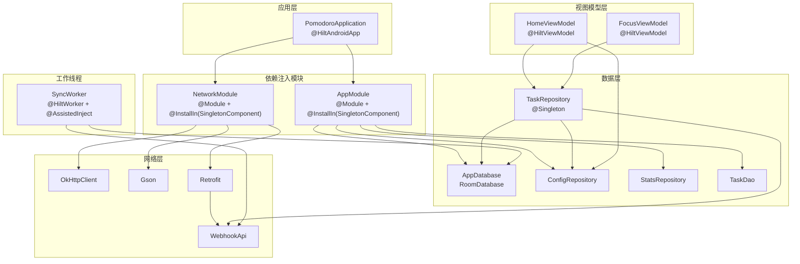
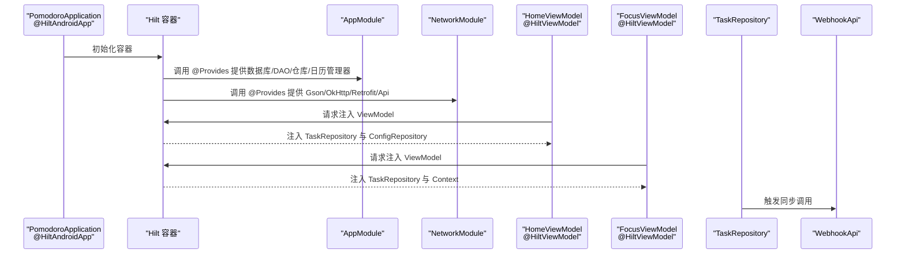
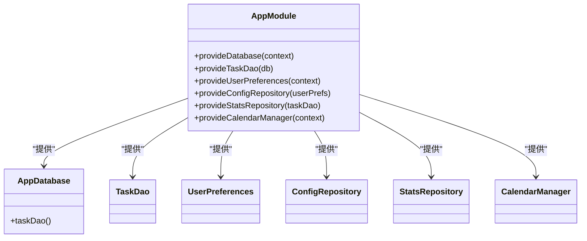
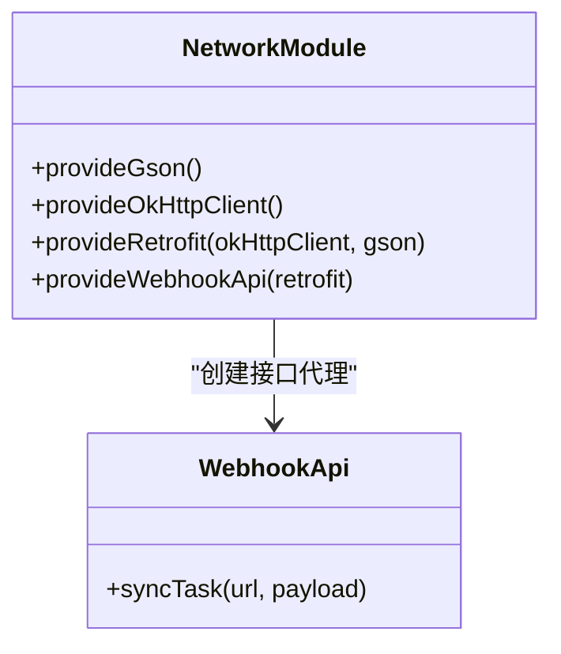
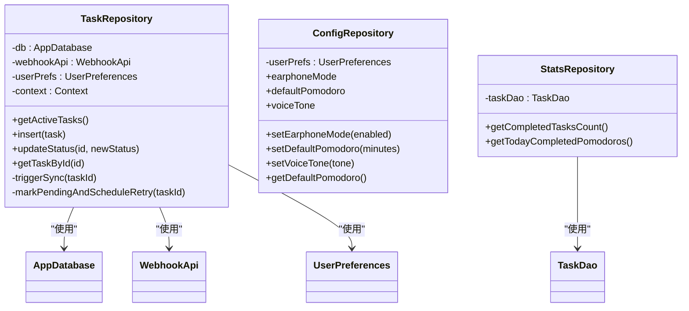
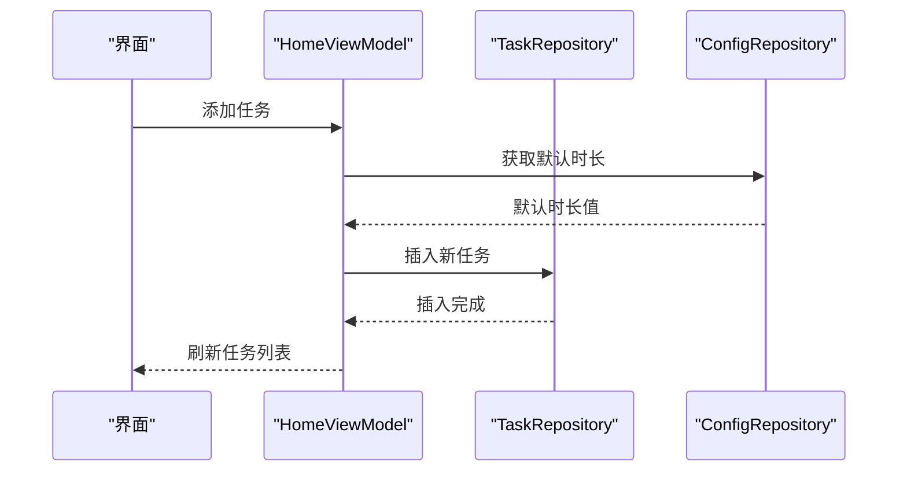
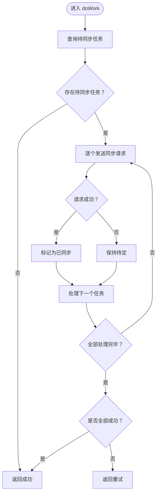
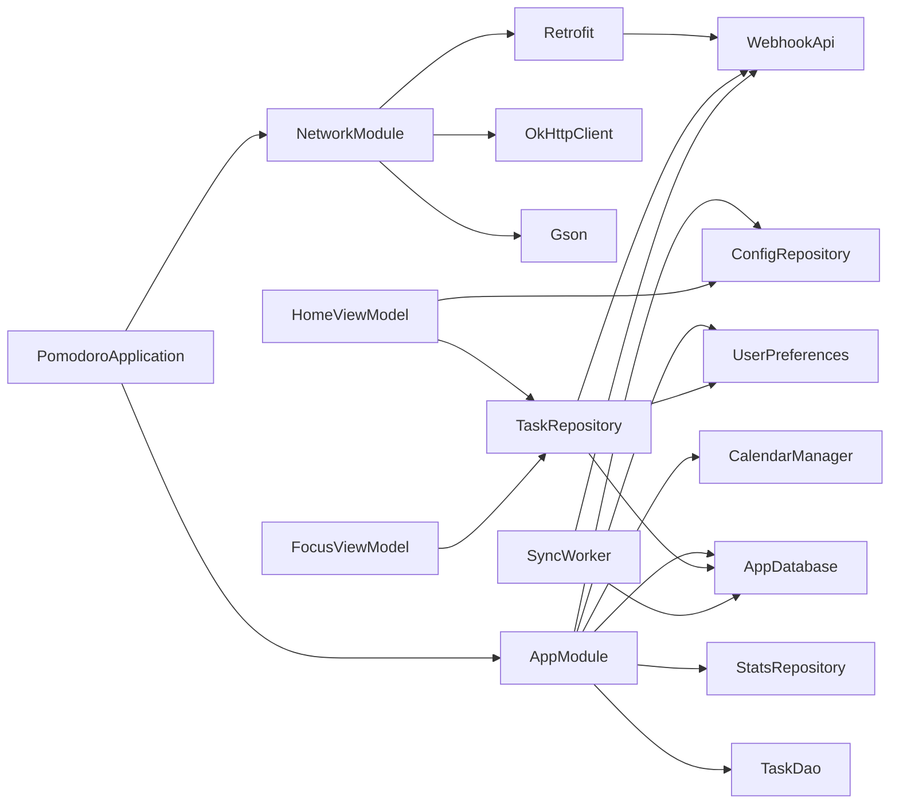

# 依赖注入设计

<cite>
**本文引用的文件**
- [PomodoroApplication.kt](file://app/src/main/java/com/pomodoroalert/PomodoroApplication.kt)
- [AppModule.kt](file://app/src/main/java/com/pomodoroalert/di/AppModule.kt)
- [NetworkModule.kt](file://app/src/main/java/com/pomodoroalert/di/NetworkModule.kt)
- [AppDatabase.kt](file://app/src/main/java/com/pomodoroalert/data/AppDatabase.kt)
- [TaskRepository.kt](file://app/src/main/java/com/pomodoroalert/data/TaskRepository.kt)
- [ConfigRepository.kt](file://app/src/main/java/com/pomodoroalert/data/ConfigRepository.kt)
- [StatsRepository.kt](file://app/src/main/java/com/pomodoroalert/data/StatsRepository.kt)
- [WebhookApi.kt](file://app/src/main/java/com/pomodoroalert/network/WebhookApi.kt)
- [HomeViewModel.kt](file://app/src/main/java/com/pomodoroalert/ui/viewmodel/HomeViewModel.kt)
- [FocusViewModel.kt](file://app/src/main/java/com/pomodoroalert/ui/viewmodel/FocusViewModel.kt)
- [SyncWorker.kt](file://app/src/main/java/com/pomodoroalert/worker/SyncWorker.kt)
- [CalendarManager.kt](file://app/src/main/java/com/pomodoroalert/voice/CalendarManager.kt)
- [app/build.gradle.kts](file://app/build.gradle.kts)
- [build.gradle.kts](file://build.gradle.kts)
- [settings.gradle.kts](file://settings.gradle.kts)
</cite>

## 目录
1. [简介](#简介)
2. [项目结构](#项目结构)
3. [核心组件](#核心组件)
4. [架构总览](#架构总览)
5. [详细组件分析](#详细组件分析)
6. [依赖关系分析](#依赖关系分析)
7. [性能考虑](#性能考虑)
8. [故障排查指南](#故障排查指南)
9. [结论](#结论)
10. [附录](#附录)

## 简介
本文件系统性阐述 PomodoroAlert 应用的依赖注入设计，基于 Hilt 框架在应用层、网络层与工作线程中的配置与使用。重点覆盖以下方面：
- Hilt 注解与模块化配置：@Module、@Provides、@InstallIn、@Singleton、@HiltAndroidApp、@HiltViewModel、@HiltWorker、@AssistedInject 等。
- 应用级依赖注入：数据库（Room）、网络服务（Retrofit+OkHttp+Gson）、仓库类（TaskRepository、ConfigRepository、StatsRepository）的注入方式与作用域管理。
- 依赖注入如何简化对象创建与管理，提升可测试性与可维护性。
- 具体注入配置示例与最佳实践、性能优化建议。

## 项目结构
应用采用按功能分层与按职责划分的目录组织方式，依赖注入相关的关键位置如下：
- 应用入口与 Hilt 启动：PomodoroApplication.kt
- 依赖注入模块：di/AppModule.kt、di/NetworkModule.kt
- 数据层：data/AppDatabase.kt、data/*.kt（仓库与实体）
- 网络层：network/WebhookApi.kt
- 视图模型层：ui/viewmodel/*.kt
- 工作线程：worker/SyncWorker.kt
- 构建脚本：app/build.gradle.kts、build.gradle.kts、settings.gradle.kts

**图表来源**
- [PomodoroApplication.kt:1-8](file://app/src/main/java/com/pomodoroalert/PomodoroApplication.kt#L1-L8)
- [AppModule.kt:1-61](file://app/src/main/java/com/pomodoroalert/di/AppModule.kt#L1-L61)
- [NetworkModule.kt:1-53](file://app/src/main/java/com/pomodoroalert/di/NetworkModule.kt#L1-L53)
- [AppDatabase.kt:1-10](file://app/src/main/java/com/pomodoroalert/data/AppDatabase.kt#L1-L10)
- [TaskRepository.kt:1-101](file://app/src/main/java/com/pomodoroalert/data/TaskRepository.kt#L1-L101)
- [ConfigRepository.kt:1-19](file://app/src/main/java/com/pomodoroalert/data/ConfigRepository.kt#L1-L19)
- [StatsRepository.kt:1-18](file://app/src/main/java/com/pomodoroalert/data/StatsRepository.kt#L1-L18)
- [WebhookApi.kt:1-16](file://app/src/main/java/com/pomodoroalert/network/WebhookApi.kt#L1-L16)
- [HomeViewModel.kt:1-53](file://app/src/main/java/com/pomodoroalert/ui/viewmodel/HomeViewModel.kt#L1-L53)
- [FocusViewModel.kt:1-85](file://app/src/main/java/com/pomodoroalert/ui/viewmodel/FocusViewModel.kt#L1-L85)
- [SyncWorker.kt:1-78](file://app/src/main/java/com/pomodoroalert/worker/SyncWorker.kt#L1-L78)

**章节来源**
- [PomodoroApplication.kt:1-8](file://app/src/main/java/com/pomodoroalert/PomodoroApplication.kt#L1-L8)
- [AppModule.kt:1-61](file://app/src/main/java/com/pomodoroalert/di/AppModule.kt#L1-L61)
- [NetworkModule.kt:1-53](file://app/src/main/java/com/pomodoroalert/di/NetworkModule.kt#L1-L53)
- [AppDatabase.kt:1-10](file://app/src/main/java/com/pomodoroalert/data/AppDatabase.kt#L1-L10)
- [TaskRepository.kt:1-101](file://app/src/main/java/com/pomodoroalert/data/TaskRepository.kt#L1-L101)
- [ConfigRepository.kt:1-19](file://app/src/main/java/com/pomodoroalert/data/ConfigRepository.kt#L1-L19)
- [StatsRepository.kt:1-18](file://app/src/main/java/com/pomodoroalert/data/StatsRepository.kt#L1-L18)
- [WebhookApi.kt:1-16](file://app/src/main/java/com/pomodoroalert/network/WebhookApi.kt#L1-L16)
- [HomeViewModel.kt:1-53](file://app/src/main/java/com/pomodoroalert/ui/viewmodel/HomeViewModel.kt#L1-L53)
- [FocusViewModel.kt:1-85](file://app/src/main/java/com/pomodoroalert/ui/viewmodel/FocusViewModel.kt#L1-L85)
- [SyncWorker.kt:1-78](file://app/src/main/java/com/pomodoroalert/worker/SyncWorker.kt#L1-L78)

## 核心组件
- 应用启动与 Hilt 容器初始化：通过在 Application 上使用 @HiltAndroidApp 注解，启用 Hilt 的编译时生成与运行时容器。
- 应用模块（AppModule）：集中提供数据库、DAO、用户偏好、配置仓库、统计仓库与日历管理器等依赖，并以 @Singleton 限定作用域。
- 网络模块（NetworkModule）：集中提供 Gson、OkHttpClient、Retrofit 与 WebhookApi 接口，统一网络栈配置与作用域。
- 仓库层：TaskRepository 负责任务增删改查、状态变更触发同步；ConfigRepository 提供用户偏好读取与写入；StatsRepository 提供统计数据计算。
- 视图模型层：HomeViewModel 与 FocusViewModel 使用 @HiltViewModel 注入仓库与上下文，负责业务交互与状态管理。
- 工作线程：SyncWorker 使用 @HiltWorker 与 @AssistedInject 注入数据库、网络接口与用户偏好，执行离线重试同步。

**章节来源**
- [PomodoroApplication.kt:1-8](file://app/src/main/java/com/pomodoroalert/PomodoroApplication.kt#L1-L8)
- [AppModule.kt:19-60](file://app/src/main/java/com/pomodoroalert/di/AppModule.kt#L19-L60)
- [NetworkModule.kt:16-52](file://app/src/main/java/com/pomodoroalert/di/NetworkModule.kt#L16-L52)
- [TaskRepository.kt:19-25](file://app/src/main/java/com/pomodoroalert/data/TaskRepository.kt#L19-L25)
- [ConfigRepository.kt:7-18](file://app/src/main/java/com/pomodoroalert/data/ConfigRepository.kt#L7-L18)
- [StatsRepository.kt:6-17](file://app/src/main/java/com/pomodoroalert/data/StatsRepository.kt#L6-L17)
- [HomeViewModel.kt:15-19](file://app/src/main/java/com/pomodoroalert/ui/viewmodel/HomeViewModel.kt#L15-L19)
- [FocusViewModel.kt:21-25](file://app/src/main/java/com/pomodoroalert/ui/viewmodel/FocusViewModel.kt#L21-L25)
- [SyncWorker.kt:15-22](file://app/src/main/java/com/pomodoroalert/worker/SyncWorker.kt#L15-L22)

## 架构总览
下图展示了 Hilt 在应用中的装配流程与组件交互：

**图表来源**
- [PomodoroApplication.kt:6](file://app/src/main/java/com/pomodoroalert/PomodoroApplication.kt#L6)
- [AppModule.kt:23-59](file://app/src/main/java/com/pomodoroalert/di/AppModule.kt#L23-L59)
- [NetworkModule.kt:20-51](file://app/src/main/java/com/pomodoroalert/di/NetworkModule.kt#L20-L51)
- [HomeViewModel.kt:16-19](file://app/src/main/java/com/pomodoroalert/ui/viewmodel/HomeViewModel.kt#L16-L19)
- [FocusViewModel.kt:22-25](file://app/src/main/java/com/pomodoroalert/ui/viewmodel/FocusViewModel.kt#L22-L25)
- [TaskRepository.kt:20-25](file://app/src/main/java/com/pomodoroalert/data/TaskRepository.kt#L20-L25)
- [WebhookApi.kt:9-15](file://app/src/main/java/com/pomodoroalert/network/WebhookApi.kt#L9-L15)

## 详细组件分析

### 应用模块（AppModule）与单例作用域
- 数据库与 DAO：通过 @Provides 返回 Room 数据库实例与 DAO，均标注 @Singleton，确保全局唯一。
- 用户偏好与仓库：UserPreferences、ConfigRepository、StatsRepository 由 @Provides 提供，同样置于 Singleton 作用域。
- 日历管理器：CalendarManager 作为工具类，通过 @Provides 提供，用于从系统日历拉取事件并转换为任务实体。

**图表来源**
- [AppModule.kt:23-59](file://app/src/main/java/com/pomodoroalert/di/AppModule.kt#L23-L59)
- [AppDatabase.kt:6-9](file://app/src/main/java/com/pomodoroalert/data/AppDatabase.kt#L6-L9)

**章节来源**
- [AppModule.kt:23-59](file://app/src/main/java/com/pomodoroalert/di/AppModule.kt#L23-L59)
- [AppDatabase.kt:6-9](file://app/src/main/java/com/pomodoroalert/data/AppDatabase.kt#L6-L9)

### 网络模块（NetworkModule）与 Retrofit 配置
- Gson：默认 GsonBuilder 创建实例，统一序列化/反序列化行为。
- OkHttpClient：设置连接、读写超时，保证网络稳定性。
- Retrofit：以固定基础 URL 初始化，结合 Gson 转换器；最终通过 @Provides 创建 WebhookApi 接口代理。
- WebhookApi：定义同步接口，支持动态 @Url 注入目标地址。

**图表来源**
- [NetworkModule.kt:20-51](file://app/src/main/java/com/pomodoroalert/di/NetworkModule.kt#L20-L51)
- [WebhookApi.kt:9-15](file://app/src/main/java/com/pomodoroalert/network/WebhookApi.kt#L9-L15)

**章节来源**
- [NetworkModule.kt:20-51](file://app/src/main/java/com/pomodoroalert/di/NetworkModule.kt#L20-L51)
- [WebhookApi.kt:9-15](file://app/src/main/java/com/pomodoroalert/network/WebhookApi.kt#L9-L15)

### 仓库层（TaskRepository、ConfigRepository、StatsRepository）
- TaskRepository：持有 AppDatabase、WebhookApi、UserPreferences 与 ApplicationContext；负责任务查询、插入、状态更新与触发同步；当任务状态变为“已完成/已放弃/推迟”时，构造 WebhookPayload 并调用 WebhookApi；若失败则标记为“同步待定”，并通过 WorkManager 安排 SyncWorker 重试。
- ConfigRepository：封装 UserPreferences 的流式读取与写入操作，向 ViewModel 提供配置项。
- StatsRepository：基于 TaskDao 计算完成任务数量与当日番茄钟数。

**图表来源**
- [TaskRepository.kt:20-94](file://app/src/main/java/com/pomodoroalert/data/TaskRepository.kt#L20-L94)
- [ConfigRepository.kt:7-18](file://app/src/main/java/com/pomodoroalert/data/ConfigRepository.kt#L7-L18)
- [StatsRepository.kt:6-17](file://app/src/main/java/com/pomodoroalert/data/StatsRepository.kt#L6-L17)

**章节来源**
- [TaskRepository.kt:20-94](file://app/src/main/java/com/pomodoroalert/data/TaskRepository.kt#L20-L94)
- [ConfigRepository.kt:7-18](file://app/src/main/java/com/pomodoroalert/data/ConfigRepository.kt#L7-L18)
- [StatsRepository.kt:6-17](file://app/src/main/java/com/pomodoroalert/data/StatsRepository.kt#L6-L17)

### 视图模型层（HomeViewModel、FocusViewModel）
- HomeViewModel：注入 TaskRepository 与 ConfigRepository，订阅活跃任务流并在添加任务时读取默认时长。
- FocusViewModel：注入 ApplicationContext 与 TaskRepository，负责启动/暂停/完成/放弃任务流程，并与系统 AlarmManager、TimerService 协作。

**图表来源**
- [HomeViewModel.kt:16-51](file://app/src/main/java/com/pomodoroalert/ui/viewmodel/HomeViewModel.kt#L16-L51)
- [TaskRepository.kt:30](file://app/src/main/java/com/pomodoroalert/data/TaskRepository.kt#L30)
- [ConfigRepository.kt:17](file://app/src/main/java/com/pomodoroalert/data/ConfigRepository.kt#L17)

**章节来源**
- [HomeViewModel.kt:16-51](file://app/src/main/java/com/pomodoroalert/ui/viewmodel/HomeViewModel.kt#L16-L51)
- [FocusViewModel.kt:22-83](file://app/src/main/java/com/pomodoroalert/ui/viewmodel/FocusViewModel.kt#L22-L83)

### 工作线程（SyncWorker）
- 使用 @HiltWorker 与 @AssistedInject 注入数据库、网络接口与用户偏好。
- 执行周期：遍历“同步待定”的任务，构造 WebhookPayload 并调用 WebhookApi；成功则标记为“已同步”，否则返回重试。

**图表来源**
- [SyncWorker.kt:24-71](file://app/src/main/java/com/pomodoroalert/worker/SyncWorker.kt#L24-L71)

**章节来源**
- [SyncWorker.kt:15-78](file://app/src/main/java/com/pomodoroalert/worker/SyncWorker.kt#L15-L78)

### 日历管理器（CalendarManager）
- 通过 ContentResolver 查询当日日历事件，转换为任务实体列表，供上层使用（例如语音/日历导入场景）。

**章节来源**
- [CalendarManager.kt:10-65](file://app/src/main/java/com/pomodoroalert/voice/CalendarManager.kt#L10-L65)

## 依赖关系分析
- 组件耦合与内聚：AppModule 与 NetworkModule 将外部依赖集中提供，降低上层对具体实现的耦合；仓库层封装数据访问与业务逻辑，提升内聚。
- 作用域管理：所有 @Provides 方法均标注 @Singleton，确保数据库、网络客户端、仓库与工具类在应用生命周期内唯一，避免重复创建带来的资源浪费。
- 外部依赖集成：Room、Retrofit、OkHttp、WorkManager、AndroidX Hilt 扩展等通过 Gradle 依赖引入并在模块中装配。

**图表来源**
- [PomodoroApplication.kt:6](file://app/src/main/java/com/pomodoroalert/PomodoroApplication.kt#L6)
- [AppModule.kt:23-59](file://app/src/main/java/com/pomodoroalert/di/AppModule.kt#L23-L59)
- [NetworkModule.kt:20-51](file://app/src/main/java/com/pomodoroalert/di/NetworkModule.kt#L20-L51)
- [TaskRepository.kt:20-25](file://app/src/main/java/com/pomodoroalert/data/TaskRepository.kt#L20-L25)
- [HomeViewModel.kt:16-19](file://app/src/main/java/com/pomodoroalert/ui/viewmodel/HomeViewModel.kt#L16-L19)
- [FocusViewModel.kt:22-25](file://app/src/main/java/com/pomodoroalert/ui/viewmodel/FocusViewModel.kt#L22-L25)
- [SyncWorker.kt:15-22](file://app/src/main/java/com/pomodoroalert/worker/SyncWorker.kt#L15-L22)

**章节来源**
- [app/build.gradle.kts:60-64](file://app/build.gradle.kts#L60-L64)
- [build.gradle.kts:1-9](file://build.gradle.kts#L1-L9)
- [settings.gradle.kts:1-18](file://settings.gradle.kts#L1-L18)

## 性能考虑
- 单例作用域：数据库、网络客户端与仓库均使用 @Singleton，减少重复初始化开销，提升启动与运行效率。
- 网络超时配置：OkHttpClient 设置连接/读/写超时，避免阻塞与资源占用。
- 异步与协程：仓库与工作线程使用协程与 IO 调度器，避免阻塞主线程。
- 离线重试：通过 WorkManager 与 SyncWorker 实现失败重试，提升可靠性与用户体验。
- 依赖注入的可测试性：通过 @AssistedInject 与 @HiltWorker，可在测试中替换依赖并注入假实现，便于单元测试与集成测试。

## 故障排查指南
- Hilt 未生效：确认 Application 上已使用 @HiltAndroidApp 注解。
- 缺少绑定：检查对应依赖是否已在 AppModule 或 NetworkModule 中提供。
- 网络异常：检查 OkHttpClient 超时配置与 WebhookApi 的 baseUrl 与 @Url 参数。
- 同步失败：查看 TaskRepository 的状态更新与 SyncWorker 的重试逻辑。
- 单例冲突：确认 @Provides 方法均标注 @Singleton，避免重复创建。

**章节来源**
- [PomodoroApplication.kt:6](file://app/src/main/java/com/pomodoroalert/PomodoroApplication.kt#L6)
- [AppModule.kt:23-59](file://app/src/main/java/com/pomodoroalert/di/AppModule.kt#L23-L59)
- [NetworkModule.kt:28-44](file://app/src/main/java/com/pomodoroalert/di/NetworkModule.kt#L28-L44)
- [TaskRepository.kt:68-79](file://app/src/main/java/com/pomodoroalert/data/TaskRepository.kt#L68-L79)
- [SyncWorker.kt:57-71](file://app/src/main/java/com/pomodoroalert/worker/SyncWorker.kt#L57-L71)

## 结论
本项目通过 Hilt 实现了清晰、可维护且高性能的依赖注入体系：
- 应用模块与网络模块集中提供关键依赖，统一作用域与生命周期。
- 仓库层封装业务逻辑，视图模型与工作线程通过注入获得所需能力。
- 单例模式与协程配合，兼顾性能与可靠性。
- 依赖注入显著提升了代码的可测试性与可维护性，建议在后续扩展中继续遵循该模式。

## 附录
- 构建与插件：应用启用了 Hilt、KSP、Compose 与 WorkManager 相关插件与依赖，确保编译期生成与运行时注入。
- 版本与仓库：根构建脚本与 settings 文件配置了统一的仓库与插件版本管理。

**章节来源**
- [app/build.gradle.kts:1-81](file://app/build.gradle.kts#L1-L81)
- [build.gradle.kts:1-9](file://build.gradle.kts#L1-L9)
- [settings.gradle.kts:1-18](file://settings.gradle.kts#L1-L18)