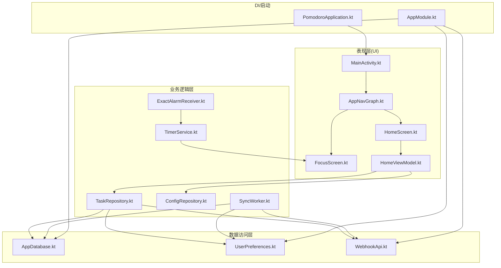
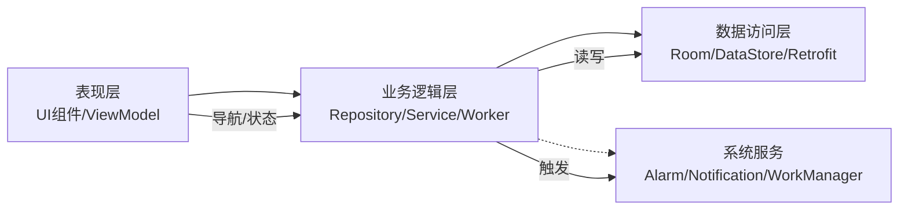
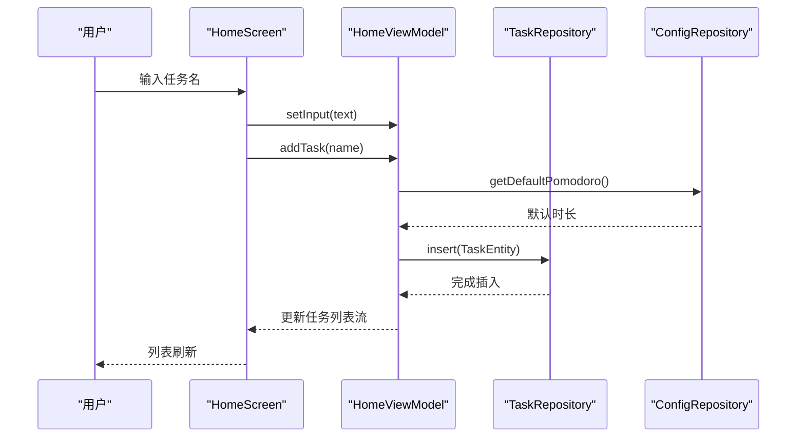
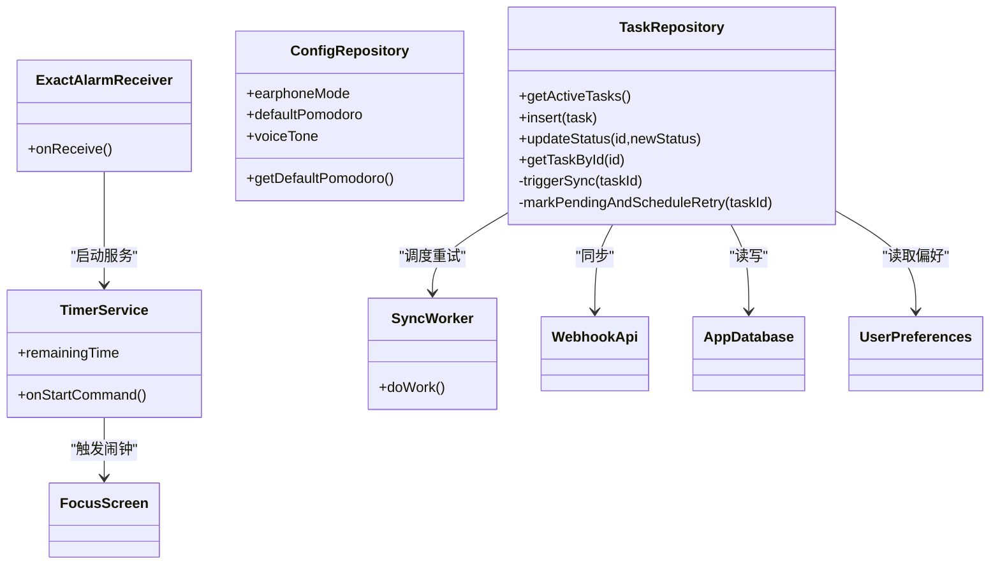
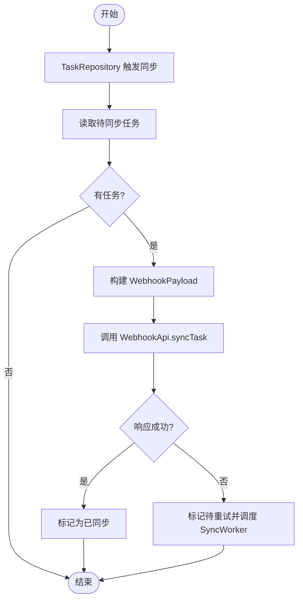
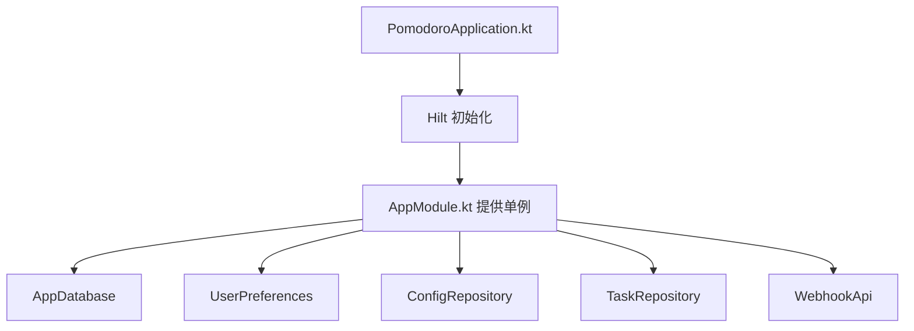
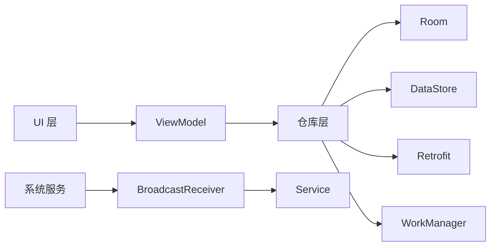

# 分层架构组织

<cite>
**本文引用的文件**
- [MainActivity.kt](file://app/src/main/java/com/pomodoroalert/MainActivity.kt)
- [PomodoroApplication.kt](file://app/src/main/java/com/pomodoroalert/PomodoroApplication.kt)
- [AppNavGraph.kt](file://app/src/main/java/com/pomodoroalert/ui/AppNavGraph.kt)
- [HomeScreen.kt](file://app/src/main/java/com/pomodoroalert/ui/screens/HomeScreen.kt)
- [FocusScreen.kt](file://app/src/main/java/com/pomodoroalert/ui/screens/FocusScreen.kt)
- [HomeViewModel.kt](file://app/src/main/java/com/pomodoroalert/ui/viewmodel/HomeViewModel.kt)
- [AppModule.kt](file://app/src/main/java/com/pomodoroalert/di/AppModule.kt)
- [AppDatabase.kt](file://app/src/main/java/com/pomodoroalert/data/AppDatabase.kt)
- [TaskRepository.kt](file://app/src/main/java/com/pomodoroalert/data/TaskRepository.kt)
- [ConfigRepository.kt](file://app/src/main/java/com/pomodoroalert/data/ConfigRepository.kt)
- [UserPreferences.kt](file://app/src/main/java/com/pomodoroalert/data/UserPreferences.kt)
- [WebhookApi.kt](file://app/src/main/java/com/pomodoroalert/network/WebhookApi.kt)
- [SyncWorker.kt](file://app/src/main/java/com/pomodoroalert/worker/SyncWorker.kt)
- [TimerService.kt](file://app/src/main/java/com/pomodoroalert/service/TimerService.kt)
- [ExactAlarmReceiver.kt](file://app/src/main/java/com/pomodoroalert/receiver/ExactAlarmReceiver.kt)
</cite>

## 目录
1. [引言](#引言)
2. [项目结构](#项目结构)
3. [核心组件](#核心组件)
4. [架构总览](#架构总览)
5. [详细组件分析](#详细组件分析)
6. [依赖分析](#依赖分析)
7. [性能考量](#性能考量)
8. [故障排查指南](#故障排查指南)
9. [结论](#结论)
10. [附录](#附录)

## 引言
本文件系统性梳理 PomodoroAlert 应用的分层架构设计与实现，围绕表现层（UI 层）、业务逻辑层、数据访问层进行职责划分与边界定义，并阐明各层之间的交互关系与数据流向。文档同时给出层间接口定义、依赖倒置原则的应用示例、典型调用链路图与错误处理策略，帮助读者快速理解从用户界面到数据存储的完整流程。

## 项目结构
应用采用按功能域分层的目录组织方式：
- 表现层（UI 层）：Compose UI 组件与 ViewModel，负责用户交互与状态展示
- 业务逻辑层：Repository 与 Worker/Service 等协调器，封装业务规则与跨模块编排
- 数据访问层：Room 数据库、DataStore 配置、网络 Webhook 接口
- 基础设施层：广播接收器、前台服务、工作调度等系统集成

图表来源
- [MainActivity.kt:11-22](file://app/src/main/java/com/pomodoroalert/MainActivity.kt#L11-L22)
- [AppNavGraph.kt:13-24](file://app/src/main/java/com/pomodoroalert/ui/AppNavGraph.kt#L13-L24)
- [HomeScreen.kt:48-203](file://app/src/main/java/com/pomodoroalert/ui/screens/HomeScreen.kt#L48-L203)
- [FocusScreen.kt:16-68](file://app/src/main/java/com/pomodoroalert/ui/screens/FocusScreen.kt#L16-L68)
- [HomeViewModel.kt:15-52](file://app/src/main/java/com/pomodoroalert/ui/viewmodel/HomeViewModel.kt#L15-L52)
- [TaskRepository.kt:19-100](file://app/src/main/java/com/pomodoroalert/data/TaskRepository.kt#L19-L100)
- [ConfigRepository.kt:7-18](file://app/src/main/java/com/pomodoroalert/data/ConfigRepository.kt#L7-L18)
- [AppModule.kt:19-60](file://app/src/main/java/com/pomodoroalert/di/AppModule.kt#L19-L60)
- [AppDatabase.kt:6-9](file://app/src/main/java/com/pomodoroalert/data/AppDatabase.kt#L6-L9)
- [UserPreferences.kt:15-35](file://app/src/main/java/com/pomodoroalert/data/UserPreferences.kt#L15-L35)
- [WebhookApi.kt:9-15](file://app/src/main/java/com/pomodoroalert/network/WebhookApi.kt#L9-L15)
- [SyncWorker.kt:15-77](file://app/src/main/java/com/pomodoroalert/worker/SyncWorker.kt#L15-L77)
- [TimerService.kt:24-102](file://app/src/main/java/com/pomodoroalert/service/TimerService.kt#L24-L102)
- [ExactAlarmReceiver.kt:13-47](file://app/src/main/java/com/pomodoroalert/receiver/ExactAlarmReceiver.kt#L13-L47)

章节来源
- [MainActivity.kt:11-22](file://app/src/main/java/com/pomodoroalert/MainActivity.kt#L11-L22)
- [PomodoroApplication.kt:6-7](file://app/src/main/java/com/pomodoroalert/PomodoroApplication.kt#L6-L7)
- [AppNavGraph.kt:13-24](file://app/src/main/java/com/pomodoroalert/ui/AppNavGraph.kt#L13-L24)

## 核心组件
- 表现层（UI 层）
  - MainActivity：应用入口，承载 Compose 主题与导航根节点
  - AppNavGraph：声明式导航，路由到 Home/Focus/Stats/Settings
  - HomeScreen：任务列表与输入控件，绑定 HomeViewModel
  - FocusScreen：专注计时面板，读取 ViewModel 的剩余时间与当前任务
  - HomeViewModel：持有任务流与输入状态，协调仓库与配置仓库

- 业务逻辑层
  - TaskRepository：封装数据库操作、状态变更、同步触发与重试调度
  - ConfigRepository：封装用户偏好读写与默认配置查询
  - SyncWorker：后台轮询待同步任务并调用 Webhook 同步
  - TimerService：前台服务驱动计时与通知更新，到期触发闹钟
  - ExactAlarmReceiver：系统闹钟广播接收器，唤醒设备并启动服务

- 数据访问层
  - AppDatabase：Room 数据库入口，暴露 TaskDao
  - UserPreferences：DataStore 封装，提供偏好键值流
  - WebhookApi：Retrofit 接口，统一同步端点

- DI/启动
  - AppModule：提供数据库、DAO、仓库、偏好、日历管理器等单例
  - PomodoroApplication：Hilt 应用入口注解

章节来源
- [HomeScreen.kt:48-203](file://app/src/main/java/com/pomodoroalert/ui/screens/HomeScreen.kt#L48-L203)
- [FocusScreen.kt:16-68](file://app/src/main/java/com/pomodoroalert/ui/screens/FocusScreen.kt#L16-L68)
- [HomeViewModel.kt:15-52](file://app/src/main/java/com/pomodoroalert/ui/viewmodel/HomeViewModel.kt#L15-L52)
- [TaskRepository.kt:19-100](file://app/src/main/java/com/pomodoroalert/data/TaskRepository.kt#L19-L100)
- [ConfigRepository.kt:7-18](file://app/src/main/java/com/pomodoroalert/data/ConfigRepository.kt#L7-L18)
- [AppModule.kt:19-60](file://app/src/main/java/com/pomodoroalert/di/AppModule.kt#L19-L60)
- [AppDatabase.kt:6-9](file://app/src/main/java/com/pomodoroalert/data/AppDatabase.kt#L6-L9)
- [UserPreferences.kt:15-35](file://app/src/main/java/com/pomodoroalert/data/UserPreferences.kt#L15-L35)
- [WebhookApi.kt:9-15](file://app/src/main/java/com/pomodoroalert/network/WebhookApi.kt#L9-L15)
- [SyncWorker.kt:15-77](file://app/src/main/java/com/pomodoroalert/worker/SyncWorker.kt#L15-L77)
- [TimerService.kt:24-102](file://app/src/main/java/com/pomodoroalert/service/TimerService.kt#L24-L102)
- [ExactAlarmReceiver.kt:13-47](file://app/src/main/java/com/pomodoroalert/receiver/ExactAlarmReceiver.kt#L13-L47)

## 架构总览
分层架构以“关注点分离”为核心目标：
- 表现层仅负责渲染与用户交互，不直接访问数据库或网络
- 业务逻辑层封装业务规则与跨模块编排，作为仓库与系统服务的协调者
- 数据访问层屏蔽持久化与网络细节，向上提供稳定的数据契约

图表来源
- [HomeScreen.kt:48-203](file://app/src/main/java/com/pomodoroalert/ui/screens/HomeScreen.kt#L48-L203)
- [FocusScreen.kt:16-68](file://app/src/main/java/com/pomodoroalert/ui/screens/FocusScreen.kt#L16-L68)
- [HomeViewModel.kt:15-52](file://app/src/main/java/com/pomodoroalert/ui/viewmodel/HomeViewModel.kt#L15-L52)
- [TaskRepository.kt:19-100](file://app/src/main/java/com/pomodoroalert/data/TaskRepository.kt#L19-L100)
- [AppModule.kt:19-60](file://app/src/main/java/com/pomodoroalert/di/AppModule.kt#L19-L60)
- [AppDatabase.kt:6-9](file://app/src/main/java/com/pomodoroalert/data/AppDatabase.kt#L6-L9)
- [UserPreferences.kt:15-35](file://app/src/main/java/com/pomodoroalert/data/UserPreferences.kt#L15-L35)
- [WebhookApi.kt:9-15](file://app/src/main/java/com/pomodoroalert/network/WebhookApi.kt#L9-L15)
- [SyncWorker.kt:15-77](file://app/src/main/java/com/pomodoroalert/worker/SyncWorker.kt#L15-L77)
- [TimerService.kt:24-102](file://app/src/main/java/com/pomodoroalert/service/TimerService.kt#L24-L102)
- [ExactAlarmReceiver.kt:13-47](file://app/src/main/java/com/pomodoroalert/receiver/ExactAlarmReceiver.kt#L13-L47)

## 详细组件分析

### 表现层（UI 层）
- 职责与边界
  - 负责 UI 渲染、事件收集与状态展示
  - 通过 ViewModel 获取数据流，避免直接依赖仓库或数据库
- 关键交互
  - HomeScreen 与 HomeViewModel 双向绑定输入与任务列表
  - FocusScreen 读取剩余时间与当前任务，触发完成/推迟/放弃等动作
- 设计原则
  - 单向数据流：ViewModel 暴露 StateFlow，UI 仅订阅
  - 依赖注入：使用 Hilt 提供的 ViewModel 与导航注入

图表来源
- [HomeScreen.kt:78-127](file://app/src/main/java/com/pomodoroalert/ui/screens/HomeScreen.kt#L78-L127)
- [HomeViewModel.kt:26-51](file://app/src/main/java/com/pomodoroalert/ui/viewmodel/HomeViewModel.kt#L26-L51)
- [ConfigRepository.kt:16-18](file://app/src/main/java/com/pomodoroalert/data/ConfigRepository.kt#L16-L18)
- [TaskRepository.kt:30-31](file://app/src/main/java/com/pomodoroalert/data/TaskRepository.kt#L30-L31)

章节来源
- [HomeScreen.kt:48-203](file://app/src/main/java/com/pomodoroalert/ui/screens/HomeScreen.kt#L48-L203)
- [FocusScreen.kt:16-68](file://app/src/main/java/com/pomodoroalert/ui/screens/FocusScreen.kt#L16-L68)
- [HomeViewModel.kt:15-52](file://app/src/main/java/com/pomodoroalert/ui/viewmodel/HomeViewModel.kt#L15-L52)

### 业务逻辑层（Repository/Service/Worker）
- 职责与边界
  - TaskRepository：封装任务 CRUD、状态变更、同步触发与重试调度
  - ConfigRepository：封装用户偏好读写与默认配置查询
  - SyncWorker：后台批量同步待同步任务
  - TimerService：前台服务驱动计时与通知更新
  - ExactAlarmReceiver：系统闹钟广播接收器，唤醒设备并启动服务
- 设计原则
  - 依赖倒置：UI 依赖抽象（仓库接口），仓库依赖具体实现（Room/DataStore/Retrofit）
  - 关注点分离：UI 不关心网络与数据库细节；仓库不关心 UI 与导航

图表来源
- [TaskRepository.kt:19-100](file://app/src/main/java/com/pomodoroalert/data/TaskRepository.kt#L19-L100)
- [ConfigRepository.kt:7-18](file://app/src/main/java/com/pomodoroalert/data/ConfigRepository.kt#L7-L18)
- [SyncWorker.kt:15-77](file://app/src/main/java/com/pomodoroalert/worker/SyncWorker.kt#L15-L77)
- [TimerService.kt:24-102](file://app/src/main/java/com/pomodoroalert/service/TimerService.kt#L24-L102)
- [ExactAlarmReceiver.kt:13-47](file://app/src/main/java/com/pomodoroalert/receiver/ExactAlarmReceiver.kt#L13-L47)

章节来源
- [TaskRepository.kt:19-100](file://app/src/main/java/com/pomodoroalert/data/TaskRepository.kt#L19-L100)
- [ConfigRepository.kt:7-18](file://app/src/main/java/com/pomodoroalert/data/ConfigRepository.kt#L7-L18)
- [SyncWorker.kt:15-77](file://app/src/main/java/com/pomodoroalert/worker/SyncWorker.kt#L15-L77)
- [TimerService.kt:24-102](file://app/src/main/java/com/pomodoroalert/service/TimerService.kt#L24-L102)
- [ExactAlarmReceiver.kt:13-47](file://app/src/main/java/com/pomodoroalert/receiver/ExactAlarmReceiver.kt#L13-L47)

### 数据访问层（Room/DataStore/Retrofit）
- 职责与边界
  - AppDatabase：暴露 TaskDao，提供实体与版本管理
  - UserPreferences：基于 DataStore 的键值流，提供偏好读写
  - WebhookApi：Retrofit 接口，统一同步端点
- 设计原则
  - 抽象隔离：上层只依赖接口与 Flow，不感知底层实现
  - 单一职责：数据库、偏好、网络分别由对应模块负责

图表来源
- [TaskRepository.kt:42-94](file://app/src/main/java/com/pomodoroalert/data/TaskRepository.kt#L42-L94)
- [WebhookApi.kt:9-15](file://app/src/main/java/com/pomodoroalert/network/WebhookApi.kt#L9-L15)
- [SyncWorker.kt:24-71](file://app/src/main/java/com/pomodoroalert/worker/SyncWorker.kt#L24-L71)

章节来源
- [AppDatabase.kt:6-9](file://app/src/main/java/com/pomodoroalert/data/AppDatabase.kt#L6-L9)
- [UserPreferences.kt:15-35](file://app/src/main/java/com/pomodoroalert/data/UserPreferences.kt#L15-L35)
- [WebhookApi.kt:9-15](file://app/src/main/java/com/pomodoroalert/network/WebhookApi.kt#L9-L15)

### 依赖注入与启动
- AppModule 提供数据库、DAO、仓库、偏好、日历管理器等单例
- Hilt 在应用与视图模型层面注入依赖，确保依赖倒置与可测试性

图表来源
- [PomodoroApplication.kt:6-7](file://app/src/main/java/com/pomodoroalert/PomodoroApplication.kt#L6-L7)
- [AppModule.kt:19-60](file://app/src/main/java/com/pomodoroalert/di/AppModule.kt#L19-L60)

章节来源
- [AppModule.kt:19-60](file://app/src/main/java/com/pomodoroalert/di/AppModule.kt#L19-L60)
- [PomodoroApplication.kt:6-7](file://app/src/main/java/com/pomodoroalert/PomodoroApplication.kt#L6-L7)

## 依赖分析
- 层间耦合
  - UI 仅依赖 ViewModel 抽象，不直接依赖仓库或数据库
  - 仓库依赖 DAO、DataStore、Retrofit 等具体实现
  - 工作调度与系统服务通过广播与前台服务解耦
- 外部依赖
  - Room：本地持久化
  - DataStore：轻量配置存储
  - Retrofit：网络同步
  - WorkManager：后台重试
  - AlarmManager/Notification：系统级提醒

图表来源
- [HomeViewModel.kt:15-52](file://app/src/main/java/com/pomodoroalert/ui/viewmodel/HomeViewModel.kt#L15-L52)
- [TaskRepository.kt:19-100](file://app/src/main/java/com/pomodoroalert/data/TaskRepository.kt#L19-L100)
- [AppModule.kt:19-60](file://app/src/main/java/com/pomodoroalert/di/AppModule.kt#L19-L60)
- [SyncWorker.kt:15-77](file://app/src/main/java/com/pomodoroalert/worker/SyncWorker.kt#L15-L77)
- [ExactAlarmReceiver.kt:13-47](file://app/src/main/java/com/pomodoroalert/receiver/ExactAlarmReceiver.kt#L13-L47)
- [TimerService.kt:24-102](file://app/src/main/java/com/pomodoroalert/service/TimerService.kt#L24-L102)

章节来源
- [TaskRepository.kt:19-100](file://app/src/main/java/com/pomodoroalert/data/TaskRepository.kt#L19-L100)
- [AppModule.kt:19-60](file://app/src/main/java/com/pomodoroalert/di/AppModule.kt#L19-L60)

## 性能考量
- UI 流式渲染
  - 使用 StateFlow 驱动 Compose 渲染，避免不必要的重组
- 数据库与网络
  - 仓库层在 IO 线程执行数据库与网络操作，避免阻塞主线程
- 后台同步
  - 使用 WorkManager 进行带约束的重试，降低功耗与流量消耗
- 计时与通知
  - 前台服务持续更新通知，减少唤醒开销；闹钟广播短时持有唤醒锁

## 故障排查指南
- 同步失败
  - 现象：任务完成后未同步或状态停留在待同步
  - 排查：检查 Webhook 响应与异常分支；确认待同步任务集合；查看 WorkManager 重试策略
  - 参考路径
    - [TaskRepository.kt:68-94](file://app/src/main/java/com/pomodoroalert/data/TaskRepository.kt#L68-L94)
    - [SyncWorker.kt:57-71](file://app/src/main/java/com/pomodoroalert/worker/SyncWorker.kt#L57-L71)
- 闹钟不响
  - 现象：到达时间无提醒
  - 排查：确认广播接收器是否正确启动前台服务；检查通知渠道与全屏通知权限
  - 参考路径
    - [ExactAlarmReceiver.kt:14-47](file://app/src/main/java/com/pomodoroalert/receiver/ExactAlarmReceiver.kt#L14-L47)
    - [TimerService.kt:61-87](file://app/src/main/java/com/pomodoroalert/service/TimerService.kt#L61-L87)
- 配置不生效
  - 现象：默认时长或音色未按预期
  - 排查：确认 DataStore 键值是否存在；检查 ConfigRepository 的读取逻辑
  - 参考路径
    - [UserPreferences.kt:22-24](file://app/src/main/java/com/pomodoroalert/data/UserPreferences.kt#L22-L24)
    - [ConfigRepository.kt:8-10](file://app/src/main/java/com/pomodoroalert/data/ConfigRepository.kt#L8-L10)

章节来源
- [TaskRepository.kt:68-94](file://app/src/main/java/com/pomodoroalert/data/TaskRepository.kt#L68-L94)
- [SyncWorker.kt:57-71](file://app/src/main/java/com/pomodoroalert/worker/SyncWorker.kt#L57-L71)
- [ExactAlarmReceiver.kt:14-47](file://app/src/main/java/com/pomodoroalert/receiver/ExactAlarmReceiver.kt#L14-L47)
- [TimerService.kt:61-87](file://app/src/main/java/com/pomodoroalert/service/TimerService.kt#L61-L87)
- [UserPreferences.kt:22-24](file://app/src/main/java/com/pomodoroalert/data/UserPreferences.kt#L22-L24)
- [ConfigRepository.kt:8-10](file://app/src/main/java/com/pomodoroalert/data/ConfigRepository.kt#L8-L10)

## 结论
本应用通过清晰的分层架构实现了关注点分离：UI 层专注于交互与状态展示，业务逻辑层封装规则与编排，数据访问层屏蔽底层细节。配合依赖注入与系统服务，应用在可维护性、可扩展性与运行效率方面均得到提升。后续可在仓库接口抽象、网络超时与重试策略、以及 UI 状态持久化等方面进一步演进。

## 附录
- 层间接口定义（概要）
  - 仓库接口：由具体仓库实现，向上暴露领域操作（如 getActiveTasks、insert、updateStatus）
  - 数据契约：TaskEntity、WebhookPayload 等作为跨层传输对象
  - 系统契约：Alarm/Notification/WorkManager 的回调与约束
- 依赖倒置实践
  - UI 依赖 ViewModel 抽象
  - ViewModel 依赖仓库接口
  - 仓库依赖 DAO/DataStore/Retrofit 实现
  - 通过 Hilt 注入实现运行期装配