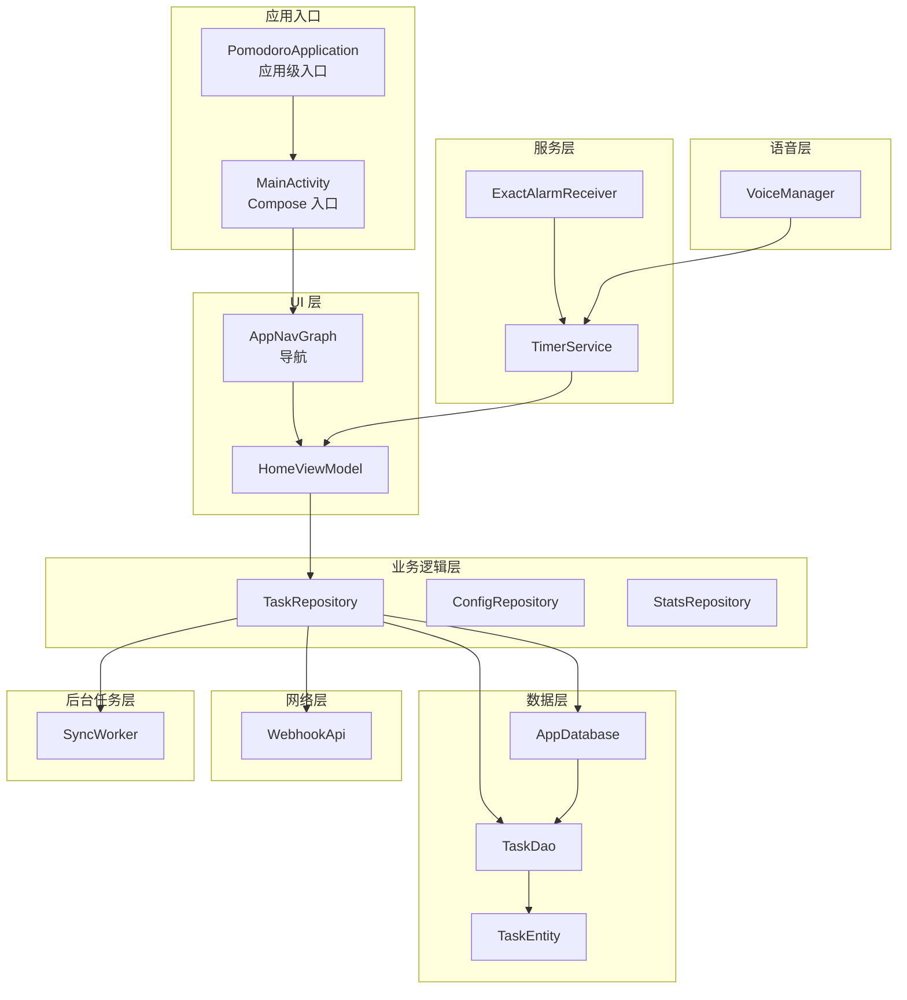
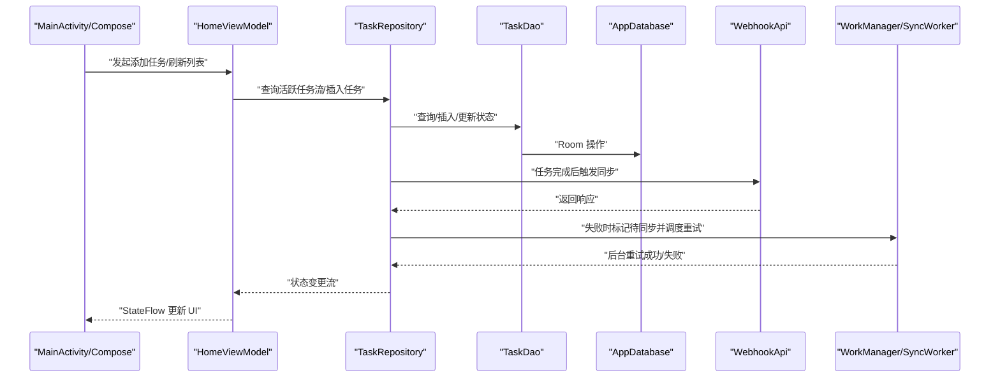
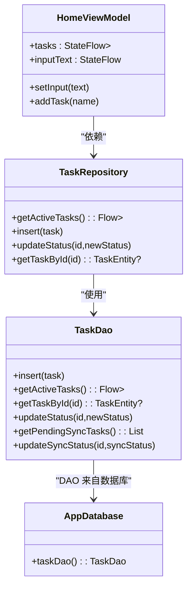
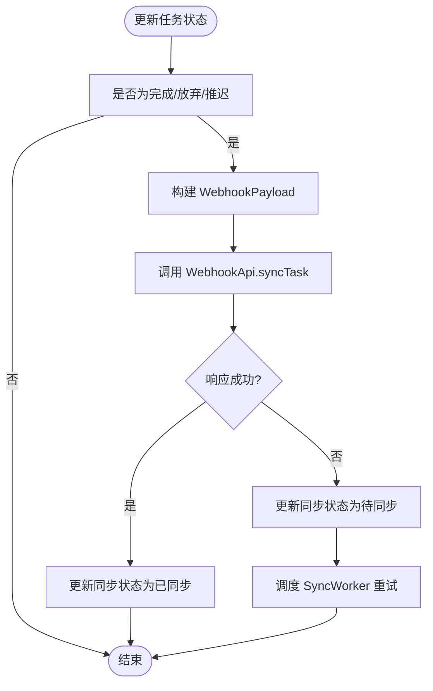
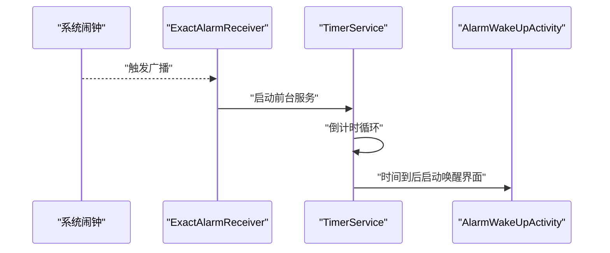
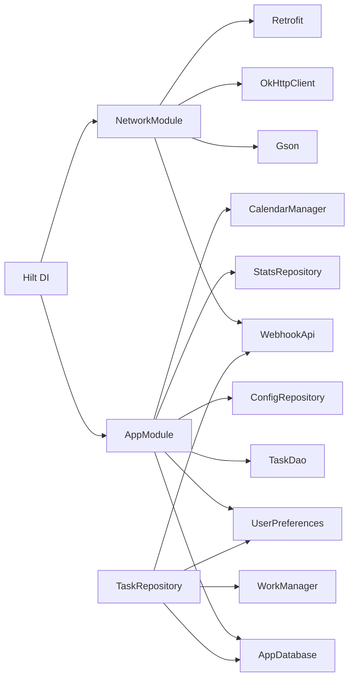

# 架构设计

<cite>
**本文引用的文件**
- [PomodoroApplication.kt](file://app/src/main/java/com/pomodoroalert/PomodoroApplication.kt)
- [MainActivity.kt](file://app/src/main/java/com/pomodoroalert/MainActivity.kt)
- [AppModule.kt](file://app/src/main/java/com/pomodoroalert/di/AppModule.kt)
- [NetworkModule.kt](file://app/src/main/java/com/pomodoroalert/di/NetworkModule.kt)
- [AppDatabase.kt](file://app/src/main/java/com/pomodoroalert/data/AppDatabase.kt)
- [TaskEntity.kt](file://app/src/main/java/com/pomodoroalert/data/TaskEntity.kt)
- [TaskDao.kt](file://app/src/main/java/com/pomodoroalert/data/TaskDao.kt)
- [TaskRepository.kt](file://app/src/main/java/com/pomodoroalert/data/TaskRepository.kt)
- [WebhookApi.kt](file://app/src/main/java/com/pomodoroalert/network/WebhookApi.kt)
- [TimerService.kt](file://app/src/main/java/com/pomodoroalert/service/TimerService.kt)
- [ExactAlarmReceiver.kt](file://app/src/main/java/com/pomodoroalert/receiver/ExactAlarmReceiver.kt)
- [SyncWorker.kt](file://app/src/main/java/com/pomodoroalert/worker/SyncWorker.kt)
- [VoiceManager.kt](file://app/src/main/java/com/pomodoroalert/voice/VoiceManager.kt)
- [HomeViewModel.kt](file://app/src/main/java/com/pomodoroalert/ui/viewmodel/HomeViewModel.kt)
- [app/build.gradle.kts](file://app/build.gradle.kts)
</cite>

## 目录
1. [引言](#引言)
2. [项目结构](#项目结构)
3. [核心组件](#核心组件)
4. [架构总览](#架构总览)
5. [详细组件分析](#详细组件分析)
6. [依赖分析](#依赖分析)
7. [性能考虑](#性能考虑)
8. [故障排查指南](#故障排查指南)
9. [结论](#结论)
10. [附录](#附录)

## 引言
本文件为 PomodoroAlert 应用的架构设计文档，系统性阐述应用采用的 MVVM 架构模式、依赖注入（Hilt）设计、分层架构组织与模块化职责边界。文档重点解释 UI 层、业务逻辑层、数据层之间的职责划分与交互关系，并对网络层、服务层、后台任务层、语音层等子系统进行深入剖析。同时给出依赖注入框架的配置与使用方式、架构决策的技术考量与权衡、架构演进历史背景以及未来扩展方向。

## 项目结构
应用采用按功能域分层的模块化组织方式，核心目录与职责如下：
- 数据层：Room 数据库、DAO、实体与仓库（Repository）
- 网络层：Retrofit 接口与 Webhook 调用
- 服务层：前台服务（计时服务）、广播接收器（精确闹钟）
- UI 层：Compose 导航与 ViewModel（MVVM）
- 语音层：TTS 语音管理
- 后台任务层：WorkManager 定时重试同步
- DI 层：Hilt 模块与安装范围

**图表来源**
- [PomodoroApplication.kt:1-8](file://app/src/main/java/com/pomodoroalert/PomodoroApplication.kt#L1-L8)
- [MainActivity.kt:1-24](file://app/src/main/java/com/pomodoroalert/MainActivity.kt#L1-L24)
- [AppModule.kt:1-61](file://app/src/main/java/com/pomodoroalert/di/AppModule.kt#L1-L61)
- [NetworkModule.kt:1-53](file://app/src/main/java/com/pomodoroalert/di/NetworkModule.kt#L1-L53)
- [AppDatabase.kt:1-10](file://app/src/main/java/com/pomodoroalert/data/AppDatabase.kt#L1-L10)
- [TaskDao.kt:1-29](file://app/src/main/java/com/pomodoroalert/data/TaskDao.kt#L1-L29)
- [TaskEntity.kt:1-19](file://app/src/main/java/com/pomodoroalert/data/TaskEntity.kt#L1-L19)
- [TaskRepository.kt:1-101](file://app/src/main/java/com/pomodoroalert/data/TaskRepository.kt#L1-L101)
- [WebhookApi.kt:1-16](file://app/src/main/java/com/pomodoroalert/network/WebhookApi.kt#L1-L16)
- [TimerService.kt:1-103](file://app/src/main/java/com/pomodoroalert/service/TimerService.kt#L1-L103)
- [ExactAlarmReceiver.kt:1-49](file://app/src/main/java/com/pomodoroalert/receiver/ExactAlarmReceiver.kt#L1-L49)
- [SyncWorker.kt:1-78](file://app/src/main/java/com/pomodoroalert/worker/SyncWorker.kt#L1-L78)
- [VoiceManager.kt:1-63](file://app/src/main/java/com/pomodoroalert/voice/VoiceManager.kt#L1-L63)
- [HomeViewModel.kt:1-53](file://app/src/main/java/com/pomodoroalert/ui/viewmodel/HomeViewModel.kt#L1-L53)

**章节来源**
- [app/build.gradle.kts:1-81](file://app/build.gradle.kts#L1-L81)

## 核心组件
- 应用入口与依赖注入
  - 应用级入口通过注解标记启用 Hilt；Activity 通过注解实现 Hilt 注入点。
  - DI 模块在单例范围内提供数据库、DAO、用户偏好、仓库与网络客户端。
- 数据层
  - Room 数据库定义实体与 DAO，仓库封装数据访问与状态转换。
- 网络层
  - Retrofit 提供 Webhook 接口，支持动态 URL 覆盖。
- 服务与广播
  - 前台服务负责倒计时与通知更新；广播接收器处理系统闹钟触发。
- 后台任务
  - WorkManager 在网络可用时重试未完成的同步任务。
- 语音层
  - TTS 管理音频焦点与播报流程。
- UI 层（MVVM）
  - ViewModel 通过仓库读取流式数据，驱动 Compose UI 更新。

**章节来源**
- [PomodoroApplication.kt:1-8](file://app/src/main/java/com/pomodoroalert/PomodoroApplication.kt#L1-L8)
- [MainActivity.kt:1-24](file://app/src/main/java/com/pomodoroalert/MainActivity.kt#L1-L24)
- [AppModule.kt:1-61](file://app/src/main/java/com/pomodoroalert/di/AppModule.kt#L1-L61)
- [NetworkModule.kt:1-53](file://app/src/main/java/com/pomodoroalert/di/NetworkModule.kt#L1-L53)
- [AppDatabase.kt:1-10](file://app/src/main/java/com/pomodoroalert/data/AppDatabase.kt#L1-L10)
- [TaskDao.kt:1-29](file://app/src/main/java/com/pomodoroalert/data/TaskDao.kt#L1-L29)
- [TaskEntity.kt:1-19](file://app/src/main/java/com/pomodoroalert/data/TaskEntity.kt#L1-L19)
- [TaskRepository.kt:1-101](file://app/src/main/java/com/pomodoroalert/data/TaskRepository.kt#L1-L101)
- [WebhookApi.kt:1-16](file://app/src/main/java/com/pomodoroalert/network/WebhookApi.kt#L1-L16)
- [TimerService.kt:1-103](file://app/src/main/java/com/pomodoroalert/service/TimerService.kt#L1-L103)
- [ExactAlarmReceiver.kt:1-49](file://app/src/main/java/com/pomodoroalert/receiver/ExactAlarmReceiver.kt#L1-L49)
- [SyncWorker.kt:1-78](file://app/src/main/java/com/pomodoroalert/worker/SyncWorker.kt#L1-L78)
- [VoiceManager.kt:1-63](file://app/src/main/java/com/pomodoroalert/voice/VoiceManager.kt#L1-L63)
- [HomeViewModel.kt:1-53](file://app/src/main/java/com/pomodoroalert/ui/viewmodel/HomeViewModel.kt#L1-L53)

## 架构总览
下图展示了从 UI 到数据与网络的端到端调用链路，体现 MVVM 与 Hilt 的协作关系：

**图表来源**
- [MainActivity.kt:1-24](file://app/src/main/java/com/pomodoroalert/MainActivity.kt#L1-L24)
- [HomeViewModel.kt:1-53](file://app/src/main/java/com/pomodoroalert/ui/viewmodel/HomeViewModel.kt#L1-L53)
- [TaskRepository.kt:1-101](file://app/src/main/java/com/pomodoroalert/data/TaskRepository.kt#L1-L101)
- [TaskDao.kt:1-29](file://app/src/main/java/com/pomodoroalert/data/TaskDao.kt#L1-L29)
- [AppDatabase.kt:1-10](file://app/src/main/java/com/pomodoroalert/data/AppDatabase.kt#L1-L10)
- [WebhookApi.kt:1-16](file://app/src/main/java/com/pomodoroalert/network/WebhookApi.kt#L1-L16)
- [SyncWorker.kt:1-78](file://app/src/main/java/com/pomodoroalert/worker/SyncWorker.kt#L1-L78)

## 详细组件分析

### MVVM 与 ViewModel 设计
- 角色分工
  - Model：TaskEntity、仓库（Repository）封装业务规则与数据源。
  - View：Compose Screen 与导航图，负责渲染与事件收集。
  - ViewModel：HomeViewModel 作为 UI 状态持有者，协调仓库与配置仓库。
- 数据流
  - 通过 StateFlow 暴露不可变状态，避免 UI 直接订阅仓库内部可变流。
  - 初始化时收集活跃任务流，实时更新 UI。
- 依赖注入
  - 使用 HiltViewModel 注解，构造函数注入仓库与配置仓库，便于测试替换。

**图表来源**
- [HomeViewModel.kt:1-53](file://app/src/main/java/com/pomodoroalert/ui/viewmodel/HomeViewModel.kt#L1-L53)
- [TaskRepository.kt:1-101](file://app/src/main/java/com/pomodoroalert/data/TaskRepository.kt#L1-L101)
- [TaskDao.kt:1-29](file://app/src/main/java/com/pomodoroalert/data/TaskDao.kt#L1-L29)
- [AppDatabase.kt:1-10](file://app/src/main/java/com/pomodoroalert/data/AppDatabase.kt#L1-L10)

**章节来源**
- [HomeViewModel.kt:1-53](file://app/src/main/java/com/pomodoroalert/ui/viewmodel/HomeViewModel.kt#L1-L53)

### 数据层与仓库模式
- 实体与表结构
  - TaskEntity 定义任务字段与默认值，包含主键、名称、持续时间、状态、创建时间、来源与同步状态。
- DAO 查询策略
  - 提供活跃任务流、按 ID 查询、状态更新、待同步任务查询与同步状态更新。
- 仓库职责
  - 组合 DAO、网络与偏好设置，统一对外暴露业务操作。
  - 在任务状态变为“已完成/已放弃/推迟”时触发同步；若失败则标记待同步并调度 WorkManager 重试。
  - 提供时间戳格式化工具方法。

**图表来源**
- [TaskRepository.kt:1-101](file://app/src/main/java/com/pomodoroalert/data/TaskRepository.kt#L1-L101)
- [WebhookApi.kt:1-16](file://app/src/main/java/com/pomodoroalert/network/WebhookApi.kt#L1-L16)
- [SyncWorker.kt:1-78](file://app/src/main/java/com/pomodoroalert/worker/SyncWorker.kt#L1-L78)

**章节来源**
- [TaskEntity.kt:1-19](file://app/src/main/java/com/pomodoroalert/data/TaskEntity.kt#L1-L19)
- [TaskDao.kt:1-29](file://app/src/main/java/com/pomodoroalert/data/TaskDao.kt#L1-L29)
- [TaskRepository.kt:1-101](file://app/src/main/java/com/pomodoroalert/data/TaskRepository.kt#L1-L101)

### 网络层与 Webhook 集成
- Retrofit 配置
  - 提供 Gson、OkHttpClient（超时配置）与 Retrofit 实例。
  - WebhookApi 支持动态 @Url 参数覆盖目标地址。
- 同步策略
  - 成功后更新本地同步状态；失败或异常则标记待同步并由 WorkManager 重试。
- 可扩展性
  - 基于 Retrofit 的模块化设计便于接入其他远程服务或增加认证中间件。

**章节来源**
- [NetworkModule.kt:1-53](file://app/src/main/java/com/pomodoroalert/di/NetworkModule.kt#L1-L53)
- [WebhookApi.kt:1-16](file://app/src/main/java/com/pomodoroalert/network/WebhookApi.kt#L1-L16)
- [TaskRepository.kt:1-101](file://app/src/main/java/com/pomodoroalert/data/TaskRepository.kt#L1-L101)

### 服务层与前台服务
- TimerService
  - 前台服务，发布通知并持续倒计时；时间到后启动闹钟唤醒 Activity。
  - 使用协程与状态流驱动 UI 更新。
- 广播接收器
  - 处理系统闹钟触发，启动前台服务并显示全屏通知，短暂保持唤醒锁。
- 交互流程
  - 广播接收器触发服务，服务执行倒计时并在结束时唤起 UI。

**图表来源**
- [ExactAlarmReceiver.kt:1-49](file://app/src/main/java/com/pomodoroalert/receiver/ExactAlarmReceiver.kt#L1-L49)
- [TimerService.kt:1-103](file://app/src/main/java/com/pomodoroalert/service/TimerService.kt#L1-L103)

**章节来源**
- [TimerService.kt:1-103](file://app/src/main/java/com/pomodoroalert/service/TimerService.kt#L1-L103)
- [ExactAlarmReceiver.kt:1-49](file://app/src/main/java/com/pomodoroalert/receiver/ExactAlarmReceiver.kt#L1-L49)

### 后台任务与离线重试
- SyncWorker
  - 扫描待同步任务，逐条调用 WebhookApi 同步；全部成功则标记为已同步，否则返回重试。
  - 与 WorkManager 结合，自动在网络可用时重试。
- 仓库侧触发
  - 仓库在状态变更时根据结果调度工作请求。

**章节来源**
- [SyncWorker.kt:1-78](file://app/src/main/java/com/pomodoroalert/worker/SyncWorker.kt#L1-L78)
- [TaskRepository.kt:1-101](file://app/src/main/java/com/pomodoroalert/data/TaskRepository.kt#L1-L101)

### 语音层与音频焦点
- VoiceManager
  - 初始化 TTS，请求临时音频焦点（可能降音量），播报文本后释放焦点。
  - 适配不同 Android 版本的音频属性与焦点请求。

**章节来源**
- [VoiceManager.kt:1-63](file://app/src/main/java/com/pomodoroalert/voice/VoiceManager.kt#L1-L63)

## 依赖分析
- 依赖注入（Hilt）
  - 应用入口启用 Hilt；Activity 与 ViewModel 通过注解实现注入。
  - AppModule 提供数据库、DAO、用户偏好、仓库与 CalendarManager。
  - NetworkModule 提供 Gson、OkHttpClient、Retrofit 与 WebhookApi。
- 模块耦合与内聚
  - 仓库聚合 DAO、网络与偏好，降低上层 UI 的耦合度。
  - 网络与数据库通过接口隔离，便于替换与测试。
- 外部依赖
  - Compose、Lifecycle、Room、WorkManager、Retrofit、OkHttp、Hilt、Kotlinx Coroutines。

**图表来源**
- [PomodoroApplication.kt:1-8](file://app/src/main/java/com/pomodoroalert/PomodoroApplication.kt#L1-L8)
- [MainActivity.kt:1-24](file://app/src/main/java/com/pomodoroalert/MainActivity.kt#L1-L24)
- [AppModule.kt:1-61](file://app/src/main/java/com/pomodoroalert/di/AppModule.kt#L1-L61)
- [NetworkModule.kt:1-53](file://app/src/main/java/com/pomodoroalert/di/NetworkModule.kt#L1-L53)
- [TaskRepository.kt:1-101](file://app/src/main/java/com/pomodoroalert/data/TaskRepository.kt#L1-L101)

**章节来源**
- [app/build.gradle.kts:43-79](file://app/build.gradle.kts#L43-L79)

## 性能考虑
- 协程与流
  - 使用 Flow 与协程在 IO 线程执行网络与数据库操作，避免阻塞主线程。
- 前台服务与通知
  - 倒计时以 1 秒为粒度更新通知，兼顾实时性与电量消耗。
- 网络与重试
  - OkHttp 设置连接/读写超时，WorkManager 基于约束重试，减少失败成本。
- 数据库与查询
  - DAO 返回 Flow，避免重复查询；仅查询活跃任务，过滤掉已放弃任务。
- 语音播报
  - 请求临时音频焦点，播报结束后及时释放，避免长期占用。

[本节为通用性能建议，不直接分析具体文件]

## 故障排查指南
- 同步失败
  - 现象：任务完成后未更新同步状态。
  - 排查：检查 WebhookApi 响应与异常捕获；确认 WorkManager 是否被调度。
- 通知未显示
  - 现象：闹钟触发后无通知或无法打断锁屏。
  - 排查：确认通知渠道创建、前台服务启动与全屏通知权限。
- 倒计时不更新
  - 现象：通知剩余时间不变。
  - 排查：检查服务中的状态流发射频率与通知更新逻辑。
- TTS 不发声
  - 现象：语音播报无效。
  - 排查：确认 TTS 初始化状态、音频焦点请求与播报参数。

**章节来源**
- [TaskRepository.kt:1-101](file://app/src/main/java/com/pomodoroalert/data/TaskRepository.kt#L1-L101)
- [SyncWorker.kt:1-78](file://app/src/main/java/com/pomodoroalert/worker/SyncWorker.kt#L1-L78)
- [TimerService.kt:1-103](file://app/src/main/java/com/pomodoroalert/service/TimerService.kt#L1-L103)
- [ExactAlarmReceiver.kt:1-49](file://app/src/main/java/com/pomodoroalert/receiver/ExactAlarmReceiver.kt#L1-L49)
- [VoiceManager.kt:1-63](file://app/src/main/java/com/pomodoroalert/voice/VoiceManager.kt#L1-L63)

## 结论
本应用以 MVVM 为核心，结合 Hilt 实现清晰的依赖注入与分层架构。数据层通过 Room 与仓库模式抽象持久化与业务规则；网络层基于 Retrofit 提供可扩展的远程集成；服务层与广播接收器保证系统级闹钟体验；后台任务层确保离线场景下的可靠性。该架构在可维护性、可测试性与可扩展性方面具备良好基础，适合后续引入更多功能域与第三方服务。

[本节为总结性内容，不直接分析具体文件]

## 附录
- 架构演进与扩展方向
  - 引入更多 ViewModel 与 Screen，细化 UI 分层。
  - 增加认证与拦截器，扩展网络层能力。
  - 引入多仓库与多 DAO，支持多实体与复杂统计。
  - 增强 WorkManager 策略（退避、并发控制）。
  - 语音层可扩展为多音色与多语言支持。
  - 数据层可引入迁移脚本与备份/恢复机制。

[本节为概念性内容，不直接分析具体文件]