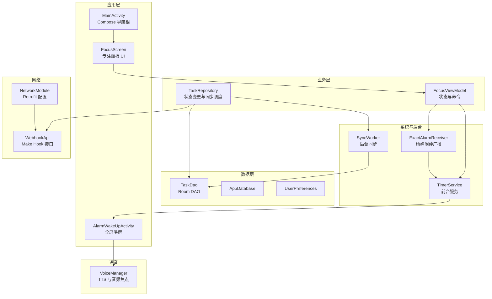
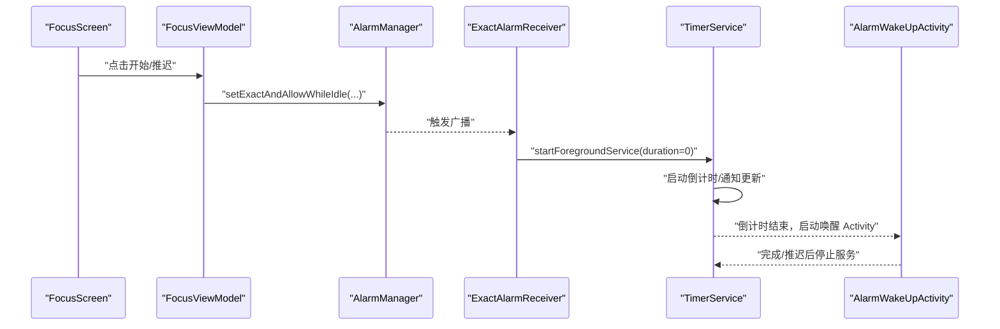
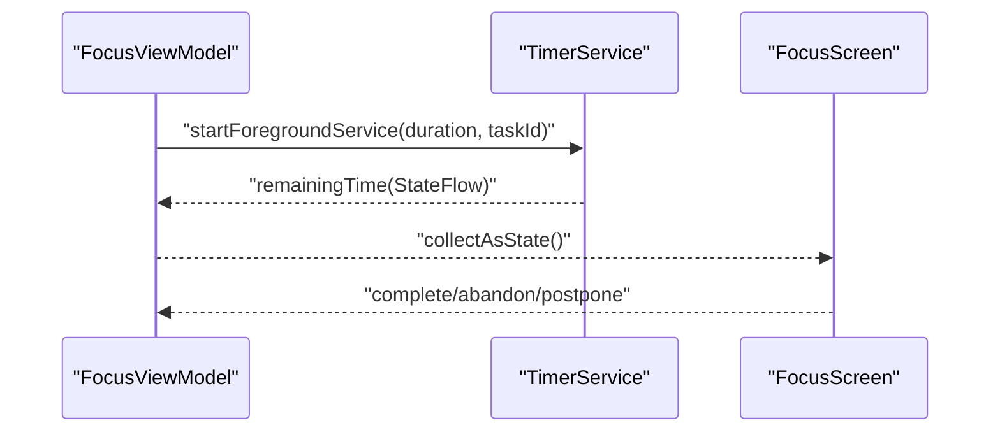
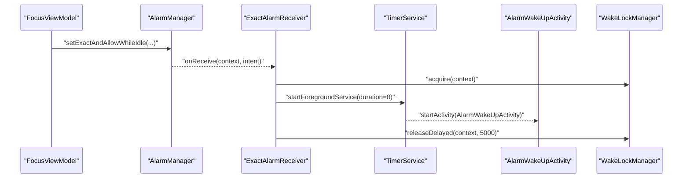
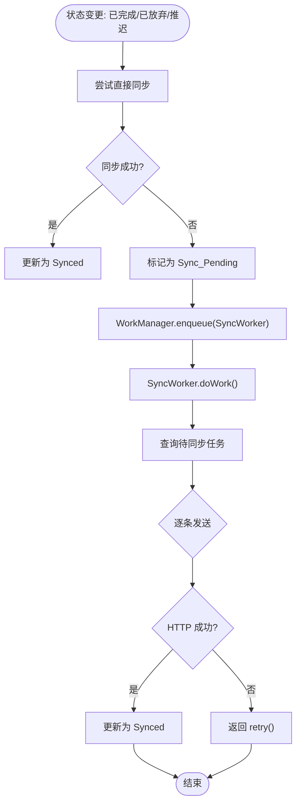
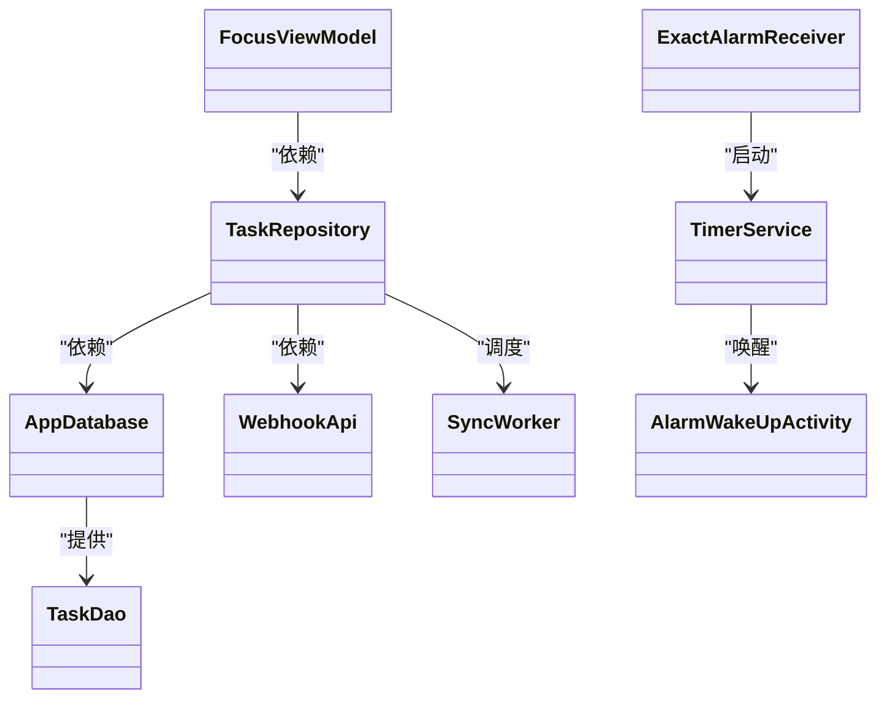
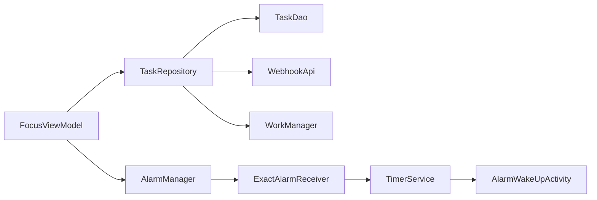

# 组件交互机制

<cite>
**本文引用的文件**
- [MainActivity.kt](file://app/src/main/java/com/pomodoroalert/MainActivity.kt)
- [PomodoroApplication.kt](file://app/src/main/java/com/pomodoroalert/PomodoroApplication.kt)
- [TimerService.kt](file://app/src/main/java/com/pomodoroalert/service/TimerService.kt)
- [AlarmWakeUpActivity.kt](file://app/src/main/java/com/pomodoroalert/ui/AlarmWakeUpActivity.kt)
- [ExactAlarmReceiver.kt](file://app/src/main/java/com/pomodoroalert/receiver/ExactAlarmReceiver.kt)
- [WakeLockManager.kt](file://app/src/main/java/com/pomodoroalert/receiver/WakeLockManager.kt)
- [FocusViewModel.kt](file://app/src/main/java/com/pomodoroalert/ui/viewmodel/FocusViewModel.kt)
- [FocusScreen.kt](file://app/src/main/java/com/pomodoroalert/ui/screens/FocusScreen.kt)
- [TaskRepository.kt](file://app/src/main/java/com/pomodoroalert/data/TaskRepository.kt)
- [TaskDao.kt](file://app/src/main/java/com/pomodoroalert/data/TaskDao.kt)
- [SyncWorker.kt](file://app/src/main/java/com/pomodoroalert/worker/SyncWorker.kt)
- [AppModule.kt](file://app/src/main/java/com/pomodoroalert/di/AppModule.kt)
- [NetworkModule.kt](file://app/src/main/java/com/pomodoroalert/di/NetworkModule.kt)
- [WebhookApi.kt](file://app/src/main/java/com/pomodoroalert/network/WebhookApi.kt)
- [VoiceManager.kt](file://app/src/main/java/com/pomodoroalert/voice/VoiceManager.kt)
- [AndroidManifest.xml](file://app/src/main/AndroidManifest.xml)
</cite>

## 目录
1. [引言](#引言)
2. [项目结构](#项目结构)
3. [核心组件](#核心组件)
4. [架构总览](#架构总览)
5. [详细组件分析](#详细组件分析)
6. [依赖分析](#依赖分析)
7. [性能考虑](#性能考虑)
8. [故障排查指南](#故障排查指南)
9. [结论](#结论)

## 引言
本文件系统性梳理 PomodoroAlert 应用的组件交互机制，覆盖 Activity、Fragment（通过 Compose 屏幕）、Service、BroadcastReceiver、Worker 等组件之间的通信与协作模式；阐述生命周期管理与状态同步策略；说明前台服务与 UI 的通信路径、后台任务与主线程的数据交换方式；给出基于 Intent、广播、回调等的消息传递实现要点；总结组件解耦设计原则与实践；并提供性能优化与错误处理建议。

## 项目结构
应用采用分层与按功能域组织的结构：
- 应用入口与导航：MainActivity 负责 Compose 导航图渲染；各 Screen 作为导航目的地承载 UI 逻辑。
- 业务层：ViewModel 提供状态与命令；Repository 封装数据访问与跨层协调。
- 数据层：Room DAO + Entity；通过 Hilt 注入数据库与偏好设置。
- 网络层：Retrofit + 接口定义，统一序列化配置。
- 后台与系统交互：前台服务负责倒计时与通知；广播接收器处理精确闹钟；WorkManager 执行可重试的同步任务。
- 语音与唤醒：Alarm 全屏唤醒 Activity + TTS；唤醒锁管理。

图表来源
- [MainActivity.kt:11-22](file://app/src/main/java/com/pomodoroalert/MainActivity.kt#L11-L22)
- [FocusScreen.kt:16-68](file://app/src/main/java/com/pomodoroalert/ui/screens/FocusScreen.kt#L16-L68)
- [FocusViewModel.kt:21-84](file://app/src/main/java/com/pomodoroalert/ui/viewmodel/FocusViewModel.kt#L21-L84)
- [TaskRepository.kt:19-101](file://app/src/main/java/com/pomodoroalert/data/TaskRepository.kt#L19-L101)
- [TaskDao.kt:9-28](file://app/src/main/java/com/pomodoroalert/data/TaskDao.kt#L9-L28)
- [ExactAlarmReceiver.kt:13-47](file://app/src/main/java/com/pomodoroalert/receiver/ExactAlarmReceiver.kt#L13-L47)
- [TimerService.kt:24-102](file://app/src/main/java/com/pomodoroalert/service/TimerService.kt#L24-L102)
- [AlarmWakeUpActivity.kt:24-104](file://app/src/main/java/com/pomodoroalert/ui/AlarmWakeUpActivity.kt#L24-L104)
- [SyncWorker.kt:15-77](file://app/src/main/java/com/pomodoroalert/worker/SyncWorker.kt#L15-L77)
- [NetworkModule.kt:16-52](file://app/src/main/java/com/pomodoroalert/di/NetworkModule.kt#L16-L52)
- [WebhookApi.kt:9-15](file://app/src/main/java/com/pomodoroalert/network/WebhookApi.kt#L9-L15)
- [VoiceManager.kt:12-62](file://app/src/main/java/com/pomodoroalert/voice/VoiceManager.kt#L12-L62)

章节来源
- [MainActivity.kt:11-22](file://app/src/main/java/com/pomodoroalert/MainActivity.kt#L11-L22)
- [AndroidManifest.xml:11-38](file://app/src/main/AndroidManifest.xml#L11-L38)

## 核心组件
- 应用入口与导航
  - MainActivity 使用 Compose 渲染 AppNavGraph，作为导航根节点。
- 前台服务
  - TimerService 负责倒计时、通知更新、触发闹钟唤醒。
- 广播接收器
  - ExactAlarmReceiver 处理系统精确闹钟，启动前台服务并显示全屏通知。
- 全屏唤醒 Activity
  - AlarmWakeUpActivity 在闹钟触发时以全屏、亮屏方式呈现，支持完成/推迟操作。
- 视图模型与屏幕
  - FocusViewModel 管理当前任务与剩余时间状态，发起服务与闹钟；FocusScreen 读取状态并展示。
- 数据仓库与 DAO
  - TaskRepository 统一封装状态更新与同步触发；TaskDao 提供 Room 查询与更新。
- 后台同步工作
  - SyncWorker 拉取待同步任务，调用 WebhookApi 发送，并根据结果更新数据库状态。
- 依赖注入与网络
  - AppModule 提供数据库、DAO、偏好、统计与日历管理；NetworkModule 提供 Retrofit、OkHttp、Gson；WebhookApi 定义远程接口。
- 语音与唤醒
  - VoiceManager 管理 TTS 与音频焦点；WakeLockManager 管理唤醒锁。

章节来源
- [MainActivity.kt:11-22](file://app/src/main/java/com/pomodoroalert/MainActivity.kt#L11-L22)
- [TimerService.kt:24-102](file://app/src/main/java/com/pomodoroalert/service/TimerService.kt#L24-L102)
- [ExactAlarmReceiver.kt:13-47](file://app/src/main/java/com/pomodoroalert/receiver/ExactAlarmReceiver.kt#L13-L47)
- [AlarmWakeUpActivity.kt:24-104](file://app/src/main/java/com/pomodoroalert/ui/AlarmWakeUpActivity.kt#L24-L104)
- [FocusViewModel.kt:21-84](file://app/src/main/java/com/pomodoroalert/ui/viewmodel/FocusViewModel.kt#L21-L84)
- [FocusScreen.kt:16-68](file://app/src/main/java/com/pomodoroalert/ui/screens/FocusScreen.kt#L16-L68)
- [TaskRepository.kt:19-101](file://app/src/main/java/com/pomodoroalert/data/TaskRepository.kt#L19-L101)
- [TaskDao.kt:9-28](file://app/src/main/java/com/pomodoroalert/data/TaskDao.kt#L9-L28)
- [SyncWorker.kt:15-77](file://app/src/main/java/com/pomodoroalert/worker/SyncWorker.kt#L15-L77)
- [AppModule.kt:19-60](file://app/src/main/java/com/pomodoroalert/di/AppModule.kt#L19-L60)
- [NetworkModule.kt:16-52](file://app/src/main/java/com/pomodoroalert/di/NetworkModule.kt#L16-L52)
- [WebhookApi.kt:9-15](file://app/src/main/java/com/pomodoroalert/network/WebhookApi.kt#L9-L15)
- [VoiceManager.kt:12-62](file://app/src/main/java/com/pomodoroalert/voice/VoiceManager.kt#L12-L62)

## 架构总览
应用遵循 MVVM + Repository + Room + Hilt + WorkManager 的现代 Android 架构。UI 通过 ViewModel 发起命令，ViewModel 与 Repository 协作进行数据与状态管理；Repository 调度后台任务（AlarmManager、前台服务、WorkManager）；数据持久化由 Room 完成；网络同步通过 Retrofit 接口异步执行。

图表来源
- [FocusScreen.kt:48-67](file://app/src/main/java/com/pomodoroalert/ui/screens/FocusScreen.kt#L48-L67)
- [FocusViewModel.kt:32-65](file://app/src/main/java/com/pomodoroalert/ui/viewmodel/FocusViewModel.kt#L32-L65)
- [ExactAlarmReceiver.kt:14-25](file://app/src/main/java/com/pomodoroalert/receiver/ExactAlarmReceiver.kt#L14-L25)
- [TimerService.kt:38-66](file://app/src/main/java/com/pomodoroalert/service/TimerService.kt#L38-L66)
- [AlarmWakeUpActivity.kt:75-98](file://app/src/main/java/com/pomodoroalert/ui/AlarmWakeUpActivity.kt#L75-L98)

## 详细组件分析

### 前台服务与 UI 的通信
- 状态传播
  - TimerService 内部使用 StateFlow 暴露 remainingTime，UI 通过 ViewModel 收集该状态流进行展示。
- 通知与交互
  - 服务在前台通道中持续更新通知内容；点击通知可回到 MainActivity。
- 生命周期与启动
  - FocusViewModel 在用户点击“开始”时通过 Intent 启动前台服务，并携带任务时长与 taskId。
  - AlarmWakeUpActivity 在倒计时结束后被启动，用户可选择完成或推迟。

图表来源
- [FocusViewModel.kt:32-47](file://app/src/main/java/com/pomodoroalert/ui/viewmodel/FocusViewModel.kt#L32-L47)
- [TimerService.kt:24-59](file://app/src/main/java/com/pomodoroalert/service/TimerService.kt#L24-L59)
- [FocusScreen.kt:17-26](file://app/src/main/java/com/pomodoroalert/ui/screens/FocusScreen.kt#L17-L26)

章节来源
- [TimerService.kt:24-102](file://app/src/main/java/com/pomodoroalert/service/TimerService.kt#L24-L102)
- [FocusViewModel.kt:21-84](file://app/src/main/java/com/pomodoroalert/ui/viewmodel/FocusViewModel.kt#L21-L84)
- [FocusScreen.kt:16-68](file://app/src/main/java/com/pomodoroalert/ui/screens/FocusScreen.kt#L16-L68)

### 广播触发与唤醒流程
- 精确闹钟
  - FocusViewModel 通过 AlarmManager 设置精确闹钟；ExactAlarmReceiver 在触发时启动前台服务并显示全屏通知。
- 唤醒与语音
  - AlarmWakeUpActivity 以 showWhenLocked/turnScreenOn 属性确保可见；VoiceManager 播放提示语。
- 唤醒锁管理
  - WakeLockManager 在广播接收器中短暂持有唤醒锁，避免设备休眠影响通知与唤醒。

图表来源
- [FocusViewModel.kt:49-65](file://app/src/main/java/com/pomodoroalert/ui/viewmodel/FocusViewModel.kt#L49-L65)
- [ExactAlarmReceiver.kt:14-47](file://app/src/main/java/com/pomodoroalert/receiver/ExactAlarmReceiver.kt#L14-L47)
- [WakeLockManager.kt:12-29](file://app/src/main/java/com/pomodoroalert/receiver/WakeLockManager.kt#L12-L29)
- [TimerService.kt:61-66](file://app/src/main/java/com/pomodoroalert/service/TimerService.kt#L61-L66)
- [AlarmWakeUpActivity.kt:30-36](file://app/src/main/java/com/pomodoroalert/ui/AlarmWakeUpActivity.kt#L30-L36)

章节来源
- [ExactAlarmReceiver.kt:13-47](file://app/src/main/java/com/pomodoroalert/receiver/ExactAlarmReceiver.kt#L13-L47)
- [WakeLockManager.kt:8-30](file://app/src/main/java/com/pomodoroalert/receiver/WakeLockManager.kt#L8-L30)
- [AlarmWakeUpActivity.kt:24-104](file://app/src/main/java/com/pomodoroalert/ui/AlarmWakeUpActivity.kt#L24-L104)

### 后台同步与状态一致性
- 状态变更触发
  - TaskRepository 在任务状态更新为“已完成/已放弃/推迟”时，优先尝试直接网络同步；失败则标记为“Sync_Pending”，并通过 WorkManager 调度 SyncWorker。
- 同步工作
  - SyncWorker 从数据库拉取待同步任务，构造 WebhookPayload，调用 WebhookApi；成功则更新为“Synced”，否则返回重试。
- 数据一致性
  - TaskDao 提供 getPendingSyncTasks 与 updateSyncStatus，保证重试队列与最终落库一致。

图表来源
- [TaskRepository.kt:32-94](file://app/src/main/java/com/pomodoroalert/data/TaskRepository.kt#L32-L94)
- [TaskDao.kt:23-27](file://app/src/main/java/com/pomodoroalert/data/TaskDao.kt#L23-L27)
- [SyncWorker.kt:24-71](file://app/src/main/java/com/pomodoroalert/worker/SyncWorker.kt#L24-L71)
- [WebhookApi.kt:9-15](file://app/src/main/java/com/pomodoroalert/network/WebhookApi.kt#L9-L15)

章节来源
- [TaskRepository.kt:19-101](file://app/src/main/java/com/pomodoroalert/data/TaskRepository.kt#L19-L101)
- [TaskDao.kt:9-28](file://app/src/main/java/com/pomodoroalert/data/TaskDao.kt#L9-L28)
- [SyncWorker.kt:15-77](file://app/src/main/java/com/pomodoroalert/worker/SyncWorker.kt#L15-L77)
- [WebhookApi.kt:9-15](file://app/src/main/java/com/pomodoroalert/network/WebhookApi.kt#L9-L15)

### 组件解耦与依赖注入
- Hilt 提供单例级依赖：AppModule 提供数据库、DAO、UserPreferences、统计与日历管理；NetworkModule 提供 Retrofit、OkHttp、Gson。
- ViewModel 仅依赖 Repository 与上下文，不直接访问数据库或网络，降低耦合。
- Service 与 Receiver 通过 Intent 解耦，广播仅传递必要参数。

图表来源
- [AppModule.kt:19-60](file://app/src/main/java/com/pomodoroalert/di/AppModule.kt#L19-L60)
- [NetworkModule.kt:16-52](file://app/src/main/java/com/pomodoroalert/di/NetworkModule.kt#L16-L52)
- [FocusViewModel.kt:21-84](file://app/src/main/java/com/pomodoroalert/ui/viewmodel/FocusViewModel.kt#L21-L84)
- [TaskRepository.kt:19-101](file://app/src/main/java/com/pomodoroalert/data/TaskRepository.kt#L19-L101)
- [SyncWorker.kt:15-77](file://app/src/main/java/com/pomodoroalert/worker/SyncWorker.kt#L15-L77)
- [TimerService.kt:24-102](file://app/src/main/java/com/pomodoroalert/service/TimerService.kt#L24-L102)
- [ExactAlarmReceiver.kt:13-47](file://app/src/main/java/com/pomodoroalert/receiver/ExactAlarmReceiver.kt#L13-L47)

章节来源
- [AppModule.kt:19-60](file://app/src/main/java/com/pomodoroalert/di/AppModule.kt#L19-L60)
- [NetworkModule.kt:16-52](file://app/src/main/java/com/pomodoroalert/di/NetworkModule.kt#L16-L52)
- [PomodoroApplication.kt:6-7](file://app/src/main/java/com/pomodoroalert/PomodoroApplication.kt#L6-L7)

## 依赖分析
- 组件耦合与内聚
  - ViewModel 与 Repository 之间通过接口抽象（Flow、suspend 函数）解耦；Repository 与 DAO、网络通过 Hilt 注入解耦。
  - Service 与 UI 通过 StateFlow + Intent 解耦；广播仅传递最小必要信息。
- 外部依赖
  - AndroidX Lifecycle/WorkManager/Retrofit/OkHttp/Gson；Room；系统权限（前台服务、唤醒锁、忽略电池优化、录音、日历、通知）。
- 潜在循环依赖
  - 当前结构无明显循环依赖；若将来引入更多跨层调用，应保持通过 Repository 中介。

图表来源
- [FocusViewModel.kt:21-84](file://app/src/main/java/com/pomodoroalert/ui/viewmodel/FocusViewModel.kt#L21-L84)
- [TaskRepository.kt:19-101](file://app/src/main/java/com/pomodoroalert/data/TaskRepository.kt#L19-L101)
- [TaskDao.kt:9-28](file://app/src/main/java/com/pomodoroalert/data/TaskDao.kt#L9-L28)
- [WebhookApi.kt:9-15](file://app/src/main/java/com/pomodoroalert/network/WebhookApi.kt#L9-L15)
- [ExactAlarmReceiver.kt:13-47](file://app/src/main/java/com/pomodoroalert/receiver/ExactAlarmReceiver.kt#L13-L47)
- [TimerService.kt:24-102](file://app/src/main/java/com/pomodoroalert/service/TimerService.kt#L24-L102)
- [AlarmWakeUpActivity.kt:24-104](file://app/src/main/java/com/pomodoroalert/ui/AlarmWakeUpActivity.kt#L24-L104)

章节来源
- [AndroidManifest.xml:4-9](file://app/src/main/AndroidManifest.xml#L4-L9)
- [NetworkModule.kt:26-44](file://app/src/main/java/com/pomodoroalert/di/NetworkModule.kt#L26-L44)

## 性能考虑
- 前台服务与通知
  - 使用低重要性的通知通道，避免打扰；仅在需要时更新通知内容，减少系统开销。
- 倒计时与协程
  - 服务内部使用协程与 StateFlow，避免频繁 UI 刷新；每秒一次的延迟与通知更新频率合理。
- 闹钟与唤醒锁
  - WakeLockManager 限制最大持有时间（约 10 秒），并在短延迟后释放，防止过度耗电。
- 同步策略
  - 直接同步失败时退回 WorkManager 可靠重试；网络约束仅在需要时启用，避免不必要的阻塞。
- UI 流
  - Compose 侧通过 collectAsState 收集状态流，避免手动订阅导致的内存泄漏与过度刷新。

## 故障排查指南
- 闹钟未触发
  - 检查是否正确设置精确闹钟；确认系统允许“在后台运行”与“忽略电池优化”。查看 AlarmManager 是否成功注册 PendingIntent。
- 前台服务未启动
  - 确认已在清单中声明服务并授予 FOREGROUND_SERVICE 权限；检查 startForegroundService 调用路径。
- 唤醒 Activity 不可见
  - 检查 showWhenLocked/turnScreenOn 属性；确认通知全屏意图配置正确。
- 同步失败
  - 查看 TaskRepository 的异常分支与 WorkManager 的重试策略；确认网络模块配置与 Webhook 地址。
- TTS 无声
  - 检查音频焦点请求与语言设置；确认在 onInit 成功后再 speak。

章节来源
- [AndroidManifest.xml:4-9](file://app/src/main/AndroidManifest.xml#L4-L9)
- [FocusViewModel.kt:49-65](file://app/src/main/java/com/pomodoroalert/ui/viewmodel/FocusViewModel.kt#L49-L65)
- [TimerService.kt:38-44](file://app/src/main/java/com/pomodoroalert/service/TimerService.kt#L38-L44)
- [AlarmWakeUpActivity.kt:30-36](file://app/src/main/java/com/pomodoroalert/ui/AlarmWakeUpActivity.kt#L30-L36)
- [TaskRepository.kt:68-79](file://app/src/main/java/com/pomodoroalert/data/TaskRepository.kt#L68-L79)
- [VoiceManager.kt:28-43](file://app/src/main/java/com/pomodoroalert/voice/VoiceManager.kt#L28-L43)

## 结论
本应用通过清晰的分层与解耦设计，实现了 UI、服务、广播、工作与数据层之间的稳定协作。前台服务与 UI 通过状态流实现松耦合通信；精确闹钟与唤醒锁保障了可靠的通知与唤醒体验；Repository 统一协调本地与远程状态，WorkManager 提供稳健的重试机制。建议在后续迭代中进一步细化异常上报与监控埋点，以提升可观测性与用户体验。