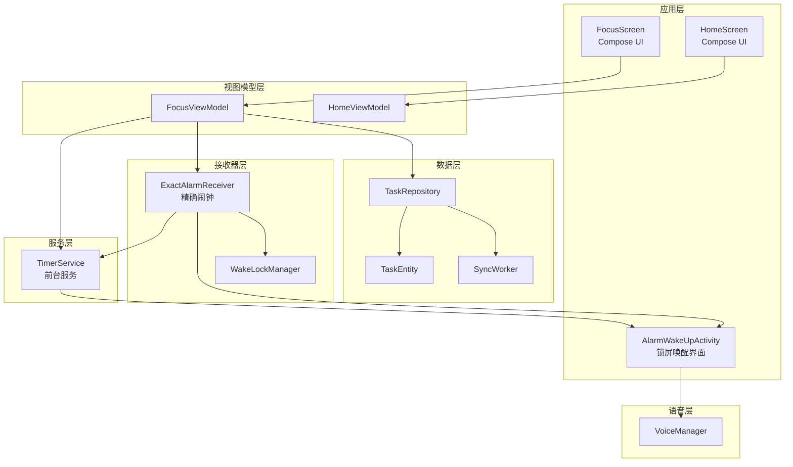
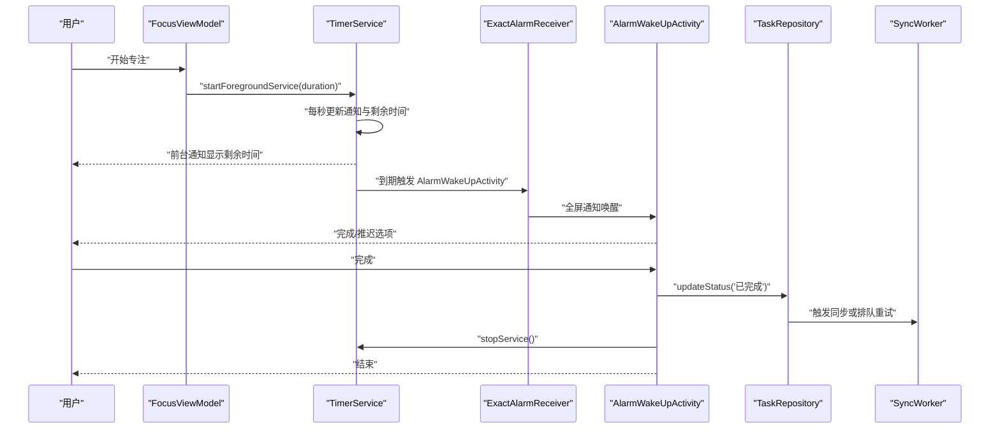
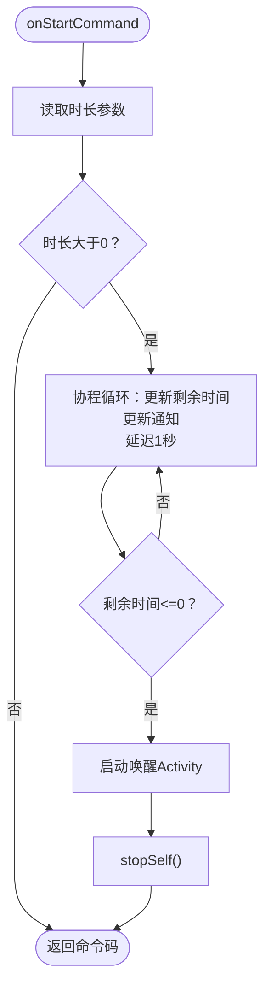
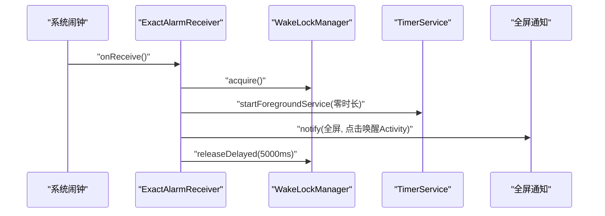
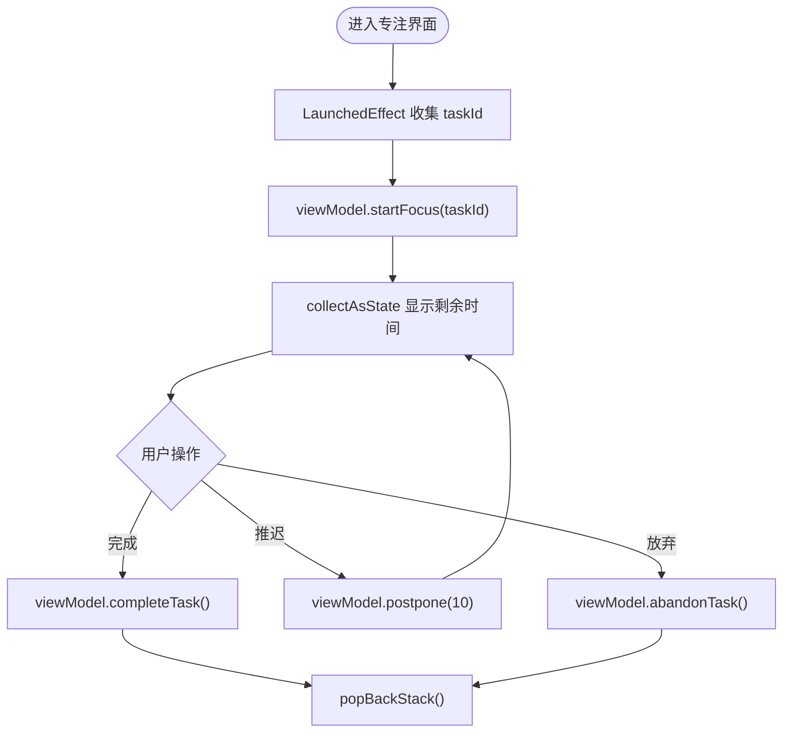
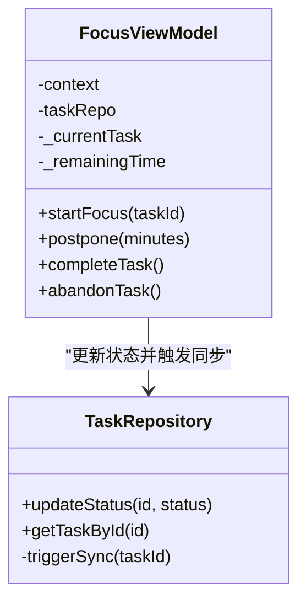
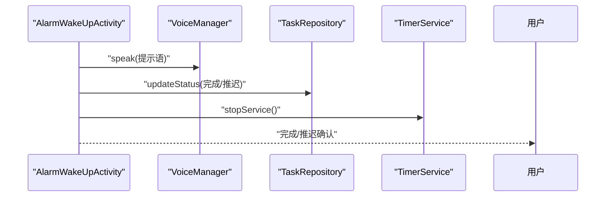
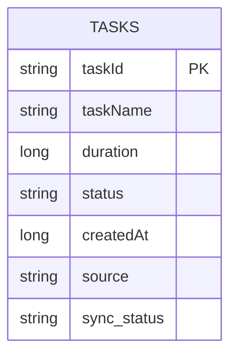
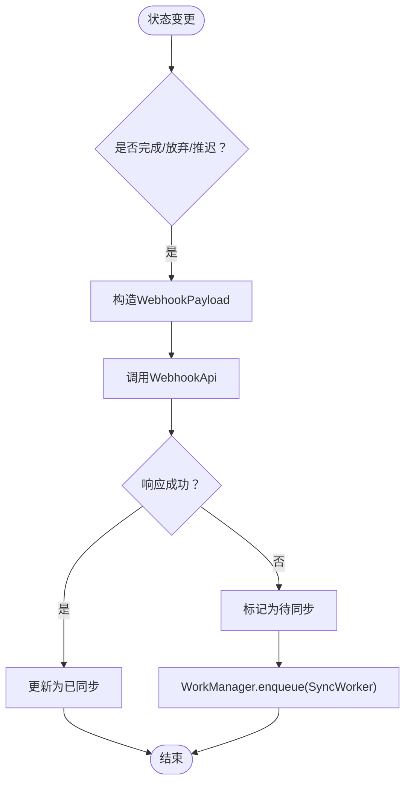
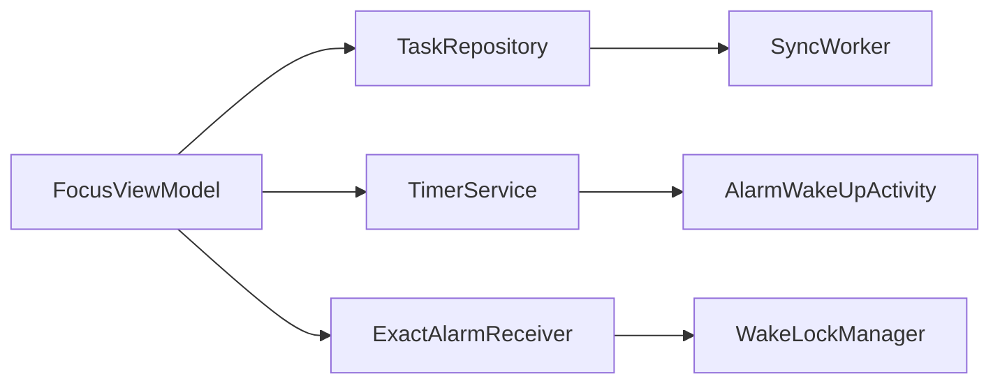

# 专注计时系统

<cite>
**本文引用的文件**
- [TimerService.kt](file://app/src/main/java/com/pomodoroalert/service/TimerService.kt)
- [ExactAlarmReceiver.kt](file://app/src/main/java/com/pomodoroalert/receiver/ExactAlarmReceiver.kt)
- [WakeLockManager.kt](file://app/src/main/java/com/pomodoroalert/receiver/WakeLockManager.kt)
- [FocusScreen.kt](file://app/src/main/java/com/pomodoroalert/ui/screens/FocusScreen.kt)
- [FocusViewModel.kt](file://app/src/main/java/com/pomodoroalert/ui/viewmodel/FocusViewModel.kt)
- [AlarmWakeUpActivity.kt](file://app/src/main/java/com/pomodoroalert/ui/AlarmWakeUpActivity.kt)
- [TaskEntity.kt](file://app/src/main/java/com/pomodoroalert/data/TaskEntity.kt)
- [TaskRepository.kt](file://app/src/main/java/com/pomodoroalert/data/TaskRepository.kt)
- [SyncWorker.kt](file://app/src/main/java/com/pomodoroalert/worker/SyncWorker.kt)
- [VoiceManager.kt](file://app/src/main/java/com/pomodoroalert/voice/VoiceManager.kt)
- [HomeScreen.kt](file://app/src/main/java/com/pomodoroalert/ui/screens/HomeScreen.kt)
- [HomeViewModel.kt](file://app/src/main/java/com/pomodoroalert/ui/viewmodel/HomeViewModel.kt)
- [AndroidManifest.xml](file://app/src/main/AndroidManifest.xml)
- [PomodoroApplication.kt](file://app/src/main/java/com/pomodoroalert/PomodoroApplication.kt)
</cite>

## 目录
1. [简介](#简介)
2. [项目结构](#项目结构)
3. [核心组件](#核心组件)
4. [架构总览](#架构总览)
5. [详细组件分析](#详细组件分析)
6. [依赖关系分析](#依赖关系分析)
7. [性能与精度考量](#性能与精度考量)
8. [故障排除指南](#故障排除指南)
9. [结论](#结论)
10. [附录](#附录)

## 简介
本系统是一个基于 Android 的专注计时应用，采用“番茄钟”工作法理念，通过前台服务驱动计时器，结合精确闹钟广播接收器实现高可靠提醒，并在锁屏状态下以全屏通知唤醒用户。系统支持任务管理、状态持久化、后台同步与语音播报等能力，兼顾电池优化与用户体验。

## 项目结构
应用采用模块化分层组织：
- service 层：前台服务负责倒计时与通知更新
- receiver 层：精确闹钟广播接收器触发提醒与唤醒
- ui 层：Compose UI 与 ViewModel 驱动交互
- data 层：Room 数据库、仓库与网络同步
- worker 层：后台任务调度与重试
- voice 层：TTS 语音播报与音频焦点管理
- manifest 声明前台服务类型、权限与广播接收器

图表来源
- [FocusScreen.kt:16-70](file://app/src/main/java/com/pomodoroalert/ui/screens/FocusScreen.kt#L16-L70)
- [FocusViewModel.kt:21-85](file://app/src/main/java/com/pomodoroalert/ui/viewmodel/FocusViewModel.kt#L21-L85)
- [TimerService.kt:24-103](file://app/src/main/java/com/pomodoroalert/service/TimerService.kt#L24-L103)
- [ExactAlarmReceiver.kt:13-49](file://app/src/main/java/com/pomodoroalert/receiver/ExactAlarmReceiver.kt#L13-L49)
- [AlarmWakeUpActivity.kt:24-105](file://app/src/main/java/com/pomodoroalert/ui/AlarmWakeUpActivity.kt#L24-L105)
- [TaskRepository.kt:19-101](file://app/src/main/java/com/pomodoroalert/data/TaskRepository.kt#L19-L101)
- [TaskEntity.kt:8-19](file://app/src/main/java/com/pomodoroalert/data/TaskEntity.kt#L8-L19)
- [SyncWorker.kt:15-78](file://app/src/main/java/com/pomodoroalert/worker/SyncWorker.kt#L15-L78)
- [VoiceManager.kt:12-63](file://app/src/main/java/com/pomodoroalert/voice/VoiceManager.kt#L12-L63)
- [WakeLockManager.kt:8-31](file://app/src/main/java/com/pomodoroalert/receiver/WakeLockManager.kt#L8-L31)

章节来源
- [AndroidManifest.xml:1-39](file://app/src/main/AndroidManifest.xml#L1-L39)
- [PomodoroApplication.kt:1-8](file://app/src/main/java/com/pomodoroalert/PomodoroApplication.kt#L1-L8)

## 核心组件
- TimerService：前台服务，负责倒计时、通知更新与到期唤醒
- ExactAlarmReceiver：精确闹钟广播接收器，唤醒服务与全屏提醒
- FocusViewModel：协调任务启动、暂停（推迟）、完成与放弃
- FocusScreen：专注界面，展示剩余时间与操作按钮
- AlarmWakeUpActivity：锁屏全屏提醒界面，支持完成与推迟
- TaskRepository：任务状态变更与网络同步触发
- SyncWorker：后台重试同步任务
- VoiceManager：TTS 语音播报与音频焦点管理
- WakeLockManager：短暂唤醒 CPU 以确保闹钟处理

章节来源
- [TimerService.kt:24-103](file://app/src/main/java/com/pomodoroalert/service/TimerService.kt#L24-L103)
- [ExactAlarmReceiver.kt:13-49](file://app/src/main/java/com/pomodoroalert/receiver/ExactAlarmReceiver.kt#L13-L49)
- [FocusViewModel.kt:21-85](file://app/src/main/java/com/pomodoroalert/ui/viewmodel/FocusViewModel.kt#L21-L85)
- [FocusScreen.kt:16-70](file://app/src/main/java/com/pomodoroalert/ui/screens/FocusScreen.kt#L16-L70)
- [AlarmWakeUpActivity.kt:24-105](file://app/src/main/java/com/pomodoroalert/ui/AlarmWakeUpActivity.kt#L24-L105)
- [TaskRepository.kt:19-101](file://app/src/main/java/com/pomodoroalert/data/TaskRepository.kt#L19-L101)
- [SyncWorker.kt:15-78](file://app/src/main/java/com/pomodoroalert/worker/SyncWorker.kt#L15-L78)
- [VoiceManager.kt:12-63](file://app/src/main/java/com/pomodoroalert/voice/VoiceManager.kt#L12-L63)
- [WakeLockManager.kt:8-31](file://app/src/main/java/com/pomodoroalert/receiver/WakeLockManager.kt#L8-L31)

## 架构总览
系统采用 MVVM + 前台服务 + 广播接收器 + Room + WorkManager 的组合架构：
- UI 通过 ViewModel 发起任务与计时控制
- ViewModel 启动/绑定前台服务或设置精确闹钟
- 前台服务持续倒计时并更新通知；到期启动唤醒 Activity
- 精确闹钟广播接收器在系统层面触发服务与全屏提醒
- 任务状态变更后触发本地数据库更新与网络同步
- 同步失败的任务由后台 Worker 定时重试

图表来源
- [FocusViewModel.kt:32-47](file://app/src/main/java/com/pomodoroalert/ui/viewmodel/FocusViewModel.kt#L32-L47)
- [TimerService.kt:38-66](file://app/src/main/java/com/pomodoroalert/service/TimerService.kt#L38-L66)
- [ExactAlarmReceiver.kt:14-47](file://app/src/main/java/com/pomodoroalert/receiver/ExactAlarmReceiver.kt#L14-L47)
- [AlarmWakeUpActivity.kt:75-98](file://app/src/main/java/com/pomodoroalert/ui/AlarmWakeUpActivity.kt#L75-L98)
- [TaskRepository.kt:32-38](file://app/src/main/java/com/pomodoroalert/data/TaskRepository.kt#L32-L38)
- [SyncWorker.kt:24-71](file://app/src/main/java/com/pomodoroalert/worker/SyncWorker.kt#L24-L71)

## 详细组件分析

### TimerService 实现机制与生命周期
- 前台服务：创建通知通道并在前台启动，避免被系统回收
- 计时循环：协程每秒更新剩余时间与通知，到期触发唤醒 Activity
- 生命周期：onStartCommand 接收时长参数，START_STICKY 确保被杀后重启
- 通知更新：使用 NotificationManagerCompat 更新 ongoing 通知

图表来源
- [TimerService.kt:38-66](file://app/src/main/java/com/pomodoroalert/service/TimerService.kt#L38-L66)

章节来源
- [TimerService.kt:24-103](file://app/src/main/java/com/pomodoroalert/service/TimerService.kt#L24-L103)

### 前台服务配置与通知管理
- 通知通道：在 O+ 创建 IMPORTANCE_LOW 通道，避免打扰
- 前台类型：在清单中声明 foregroundServiceType="mediaPlayback"
- 通知内容：标题“番茄钟运行中”，内容“剩余时间: Xs”，点击跳转主界面
- 通知更新：每次循环调用 notify 更新 ongoing 通知

章节来源
- [AndroidManifest.xml:33-35](file://app/src/main/AndroidManifest.xml#L33-L35)
- [TimerService.kt:29-99](file://app/src/main/java/com/pomodoroalert/service/TimerService.kt#L29-L99)

### ExactAlarmReceiver 精确闹钟处理
- 唤醒锁：Acquire 短暂唤醒 CPU，避免系统休眠导致错过
- 启动服务：以零时长参数启动 TimerService，用于检查到期状态
- 全屏提醒：构建高优先级通知并通过 fullScreenIntent 唤醒锁屏
- 释放锁：延时释放唤醒锁，避免长时间占用

图表来源
- [ExactAlarmReceiver.kt:14-47](file://app/src/main/java/com/pomodoroalert/receiver/ExactAlarmReceiver.kt#L14-L47)
- [WakeLockManager.kt:12-29](file://app/src/main/java/com/pomodoroalert/receiver/WakeLockManager.kt#L12-L29)

章节来源
- [ExactAlarmReceiver.kt:13-49](file://app/src/main/java/com/pomodoroalert/receiver/ExactAlarmReceiver.kt#L13-L49)
- [WakeLockManager.kt:8-31](file://app/src/main/java/com/pomodoroalert/receiver/WakeLockManager.kt#L8-L31)

### FocusScreen UI 组件与状态更新
- 数据绑定：收集 ViewModel 的 remainingTime 与 currentTask
- 时间格式化：将毫秒转换为 mm:ss 显示
- 操作按钮：完成、推迟10分钟、放弃，均通过 ViewModel 调用
- 导航：完成/放弃后返回上一页

图表来源
- [FocusScreen.kt:17-68](file://app/src/main/java/com/pomodoroalert/ui/screens/FocusScreen.kt#L17-L68)
- [FocusViewModel.kt:32-47](file://app/src/main/java/com/pomodoroalert/ui/viewmodel/FocusViewModel.kt#L32-L47)

章节来源
- [FocusScreen.kt:16-70](file://app/src/main/java/com/pomodoroalert/ui/screens/FocusScreen.kt#L16-L70)
- [FocusViewModel.kt:21-85](file://app/src/main/java/com/pomodoroalert/ui/viewmodel/FocusViewModel.kt#L21-L85)

### FocusViewModel 控制逻辑与状态管理
- 启动专注：查询任务、设置剩余时间、启动前台服务
- 推迟：计算新时长，设置精确闹钟（允许在待机时触发），更新剩余时间
- 完成/放弃：更新任务状态，停止服务，清空当前任务
- 与仓库交互：通过 TaskRepository 更新状态并触发同步

图表来源
- [FocusViewModel.kt:21-85](file://app/src/main/java/com/pomodoroalert/ui/viewmodel/FocusViewModel.kt#L21-L85)
- [TaskRepository.kt:19-101](file://app/src/main/java/com/pomodoroalert/data/TaskRepository.kt#L19-L101)

章节来源
- [FocusViewModel.kt:21-85](file://app/src/main/java/com/pomodoroalert/ui/viewmodel/FocusViewModel.kt#L21-L85)
- [TaskRepository.kt:19-101](file://app/src/main/java/com/pomodoroalert/data/TaskRepository.kt#L19-L101)

### AlarmWakeUpActivity 锁屏唤醒与反馈
- 锁屏显示：showWhenLocked、turnScreenOn
- 语音播报：使用 VoiceManager 请求音频焦点并播放提示语
- 用户反馈：完成/推迟按钮，完成后停止服务并结束页面
- 推迟逻辑：重新启动 TimerService 并传入新的时长

图表来源
- [AlarmWakeUpActivity.kt:30-98](file://app/src/main/java/com/pomodoroalert/ui/AlarmWakeUpActivity.kt#L30-L98)
- [VoiceManager.kt:45-61](file://app/src/main/java/com/pomodoroalert/voice/VoiceManager.kt#L45-L61)
- [TaskRepository.kt:32-38](file://app/src/main/java/com/pomodoroalert/data/TaskRepository.kt#L32-L38)

章节来源
- [AlarmWakeUpActivity.kt:24-105](file://app/src/main/java/com/pomodoroalert/ui/AlarmWakeUpActivity.kt#L24-L105)
- [VoiceManager.kt:12-63](file://app/src/main/java/com/pomodoroalert/voice/VoiceManager.kt#L12-L63)

### 任务实体与状态流转
- TaskEntity：包含任务 ID、名称、时长（毫秒）、状态、创建时间、来源、同步状态
- 状态变更：完成/放弃/推迟触发同步流程
- 同步策略：成功标记为已同步；失败标记为待同步并由 Worker 重试

图表来源
- [TaskEntity.kt:8-19](file://app/src/main/java/com/pomodoroalert/data/TaskEntity.kt#L8-L19)

章节来源
- [TaskEntity.kt:8-19](file://app/src/main/java/com/pomodoroalert/data/TaskEntity.kt#L8-L19)
- [TaskRepository.kt:32-38](file://app/src/main/java/com/pomodoroalert/data/TaskRepository.kt#L32-L38)

### 后台同步与重试机制
- 触发条件：任务状态为完成/放弃/推迟时
- 同步请求：构造 WebhookPayload，调用 WebhookApi
- 成功/失败处理：成功则更新同步状态为已同步；失败则标记为待同步并排队重试
- 重试策略：使用 WorkManager 在网络可用时执行 SyncWorker

图表来源
- [TaskRepository.kt:32-38](file://app/src/main/java/com/pomodoroalert/data/TaskRepository.kt#L32-L38)
- [TaskRepository.kt:42-94](file://app/src/main/java/com/pomodoroalert/data/TaskRepository.kt#L42-L94)
- [SyncWorker.kt:24-71](file://app/src/main/java/com/pomodoroalert/worker/SyncWorker.kt#L24-L71)

章节来源
- [TaskRepository.kt:19-101](file://app/src/main/java/com/pomodoroalert/data/TaskRepository.kt#L19-L101)
- [SyncWorker.kt:15-78](file://app/src/main/java/com/pomodoroalert/worker/SyncWorker.kt#L15-L78)

## 依赖关系分析
- 组件耦合：FocusViewModel 依赖 TaskRepository；TimerService 与 AlarmWakeUpActivity 通过 Intent 交互；ExactAlarmReceiver 与 WakeLockManager 协同
- 外部依赖：AlarmManager、NotificationManager、WorkManager、TextToSpeech
- 清单声明：前台服务类型、权限与广播接收器注册

图表来源
- [FocusViewModel.kt:21-85](file://app/src/main/java/com/pomodoroalert/ui/viewmodel/FocusViewModel.kt#L21-L85)
- [TimerService.kt:24-103](file://app/src/main/java/com/pomodoroalert/service/TimerService.kt#L24-L103)
- [ExactAlarmReceiver.kt:13-49](file://app/src/main/java/com/pomodoroalert/receiver/ExactAlarmReceiver.kt#L13-L49)
- [WakeLockManager.kt:8-31](file://app/src/main/java/com/pomodoroalert/receiver/WakeLockManager.kt#L8-L31)
- [TaskRepository.kt:19-101](file://app/src/main/java/com/pomodoroalert/data/TaskRepository.kt#L19-L101)
- [SyncWorker.kt:15-78](file://app/src/main/java/com/pomodoroalert/worker/SyncWorker.kt#L15-L78)

章节来源
- [AndroidManifest.xml:33-36](file://app/src/main/AndroidManifest.xml#L33-L36)

## 性能与精度考量
- 计时精度
  - 使用协程 delay(1000L) 进行每秒更新，通知与状态流驱动 UI 刷新
  - 闹钟精度：使用 setExactAndAllowWhileIdle 设置精确闹钟，允许在待机时触发
- 电池优化
  - 前台服务类型声明为 mediaPlayback，减少被系统回收概率
  - WakeLockManager 仅短暂持有唤醒锁（约10秒），随后延时释放
  - AlarmWakeUpActivity 设置 showWhenLocked 与 turnScreenOn，避免系统休眠影响
- 用户体验
  - 前台通知 ongoing，避免被系统清理
  - 全屏通知打断锁屏，确保及时提醒
  - TTS 语音播报，提升可感知性

章节来源
- [TimerService.kt:46-59](file://app/src/main/java/com/pomodoroalert/service/TimerService.kt#L46-L59)
- [FocusViewModel.kt:49-65](file://app/src/main/java/com/pomodoroalert/ui/viewmodel/FocusViewModel.kt#L49-L65)
- [AlarmWakeUpActivity.kt:30-36](file://app/src/main/java/com/pomodoroalert/ui/AlarmWakeUpActivity.kt#L30-L36)
- [WakeLockManager.kt:12-29](file://app/src/main/java/com/pomodoroalert/receiver/WakeLockManager.kt#L12-L29)
- [AndroidManifest.xml:33-35](file://app/src/main/AndroidManifest.xml#L33-L35)

## 故障排除指南
- 无法收到闹钟
  - 检查是否授予了前台服务与唤醒锁权限
  - 确认 ExactAlarmReceiver 是否在清单中注册
  - 验证 AlarmManager.setExactAndAllowWhileIdle 是否被调用
- 通知不显示或被清理
  - 确认通知通道创建与 IMPORTANCE_LOW 设置
  - 确保前台服务启动且 ongoing 通知存在
- 锁屏无反应
  - 检查 AlarmWakeUpActivity 的 showWhenLocked 与 turnScreenOn
  - 确认全屏通知的 fullScreenIntent 正确配置
- 同步失败
  - 查看 TaskRepository 中的异常分支与 WorkManager 重试队列
  - 确认网络可用后 SyncWorker 是否被执行

章节来源
- [AndroidManifest.xml:4-9](file://app/src/main/AndroidManifest.xml#L4-L9)
- [ExactAlarmReceiver.kt:14-47](file://app/src/main/java/com/pomodoroalert/receiver/ExactAlarmReceiver.kt#L14-L47)
- [TimerService.kt:89-99](file://app/src/main/java/com/pomodoroalert/service/TimerService.kt#L89-L99)
- [AlarmWakeUpActivity.kt:20-36](file://app/src/main/java/com/pomodoroalert/ui/AlarmWakeUpActivity.kt#L20-L36)
- [TaskRepository.kt:75-78](file://app/src/main/java/com/pomodoroalert/data/TaskRepository.kt#L75-L78)
- [SyncWorker.kt:24-71](file://app/src/main/java/com/pomodoroalert/worker/SyncWorker.kt#L24-L71)

## 结论
该专注计时系统通过前台服务与精确闹钟实现了可靠的计时与提醒，配合锁屏全屏通知与语音播报提升了用户体验。状态管理与后台同步保证了数据一致性与可靠性。在电池优化与计时精度方面采取了多项措施，满足实际使用场景的需求。

## 附录
- 任务大厅与专注界面：HomeScreen 提供任务列表与新增入口；FocusScreen 展示倒计时与操作按钮
- 语音输入与日历集成：HomeScreen 中预留了麦克风与日历图标，便于后续扩展

章节来源
- [HomeScreen.kt:48-206](file://app/src/main/java/com/pomodoroalert/ui/screens/HomeScreen.kt#L48-L206)
- [FocusScreen.kt:16-70](file://app/src/main/java/com/pomodoroalert/ui/screens/FocusScreen.kt#L16-L70)