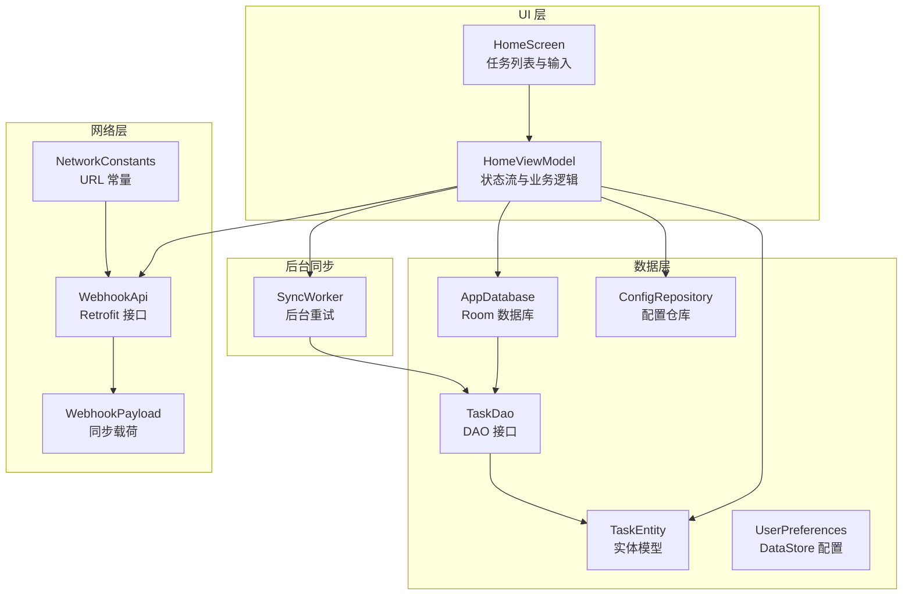
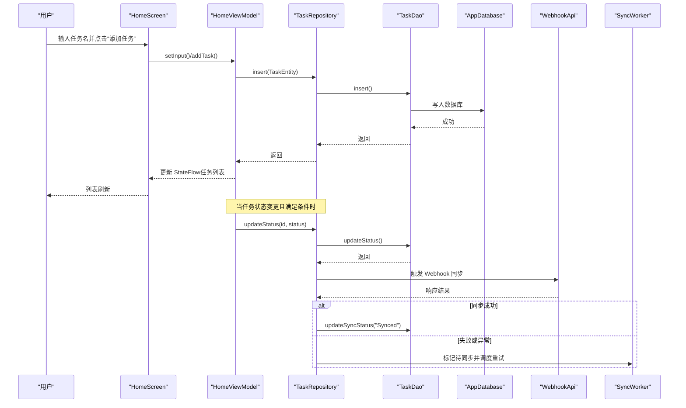
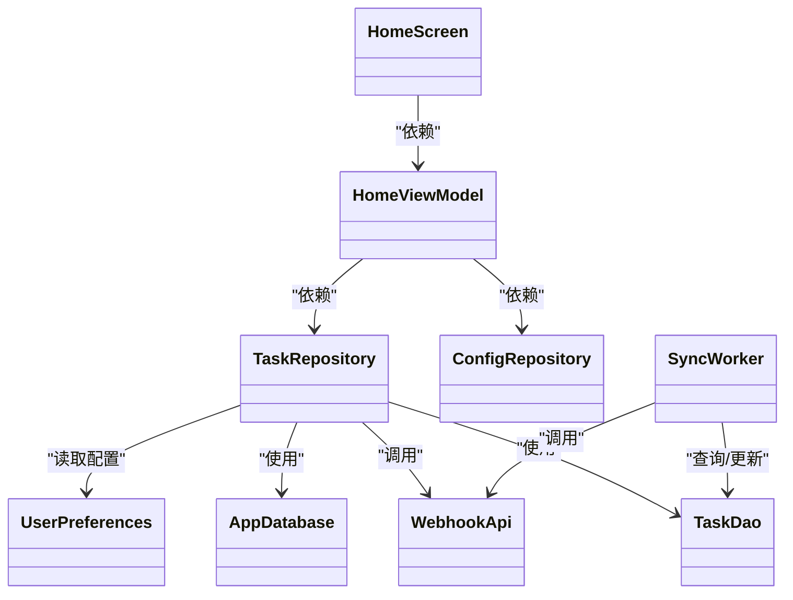

# 任务管理系统

<cite>
**本文引用的文件**
- [HomeScreen.kt](file://app/src/main/java/com/pomodoroalert/ui/screens/HomeScreen.kt)
- [HomeViewModel.kt](file://app/src/main/java/com/pomodoroalert/ui/viewmodel/HomeViewModel.kt)
- [TaskEntity.kt](file://app/src/main/java/com/pomodoroalert/data/TaskEntity.kt)
- [TaskRepository.kt](file://app/src/main/java/com/pomodoroalert/data/TaskRepository.kt)
- [TaskDao.kt](file://app/src/main/java/com/pomodoroalert/data/TaskDao.kt)
- [AppDatabase.kt](file://app/src/main/java/com/pomodoroalert/data/AppDatabase.kt)
- [ConfigRepository.kt](file://app/src/main/java/com/pomodoroalert/data/ConfigRepository.kt)
- [UserPreferences.kt](file://app/src/main/java/com/pomodoroalert/data/UserPreferences.kt)
- [WebhookApi.kt](file://app/src/main/java/com/pomodoroalert/network/WebhookApi.kt)
- [WebhookPayload.kt](file://app/src/main/java/com/pomodoroalert/data/WebhookPayload.kt)
- [NetworkConstants.kt](file://app/src/main/java/com/pomodoroalert/network/NetworkConstants.kt)
- [SyncWorker.kt](file://app/src/main/java/com/pomodoroalert/worker/SyncWorker.kt)
- [AppModule.kt](file://app/src/main/java/com/pomodoroalert/di/AppModule.kt)
- [PomodoroApplication.kt](file://app/src/main/java/com/pomodoroalert/PomodoroApplication.kt)
</cite>

## 目录
1. [简介](#简介)
2. [项目结构](#项目结构)
3. [核心组件](#核心组件)
4. [架构总览](#架构总览)
5. [详细组件分析](#详细组件分析)
6. [依赖关系分析](#依赖关系分析)
7. [性能考虑](#性能考虑)
8. [故障排查指南](#故障排查指南)
9. [结论](#结论)
10. [附录](#附录)

## 简介
本文件面向任务管理系统，围绕任务的创建、编辑、删除与状态管理展开，结合 HomeScreen 的界面展示、HomeViewModel 的数据绑定与状态管理、TaskEntity 数据模型、TaskRepository 的 CRUD 与同步策略，以及扩展到优先级、分类、批量操作、导入导出与备份恢复等高级主题，提供从架构到实现细节的完整说明，并给出用户体验与错误处理的最佳实践建议。

## 项目结构
系统采用基于模块化的分层组织方式：
- UI 层：Compose 屏幕与 ViewModel，负责用户交互与状态展示
- 数据层：Room 实体与 DAO、AppDatabase、Repository、UserPreferences/DataStore
- 网络层：Retrofit 接口与常量
- 后台同步：WorkManager + Worker 定时重试
- 依赖注入：Hilt 模块提供数据库、仓库与网络服务

图表来源
- [HomeScreen.kt:1-206](file://app/src/main/java/com/pomodoroalert/ui/screens/HomeScreen.kt#L1-L206)
- [HomeViewModel.kt:1-53](file://app/src/main/java/com/pomodoroalert/ui/viewmodel/HomeViewModel.kt#L1-L53)
- [AppDatabase.kt:1-10](file://app/src/main/java/com/pomodoroalert/data/AppDatabase.kt#L1-L10)
- [TaskDao.kt:1-29](file://app/src/main/java/com/pomodoroalert/data/TaskDao.kt#L1-L29)
- [TaskEntity.kt:1-19](file://app/src/main/java/com/pomodoroalert/data/TaskEntity.kt#L1-L19)
- [ConfigRepository.kt:1-19](file://app/src/main/java/com/pomodoroalert/data/ConfigRepository.kt#L1-L19)
- [UserPreferences.kt:1-36](file://app/src/main/java/com/pomodoroalert/data/UserPreferences.kt#L1-L36)
- [WebhookApi.kt:1-16](file://app/src/main/java/com/pomodoroalert/network/WebhookApi.kt#L1-L16)
- [WebhookPayload.kt:1-18](file://app/src/main/java/com/pomodoroalert/data/WebhookPayload.kt#L1-L18)
- [NetworkConstants.kt:1-7](file://app/src/main/java/com/pomodoroalert/network/NetworkConstants.kt#L1-L7)
- [SyncWorker.kt:1-78](file://app/src/main/java/com/pomodoroalert/worker/SyncWorker.kt#L1-L78)

章节来源
- [AppModule.kt:1-61](file://app/src/main/java/com/pomodoroalert/di/AppModule.kt#L1-L61)
- [PomodoroApplication.kt:1-8](file://app/src/main/java/com/pomodoroalert/PomodoroApplication.kt#L1-L8)

## 核心组件
- 任务实体与持久化：TaskEntity 作为 Room 实体，TaskDao 提供查询与更新；AppDatabase 聚合 DAO。
- 仓库与配置：TaskRepository 封装 CRUD 与状态变更触发同步；ConfigRepository/ UserPreferences 提供默认时长等配置。
- UI 与状态：HomeScreen 通过 Compose 读取 ViewModel 的 StateFlow 并驱动界面；HomeViewModel 维护输入文本与任务列表状态流。
- 同步与重试：当任务状态变为“已完成/已放弃/推迟”时，触发 Webhook 同步；失败则标记为“同步待定”，由 SyncWorker 在网络可用时重试。

章节来源
- [TaskEntity.kt:1-19](file://app/src/main/java/com/pomodoroalert/data/TaskEntity.kt#L1-L19)
- [TaskDao.kt:1-29](file://app/src/main/java/com/pomodoroalert/data/TaskDao.kt#L1-L29)
- [AppDatabase.kt:1-10](file://app/src/main/java/com/pomodoroalert/data/AppDatabase.kt#L1-L10)
- [TaskRepository.kt:1-101](file://app/src/main/java/com/pomodoroalert/data/TaskRepository.kt#L1-L101)
- [ConfigRepository.kt:1-19](file://app/src/main/java/com/pomodoroalert/data/ConfigRepository.kt#L1-L19)
- [UserPreferences.kt:1-36](file://app/src/main/java/com/pomodoroalert/data/UserPreferences.kt#L1-L36)
- [HomeScreen.kt:1-206](file://app/src/main/java/com/pomodoroalert/ui/screens/HomeScreen.kt#L1-L206)
- [HomeViewModel.kt:1-53](file://app/src/main/java/com/pomodoroalert/ui/viewmodel/HomeViewModel.kt#L1-L53)
- [WebhookApi.kt:1-16](file://app/src/main/java/com/pomodoroalert/network/WebhookApi.kt#L1-L16)
- [WebhookPayload.kt:1-18](file://app/src/main/java/com/pomodoroalert/data/WebhookPayload.kt#L1-L18)
- [NetworkConstants.kt:1-7](file://app/src/main/java/com/pomodoroalert/network/NetworkConstants.kt#L1-L7)
- [SyncWorker.kt:1-78](file://app/src/main/java/com/pomodoroalert/worker/SyncWorker.kt#L1-L78)

## 架构总览
系统遵循 MVVM + Repository 模式，UI 通过 StateFlow 订阅数据变化；Repository 负责协调数据库与网络；WorkManager 处理异步重试。

图表来源
- [HomeScreen.kt:116-127](file://app/src/main/java/com/pomodoroalert/ui/screens/HomeScreen.kt#L116-L127)
- [HomeViewModel.kt:38-51](file://app/src/main/java/com/pomodoroalert/ui/viewmodel/HomeViewModel.kt#L38-L51)
- [TaskRepository.kt:32-38](file://app/src/main/java/com/pomodoroalert/data/TaskRepository.kt#L32-L38)
- [TaskDao.kt:20-21](file://app/src/main/java/com/pomodoroalert/data/TaskDao.kt#L20-L21)
- [WebhookApi.kt:9-15](file://app/src/main/java/com/pomodoroalert/network/WebhookApi.kt#L9-L15)
- [SyncWorker.kt:24-71](file://app/src/main/java/com/pomodoroalert/worker/SyncWorker.kt#L24-L71)

## 详细组件分析

### HomeScreen：任务列表展示与交互
- 输入框与按钮：支持单行输入、清空输入、触发添加任务；底部导航按钮跳转统计与设置。
- 任务列表：使用 LazyColumn 渲染，按创建时间倒序显示“未放弃”的任务；每项包含任务名与时长，提供“开始专注”入口。
- 交互流程：收集输入文本与任务列表状态流，按键触发 ViewModel 添加任务。

章节来源
- [HomeScreen.kt:48-204](file://app/src/main/java/com/pomodoroalert/ui/screens/HomeScreen.kt#L48-L204)

### HomeViewModel：数据绑定、状态管理与业务逻辑
- 状态流：维护 inputText 与 tasks 两个 StateFlow；init 中订阅仓库的活跃任务流以驱动 UI。
- 输入处理：setInput 更新输入文本状态流。
- 新增任务：读取默认专注时长（来自配置仓库），构造 TaskEntity 并调用仓库插入，随后清空输入框。

章节来源
- [HomeViewModel.kt:15-53](file://app/src/main/java/com/pomodoroalert/ui/viewmodel/HomeViewModel.kt#L15-L53)
- [ConfigRepository.kt:16-18](file://app/src/main/java/com/pomodoroalert/data/ConfigRepository.kt#L16-L18)

### TaskEntity：数据模型设计
- 主键：taskId（UUID 字符串）
- 必填字段：taskName、duration（毫秒）、status、createdAt、source
- 其他：syncStatus（默认“Synced”），用于标识是否需要同步
- 约束：Room 表名为 tasks；字段类型与默认值在实体中明确

章节来源
- [TaskEntity.kt:8-18](file://app/src/main/java/com/pomodoroalert/data/TaskEntity.kt#L8-L18)

### TaskRepository：CRUD、状态变更与同步策略
- 查询：getActiveTasks 返回 Flow<List<TaskEntity>>，筛选未放弃的任务并按创建时间倒序。
- 插入：insert 调用 DAO 插入新任务。
- 更新状态：updateStatus 更新状态；当状态为“已完成/已放弃/推迟”时触发同步。
- 同步流程：构造 WebhookPayload，调用 WebhookApi；成功则更新同步状态为“Synced”，否则标记为“Sync_Pending”并调度 SyncWorker。
- 工具方法：formatTimestamp 格式化时间戳；markPendingAndScheduleRetry 使用 WorkManager 设置网络约束的单次任务。

章节来源
- [TaskRepository.kt:28-101](file://app/src/main/java/com/pomodoroalert/data/TaskRepository.kt#L28-L101)
- [TaskDao.kt:14-27](file://app/src/main/java/com/pomodoroalert/data/TaskDao.kt#L14-L27)
- [WebhookApi.kt:9-15](file://app/src/main/java/com/pomodoroalert/network/WebhookApi.kt#L9-L15)
- [WebhookPayload.kt:8-17](file://app/src/main/java/com/pomodoroalert/data/WebhookPayload.kt#L8-L17)
- [NetworkConstants.kt:3-6](file://app/src/main/java/com/pomodoroalert/network/NetworkConstants.kt#L3-L6)

### TaskDao 与 AppDatabase：查询与持久化
- DAO 方法：insert、getActiveTasks（Flow）、getTaskById、updateStatus、getPendingSyncTasks、updateSyncStatus。
- 数据库：AppDatabase 聚合 TaskDao，版本 1，导出模式关闭。

章节来源
- [TaskDao.kt:10-28](file://app/src/main/java/com/pomodoroalert/data/TaskDao.kt#L10-L28)
- [AppDatabase.kt:6-9](file://app/src/main/java/com/pomodoroalert/data/AppDatabase.kt#L6-L9)

### 配置与偏好：UserPreferences 与 ConfigRepository
- UserPreferences：基于 DataStore 的布尔、整型、字符串键值存储，默认值在读取时提供。
- ConfigRepository：暴露 Flow 并提供写入方法；提供 getDefaultPomodoro 辅助方法。

章节来源
- [UserPreferences.kt:15-35](file://app/src/main/java/com/pomodoroalert/data/UserPreferences.kt#L15-L35)
- [ConfigRepository.kt:7-18](file://app/src/main/java/com/pomodoroalert/data/ConfigRepository.kt#L7-L18)

### 同步与重试：SyncWorker
- 触发时机：TaskRepository 标记“Sync_Pending”后，由 WorkManager 调度执行。
- 执行流程：遍历待同步任务，构造 WebhookPayload 并调用 WebhookApi；成功则更新为“Synced”，否则保留待同步并返回重试。
- 时间格式：统一使用 formatTimestamp。

章节来源
- [SyncWorker.kt:24-77](file://app/src/main/java/com/pomodoroalert/worker/SyncWorker.kt#L24-L77)
- [TaskRepository.kt:82-94](file://app/src/main/java/com/pomodoroalert/data/TaskRepository.kt#L82-L94)

### 依赖注入与应用启动
- AppModule：提供 AppDatabase、TaskDao、UserPreferences、ConfigRepository、StatsRepository、CalendarManager。
- 应用类：PomodoroApplication 使用 @HiltAndroidApp 启用 Hilt。

章节来源
- [AppModule.kt:23-60](file://app/src/main/java/com/pomodoroalert/di/AppModule.kt#L23-L60)
- [PomodoroApplication.kt:6-7](file://app/src/main/java/com/pomodoroalert/PomodoroApplication.kt#L6-L7)

## 依赖关系分析
- UI 依赖 ViewModel；ViewModel 依赖 TaskRepository 与 ConfigRepository；Repository 依赖 DAO、AppDatabase、WebhookApi、UserPreferences。
- 网络同步通过 Retrofit 接口与 WorkManager Worker 协作。
- DI 模块集中提供数据库与仓库实例，降低耦合。

图表来源
- [HomeScreen.kt:48-204](file://app/src/main/java/com/pomodoroalert/ui/screens/HomeScreen.kt#L48-L204)
- [HomeViewModel.kt:16-19](file://app/src/main/java/com/pomodoroalert/ui/viewmodel/HomeViewModel.kt#L16-L19)
- [TaskRepository.kt:20-25](file://app/src/main/java/com/pomodoroalert/data/TaskRepository.kt#L20-L25)
- [TaskDao.kt:10-28](file://app/src/main/java/com/pomodoroalert/data/TaskDao.kt#L10-L28)
- [AppDatabase.kt:7-8](file://app/src/main/java/com/pomodoroalert/data/AppDatabase.kt#L7-L8)
- [WebhookApi.kt:9-15](file://app/src/main/java/com/pomodoroalert/network/WebhookApi.kt#L9-L15)
- [UserPreferences.kt:15-35](file://app/src/main/java/com/pomodoroalert/data/UserPreferences.kt#L15-L35)
- [SyncWorker.kt:16-22](file://app/src/main/java/com/pomodoroalert/worker/SyncWorker.kt#L16-L22)

## 性能考虑
- 列表渲染：LazyColumn 仅渲染可见项，配合 items(key=taskId) 减少重组开销。
- 数据流：使用 Flow 和 StateFlow 驱动 UI，避免不必要的全局刷新。
- 数据库：查询按创建时间倒序，索引建议在实际部署中评估；当前查询简单，可保持。
- 同步策略：后台重试使用 WorkManager 约束网络条件，避免频繁唤醒导致耗电。
- 网络调用：统一时间格式与载荷结构，减少序列化与传输体积。

## 故障排查指南
- 无法添加任务
  - 检查 HomeViewModel 的输入文本是否为空；确认 ConfigRepository 默认时长是否可读。
  - 参考路径：[HomeViewModel.kt:34-51](file://app/src/main/java/com/pomodoroalert/ui/viewmodel/HomeViewModel.kt#L34-L51)，[ConfigRepository.kt:16-18](file://app/src/main/java/com/pomodoroalert/data/ConfigRepository.kt#L16-L18)
- 任务不显示或排序异常
  - 确认 DAO 查询是否过滤“已放弃”状态并按创建时间倒序；检查数据库版本与迁移。
  - 参考路径：[TaskDao.kt:14](file://app/src/main/java/com/pomodoroalert/data/TaskDao.kt#L14)，[AppDatabase.kt:6](file://app/src/main/java/com/pomodoroalert/data/AppDatabase.kt#L6)
- 同步失败或未触发
  - 检查状态变更是否满足“已完成/已放弃/推迟”；确认 Webhook URL 是否正确；查看 WorkManager 调度与重试。
  - 参考路径：[TaskRepository.kt:32-38](file://app/src/main/java/com/pomodoroalert/data/TaskRepository.kt#L32-L38)，[NetworkConstants.kt:5](file://app/src/main/java/com/pomodoroalert/network/NetworkConstants.kt#L5)，[SyncWorker.kt:24-71](file://app/src/main/java/com/pomodoroalert/worker/SyncWorker.kt#L24-L71)
- 数据持久化问题
  - 确认 AppDatabase 构建与 TaskDao 注入；检查 DataStore 键值是否存在默认值。
  - 参考路径：[AppModule.kt:25-35](file://app/src/main/java/com/pomodoroalert/di/AppModule.kt#L25-L35)，[UserPreferences.kt:22-24](file://app/src/main/java/com/pomodoroalert/data/UserPreferences.kt#L22-L24)

## 结论
该系统以 Room + Repository + Flow + WorkManager 为核心，实现了任务的本地持久化、状态变更与云端同步的闭环。UI 通过 Compose 与 ViewModel 的响应式数据流实现高效交互。当前实现聚焦于基础 CRUD 与状态同步，后续可在优先级、分类、批量操作、导入导出与备份恢复等方面扩展。

## 附录

### 功能扩展建议（概念性）
- 优先级与分类
  - 在 TaskEntity 增加 priority、category 字段；在 UI 提供筛选与排序控件；在仓库增加相应查询。
- 批量操作
  - 在 UI 提供多选与批量删除/状态变更；在仓库提供批量更新接口。
- 导入导出与备份恢复
  - 导出：将任务列表序列化为 JSON 或 CSV，支持选择日期范围与状态过滤。
  - 导入：解析文件并批量插入；冲突策略可选择忽略或合并。
  - 备份恢复：利用 AppDatabase 的备份 API 或外部存储目录进行文件级备份。
- 用户体验优化
  - 输入校验与提示；加载与错误状态反馈；手势与无障碍支持。
- 错误处理最佳实践
  - 明确异常类型与用户提示；记录关键事件日志；在网络不可用时提供离线体验与队列管理。