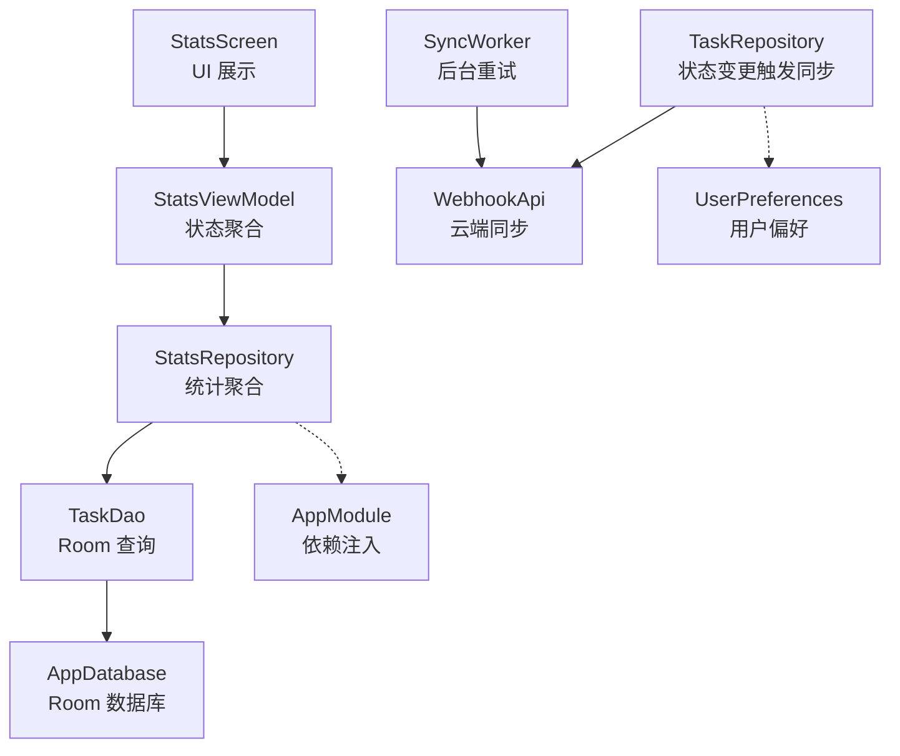
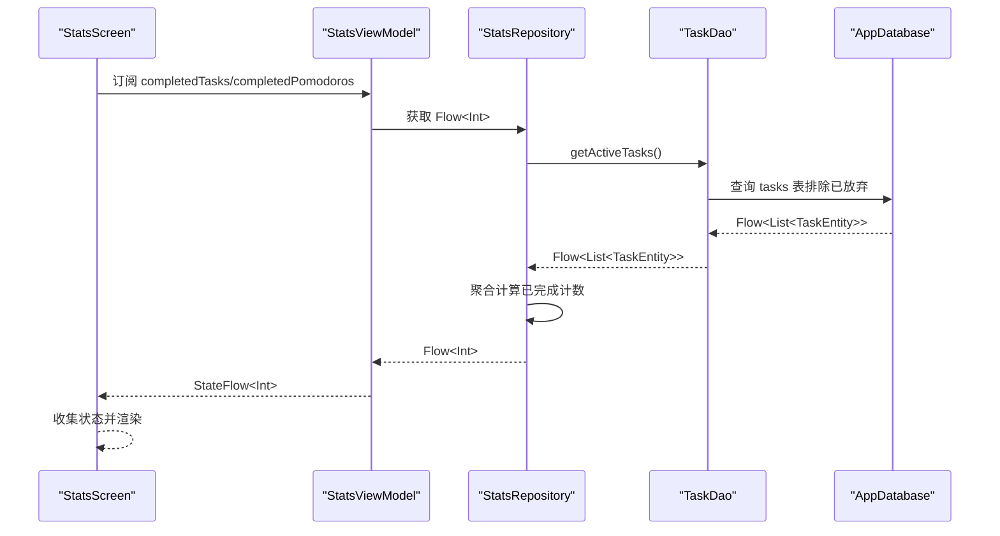
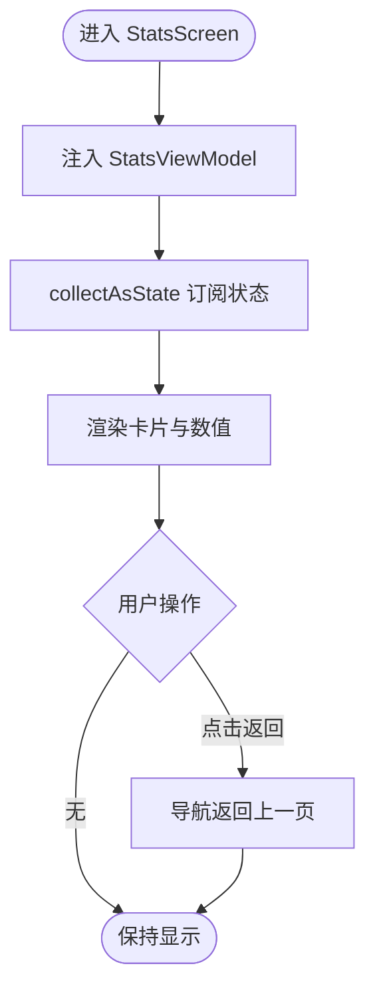
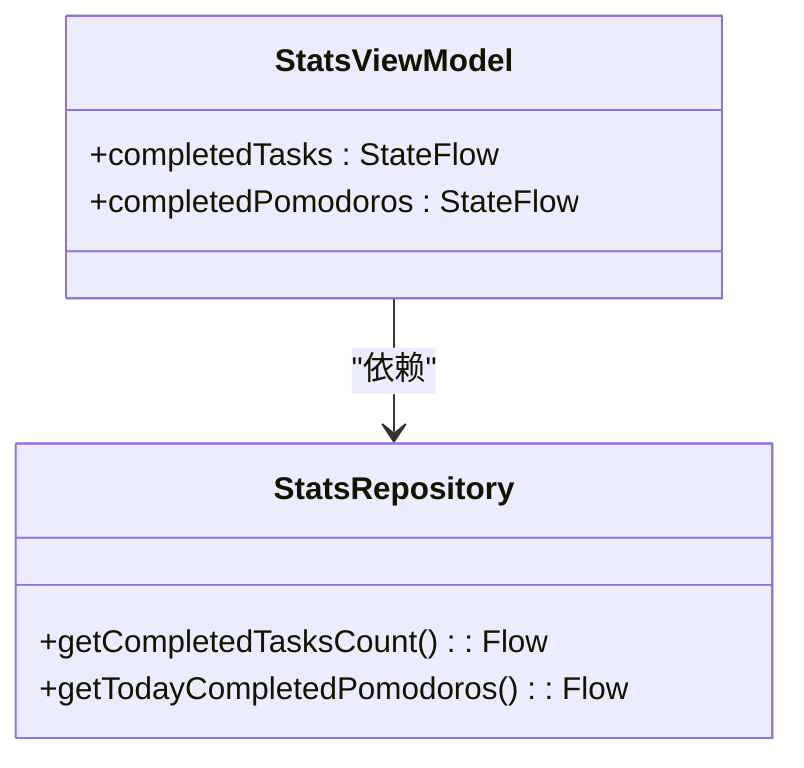
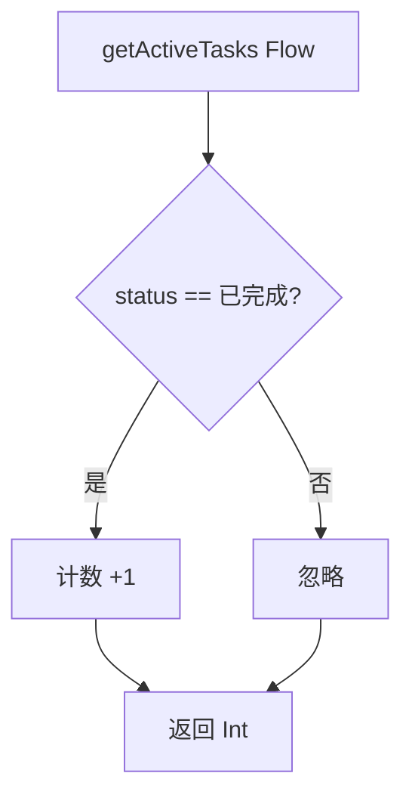
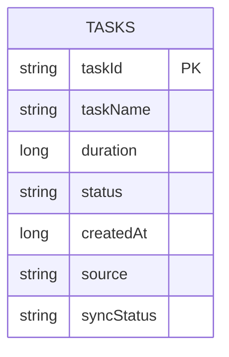
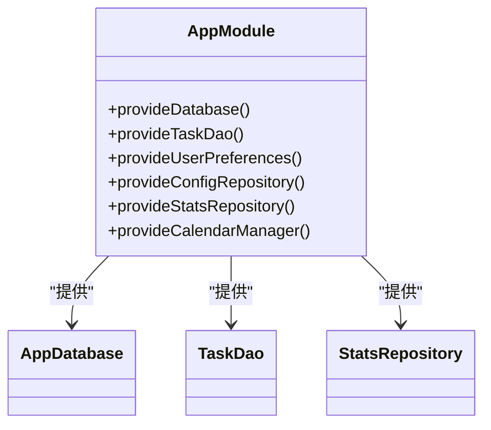
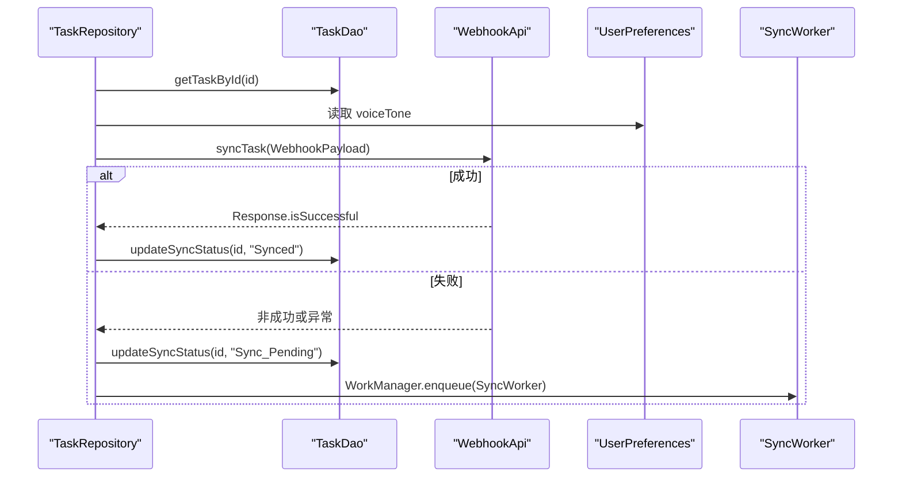
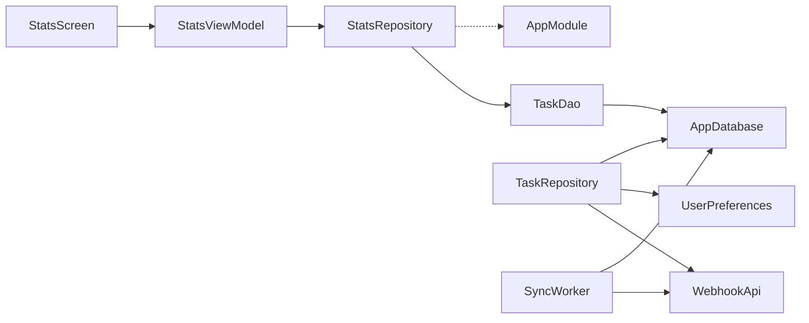

# 数据统计功能

<cite>
**本文引用的文件列表**
- [StatsScreen.kt](file://app/src/main/java/com/pomodoroalert/ui/screens/StatsScreen.kt)
- [StatsViewModel.kt](file://app/src/main/java/com/pomodoroalert/ui/viewmodel/StatsViewModel.kt)
- [StatsRepository.kt](file://app/src/main/java/com/pomodoroalert/data/StatsRepository.kt)
- [TaskDao.kt](file://app/src/main/java/com/pomodoroalert/data/TaskDao.kt)
- [TaskEntity.kt](file://app/src/main/java/com/pomodoroalert/data/TaskEntity.kt)
- [AppDatabase.kt](file://app/src/main/java/com/pomodoroalert/data/AppDatabase.kt)
- [AppModule.kt](file://app/src/main/java/com/pomodoroalert/di/AppModule.kt)
- [TaskRepository.kt](file://app/src/main/java/com/pomodoroalert/data/TaskRepository.kt)
- [UserPreferences.kt](file://app/src/main/java/com/pomodoroalert/data/UserPreferences.kt)
- [WebhookApi.kt](file://app/src/main/java/com/pomodoroalert/network/WebhookApi.kt)
- [SyncWorker.kt](file://app/src/main/java/com/pomodoroalert/worker/SyncWorker.kt)
- [WebhookPayload.kt](file://app/src/main/java/com/pomodoroalert/data/WebhookPayload.kt)
</cite>

## 目录
1. [简介](#简介)
2. [项目结构](#项目结构)
3. [核心组件](#核心组件)
4. [架构总览](#架构总览)
5. [详细组件分析](#详细组件分析)
6. [依赖关系分析](#依赖关系分析)
7. [性能与可扩展性](#性能与可扩展性)
8. [故障排查指南](#故障排查指南)
9. [结论](#结论)
10. [附录](#附录)

## 简介
本文件面向“数据统计功能”的完整技术文档，聚焦于统计数据的采集、计算与展示机制。当前版本实现了基础的“今日完成任务数”和“今日完成番茄数（V1）”两个指标，并通过 Room 持久化层提供流式数据源，配合 ViewModel 将状态暴露给 Compose 屏幕进行渲染。文档将从系统架构、组件职责、数据流、处理逻辑、错误处理与性能优化等方面进行深入解析，并给出未来扩展到更复杂统计指标（如专注时长、完成率、效率趋势、历史对比、趋势预测、个性化报告、导出与分享）的实现建议与落地路径。

## 项目结构
围绕统计功能的关键模块如下：
- UI 层：StatsScreen 使用 Hilt 注入 StatsViewModel，订阅 StateFlow 并以卡片形式展示指标。
- ViewModel 层：StatsViewModel 调用 StatsRepository 提供的 Flow，并通过 stateIn 包装为 StateFlow。
- Repository 层：StatsRepository 基于 TaskDao 的 Flow 进行聚合计算。
- 数据访问层：TaskDao 定义查询接口；AppDatabase 提供 DAO 实例；TaskEntity 描述任务实体字段。
- 依赖注入：AppModule 统一提供数据库、DAO、Repository 及 StatsRepository 的绑定。
- 同步与网络：TaskRepository 在任务状态变更后触发同步流程；SyncWorker 处理重试；WebhookApi 负责云端同步；UserPreferences 提供用户偏好（如语音音色）。

**图示来源**
- [StatsScreen.kt:15-58](file://app/src/main/java/com/pomodoroalert/ui/screens/StatsScreen.kt#L15-L58)
- [StatsViewModel.kt:12-21](file://app/src/main/java/com/pomodoroalert/ui/viewmodel/StatsViewModel.kt#L12-L21)
- [StatsRepository.kt:6-17](file://app/src/main/java/com/pomodoroalert/data/StatsRepository.kt#L6-L17)
- [TaskDao.kt:10-28](file://app/src/main/java/com/pomodoroalert/data/TaskDao.kt#L10-L28)
- [AppDatabase.kt:6-9](file://app/src/main/java/com/pomodoroalert/data/AppDatabase.kt#L6-L9)
- [AppModule.kt:19-60](file://app/src/main/java/com/pomodoroalert/di/AppModule.kt#L19-L60)
- [TaskRepository.kt:19-101](file://app/src/main/java/com/pomodoroalert/data/TaskRepository.kt#L19-L101)
- [WebhookApi.kt:9-15](file://app/src/main/java/com/pomodoroalert/network/WebhookApi.kt#L9-L15)
- [UserPreferences.kt:15-35](file://app/src/main/java/com/pomodoroalert/data/UserPreferences.kt#L15-L35)
- [SyncWorker.kt:15-77](file://app/src/main/java/com/pomodoroalert/worker/SyncWorker.kt#L15-L77)

**章节来源**
- [StatsScreen.kt:15-58](file://app/src/main/java/com/pomodoroalert/ui/screens/StatsScreen.kt#L15-L58)
- [StatsViewModel.kt:12-21](file://app/src/main/java/com/pomodoroalert/ui/viewmodel/StatsViewModel.kt#L12-L21)
- [StatsRepository.kt:6-17](file://app/src/main/java/com/pomodoroalert/data/StatsRepository.kt#L6-L17)
- [TaskDao.kt:10-28](file://app/src/main/java/com/pomodoroalert/data/TaskDao.kt#L10-L28)
- [AppDatabase.kt:6-9](file://app/src/main/java/com/pomodoroalert/data/AppDatabase.kt#L6-L9)
- [AppModule.kt:19-60](file://app/src/main/java/com/pomodoroalert/di/AppModule.kt#L19-L60)

## 核心组件
- StatsScreen：负责 UI 呈现，订阅 completedTasks 与 completedPomodoros，使用 Material3 卡片与排版展示指标。
- StatsViewModel：将 StatsRepository 的 Flow 包装为 StateFlow，使用 WhileSubscribed 策略保证订阅生命周期内的响应性。
- StatsRepository：基于 TaskDao 的 Flow 进行聚合，当前实现为“已完成”任务计数与“今日完成番茄数”（V1：等于已完成任务数）。
- TaskDao：提供 getActiveTasks 流式查询，过滤掉“已放弃”的任务；支持按 ID 查询、状态更新、待同步任务查询与同步状态更新。
- AppDatabase：定义 Room 数据库与 TaskDao 访问器。
- AppModule：提供数据库、DAO、UserPreferences、StatsRepository 的单例绑定。
- TaskRepository：在任务状态变更时触发同步流程，失败则标记为待同步并调度 SyncWorker。
- SyncWorker：后台轮询待同步任务并调用 WebhookApi 发送同步请求。
- WebhookApi：Retrofit 接口，向云端发送 WebhookPayload。
- UserPreferences：DataStore 存储用户偏好（如默认番茄时长、语音音色）。

**章节来源**
- [StatsScreen.kt:15-58](file://app/src/main/java/com/pomodoroalert/ui/screens/StatsScreen.kt#L15-L58)
- [StatsViewModel.kt:12-21](file://app/src/main/java/com/pomodoroalert/ui/viewmodel/StatsViewModel.kt#L12-L21)
- [StatsRepository.kt:6-17](file://app/src/main/java/com/pomodoroalert/data/StatsRepository.kt#L6-L17)
- [TaskDao.kt:10-28](file://app/src/main/java/com/pomodoroalert/data/TaskDao.kt#L10-L28)
- [AppDatabase.kt:6-9](file://app/src/main/java/com/pomodoroalert/data/AppDatabase.kt#L6-L9)
- [AppModule.kt:19-60](file://app/src/main/java/com/pomodoroalert/di/AppModule.kt#L19-L60)
- [TaskRepository.kt:19-101](file://app/src/main/java/com/pomodoroalert/data/TaskRepository.kt#L19-L101)
- [SyncWorker.kt:15-77](file://app/src/main/java/com/pomodoroalert/worker/SyncWorker.kt#L15-L77)
- [WebhookApi.kt:9-15](file://app/src/main/java/com/pomodoroalert/network/WebhookApi.kt#L9-L15)
- [UserPreferences.kt:15-35](file://app/src/main/java/com/pomodoroalert/data/UserPreferences.kt#L15-L35)

## 架构总览
统计功能采用 MVVM + Room + Hilt 的现代 Android 架构，数据流自下而上为：Room 持久化层 -> DAO -> Repository -> ViewModel -> UI。UI 通过 collectAsState 订阅 ViewModel 暴露的状态，实现响应式更新。

**图示来源**
- [StatsScreen.kt:17-19](file://app/src/main/java/com/pomodoroalert/ui/screens/StatsScreen.kt#L17-L19)
- [StatsViewModel.kt:16-20](file://app/src/main/java/com/pomodoroalert/ui/viewmodel/StatsViewModel.kt#L16-L20)
- [StatsRepository.kt:7-16](file://app/src/main/java/com/pomodoroalert/data/StatsRepository.kt#L7-L16)
- [TaskDao.kt:14-15](file://app/src/main/java/com/pomodoroalert/data/TaskDao.kt#L14-L15)
- [AppDatabase.kt:6-9](file://app/src/main/java/com/pomodoroalert/data/AppDatabase.kt#L6-L9)

## 详细组件分析

### StatsScreen：统计页面与交互
- 职责：展示“今日完成番茄数”和“今日完成任务数”，提供返回首页按钮。
- 交互：通过 Hilt 注入 ViewModel，使用 collectAsState 订阅状态；点击按钮返回上一页。
- 视觉：使用 Material3 卡片与排版，居中布局，间距统一。

**图示来源**
- [StatsScreen.kt:15-58](file://app/src/main/java/com/pomodoroalert/ui/screens/StatsScreen.kt#L15-L58)

**章节来源**
- [StatsScreen.kt:15-58](file://app/src/main/java/com/pomodoroalert/ui/screens/StatsScreen.kt#L15-L58)

### StatsViewModel：状态聚合与生命周期管理
- 职责：将 StatsRepository 的 Flow 包装为 StateFlow，使用 WhileSubscribed(5000) 策略在订阅者断开后延迟释放，避免频繁重建。
- 指标：completedTasks（已完成任务数）、completedPomodoros（V1：今日完成番茄数，等于已完成任务数）。

**图示来源**
- [StatsViewModel.kt:12-21](file://app/src/main/java/com/pomodoroalert/ui/viewmodel/StatsViewModel.kt#L12-L21)
- [StatsRepository.kt:6-17](file://app/src/main/java/com/pomodoroalert/data/StatsRepository.kt#L6-L17)

**章节来源**
- [StatsViewModel.kt:12-21](file://app/src/main/java/com/pomodoroalert/ui/viewmodel/StatsViewModel.kt#L12-L21)
- [StatsRepository.kt:6-17](file://app/src/main/java/com/pomodoroalert/data/StatsRepository.kt#L6-L17)

### StatsRepository：数据聚合与时间范围
- 当前实现：
  - getCompletedTasksCount：从 getActiveTasks 的 Flow 中过滤 status 为“已完成”的任务并计数。
  - getTodayCompletedPomodoros：V1 逻辑，直接复用已完成任务数。
- 时间范围：当前未做日期过滤，属于“全量活跃任务”范围；若需“今日”范围，可在 DAO 层增加 createdAt 时间过滤或在 Repository 层进行时间窗口过滤。

**图示来源**
- [StatsRepository.kt:7-16](file://app/src/main/java/com/pomodoroalert/data/StatsRepository.kt#L7-L16)
- [TaskDao.kt:14-15](file://app/src/main/java/com/pomodoroalert/data/TaskDao.kt#L14-L15)

**章节来源**
- [StatsRepository.kt:6-17](file://app/src/main/java/com/pomodoroalert/data/StatsRepository.kt#L6-L17)
- [TaskDao.kt:14-15](file://app/src/main/java/com/pomodoroalert/data/TaskDao.kt#L14-L15)

### TaskDao 与 AppDatabase：数据持久化与查询
- 查询能力：
  - getActiveTasks：返回 Flow<List<TaskEntity>>，按 createdAt 降序排列，排除“已放弃”。
  - getTaskById：按 taskId 查询单条记录。
  - updateStatus：根据 taskId 更新 status。
  - getPendingSyncTasks：查询 sync_status 为“Sync_Pending”的任务。
  - updateSyncStatus：更新同步状态。
- 实体字段：包含 taskId、taskName、duration（毫秒）、status、createdAt、source、syncStatus 等。

**图示来源**
- [TaskEntity.kt:8-18](file://app/src/main/java/com/pomodoroalert/data/TaskEntity.kt#L8-L18)
- [TaskDao.kt:10-28](file://app/src/main/java/com/pomodoroalert/data/TaskDao.kt#L10-L28)
- [AppDatabase.kt:6-9](file://app/src/main/java/com/pomodoroalert/data/AppDatabase.kt#L6-L9)

**章节来源**
- [TaskEntity.kt:8-18](file://app/src/main/java/com/pomodoroalert/data/TaskEntity.kt#L8-L18)
- [TaskDao.kt:10-28](file://app/src/main/java/com/pomodoroalert/data/TaskDao.kt#L10-L28)
- [AppDatabase.kt:6-9](file://app/src/main/java/com/pomodoroalert/data/AppDatabase.kt#L6-L9)

### 依赖注入与装配：AppModule
- 提供数据库、DAO、UserPreferences、StatsRepository 的单例绑定，确保 StatsRepository 注入 TaskDao。

**图示来源**
- [AppModule.kt:19-60](file://app/src/main/java/com/pomodoroalert/di/AppModule.kt#L19-L60)

**章节来源**
- [AppModule.kt:19-60](file://app/src/main/java/com/pomodoroalert/di/AppModule.kt#L19-L60)

### 同步与网络：TaskRepository、SyncWorker、WebhookApi
- TaskRepository：当任务状态变为“已完成/已放弃/推迟”时，构造 WebhookPayload 并调用 WebhookApi 同步；成功则更新 sync_status 为“Synced”，否则标记为“Sync_Pending”并调度 SyncWorker。
- SyncWorker：轮询待同步任务，逐条调用 WebhookApi；全部成功返回 success，否则返回 retry 以便 WorkManager 重试。
- WebhookApi：Retrofit 接口，支持自定义 URL，Body 为 WebhookPayload。
- UserPreferences：提供 voiceTone 等用户偏好，用于同步 payload 字段。

**图示来源**
- [TaskRepository.kt:32-94](file://app/src/main/java/com/pomodoroalert/data/TaskRepository.kt#L32-L94)
- [WebhookApi.kt:9-15](file://app/src/main/java/com/pomodoroalert/network/WebhookApi.kt#L9-L15)
- [UserPreferences.kt:15-35](file://app/src/main/java/com/pomodoroalert/data/UserPreferences.kt#L15-L35)
- [SyncWorker.kt:24-71](file://app/src/main/java/com/pomodoroalert/worker/SyncWorker.kt#L24-L71)

**章节来源**
- [TaskRepository.kt:19-101](file://app/src/main/java/com/pomodoroalert/data/TaskRepository.kt#L19-L101)
- [SyncWorker.kt:15-77](file://app/src/main/java/com/pomodoroalert/worker/SyncWorker.kt#L15-L77)
- [WebhookApi.kt:9-15](file://app/src/main/java/com/pomodoroalert/network/WebhookApi.kt#L9-L15)
- [UserPreferences.kt:15-35](file://app/src/main/java/com/pomodoroalert/data/UserPreferences.kt#L15-L35)
- [WebhookPayload.kt:8-17](file://app/src/main/java/com/pomodoroalert/data/WebhookPayload.kt#L8-L17)

## 依赖关系分析
- 组件耦合：
  - StatsScreen 仅依赖 StatsViewModel，低耦合。
  - StatsViewModel 仅依赖 StatsRepository，职责清晰。
  - StatsRepository 依赖 TaskDao，聚合层与数据访问层分离。
  - TaskRepository 依赖 AppDatabase、WebhookApi、UserPreferences，承担业务规则与网络同步。
- 外部依赖：
  - Room：本地持久化。
  - Hilt：依赖注入。
  - Retrofit：网络同步。
  - WorkManager：后台重试。
  - DataStore：用户偏好。

**图示来源**
- [StatsScreen.kt:11-13](file://app/src/main/java/com/pomodoroalert/ui/screens/StatsScreen.kt#L11-L13)
- [StatsViewModel.kt:5-10](file://app/src/main/java/com/pomodoroalert/ui/viewmodel/StatsViewModel.kt#L5-L10)
- [StatsRepository.kt:3-4](file://app/src/main/java/com/pomodoroalert/data/StatsRepository.kt#L3-L4)
- [TaskDao.kt:3-7](file://app/src/main/java/com/pomodoroalert/data/TaskDao.kt#L3-L7)
- [AppModule.kt:33-53](file://app/src/main/java/com/pomodoroalert/di/AppModule.kt#L33-L53)
- [TaskRepository.kt:20-25](file://app/src/main/java/com/pomodoroalert/data/TaskRepository.kt#L20-L25)
- [WebhookApi.kt:9-15](file://app/src/main/java/com/pomodoroalert/network/WebhookApi.kt#L9-L15)
- [UserPreferences.kt:15-35](file://app/src/main/java/com/pomodoroalert/data/UserPreferences.kt#L15-L35)
- [SyncWorker.kt:15-22](file://app/src/main/java/com/pomodoroalert/worker/SyncWorker.kt#L15-L22)

**章节来源**
- [StatsScreen.kt:11-13](file://app/src/main/java/com/pomodoroalert/ui/screens/StatsScreen.kt#L11-L13)
- [StatsViewModel.kt:5-10](file://app/src/main/java/com/pomodoroalert/ui/viewmodel/StatsViewModel.kt#L5-L10)
- [StatsRepository.kt:3-4](file://app/src/main/java/com/pomodoroalert/data/StatsRepository.kt#L3-L4)
- [TaskDao.kt:3-7](file://app/src/main/java/com/pomodoroalert/data/TaskDao.kt#L3-L7)
- [AppModule.kt:33-53](file://app/src/main/java/com/pomodoroalert/di/AppModule.kt#L33-L53)

## 性能与可扩展性
- 当前性能特征：
  - getActiveTasks 返回 Flow<List<TaskEntity>>，UI 侧通过 collectAsState 订阅，避免不必要的重组。
  - StatsRepository 使用 map 进行轻量聚合，复杂度 O(n)。
  - WhileSubscribed(5000) 策略在订阅断开后延迟释放，减少频繁重建。
- 可扩展方向（建议）：
  - 时间范围筛选：在 DAO 层增加 createdAt 时间过滤条件，或在 Repository 层按时间窗口过滤。
  - 更多指标：
    - 专注时长统计：基于 duration 字段求和（单位转换为分钟/小时）。
    - 完成率分析：已完成任务数 / 总任务数。
    - 效率趋势：按日/周/月分组统计，生成折线图。
    - 历史数据对比：支持“上周 vs 本周”、“上月 vs 本月”等。
    - 趋势预测：基于最近 n 天的均值/移动平均进行简单预测。
    - 个性化报告：按任务来源（手动/语音/日历）拆分统计。
  - 缓存与离线：利用 Room 的 Flow 特性实现本地缓存；WorkManager 的重试保障网络失败后的恢复。
  - 实时更新：保持 Flow 不变，UI 自动响应变化；必要时引入 Transformations 或 combine 多个 Flow。
  - 导出与分享：将统计结果序列化为 JSON/CSV，结合 ShareActionProvider 或 Intent 分享。

[本节为通用性能讨论，不直接分析具体文件，故无“章节来源”]

## 故障排查指南
- 统计数值不更新：
  - 检查 getActiveTasks 是否正确排除“已放弃”任务。
  - 确认 ViewModel 的 stateIn 策略是否生效。
- 同步失败导致数据不同步：
  - 查看 TaskRepository 的异常分支是否正确标记为“Sync_Pending”并调度 SyncWorker。
  - 检查 WebhookApi 的 URL 与网络权限配置。
- 后台重试无效：
  - 确认 WorkManager 的约束（网络类型）满足；查看 SyncWorker 的返回值（success/retry）。
- 用户偏好影响同步：
  - 确保 UserPreferences 的 voiceTone 正确读取并写入 WebhookPayload。

**章节来源**
- [TaskRepository.kt:32-94](file://app/src/main/java/com/pomodoroalert/data/TaskRepository.kt#L32-L94)
- [SyncWorker.kt:24-71](file://app/src/main/java/com/pomodoroalert/worker/SyncWorker.kt#L24-L71)
- [WebhookApi.kt:9-15](file://app/src/main/java/com/pomodoroalert/network/WebhookApi.kt#L9-L15)
- [UserPreferences.kt:15-35](file://app/src/main/java/com/pomodoroalert/data/UserPreferences.kt#L15-L35)

## 结论
当前统计功能以最小可用方式实现了“已完成任务数”和“今日完成番茄数（V1）”。其优势在于清晰的分层、响应式数据流与完善的依赖注入。未来可在此基础上扩展时间范围筛选、专注时长、完成率、效率趋势、历史对比、趋势预测与个性化报告，并配套导出与分享能力。同时应强化数据隐私保护（如本地脱敏、最小化采集）、存储优化（索引、分页、清理策略）与实时更新体验（合并更新、去抖动）。

[本节为总结性内容，不直接分析具体文件，故无“章节来源”]

## 附录

### 核心指标计算方法（建议）
- 专注时长统计（分钟）：对 status 为“已完成”的任务，按 duration 字段求和并除以 60000 取整。
- 完成率（百分比）：已完成任务数 / 总任务数 × 100。
- 效率趋势（日均）：按日期分组统计每日完成任务数，计算最近 n 日均值。
- 历史对比：按周/月维度分别统计，生成双轴或多系列折线图。
- 趋势预测：使用移动平均或线性回归进行简单预测。
- 个性化报告：按 source（手动/语音/日历）拆分统计，输出摘要与详情。

[本节为概念性内容，不直接分析具体文件，故无“章节来源”]

### 数据隐私与安全
- 本地存储：Room 默认加密（取决于构建配置），建议开启 WAL 与事务一致性。
- 同步传输：HTTPS 传输，敏感字段脱敏（如 voiceId 可映射为标识符）。
- 用户控制：提供数据清除与导出选项，遵循最小化原则。

[本节为通用指导，不直接分析具体文件，故无“章节来源”]

### 性能优化建议
- 查询优化：为 createdAt、status、sync_status 建立索引；按时间范围裁剪数据。
- UI 重组：使用 remember、derivedStateOf 控制重组粒度。
- 网络重试：指数退避策略；批量重试降低网络压力。
- 内存管理：避免在 Flow 中持有大对象；及时取消订阅。

[本节为通用指导，不直接分析具体文件，故无“章节来源”]