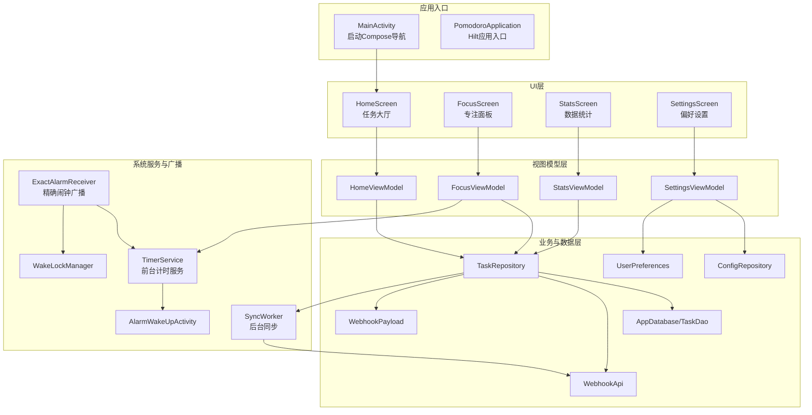
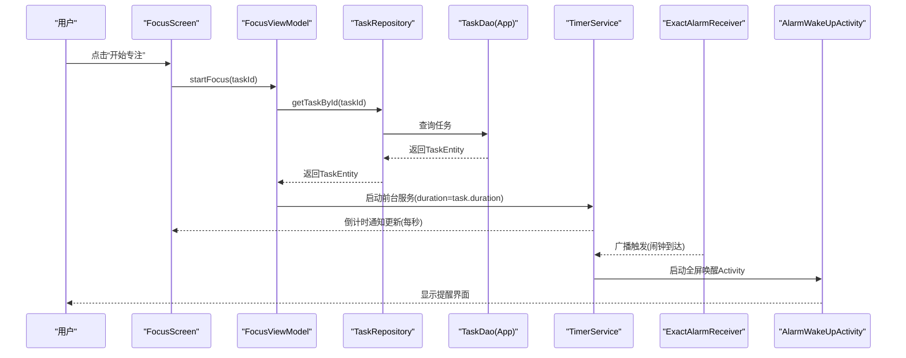
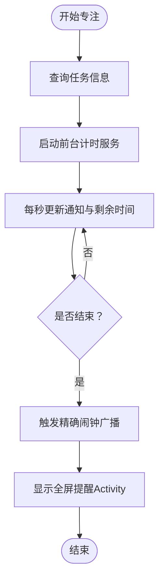
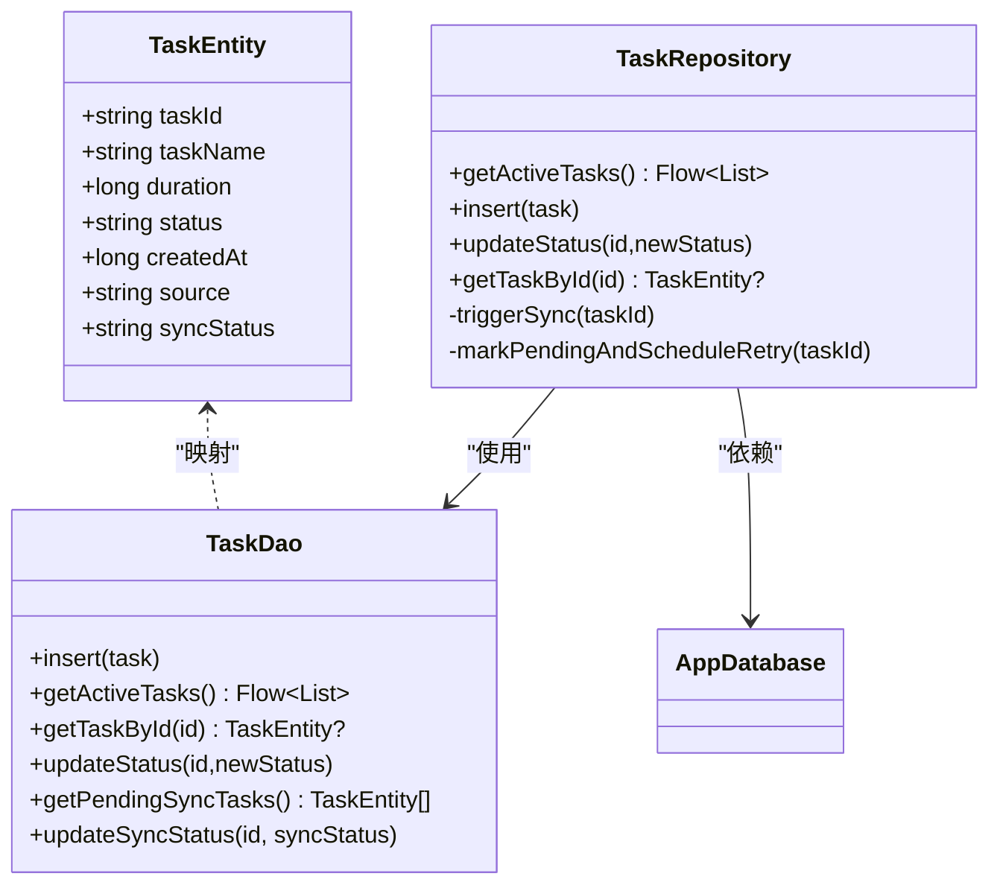
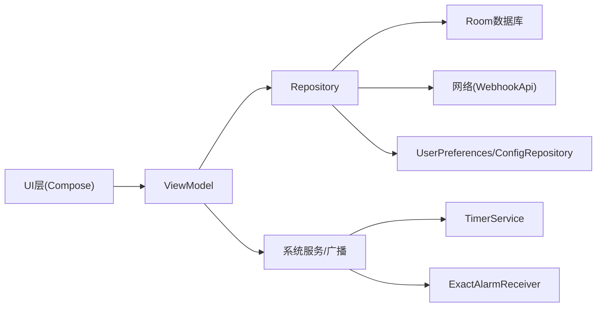

# 核心功能

<cite>
**本文引用的文件**
- [MainActivity.kt](file://app/src/main/java/com/pomodoroalert/MainActivity.kt)
- [PomodoroApplication.kt](file://app/src/main/java/com/pomodoroalert/PomodoroApplication.kt)
- [AppDatabase.kt](file://app/src/main/java/com/pomodoroalert/data/AppDatabase.kt)
- [TaskEntity.kt](file://app/src/main/java/com/pomodoroalert/data/TaskEntity.kt)
- [TaskDao.kt](file://app/src/main/java/com/pomodoroalert/data/TaskDao.kt)
- [TaskRepository.kt](file://app/src/main/java/com/pomodoroalert/data/TaskRepository.kt)
- [ConfigRepository.kt](file://app/src/main/java/com/pomodoroalert/data/ConfigRepository.kt)
- [UserPreferences.kt](file://app/src/main/java/com/pomodoroalert/data/UserPreferences.kt)
- [WebhookPayload.kt](file://app/src/main/java/com/pomodoroalert/data/WebhookPayload.kt)
- [WebhookApi.kt](file://app/src/main/java/com/pomodoroalert/network/WebhookApi.kt)
- [NetworkModule.kt](file://app/src/main/java/com/pomodoroalert/di/NetworkModule.kt)
- [TimerService.kt](file://app/src/main/java/com/pomodoroalert/service/TimerService.kt)
- [ExactAlarmReceiver.kt](file://app/src/main/java/com/pomodoroalert/receiver/ExactAlarmReceiver.kt)
- [WakeLockManager.kt](file://app/src/main/java/com/pomodoroalert/receiver/WakeLockManager.kt)
- [AlarmWakeUpActivity.kt](file://app/src/main/java/com/pomodoroalert/ui/AlarmWakeUpActivity.kt)
- [HomeScreen.kt](file://app/src/main/java/com/pomodoroalert/ui/sreens/HomeScreen.kt)
- [FocusScreen.kt](file://app/src/main/java/com/pomodoroalert/ui/sreens/FocusScreen.kt)
- [SettingsScreen.kt](file://app/src/main/java/com/pomodoroalert/ui/sreens/SettingsScreen.kt)
- [StatsScreen.kt](file://app/src/main/java/com/pomodoroalert/ui/sreens/StatsScreen.kt)
- [HomeViewModel.kt](file://app/src/main/java/com/pomodoroalert/ui/viewmodel/HomeViewModel.kt)
- [FocusViewModel.kt](file://app/src/main/java/com/pomodoroalert/ui/viewmodel/FocusViewModel.kt)
- [SettingsViewModel.kt](file://app/src/main/java/com/pomodoroalert/ui/viewmodel/SettingsViewModel.kt)
- [StatsViewModel.kt](file://app/src/main/java/com/pomodoroalert/ui/viewmodel/StatsViewModel.kt)
- [SyncWorker.kt](file://app/src/main/java/com/pomodoroalert/worker/SyncWorker.kt)
- [IndependentAlarmReceiver.kt](file://app/src/main/java/com/pomodoroalert/receiver/IndependentAlarmReceiver.kt)
- [AlarmScreen.kt](file://app/src/main/java/com/pomodoroalert/ui/screens/AlarmScreen.kt)
- [独立闹钟系统.md](file://.qoder/repowiki/zh/content/核心功能/独立闹钟系统.md)
</cite>

## 目录
1. [简介](#简介)
2. [项目结构](#项目结构)
3. [核心组件](#核心组件)
4. [架构总览](#架构总览)
5. [详细组件分析](#详细组件分析)
6. [独立闹钟系统](#独立闹钟系统)
7. [依赖分析](#依赖分析)
8. [性能考虑](#性能考虑)
9. [故障排除指南](#故障排除指南)
10. [结论](#结论)
11. [附录](#附录)

## 简介
本文件面向PomodoroAlert的核心功能模块，围绕专注计时系统、任务管理、数据统计与设置配置展开，系统性阐述用户交互流程、业务逻辑实现、关键设计点、模块协作关系与数据流转，并提供使用示例、配置项说明、性能优化建议与故障排除指引。

## 项目结构
应用采用Compose + ViewModel + Hilt + Room + WorkManager + 系统广播/前台服务的现代Android架构。UI层通过导航图组织页面；业务层由各ViewModel协调Repository；数据持久化基于Room；网络同步通过WorkManager调度的后台Worker执行；计时与闹钟通过前台服务与精确闹钟广播实现。

图表来源
- [MainActivity.kt:11-22](file://app/src/main/java/com/pomodoroalert/MainActivity.kt#L11-L22)
- [PomodoroApplication.kt:6-7](file://app/src/main/java/com/pomodoroalert/PomodoroApplication.kt#L6-L7)
- [HomeScreen.kt:48-204](file://app/src/main/java/com/pomodoroalert/ui/sreens/HomeScreen.kt#L48-L204)
- [FocusScreen.kt:16-69](file://app/src/main/java/com/pomodoroalert/ui/sreens/FocusScreen.kt#L16-L69)
- [StatsScreen.kt:15-58](file://app/src/main/java/com/pomodoroalert/ui/sreens/StatsScreen.kt#L15-L58)
- [SettingsScreen.kt:15-61](file://app/src/main/java/com/pomodoroalert/ui/sreens/SettingsScreen.kt#L15-L61)
- [HomeViewModel.kt:15-52](file://app/src/main/java/com/pomodoroalert/ui/viewmodel/HomeViewModel.kt#L15-L52)
- [FocusViewModel.kt:21-84](file://app/src/main/java/com/pomodoroalert/ui/viewmodel/FocusViewModel.kt#L21-L84)
- [StatsViewModel.kt](file://app/src/main/java/com/pomodoroalert/ui/viewmodel/StatsViewModel.kt)
- [SettingsViewModel.kt](file://app/src/main/java/com/pomodoroalert/ui/viewmodel/SettingsViewModel.kt)
- [TaskRepository.kt:19-100](file://app/src/main/java/com/pomodoroalert/data/TaskRepository.kt#L19-L100)
- [AppDatabase.kt:6-9](file://app/src/main/java/com/pomodoroalert/data/AppDatabase.kt#L6-L9)
- [TaskDao.kt:9-28](file://app/src/main/java/com/pomodoroalert/data/TaskDao.kt#L9-L28)
- [TimerService.kt:24-102](file://app/src/main/java/com/pomodoroalert/service/TimerService.kt#L24-L102)
- [ExactAlarmReceiver.kt:13-47](file://app/src/main/java/com/pomodoroalert/receiver/ExactAlarmReceiver.kt#L13-L47)
- [SyncWorker.kt:15-77](file://app/src/main/java/com/pomodoroalert/worker/SyncWorker.kt#L15-L77)

章节来源
- [MainActivity.kt:11-22](file://app/src/main/java/com/pomodoroalert/MainActivity.kt#L11-L22)
- [PomodoroApplication.kt:6-7](file://app/src/main/java/com/pomodoroalert/PomodoroApplication.kt#L6-L7)

## 核心组件
- 专注计时系统：以前台服务驱动倒计时，结合精确闹钟广播触发提醒，支持暂停/继续与前台通知更新。
- 任务管理：基于Room的任务实体与DAO，提供增删改查、状态变更与同步标记；通过Repository统一协调数据库与网络同步。
- 数据统计：统计“今日完成番茄数”和“今日完成任务数”，通过ViewModel聚合Repository数据。
- 设置配置：提供“耳机模式”开关与“默认专注时长（分钟）”滑条，保存于UserPreferences并通过ConfigRepository暴露。
- 独立闹钟系统：支持设置不依赖任务的准时闹钟，具备全屏提醒与推迟逻辑。

章节来源
- [TimerService.kt:24-102](file://app/src/main/java/com/pomodoroalert/service/TimerService.kt#L24-L102)
- [TaskEntity.kt:8-18](file://app/src/main/java/com/pomodoroalert/data/TaskEntity.kt#L8-L18)
- [TaskDao.kt:9-28](file://app/src/main/java/com/pomodoroalert/data/TaskDao.kt#L9-L28)
- [TaskRepository.kt:19-100](file://app/src/main/java/com/pomodoroalert/data/TaskRepository.kt#L19-L100)
- [StatsScreen.kt:15-58](file://app/src/main/java/com/pomodoroalert/ui/sreens/StatsScreen.kt#L15-L58)
- [SettingsScreen.kt:15-61](file://app/src/main/java/com/pomodoroalert/ui/sreens/SettingsScreen.kt#L15-L61)

## 架构总览
应用遵循MVVM分层与依赖注入，UI通过ViewModel响应用户交互；ViewModel调用Repository；Repository访问数据库与网络；系统服务与广播负责跨进程/跨生命周期的计时与提醒。

图表来源
- [FocusScreen.kt:16-69](file://app/src/main/java/com/pomodoroalert/ui/sreens/FocusScreen.kt#L16-L69)
- [FocusViewModel.kt:32-46](file://app/src/main/java/com/pomodoroalert/ui/viewmodel/FocusViewModel.kt#L32-L46)
- [TaskRepository.kt:40-41](file://app/src/main/java/com/pomodoroalert/data/TaskRepository.kt#L40-L41)
- [TimerService.kt:38-66](file://app/src/main/java/com/pomodoroalert/service/TimerService.kt#L38-L66)
- [ExactAlarmReceiver.kt:14-25](file://app/src/main/java/com/pomodoroalert/receiver/ExactAlarmReceiver.kt#L14-L25)
- [AlarmWakeUpActivity.kt](file://app/src/main/java/com/pomodoroalert/ui/AlarmWakeUpActivity.kt)

## 详细组件分析

### 专注计时系统
- 用户交互流程
  - 在任务大厅选择任务，进入专注面板。
  - 点击“开始专注”后，ViewModel根据任务ID查询任务并启动前台计时服务。
  - 服务每秒更新通知与剩余时间，直至时间归零。
  - 到时通过精确闹钟广播触发全屏提醒Activity。
- 关键技术点
  - 前台服务：持续运行并显示通知，避免被系统回收。
  - 精确闹钟：使用系统闹钟精确触发，支持“允许在电池优化下运行”的场景。
  - 唤醒锁：广播接收器短暂持有唤醒锁，确保提醒可见。
  - 完成/放弃/推迟：更新任务状态并停止服务；推迟时重新设置精确闹钟。
- 数据流转
  - UI层 -> ViewModel -> Repository -> DAO/数据库 -> Service -> 系统服务 -> UI提醒

图表来源
- [FocusViewModel.kt:32-46](file://app/src/main/java/com/pomodoroalert/ui/viewmodel/FocusViewModel.kt#L32-L46)
- [TimerService.kt:46-66](file://app/src/main/java/com/pomodoroalert/service/TimerService.kt#L46-L66)
- [ExactAlarmReceiver.kt:14-25](file://app/src/main/java/com/pomodoroalert/receiver/ExactAlarmReceiver.kt#L14-L25)

章节来源
- [FocusScreen.kt:16-69](file://app/src/main/java/com/pomodoroalert/ui/sreens/FocusScreen.kt#L16-L69)
- [FocusViewModel.kt:21-84](file://app/src/main/java/com/pomodoroalert/ui/viewmodel/FocusViewModel.kt#L21-L84)
- [TimerService.kt:24-102](file://app/src/main/java/com/pomodoroalert/service/TimerService.kt#L24-L102)
- [ExactAlarmReceiver.kt:13-47](file://app/src/main/java/com/pomodoroalert/receiver/ExactAlarmReceiver.kt#L13-L47)
- [WakeLockManager.kt](file://app/src/main/java/com/pomodoroalert/receiver/WakeLockManager.kt)

### 任务管理
- 功能要点
  - 新建任务：从设置读取默认专注时长，写入数据库。
  - 活跃任务列表：按创建时间倒序展示未放弃任务。
  - 状态变更：完成/放弃/推迟均会触发一次同步流程。
  - 同步机制：成功则标记为已同步；失败或异常则标记为待同步并调度后台Worker重试。
- 数据模型
  - 任务实体包含主键、任务名、时长、状态、创建时间、来源与同步状态字段。

图表来源
- [TaskEntity.kt:8-18](file://app/src/main/java/com/pomodoroalert/data/TaskEntity.kt#L8-L18)
- [TaskDao.kt:9-28](file://app/src/main/java/com/pomodoroalert/data/TaskDao.kt#L9-L28)
- [TaskRepository.kt:19-100](file://app/src/main/java/com/pomodoroalert/data/TaskRepository.kt#L19-L100)
- [AppDatabase.kt:6-9](file://app/src/main/java/com/pomodoroalert/data/AppDatabase.kt#L6-L9)

章节来源
- [HomeViewModel.kt:26-51](file://app/src/main/java/com/pomodoroalert/ui/viewmodel/HomeViewModel.kt#L26-L51)
- [TaskRepository.kt:32-80](file://app/src/main/java/com/pomodoroalert/data/TaskRepository.kt#L32-L80)
- [TaskDao.kt:14-27](file://app/src/main/java/com/pomodoroalert/data/TaskDao.kt#L14-L27)

### 数据统计
- 统计内容
  - 今日完成番茄数
  - 今日完成任务数
- 数据来源
  - 通过StatsViewModel订阅Repository提供的聚合数据流，界面实时刷新。

章节来源
- [StatsScreen.kt:15-58](file://app/src/main/java/com/pomodoroalert/ui/sreens/StatsScreen.kt#L15-L58)
- [StatsViewModel.kt](file://app/src/main/java/com/pomodoroalert/ui/viewmodel/StatsViewModel.kt)

### 设置配置
- 配置项
  - 耳机模式：仅在耳机内播报语音。
  - 默认专注时长：5–60分钟滑条，保存于UserPreferences并通过ConfigRepository暴露。
- 使用方式
  - 在设置页切换耳机模式与调整专注时长，HomeViewModel新建任务时读取默认值。

章节来源
- [SettingsScreen.kt:15-61](file://app/src/main/java/com/pomodoroalert/ui/sreens/SettingsScreen.kt#L15-L61)
- [SettingsViewModel.kt](file://app/src/main/java/com/pomodoroalert/ui/viewmodel/SettingsViewModel.kt)
- [HomeViewModel.kt:38-50](file://app/src/main/java/com/pomodoroalert/ui/viewmodel/HomeViewModel.kt#L38-L50)
- [ConfigRepository.kt](file://app/src/main/java/com/pomodoroalert/data/ConfigRepository.kt)
- [UserPreferences.kt](file://app/src/main/java/com/pomodoroalert/data/UserPreferences.kt)

### 独立闹钟系统
- 实现细节：基于 `AlarmManager` 的精确闹钟系统。
- 交互界面：提供独立设置页，通过 `IndependentAlarmReceiver` 触发 `AlarmWakeUpActivity`。
- 详见文档：[独立闹钟系统.md](file://.qoder/repowiki/zh/content/核心功能/独立闹钟系统.md)

## 依赖分析
- 组件耦合
  - UI层仅依赖ViewModel的StateFlow，低耦合高内聚。
  - ViewModel依赖Repository接口，便于替换实现与测试。
  - Repository依赖数据库与网络模块，职责清晰。
- 外部依赖
  - Hilt提供依赖注入，减少样板代码。
  - WorkManager用于弱网络条件下的重试与幂等同步。
  - Room提供本地持久化与流式查询。

图表来源
- [HomeViewModel.kt:15-52](file://app/src/main/java/com/pomodoroalert/ui/viewmodel/HomeViewModel.kt#L15-L52)
- [FocusViewModel.kt:21-84](file://app/src/main/java/com/pomodoroalert/ui/viewmodel/FocusViewModel.kt#L21-L84)
- [TaskRepository.kt:19-100](file://app/src/main/java/com/pomodoroalert/data/TaskRepository.kt#L19-L100)
- [TimerService.kt:24-102](file://app/src/main/java/com/pomodoroalert/service/TimerService.kt#L24-L102)
- [ExactAlarmReceiver.kt:13-47](file://app/src/main/java/com/pomodoroalert/receiver/ExactAlarmReceiver.kt#L13-L47)

## 性能考虑
- 前台服务与通知
  - 使用前台服务降低被回收概率，保持倒计时连续性。
  - 通知按秒更新，建议在UI层节流渲染，避免过度重组。
- 精确闹钟
  - 使用“精确闹钟+允许在电池优化下运行”策略，保证提醒可达。
  - 广播接收器内仅做轻量工作，尽快释放唤醒锁。
- 数据库与流
  - Room查询返回Flow，避免阻塞主线程；在ViewModel层收集状态，避免重复查询。
- 网络同步
  - 失败时标记待同步并调度WorkManager，利用约束（如联网）自动重试，降低功耗与流量消耗。
- 内存与生命周期
  - ViewModel持有协程作用域，注意在销毁时取消任务，防止泄漏。

## 故障排除指南
- 无法收到提醒
  - 检查系统设置中的“电池优化”是否允许应用在后台运行。
  - 确认已授予“显示悬浮窗/全屏提醒”权限。
  - 查看通知渠道是否存在且未被禁用。
- 倒计时不更新
  - 确认前台服务已启动且通知未被误删。
  - 检查是否频繁点击“推迟/放弃”，导致服务提前停止。
- 同步失败
  - 查看待同步任务列表，确认网络可用后等待WorkManager重试。
  - 检查Webhook地址与鉴权配置。
- 任务状态异常
  - 若状态未更新，检查Repository的updateStatus调用链路与数据库事务。

章节来源
- [TimerService.kt:38-87](file://app/src/main/java/com/pomodoroalert/service/TimerService.kt#L38-L87)
- [ExactAlarmReceiver.kt:14-47](file://app/src/main/java/com/pomodoroalert/receiver/ExactAlarmReceiver.kt#L14-L47)
- [TaskRepository.kt:82-94](file://app/src/main/java/com/pomodoroalert/data/TaskRepository.kt#L82-L94)
- [SyncWorker.kt:24-71](file://app/src/main/java/com/pomodoroalert/worker/SyncWorker.kt#L24-L71)

## 结论
PomodoroAlert通过清晰的MVVM分层、Room本地存储、WorkManager异步同步与系统前台服务/广播，构建了稳定可靠的专注计时体验。设置与统计模块提供了良好的可配置性与可观测性。建议在后续版本中完善更多统计维度、增强语音播报个性化与离线能力。

## 附录

### 使用示例与操作指南
- 添加任务并开始专注
  - 在首页输入任务名，点击“添加任务”生成默认时长任务。
  - 在任务卡片点击“开始专注”，进入专注面板查看倒计时。
  - 可选择“完成”、“推迟10分钟”或“放弃”。
- 查看统计
  - 在首页点击“数据统计”，查看今日完成番茄数与任务数。
- 配置偏好
  - 在首页点击“偏好设置”，开启耳机模式或调整默认专注时长。

章节来源
- [HomeScreen.kt:116-178](file://app/src/main/java/com/pomodoroalert/ui/sreens/HomeScreen.kt#L116-L178)
- [FocusScreen.kt:48-67](file://app/src/main/java/com/pomodoroalert/ui/sreens/FocusScreen.kt#L48-L67)
- [StatsScreen.kt:15-58](file://app/src/main/java/com/pomodoroalert/ui/sreens/StatsScreen.kt#L15-L58)
- [SettingsScreen.kt:15-61](file://app/src/main/java/com/pomodoroalert/ui/sreens/SettingsScreen.kt#L15-L61)

### 配置选项与自定义参数
- 耳机模式：控制语音播报范围。
- 默认专注时长：5–60分钟，影响新建任务的初始时长。
- 触发来源：手动/语音/日历，用于统计与同步payload。
- 同步策略：失败自动重试，联网后自动补传。

章节来源
- [SettingsScreen.kt:28-54](file://app/src/main/java/com/pomodoroalert/ui/sreens/SettingsScreen.kt#L28-L54)
- [HomeViewModel.kt:38-50](file://app/src/main/java/com/pomodoroalert/ui/viewmodel/HomeViewModel.kt#L38-L50)
- [TaskEntity.kt:10-17](file://app/src/main/java/com/pomodoroalert/data/TaskEntity.kt#L10-L17)
- [TaskRepository.kt:47-66](file://app/src/main/java/com/pomodoroalert/data/TaskRepository.kt#L47-L66)