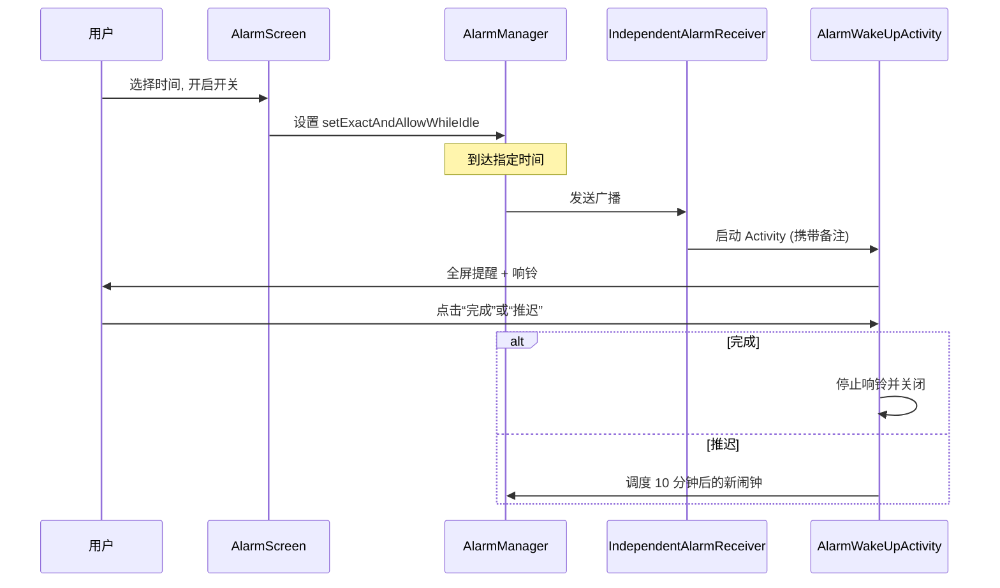

# 独立闹钟系统

<cite>
**本文引用的文件**
- [IndependentAlarmReceiver.kt](file://app/src/main/java/com/pomodoroalert/receiver/IndependentAlarmReceiver.kt)
- [AlarmScreen.kt](file://app/src/main/java/com/pomodoroalert/ui/screens/AlarmScreen.kt)
- [AlarmWakeUpActivity.kt](file://app/src/main/java/com/pomodoroalert/ui/AlarmWakeUpActivity.kt)
- [AppNavGraph.kt](file://app/src/main/java/com/pomodoroalert/ui/AppNavGraph.kt)
- [HomeScreen.kt](file://app/src/main/java/com/pomodoroalert/ui/screens/HomeScreen.kt)
</cite>

## 目录
1. [简介](#简介)
2. [项目结构](#项目结构)
3. [核心组件](#核心组件)
4. [逻辑流程](#逻辑流程)
5. [详细组件分析](#详细组件分析)
6. [注意事项](#注意事项)

## 简介
独立闹钟系统是 PomodoroAlert 除了核心番茄钟任务之外的一项补充功能。它允许用户设置一个不与特定任务挂钩的定时闹钟，用于准时提醒重要事项。该系统利用 Android 的 `AlarmManager` 实现高精度触发，并结合 `AlarmWakeUpActivity` 实现全屏亮屏提醒。

## 项目结构
闹钟功能涉及以下组件：
- **UI 层**：`AlarmScreen.kt` (设置界面)，`AlarmWakeUpActivity.kt` (触发后的全屏界面)。
- **广播接收层**：`IndependentAlarmReceiver.kt` (接收系统闹钟广播并启动提醒)。
- **导航控制**：`AppNavGraph.kt` (配置 `alarm` 路由)。

## 核心组件
- **AlarmScreen**：提供可视化时间选择（TimePickerDialog）、备注编辑和控制开关。
- **IndependentAlarmReceiver**：核心分发器，负责创建通知通道、构造全屏意图并启动提醒 Activity。
- **AlarmWakeUpActivity**：在闹钟时间到达时启动，播放环绕音效，显示自定义备注，并提供“完成”和“推迟 10 分钟”功能。

## 逻辑流程
下图展示了闹钟从设置到触发的完整生命周期：

## 详细组件分析

### 1. AlarmScreen (UI 设置)
- **状态管理**：使用 `SharedPreferences` 持久化保存小时、分钟、备注以及是否启用的状态。
- **动态 UI**：开启/关闭状态会改变背景颜色和阴影深浅，体现“激活”视觉感。
- **权限处理**：在高级版本的 Android 中，需确保 `SCHEDULE_EXACT_ALARM` 权限（当前代码中有对应的 try-catch 保护）。

### 2. IndependentAlarmReceiver (中间层)
- **通知配置**：创建 `independent_alarm_channel` 通道，并设置 `IMPORTANCE_HIGH` 以支持悬浮通知。
- **唤醒锁**：通过 `WakeLockManager` 获取短暂的唤醒锁，确保在亮屏前屏幕能够被点亮。
- **全屏意图**：设置 `fullScreenIntent` 属性，这是保证锁屏状态下能弹出界面的关键。

### 3. AlarmWakeUpActivity (提醒层)
- **音效播放**：使用 `MediaPlayer` 循环播放系统默认闹钟铃声（TYPE_ALARM）。
- **逻辑区分**：通过 Intent 里的 `isIndependentAlarm` 标志，将闹钟逻辑与普通的“番茄钟到站”逻辑区分开。
- **推迟机制**：点击“推迟”会再次调用 `AlarmManager` 插入一个当前的 `System.currentTimeMillis() + 10分钟` 的新任务。

## 注意事项
- **精确性**：依赖于 `setExactAndAllowWhileIdle`，受 Android 低功耗模式（Doze）的影响较小，但必须开启系统的“精确闹钟”权限。
- **设备差异**：部分厂商对后台启动 Activity 有严格限制，可能只会显示通知而不会自动亮屏，此时用户需点击通知进入。
- **备注限制**：建议备注不要过长，以免在全屏界面中遮挡操作按钮。
