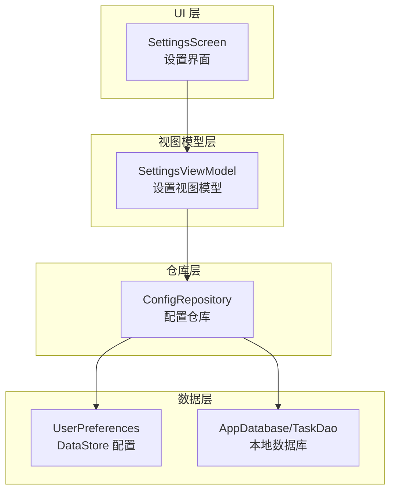
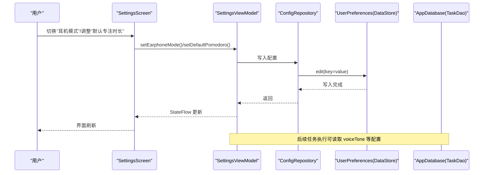
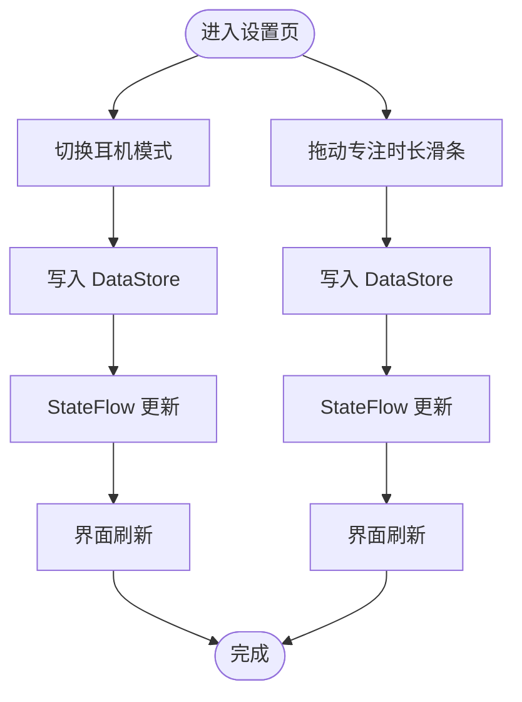
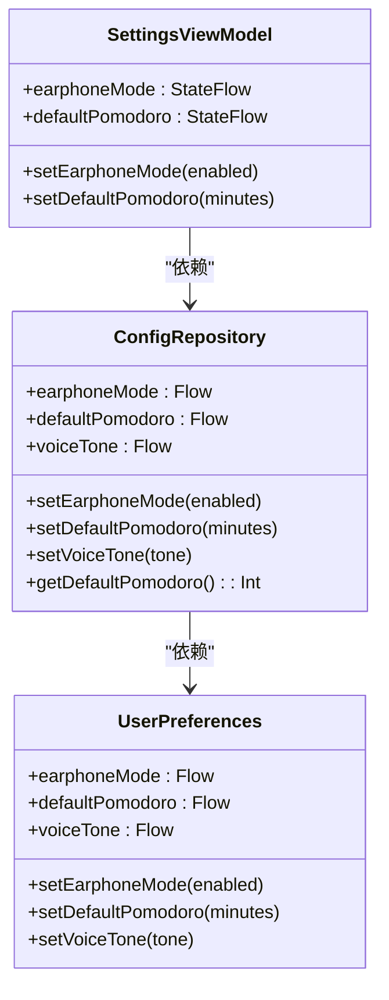
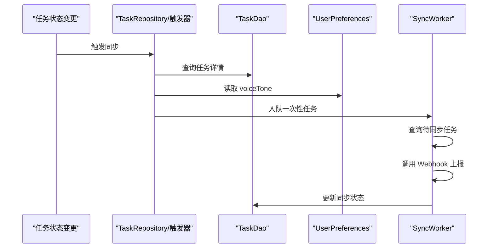
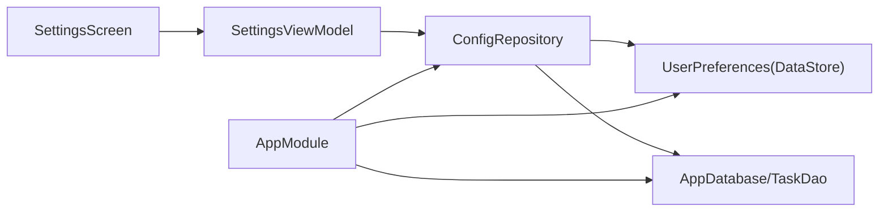

# 设置配置功能

<cite>
**本文引用的文件**
- [SettingsScreen.kt](file://app/src/main/java/com/pomodoroalert/ui/screens/SettingsScreen.kt)
- [SettingsViewModel.kt](file://app/src/main/java/com/pomodoroalert/ui/viewmodel/SettingsViewModel.kt)
- [ConfigRepository.kt](file://app/src/main/java/com/pomodoroalert/data/ConfigRepository.kt)
- [UserPreferences.kt](file://app/src/main/java/com/pomodoroalert/data/UserPreferences.kt)
- [AppModule.kt](file://app/src/main/java/com/pomodoroalert/di/AppModule.kt)
- [AppDatabase.kt](file://app/src/main/java/com/pomodoroalert/data/AppDatabase.kt)
- [TaskEntity.kt](file://app/src/main/java/com/pomodoroalert/data/TaskEntity.kt)
- [TaskDao.kt](file://app/src/main/java/com/pomodoroalert/data/TaskDao.kt)
- [StatsRepository.kt](file://app/src/main/java/com/pomodoroalert/data/StatsRepository.kt)
- [SyncWorker.kt](file://app/src/main/java/com/pomodoroalert/worker/SyncWorker.kt)
- [SpeechInputManager.kt](file://app/src/main/java/com/pomodoroalert/voice/SpeechInputManager.kt)
- [PomodoroApplication.kt](file://app/src/main/java/com/pomodoroalert/PomodoroApplication.kt)
- [AndroidManifest.xml](file://app/src/main/AndroidManifest.xml)
</cite>

## 目录
1. [简介](#简介)
2. [项目结构](#项目结构)
3. [核心组件](#核心组件)
4. [架构总览](#架构总览)
5. [详细组件分析](#详细组件分析)
6. [依赖关系分析](#依赖关系分析)
7. [性能与可用性考量](#性能与可用性考量)
8. [故障排查指南](#故障排查指南)
9. [结论](#结论)
10. [附录](#附录)

## 简介
本文件系统性梳理应用的设置配置功能，覆盖设置界面设计、表单验证与交互流程；设置管理逻辑、状态同步与数据持久化机制；配置存储策略、默认值管理与版本兼容性处理；以及专注时长、休息间隔、通知偏好、主题切换等核心设置项。同时提供配置导入导出、重置恢复与多设备同步的技术建议，以及动态加载、热更新与用户体验优化方案，并给出配置安全性与数据保护的最佳实践。

## 项目结构
设置配置功能涉及 UI 层（Compose）、视图模型层（ViewModel）、仓库层（Repository）与数据层（DataStore/Room）。下图展示设置相关模块的组织与职责：

图表来源
- [SettingsScreen.kt:15-61](file://app/src/main/java/com/pomodoroalert/ui/screens/SettingsScreen.kt#L15-L61)
- [SettingsViewModel.kt:13-30](file://app/src/main/java/com/pomodoroalert/ui/viewmodel/SettingsViewModel.kt#L13-L30)
- [ConfigRepository.kt:7-18](file://app/src/main/java/com/pomodoroalert/data/ConfigRepository.kt#L7-L18)
- [UserPreferences.kt:15-35](file://app/src/main/java/com/pomodoroalert/data/UserPreferences.kt#L15-L35)
- [AppDatabase.kt:6-9](file://app/src/main/java/com/pomodoroalert/data/AppDatabase.kt#L6-L9)

章节来源
- [SettingsScreen.kt:15-61](file://app/src/main/java/com/pomodoroalert/ui/screens/SettingsScreen.kt#L15-L61)
- [SettingsViewModel.kt:13-30](file://app/src/main/java/com/pomodoroalert/ui/viewmodel/SettingsViewModel.kt#L13-L30)
- [ConfigRepository.kt:7-18](file://app/src/main/java/com/pomodoroalert/data/ConfigRepository.kt#L7-L18)
- [UserPreferences.kt:15-35](file://app/src/main/java/com/pomodoroalert/data/UserPreferences.kt#L15-L35)
- [AppModule.kt:19-60](file://app/src/main/java/com/pomodoroalert/di/AppModule.kt#L19-L60)

## 核心组件
- 设置界面（SettingsScreen）
  - 使用 Compose 构建，包含“耳机模式”开关与“默认专注时长（分钟）”滑条，实时显示当前设置值，并提供返回首页按钮。
  - 通过 Hilt 注入 SettingsViewModel，使用 collectAsState 订阅状态流，响应用户交互。
- 设置视图模型（SettingsViewModel）
  - 将 ConfigRepository 的配置流包装为 StateFlow 并设置默认初始值，负责触发配置写入。
  - 提供 setEarphoneMode 与 setDefaultPomodoro 方法，封装协程作用域内的写入操作。
- 配置仓库（ConfigRepository）
  - 暴露配置读取流（Flow<Boolean>/Flow<Int>/Flow<String>），并提供对应的写入方法。
  - 提供辅助方法用于在 ViewModel 中以挂起方式读取当前值。
- 用户偏好（UserPreferences）
  - 基于 DataStore Preferences 实现，定义布尔、整型与字符串键，提供读写接口。
  - 默认值在读取时通过空合并运算符提供，确保首次使用与缺失键时的健壮性。
- 应用模块（AppModule）
  - 通过 Hilt 提供 UserPreferences、ConfigRepository、AppDatabase、TaskDao 等单例依赖。
- 数据库与实体（AppDatabase/TaskDao/TaskEntity）
  - 用于任务持久化与同步状态维护，支持“待同步/已同步”标记，配合后台同步工作。
- 同步工作器（SyncWorker）
  - 轮询待同步任务，调用 Webhook 接口上报，成功则更新同步状态，失败则重试。
- 语音输入（SpeechInputManager）
  - 为任务输入提供语音识别能力，与设置项协同改善用户体验。

章节来源
- [SettingsScreen.kt:15-61](file://app/src/main/java/com/pomodoroalert/ui/screens/SettingsScreen.kt#L15-L61)
- [SettingsViewModel.kt:13-30](file://app/src/main/java/com/pomodoroalert/ui/viewmodel/SettingsViewModel.kt#L13-L30)
- [ConfigRepository.kt:7-18](file://app/src/main/java/com/pomodoroalert/data/ConfigRepository.kt#L7-L18)
- [UserPreferences.kt:15-35](file://app/src/main/java/com/pomodoroalert/data/UserPreferences.kt#L15-L35)
- [AppModule.kt:23-60](file://app/src/main/java/com/pomodoroalert/di/AppModule.kt#L23-L60)
- [AppDatabase.kt:6-9](file://app/src/main/java/com/pomodoroalert/data/AppDatabase.kt#L6-L9)
- [TaskDao.kt:9-28](file://app/src/main/java/com/pomodoroalert/data/TaskDao.kt#L9-L28)
- [TaskEntity.kt:8-18](file://app/src/main/java/com/pomodoroalert/data/TaskEntity.kt#L8-L18)
- [SyncWorker.kt:15-77](file://app/src/main/java/com/pomodoroalert/worker/SyncWorker.kt#L15-L77)
- [SpeechInputManager.kt:13-46](file://app/src/main/java/com/pomodoroalert/voice/SpeechInputManager.kt#L13-L46)

## 架构总览
设置功能遵循 MVVM 架构，UI 通过 ViewModel 访问 Repository，Repository 再访问 DataStore 进行读写。配置变更通过 Flow 自动传播到 UI，形成“写入—持久化—状态流—界面刷新”的闭环。

图表来源
- [SettingsScreen.kt:15-61](file://app/src/main/java/com/pomodoroalert/ui/screens/SettingsScreen.kt#L15-L61)
- [SettingsViewModel.kt:13-30](file://app/src/main/java/com/pomodoroalert/ui/viewmodel/SettingsViewModel.kt#L13-L30)
- [ConfigRepository.kt:7-18](file://app/src/main/java/com/pomodoroalert/data/ConfigRepository.kt#L7-L18)
- [UserPreferences.kt:15-35](file://app/src/main/java/com/pomodoroalert/data/UserPreferences.kt#L15-L35)
- [AppDatabase.kt:6-9](file://app/src/main/java/com/pomodoroalert/data/AppDatabase.kt#L6-L9)

## 详细组件分析

### 设置界面（SettingsScreen）
- 设计要点
  - 使用卡片容器组织设置项，耳机模式采用开关控件，专注时长采用滑条，步进范围覆盖 5~60 分钟。
  - 通过 Material3 主题与对齐布局保证一致性与可读性。
- 用户交互
  - 开关与滑条直接绑定 ViewModel 的 setter 方法，无需额外校验，即时生效。
  - 当前专注时长文本随滑条变化实时更新，提升反馈体验。
- 表单验证
  - 当前未实现显式校验逻辑，但滑条限制了取值范围，避免非法输入。
  - 若需扩展，可在 ViewModel 或 Repository 层增加范围校验与异常处理。

图表来源
- [SettingsScreen.kt:15-61](file://app/src/main/java/com/pomodoroalert/ui/screens/SettingsScreen.kt#L15-L61)
- [SettingsViewModel.kt:13-30](file://app/src/main/java/com/pomodoroalert/ui/viewmodel/SettingsViewModel.kt#L13-L30)
- [UserPreferences.kt:15-35](file://app/src/main/java/com/pomodoroalert/data/UserPreferences.kt#L15-L35)

章节来源
- [SettingsScreen.kt:15-61](file://app/src/main/java/com/pomodoroalert/ui/screens/SettingsScreen.kt#L15-L61)

### 设置视图模型（SettingsViewModel）
- 状态暴露
  - 将 ConfigRepository 的配置流转换为 StateFlow，并设置默认初始值，确保首次订阅即有稳定值。
- 写入流程
  - 在 viewModelScope 中启动协程，调用 Repository 的写入方法，避免主线程阻塞。
- 可扩展点
  - 可增加参数校验、异常捕获与回滚策略，增强健壮性。

图表来源
- [SettingsViewModel.kt:13-30](file://app/src/main/java/com/pomodoroalert/ui/viewmodel/SettingsViewModel.kt#L13-L30)
- [ConfigRepository.kt:7-18](file://app/src/main/java/com/pomodoroalert/data/ConfigRepository.kt#L7-L18)
- [UserPreferences.kt:15-35](file://app/src/main/java/com/pomodoroalert/data/UserPreferences.kt#L15-L35)

章节来源
- [SettingsViewModel.kt:13-30](file://app/src/main/java/com/pomodoroalert/ui/viewmodel/SettingsViewModel.kt#L13-L30)

### 配置仓库（ConfigRepository）
- 职责
  - 对外暴露配置读取流，对内委托 UserPreferences 完成读写。
  - 提供写入方法与辅助读取方法，便于 ViewModel 获取当前值。
- 默认值与兼容性
  - 默认值由 UserPreferences 在读取时提供，确保新字段或缺失键时的兼容性。
- 版本升级建议
  - 新增字段时应保持默认值策略一致；对旧字段迁移可通过读取时的空合并与一次性写回实现平滑过渡。

章节来源
- [ConfigRepository.kt:7-18](file://app/src/main/java/com/pomodoroalert/data/ConfigRepository.kt#L7-L18)
- [UserPreferences.kt:15-35](file://app/src/main/java/com/pomodoroalert/data/UserPreferences.kt#L15-L35)

### 用户偏好（UserPreferences）
- 存储介质
  - 基于 DataStore Preferences，具备线程安全、异步写入与原子性特性。
- 键与默认值
  - 定义布尔、整型、字符串三类键，读取时通过空合并提供默认值，避免崩溃。
- 性能与可靠性
  - DataStore 采用 Kotlin Flow，读写非阻塞；建议在 ViewModel 中合理使用 stateIn 控制订阅生命周期。

章节来源
- [UserPreferences.kt:15-35](file://app/src/main/java/com/pomodoroalert/data/UserPreferences.kt#L15-L35)

### 数据库与同步（AppDatabase/TaskDao/TaskEntity/SyncWorker）
- 任务持久化
  - TaskEntity 定义任务字段与同步状态；TaskDao 提供插入、查询、状态更新与待同步任务检索。
- 同步机制
  - SyncWorker 轮询待同步任务，调用 Webhook 接口上报，成功更新为“已同步”，失败则标记“待同步”并调度重试。
- 配置联动
  - 任务触发同步时会读取 voiceTone 等配置，体现设置项对业务流程的影响。

图表来源
- [TaskEntity.kt:8-18](file://app/src/main/java/com/pomodoroalert/data/TaskEntity.kt#L8-L18)
- [TaskDao.kt:9-28](file://app/src/main/java/com/pomodoroalert/data/TaskDao.kt#L9-L28)
- [SyncWorker.kt:15-77](file://app/src/main/java/com/pomodoroalert/worker/SyncWorker.kt#L15-L77)

章节来源
- [AppDatabase.kt:6-9](file://app/src/main/java/com/pomodoroalert/data/AppDatabase.kt#L6-L9)
- [TaskEntity.kt:8-18](file://app/src/main/java/com/pomodoroalert/data/TaskEntity.kt#L8-L18)
- [TaskDao.kt:9-28](file://app/src/main/java/com/pomodoroalert/data/TaskDao.kt#L9-L28)
- [SyncWorker.kt:15-77](file://app/src/main/java/com/pomodoroalert/worker/SyncWorker.kt#L15-L77)

## 依赖关系分析
- 依赖注入
  - AppModule 提供 UserPreferences、ConfigRepository、AppDatabase、TaskDao 等单例，确保全局一致的配置与数据访问。
- 组件耦合
  - SettingsScreen 仅依赖 SettingsViewModel；SettingsViewModel 仅依赖 ConfigRepository；ConfigRepository 仅依赖 UserPreferences，耦合清晰，职责单一。
- 外部依赖
  - DataStore、WorkManager、Room、Hilt 等框架组件通过 DI 注入，降低硬编码与测试难度。

图表来源
- [AppModule.kt:23-60](file://app/src/main/java/com/pomodoroalert/di/AppModule.kt#L23-L60)
- [SettingsScreen.kt:15-61](file://app/src/main/java/com/pomodoroalert/ui/screens/SettingsScreen.kt#L15-L61)
- [SettingsViewModel.kt:13-30](file://app/src/main/java/com/pomodoroalert/ui/viewmodel/SettingsViewModel.kt#L13-L30)
- [ConfigRepository.kt:7-18](file://app/src/main/java/com/pomodoroalert/data/ConfigRepository.kt#L7-L18)
- [UserPreferences.kt:15-35](file://app/src/main/java/com/pomodoroalert/data/UserPreferences.kt#L15-L35)
- [AppDatabase.kt:6-9](file://app/src/main/java/com/pomodoroalert/data/AppDatabase.kt#L6-L9)

章节来源
- [AppModule.kt:19-60](file://app/src/main/java/com/pomodoroalert/di/AppModule.kt#L19-L60)

## 性能与可用性考量
- 状态流与订阅
  - 使用 stateIn 控制共享策略与生命周期，避免过度订阅导致的内存压力。
- 写入批量化
  - 对频繁变更的设置项（如滑条）可考虑节流/去抖，减少 DataStore 写入频率。
- 默认值与兼容性
  - 新增设置项时统一提供默认值，避免因键缺失引发的异常路径。
- 同步与网络
  - 同步工作器基于网络约束调度，失败自动重试，保障最终一致性。
- 语音输入体验
  - SpeechInputManager 提供监听与错误反馈，建议在设置页增加语音输入入口以提升易用性。

章节来源
- [SettingsViewModel.kt:17-21](file://app/src/main/java/com/pomodoroalert/ui/viewmodel/SettingsViewModel.kt#L17-L21)
- [UserPreferences.kt:22-24](file://app/src/main/java/com/pomodoroalert/data/UserPreferences.kt#L22-L24)
- [SyncWorker.kt:24-71](file://app/src/main/java/com/pomodoroalert/worker/SyncWorker.kt#L24-L71)
- [SpeechInputManager.kt:13-46](file://app/src/main/java/com/pomodoroalert/voice/SpeechInputManager.kt#L13-L46)

## 故障排查指南
- 设置不生效
  - 检查 DataStore 是否成功写入（确认 edit 回调与异常日志）。
  - 确认 StateFlow 订阅是否正确（collectAsState 是否在 UI 中使用）。
- 默认值异常
  - 核对 UserPreferences 中的默认值策略与键名是否匹配。
- 同步失败
  - 查看 SyncWorker 的网络请求与返回码；检查待同步任务状态是否被正确更新。
- 权限问题
  - 确认应用声明必要权限（如通知、录音、日历等），并在运行时按需申请。

章节来源
- [UserPreferences.kt:26-34](file://app/src/main/java/com/pomodoroalert/data/UserPreferences.kt#L26-L34)
- [SyncWorker.kt:57-71](file://app/src/main/java/com/pomodoroalert/worker/SyncWorker.kt#L57-L71)
- [AndroidManifest.xml:4-9](file://app/src/main/AndroidManifest.xml#L4-L9)

## 结论
设置配置功能以 DataStore 为核心，结合 MVVM 与 Hilt DI，实现了简洁可靠的配置读写与状态同步。当前已覆盖“耳机模式”与“默认专注时长”两大核心设置项，并通过 Flow 与协程保障了界面的实时响应。后续可在表单校验、导入导出、多设备同步与热更新等方面进一步增强，以满足更复杂的个性化与企业级需求。

## 附录

### 核心设置项清单与说明
- 耳机模式（Boolean）
  - 作用：控制音频播报是否仅在耳机连接时触发。
  - 默认值：启用。
- 默认专注时长（Int，单位：分钟）
  - 作用：作为新建任务的默认时长。
  - 默认值：25 分钟。
- 语音音色（String）
  - 作用：影响任务完成/放弃等事件播报的音色标识。
  - 默认值：“default”。

章节来源
- [UserPreferences.kt:22-24](file://app/src/main/java/com/pomodoroalert/data/UserPreferences.kt#L22-L24)
- [ConfigRepository.kt:8-10](file://app/src/main/java/com/pomodoroalert/data/ConfigRepository.kt#L8-L10)

### 功能扩展建议（概念性）
- 导入/导出
  - 建议将当前所有配置项序列化为 JSON 文件，提供导入/导出接口；注意敏感信息脱敏。
- 重置/恢复
  - 提供一键恢复默认值功能，删除 DataStore 中对应键或回退到默认值。
- 多设备同步
  - 基于云端账号体系，将配置上传至服务器，设备启动时拉取最新配置；冲突时采用“服务端优先/最后修改者优先”策略。
- 动态加载与热更新
  - 通过远程配置中心下发设置开关与阈值，客户端定期拉取并以 stateIn 方式应用，避免重启生效。
- 主题切换
  - 建议新增深浅主题键，结合 Material3 动态颜色与 DataStore 持久化，实现无缝切换。
- 通知偏好
  - 增加通知渠道分组、震动/铃声选择、免打扰时段等细粒度控制项。

[本节为概念性内容，不直接分析具体源文件，故无“章节来源”与“图表来源”]