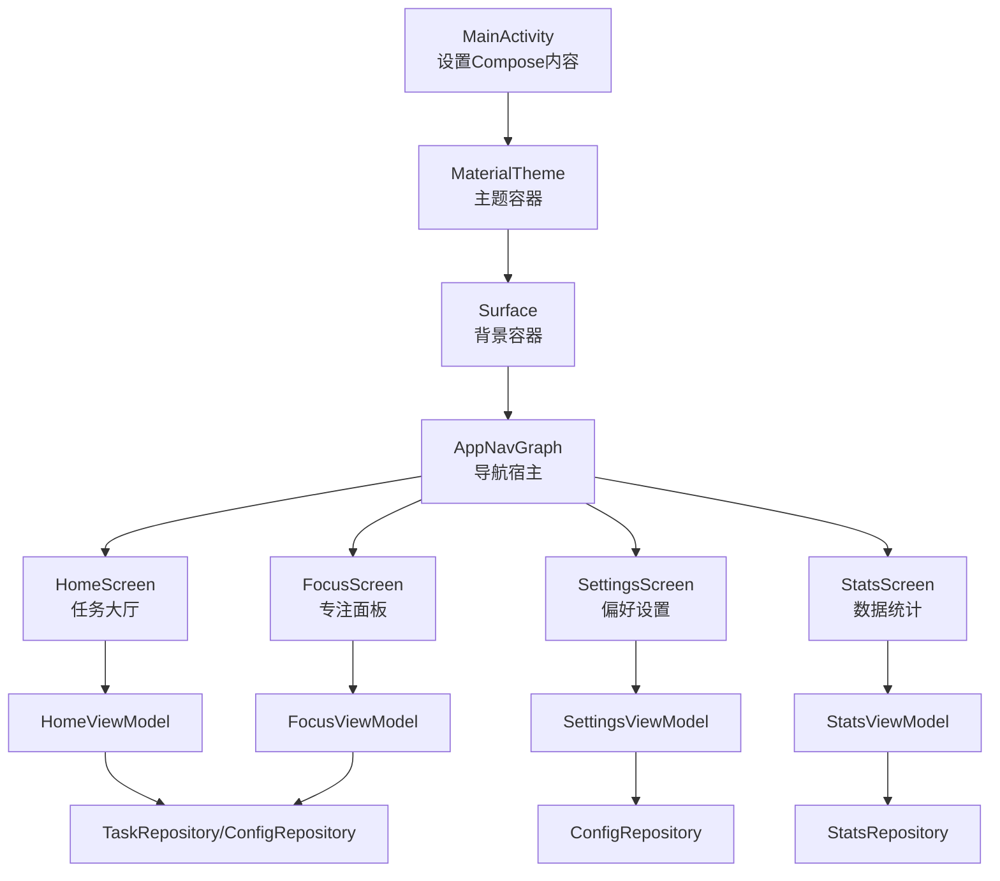
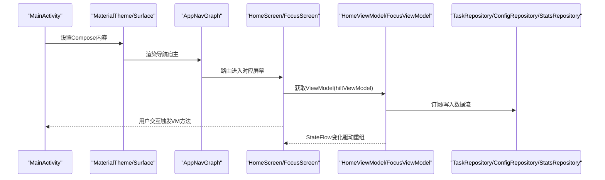
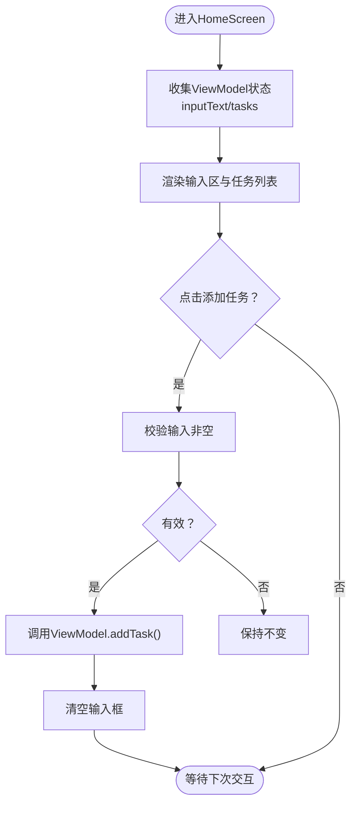
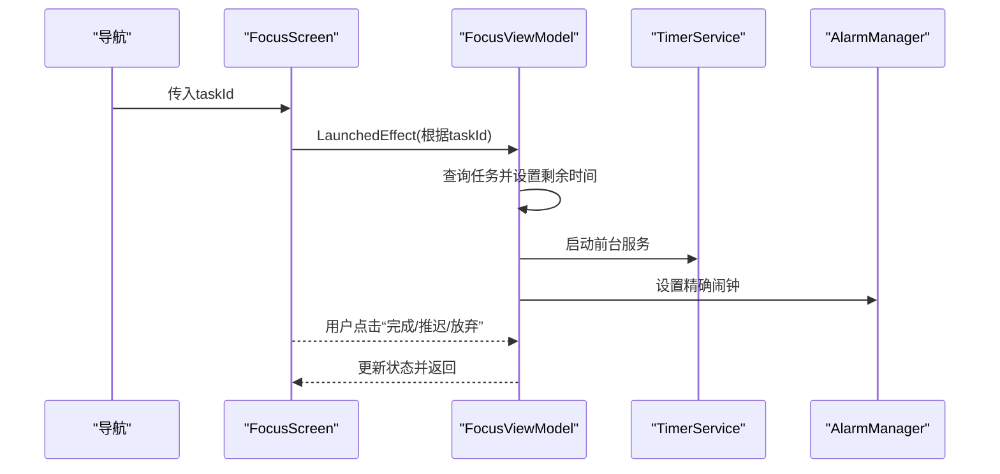
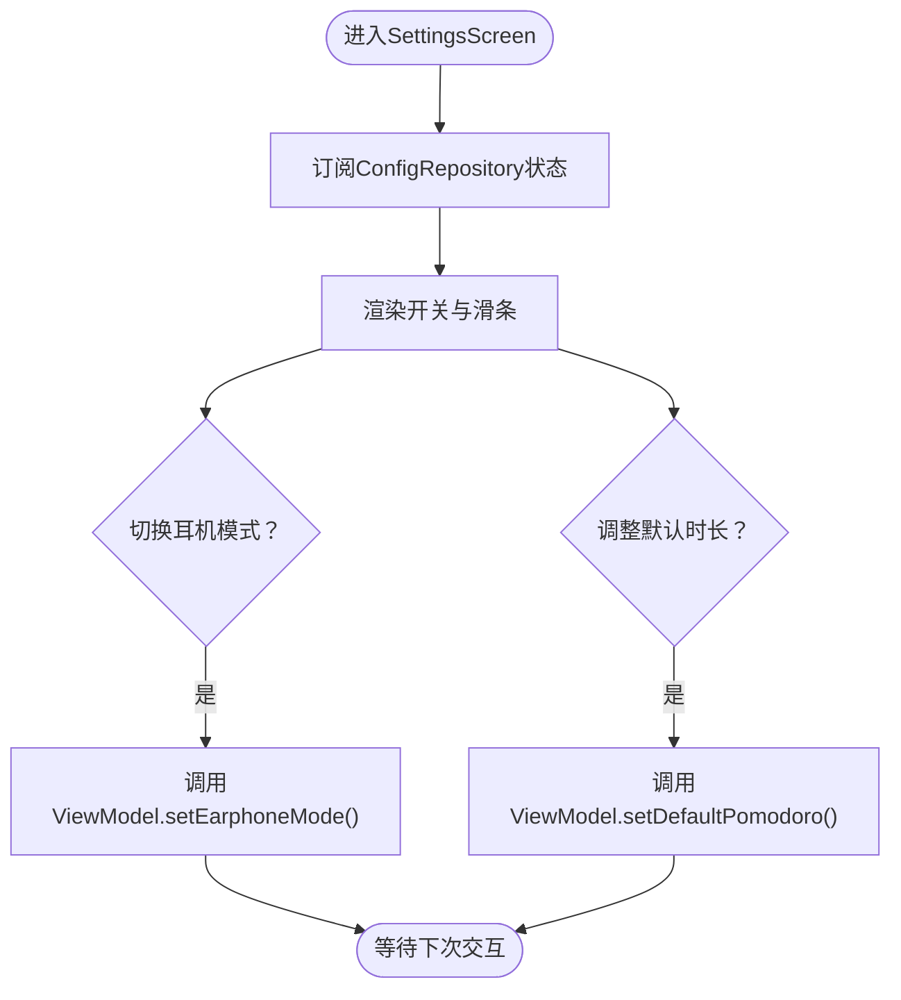
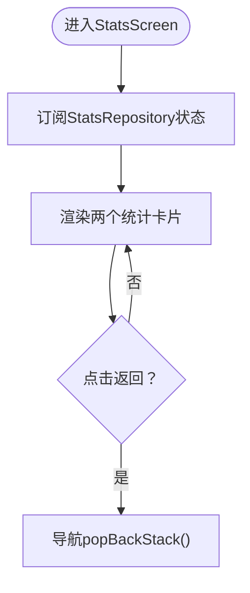
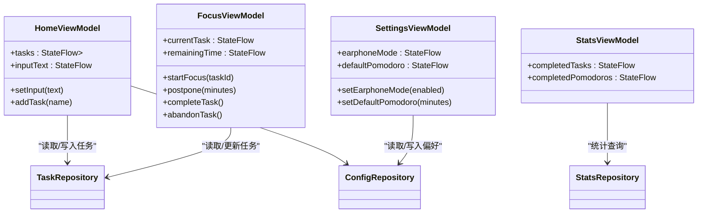
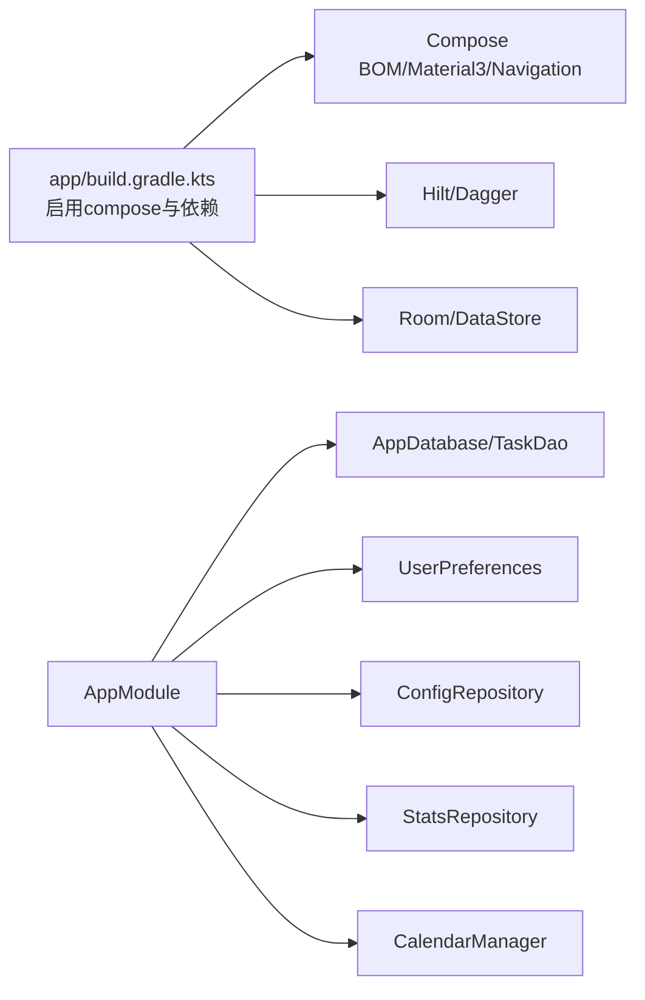

# Compose UI框架

<cite>
**本文引用的文件**
- [HomeScreen.kt](file://app/src/main/java/com/pomodoroalert/ui/screens/HomeScreen.kt)
- [FocusScreen.kt](file://app/src/main/java/com/pomodoroalert/ui/screens/FocusScreen.kt)
- [SettingsScreen.kt](file://app/src/main/java/com/pomodoroalert/ui/screens/SettingsScreen.kt)
- [StatsScreen.kt](file://app/src/main/java/com/pomodoroalert/ui/screens/StatsScreen.kt)
- [HomeViewModel.kt](file://app/src/main/java/com/pomodoroalert/ui/viewmodel/HomeViewModel.kt)
- [FocusViewModel.kt](file://app/src/main/java/com/pomodoroalert/ui/viewmodel/FocusViewModel.kt)
- [SettingsViewModel.kt](file://app/src/main/java/com/pomodoroalert/ui/viewmodel/SettingsViewModel.kt)
- [StatsViewModel.kt](file://app/src/main/java/com/pomodoroalert/ui/viewmodel/StatsViewModel.kt)
- [AppNavGraph.kt](file://app/src/main/java/com/pomodoroalert/ui/AppNavGraph.kt)
- [MainActivity.kt](file://app/src/main/java/com/pomodoroalert/MainActivity.kt)
- [themes.xml](file://app/src/main/res/values/themes.xml)
- [colors.xml](file://app/src/main/res/values/colors.xml)
- [ConfigRepository.kt](file://app/src/main/java/com/pomodoroalert/data/ConfigRepository.kt)
- [AppModule.kt](file://app/src/main/java/com/pomodoroalert/di/AppModule.kt)
- [build.gradle.kts（根）](file://build.gradle.kts)
- [build.gradle.kts（app模块）](file://app/build.gradle.kts)
</cite>

## 目录
1. [简介](#简介)
2. [项目结构](#项目结构)
3. [核心组件](#核心组件)
4. [架构总览](#架构总览)
5. [详细组件分析](#详细组件分析)
6. [依赖关系分析](#依赖关系分析)
7. [性能考量](#性能考量)
8. [故障排查指南](#故障排查指南)
9. [结论](#结论)
10. [附录](#附录)

## 简介
本文件面向PomodoroAlert的Jetpack Compose UI框架，系统阐述其声明式UI设计理念与实现原理，覆盖可组合函数的使用、状态提升模式、副作用处理、布局与样式、主题定制、与传统XML布局的差异与优势，并给出性能优化、内存管理、响应式设计的最佳实践，以及调试工具与常见问题的解决方案。

## 项目结构
Compose UI在本项目中采用“屏幕级可组合函数 + ViewModel + 导航”的分层组织方式：
- 屏幕层：HomeScreen、FocusScreen、SettingsScreen、StatsScreen，负责UI呈现与用户交互。
- 视图模型层：各Screen对应的ViewModel，封装业务状态与副作用，暴露StateFlow供UI收集。
- 导航层：AppNavGraph定义路由与页面跳转，MainActivity作为入口承载MaterialTheme与Surface。
- 主题与资源：themes.xml与colors.xml提供颜色与窗口风格；Material3作为基础视觉语言。
- 数据与DI：通过Hilt注入Repository与UserPreferences，ViewModel通过stateIn或collectAsState消费流。

图表来源
- [MainActivity.kt:11-23](file://app/src/main/java/com/pomodoroalert/MainActivity.kt#L11-L23)
- [AppNavGraph.kt:13-25](file://app/src/main/java/com/pomodoroalert/ui/AppNavGraph.kt#L13-L25)
- [HomeScreen.kt:48-204](file://app/src/main/java/com/pomodoroalert/ui/screens/HomeScreen.kt#L48-L204)
- [FocusScreen.kt:16-69](file://app/src/main/java/com/pomodoroalert/ui/screens/FocusScreen.kt#L16-L69)
- [SettingsScreen.kt:15-61](file://app/src/main/java/com/pomodoroalert/ui/screens/SettingsScreen.kt#L15-L61)
- [StatsScreen.kt:15-58](file://app/src/main/java/com/pomodoroalert/ui/screens/StatsScreen.kt#L15-L58)
- [HomeViewModel.kt:15-52](file://app/src/main/java/com/pomodoroalert/ui/viewmodel/HomeViewModel.kt#L15-L52)
- [FocusViewModel.kt:21-84](file://app/src/main/java/com/pomodoroalert/ui/viewmodel/FocusViewModel.kt#L21-L84)
- [SettingsViewModel.kt:13-30](file://app/src/main/java/com/pomodoroalert/ui/viewmodel/SettingsViewModel.kt#L13-L30)
- [StatsViewModel.kt:12-21](file://app/src/main/java/com/pomodoroalert/ui/viewmodel/StatsViewModel.kt#L12-L21)

章节来源
- [MainActivity.kt:11-23](file://app/src/main/java/com/pomodoroalert/MainActivity.kt#L11-L23)
- [AppNavGraph.kt:13-25](file://app/src/main/java/com/pomodoroalert/ui/AppNavGraph.kt#L13-L25)
- [themes.xml:1-9](file://app/src/main/res/values/themes.xml#L1-L9)
- [colors.xml:1-11](file://app/src/main/res/values/colors.xml#L1-L11)

## 核心组件
- 可组合函数与状态提升
  - HomeScreen通过hiltViewModel获取HomeViewModel，使用collectAsState订阅inputText与tasks，实现“状态提升到ViewModel”，UI只负责渲染与事件回调。
  - FocusScreen在LaunchedEffect中根据taskId启动专注流程，避免重复触发；其余UI交互直接调用viewModel方法。
  - SettingsScreen与StatsScreen分别订阅ConfigRepository与StatsRepository的流，实现响应式更新。
- 副作用处理
  - FocusViewModel在startFocus中启动前台服务TimerService，并通过AlarmManager设置精确闹钟；postpone通过PendingIntent广播触发ExactAlarmReceiver。
  - LaunchedEffect用于根据参数初始化副作用（如根据taskId启动专注），确保生命周期安全。
- 布局与样式
  - 使用Column、Row、LazyColumn进行布局；Card、OutlinedTextField、Button、Slider、Switch等Material3组件构建交互。
  - 自定义颜色常量与MaterialTheme配合，统一视觉风格。
- 主题定制
  - MainActivity包裹MaterialTheme，App主题在themes.xml中定义，颜色来自colors.xml，Material3提供Typography与ColorScheme。

章节来源
- [HomeScreen.kt:48-204](file://app/src/main/java/com/pomodoroalert/ui/screens/HomeScreen.kt#L48-L204)
- [FocusScreen.kt:16-69](file://app/src/main/java/com/pomodoroalert/ui/screens/FocusScreen.kt#L16-L69)
- [SettingsScreen.kt:15-61](file://app/src/main/java/com/pomodoroalert/ui/screens/SettingsScreen.kt#L15-L61)
- [StatsScreen.kt:15-58](file://app/src/main/java/com/pomodoroalert/ui/screens/StatsScreen.kt#L15-L58)
- [HomeViewModel.kt:15-52](file://app/src/main/java/com/pomodoroalert/ui/viewmodel/HomeViewModel.kt#L15-L52)
- [FocusViewModel.kt:21-84](file://app/src/main/java/com/pomodoroalert/ui/viewmodel/FocusViewModel.kt#L21-L84)
- [SettingsViewModel.kt:13-30](file://app/src/main/java/com/pomodoroalert/ui/viewmodel/SettingsViewModel.kt#L13-L30)
- [StatsViewModel.kt:12-21](file://app/src/main/java/com/pomodoroalert/ui/viewmodel/StatsViewModel.kt#L12-L21)
- [MainActivity.kt:11-23](file://app/src/main/java/com/pomodoroalert/MainActivity.kt#L11-L23)
- [themes.xml:1-9](file://app/src/main/res/values/themes.xml#L1-L9)
- [colors.xml:1-11](file://app/src/main/res/values/colors.xml#L1-L11)

## 架构总览
下图展示从入口到屏幕、再到ViewModel与Repository的数据与控制流：

图表来源
- [MainActivity.kt:11-23](file://app/src/main/java/com/pomodoroalert/MainActivity.kt#L11-L23)
- [AppNavGraph.kt:13-25](file://app/src/main/java/com/pomodoroalert/ui/AppNavGraph.kt#L13-L25)
- [HomeScreen.kt:48-204](file://app/src/main/java/com/pomodoroalert/ui/screens/HomeScreen.kt#L48-L204)
- [FocusScreen.kt:16-69](file://app/src/main/java/com/pomodoroalert/ui/screens/FocusScreen.kt#L16-L69)
- [HomeViewModel.kt:15-52](file://app/src/main/java/com/pomodoroalert/ui/viewmodel/HomeViewModel.kt#L15-L52)
- [FocusViewModel.kt:21-84](file://app/src/main/java/com/pomodoroalert/ui/viewmodel/FocusViewModel.kt#L21-L84)

## 详细组件分析

### HomeScreen：任务大厅
- 设计要点
  - 使用Surface包裹全屏背景色，Column主布局，Row与OutlinedTextField实现输入区，Button触发新增任务。
  - LazyColumn展示任务列表，Card包装每项，按钮导航至专注页。
- 状态与交互
  - 输入框双向绑定ViewModel的inputText；点击添加任务调用addTask。
  - 任务列表订阅tasks，自动刷新。
- 最佳实践
  - 将UI状态与业务状态分离，避免在UI中直接操作数据库。
  - 使用Modifier.weight与Arrangement合理分配空间，保证响应式布局。

图表来源
- [HomeScreen.kt:48-204](file://app/src/main/java/com/pomodoroalert/ui/screens/HomeScreen.kt#L48-L204)
- [HomeViewModel.kt:15-52](file://app/src/main/java/com/pomodoroalert/ui/viewmodel/HomeViewModel.kt#L15-L52)

章节来源
- [HomeScreen.kt:48-204](file://app/src/main/java/com/pomodoroalert/ui/screens/HomeScreen.kt#L48-L204)
- [HomeViewModel.kt:15-52](file://app/src/main/java/com/pomodoroalert/ui/viewmodel/HomeViewModel.kt#L15-L52)

### FocusScreen：专注面板
- 设计要点
  - 中心化布局显示当前任务名与倒计时，底部提供完成、推迟、放弃三个操作。
- 副作用与导航
  - LaunchedEffect根据taskId启动专注，避免重复初始化。
  - 完成/放弃后停止服务并返回上一页。
- 最佳实践
  - 将时间计算与格式化逻辑放在ViewModel或工具层，UI仅负责展示。
  - 使用MaterialTheme.colorScheme的错误色突出危险操作。

图表来源
- [FocusScreen.kt:16-69](file://app/src/main/java/com/pomodoroalert/ui/screens/FocusScreen.kt#L16-L69)
- [FocusViewModel.kt:21-84](file://app/src/main/java/com/pomodoroalert/ui/viewmodel/FocusViewModel.kt#L21-L84)

章节来源
- [FocusScreen.kt:16-69](file://app/src/main/java/com/pomodoroalert/ui/screens/FocusScreen.kt#L16-L69)
- [FocusViewModel.kt:21-84](file://app/src/main/java/com/pomodoroalert/ui/viewmodel/FocusViewModel.kt#L21-L84)

### SettingsScreen：偏好设置
- 设计要点
  - 使用Card包装两个设置项：耳机模式开关与默认专注时长滑条。
- 状态与交互
  - 通过collectAsState订阅earphoneMode与defaultPomodoro，Switch与Slider直接绑定到ViewModel。
- 最佳实践
  - 使用stateIn将Repository的Flow转换为可观察的状态，避免在UI中直接订阅。
  - 滑条步进范围明确，便于用户直观调节。

图表来源
- [SettingsScreen.kt:15-61](file://app/src/main/java/com/pomodoroalert/ui/screens/SettingsScreen.kt#L15-L61)
- [SettingsViewModel.kt:13-30](file://app/src/main/java/com/pomodoroalert/ui/viewmodel/SettingsViewModel.kt#L13-L30)
- [ConfigRepository.kt:1-19](file://app/src/main/java/com/pomodoroalert/data/ConfigRepository.kt#L1-L19)

章节来源
- [SettingsScreen.kt:15-61](file://app/src/main/java/com/pomodoroalert/ui/screens/SettingsScreen.kt#L15-L61)
- [SettingsViewModel.kt:13-30](file://app/src/main/java/com/pomodoroalert/ui/viewmodel/SettingsViewModel.kt#L13-L30)
- [ConfigRepository.kt:1-19](file://app/src/main/java/com/pomodoroalert/data/ConfigRepository.kt#L1-L19)

### StatsScreen：数据统计
- 设计要点
  - 两个卡片分别展示“今日完成番茄数”和“今日完成任务数”，居中布局。
- 状态与交互
  - 通过collectAsState订阅completedPomodoros与completedTasks，按钮返回首页。
- 最佳实践
  - 统一使用MaterialTheme.typography以获得一致的排版层级。
  - 将统计查询封装在StatsRepository中，UI保持简洁。

图表来源
- [StatsScreen.kt:15-58](file://app/src/main/java/com/pomodoroalert/ui/screens/StatsScreen.kt#L15-L58)
- [StatsViewModel.kt:12-21](file://app/src/main/java/com/pomodoroalert/ui/viewmodel/StatsViewModel.kt#L12-L21)

章节来源
- [StatsScreen.kt:15-58](file://app/src/main/java/com/pomodoroalert/ui/screens/StatsScreen.kt#L15-L58)
- [StatsViewModel.kt:12-21](file://app/src/main/java/com/pomodoroalert/ui/viewmodel/StatsViewModel.kt#L12-L21)

### ViewModel类图

图表来源
- [HomeViewModel.kt:15-52](file://app/src/main/java/com/pomodoroalert/ui/viewmodel/HomeViewModel.kt#L15-L52)
- [FocusViewModel.kt:21-84](file://app/src/main/java/com/pomodoroalert/ui/viewmodel/FocusViewModel.kt#L21-L84)
- [SettingsViewModel.kt:13-30](file://app/src/main/java/com/pomodoroalert/ui/viewmodel/SettingsViewModel.kt#L13-L30)
- [StatsViewModel.kt:12-21](file://app/src/main/java/com/pomodoroalert/ui/viewmodel/StatsViewModel.kt#L12-L21)

## 依赖关系分析
- 构建与Compose支持
  - app模块启用compose=true，依赖platform Compose BOM与Material3、Navigation Compose、Room、Hilt等。
  - 根工程统一版本插件，app模块引入测试与调试依赖。
- DI与数据层
  - AppModule提供AppDatabase、TaskDao、UserPreferences、ConfigRepository、StatsRepository、CalendarManager等单例。
  - ConfigRepository封装UserPreferences的Flow，供ViewModel通过stateIn消费。

图表来源
- [build.gradle.kts（app模块）:1-81](file://app/build.gradle.kts#L1-L81)
- [build.gradle.kts（根）:1-9](file://build.gradle.kts#L1-L9)
- [AppModule.kt:19-60](file://app/src/main/java/com/pomodoroalert/di/AppModule.kt#L19-L60)

章节来源
- [build.gradle.kts（app模块）:1-81](file://app/build.gradle.kts#L1-L81)
- [build.gradle.kts（根）:1-9](file://build.gradle.kts#L1-L9)
- [AppModule.kt:19-60](file://app/src/main/java/com/pomodoroalert/di/AppModule.kt#L19-L60)

## 性能考量
- 列表渲染
  - 使用LazyColumn与items(key=...)进行高效重绘，避免不必要的重组。
- 状态收集
  - 在UI侧使用collectAsState，在ViewModel侧使用stateIn，减少上游频繁发射导致的过度重组。
- 副作用管理
  - 使用LaunchedEffect按参数触发一次副作用，避免重复启动服务或闹钟。
- 资源与主题
  - Material3与统一颜色资源减少自定义开销，提高一致性与复用性。
- 调试与工具
  - 使用Compose调试工具查看重组树、内存占用与布局边界；在测试设备上启用Debug Compose UI Tooling。

## 故障排查指南
- 页面不显示或空白
  - 检查MainActivity是否正确设置MaterialTheme与Surface包裹AppNavGraph。
  - 确认AppNavGraph的startDestination与路由路径一致。
- 点击无响应
  - 核对onClick回调是否调用ViewModel方法；确认ViewModel方法内部未抛异常。
- 列表不刷新
  - 确认ViewModel向StateFlow赋值后，UI侧使用collectAsState订阅；检查key参数是否稳定。
- 倒计时不更新
  - 检查FocusViewModel是否正确设置remainingTime；确认服务与闹钟是否按预期触发。
- 偏好设置不生效
  - 确认ConfigRepository写入成功且ViewModel通过stateIn订阅；检查DataStore持久化时机。

章节来源
- [MainActivity.kt:11-23](file://app/src/main/java/com/pomodoroalert/MainActivity.kt#L11-L23)
- [AppNavGraph.kt:13-25](file://app/src/main/java/com/pomodoroalert/ui/AppNavGraph.kt#L13-L25)
- [HomeScreen.kt:48-204](file://app/src/main/java/com/pomodoroalert/ui/screens/HomeScreen.kt#L48-L204)
- [FocusViewModel.kt:21-84](file://app/src/main/java/com/pomodoroalert/ui/viewmodel/FocusViewModel.kt#L21-L84)
- [SettingsViewModel.kt:13-30](file://app/src/main/java/com/pomodoroalert/ui/viewmodel/SettingsViewModel.kt#L13-L30)
- [ConfigRepository.kt:1-19](file://app/src/main/java/com/pomodoroalert/data/ConfigRepository.kt#L1-L19)

## 结论
本项目以Material3为基础，结合Compose声明式UI与MVVM模式，实现了清晰的职责分离与良好的可维护性。通过LaunchedEffect、StateFlow与stateIn等机制，有效管理副作用与状态；借助Navigation与Hilt，简化了导航与依赖注入。建议在后续迭代中进一步完善测试覆盖与性能监控，持续优化用户体验。

## 附录
- 与传统XML布局的差异与优势
  - 声明式UI：UI即代码，逻辑与视图解耦，易于测试与复用。
  - 响应式状态：基于StateFlow的自动重组，减少样板代码。
  - 组合优先：通过Modifier链式组合实现灵活布局与样式。
  - 主题与样式：Material3提供统一的排版与色彩体系，降低设计成本。
- 最佳实践清单
  - 将UI状态与业务状态分离，UI只做渲染与转发。
  - 使用LaunchedEffect管理一次性副作用，避免重复执行。
  - 列表使用key稳定标识，减少重组范围。
  - 使用stateIn将Repository流转换为可观察状态，避免在UI中直接订阅。
  - 使用Material3组件与统一主题，保持视觉一致性。
  - 启用Compose调试工具，定期检查重组与内存使用情况。