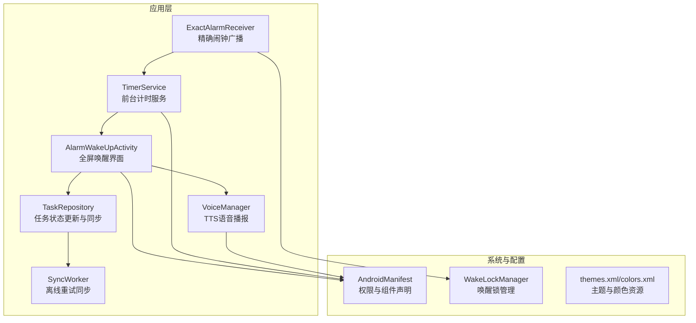
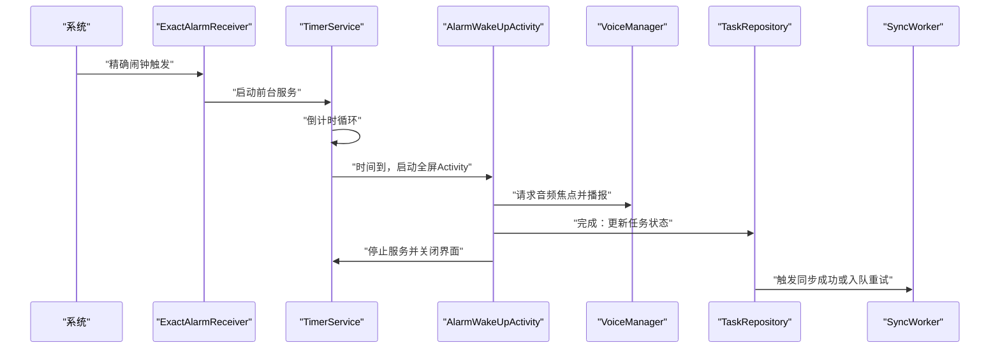
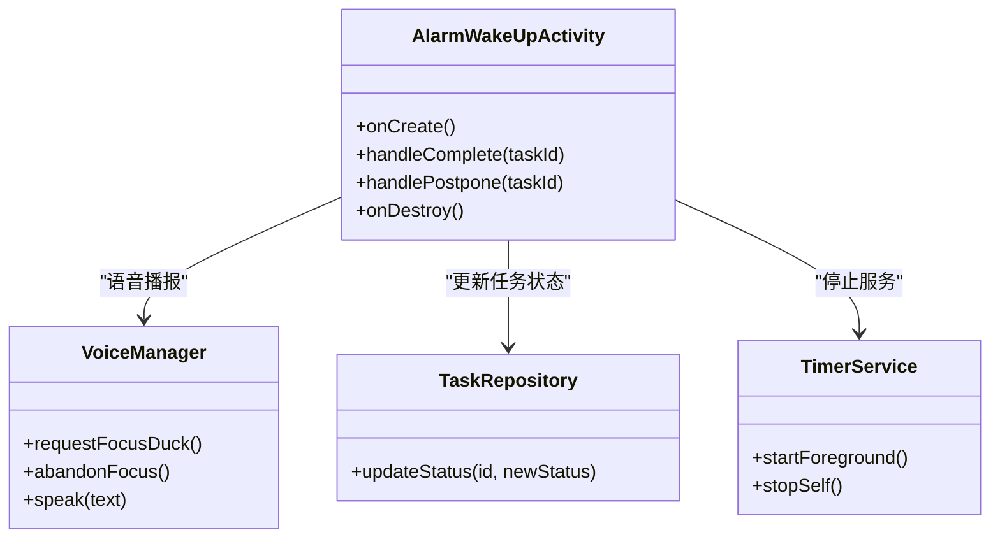
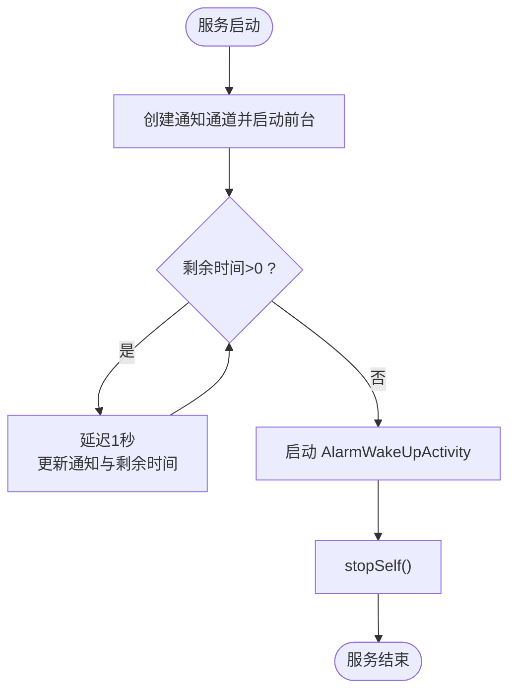
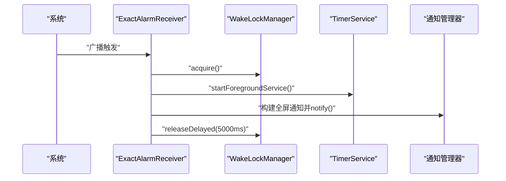
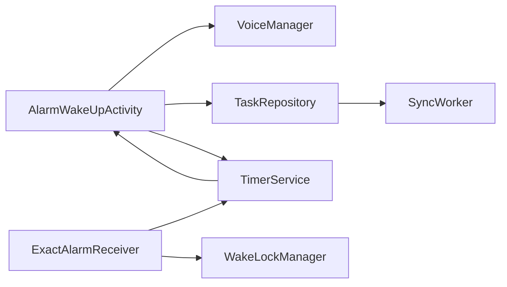

# 全屏唤醒界面

<cite>
**本文引用的文件**
- [AlarmWakeUpActivity.kt](file://app/src/main/java/com/pomodoroalert/ui/AlarmWakeUpActivity.kt)
- [TimerService.kt](file://app/src/main/java/com/pomodoroalert/service/TimerService.kt)
- [ExactAlarmReceiver.kt](file://app/src/main/java/com/pomodoroalert/receiver/ExactAlarmReceiver.kt)
- [VoiceManager.kt](file://app/src/main/java/com/pomodoroalert/voice/VoiceManager.kt)
- [TaskRepository.kt](file://app/src/main/java/com/pomodoroalert/data/TaskRepository.kt)
- [WakeLockManager.kt](file://app/src/main/java/com/pomodoroalert/receiver/WakeLockManager.kt)
- [AndroidManifest.xml](file://app/src/main/AndroidManifest.xml)
- [themes.xml](file://app/src/main/res/values/themes.xml)
- [colors.xml](file://app/src/main/res/values/colors.xml)
- [strings.xml](file://app/src/main/res/values/strings.xml)
- [SyncWorker.kt](file://app/src/main/java/com/pomodoroalert/worker/SyncWorker.kt)
- [build.gradle.kts](file://app/build.gradle.kts)
</cite>

## 目录
1. [简介](#简介)
2. [项目结构](#项目结构)
3. [核心组件](#核心组件)
4. [架构总览](#架构总览)
5. [详细组件分析](#详细组件分析)
6. [依赖关系分析](#依赖关系分析)
7. [性能与电池优化](#性能与电池优化)
8. [故障排查指南](#故障排查指南)
9. [结论](#结论)
10. [附录](#附录)

## 简介
本文件围绕 AlarmWakeUpActivity 的全屏唤醒界面进行技术文档化，重点阐述其设计目的、实现原理与交互流程，覆盖全屏显示、强制唤醒、用户交互、系统限制处理、权限申请、界面适配、性能优化与电池消耗控制、用户体验优化以及与其他组件的集成与生命周期管理。目标是帮助开发者快速理解并维护该界面在实际使用场景中的稳定性与可用性。

## 项目结构
AlarmWakeUpActivity 属于 UI 层，位于应用模块的 UI 包下；其与服务层（TimerService）、广播接收器（ExactAlarmReceiver）、语音模块（VoiceManager）、数据仓库（TaskRepository）以及工作调度（SyncWorker）共同构成完整的“闹钟触发—全屏唤醒—用户交互—状态同步”闭环。

图表来源
- [AlarmWakeUpActivity.kt:25-105](file://app/src/main/java/com/pomodoroalert/ui/AlarmWakeUpActivity.kt#L25-L105)
- [TimerService.kt:24-103](file://app/src/main/java/com/pomodoroalert/service/TimerService.kt#L24-L103)
- [ExactAlarmReceiver.kt:13-49](file://app/src/main/java/com/pomodoroalert/receiver/ExactAlarmReceiver.kt#L13-L49)
- [VoiceManager.kt:12-63](file://app/src/main/java/com/pomodoroalert/voice/VoiceManager.kt#L12-L63)
- [TaskRepository.kt:19-101](file://app/src/main/java/com/pomodoroalert/data/TaskRepository.kt#L19-L101)
- [SyncWorker.kt:15-78](file://app/src/main/java/com/pomodoroalert/worker/SyncWorker.kt#L15-L78)
- [AndroidManifest.xml:11-39](file://app/src/main/AndroidManifest.xml#L11-L39)
- [WakeLockManager.kt:8-31](file://app/src/main/java/com/pomodoroalert/receiver/WakeLockManager.kt#L8-L31)

章节来源
- [AlarmWakeUpActivity.kt:1-105](file://app/src/main/java/com/pomodoroalert/ui/AlarmWakeUpActivity.kt#L1-L105)
- [AndroidManifest.xml:1-39](file://app/src/main/AndroidManifest.xml#L1-L39)

## 核心组件
- AlarmWakeUpActivity：负责在锁屏状态下以全屏界面展示提示信息，提供“完成/推迟”两种交互按钮，触发任务状态变更与服务停止。
- TimerService：前台服务，负责倒计时、通知更新与闹钟触发（启动 AlarmWakeUpActivity）。
- ExactAlarmReceiver：接收系统精确闹钟，启动前台服务并发送全屏通知以强制唤醒锁屏。
- VoiceManager：基于 TTS 的语音播报，请求音频焦点并自动释放，确保不干扰其他媒体。
- TaskRepository：封装数据库操作与网络同步，支持任务状态更新与失败重试。
- SyncWorker：基于 WorkManager 的离线重试同步，保证网络异常时的数据一致性。
- WakeLockManager：短时唤醒锁管理，避免因短暂唤醒导致的电量浪费。
- 主题与资源：通过主题与颜色资源统一界面风格，保障在不同设备上的视觉一致性。

章节来源
- [AlarmWakeUpActivity.kt:25-105](file://app/src/main/java/com/pomodoroalert/ui/AlarmWakeUpActivity.kt#L25-L105)
- [TimerService.kt:24-103](file://app/src/main/java/com/pomodoroalert/service/TimerService.kt#L24-L103)
- [ExactAlarmReceiver.kt:13-49](file://app/src/main/java/com/pomodoroalert/receiver/ExactAlarmReceiver.kt#L13-L49)
- [VoiceManager.kt:12-63](file://app/src/main/java/com/pomodoroalert/voice/VoiceManager.kt#L12-L63)
- [TaskRepository.kt:19-101](file://app/src/main/java/com/pomodoroalert/data/TaskRepository.kt#L19-L101)
- [SyncWorker.kt:15-78](file://app/src/main/java/com/pomodoroalert/worker/SyncWorker.kt#L15-L78)
- [WakeLockManager.kt:8-31](file://app/src/main/java/com/pomodoroalert/receiver/WakeLockManager.kt#L8-L31)
- [themes.xml:1-9](file://app/src/main/res/values/themes.xml#L1-L9)
- [colors.xml:1-11](file://app/src/main/res/values/colors.xml#L1-L11)

## 架构总览
AlarmWakeUpActivity 的调用链从系统闹钟触发开始，经由广播接收器启动前台服务，服务倒计时结束后启动 Activity 并播放语音提示，用户点击按钮后更新任务状态并结束服务与界面。

图表来源
- [ExactAlarmReceiver.kt:14-47](file://app/src/main/java/com/pomodoroalert/receiver/ExactAlarmReceiver.kt#L14-L47)
- [TimerService.kt:38-66](file://app/src/main/java/com/pomodoroalert/service/TimerService.kt#L38-L66)
- [AlarmWakeUpActivity.kt:30-98](file://app/src/main/java/com/pomodoroalert/ui/AlarmWakeUpActivity.kt#L30-L98)
- [VoiceManager.kt:28-61](file://app/src/main/java/com/pomodoroalert/voice/VoiceManager.kt#L28-L61)
- [TaskRepository.kt:32-80](file://app/src/main/java/com/pomodoroalert/data/TaskRepository.kt#L32-L80)
- [SyncWorker.kt:24-71](file://app/src/main/java/com/pomodoroalert/worker/SyncWorker.kt#L24-L71)

## 详细组件分析

### AlarmWakeUpActivity 设计与实现
- 全屏显示与强制唤醒
  - 在 onCreate 中设置“锁屏可见”和“点亮屏幕”，确保在锁屏状态下也能被用户看到并触达。
  - 使用 Compose 布局，Surface 占满屏幕并采用半透明黑色背景，提升可读性与对比度。
- 用户交互
  - 提供“完成”和“推迟 10 分钟”两个按钮，分别对应任务状态更新与重新启动计时服务。
  - 按钮颜色使用主题色系，保证一致的视觉反馈。
- 语音播报
  - 启动时通过 VoiceManager 请求音频焦点并播报提示语，结束后主动释放焦点，避免长期占用。
- 生命周期与资源回收
  - onDestroy 中释放 TTS 聚焦，防止资源泄漏。
- 数据与服务集成
  - 通过 TaskRepository 更新任务状态，随后停止 TimerService 并 finish 自身，确保资源及时回收。

图表来源
- [AlarmWakeUpActivity.kt:25-105](file://app/src/main/java/com/pomodoroalert/ui/AlarmWakeUpActivity.kt#L25-L105)
- [VoiceManager.kt:12-63](file://app/src/main/java/com/pomodoroalert/voice/VoiceManager.kt#L12-L63)
- [TaskRepository.kt:19-101](file://app/src/main/java/com/pomodoroalert/data/TaskRepository.kt#L19-L101)
- [TimerService.kt:24-103](file://app/src/main/java/com/pomodoroalert/service/TimerService.kt#L24-L103)

章节来源
- [AlarmWakeUpActivity.kt:30-103](file://app/src/main/java/com/pomodoroalert/ui/AlarmWakeUpActivity.kt#L30-L103)
- [VoiceManager.kt:28-61](file://app/src/main/java/com/pomodoroalert/voice/VoiceManager.kt#L28-L61)
- [TaskRepository.kt:32-80](file://app/src/main/java/com/pomodoroalert/data/TaskRepository.kt#L32-L80)

### TimerService 倒计时与通知
- 前台服务与通知
  - 创建通知通道并在前台运行，持续显示剩余时间，避免被系统回收。
  - 通过状态流暴露剩余时间，便于 UI 或其他组件订阅。
- 闹钟触发
  - 倒计时结束时启动 AlarmWakeUpActivity，确保用户被及时唤醒。
- 服务生命周期
  - 使用协程管理倒计时，每秒更新一次通知，结束后 stopSelf()，避免常驻内存。

图表来源
- [TimerService.kt:32-66](file://app/src/main/java/com/pomodoroalert/service/TimerService.kt#L32-L66)

章节来源
- [TimerService.kt:24-103](file://app/src/main/java/com/pomodoroalert/service/TimerService.kt#L24-L103)

### ExactAlarmReceiver 精确闹钟与全屏通知
- 唤醒与启动
  - 接收系统闹钟后，先获取唤醒锁，再启动前台服务，最后发送全屏通知以强制唤醒锁屏。
- 全屏通知策略
  - 使用全屏意图（fullScreenIntent）并设置最高优先级与告警类别，确保在锁屏状态下弹出。
- 唤醒锁释放
  - 通过延迟释放唤醒锁，避免长时间占用 CPU。

图表来源
- [ExactAlarmReceiver.kt:14-47](file://app/src/main/java/com/pomodoroalert/receiver/ExactAlarmReceiver.kt#L14-L47)
- [WakeLockManager.kt:12-29](file://app/src/main/java/com/pomodoroalert/receiver/WakeLockManager.kt#L12-L29)

章节来源
- [ExactAlarmReceiver.kt:13-49](file://app/src/main/java/com/pomodoroalert/receiver/ExactAlarmReceiver.kt#L13-L49)
- [WakeLockManager.kt:8-31](file://app/src/main/java/com/pomodoroalert/receiver/WakeLockManager.kt#L8-L31)

### VoiceManager 语音播报与音频焦点
- 音频焦点策略
  - 使用“临时可静音”的音频焦点，允许系统在需要时降低音量，避免冲突。
- TTS 配置
  - 设置音频用途为 ALARM，内容类型为 SPEECH，确保播报符合系统预期。
- 自动释放
  - 通过 UtteranceProgressListener 在播报完成后主动释放焦点，避免资源泄露。

章节来源
- [VoiceManager.kt:28-61](file://app/src/main/java/com/pomodoroalert/voice/VoiceManager.kt#L28-L61)

### TaskRepository 任务状态更新与同步
- 状态更新
  - 支持多种状态（已完成/已放弃/推迟），并在状态变更时触发同步。
- 同步机制
  - 成功则标记为已同步；失败或异常则标记为待同步并入队重试。
- 离线重试
  - 通过 WorkManager 的 SyncWorker 执行批量重试，保证最终一致性。

章节来源
- [TaskRepository.kt:32-80](file://app/src/main/java/com/pomodoroalert/data/TaskRepository.kt#L32-L80)
- [SyncWorker.kt:24-71](file://app/src/main/java/com/pomodoroalert/worker/SyncWorker.kt#L24-L71)

## 依赖关系分析
- 组件耦合
  - AlarmWakeUpActivity 依赖 VoiceManager、TaskRepository 与 TimerService，耦合集中在任务状态与语音播报。
  - TimerService 与 ExactAlarmReceiver 通过广播与服务解耦，遵循单一职责。
- 外部依赖
  - Android 系统权限（前台服务、唤醒锁、忽略电池优化、录音、日历、通知）在清单中集中声明。
  - Hilt 注入 TaskRepository，降低 Activity 对数据层的直接依赖。
- 可能的循环依赖
  - 当前结构未见循环依赖；AlarmWakeUpActivity 不依赖 TimerService 的具体实现细节，仅通过启动与停止交互。

图表来源
- [AlarmWakeUpActivity.kt:25-105](file://app/src/main/java/com/pomodoroalert/ui/AlarmWakeUpActivity.kt#L25-L105)
- [TimerService.kt:24-103](file://app/src/main/java/com/pomodoroalert/service/TimerService.kt#L24-L103)
- [ExactAlarmReceiver.kt:13-49](file://app/src/main/java/com/pomodoroalert/receiver/ExactAlarmReceiver.kt#L13-L49)
- [VoiceManager.kt:12-63](file://app/src/main/java/com/pomodoroalert/voice/VoiceManager.kt#L12-L63)
- [TaskRepository.kt:19-101](file://app/src/main/java/com/pomodoroalert/data/TaskRepository.kt#L19-L101)
- [SyncWorker.kt:15-78](file://app/src/main/java/com/pomodoroalert/worker/SyncWorker.kt#L15-L78)
- [WakeLockManager.kt:8-31](file://app/src/main/java/com/pomodoroalert/receiver/WakeLockManager.kt#L8-L31)

章节来源
- [AndroidManifest.xml:4-9](file://app/src/main/AndroidManifest.xml#L4-L9)
- [build.gradle.kts:43-79](file://app/build.gradle.kts#L43-L79)

## 性能与电池优化
- 前台服务与通知
  - TimerService 以前台服务运行并持续通知，确保可感知性；注意避免频繁更新通知内容，减少系统开销。
- 唤醒锁策略
  - WakeLockManager 仅短时持有（最多 10 秒），并通过延迟释放避免长期占用 CPU。
- TTS 与音频焦点
  - 使用临时可静音焦点，播报完成后立即释放，降低对系统音频栈的影响。
- 线程与协程
  - TimerService 使用协程进行倒计时，每秒一次更新，频率合理且可控。
- 电池优化与忽略优化
  - 清单中声明忽略电池优化权限，有助于在省电模式下保持稳定运行，但需谨慎使用并告知用户原因。

章节来源
- [TimerService.kt:32-66](file://app/src/main/java/com/pomodoroalert/service/TimerService.kt#L32-L66)
- [WakeLockManager.kt:12-29](file://app/src/main/java/com/pomodoroalert/receiver/WakeLockManager.kt#L12-L29)
- [VoiceManager.kt:28-61](file://app/src/main/java/com/pomodoroalert/voice/VoiceManager.kt#L28-L61)
- [AndroidManifest.xml](file://app/src/main/AndroidManifest.xml#L6)

## 故障排查指南
- 锁屏无法唤醒
  - 检查 AlarmWakeUpActivity 是否设置了“锁屏可见”和“点亮屏幕”。
  - 检查全屏通知是否正确发送，确认通知渠道存在且优先级足够高。
- 语音播报无声
  - 检查音频焦点请求是否成功，确认 TTS 初始化回调状态。
  - 确认设备音量与静音状态，避免被系统静音或勿扰模式影响。
- 任务状态未更新
  - 检查 TaskRepository 的状态更新逻辑与网络同步流程，关注异常分支与重试队列。
- 服务被回收
  - 确认 TimerService 已在前台运行并持有通知；检查系统后台限制与电池优化设置。
- 权限问题
  - 确认清单中已声明所需权限；在部分厂商机型上可能需要额外引导用户授权。

章节来源
- [AlarmWakeUpActivity.kt:30-36](file://app/src/main/java/com/pomodoroalert/ui/AlarmWakeUpActivity.kt#L30-L36)
- [ExactAlarmReceiver.kt:26-44](file://app/src/main/java/com/pomodoroalert/receiver/ExactAlarmReceiver.kt#L26-L44)
- [VoiceManager.kt:22-26](file://app/src/main/java/com/pomodoroalert/voice/VoiceManager.kt#L22-L26)
- [TaskRepository.kt:68-80](file://app/src/main/java/com/pomodoroalert/data/TaskRepository.kt#L68-L80)
- [AndroidManifest.xml:4-9](file://app/src/main/AndroidManifest.xml#L4-L9)

## 结论
AlarmWakeUpActivity 通过系统级的锁屏可见与全屏通知机制，结合前台服务与 TTS 语音播报，实现了可靠的全屏唤醒体验。其与 TimerService、ExactAlarmReceiver、VoiceManager、TaskRepository 和 SyncWorker 的协作，构成了从闹钟触发到用户交互再到数据同步的完整闭环。在性能与电池优化方面，采用短时唤醒锁、临时音频焦点与前台服务通知等策略，兼顾了稳定性与能耗控制。建议在后续版本中进一步完善权限引导、多语言 TTS 与更丰富的交互选项，以提升用户体验。

## 附录
- 界面适配建议
  - 使用 Material3 主题与统一颜色资源，确保在不同设备上具有一致的视觉风格。
  - 文字大小与按钮间距采用 dp/sp，避免在大屏或高密度设备上出现拥挤或过小的问题。
- 最佳实践
  - 严格遵循生命周期管理，确保 onDestroy 中释放所有资源。
  - 将耗时操作放入协程或后台服务，避免阻塞主线程。
  - 对外设权限（如录音、日历）进行最小化授权与明确说明，提升用户信任度。