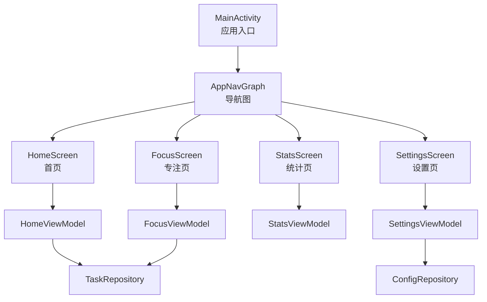
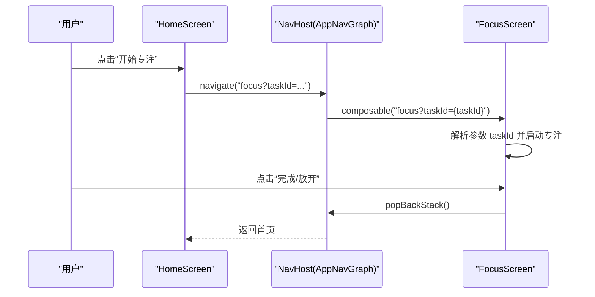
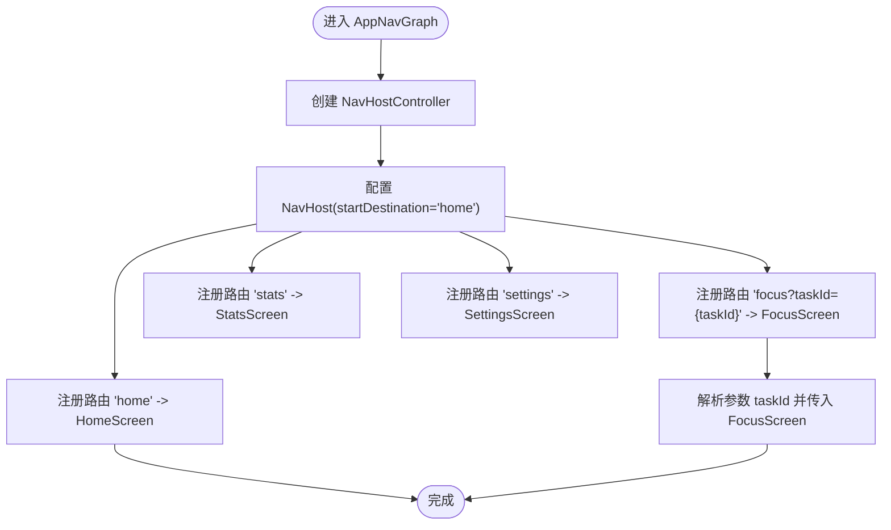
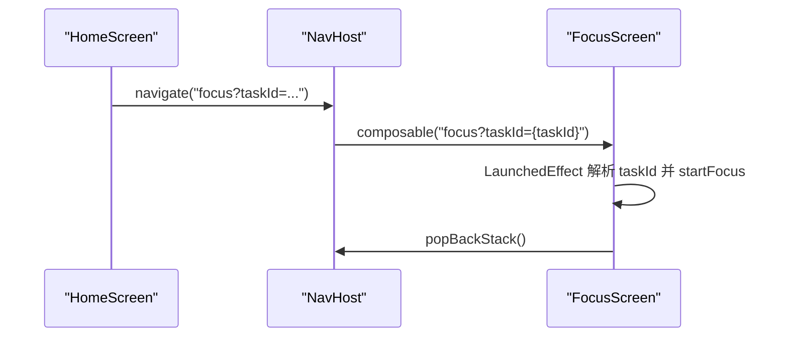
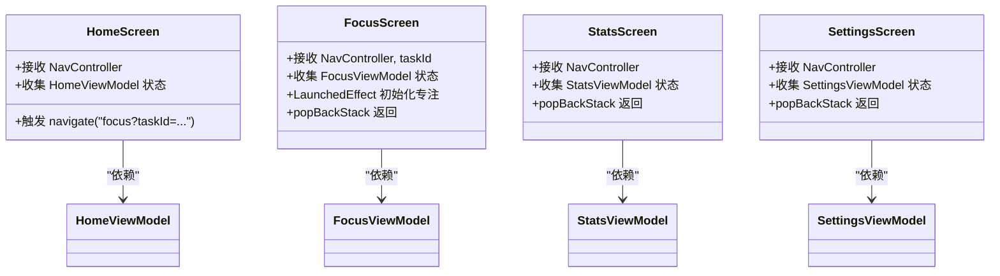
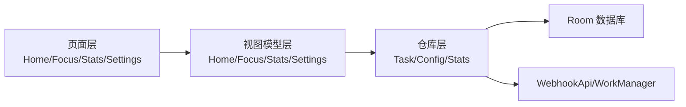

# 导航系统

<cite>
**本文引用的文件**
- [AppNavGraph.kt](file://app/src/main/java/com/pomodoroalert/ui/AppNavGraph.kt)
- [MainActivity.kt](file://app/src/main/java/com/pomodoroalert/MainActivity.kt)
- [HomeScreen.kt](file://app/src/main/java/com/pomodoroalert/ui/screens/HomeScreen.kt)
- [FocusScreen.kt](file://app/src/main/java/com/pomodoroalert/ui/screens/FocusScreen.kt)
- [StatsScreen.kt](file://app/src/main/java/com/pomodoroalert/ui/screens/StatsScreen.kt)
- [SettingsScreen.kt](file://app/src/main/java/com/pomodoroalert/ui/screens/SettingsScreen.kt)
- [HomeViewModel.kt](file://app/src/main/java/com/pomodoroalert/ui/viewmodel/HomeViewModel.kt)
- [FocusViewModel.kt](file://app/src/main/java/com/pomodoroalert/ui/viewmodel/FocusViewModel.kt)
- [StatsViewModel.kt](file://app/src/main/java/com/pomodoroalert/ui/viewmodel/StatsViewModel.kt)
- [SettingsViewModel.kt](file://app/src/main/java/com/pomodoroalert/ui/viewmodel/SettingsViewModel.kt)
- [TaskEntity.kt](file://app/src/main/java/com/pomodoroalert/data/TaskEntity.kt)
- [TaskRepository.kt](file://app/src/main/java/com/pomodoroalert/data/TaskRepository.kt)
- [ConfigRepository.kt](file://app/src/main/java/com/pomodoroalert/data/ConfigRepository.kt)
- [build.gradle.kts](file://app/build.gradle.kts)
- [libs.versions.toml](file://gradle/libs.versions.toml)
</cite>

## 目录
1. [简介](#简介)
2. [项目结构](#项目结构)
3. [核心组件](#核心组件)
4. [架构总览](#架构总览)
5. [详细组件分析](#详细组件分析)
6. [依赖关系分析](#依赖关系分析)
7. [性能考虑](#性能考虑)
8. [故障排查指南](#故障排查指南)
9. [结论](#结论)
10. [附录](#附录)

## 简介
本文件面向PomodoroAlert应用的导航系统，围绕Navigation Compose展开，系统性阐述导航图的定义、页面跳转逻辑、参数传递机制、页面间数据与状态保持、以及可扩展的动画、手势与深度链接能力。文档同时给出性能优化、内存管理与用户体验优化的最佳实践，并提供导航测试策略与常见问题的解决方案。

## 项目结构
导航系统主要由以下层次构成：
- 应用入口：MainActivity 使用Compose渲染AppNavGraph
- 导航图：AppNavGraph 定义路由与页面注册，使用NavHost与composable声明各路由
- 页面层：HomeScreen、FocusScreen、StatsScreen、SettingsScreen
- 视图模型层：HomeViewModel、FocusViewModel、StatsViewModel、SettingsViewModel（通过Hilt注入）
- 数据层：TaskEntity、TaskRepository、ConfigRepository等

图表来源
- [MainActivity.kt:12-22](file://app/src/main/java/com/pomodoroalert/MainActivity.kt#L12-L22)
- [AppNavGraph.kt:14-25](file://app/src/main/java/com/pomodoroalert/ui/AppNavGraph.kt#L14-L25)
- [HomeScreen.kt:48-204](file://app/src/main/java/com/pomodoroalert/ui/screens/HomeScreen.kt#L48-L204)
- [FocusScreen.kt:16-69](file://app/src/main/java/com/pomodoroalert/ui/screens/FocusScreen.kt#L16-L69)
- [StatsScreen.kt:15-58](file://app/src/main/java/com/pomodoroalert/ui/screens/StatsScreen.kt#L15-L58)
- [SettingsScreen.kt:15-61](file://app/src/main/java/com/pomodoroalert/ui/screens/SettingsScreen.kt#L15-L61)
- [HomeViewModel.kt:15-52](file://app/src/main/java/com/pomodoroalert/ui/viewmodel/HomeViewModel.kt#L15-L52)
- [FocusViewModel.kt:21-84](file://app/src/main/java/com/pomodoroalert/ui/viewmodel/FocusViewModel.kt#L21-L84)
- [StatsViewModel.kt:12-21](file://app/src/main/java/com/pomodoroalert/ui/viewmodel/StatsViewModel.kt#L12-L21)
- [SettingsViewModel.kt:13-30](file://app/src/main/java/com/pomodoroalert/ui/viewmodel/SettingsViewModel.kt#L13-L30)
- [TaskRepository.kt:19-101](file://app/src/main/java/com/pomodoroalert/data/TaskRepository.kt#L19-L101)
- [ConfigRepository.kt:7-18](file://app/src/main/java/com/pomodoroalert/data/ConfigRepository.kt#L7-L18)

章节来源
- [MainActivity.kt:12-22](file://app/src/main/java/com/pomodoroalert/MainActivity.kt#L12-L22)
- [AppNavGraph.kt:14-25](file://app/src/main/java/com/pomodoroalert/ui/AppNavGraph.kt#L14-L25)

## 核心组件
- AppNavGraph：定义导航图与路由，注册四个页面，设置起始目的地为“home”，并支持带参数的路由“focus?taskId={taskId}”
- MainActivity：应用入口，使用setContent渲染AppNavGraph
- 页面与参数传递：
  - HomeScreen：点击“开始专注”触发导航到“focus?taskId=...”，并将任务ID作为查询参数传递
  - FocusScreen：从路由参数解析taskId，启动专注流程；完成后通过popBackStack返回上一页
  - StatsScreen、SettingsScreen：通过按钮触发导航到对应路由，并在返回时使用popBackStack
- 视图模型与状态：
  - HomeViewModel：维护任务列表与输入框文本状态，负责新增任务
  - FocusViewModel：维护当前任务与剩余时间，负责启动/推迟/完成/放弃专注
  - StatsViewModel：维护完成任务数与完成番茄数
  - SettingsViewModel：维护耳机模式与默认专注时长等配置

章节来源
- [AppNavGraph.kt:14-25](file://app/src/main/java/com/pomodoroalert/ui/AppNavGraph.kt#L14-L25)
- [HomeScreen.kt:169-175](file://app/src/main/java/com/pomodoroalert/ui/screens/HomeScreen.kt#L169-L175)
- [FocusScreen.kt:22-26](file://app/src/main/java/com/pomodoroalert/ui/screens/FocusScreen.kt#L22-L26)
- [StatsScreen.kt:54-56](file://app/src/main/java/com/pomodoroalert/ui/screens/StatsScreen.kt#L54-L56)
- [SettingsScreen.kt:57-59](file://app/src/main/java/com/pomodoroalert/ui/screens/SettingsScreen.kt#L57-L59)
- [HomeViewModel.kt:20-32](file://app/src/main/java/com/pomodoroalert/ui/viewmodel/HomeViewModel.kt#L20-L32)
- [FocusViewModel.kt:26-47](file://app/src/main/java/com/pomodoroalert/ui/viewmodel/FocusViewModel.kt#L26-L47)
- [StatsViewModel.kt:16-21](file://app/src/main/java/com/pomodoroalert/ui/viewmodel/StatsViewModel.kt#L16-L21)
- [SettingsViewModel.kt:17-29](file://app/src/main/java/com/pomodoroalert/ui/viewmodel/SettingsViewModel.kt#L17-L29)

## 架构总览
导航系统采用Navigation Compose的声明式路由与页面注册方式，结合Hilt进行视图模型注入，页面间通过路由参数与返回栈进行状态与数据传递。

图表来源
- [HomeScreen.kt:169-175](file://app/src/main/java/com/pomodoroalert/ui/screens/HomeScreen.kt#L169-L175)
- [AppNavGraph.kt:16-21](file://app/src/main/java/com/pomodoroalert/ui/AppNavGraph.kt#L16-L21)
- [FocusScreen.kt:49-67](file://app/src/main/java/com/pomodoroalert/ui/screens/FocusScreen.kt#L49-L67)

## 详细组件分析

### AppNavGraph 实现
- 路由配置
  - 起始目的地：home
  - 页面注册：
    - home -> HomeScreen
    - focus?taskId={taskId} -> FocusScreen（带查询参数taskId）
    - stats -> StatsScreen
    - settings -> SettingsScreen
- 导航控制器管理
  - 使用rememberNavController创建并持有NavHostController
  - 在NavHost中传入navController与startDestination
- 参数解析
  - FocusScreen通过backStackEntry.arguments读取taskId并传入

图表来源
- [AppNavGraph.kt:14-25](file://app/src/main/java/com/pomodoroalert/ui/AppNavGraph.kt#L14-L25)

章节来源
- [AppNavGraph.kt:14-25](file://app/src/main/java/com/pomodoroalert/ui/AppNavGraph.kt#L14-L25)

### 页面跳转与参数传递
- HomeScreen 到 FocusScreen
  - 触发：点击“开始专注”按钮
  - 路由：navigate("focus?taskId=${task.taskId}")
  - 参数：taskId 作为查询参数
- FocusScreen 参数解析与状态初始化
  - 解析：从backStackEntry.arguments读取taskId
  - 初始化：LaunchedEffect根据taskId启动专注流程
- 返回机制
  - 完成/放弃：调用popBackStack()返回上一页
  - 其他页面：统一使用popBackStack()返回首页

图表来源
- [HomeScreen.kt:169-175](file://app/src/main/java/com/pomodoroalert/ui/screens/HomeScreen.kt#L169-L175)
- [AppNavGraph.kt:16-21](file://app/src/main/java/com/pomodoroalert/ui/AppNavGraph.kt#L16-L21)
- [FocusScreen.kt:22-26](file://app/src/main/java/com/pomodoroalert/ui/screens/FocusScreen.kt#L22-L26)

章节来源
- [HomeScreen.kt:169-175](file://app/src/main/java/com/pomodoroalert/ui/screens/HomeScreen.kt#L169-L175)
- [FocusScreen.kt:22-26](file://app/src/main/java/com/pomodoroalert/ui/screens/FocusScreen.kt#L22-L26)

### 页面间数据与状态保持
- HomeScreen
  - 通过HomeViewModel收集任务列表与输入框状态，实时更新UI
- FocusScreen
  - 通过FocusViewModel收集当前任务与剩余时间，LaunchedEffect根据taskId初始化
  - 完成/放弃后清空当前任务状态并停止服务
- StatsScreen
  - 通过StatsViewModel收集完成任务数与完成番茄数
- SettingsScreen
  - 通过SettingsViewModel收集耳机模式与默认专注时长，支持修改

图表来源
- [HomeScreen.kt:48-204](file://app/src/main/java/com/pomodoroalert/ui/screens/HomeScreen.kt#L48-L204)
- [FocusScreen.kt:16-69](file://app/src/main/java/com/pomodoroalert/ui/screens/FocusScreen.kt#L16-L69)
- [StatsScreen.kt:15-58](file://app/src/main/java/com/pomodoroalert/ui/screens/StatsScreen.kt#L15-L58)
- [SettingsScreen.kt:15-61](file://app/src/main/java/com/pomodoroalert/ui/screens/SettingsScreen.kt#L15-L61)
- [HomeViewModel.kt:15-52](file://app/src/main/java/com/pomodoroalert/ui/viewmodel/HomeViewModel.kt#L15-L52)
- [FocusViewModel.kt:21-84](file://app/src/main/java/com/pomodoroalert/ui/viewmodel/FocusViewModel.kt#L21-L84)
- [StatsViewModel.kt:12-21](file://app/src/main/java/com/pomodoroalert/ui/viewmodel/StatsViewModel.kt#L12-L21)
- [SettingsViewModel.kt:13-30](file://app/src/main/java/com/pomodoroalert/ui/viewmodel/SettingsViewModel.kt#L13-L30)

章节来源
- [HomeScreen.kt:48-204](file://app/src/main/java/com/pomodoroalert/ui/screens/HomeScreen.kt#L48-L204)
- [FocusScreen.kt:16-69](file://app/src/main/java/com/pomodoroalert/ui/screens/FocusScreen.kt#L16-L69)
- [StatsScreen.kt:15-58](file://app/src/main/java/com/pomodoroalert/ui/screens/StatsScreen.kt#L15-L58)
- [SettingsScreen.kt:15-61](file://app/src/main/java/com/pomodoroalert/ui/screens/SettingsScreen.kt#L15-L61)
- [HomeViewModel.kt:20-32](file://app/src/main/java/com/pomodoroalert/ui/viewmodel/HomeViewModel.kt#L20-L32)
- [FocusViewModel.kt:26-47](file://app/src/main/java/com/pomodoroalert/ui/viewmodel/FocusViewModel.kt#L26-L47)
- [StatsViewModel.kt:16-21](file://app/src/main/java/com/pomodoroalert/ui/viewmodel/StatsViewModel.kt#L16-L21)
- [SettingsViewModel.kt:17-29](file://app/src/main/java/com/pomodoroalert/ui/viewmodel/SettingsViewModel.kt#L17-L29)

### 高级功能：导航动画、手势与深度链接
- 导航动画与手势
  - 可通过NavHost的enterAnim、exitAnim、popEnterAnim、popExitAnim等属性扩展
  - 可结合手势（如侧滑返回）通过Navigation的交互行为进行定制
- 深度链接
  - 当前路由以字符串形式定义，未使用deeplink DSL
  - 如需深度链接，可在composable中使用deeplink DSL声明URI模式，并在NavHost中配置deepLinks集合
- 注意事项
  - 参数类型与编码：查询参数应确保URL安全
  - 返回栈管理：合理使用popBackStack与navigate，避免重复入栈

[本节为概念性说明，不直接分析具体文件，故无章节来源]

### 性能优化与内存管理
- 减少重组
  - 将状态提升至ViewModel并通过collectAsState收集，避免不必要的重组
  - 使用LazyColumn等高效组件渲染列表
- 内存管理
  - ViewModel生命周期与作用域：使用viewModelScope管理协程
  - 专注流程中启动前台服务，完成后及时stopService并清空状态
- 导航性能
  - 合理使用rememberNavController，避免重复创建
  - 参数传递尽量使用轻量数据类型（如String taskId）

章节来源
- [FocusViewModel.kt:67-83](file://app/src/main/java/com/pomodoroalert/ui/viewmodel/FocusViewModel.kt#L67-L83)
- [HomeViewModel.kt:20-32](file://app/src/main/java/com/pomodoroalert/ui/viewmodel/HomeViewModel.kt#L20-L32)

### 用户体验优化
- 明确的返回路径：所有页面均提供返回按钮或返回操作
- 即时反馈：按钮点击后立即响应，避免阻塞主线程
- 状态可见性：专注界面清晰展示剩余时间与当前任务名

章节来源
- [FocusScreen.kt:33-44](file://app/src/main/java/com/pomodoroalert/ui/screens/FocusScreen.kt#L33-L44)
- [HomeScreen.kt:169-175](file://app/src/main/java/com/pomodoroalert/ui/screens/HomeScreen.kt#L169-L175)

### 导航测试策略
- 单元测试
  - 测试ViewModel的状态流与业务逻辑（新增任务、专注启动、完成/放弃）
- UI测试
  - 使用Compose测试框架验证导航行为与参数传递
  - 验证返回栈与页面切换的正确性
- 埋点与回归
  - 对关键导航路径进行端到端回归测试

[本节为通用测试建议，不直接分析具体文件，故无章节来源]

## 依赖关系分析
- 组件耦合
  - 页面依赖对应的ViewModel（Hilt注入），降低页面与数据层耦合
  - ViewModel依赖Repository，Repository依赖数据库与网络层
- 外部依赖
  - Navigation Compose版本：2.7.7
  - Hilt Navigation Compose版本：1.2.0
  - Room、DataStore、WorkManager等用于数据持久化与后台任务

图表来源
- [build.gradle.kts:55-62](file://app/build.gradle.kts#L55-L62)
- [libs.versions.toml:31-38](file://gradle/libs.versions.toml#L31-L38)
- [TaskRepository.kt:19-101](file://app/src/main/java/com/pomodoroalert/data/TaskRepository.kt#L19-L101)
- [ConfigRepository.kt:7-18](file://app/src/main/java/com/pomodoroalert/data/ConfigRepository.kt#L7-L18)

章节来源
- [build.gradle.kts:55-62](file://app/build.gradle.kts#L55-L62)
- [libs.versions.toml:31-38](file://gradle/libs.versions.toml#L31-L38)

## 性能考虑
- 导航性能
  - 使用rememberNavController缓存控制器，避免重复创建
  - 合理组织路由，减少嵌套层级
- UI性能
  - 列表使用LazyColumn，按需渲染
  - 状态收集使用collectAsState，避免过度重组
- 数据与服务
  - 专注流程使用前台服务，完成后及时停止
  - 仓库层异步执行数据库与网络操作，避免阻塞主线程

[本节提供通用指导，不直接分析具体文件，故无章节来源]

## 故障排查指南
- 参数无法解析
  - 检查路由是否正确声明查询参数，页面是否从backStackEntry.arguments读取
- 返回栈异常
  - 确认popBackStack调用位置与时机，避免重复导航导致的栈混乱
- 状态不同步
  - 检查ViewModel状态流是否正确收集，页面是否使用collectAsState
- 服务未停止
  - 完成/放弃专注后确认是否调用stopService并清空当前任务状态

章节来源
- [AppNavGraph.kt:18-20](file://app/src/main/java/com/pomodoroalert/ui/AppNavGraph.kt#L18-L20)
- [FocusScreen.kt:49-67](file://app/src/main/java/com/pomodoroalert/ui/screens/FocusScreen.kt#L49-L67)
- [FocusViewModel.kt:67-83](file://app/src/main/java/com/pomodoroalert/ui/viewmodel/FocusViewModel.kt#L67-L83)

## 结论
PomodoroAlert的导航系统基于Navigation Compose实现了清晰的路由定义与页面注册，结合Hilt注入与ViewModel状态管理，提供了简洁可靠的页面跳转与参数传递机制。通过合理的性能与内存管理策略，以及明确的返回与状态同步机制，系统在易用性与稳定性方面表现良好。未来可进一步引入深度链接与自定义动画/手势，以增强可访问性与用户体验。

## 附录
- 任务实体字段
  - taskId：主键
  - taskName：任务名
  - duration：持续时间（毫秒）
  - status：状态（待开始/进行中/已完成/已放弃）
  - createdAt：创建时间
  - source：来源（手动/语音/日历）
  - syncStatus：同步状态（Synced/Sync_Pending）

章节来源
- [TaskEntity.kt:8-18](file://app/src/main/java/com/pomodoroalert/data/TaskEntity.kt#L8-L18)