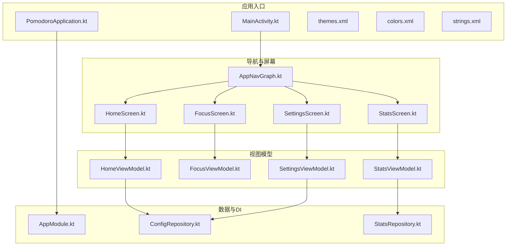
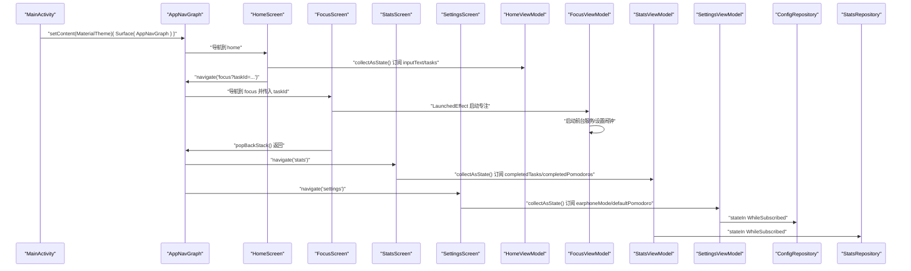
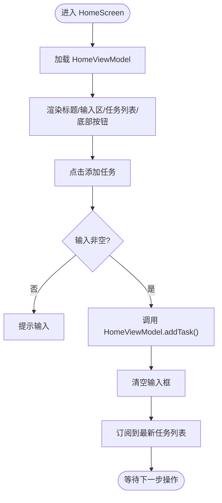
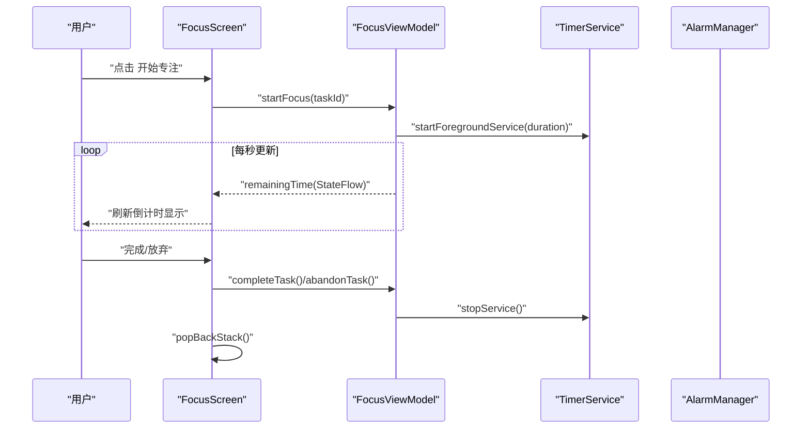
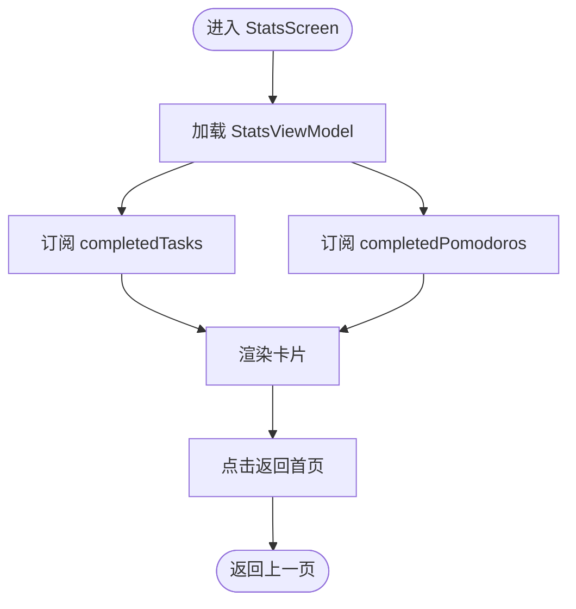
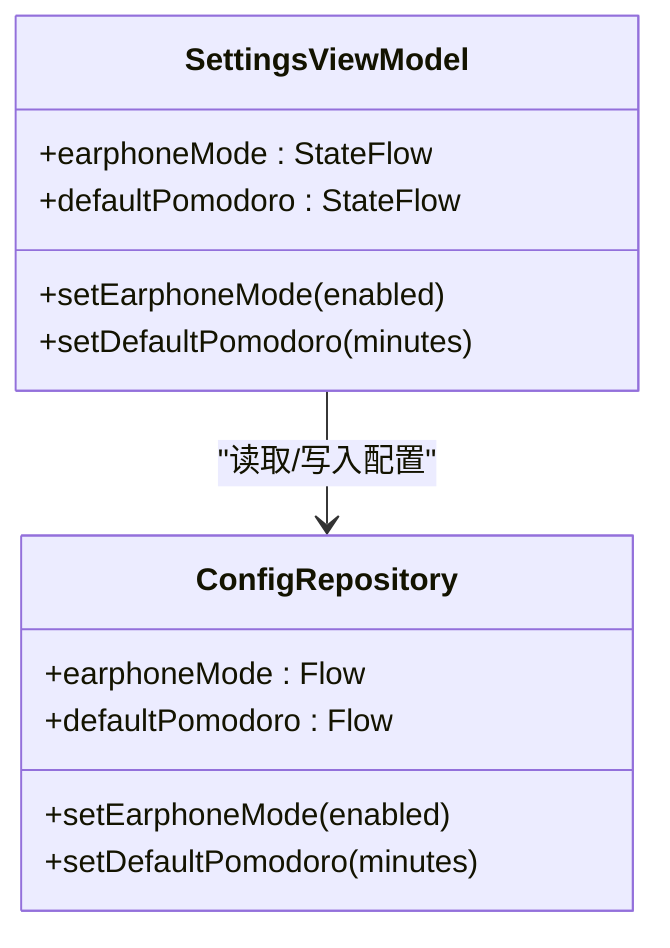
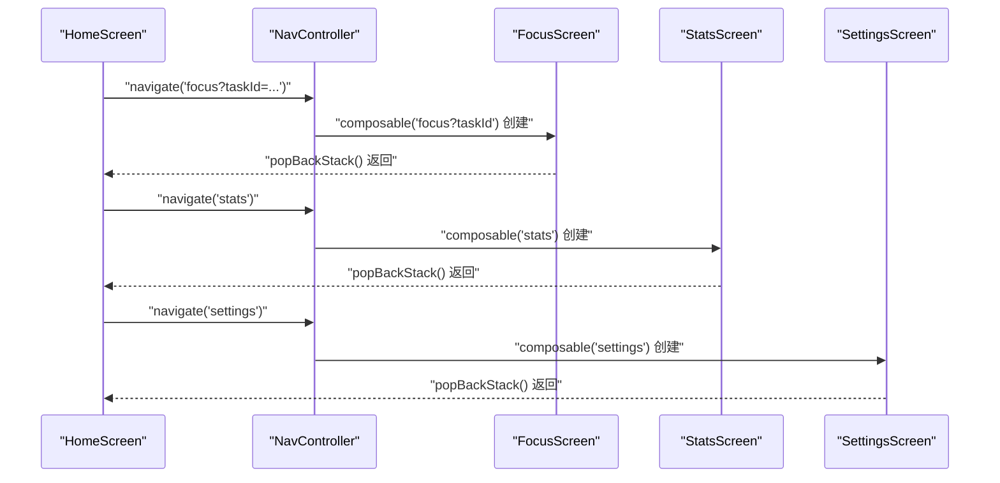
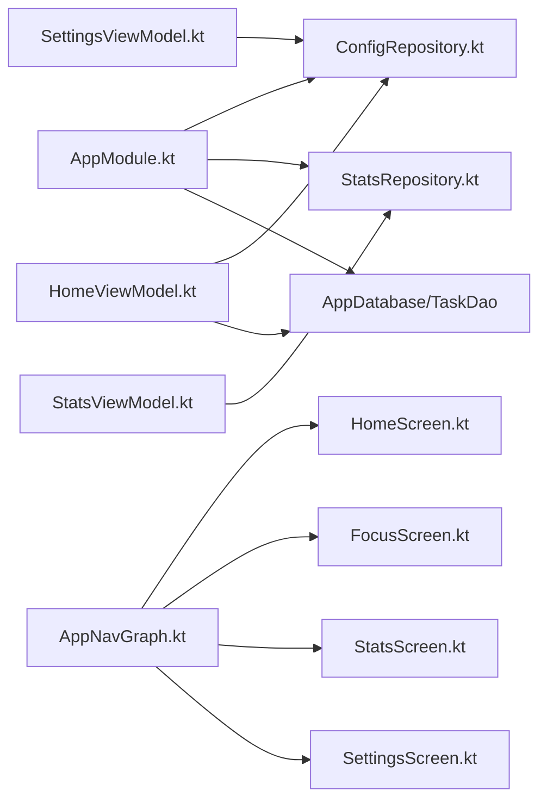

# 用户界面

<cite>
**本文引用的文件**
- [HomeScreen.kt](file://app/src/main/java/com/pomodoroalert/ui/screens/HomeScreen.kt)
- [FocusScreen.kt](file://app/src/main/java/com/pomodoroalert/ui/screens/FocusScreen.kt)
- [StatsScreen.kt](file://app/src/main/java/com/pomodoroalert/ui/screens/StatsScreen.kt)
- [SettingsScreen.kt](file://app/src/main/java/com/pomodoroalert/ui/screens/SettingsScreen.kt)
- [HomeViewModel.kt](file://app/src/main/java/com/pomodoroalert/ui/viewmodel/HomeViewModel.kt)
- [FocusViewModel.kt](file://app/src/main/java/com/pomodoroalert/ui/viewmodel/FocusViewModel.kt)
- [StatsViewModel.kt](file://app/src/main/java/com/pomodoroalert/ui/viewmodel/StatsViewModel.kt)
- [SettingsViewModel.kt](file://app/src/main/java/com/pomodoroalert/ui/viewmodel/SettingsViewModel.kt)
- [AppNavGraph.kt](file://app/src/main/java/com/pomodoroalert/ui/AppNavGraph.kt)
- [MainActivity.kt](file://app/src/main/java/com/pomodoroalert/MainActivity.kt)
- [ConfigRepository.kt](file://app/src/main/java/com/pomodoroalert/data/ConfigRepository.kt)
- [StatsRepository.kt](file://app/src/main/java/com/pomodoroalert/data/StatsRepository.kt)
- [AppModule.kt](file://app/src/main/java/com/pomodoroalert/di/AppModule.kt)
- [PomodoroApplication.kt](file://app/src/main/java/com/pomodoroalert/PomodoroApplication.kt)
- [themes.xml](file://app/src/main/res/values/themes.xml)
- [colors.xml](file://app/src/main/res/values/colors.xml)
- [strings.xml](file://app/src/main/res/values/strings.xml)
</cite>

## 目录
1. [简介](#简介)
2. [项目结构](#项目结构)
3. [核心组件](#核心组件)
4. [架构总览](#架构总览)
5. [详细组件分析](#详细组件分析)
6. [依赖关系分析](#依赖关系分析)
7. [性能考虑](#性能考虑)
8. [故障排查指南](#故障排查指南)
9. [结论](#结论)
10. [附录](#附录)

## 简介
本文件面向PomodoroAlert应用的用户界面系统，围绕Jetpack Compose UI框架进行技术文档梳理，覆盖组件设计、状态管理、布局系统、导航与页面跳转、主题与可复用性、响应式与无障碍、性能优化以及UI测试与调试策略。文档以实际源码为依据，结合架构图与流程图帮助读者快速理解并扩展UI模块。

## 项目结构
UI相关代码主要位于以下位置：
- 屏幕层（Compose可组合函数）：ui/screens
- 视图模型层（ViewModel）：ui/viewmodel
- 导航与入口：ui/AppNavGraph.kt、MainActivity.kt
- 数据与仓库：data/*（供ViewModel使用）
- 依赖注入：di/AppModule.kt
- 应用入口与主题：PomodoroApplication.kt、themes.xml、colors.xml、strings.xml

图表来源
- [MainActivity.kt:11-23](file://app/src/main/java/com/pomodoroalert/MainActivity.kt#L11-L23)
- [AppNavGraph.kt:13-25](file://app/src/main/java/com/pomodoroalert/ui/AppNavGraph.kt#L13-L25)
- [HomeScreen.kt:48-204](file://app/src/main/java/com/pomodoroalert/ui/screens/HomeScreen.kt#L48-L204)
- [FocusScreen.kt:16-69](file://app/src/main/java/com/pomodoroalert/ui/screens/FocusScreen.kt#L16-L69)
- [StatsScreen.kt:15-58](file://app/src/main/java/com/pomodoroalert/ui/screens/StatsScreen.kt#L15-L58)
- [SettingsScreen.kt:15-61](file://app/src/main/java/com/pomodoroalert/ui/screens/SettingsScreen.kt#L15-L61)
- [HomeViewModel.kt:15-52](file://app/src/main/java/com/pomodoroalert/ui/viewmodel/HomeViewModel.kt#L15-L52)
- [FocusViewModel.kt:21-84](file://app/src/main/java/com/pomodoroalert/ui/viewmodel/FocusViewModel.kt#L21-L84)
- [StatsViewModel.kt:12-21](file://app/src/main/java/com/pomodoroalert/ui/viewmodel/StatsViewModel.kt#L12-L21)
- [SettingsViewModel.kt:13-30](file://app/src/main/java/com/pomodoroalert/ui/viewmodel/SettingsViewModel.kt#L13-L30)
- [AppModule.kt:19-60](file://app/src/main/java/com/pomodoroalert/di/AppModule.kt#L19-L60)
- [ConfigRepository.kt:7-18](file://app/src/main/java/com/pomodoroalert/data/ConfigRepository.kt#L7-L18)
- [StatsRepository.kt:6-17](file://app/src/main/java/com/pomodoroalert/data/StatsRepository.kt#L6-L17)

章节来源
- [MainActivity.kt:11-23](file://app/src/main/java/com/pomodoroalert/MainActivity.kt#L11-L23)
- [AppNavGraph.kt:13-25](file://app/src/main/java/com/pomodoroalert/ui/AppNavGraph.kt#L13-L25)

## 核心组件
- 主页（HomeScreen）：负责任务输入、任务列表展示、跳转到专注页与统计/设置页；通过HomeViewModel管理输入文本与任务列表的状态流。
- 专注页（FocusScreen）：展示当前任务名与倒计时，提供“完成/推迟/放弃”操作；通过FocusViewModel驱动倒计时与服务控制。
- 统计页（StatsScreen）：展示当日完成任务数与完成番茄数；通过StatsViewModel订阅统计数据。
- 设置页（SettingsScreen）：提供耳机模式开关与默认专注时长滑条；通过SettingsViewModel读写配置。
- 导航（AppNavGraph）：集中声明路由与页面跳转，支持带参数的路由（如focus?taskId）。
- 入口（MainActivity）：设置Compose主题与Surface，承载导航图。
- 视图模型（ViewModels）：封装UI状态、数据绑定与生命周期处理，使用Hilt注入仓库与上下文。
- 仓库与DI：ConfigRepository、StatsRepository通过UserPreferences与Room DAO提供数据流；AppModule统一提供单例依赖。

章节来源
- [HomeScreen.kt:48-204](file://app/src/main/java/com/pomodoroalert/ui/screens/HomeScreen.kt#L48-L204)
- [FocusScreen.kt:16-69](file://app/src/main/java/com/pomodoroalert/ui/screens/FocusScreen.kt#L16-L69)
- [StatsScreen.kt:15-58](file://app/src/main/java/com/pomodoroalert/ui/screens/StatsScreen.kt#L15-L58)
- [SettingsScreen.kt:15-61](file://app/src/main/java/com/pomodoroalert/ui/screens/SettingsScreen.kt#L15-L61)
- [AppNavGraph.kt:13-25](file://app/src/main/java/com/pomodoroalert/ui/AppNavGraph.kt#L13-L25)
- [MainActivity.kt:11-23](file://app/src/main/java/com/pomodoroalert/MainActivity.kt#L11-L23)
- [HomeViewModel.kt:15-52](file://app/src/main/java/com/pomodoroalert/ui/viewmodel/HomeViewModel.kt#L15-L52)
- [FocusViewModel.kt:21-84](file://app/src/main/java/com/pomodoroalert/ui/viewmodel/FocusViewModel.kt#L21-L84)
- [StatsViewModel.kt:12-21](file://app/src/main/java/com/pomodoroalert/ui/viewmodel/StatsViewModel.kt#L12-L21)
- [SettingsViewModel.kt:13-30](file://app/src/main/java/com/pomodoroalert/ui/viewmodel/SettingsViewModel.kt#L13-L30)
- [AppModule.kt:19-60](file://app/src/main/java/com/pomodoroalert/di/AppModule.kt#L19-L60)
- [ConfigRepository.kt:7-18](file://app/src/main/java/com/pomodoroalert/data/ConfigRepository.kt#L7-L18)
- [StatsRepository.kt:6-17](file://app/src/main/java/com/pomodoroalert/data/StatsRepository.kt#L6-L17)

## 架构总览
下图展示了从入口Activity到导航图、屏幕、视图模型与仓库的数据与控制流：

图表来源
- [MainActivity.kt:11-23](file://app/src/main/java/com/pomodoroalert/MainActivity.kt#L11-L23)
- [AppNavGraph.kt:13-25](file://app/src/main/java/com/pomodoroalert/ui/AppNavGraph.kt#L13-L25)
- [HomeScreen.kt:48-204](file://app/src/main/java/com/pomodoroalert/ui/screens/HomeScreen.kt#L48-L204)
- [FocusScreen.kt:16-69](file://app/src/main/java/com/pomodoroalert/ui/screens/FocusScreen.kt#L16-L69)
- [StatsScreen.kt:15-58](file://app/src/main/java/com/pomodoroalert/ui/screens/StatsScreen.kt#L15-L58)
- [SettingsScreen.kt:15-61](file://app/src/main/java/com/pomodoroalert/ui/screens/SettingsScreen.kt#L15-L61)
- [HomeViewModel.kt:15-52](file://app/src/main/java/com/pomodoroalert/ui/viewmodel/HomeViewModel.kt#L15-L52)
- [FocusViewModel.kt:21-84](file://app/src/main/java/com/pomodoroalert/ui/viewmodel/FocusViewModel.kt#L21-L84)
- [StatsViewModel.kt:12-21](file://app/src/main/java/com/pomodoroalert/ui/viewmodel/StatsViewModel.kt#L12-L21)
- [SettingsViewModel.kt:13-30](file://app/src/main/java/com/pomodoroalert/ui/viewmodel/SettingsViewModel.kt#L13-L30)
- [ConfigRepository.kt:7-18](file://app/src/main/java/com/pomodoroalert/data/ConfigRepository.kt#L7-L18)
- [StatsRepository.kt:6-17](file://app/src/main/java/com/pomodoroalert/data/StatsRepository.kt#L6-L17)

## 详细组件分析

### 主页（HomeScreen）
- 布局与交互
  - 使用Surface包裹全屏背景色，Column组织标题、输入区、按钮与任务列表。
  - 顶部输入区包含文本框与两个功能按钮（语音输入、日历同步），按钮采用圆角卡片背景。
  - 添加任务按钮根据输入文本非空时启用；点击后调用ViewModel添加任务。
  - 任务列表使用LazyColumn展示，每项包含任务名与时长，并提供“开始专注”按钮，点击后携带taskId跳转专注页。
  - 底部区域提供“数据统计”和“偏好设置”两个功能按钮。
- 状态管理
  - 通过hiltViewModel注入HomeViewModel，使用collectAsState订阅inputText与tasks。
  - setInput用于更新输入框文本；addTask根据配置仓库的默认专注时长创建新任务并插入数据库。
- 可复用性与主题
  - 使用Material3主题与Typography；颜色常量在屏幕内部定义，便于主题切换时集中修改。
- 无障碍与响应式
  - 文本与图标均提供contentDescription；布局使用weight与spacers保证在不同尺寸设备上合理分布。

图表来源
- [HomeScreen.kt:48-204](file://app/src/main/java/com/pomodoroalert/ui/screens/HomeScreen.kt#L48-L204)
- [HomeViewModel.kt:15-52](file://app/src/main/java/com/pomodoroalert/ui/viewmodel/HomeViewModel.kt#L15-L52)

章节来源
- [HomeScreen.kt:48-204](file://app/src/main/java/com/pomodoroalert/ui/screens/HomeScreen.kt#L48-L204)
- [HomeViewModel.kt:15-52](file://app/src/main/java/com/pomodoroalert/ui/viewmodel/HomeViewModel.kt#L15-L52)

### 专注页（FocusScreen）
- 功能与交互
  - 接收taskId参数，LaunchedEffect在taskId变化时启动专注。
  - 展示当前任务名与倒计时（分:秒格式），提供“完成/推迟10分钟/放弃”三个操作按钮。
  - 完成或放弃后通过navController.popBackStack()返回上一页。
- 状态与服务
  - FocusViewModel维护currentTask与remainingTime两个StateFlow。
  - startFocus根据任务时长启动前台TimerService；postpone通过AlarmManager设置精确闹钟；completeTask/abandonTask更新任务状态并停止服务。
- 生命周期与资源释放
  - 在完成/放弃时停止服务，避免后台资源泄漏。

图表来源
- [FocusScreen.kt:16-69](file://app/src/main/java/com/pomodoroalert/ui/screens/FocusScreen.kt#L16-L69)
- [FocusViewModel.kt:21-84](file://app/src/main/java/com/pomodoroalert/ui/viewmodel/FocusViewModel.kt#L21-L84)

章节来源
- [FocusScreen.kt:16-69](file://app/src/main/java/com/pomodoroalert/ui/screens/FocusScreen.kt#L16-L69)
- [FocusViewModel.kt:21-84](file://app/src/main/java/com/pomodoroalert/ui/viewmodel/FocusViewModel.kt#L21-L84)

### 统计页（StatsScreen）
- 功能与交互
  - 展示“今日完成番茄数”和“今日完成任务数”两个卡片统计信息。
  - 提供“返回首页”按钮，使用popBackStack()返回。
- 数据来源
  - StatsViewModel通过StatsRepository提供的Flow计算并stateIn订阅，确保在订阅者活跃时保持最新值。

图表来源
- [StatsScreen.kt:15-58](file://app/src/main/java/com/pomodoroalert/ui/screens/StatsScreen.kt#L15-L58)
- [StatsViewModel.kt:12-21](file://app/src/main/java/com/pomodoroalert/ui/viewmodel/StatsViewModel.kt#L12-L21)
- [StatsRepository.kt:6-17](file://app/src/main/java/com/pomodoroalert/data/StatsRepository.kt#L6-L17)

章节来源
- [StatsScreen.kt:15-58](file://app/src/main/java/com/pomodoroalert/ui/screens/StatsScreen.kt#L15-L58)
- [StatsViewModel.kt:12-21](file://app/src/main/java/com/pomodoroalert/ui/viewmodel/StatsViewModel.kt#L12-L21)
- [StatsRepository.kt:6-17](file://app/src/main/java/com/pomodoroalert/data/StatsRepository.kt#L6-L17)

### 设置页（SettingsScreen）
- 功能与交互
  - 耳机模式开关：绑定到ConfigRepository的earphoneMode Flow，使用stateIn维持订阅。
  - 默认专注时长滑条：范围5~60分钟，实时显示当前设置值。
  - 两个设置变更均通过对应ViewModel方法异步写入UserPreferences。
- 配置仓库
  - ConfigRepository封装UserPreferences的Flow与写入方法，供ViewModel直接消费。

图表来源
- [SettingsViewModel.kt:13-30](file://app/src/main/java/com/pomodoroalert/ui/viewmodel/SettingsViewModel.kt#L13-L30)
- [ConfigRepository.kt:7-18](file://app/src/main/java/com/pomodoroalert/data/ConfigRepository.kt#L7-L18)

章节来源
- [SettingsScreen.kt:15-61](file://app/src/main/java/com/pomodoroalert/ui/screens/SettingsScreen.kt#L15-L61)
- [SettingsViewModel.kt:13-30](file://app/src/main/java/com/pomodoroalert/ui/viewmodel/SettingsViewModel.kt#L13-L30)
- [ConfigRepository.kt:7-18](file://app/src/main/java/com/pomodoroalert/data/ConfigRepository.kt#L7-L18)

### 导航系统与页面跳转
- 路由定义
  - home/focus?taskId/stats/settings四个路由，focus路由支持查询参数taskId。
- 页面跳转
  - HomeScreen中通过navController.navigate跳转至focus/stats/settings。
  - FocusScreen与StatsScreen/SettingsScreen通过popBackStack返回。
- 参数传递
  - FocusScreen接收taskId并在LaunchedEffect中启动专注流程。

图表来源
- [AppNavGraph.kt:13-25](file://app/src/main/java/com/pomodoroalert/ui/AppNavGraph.kt#L13-L25)
- [HomeScreen.kt:169-201](file://app/src/main/java/com/pomodoroalert/ui/screens/HomeScreen.kt#L169-L201)
- [FocusScreen.kt:48-67](file://app/src/main/java/com/pomodoroalert/ui/screens/FocusScreen.kt#L48-L67)
- [StatsScreen.kt:54-56](file://app/src/main/java/com/pomodoroalert/ui/screens/StatsScreen.kt#L54-L56)
- [SettingsScreen.kt:57-59](file://app/src/main/java/com/pomodoroalert/ui/screens/SettingsScreen.kt#L57-L59)

章节来源
- [AppNavGraph.kt:13-25](file://app/src/main/java/com/pomodoroalert/ui/AppNavGraph.kt#L13-L25)
- [HomeScreen.kt:169-201](file://app/src/main/java/com/pomodoroalert/ui/screens/HomeScreen.kt#L169-L201)
- [FocusScreen.kt:48-67](file://app/src/main/java/com/pomodoroalert/ui/screens/FocusScreen.kt#L48-L67)
- [StatsScreen.kt:54-56](file://app/src/main/java/com/pomodoroalert/ui/screens/StatsScreen.kt#L54-L56)
- [SettingsScreen.kt:57-59](file://app/src/main/java/com/pomodoroalert/ui/screens/SettingsScreen.kt#L57-L59)

## 依赖关系分析
- 依赖注入
  - AppModule提供AppDatabase、TaskDao、UserPreferences、ConfigRepository、StatsRepository、CalendarManager等单例。
  - Hilt在各ViewModel中注入仓库，实现UI与数据层解耦。
- 仓库与数据流
  - ConfigRepository基于UserPreferences暴露Flow，SettingsViewModel通过stateIn订阅。
  - StatsRepository基于TaskDao计算统计数据，StatsViewModel通过stateIn订阅。
- 应用入口
  - MainActivity设置Compose主题与Surface，AppNavGraph承载导航。

图表来源
- [AppModule.kt:19-60](file://app/src/main/java/com/pomodoroalert/di/AppModule.kt#L19-L60)
- [ConfigRepository.kt:7-18](file://app/src/main/java/com/pomodoroalert/data/ConfigRepository.kt#L7-L18)
- [StatsRepository.kt:6-17](file://app/src/main/java/com/pomodoroalert/data/StatsRepository.kt#L6-L17)
- [HomeViewModel.kt:15-52](file://app/src/main/java/com/pomodoroalert/ui/viewmodel/HomeViewModel.kt#L15-L52)
- [StatsViewModel.kt:12-21](file://app/src/main/java/com/pomodoroalert/ui/viewmodel/StatsViewModel.kt#L12-L21)
- [SettingsViewModel.kt:13-30](file://app/src/main/java/com/pomodoroalert/ui/viewmodel/SettingsViewModel.kt#L13-L30)
- [AppNavGraph.kt:13-25](file://app/src/main/java/com/pomodoroalert/ui/AppNavGraph.kt#L13-L25)

章节来源
- [AppModule.kt:19-60](file://app/src/main/java/com/pomodoroalert/di/AppModule.kt#L19-L60)
- [ConfigRepository.kt:7-18](file://app/src/main/java/com/pomodoroalert/data/ConfigRepository.kt#L7-L18)
- [StatsRepository.kt:6-17](file://app/src/main/java/com/pomodoroalert/data/StatsRepository.kt#L6-L17)
- [HomeViewModel.kt:15-52](file://app/src/main/java/com/pomodoroalert/ui/viewmodel/HomeViewModel.kt#L15-L52)
- [StatsViewModel.kt:12-21](file://app/src/main/java/com/pomodoroalert/ui/viewmodel/StatsViewModel.kt#L12-L21)
- [SettingsViewModel.kt:13-30](file://app/src/main/java/com/pomodoroalert/ui/viewmodel/SettingsViewModel.kt#L13-L30)
- [AppNavGraph.kt:13-25](file://app/src/main/java/com/pomodoroalert/ui/AppNavGraph.kt#L13-L25)

## 性能考虑
- 状态流与订阅
  - 使用collectAsState订阅StateFlow，避免不必要的重组；ViewModel中使用stateIn对仓库Flow进行热共享，减少重复计算。
- 列表渲染
  - 任务列表使用LazyColumn，按需渲染子项，降低首帧压力。
- 服务与定时
  - 专注页通过AlarmManager设置精确闹钟，避免轮询；完成后及时停止服务，防止资源泄漏。
- 主题与绘制
  - 使用Material3主题与统一颜色资源，减少自定义绘制开销；屏幕内局部颜色常量便于主题切换。

## 故障排查指南
- 导航参数为空
  - FocusScreen依赖taskId启动专注，若参数缺失可能导致任务为空；可在LaunchedEffect中增加空值保护与错误提示。
- 服务未停止
  - 完成/放弃后必须停止TimerService；若出现后台持续运行，检查completeTask/abandonTask是否被调用。
- 配置未生效
  - SettingsViewModel写入ConfigRepository后，需确认stateIn订阅是否正确；可通过日志或断点验证Flow变化。
- 依赖注入问题
  - 若ViewModel无法注入仓库，请确认AppModule提供方法与作用域正确，且应用类已标注@HiltAndroidApp。

章节来源
- [FocusScreen.kt:22-26](file://app/src/main/java/com/pomodoroalert/ui/screens/FocusScreen.kt#L22-L26)
- [FocusViewModel.kt:67-83](file://app/src/main/java/com/pomodoroalert/ui/viewmodel/FocusViewModel.kt#L67-L83)
- [SettingsViewModel.kt:23-29](file://app/src/main/java/com/pomodoroalert/ui/viewmodel/SettingsViewModel.kt#L23-L29)
- [PomodoroApplication.kt:6](file://app/src/main/java/com/pomodoroalert/PomodoroApplication.kt#L6)

## 结论
本UI系统以Jetpack Compose为核心，结合MVVM与Hilt依赖注入，实现了清晰的职责分离与良好的可维护性。通过状态流驱动的UI更新、合理的导航与页面跳转、以及仓库层的数据抽象，系统具备良好的扩展性与可测试性。建议在后续迭代中进一步完善无障碍属性、引入单元测试与UI测试套件，并持续优化主题与动画细节。

## 附录
- 主题与颜色
  - 主题样式定义于themes.xml，颜色资源定义于colors.xml；字符串资源定义于strings.xml。
- 入口与容器
  - MainActivity设置MaterialTheme与Surface，承载AppNavGraph作为根容器。

章节来源
- [themes.xml:1-9](file://app/src/main/res/values/themes.xml#L1-L9)
- [colors.xml:1-11](file://app/src/main/res/values/colors.xml#L1-L11)
- [strings.xml:1-5](file://app/src/main/res/values/strings.xml#L1-L5)
- [MainActivity.kt:11-23](file://app/src/main/java/com/pomodoroalert/MainActivity.kt#L11-L23)