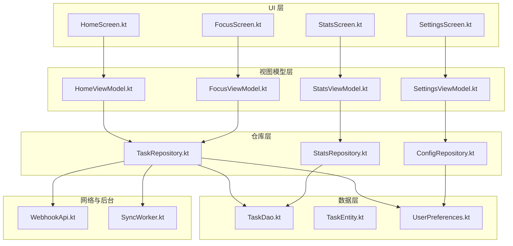
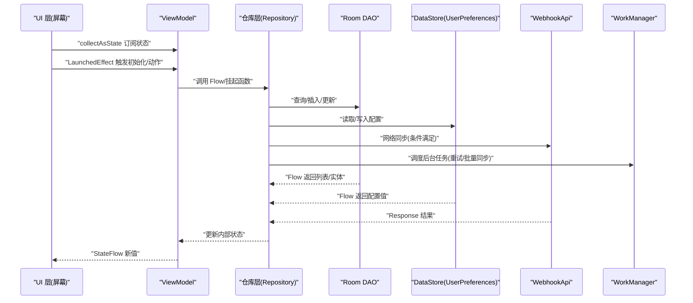
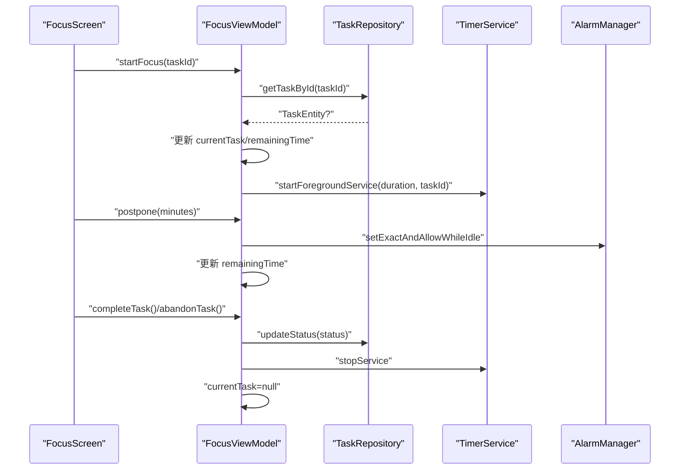
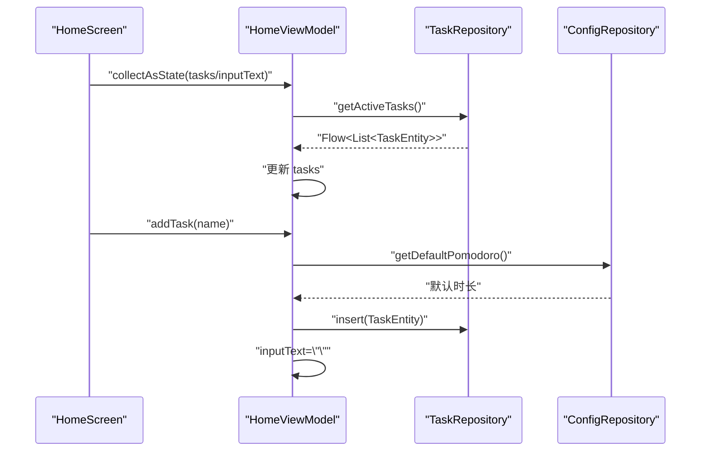
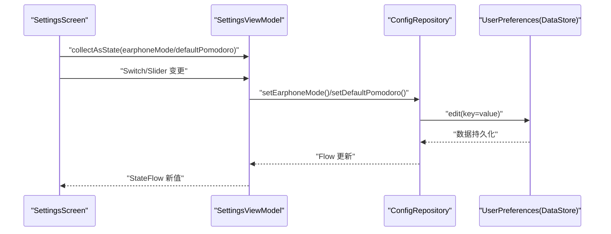
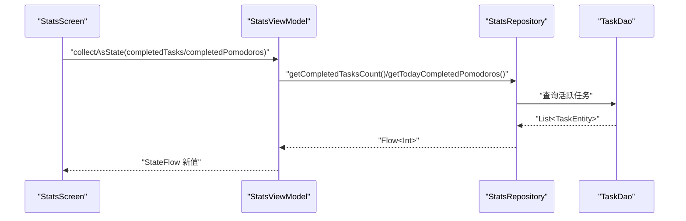
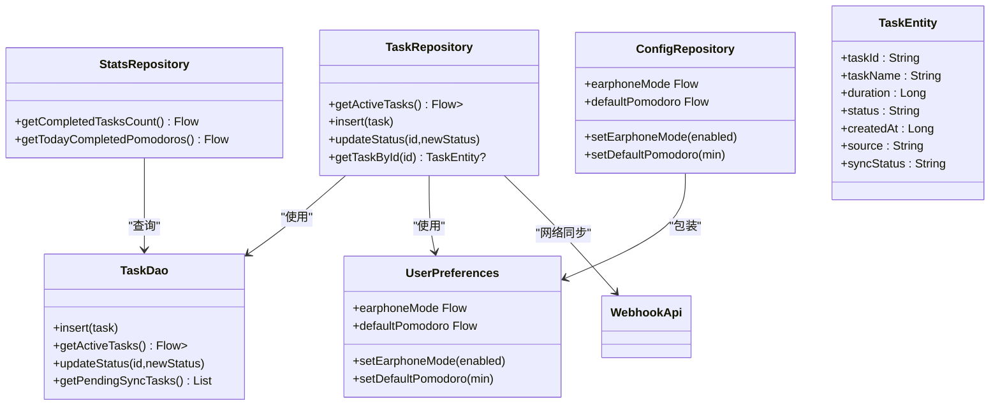
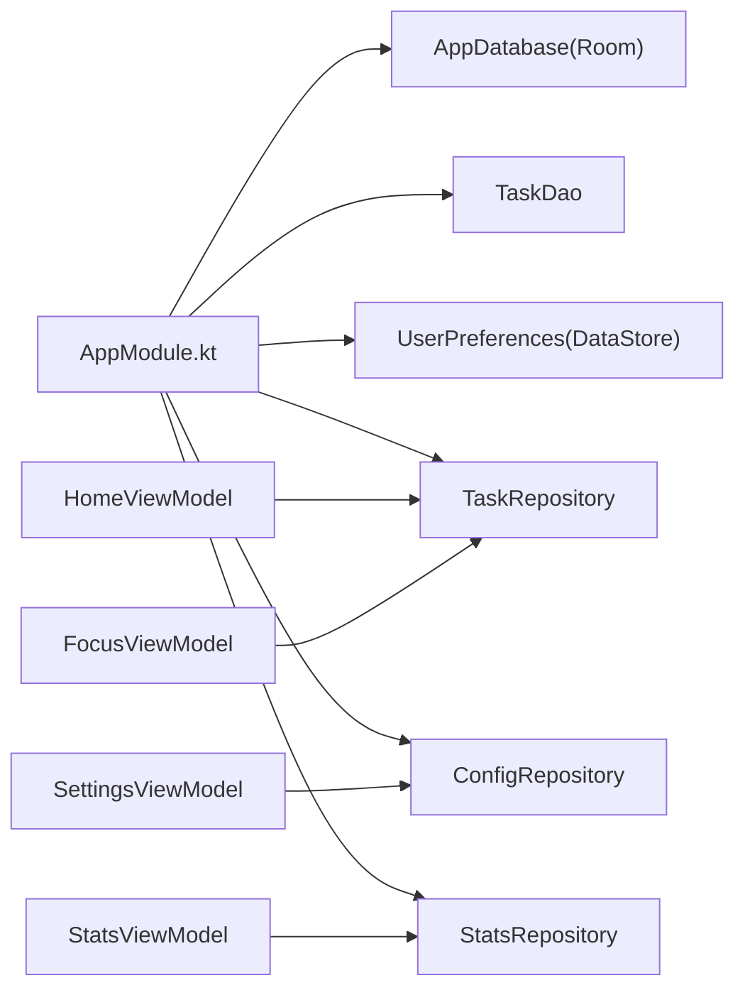

# 视图模型架构

<cite>
**本文引用的文件**
- [FocusViewModel.kt](file://app/src/main/java/com/pomodoroalert/ui/viewmodel/FocusViewModel.kt)
- [HomeViewModel.kt](file://app/src/main/java/com/pomodoroalert/ui/viewmodel/HomeViewModel.kt)
- [SettingsViewModel.kt](file://app/src/main/java/com/pomodoroalert/ui/viewmodel/SettingsViewModel.kt)
- [StatsViewModel.kt](file://app/src/main/java/com/pomodoroalert/ui/viewmodel/StatsViewModel.kt)
- [TaskRepository.kt](file://app/src/main/java/com/pomodoroalert/data/TaskRepository.kt)
- [ConfigRepository.kt](file://app/src/main/java/com/pomodoroalert/data/ConfigRepository.kt)
- [StatsRepository.kt](file://app/src/main/java/com/pomodoroalert/data/StatsRepository.kt)
- [AppModule.kt](file://app/src/main/java/com/pomodoroalert/di/AppModule.kt)
- [UserPreferences.kt](file://app/src/main/java/com/pomodoroalert/data/UserPreferences.kt)
- [TaskEntity.kt](file://app/src/main/java/com/pomodoroalert/data/TaskEntity.kt)
- [TaskDao.kt](file://app/src/main/java/com/pomodoroalert/data/TaskDao.kt)
- [WebhookApi.kt](file://app/src/main/java/com/pomodoroalert/network/WebhookApi.kt)
- [SyncWorker.kt](file://app/src/main/java/com/pomodoroalert/worker/SyncWorker.kt)
- [FocusScreen.kt](file://app/src/main/java/com/pomodoroalert/ui/screens/FocusScreen.kt)
- [HomeScreen.kt](file://app/src/main/java/com/pomodoroalert/ui/screens/HomeScreen.kt)
- [SettingsScreen.kt](file://app/src/main/java/com/pomodoroalert/ui/screens/SettingsScreen.kt)
- [StatsScreen.kt](file://app/src/main/java/com/pomodoroalert/ui/screens/StatsScreen.kt)
</cite>

## 目录
1. [引言](#引言)
2. [项目结构](#项目结构)
3. [核心组件](#核心组件)
4. [架构总览](#架构总览)
5. [详细组件分析](#详细组件分析)
6. [依赖关系分析](#依赖关系分析)
7. [性能考虑](#性能考虑)
8. [故障排查指南](#故障排查指南)
9. [结论](#结论)
10. [附录](#附录)

## 引言
本文件系统性阐述 PomodoroAlert 的 MVVM 架构在项目中的落地方式，重点覆盖 ViewModel 的设计原则、状态管理（StateFlow）、数据绑定（collectAsState）、与 UI 的交互（LaunchedEffect、事件回调）、以及协程与 Flow 的使用。文档同时给出各 ViewModel 的职责边界、与数据层/仓库层的协作、错误处理与重试策略、性能优化与内存泄漏防护建议，并提供可操作的测试策略与 Mock 数据方案。

## 项目结构
- UI 层采用 Jetpack Compose，通过 hiltViewModel 获取 ViewModel 实例，使用 collectAsState 订阅状态流，以函数式 UI 呈现数据。
- ViewModel 层负责业务编排、状态封装、与仓库层交互、触发后台服务或后台任务。
- 数据层由 Room DAO 提供数据库访问，UserPreferences 通过 DataStore 管理配置；仓库层聚合 DAO、DataStore、网络接口与 WorkManager，统一对外暴露 Flow 或挂起函数。
- DI 使用 Hilt 模块提供单例与依赖注入，确保跨组件一致的依赖来源。

图表来源
- [HomeScreen.kt](file://app/src/main/java/com/pomodoroalert/ui/screens/HomeScreen.kt)
- [FocusScreen.kt](file://app/src/main/java/com/pomodoroalert/ui/screens/FocusScreen.kt)
- [SettingsScreen.kt](file://app/src/main/java/com/pomodoroalert/ui/screens/SettingsScreen.kt)
- [StatsScreen.kt](file://app/src/main/java/com/pomodoroalert/ui/screens/StatsScreen.kt)
- [HomeViewModel.kt](file://app/src/main/java/com/pomodoroalert/ui/viewmodel/HomeViewModel.kt)
- [FocusViewModel.kt](file://app/src/main/java/com/pomodoroalert/ui/viewmodel/FocusViewModel.kt)
- [SettingsViewModel.kt](file://app/src/main/java/com/pomodoroalert/ui/viewmodel/SettingsViewModel.kt)
- [StatsViewModel.kt](file://app/src/main/java/com/pomodoroalert/ui/viewmodel/StatsViewModel.kt)
- [TaskRepository.kt](file://app/src/main/java/com/pomodoroalert/data/TaskRepository.kt)
- [ConfigRepository.kt](file://app/src/main/java/com/pomodoroalert/data/ConfigRepository.kt)
- [StatsRepository.kt](file://app/src/main/java/com/pomodoroalert/data/StatsRepository.kt)
- [TaskDao.kt](file://app/src/main/java/com/pomodoroalert/data/TaskDao.kt)
- [UserPreferences.kt](file://app/src/main/java/com/pomodoroalert/data/UserPreferences.kt)
- [WebhookApi.kt](file://app/src/main/java/com/pomodoroalert/network/WebhookApi.kt)
- [SyncWorker.kt](file://app/src/main/java/com/pomodoroalert/worker/SyncWorker.kt)

章节来源
- [AppModule.kt](file://app/src/main/java/com/pomodoroalert/di/AppModule.kt)

## 核心组件
- ViewModel 设计原则
  - 单一职责：每个 ViewModel 负责一个页面或功能域的状态与业务。
  - 不持有 UI 上下文：通过 Hilt 注入 Context 或服务，避免直接持有 Activity/Fragment。
  - 状态外显：通过 StateFlow 暴露不可变状态，UI 仅订阅，不直接修改。
  - 生命周期安全：使用 viewModelScope 管理协程，随 ViewModel 销毁自动取消。
- 状态管理
  - 使用 MutableStateFlow 封装内部状态，asStateFlow 对外暴露只读 StateFlow。
  - 配置与统计类 ViewModel 使用 stateIn 将上游 Flow 转换为带默认值的 StateFlow，支持 WhileSubscribed 策略。
- 数据绑定
  - UI 使用 collectAsState 订阅 ViewModel 的 StateFlow，实现响应式渲染。
  - 使用 LaunchedEffect 触发一次性副作用（如启动专注流程）。
- 协程与 Flow
  - ViewModel 内部使用 viewModelScope 启动协程，处理异步任务（查询、插入、更新、网络请求、调度后台任务）。
  - 仓库层返回 Flow，ViewModel 可直接收集或转换为 StateFlow，保证状态一致性与可观察性。

章节来源
- [HomeViewModel.kt](file://app/src/main/java/com/pomodoroalert/ui/viewmodel/HomeViewModel.kt)
- [FocusViewModel.kt](file://app/src/main/java/com/pomodoroalert/ui/viewmodel/FocusViewModel.kt)
- [SettingsViewModel.kt](file://app/src/main/java/com/pomodoroalert/ui/viewmodel/SettingsViewModel.kt)
- [StatsViewModel.kt](file://app/src/main/java/com/pomodoroalert/ui/viewmodel/StatsViewModel.kt)
- [HomeScreen.kt](file://app/src/main/java/com/pomodoroalert/ui/screens/HomeScreen.kt)
- [FocusScreen.kt](file://app/src/main/java/com/pomodoroalert/ui/screens/FocusScreen.kt)
- [SettingsScreen.kt](file://app/src/main/java/com/pomodoroalert/ui/screens/SettingsScreen.kt)
- [StatsScreen.kt](file://app/src/main/java/com/pomodoroalert/ui/screens/StatsScreen.kt)

## 架构总览
MVVM 在本项目中的实现要点：
- UI 层：Compose 函数通过 hiltViewModel 获取 ViewModel，collectAsState 订阅状态，LaunchedEffect 处理副作用。
- ViewModel 层：封装状态与业务逻辑，调用仓库层提供的 Flow 或挂起函数，必要时启动前台服务或调度后台任务。
- 仓库层：聚合 DAO、DataStore、网络接口与 WorkManager，统一对外暴露 Flow 或挂起函数，负责数据一致性与重试策略。
- DI 层：Hilt 模块提供数据库、DAO、UserPreferences、仓库实例，确保单例与依赖注入。

图表来源
- [HomeScreen.kt](file://app/src/main/java/com/pomodoroalert/ui/screens/HomeScreen.kt)
- [FocusScreen.kt](file://app/src/main/java/com/pomodoroalert/ui/screens/FocusScreen.kt)
- [SettingsScreen.kt](file://app/src/main/java/com/pomodoroalert/ui/screens/SettingsScreen.kt)
- [StatsScreen.kt](file://app/src/main/java/com/pomodoroalert/ui/screens/StatsScreen.kt)
- [HomeViewModel.kt](file://app/src/main/java/com/pomodoroalert/ui/viewmodel/HomeViewModel.kt)
- [FocusViewModel.kt](file://app/src/main/java/com/pomodoroalert/ui/viewmodel/FocusViewModel.kt)
- [SettingsViewModel.kt](file://app/src/main/java/com/pomodoroalert/ui/viewmodel/SettingsViewModel.kt)
- [StatsViewModel.kt](file://app/src/main/java/com/pomodoroalert/ui/viewmodel/StatsViewModel.kt)
- [TaskRepository.kt](file://app/src/main/java/com/pomodoroalert/data/TaskRepository.kt)
- [ConfigRepository.kt](file://app/src/main/java/com/pomodoroalert/data/ConfigRepository.kt)
- [StatsRepository.kt](file://app/src/main/java/com/pomodoroalert/data/StatsRepository.kt)
- [TaskDao.kt](file://app/src/main/java/com/pomodoroalert/data/TaskDao.kt)
- [UserPreferences.kt](file://app/src/main/java/com/pomodoroalert/data/UserPreferences.kt)
- [WebhookApi.kt](file://app/src/main/java/com/pomodoroalert/network/WebhookApi.kt)
- [SyncWorker.kt](file://app/src/main/java/com/pomodoroalert/worker/SyncWorker.kt)

## 详细组件分析

### FocusViewModel 分析
- 职责边界
  - 维护当前专注任务与剩余时间状态。
  - 启动/停止前台服务，处理推迟与完成/放弃任务的业务。
- 状态管理
  - currentTask: StateFlow<TaskEntity?>
  - remainingTime: StateFlow<Long>
  - 使用 asStateFlow 对外暴露只读状态。
- 业务流程
  - startFocus：根据 taskId 查询任务，初始化剩余时间，启动 TimerService。
  - postpone：基于 UI 输入分钟数计算新时长，设置精确闹钟，更新剩余时间。
  - completeTask/abandonTask：更新任务状态，停止服务，清空当前任务。
- 与 UI 的交互
  - UI 通过 collectAsState 订阅 remainingTime/currentTask，按钮点击触发对应方法。
  - LaunchedEffect 在 taskId 到来时自动启动专注流程。
- 协程与 Flow
  - viewModelScope.launch 执行异步任务。
  - 依赖 TaskRepository 提供的 Flow/挂起函数。

图表来源
- [FocusScreen.kt](file://app/src/main/java/com/pomodoroalert/ui/screens/FocusScreen.kt)
- [FocusViewModel.kt](file://app/src/main/java/com/pomodoroalert/ui/viewmodel/FocusViewModel.kt)
- [TaskRepository.kt](file://app/src/main/java/com/pomodoroalert/data/TaskRepository.kt)

章节来源
- [FocusViewModel.kt](file://app/src/main/java/com/pomodoroalert/ui/viewmodel/FocusViewModel.kt)
- [FocusScreen.kt](file://app/src/main/java/com/pomodoroalert/ui/screens/FocusScreen.kt)

### HomeViewModel 分析
- 职责边界
  - 维护任务列表与输入框文本状态。
  - 初始化时订阅活跃任务列表，新增任务时读取默认专注时长并插入数据库。
- 状态管理
  - tasks: StateFlow<List<TaskEntity>>
  - inputText: StateFlow<String>
- 业务流程
  - init 中使用 viewModelScope.launch 收集 getActiveTasks() 并更新 tasks。
  - addTask：从 ConfigRepository 获取默认时长，构造 TaskEntity，插入数据库并清空输入框。
- 与 UI 的交互
  - UI 通过 collectAsState 订阅 tasks/inputText，输入框与按钮事件映射到 setInput/addTask。
- 协程与 Flow
  - 依赖 TaskRepository 的 Flow 与 DAO 的挂起函数。

图表来源
- [HomeScreen.kt](file://app/src/main/java/com/pomodoroalert/ui/screens/HomeScreen.kt)
- [HomeViewModel.kt](file://app/src/main/java/com/pomodoroalert/ui/viewmodel/HomeViewModel.kt)
- [TaskRepository.kt](file://app/src/main/java/com/pomodoroalert/data/TaskRepository.kt)
- [ConfigRepository.kt](file://app/src/main/java/com/pomodoroalert/data/ConfigRepository.kt)

章节来源
- [HomeViewModel.kt](file://app/src/main/java/com/pomodoroalert/ui/viewmodel/HomeViewModel.kt)
- [HomeScreen.kt](file://app/src/main/java/com/pomodoroalert/ui/screens/HomeScreen.kt)

### SettingsViewModel 分析
- 职责边界
  - 管理用户偏好（耳机模式、默认专注时长、声音主题）。
- 状态管理
  - earphoneMode: StateFlow<Boolean>
  - defaultPomodoro: StateFlow<Int>
  - 使用 stateIn(viewModelScope, WhileSubscribed, 默认值) 将上游 Flow 转为可观察状态。
- 业务流程
  - setEarphoneMode/setDefaultPomodoro：调用 ConfigRepository 写入 DataStore。
- 与 UI 的交互
  - UI 通过 collectAsState 订阅状态，Switch/Slider 的变更回调映射到设置方法。
- 协程与 Flow
  - ConfigRepository 基于 UserPreferences 的 Flow，ViewModel 通过 stateIn 转换。

图表来源
- [SettingsScreen.kt](file://app/src/main/java/com/pomodoroalert/ui/screens/SettingsScreen.kt)
- [SettingsViewModel.kt](file://app/src/main/java/com/pomodoroalert/ui/viewmodel/SettingsViewModel.kt)
- [ConfigRepository.kt](file://app/src/main/java/com/pomodoroalert/data/ConfigRepository.kt)
- [UserPreferences.kt](file://app/src/main/java/com/pomodoroalert/data/UserPreferences.kt)

章节来源
- [SettingsViewModel.kt](file://app/src/main/java/com/pomodoroalert/ui/viewmodel/SettingsViewModel.kt)
- [SettingsScreen.kt](file://app/src/main/java/com/pomodoroalert/ui/screens/SettingsScreen.kt)

### StatsViewModel 分析
- 职责边界
  - 提供统计数据（今日完成任务数、今日完成番茄数）。
- 状态管理
  - completedTasks: StateFlow<Int>
  - completedPomodoros: StateFlow<Int>
  - 使用 stateIn 将上游 Flow 转为可观察状态。
- 业务流程
  - 依赖 StatsRepository 的 Flow，V1 版本将“完成任务数”作为“番茄数”。
- 与 UI 的交互
  - UI 通过 collectAsState 订阅统计值并展示卡片。

图表来源
- [StatsScreen.kt](file://app/src/main/java/com/pomodoroalert/ui/screens/StatsScreen.kt)
- [StatsViewModel.kt](file://app/src/main/java/com/pomodoroalert/ui/viewmodel/StatsViewModel.kt)
- [StatsRepository.kt](file://app/src/main/java/com/pomodoroalert/data/StatsRepository.kt)
- [TaskDao.kt](file://app/src/main/java/com/pomodoroalert/data/TaskDao.kt)

章节来源
- [StatsViewModel.kt](file://app/src/main/java/com/pomodoroalert/ui/viewmodel/StatsViewModel.kt)
- [StatsScreen.kt](file://app/src/main/java/com/pomodoroalert/ui/screens/StatsScreen.kt)

### 数据与仓库层
- TaskRepository
  - 提供 getActiveTasks、insert、updateStatus、getTaskById。
  - 在任务状态更新为“已完成/已放弃/推迟”时触发同步流程：优先尝试网络同步，失败则标记 Pending 并调度 SyncWorker。
  - 使用 WorkManager 在网络可用时重试同步。
- ConfigRepository
  - 暴露 earphoneMode/defaultPomodoro/voiceTone 三个 Flow，并提供对应的写入方法。
- StatsRepository
  - 基于 TaskDao 的活跃任务 Flow 计算完成任务数与今日完成番茄数。
- UserPreferences
  - 基于 DataStore 的 Flow 包装，提供布尔、整型、字符串键值读写。
- TaskDao/TaskEntity
  - Room 实体与 DAO 定义，提供插入、查询、更新、按状态筛选等能力。

图表来源
- [TaskRepository.kt](file://app/src/main/java/com/pomodoroalert/data/TaskRepository.kt)
- [ConfigRepository.kt](file://app/src/main/java/com/pomodoroalert/data/ConfigRepository.kt)
- [StatsRepository.kt](file://app/src/main/java/com/pomodoroalert/data/StatsRepository.kt)
- [UserPreferences.kt](file://app/src/main/java/com/pomodoroalert/data/UserPreferences.kt)
- [TaskDao.kt](file://app/src/main/java/com/pomodoroalert/data/TaskDao.kt)
- [TaskEntity.kt](file://app/src/main/java/com/pomodoroalert/data/TaskEntity.kt)
- [WebhookApi.kt](file://app/src/main/java/com/pomodoroalert/network/WebhookApi.kt)

章节来源
- [TaskRepository.kt](file://app/src/main/java/com/pomodoroalert/data/TaskRepository.kt)
- [ConfigRepository.kt](file://app/src/main/java/com/pomodoroalert/data/ConfigRepository.kt)
- [StatsRepository.kt](file://app/src/main/java/com/pomodoroalert/data/StatsRepository.kt)
- [UserPreferences.kt](file://app/src/main/java/com/pomodoroalert/data/UserPreferences.kt)
- [TaskDao.kt](file://app/src/main/java/com/pomodoroalert/data/TaskDao.kt)
- [TaskEntity.kt](file://app/src/main/java/com/pomodoroalert/data/TaskEntity.kt)

## 依赖关系分析
- Hilt 模块提供数据库、DAO、UserPreferences、仓库实例，确保单例与依赖注入。
- ViewModel 通过构造函数注入仓库实例，避免在内部创建依赖。
- 仓库层对上层屏蔽底层实现细节（Room、DataStore、Retrofit、WorkManager），统一对外暴露 Flow 或挂起函数。

图表来源
- [AppModule.kt](file://app/src/main/java/com/pomodoroalert/di/AppModule.kt)
- [HomeViewModel.kt](file://app/src/main/java/com/pomodoroalert/ui/viewmodel/HomeViewModel.kt)
- [FocusViewModel.kt](file://app/src/main/java/com/pomodoroalert/ui/viewmodel/FocusViewModel.kt)
- [SettingsViewModel.kt](file://app/src/main/java/com/pomodoroalert/ui/viewmodel/SettingsViewModel.kt)
- [StatsViewModel.kt](file://app/src/main/java/com/pomodoroalert/ui/viewmodel/StatsViewModel.kt)

章节来源
- [AppModule.kt](file://app/src/main/java/com/pomodoroalert/di/AppModule.kt)

## 性能考虑
- 状态订阅与重组
  - 使用 collectAsState 订阅 StateFlow，避免在 recomposition 中执行昂贵操作；仅在需要时使用 LaunchedEffect 触发一次性副作用。
  - 对于高频状态更新，尽量合并 UI 重组，减少不必要的重组。
- 协程与作用域
  - 使用 viewModelScope 管理协程生命周期，避免泄漏；避免在 ViewModel 外部持有长时间运行的协程。
  - 对网络与 IO 操作使用 Dispatchers.IO，避免阻塞主线程。
- 数据库与 Flow
  - Room Flow 已具备背压与去抖特性，避免在 UI 中重复收集；合理使用 stateIn 的 WhileSubscribed 策略控制订阅时长。
- 后台同步
  - 使用 WorkManager 调度重试，避免频繁轮询；在网络可用时再重试，降低功耗。
- 内存与资源
  - 避免在 ViewModel 中持有 Context 引用；使用 @ApplicationContext 注入应用上下文。
  - 前台服务与闹钟需谨慎使用，避免过度唤醒 CPU。

## 故障排查指南
- 网络同步失败
  - TaskRepository 在同步失败时会标记为“Sync_Pending”，并通过 WorkManager 调度 SyncWorker 重试。
  - 检查网络权限、URL 配置、异常日志输出。
- 任务状态未更新
  - 确认 updateStatus 是否被调用且传入正确状态值；检查 UI 是否正确订阅 StateFlow。
- 偏好设置未生效
  - 确认 ConfigRepository 的 stateIn 默认值是否正确；检查 DataStore 写入是否成功。
- 任务列表不刷新
  - 确认 getActiveTasks() Flow 是否在数据库更新后发出新值；检查 UI 是否在正确的作用域内收集。

章节来源
- [TaskRepository.kt](file://app/src/main/java/com/pomodoroalert/data/TaskRepository.kt)
- [SyncWorker.kt](file://app/src/main/java/com/pomodoroalert/worker/SyncWorker.kt)
- [ConfigRepository.kt](file://app/src/main/java/com/pomodoroalert/data/ConfigRepository.kt)
- [UserPreferences.kt](file://app/src/main/java/com/pomodoroalert/data/UserPreferences.kt)

## 结论
本项目以 MVVM 为核心，结合 Hilt、Room、DataStore、Retrofit 与 WorkManager，构建了清晰的分层架构。ViewModel 专注于状态与业务编排，仓库层统一数据来源与同步策略，UI 通过响应式订阅实现高效渲染。通过合理的协程与 Flow 使用、状态外显与生命周期管理，系统具备良好的可维护性与扩展性。

## 附录

### 测试策略与 Mock 数据
- 单元测试
  - 使用 MockRepository/MockDao/MockUserPreferences 替换真实依赖，验证 ViewModel 的状态更新与业务分支。
  - 使用 TestDispatcher 控制协程调度，确保测试确定性。
- UI 测试
  - 使用 Compose 测试框架，模拟 collectAsState 的行为，断言 UI 渲染结果。
- Mock 数据
  - 使用内存数据库或 Mock DAO 返回固定 Flow，覆盖正常/异常路径。
  - 使用 Mock WebhookApi 返回成功/失败响应，验证重试与回退逻辑。
- 示例场景
  - FocusViewModel：模拟 startFocus 成功/失败、postpone 更新、complete/abandon 清理。
  - HomeViewModel：模拟 addTask 插入成功/失败、输入框清空。
  - StatsViewModel：模拟 getCompletedTasksCount 返回不同数量，验证 UI 显示。
  - SettingsViewModel：模拟 setEarphoneMode/setDefaultPomodoro 写入成功/失败。

### 协程与 Flow 最佳实践
- 使用 viewModelScope 管理 ViewModel 生命周期内的协程。
- 对上游 Flow 使用 stateIn(WhileSubscribed) 控制订阅时长，避免无谓的上游收集。
- 对网络与 IO 使用 Dispatchers.IO，避免阻塞主线程。
- 对 UI 高频更新使用 debounce 或合并策略，减少重组次数。
- 对后台任务使用 WorkManager，配合网络约束与重试策略。