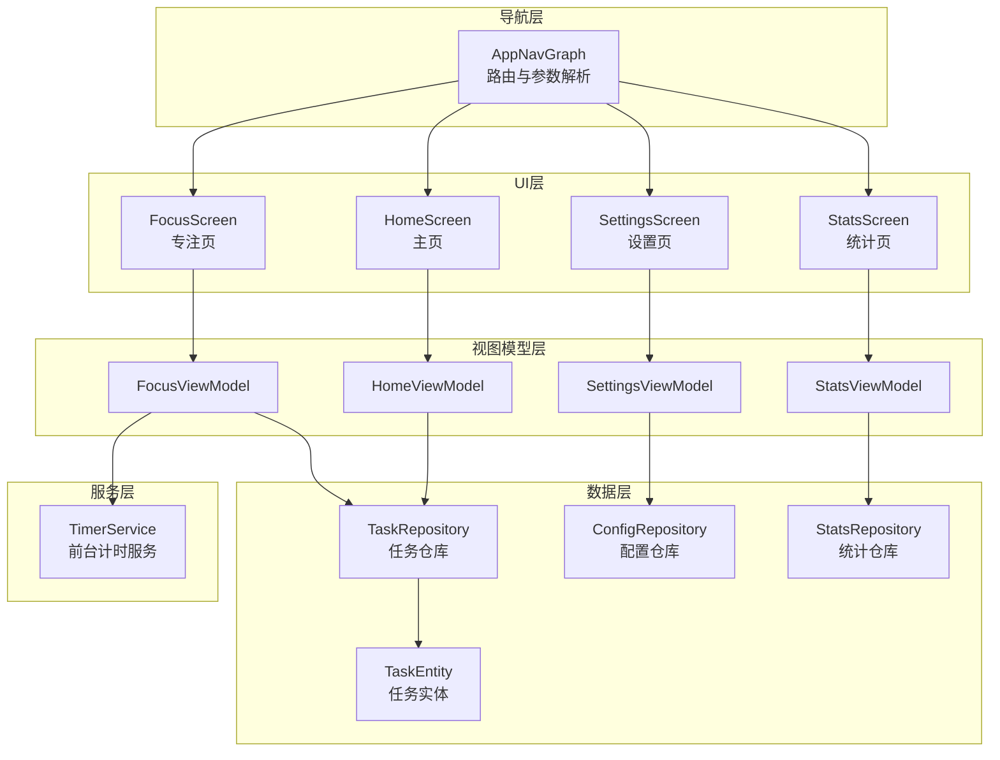
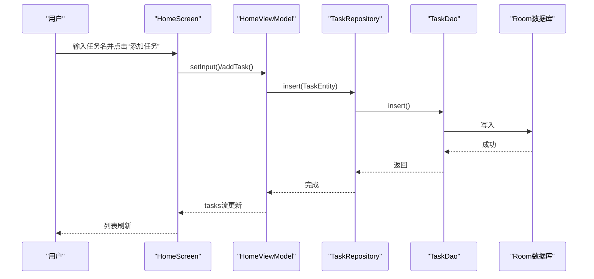
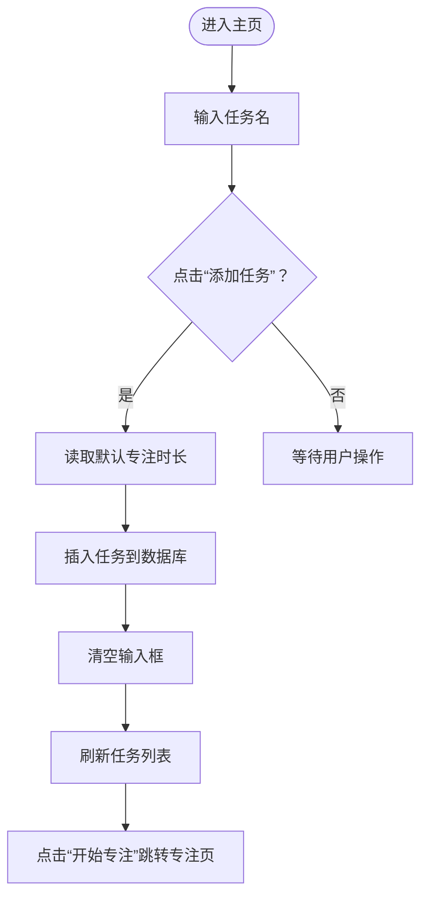
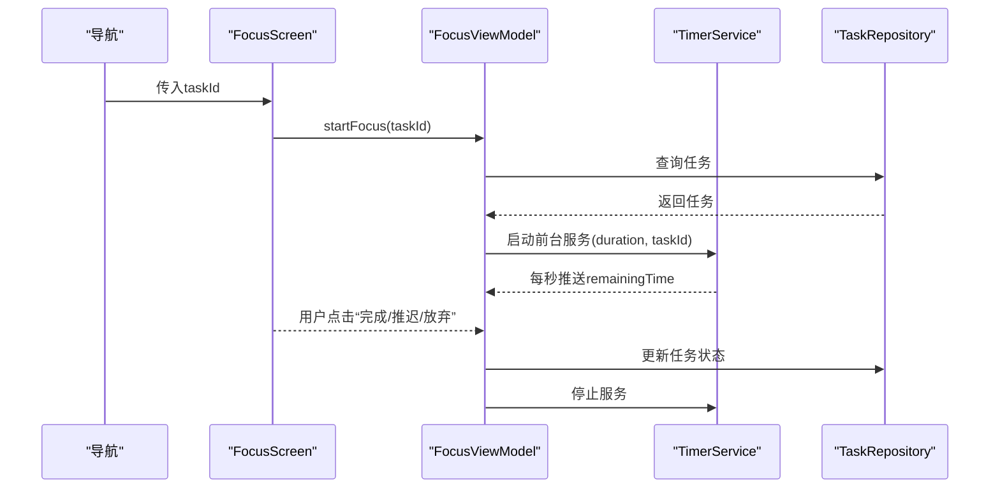
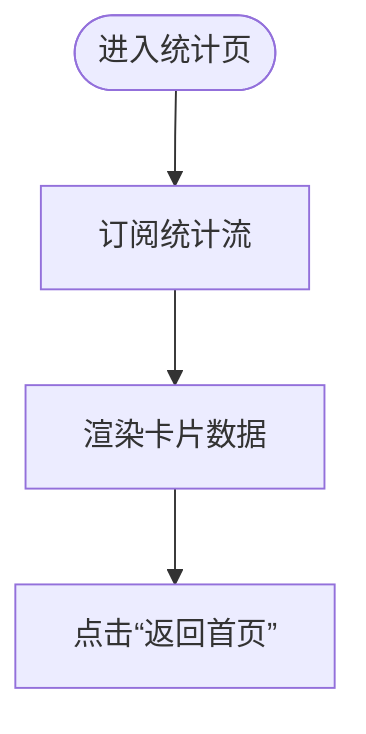
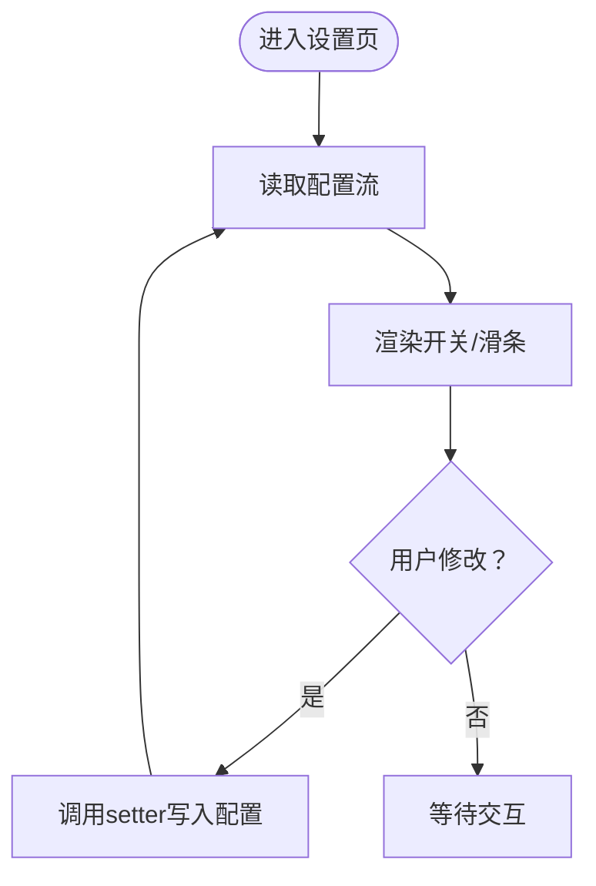
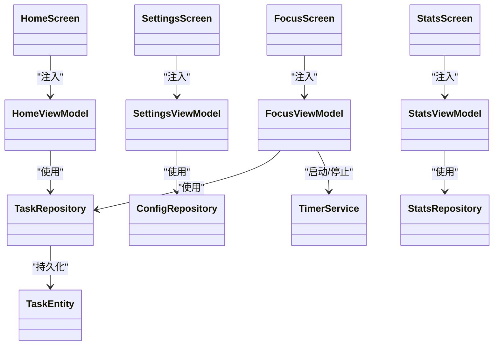

# 页面组件

<cite>
**本文引用的文件**
- [HomeScreen.kt](file://app/src/main/java/com/pomodoroalert/ui/screens/HomeScreen.kt)
- [FocusScreen.kt](file://app/src/main/java/com/pomodoroalert/ui/screens/FocusScreen.kt)
- [StatsScreen.kt](file://app/src/main/java/com/pomodoroalert/ui/screens/StatsScreen.kt)
- [SettingsScreen.kt](file://app/src/main/java/com/pomodoroalert/ui/screens/SettingsScreen.kt)
- [AppNavGraph.kt](file://app/src/main/java/com/pomodoroalert/ui/AppNavGraph.kt)
- [HomeViewModel.kt](file://app/src/main/java/com/pomodoroalert/ui/viewmodel/HomeViewModel.kt)
- [FocusViewModel.kt](file://app/src/main/java/com/pomodoroalert/ui/viewmodel/FocusViewModel.kt)
- [StatsViewModel.kt](file://app/src/main/java/com/pomodoroalert/ui/viewmodel/StatsViewModel.kt)
- [SettingsViewModel.kt](file://app/src/main/java/com/pomodoroalert/ui/viewmodel/SettingsViewModel.kt)
- [TaskEntity.kt](file://app/src/main/java/com/pomodoroalert/data/TaskEntity.kt)
- [TaskRepository.kt](file://app/src/main/java/com/pomodoroalert/data/TaskRepository.kt)
- [ConfigRepository.kt](file://app/src/main/java/com/pomodoroalert/data/ConfigRepository.kt)
- [StatsRepository.kt](file://app/src/main/java/com/pomodoroalert/data/StatsRepository.kt)
- [TimerService.kt](file://app/src/main/java/com/pomodoroalert/service/TimerService.kt)
- [MainActivity.kt](file://app/src/main/java/com/pomodoroalert/MainActivity.kt)
- [colors.xml](file://app/src/main/res/values/colors.xml)
</cite>

## 目录
1. [简介](#简介)
2. [项目结构](#项目结构)
3. [核心组件](#核心组件)
4. [架构总览](#架构总览)
5. [详细组件分析](#详细组件分析)
6. [依赖关系分析](#依赖关系分析)
7. [性能考虑](#性能考虑)
8. [故障排查指南](#故障排查指南)
9. [结论](#结论)
10. [附录](#附录)

## 简介
本文件面向PomodoroAlert的页面组件系统，围绕主页、专注页、统计页与设置页四个页面，系统阐述其功能实现、UI布局、交互逻辑、状态管理、页面间数据传递与参数传递机制，并给出可复用性设计建议、性能优化与内存管理策略、用户体验优化实践以及测试与调试要点。文档同时提供多幅代码级架构与流程图，帮助开发者快速理解与维护。

## 项目结构
页面组件位于UI层，采用Jetpack Compose + MVVM + Hilt + Navigation的现代Android架构：
- UI层：screens目录下包含各页面Composable函数
- 视图模型层：viewmodel目录下包含各页面对应的ViewModel
- 导航层：AppNavGraph集中声明路由与参数传递
- 数据层：data目录下包含实体、仓库与网络接口
- 前台服务：service目录下的TimerService负责倒计时与通知

图表来源
- [HomeScreen.kt](file://app/src/main/java/com/pomodoroalert/ui/screens/HomeScreen.kt)
- [FocusScreen.kt](file://app/src/main/java/com/pomodoroalert/ui/screens/FocusScreen.kt)
- [StatsScreen.kt](file://app/src/main/java/com/pomodoroalert/ui/screens/StatsScreen.kt)
- [SettingsScreen.kt](file://app/src/main/java/com/pomodoroalert/ui/screens/SettingsScreen.kt)
- [AppNavGraph.kt](file://app/src/main/java/com/pomodoroalert/ui/AppNavGraph.kt)
- [HomeViewModel.kt](file://app/src/main/java/com/pomodoroalert/ui/viewmodel/HomeViewModel.kt)
- [FocusViewModel.kt](file://app/src/main/java/com/pomodoroalert/ui/viewmodel/FocusViewModel.kt)
- [StatsViewModel.kt](file://app/src/main/java/com/pomodoroalert/ui/viewmodel/StatsViewModel.kt)
- [SettingsViewModel.kt](file://app/src/main/java/com/pomodoroalert/ui/viewmodel/SettingsViewModel.kt)
- [TaskEntity.kt](file://app/src/main/java/com/pomodoroalert/data/TaskEntity.kt)
- [TaskRepository.kt](file://app/src/main/java/com/pomodoroalert/data/TaskRepository.kt)
- [ConfigRepository.kt](file://app/src/main/java/com/pomodoroalert/data/ConfigRepository.kt)
- [StatsRepository.kt](file://app/src/main/java/com/pomodoroalert/data/StatsRepository.kt)
- [TimerService.kt](file://app/src/main/java/com/pomodoroalert/service/TimerService.kt)

章节来源
- [MainActivity.kt](file://app/src/main/java/com/pomodoroalert/MainActivity.kt)
- [AppNavGraph.kt](file://app/src/main/java/com/pomodoroalert/ui/AppNavGraph.kt)

## 核心组件
- 主页（HomeScreen）：负责任务输入、语音/日历入口占位、任务列表展示与跳转至专注页；通过HomeViewModel订阅任务流并响应用户输入。
- 专注页（FocusScreen）：展示当前任务名与倒计时，提供“完成/推迟/放弃”操作；由FocusViewModel驱动计时与状态变更。
- 统计页（StatsScreen）：展示当日完成任务数与完成番茄数；由StatsViewModel订阅统计流。
- 设置页（SettingsScreen）：提供耳机模式开关与默认专注时长滑条；由SettingsViewModel读写配置。

章节来源
- [HomeScreen.kt](file://app/src/main/java/com/pomodoroalert/ui/screens/HomeScreen.kt)
- [FocusScreen.kt](file://app/src/main/java/com/pomodoroalert/ui/screens/FocusScreen.kt)
- [StatsScreen.kt](file://app/src/main/java/com/pomodoroalert/ui/screens/StatsScreen.kt)
- [SettingsScreen.kt](file://app/src/main/java/com/pomodoroalert/ui/screens/SettingsScreen.kt)

## 架构总览
页面组件遵循MVVM模式，页面Composable通过Hilt注入对应ViewModel，ViewModel通过仓库访问数据库与网络，页面通过状态流驱动UI更新。导航使用Compose Navigation，支持查询参数传递（如专注页的taskId）。

图表来源
- [HomeScreen.kt](file://app/src/main/java/com/pomodoroalert/ui/screens/HomeScreen.kt)
- [HomeViewModel.kt](file://app/src/main/java/com/pomodoroalert/ui/viewmodel/HomeViewModel.kt)
- [TaskRepository.kt](file://app/src/main/java/com/pomodoroalert/data/TaskRepository.kt)
- [TaskEntity.kt](file://app/src/main/java/com/pomodoroalert/data/TaskEntity.kt)

## 详细组件分析

### 主页（HomeScreen）
- 布局结构
  - 顶部标题与引导语
  - 输入框与两个占位按钮（语音/日历）
  - 添加任务按钮
  - “今日任务”标题与LazyColumn任务卡片列表
  - 底部“数据统计/偏好设置”导航按钮
- 交互逻辑
  - 输入框值绑定到HomeViewModel.inputText
  - 点击“添加任务”调用HomeViewModel.addTask，内部读取默认专注时长并插入任务
  - 点击“开始专注”将taskId作为查询参数传入专注页
- 状态管理
  - 订阅HomeViewModel.tasks与inputText，自动渲染
  - 使用Material3主题与自定义配色
- 可复用性与自定义
  - 可抽取卡片为独立Composable，传入TaskEntity与导航回调
  - 配置项可通过ConfigRepository注入，便于主题切换

图表来源
- [HomeScreen.kt](file://app/src/main/java/com/pomodoroalert/ui/screens/HomeScreen.kt)
- [HomeViewModel.kt](file://app/src/main/java/com/pomodoroalert/ui/viewmodel/HomeViewModel.kt)
- [TaskRepository.kt](file://app/src/main/java/com/pomodoroalert/data/TaskRepository.kt)

章节来源
- [HomeScreen.kt](file://app/src/main/java/com/pomodoroalert/ui/screens/HomeScreen.kt)
- [HomeViewModel.kt](file://app/src/main/java/com/pomodoroalert/ui/viewmodel/HomeViewModel.kt)
- [TaskRepository.kt](file://app/src/main/java/com/pomodoroalert/data/TaskRepository.kt)
- [TaskEntity.kt](file://app/src/main/java/com/pomodoroalert/data/TaskEntity.kt)
- [colors.xml](file://app/src/main/res/values/colors.xml)

### 专注页（FocusScreen）
- 布局结构
  - 顶部标题“专注面板”
  - 当前任务名显示
  - 大号倒计时文本
  - 操作区：完成、推迟10分钟、放弃
- 交互逻辑
  - 从导航参数接收taskId，启动专注
  - 倒计时由TimerService通过状态流推送
  - 完成/放弃时更新任务状态并停止服务
  - 推迟时设置精确闹钟并更新剩余时间
- 状态管理
  - FocusViewModel持有currentTask与remainingTime
  - TimerService在前台运行，持续更新通知与状态流
- 参数传递机制
  - 路由定义为“focus?taskId={taskId}”，在AppNavGraph中解析并传入FocusScreen

图表来源
- [FocusScreen.kt](file://app/src/main/java/com/pomodoroalert/ui/screens/FocusScreen.kt)
- [FocusViewModel.kt](file://app/src/main/java/com/pomodoroalert/ui/viewmodel/FocusViewModel.kt)
- [TimerService.kt](file://app/src/main/java/com/pomodoroalert/service/TimerService.kt)
- [TaskRepository.kt](file://app/src/main/java/com/pomodoroalert/data/TaskRepository.kt)

章节来源
- [FocusScreen.kt](file://app/src/main/java/com/pomodoroalert/ui/screens/FocusScreen.kt)
- [FocusViewModel.kt](file://app/src/main/java/com/pomodoroalert/ui/viewmodel/FocusViewModel.kt)
- [TimerService.kt](file://app/src/main/java/com/pomodoroalert/service/TimerService.kt)
- [AppNavGraph.kt](file://app/src/main/java/com/pomodoroalert/ui/AppNavGraph.kt)

### 统计页（StatsScreen）
- 布局结构
  - 两个卡片分别展示“今日完成番茄数”和“今日完成任务数”
  - 返回首页按钮
- 状态管理
  - StatsViewModel订阅统计仓库提供的流，自动更新UI
- 数据来源
  - 统计仓库基于任务DAO的活跃任务集合计算完成数

图表来源
- [StatsScreen.kt](file://app/src/main/java/com/pomodoroalert/ui/screens/StatsScreen.kt)
- [StatsViewModel.kt](file://app/src/main/java/com/pomodoroalert/ui/viewmodel/StatsViewModel.kt)
- [StatsRepository.kt](file://app/src/main/java/com/pomodoroalert/data/StatsRepository.kt)

章节来源
- [StatsScreen.kt](file://app/src/main/java/com/pomodoroalert/ui/screens/StatsScreen.kt)
- [StatsViewModel.kt](file://app/src/main/java/com/pomodoroalert/ui/viewmodel/StatsViewModel.kt)
- [StatsRepository.kt](file://app/src/main/java/com/pomodoroalert/data/StatsRepository.kt)

### 设置页（SettingsScreen）
- 布局结构
  - 耳机模式开关卡片
  - 默认专注时长滑条卡片，显示当前值
  - 返回首页按钮
- 状态管理
  - SettingsViewModel读取配置流并提供setter方法
- 配置项
  - 耳机模式：布尔值
  - 默认专注时长：整数值（5~60分钟）

图表来源
- [SettingsScreen.kt](file://app/src/main/java/com/pomodoroalert/ui/screens/SettingsScreen.kt)
- [SettingsViewModel.kt](file://app/src/main/java/com/pomodoroalert/ui/viewmodel/SettingsViewModel.kt)
- [ConfigRepository.kt](file://app/src/main/java/com/pomodoroalert/data/ConfigRepository.kt)

章节来源
- [SettingsScreen.kt](file://app/src/main/java/com/pomodoroalert/ui/screens/SettingsScreen.kt)
- [SettingsViewModel.kt](file://app/src/main/java/com/pomodoroalert/ui/viewmodel/SettingsViewModel.kt)
- [ConfigRepository.kt](file://app/src/main/java/com/pomodoroalert/data/ConfigRepository.kt)

## 依赖关系分析
- 页面到ViewModel：通过Hilt注入，解耦UI与业务逻辑
- ViewModel到仓库：通过接口抽象，便于替换实现与测试
- 仓库到数据源：Room Dao与Webhook API，统一数据访问
- 专注页到服务：通过前台服务TimerService维持倒计时与通知

图表来源
- [HomeScreen.kt](file://app/src/main/java/com/pomodoroalert/ui/screens/HomeScreen.kt)
- [FocusScreen.kt](file://app/src/main/java/com/pomodoroalert/ui/screens/FocusScreen.kt)
- [StatsScreen.kt](file://app/src/main/java/com/pomodoroalert/ui/screens/StatsScreen.kt)
- [SettingsScreen.kt](file://app/src/main/java/com/pomodoroalert/ui/screens/SettingsScreen.kt)
- [HomeViewModel.kt](file://app/src/main/java/com/pomodoroalert/ui/viewmodel/HomeViewModel.kt)
- [FocusViewModel.kt](file://app/src/main/java/com/pomodoroalert/ui/viewmodel/FocusViewModel.kt)
- [StatsViewModel.kt](file://app/src/main/java/com/pomodoroalert/ui/viewmodel/StatsViewModel.kt)
- [SettingsViewModel.kt](file://app/src/main/java/com/pomodoroalert/ui/viewmodel/SettingsViewModel.kt)
- [TaskRepository.kt](file://app/src/main/java/com/pomodoroalert/data/TaskRepository.kt)
- [ConfigRepository.kt](file://app/src/main/java/com/pomodoroalert/data/ConfigRepository.kt)
- [StatsRepository.kt](file://app/src/main/java/com/pomodoroalert/data/StatsRepository.kt)
- [TaskEntity.kt](file://app/src/main/java/com/pomodoroalert/data/TaskEntity.kt)
- [TimerService.kt](file://app/src/main/java/com/pomodoroalert/service/TimerService.kt)

章节来源
- [HomeViewModel.kt](file://app/src/main/java/com/pomodoroalert/ui/viewmodel/HomeViewModel.kt)
- [FocusViewModel.kt](file://app/src/main/java/com/pomodoroalert/ui/viewmodel/FocusViewModel.kt)
- [StatsViewModel.kt](file://app/src/main/java/com/pomodoroalert/ui/viewmodel/StatsViewModel.kt)
- [SettingsViewModel.kt](file://app/src/main/java/com/pomodoroalert/ui/viewmodel/SettingsViewModel.kt)
- [TaskRepository.kt](file://app/src/main/java/com/pomodoroalert/data/TaskRepository.kt)
- [ConfigRepository.kt](file://app/src/main/java/com/pomodoroalert/data/ConfigRepository.kt)
- [StatsRepository.kt](file://app/src/main/java/com/pomodoroalert/data/StatsRepository.kt)
- [TaskEntity.kt](file://app/src/main/java/com/pomodoroalert/data/TaskEntity.kt)
- [TimerService.kt](file://app/src/main/java/com/pomodoroalert/service/TimerService.kt)

## 性能考虑
- 列表渲染
  - 使用LazyColumn按需渲染任务项，避免一次性加载大量卡片
  - 使用items(key = { it.taskId })确保列表更新时的稳定性
- 状态流
  - ViewModel使用stateIn限制上游冷流为热流，减少重复订阅开销
  - WhileSubscribed策略在页面可见时保持订阅，不可见时释放资源
- 前台服务
  - TimerService以前台服务运行，避免被系统回收；每秒更新一次通知，注意CPU与电量消耗
- 导航参数
  - 专注页通过查询参数传递taskId，避免跨页面共享可变状态，降低耦合
- 主题与资源
  - 使用Material3主题与颜色资源，减少自定义绘制成本

章节来源
- [HomeScreen.kt](file://app/src/main/java/com/pomodoroalert/ui/screens/HomeScreen.kt)
- [StatsViewModel.kt](file://app/src/main/java/com/pomodoroalert/ui/viewmodel/StatsViewModel.kt)
- [SettingsViewModel.kt](file://app/src/main/java/com/pomodoroalert/ui/viewmodel/SettingsViewModel.kt)
- [TimerService.kt](file://app/src/main/java/com/pomodoroalert/service/TimerService.kt)
- [colors.xml](file://app/src/main/res/values/colors.xml)

## 故障排查指南
- 专注页无倒计时
  - 检查FocusViewModel是否正确启动TimerService并传入duration
  - 检查TimerService是否在前台运行且通知通道创建成功
- 任务状态未更新
  - 检查TaskRepository.updateStatus是否被调用及触发同步
  - 检查Webhook请求是否成功，失败时会标记为“Sync_Pending”并调度重试
- 统计不准确
  - 检查StatsRepository的统计逻辑是否与任务状态一致
- 设置项不生效
  - 检查ConfigRepository的读写是否正确，确认stateIn初始值与订阅时机

章节来源
- [FocusViewModel.kt](file://app/src/main/java/com/pomodoroalert/ui/viewmodel/FocusViewModel.kt)
- [TimerService.kt](file://app/src/main/java/com/pomodoroalert/service/TimerService.kt)
- [TaskRepository.kt](file://app/src/main/java/com/pomodoroalert/data/TaskRepository.kt)
- [StatsRepository.kt](file://app/src/main/java/com/pomodoroalert/data/StatsRepository.kt)
- [SettingsViewModel.kt](file://app/src/main/java/com/pomodoroalert/ui/viewmodel/SettingsViewModel.kt)
- [ConfigRepository.kt](file://app/src/main/java/com/pomodoroalert/data/ConfigRepository.kt)

## 结论
页面组件系统以MVVM为核心，结合Hilt依赖注入与Compose Navigation，实现了清晰的职责分离与良好的可扩展性。通过状态流与前台服务，系统在专注场景下具备稳定的计时与通知能力；通过仓库抽象，数据访问与网络同步逻辑易于测试与维护。建议在后续迭代中进一步增强页面单元测试覆盖率与UI自动化测试，完善错误边界与降级策略。

## 附录
- 页面间参数传递
  - 专注页：通过路由“focus?taskId={taskId}”传递任务ID
- 配置项
  - 耳机模式：布尔值
  - 默认专注时长：整数（5~60分钟）
- 主题颜色
  - 使用colors.xml中的品牌色与背景色，保证视觉一致性

章节来源
- [AppNavGraph.kt](file://app/src/main/java/com/pomodoroalert/ui/AppNavGraph.kt)
- [SettingsScreen.kt](file://app/src/main/java/com/pomodoroalert/ui/screens/SettingsScreen.kt)
- [colors.xml](file://app/src/main/res/values/colors.xml)