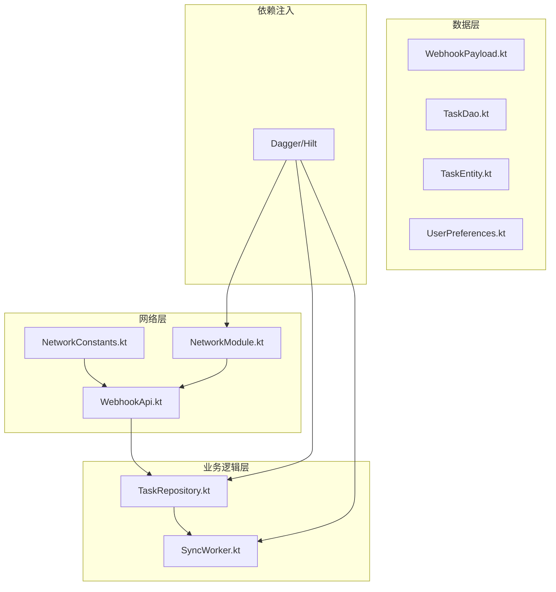
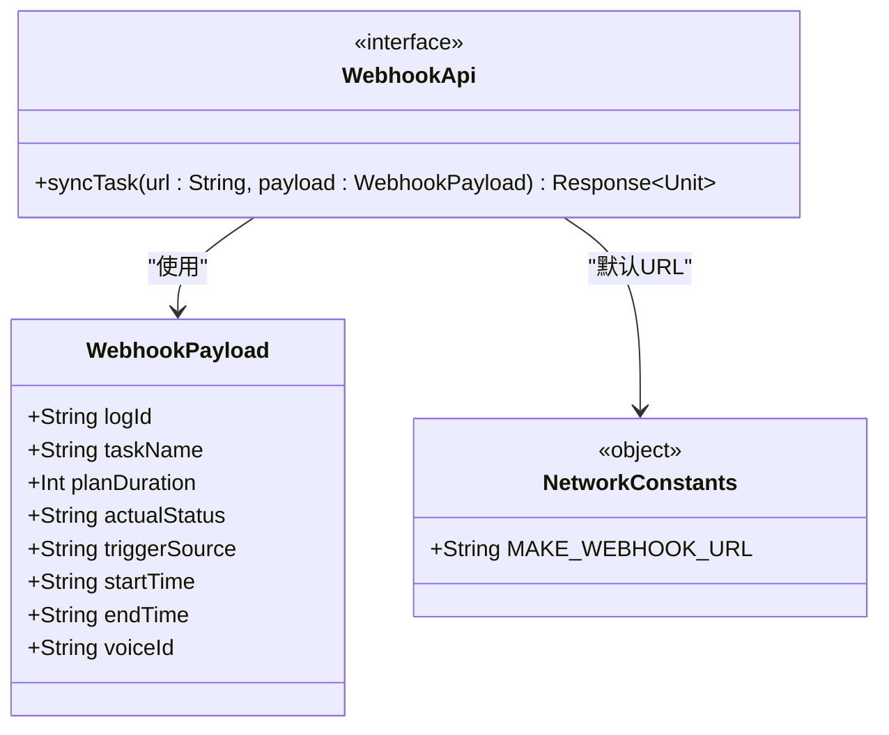
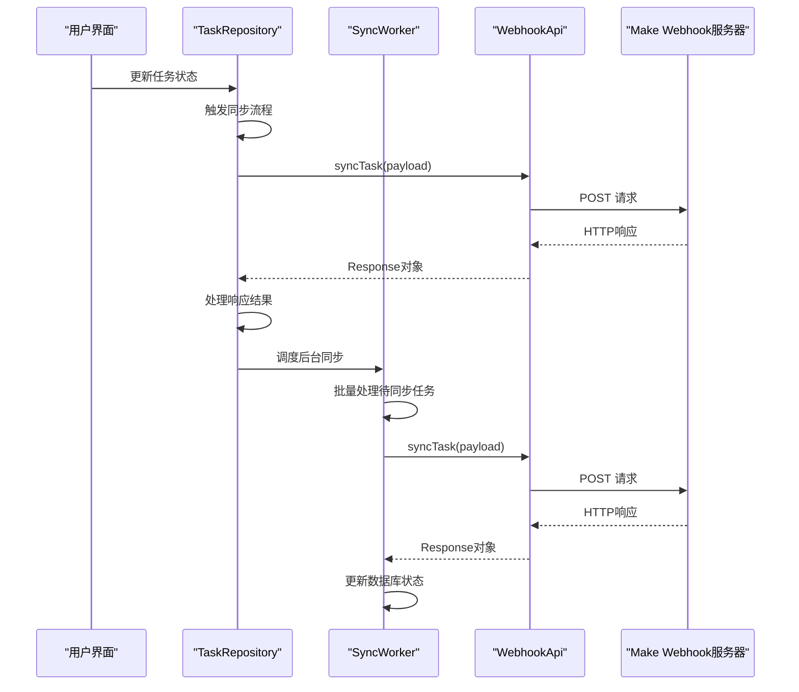
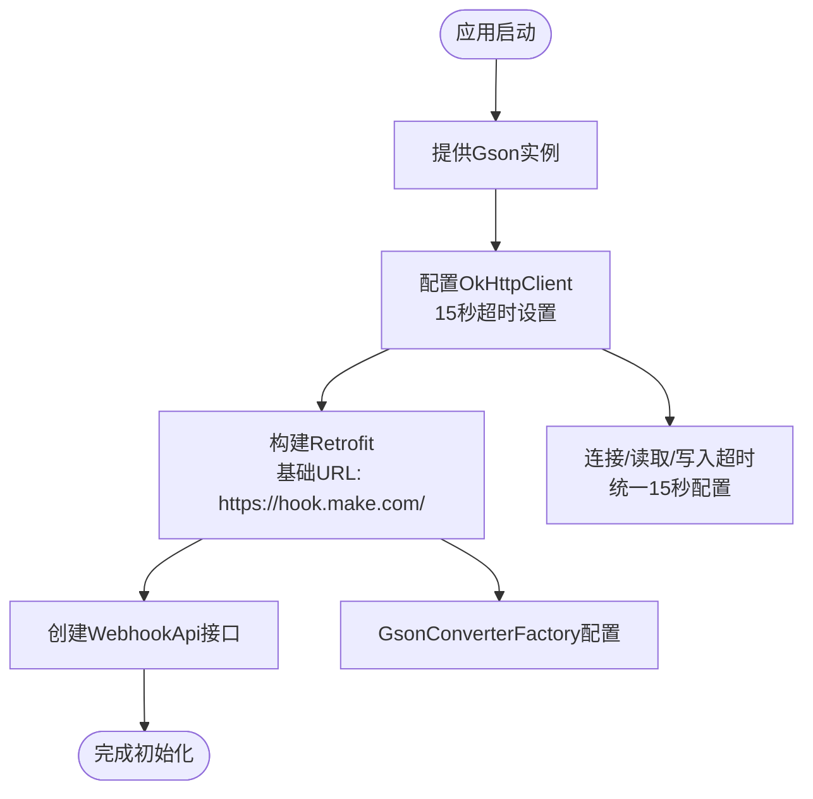
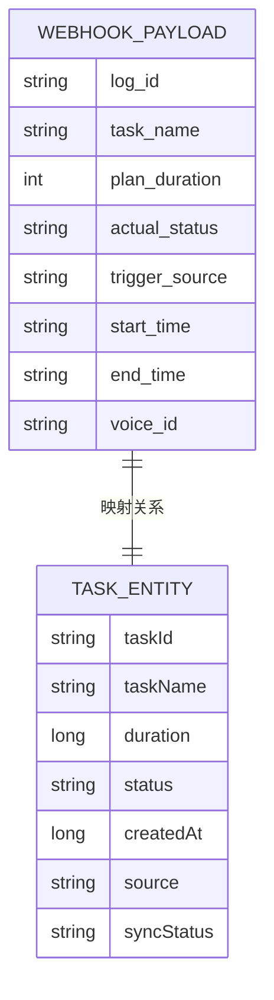
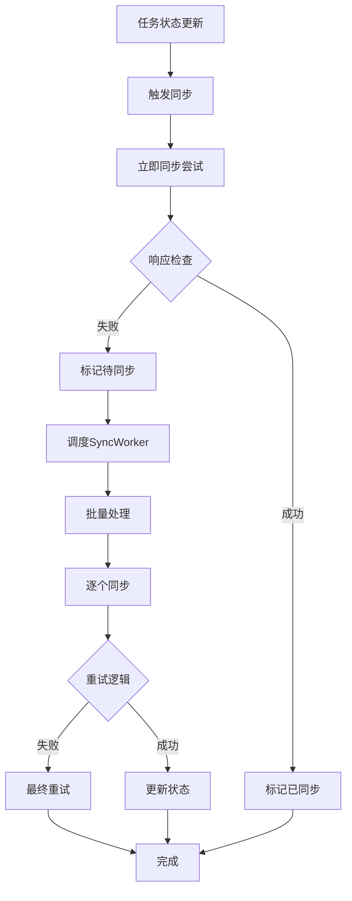
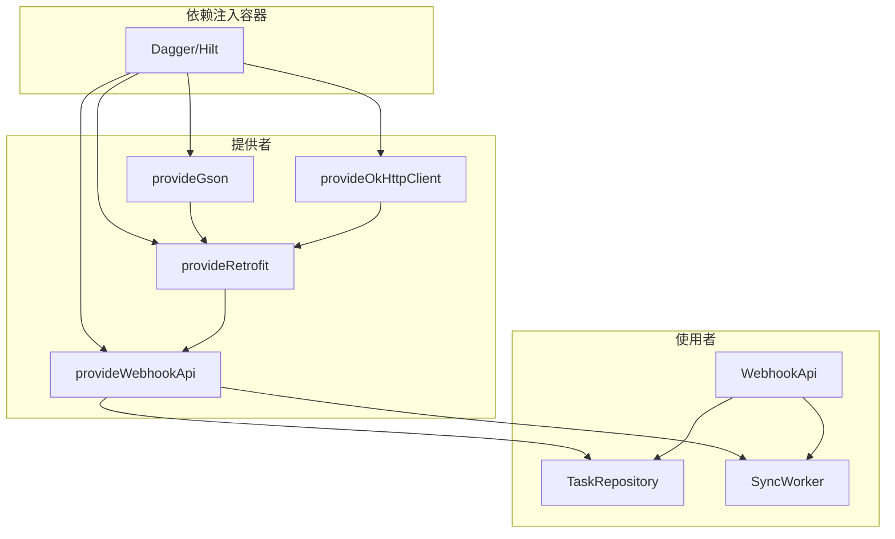
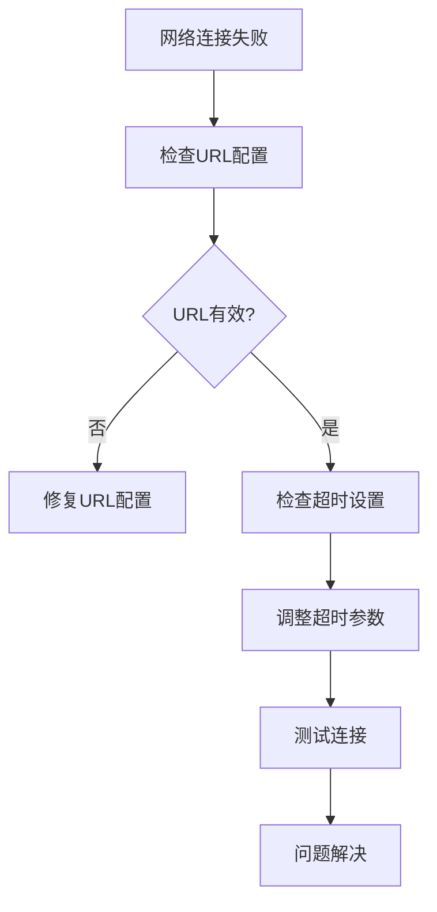

# API接口设计

<cite>
**本文档引用的文件**
- [WebhookApi.kt](file://app/src/main/java/com/pomodoroalert/network/WebhookApi.kt)
- [NetworkConstants.kt](file://app/src/main/java/com/pomodoroalert/network/NetworkConstants.kt)
- [WebhookPayload.kt](file://app/src/main/java/com/pomodoroalert/data/WebhookPayload.kt)
- [NetworkModule.kt](file://app/src/main/java/com/pomodoroalert/di/NetworkModule.kt)
- [SyncWorker.kt](file://app/src/main/java/com/pomodoroalert/worker/SyncWorker.kt)
- [TaskRepository.kt](file://app/src/main/java/com/pomodoroalert/data/TaskRepository.kt)
- [TaskDao.kt](file://app/src/main/java/com/pomodoroalert/data/TaskDao.kt)
- [UserPreferences.kt](file://app/src/main/java/com/pomodoroalert/data/UserPreferences.kt)
</cite>

## 目录
1. [简介](#简介)
2. [项目结构](#项目结构)
3. [核心组件](#核心组件)
4. [架构概览](#架构概览)
5. [详细组件分析](#详细组件分析)
6. [依赖关系分析](#依赖关系分析)
7. [性能考虑](#性能考虑)
8. [故障排除指南](#故障排除指南)
9. [结论](#结论)
10. [附录](#附录)

## 简介

本文件针对PomodoroAlert应用的Webhook API接口设计进行全面技术分析。该系统采用Retrofit框架实现RESTful API通信，通过协程支持异步网络操作，并结合WorkManager实现任务同步的可靠机制。本文档深入解析了Retrofit接口定义的实现方式，包括@POST注解使用、@Url参数配置、@Body请求体绑定等关键特性，同时详细说明了WebhookApi接口的设计模式、参数传递机制、响应处理策略以及suspend函数的协程支持。

## 项目结构

PomodoroAlert项目采用清晰的分层架构，API相关组件分布在以下目录结构中：

**图表来源**
- [NetworkConstants.kt:1-7](file://app/src/main/java/com/pomodoroalert/network/NetworkConstants.kt#L1-L7)
- [WebhookApi.kt:1-16](file://app/src/main/java/com/pomodoroalert/network/WebhookApi.kt#L1-L16)
- [NetworkModule.kt:1-53](file://app/src/main/java/com/pomodoroalert/di/NetworkModule.kt#L1-L53)

**章节来源**
- [NetworkConstants.kt:1-7](file://app/src/main/java/com/pomodoroalert/network/NetworkConstants.kt#L1-L7)
- [WebhookApi.kt:1-16](file://app/src/main/java/com/pomodoroalert/network/WebhookApi.kt#L1-L16)
- [NetworkModule.kt:1-53](file://app/src/main/java/com/pomodoroalert/di/NetworkModule.kt#L1-L53)

## 核心组件

### WebhookApi接口设计

WebhookApi是整个同步系统的入口点，采用简洁而高效的接口设计：

**图表来源**
- [WebhookApi.kt:9-15](file://app/src/main/java/com/pomodoroalert/network/WebhookApi.kt#L9-L15)
- [WebhookPayload.kt:8-17](file://app/src/main/java/com/pomodoroalert/data/WebhookPayload.kt#L8-L17)
- [NetworkConstants.kt:3-6](file://app/src/main/java/com/pomodoroalert/network/NetworkConstants.kt#L3-L6)

### Retrofit注解实现分析

接口实现采用了多种Retrofit注解的组合使用：

- **@POST注解**：定义HTTP方法为POST请求
- **@Url参数**：支持动态URL配置，默认使用NetworkConstants.MAKE_WEBHOOK_URL
- **@Body注解**：自动序列化WebhookPayload对象为JSON请求体
- **suspend关键字**：协程支持，实现非阻塞的异步调用

**章节来源**
- [WebhookApi.kt:10-14](file://app/src/main/java/com/pomodoroalert/network/WebhookApi.kt#L10-L14)

## 架构概览

系统采用分层架构设计，实现了清晰的关注点分离：

**图表来源**
- [TaskRepository.kt:32-80](file://app/src/main/java/com/pomodoroalert/data/TaskRepository.kt#L32-L80)
- [SyncWorker.kt:24-71](file://app/src/main/java/com/pomodoroalert/worker/SyncWorker.kt#L24-L71)
- [WebhookApi.kt:11-14](file://app/src/main/java/com/pomodoroalert/network/WebhookApi.kt#L11-L14)

## 详细组件分析

### 网络模块配置

NetworkModule负责Retrofit客户端的完整配置，体现了最佳实践：

**图表来源**
- [NetworkModule.kt:20-51](file://app/src/main/java/com/pomodoroalert/di/NetworkModule.kt#L20-L51)

#### 关键配置特性

1. **超时配置**：所有网络操作设置15秒超时，平衡响应速度与稳定性
2. **Gson配置**：使用默认GsonBuilder，确保JSON序列化一致性
3. **单例模式**：所有网络组件使用@Singleton注解，避免重复创建
4. **基础URL设计**：设置Make Webhook的基础URL，实际URL通过@Url参数动态传入

**章节来源**
- [NetworkModule.kt:20-51](file://app/src/main/java/com/pomodoroalert/di/NetworkModule.kt#L20-L51)

### 数据传输对象设计

WebhookPayload采用数据类设计，符合DTO模式：

**图表来源**
- [WebhookPayload.kt:8-17](file://app/src/main/java/com/pomodoroalert/data/WebhookPayload.kt#L8-L17)
- [TaskEntity.kt:9-18](file://app/src/main/java/com/pomodoroalert/data/TaskEntity.kt#L9-L18)

#### 字段映射规则

| WebhookPayload字段 | TaskEntity字段 | 映射规则 |
|-------------------|----------------|----------|
| logId | taskId | 直接映射 |
| taskName | taskName | 直接映射 |
| planDuration | duration | 毫秒转分钟 |
| actualStatus | status | 中文到英文映射 |
| triggerSource | source | 中文到英文映射 |
| startTime | createdAt | 时间戳格式转换 |
| endTime | 当前时间 | 实时计算 |
| voiceId | 用户偏好 | 从DataStore获取 |

**章节来源**
- [WebhookPayload.kt:8-17](file://app/src/main/java/com/pomodoroalert/data/WebhookPayload.kt#L8-L17)
- [TaskRepository.kt:47-66](file://app/src/main/java/com/pomodoroalert/data/TaskRepository.kt#L47-L66)

### 同步工作流实现

系统实现了双重同步机制，确保数据可靠性：

**图表来源**
- [TaskRepository.kt:32-94](file://app/src/main/java/com/pomodoroalert/data/TaskRepository.kt#L32-L94)
- [SyncWorker.kt:24-71](file://app/src/main/java/com/pomodoroalert/worker/SyncWorker.kt#L24-L71)

**章节来源**
- [TaskRepository.kt:32-94](file://app/src/main/java/com/pomodoroalert/data/TaskRepository.kt#L32-L94)
- [SyncWorker.kt:24-71](file://app/src/main/java/com/pomodoroalert/worker/SyncWorker.kt#L24-L71)

## 依赖关系分析

系统采用依赖注入模式，实现了松耦合的架构设计：

**图表来源**
- [NetworkModule.kt:20-51](file://app/src/main/java/com/pomodoroalert/di/NetworkModule.kt#L20-L51)
- [TaskRepository.kt:20-25](file://app/src/main/java/com/pomodoroalert/data/TaskRepository.kt#L20-L25)
- [SyncWorker.kt:16-22](file://app/src/main/java/com/pomodoroalert/worker/SyncWorker.kt#L16-L22)

### 关键依赖关系

1. **接口与实现分离**：WebhookApi作为接口，通过Dagger/Hilt注入具体实现
2. **协程支持**：所有网络调用使用suspend函数，支持协程链式调用
3. **异常处理**：统一的try-catch机制处理网络异常
4. **状态管理**：通过数据库状态字段跟踪同步进度

**章节来源**
- [NetworkModule.kt:47-51](file://app/src/main/java/com/pomodoroalert/di/NetworkModule.kt#L47-L51)
- [TaskRepository.kt:68-78](file://app/src/main/java/com/pomodoroalert/data/TaskRepository.kt#L68-L78)

## 性能考虑

### 网络优化策略

1. **超时配置**：统一的15秒超时设置，平衡响应速度与稳定性
2. **连接池复用**：OkHttp客户端自动管理连接池，减少连接建立开销
3. **批量处理**：SyncWorker支持批量处理待同步任务，提高效率
4. **重试机制**：智能重试策略，避免频繁网络请求

### 内存管理

1. **数据类设计**：使用Kotlin数据类，内存占用优化
2. **协程作用域**：合理的协程作用域管理，避免内存泄漏
3. **数据库缓存**：Room数据库提供本地缓存，减少网络依赖

## 故障排除指南

### 常见问题诊断

#### 网络连接问题

#### 同步失败处理

1. **检查网络状态**：确认设备网络连接正常
2. **验证Webhook URL**：确保MAKE_WEBHOOK_URL配置正确
3. **查看日志输出**：SyncWorker中的异常信息
4. **数据库状态检查**：确认sync_status字段值

**章节来源**
- [SyncWorker.kt:64-67](file://app/src/main/java/com/pomodoroalert/worker/SyncWorker.kt#L64-L67)
- [TaskRepository.kt:75-78](file://app/src/main/java/com/pomodoroalert/data/TaskRepository.kt#L75-L78)

### 调试技巧

1. **启用网络日志**：在开发环境中添加OkHttp日志拦截器
2. **监控WorkManager**：使用Android Studio的WorkManager插件
3. **数据库检查**：通过Room数据库查看器检查sync_status字段
4. **协程调试**：利用协程调试工具观察异步执行状态

## 结论

PomodoroAlert的API接口设计展现了现代Android应用开发的最佳实践：

1. **架构清晰**：分层设计明确，职责分离合理
2. **技术先进**：采用Retrofit、协程、WorkManager等现代技术栈
3. **可靠性高**：双重同步机制确保数据一致性
4. **可维护性强**：依赖注入模式便于测试和扩展

该设计为类似的任务管理和数据同步场景提供了优秀的参考模板，特别是在网络通信、异步处理和错误恢复方面都体现了专业的工程实践。

## 附录

### API接口规范

| 组件 | 方法 | 参数 | 返回值 | 描述 |
|------|------|------|--------|------|
| WebhookApi | syncTask | @Url url: String, @Body payload: WebhookPayload | Response<Unit> | 同步任务状态到Webhook |
| NetworkConstants | MAKE_WEBHOOK_URL | 无 | String | Webhook服务端点URL |
| WebhookPayload | 构造函数 | 所有字段 | WebhookPayload | 数据传输对象 |

### 最佳实践清单

1. **错误处理**：始终使用try-catch包装网络调用
2. **状态管理**：通过数据库状态字段跟踪同步进度
3. **重试策略**：实现指数退避的重试机制
4. **日志记录**：详细的网络请求和响应日志
5. **资源管理**：合理使用协程和连接池
6. **配置管理**：集中管理网络配置参数