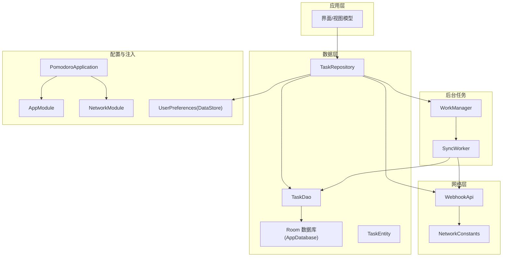
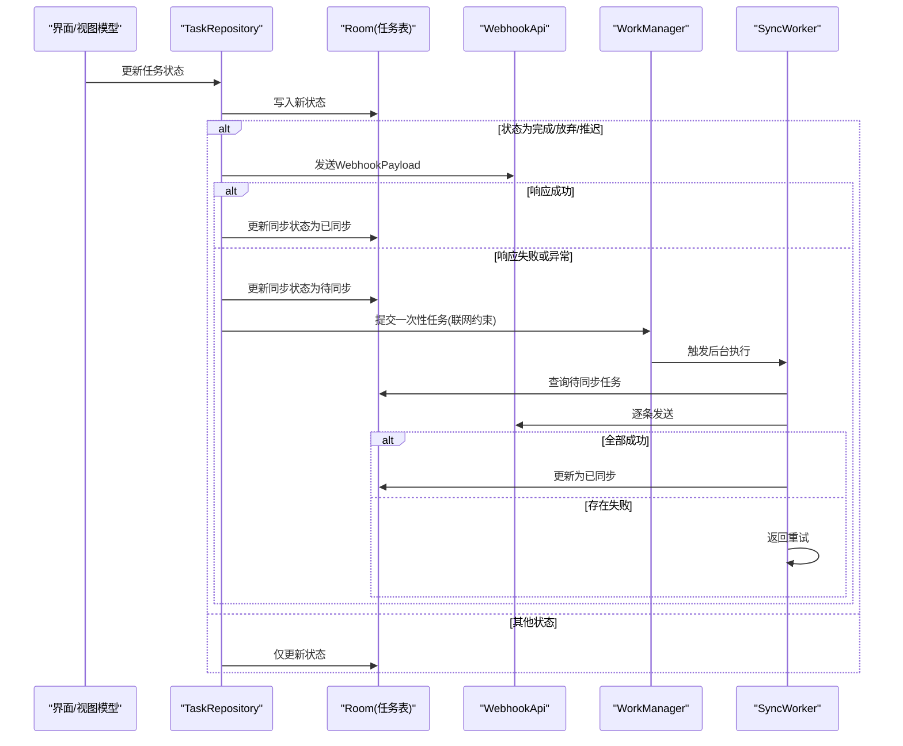
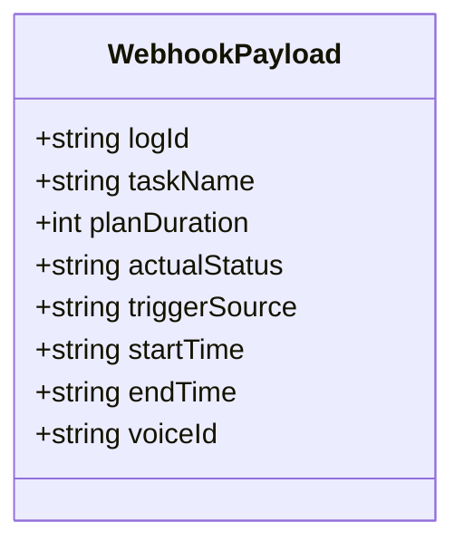
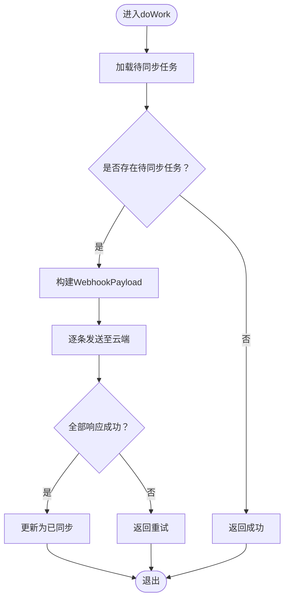
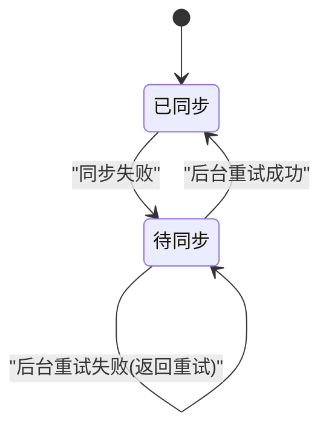
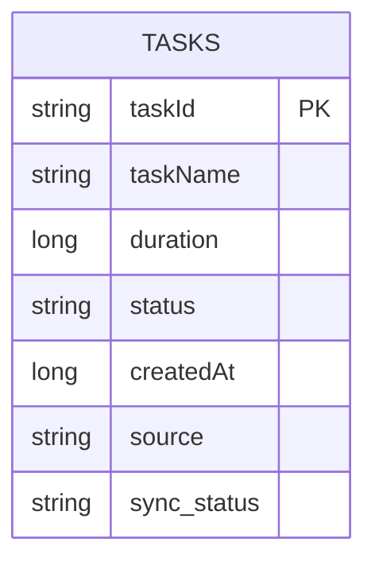
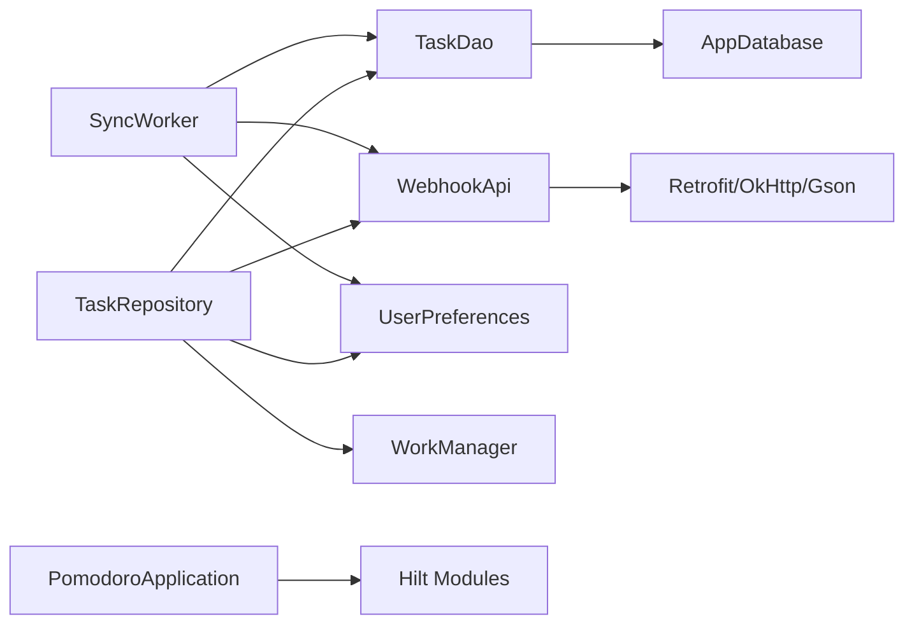

# 数据同步机制

<cite>
**本文引用的文件**
- [WebhookPayload.kt](file://app/src/main/java/com/pomodoroalert/data/WebhookPayload.kt)
- [SyncWorker.kt](file://app/src/main/java/com/pomodoroalert/worker/SyncWorker.kt)
- [TaskEntity.kt](file://app/src/main/java/com/pomodoroalert/data/TaskEntity.kt)
- [TaskDao.kt](file://app/src/main/java/com/pomodoroalert/data/TaskDao.kt)
- [TaskRepository.kt](file://app/src/main/java/com/pomodoroalert/data/TaskRepository.kt)
- [WebhookApi.kt](file://app/src/main/java/com/pomodoroalert/network/WebhookApi.kt)
- [NetworkConstants.kt](file://app/src/main/java/com/pomodoroalert/network/NetworkConstants.kt)
- [UserPreferences.kt](file://app/src/main/java/com/pomodoroalert/data/UserPreferences.kt)
- [AppModule.kt](file://app/src/main/java/com/pomodoroalert/di/AppModule.kt)
- [NetworkModule.kt](file://app/src/main/java/com/pomodoroalert/di/NetworkModule.kt)
- [AppDatabase.kt](file://app/src/main/java/com/pomodoroalert/data/AppDatabase.kt)
- [PomodoroApplication.kt](file://app/src/main/java/com/pomodoroalert/PomodoroApplication.kt)
</cite>

## 目录
1. [简介](#简介)
2. [项目结构](#项目结构)
3. [核心组件](#核心组件)
4. [架构总览](#架构总览)
5. [详细组件分析](#详细组件分析)
6. [依赖关系分析](#依赖关系分析)
7. [性能考虑](#性能考虑)
8. [故障排查指南](#故障排查指南)
9. [结论](#结论)

## 简介
本文件面向PomodoroAlert应用的数据同步机制，重点覆盖以下方面：
- WebhookPayload数据模型设计：字段映射、序列化与校验策略
- SyncWorker后台任务：调度策略、执行时机、数据传输流程
- 同步状态管理：进度跟踪、失败重试、冲突解决
- 离线缓存与在线同步的协调
- 性能优化与监控指标建议
- 异常处理与故障恢复机制

## 项目结构
围绕数据同步的关键模块分布如下：
- 数据层：Room数据库、实体与DAO、仓库（TaskRepository）
- 网络层：Retrofit接口、网络常量
- 后台任务：WorkManager工作项（SyncWorker）
- 配置与注入：Hilt模块、DataStore偏好设置
- 应用入口：Application类启用依赖注入

图表来源
- [AppDatabase.kt:1-10](file://app/src/main/java/com/pomodoroalert/data/AppDatabase.kt#L1-L10)
- [TaskDao.kt:1-29](file://app/src/main/java/com/pomodoroalert/data/TaskDao.kt#L1-L29)
- [TaskEntity.kt:1-19](file://app/src/main/java/com/pomodoroalert/data/TaskEntity.kt#L1-L19)
- [TaskRepository.kt:1-101](file://app/src/main/java/com/pomodoroalert/data/TaskRepository.kt#L1-L101)
- [WebhookApi.kt:1-16](file://app/src/main/java/com/pomodoroalert/network/WebhookApi.kt#L1-L16)
- [NetworkConstants.kt:1-7](file://app/src/main/java/com/pomodoroalert/network/NetworkConstants.kt#L1-L7)
- [SyncWorker.kt:1-78](file://app/src/main/java/com/pomodoroalert/worker/SyncWorker.kt#L1-L78)
- [AppModule.kt:1-61](file://app/src/main/java/com/pomodoroalert/di/AppModule.kt#L1-L61)
- [NetworkModule.kt:1-53](file://app/src/main/java/com/pomodoroalert/di/NetworkModule.kt#L1-L53)
- [UserPreferences.kt:1-36](file://app/src/main/java/com/pomodoroalert/data/UserPreferences.kt#L1-L36)
- [PomodoroApplication.kt:1-8](file://app/src/main/java/com/pomodoroalert/PomodoroApplication.kt#L1-L8)

章节来源
- [AppDatabase.kt:1-10](file://app/src/main/java/com/pomodoroalert/data/AppDatabase.kt#L1-L10)
- [TaskDao.kt:1-29](file://app/src/main/java/com/pomodoroalert/data/TaskDao.kt#L1-L29)
- [TaskEntity.kt:1-19](file://app/src/main/java/com/pomodoroalert/data/TaskEntity.kt#L1-L19)
- [TaskRepository.kt:1-101](file://app/src/main/java/com/pomodoroalert/data/TaskRepository.kt#L1-L101)
- [WebhookApi.kt:1-16](file://app/src/main/java/com/pomodoroalert/network/WebhookApi.kt#L1-L16)
- [NetworkConstants.kt:1-7](file://app/src/main/java/com/pomodoroalert/network/NetworkConstants.kt#L1-L7)
- [SyncWorker.kt:1-78](file://app/src/main/java/com/pomodoroalert/worker/SyncWorker.kt#L1-L78)
- [AppModule.kt:1-61](file://app/src/main/java/com/pomodoroalert/di/AppModule.kt#L1-L61)
- [NetworkModule.kt:1-53](file://app/src/main/java/com/pomodoroalert/di/NetworkModule.kt#L1-L53)
- [UserPreferences.kt:1-36](file://app/src/main/java/com/pomodoroalert/data/UserPreferences.kt#L1-L36)
- [PomodoroApplication.kt:1-8](file://app/src/main/java/com/pomodoroalert/PomodoroApplication.kt#L1-L8)

## 核心组件
- WebhookPayload：云端Webhook期望的DTO，负责将本地任务数据映射为云端字段，并通过Gson序列化发送
- TaskEntity：本地持久化的任务实体，包含任务标识、名称、计划时长、状态、创建时间、来源以及同步状态
- TaskDao：Room DAO，提供插入、查询活跃任务、按ID查询、更新状态、查询待同步任务、更新同步状态等操作
- TaskRepository：业务仓库，负责触发同步、失败回退与WorkManager调度；同时维护状态变更与同步状态
- SyncWorker：后台工作项，周期性拉取“待同步”任务，构造WebhookPayload并通过WebhookApi发送
- WebhookApi：Retrofit接口，定义同步任务的HTTP端点，支持动态URL
- NetworkConstants：网络常量，存放云端Webhook地址占位符
- UserPreferences：DataStore封装，提供音色等用户偏好读写
- AppModule/NetworkModule：Hilt模块，提供数据库、DAO、UserPreferences、Retrofit与WebhookApi实例
- AppDatabase：Room数据库入口，暴露TaskDao

章节来源
- [WebhookPayload.kt:1-18](file://app/src/main/java/com/pomodoroalert/data/WebhookPayload.kt#L1-L18)
- [TaskEntity.kt:1-19](file://app/src/main/java/com/pomodoroalert/data/TaskEntity.kt#L1-L19)
- [TaskDao.kt:1-29](file://app/src/main/java/com/pomodoroalert/data/TaskDao.kt#L1-L29)
- [TaskRepository.kt:1-101](file://app/src/main/java/com/pomodoroalert/data/TaskRepository.kt#L1-L101)
- [SyncWorker.kt:1-78](file://app/src/main/java/com/pomodoroalert/worker/SyncWorker.kt#L1-L78)
- [WebhookApi.kt:1-16](file://app/src/main/java/com/pomodoroalert/network/WebhookApi.kt#L1-L16)
- [NetworkConstants.kt:1-7](file://app/src/main/java/com/pomodoroalert/network/NetworkConstants.kt#L1-L7)
- [UserPreferences.kt:1-36](file://app/src/main/java/com/pomodoroalert/data/UserPreferences.kt#L1-L36)
- [AppModule.kt:1-61](file://app/src/main/java/com/pomodoroalert/di/AppModule.kt#L1-L61)
- [NetworkModule.kt:1-53](file://app/src/main/java/com/pomodoroalert/di/NetworkModule.kt#L1-L53)
- [AppDatabase.kt:1-10](file://app/src/main/java/com/pomodoroalert/data/AppDatabase.kt#L1-L10)

## 架构总览
数据同步采用“即时同步+后台重试”的双通道策略：
- 即时同步：当任务状态变为完成/放弃/推迟时，立即尝试同步；成功则标记为已同步，失败则标记为待同步并调度后台重试
- 后台重试：通过WorkManager在满足网络条件时批量发送待同步任务，逐条校验响应，统一决定成功或重试

图表来源
- [TaskRepository.kt:32-80](file://app/src/main/java/com/pomodoroalert/data/TaskRepository.kt#L32-L80)
- [TaskRepository.kt:82-94](file://app/src/main/java/com/pomodoroalert/data/TaskRepository.kt#L82-L94)
- [SyncWorker.kt:24-71](file://app/src/main/java/com/pomodoroalert/worker/SyncWorker.kt#L24-L71)
- [TaskDao.kt:23-27](file://app/src/main/java/com/pomodoroalert/data/TaskDao.kt#L23-L27)
- [WebhookApi.kt:9-15](file://app/src/main/java/com/pomodoroalert/network/WebhookApi.kt#L9-L15)

## 详细组件分析

### WebhookPayload数据模型
- 字段映射与序列化
  - 使用Gson注解将本地字段映射到云端字段名，确保序列化输出符合云端Webhook期望
  - 计划时长从毫秒转换为分钟，时间戳格式统一为“年-月-日 时:分:秒”
- 数据验证与边界
  - 未在模型层实现显式校验，建议在构造payload前进行非空与范围检查
  - 时间戳使用当前时间作为结束时间，存在重试场景下可能不准确，建议在实体中增加结束时间字段以提升准确性

图表来源
- [WebhookPayload.kt:8-17](file://app/src/main/java/com/pomodoroalert/data/WebhookPayload.kt#L8-L17)

章节来源
- [WebhookPayload.kt:1-18](file://app/src/main/java/com/pomodoroalert/data/WebhookPayload.kt#L1-L18)
- [TaskRepository.kt:47-66](file://app/src/main/java/com/pomodoroalert/data/TaskRepository.kt#L47-L66)
- [SyncWorker.kt:36-55](file://app/src/main/java/com/pomodoroalert/worker/SyncWorker.kt#L36-L55)

### SyncWorker后台任务
- 调度策略
  - 由TaskRepository在同步失败时提交一次性任务，设置网络连接约束，避免无网环境执行
- 执行时机
  - 当设备满足网络条件时，WorkManager调度SyncWorker运行
- 数据传输流程
  - 读取待同步任务列表，逐条构造WebhookPayload并调用WebhookApi
  - 成功则更新同步状态为已同步；任一失败则整体返回重试，等待下次调度
- 失败重试
  - 返回Result.retry()，WorkManager根据策略自动重试

图表来源
- [SyncWorker.kt:24-71](file://app/src/main/java/com/pomodoroalert/worker/SyncWorker.kt#L24-L71)
- [TaskDao.kt:23-27](file://app/src/main/java/com/pomodoroalert/data/TaskDao.kt#L23-L27)

章节来源
- [SyncWorker.kt:1-78](file://app/src/main/java/com/pomodoroalert/worker/SyncWorker.kt#L1-L78)
- [TaskRepository.kt:82-94](file://app/src/main/java/com/pomodoroalert/data/TaskRepository.kt#L82-L94)

### 同步状态管理
- 状态字段
  - 本地实体包含syncStatus，默认为已同步；DAO提供查询与更新接口
- 进度跟踪
  - 通过DAO查询待同步任务集合，实现批量处理与进度统计
- 失败重试
  - 即时同步失败时标记为待同步并提交WorkManager任务；后台重试时逐条校验响应
- 冲突解决
  - 未实现显式冲突检测逻辑；建议在云端侧基于log_id去重或引入版本号字段

图表来源
- [TaskEntity.kt:16-18](file://app/src/main/java/com/pomodoroalert/data/TaskEntity.kt#L16-L18)
- [TaskDao.kt:23-27](file://app/src/main/java/com/pomodoroalert/data/TaskDao.kt#L23-L27)
- [TaskRepository.kt:82-94](file://app/src/main/java/com/pomodoroalert/data/TaskRepository.kt#L82-L94)
- [SyncWorker.kt:59-67](file://app/src/main/java/com/pomodoroalert/worker/SyncWorker.kt#L59-L67)

章节来源
- [TaskEntity.kt:1-19](file://app/src/main/java/com/pomodoroalert/data/TaskEntity.kt#L1-L19)
- [TaskDao.kt:1-29](file://app/src/main/java/com/pomodoroalert/data/TaskDao.kt#L1-L29)
- [TaskRepository.kt:82-94](file://app/src/main/java/com/pomodoroalert/data/TaskRepository.kt#L82-L94)
- [SyncWorker.kt:24-71](file://app/src/main/java/com/pomodoroalert/worker/SyncWorker.kt#L24-L71)

### 离线缓存与在线同步协调
- 离线策略
  - 任务状态变更立即写入本地数据库；若网络不可用或云端响应失败，则标记为待同步
- 在线同步
  - 即时同步优先；后台重试兜底；WorkManager在网络可用时批量处理待同步任务
- 协调机制
  - 通过syncStatus字段实现本地状态与云端状态的解耦；WorkManager作为异步协调器

章节来源
- [TaskRepository.kt:32-80](file://app/src/main/java/com/pomodoroalert/data/TaskRepository.kt#L32-L80)
- [TaskRepository.kt:82-94](file://app/src/main/java/com/pomodoroalert/data/TaskRepository.kt#L82-L94)
- [SyncWorker.kt:24-71](file://app/src/main/java/com/pomodoroalert/worker/SyncWorker.kt#L24-L71)

### 数据模型与DAO
- 实体字段
  - 包含主键taskId、任务名、持续时间（毫秒）、状态、创建时间、来源、同步状态
- 查询与更新
  - 提供活跃任务流查询、按ID查询、状态更新、待同步任务查询、同步状态更新

图表来源
- [TaskEntity.kt:8-18](file://app/src/main/java/com/pomodoroalert/data/TaskEntity.kt#L8-L18)
- [TaskDao.kt:10-28](file://app/src/main/java/com/pomodoroalert/data/TaskDao.kt#L10-L28)

章节来源
- [TaskEntity.kt:1-19](file://app/src/main/java/com/pomodoroalert/data/TaskEntity.kt#L1-L19)
- [TaskDao.kt:1-29](file://app/src/main/java/com/pomodoroalert/data/TaskDao.kt#L1-L29)

### 网络与依赖注入
- Retrofit接口
  - 支持动态URL参数，便于在运行时指定具体Webhook地址
- 网络常量
  - 提供占位符URL，实际部署时需替换为真实地址
- 依赖注入
  - AppModule提供数据库、DAO、UserPreferences
  - NetworkModule提供Gson、OkHttp、Retrofit与WebhookApi

章节来源
- [WebhookApi.kt:1-16](file://app/src/main/java/com/pomodoroalert/network/WebhookApi.kt#L1-L16)
- [NetworkConstants.kt:1-7](file://app/src/main/java/com/pomodoroalert/network/NetworkConstants.kt#L1-L7)
- [AppModule.kt:1-61](file://app/src/main/java/com/pomodoroalert/di/AppModule.kt#L1-L61)
- [NetworkModule.kt:1-53](file://app/src/main/java/com/pomodoroalert/di/NetworkModule.kt#L1-L53)

## 依赖关系分析
- 组件耦合
  - TaskRepository依赖DAO、WebhookApi、UserPreferences与WorkManager
  - SyncWorker依赖DAO、WebhookApi、UserPreferences
  - DAO依赖Room数据库
- 外部依赖
  - Retrofit/OkHttp/Gson用于网络通信
  - WorkManager用于后台调度
  - Hilt用于依赖注入
- 潜在问题
  - 网络URL占位符需在部署时正确配置
  - 时间戳在重试场景下的准确性可通过实体扩展提升

图表来源
- [TaskRepository.kt:20-25](file://app/src/main/java/com/pomodoroalert/data/TaskRepository.kt#L20-L25)
- [SyncWorker.kt:16-22](file://app/src/main/java/com/pomodoroalert/worker/SyncWorker.kt#L16-L22)
- [AppModule.kt:23-41](file://app/src/main/java/com/pomodoroalert/di/AppModule.kt#L23-L41)
- [NetworkModule.kt:38-51](file://app/src/main/java/com/pomodoroalert/di/NetworkModule.kt#L38-L51)
- [PomodoroApplication.kt:4-7](file://app/src/main/java/com/pomodoroalert/PomodoroApplication.kt#L4-L7)

章节来源
- [TaskRepository.kt:1-101](file://app/src/main/java/com/pomodoroalert/data/TaskRepository.kt#L1-L101)
- [SyncWorker.kt:1-78](file://app/src/main/java/com/pomodoroalert/worker/SyncWorker.kt#L1-L78)
- [AppModule.kt:1-61](file://app/src/main/java/com/pomodoroalert/di/AppModule.kt#L1-L61)
- [NetworkModule.kt:1-53](file://app/src/main/java/com/pomodoroalert/di/NetworkModule.kt#L1-L53)
- [PomodoroApplication.kt:1-8](file://app/src/main/java/com/pomodoroalert/PomodoroApplication.kt#L1-L8)

## 性能考虑
- 序列化与网络
  - 使用Gson进行轻量序列化；建议在payload构造前进行字段校验，减少无效请求
  - OkHttp超时设置合理，可按需调整以平衡可靠性与延迟
- 批处理与重试
  - SyncWorker逐条发送，失败即整体重试；可考虑批量化发送并记录失败索引以便精确重试
- 数据库访问
  - DAO查询与更新均为同步挂起函数，注意避免在主线程调用
- 时间戳精度
  - 当前结束时间使用当前时间，建议在实体中增加结束时间字段，避免重试场景的时间偏差

[本节为通用性能建议，无需特定文件引用]

## 故障排查指南
- 同步失败但未重试
  - 检查WorkManager约束是否满足（网络连接）；确认网络URL已正确配置
- 云端无响应或响应失败
  - 查看WebhookApi返回状态；确认payload字段映射正确
- 时间戳异常
  - 若结束时间不准确，建议在实体中新增结束时间字段并在状态变更时写入
- 重试循环
  - 若多次重试仍失败，检查网络环境与云端服务可用性

章节来源
- [TaskRepository.kt:68-78](file://app/src/main/java/com/pomodoroalert/data/TaskRepository.kt#L68-L78)
- [TaskRepository.kt:82-94](file://app/src/main/java/com/pomodoroalert/data/TaskRepository.kt#L82-L94)
- [SyncWorker.kt:57-67](file://app/src/main/java/com/pomodoroalert/worker/SyncWorker.kt#L57-L67)
- [NetworkConstants.kt:4-6](file://app/src/main/java/com/pomodoroalert/network/NetworkConstants.kt#L4-L6)

## 结论
该数据同步机制通过“即时同步+后台重试”的组合，实现了离线可用与云端一致性的平衡。WebhookPayload模型清晰地将本地任务映射到云端字段，TaskRepository与SyncWorker分别承担业务触发与后台兜底职责。建议后续增强：
- 在实体中增加结束时间字段以提升时间准确性
- 在模型层增加字段校验与错误码映射
- 在云端侧实现幂等与冲突检测
- 优化重试策略与批处理能力