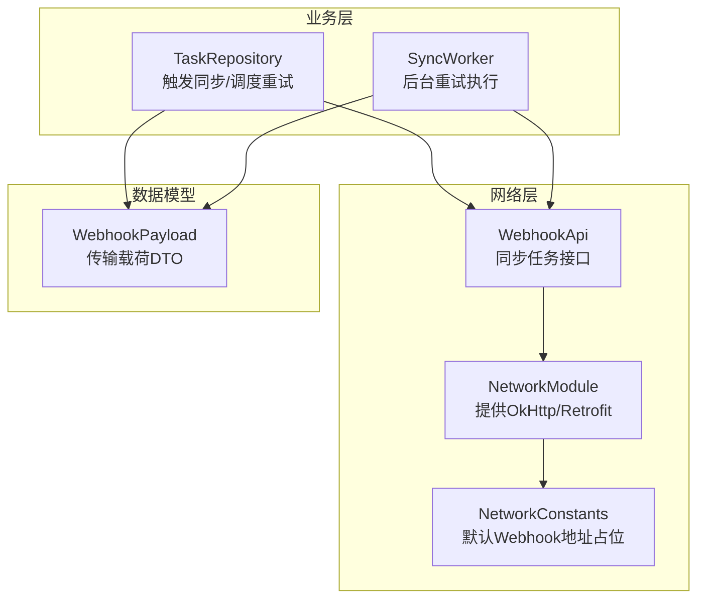
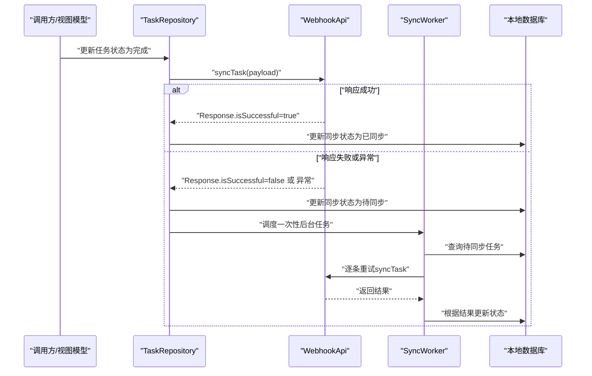
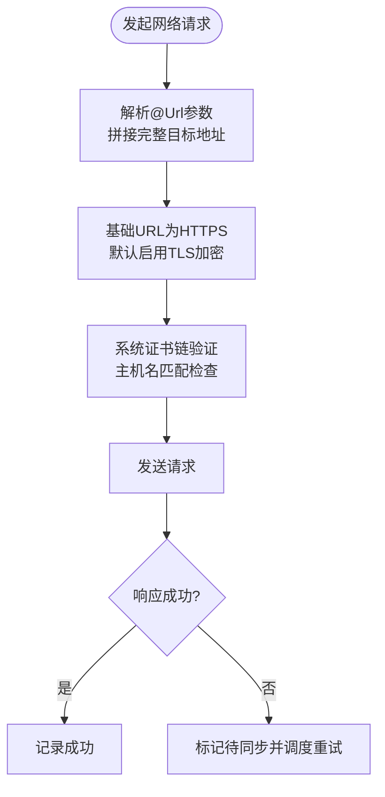
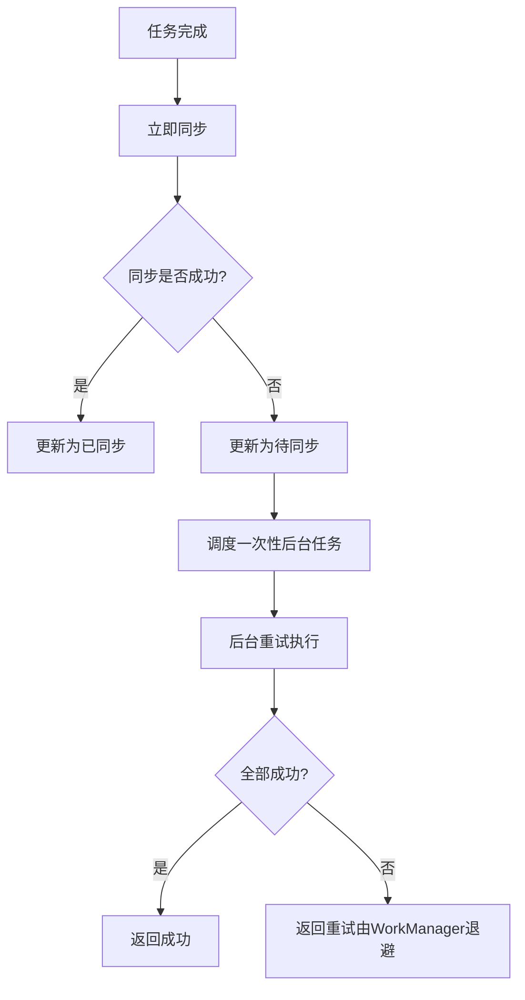
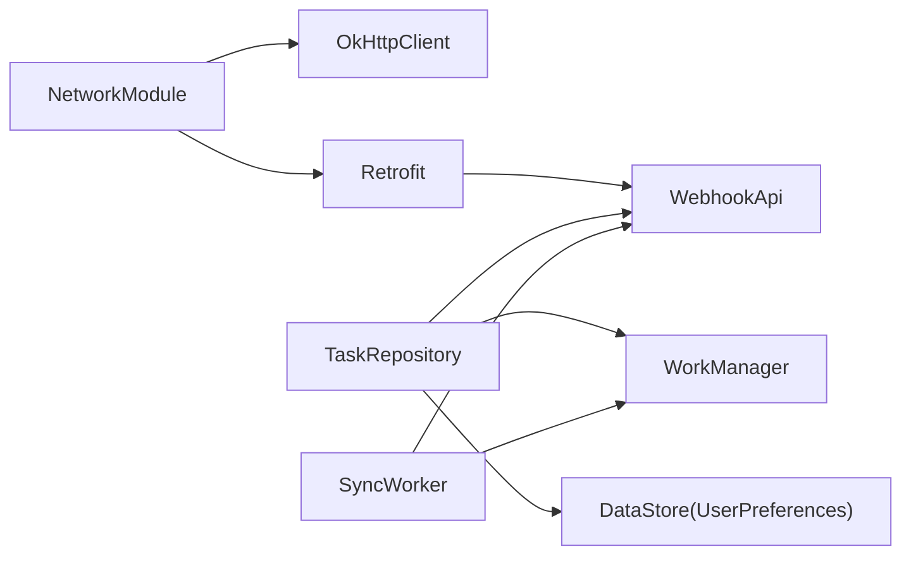

# 网络安全配置

<cite>
**本文引用的文件**
- [app/src/main/java/com/pomodoroalert/network/WebhookApi.kt](file://app/src/main/java/com/pomodoroalert/network/WebhookApi.kt)
- [app/src/main/java/com/pomodoroalert/di/NetworkModule.kt](file://app/src/main/java/com/pomodoroalert/di/NetworkModule.kt)
- [app/src/main/java/com/pomodoroalert/network/NetworkConstants.kt](file://app/src/main/java/com/pomodoroalert/network/NetworkConstants.kt)
- [app/src/main/java/com/pomodoroalert/data/WebhookPayload.kt](file://app/src/main/java/com/pomodoroalert/data/WebhookPayload.kt)
- [app/src/main/java/com/pomodoroalert/data/TaskRepository.kt](file://app/src/main/java/com/pomodoroalert/data/TaskRepository.kt)
- [app/src/main/java/com/pomodoroalert/worker/SyncWorker.kt](file://app/src/main/java/com/pomodoroalert/worker/SyncWorker.kt)
- [app/build.gradle.kts](file://app/build.gradle.kts)
</cite>

## 目录
1. [简介](#简介)
2. [项目结构](#项目结构)
3. [核心组件](#核心组件)
4. [架构总览](#架构总览)
5. [详细组件分析](#详细组件分析)
6. [依赖分析](#依赖分析)
7. [性能考虑](#性能考虑)
8. [故障排查指南](#故障排查指南)
9. [结论](#结论)
10. [附录](#附录)

## 简介
本文件面向PomodoroAlert应用的网络安全配置，聚焦于HTTPS安全连接、身份认证与数据传输加密、请求超时与重试策略、以及网络安全监控与审计建议。当前代码库通过Retrofit + OkHttp实现网络通信，采用基础的超时配置与动态URL参数化调用；在身份认证与传输加密方面，现有实现未包含专用的认证头或签名逻辑，建议后续按本文最佳实践进行增强。

## 项目结构
围绕网络安全的关键模块与文件如下：
- 网络接口与常量：WebhookApi、NetworkConstants
- 网络配置注入：NetworkModule（OkHttp/Retrofit）
- 数据模型：WebhookPayload
- 业务触发与重试：TaskRepository、SyncWorker
- 构建依赖：app/build.gradle.kts

**图表来源**
- [app/src/main/java/com/pomodoroalert/di/NetworkModule.kt:16-52](file://app/src/main/java/com/pomodoroalert/di/NetworkModule.kt#L16-L52)
- [app/src/main/java/com/pomodoroalert/network/WebhookApi.kt:9-15](file://app/src/main/java/com/pomodoroalert/network/WebhookApi.kt#L9-L15)
- [app/src/main/java/com/pomodoroalert/network/NetworkConstants.kt:3-6](file://app/src/main/java/com/pomodoroalert/network/NetworkConstants.kt#L3-L6)
- [app/src/main/java/com/pomodoroalert/data/TaskRepository.kt:19-101](file://app/src/main/java/com/pomodoroalert/data/TaskRepository.kt#L19-L101)
- [app/src/main/java/com/pomodoroalert/worker/SyncWorker.kt:15-78](file://app/src/main/java/com/pomodoroalert/worker/SyncWorker.kt#L15-L78)
- [app/src/main/java/com/pomodoroalert/data/WebhookPayload.kt:8-17](file://app/src/main/java/com/pomodoroalert/data/WebhookPayload.kt#L8-L17)

**章节来源**
- [app/src/main/java/com/pomodoroalert/di/NetworkModule.kt:16-52](file://app/src/main/java/com/pomodoroalert/di/NetworkModule.kt#L16-L52)
- [app/src/main/java/com/pomodoroalert/network/WebhookApi.kt:9-15](file://app/src/main/java/com/pomodoroalert/network/WebhookApi.kt#L9-L15)
- [app/src/main/java/com/pomodoroalert/network/NetworkConstants.kt:3-6](file://app/src/main/java/com/pomodoroalert/network/NetworkConstants.kt#L3-L6)
- [app/src/main/java/com/pomodoroalert/data/TaskRepository.kt:19-101](file://app/src/main/java/com/pomodoroalert/data/TaskRepository.kt#L19-L101)
- [app/src/main/java/com/pomodoroalert/worker/SyncWorker.kt:15-78](file://app/src/main/java/com/pomodoroalert/worker/SyncWorker.kt#L15-L78)
- [app/src/main/java/com/pomodoroalert/data/WebhookPayload.kt:8-17](file://app/src/main/java/com/pomodoroalert/data/WebhookPayload.kt#L8-L17)

## 核心组件
- 网络接口：WebhookApi定义了基于注解的HTTP端点，使用@Url参数动态传入完整目标地址，默认基础URL指向受信域名。
- 网络配置：NetworkModule提供OkHttpClient与Retrofit实例，统一设置连接、读写超时；baseUrl固定为HTTPS。
- 数据模型：WebhookPayload承载传输字段，包含任务标识、状态、时间戳与语音标识等。
- 触发与重试：TaskRepository在任务完成后立即尝试同步；若失败则更新状态并调度SyncWorker后台重试。
- 后台重试：SyncWorker遍历待同步任务，构造payload并发起请求，根据响应结果更新数据库状态。

**章节来源**
- [app/src/main/java/com/pomodoroalert/network/WebhookApi.kt:9-15](file://app/src/main/java/com/pomodoroalert/network/WebhookApi.kt#L9-L15)
- [app/src/main/java/com/pomodoroalert/di/NetworkModule.kt:26-45](file://app/src/main/java/com/pomodoroalert/di/NetworkModule.kt#L26-L45)
- [app/src/main/java/com/pomodoroalert/data/WebhookPayload.kt:8-17](file://app/src/main/java/com/pomodoroalert/data/WebhookPayload.kt#L8-L17)
- [app/src/main/java/com/pomodoroalert/data/TaskRepository.kt:32-94](file://app/src/main/java/com/pomodoroalert/data/TaskRepository.kt#L32-L94)
- [app/src/main/java/com/pomodoroalert/worker/SyncWorker.kt:24-71](file://app/src/main/java/com/pomodoroalert/worker/SyncWorker.kt#L24-L71)

## 架构总览
下图展示从任务完成到网络同步的整体流程，包括即时同步与后台重试路径。

**图表来源**
- [app/src/main/java/com/pomodoroalert/data/TaskRepository.kt:32-94](file://app/src/main/java/com/pomodoroalert/data/TaskRepository.kt#L32-L94)
- [app/src/main/java/com/pomodoroalert/worker/SyncWorker.kt:24-71](file://app/src/main/java/com/pomodoroalert/worker/SyncWorker.kt#L24-L71)
- [app/src/main/java/com/pomodoroalert/network/WebhookApi.kt:9-15](file://app/src/main/java/com/pomodoroalert/network/WebhookApi.kt#L9-L15)

## 详细组件分析

### HTTPS与传输安全
- 基础URL与协议：Retrofit基础URL固定为HTTPS，确保默认使用加密通道。
- 证书验证：OkHttp默认启用系统信任链的证书校验，无需额外配置即可抵御常见中间人攻击。
- TLS版本：OkHttp底层依赖平台TLS栈，建议在设备上保持系统更新以获得最新TLS支持与补丁。
- 中间人攻击防护：由于使用HTTPS且未自定义SSLSocketFactory/HostnameVerifier，系统默认的证书链验证与主机名校验生效。

**图表来源**
- [app/src/main/java/com/pomodoroalert/di/NetworkModule.kt:38-44](file://app/src/main/java/com/pomodoroalert/di/NetworkModule.kt#L38-L44)
- [app/src/main/java/com/pomodoroalert/network/WebhookApi.kt:10-14](file://app/src/main/java/com/pomodoroalert/network/WebhookApi.kt#L10-L14)
- [app/src/main/java/com/pomodoroalert/network/NetworkConstants.kt:3-6](file://app/src/main/java/com/pomodoroalert/network/NetworkConstants.kt#L3-L6)

**章节来源**
- [app/src/main/java/com/pomodoroalert/di/NetworkModule.kt:26-44](file://app/src/main/java/com/pomodoroalert/di/NetworkModule.kt#L26-L44)
- [app/src/main/java/com/pomodoroalert/network/WebhookApi.kt:9-15](file://app/src/main/java/com/pomodoroalert/network/WebhookApi.kt#L9-L15)
- [app/src/main/java/com/pomodoroalert/network/NetworkConstants.kt:3-6](file://app/src/main/java/com/pomodoroalert/network/NetworkConstants.kt#L3-L6)

### 身份认证与请求签名
现状：当前实现未包含API密钥、Token或请求签名逻辑，所有请求均为匿名明文传输。
建议增强方案（按优先级）：
- API密钥管理：在NetworkModule中添加Interceptor，在请求头注入X-API-Key或Authorization头；密钥建议存储在安全位置（如Android Keystore或DataStore加密存储）。
- Token验证：若服务端支持Bearer Token，可在拦截器中动态刷新与续期，并在请求头携带Authorization: Bearer。
- 请求签名：对关键参数进行签名（如HMAC-SHA256），并在请求头携带签名摘要与时间戳，服务端据此校验完整性与时效性。
- 最小权限原则：仅在必要端点开启认证，避免泄露敏感信息。

[本节为概念性建议，不直接分析具体文件，故无“章节来源”]

### 数据传输加密与敏感数据保护
- 传输层加密：HTTPS默认启用，满足传输加密要求。
- 敏感数据保护：当前payload包含任务标识、状态、时间戳与语音标识等，未见密码或个人身份信息；建议对payload中的敏感字段进行最小化收集与脱敏处理。
- 静态存储：用户偏好使用DataStore持久化，建议启用加密存储（DataStore默认使用进程内安全存储，结合应用沙箱可降低泄露风险）。

**章节来源**
- [app/src/main/java/com/pomodoroalert/data/WebhookPayload.kt:8-17](file://app/src/main/java/com/pomodoroalert/data/WebhookPayload.kt#L8-L17)
- [app/src/main/java/com/pomodoroalert/data/UserPreferences.kt:15-35](file://app/src/main/java/com/pomodoroalert/data/UserPreferences.kt#L15-L35)

### 请求超时与重试策略
- 超时设置：OkHttpClient统一设置连接、读取、写入超时，避免长时间阻塞。
- 重试策略：即时同步失败时，TaskRepository将任务标记为待同步并调度SyncWorker；SyncWorker遍历待同步任务并逐条重试；若全部成功返回成功，否则返回重试结果，由WorkManager自动退避重试。
- 网络约束：重试任务设置为仅在有网络时执行，减少无效重试。

**图表来源**
- [app/src/main/java/com/pomodoroalert/data/TaskRepository.kt:68-94](file://app/src/main/java/com/pomodoroalert/data/TaskRepository.kt#L68-L94)
- [app/src/main/java/com/pomodoroalert/worker/SyncWorker.kt:24-71](file://app/src/main/java/com/pomodoroalert/worker/SyncWorker.kt#L24-L71)

**章节来源**
- [app/src/main/java/com/pomodoroalert/di/NetworkModule.kt:26-34](file://app/src/main/java/com/pomodoroalert/di/NetworkModule.kt#L26-L34)
- [app/src/main/java/com/pomodoroalert/data/TaskRepository.kt:68-94](file://app/src/main/java/com/pomodoroalert/data/TaskRepository.kt#L68-L94)
- [app/src/main/java/com/pomodoroalert/worker/SyncWorker.kt:24-71](file://app/src/main/java/com/pomodoroalert/worker/SyncWorker.kt#L24-L71)

### 网络安全监控与审计日志
建议实现：
- 请求审计：在拦截器中记录请求方法、URL、耗时、状态码与错误信息，便于追踪异常与性能问题。
- 错误分类：区分网络异常、超时、服务端错误与业务错误，分别统计与上报。
- 安全事件：记录认证失败、证书验证失败、重试次数过多等高风险事件。
- 日志脱敏：避免记录敏感字段（如payload中的个人标识），仅记录必要元数据。

[本节为概念性建议，不直接分析具体文件，故无“章节来源”]

## 依赖分析
- Retrofit与OkHttp：通过Dagger Hilt注入，统一管理生命周期与配置。
- WorkManager：用于离线重试，保证在网络条件不佳时仍能可靠同步。
- DataStore：用于用户偏好存储，建议配合加密策略提升安全性。

**图表来源**
- [app/src/main/java/com/pomodoroalert/di/NetworkModule.kt:16-52](file://app/src/main/java/com/pomodoroalert/di/NetworkModule.kt#L16-L52)
- [app/build.gradle.kts:67-71](file://app/build.gradle.kts#L67-L71)

**章节来源**
- [app/src/main/java/com/pomodoroalert/di/NetworkModule.kt:16-52](file://app/src/main/java/com/pomodoroalert/di/NetworkModule.kt#L16-L52)
- [app/build.gradle.kts:67-71](file://app/build.gradle.kts#L67-L71)

## 性能考虑
- 超时设置：合理的连接/读写超时可避免资源长时间占用，建议根据网络环境与业务特性调整。
- 重试退避：WorkManager默认指数退避策略，有助于缓解网络抖动带来的压力。
- 批量与去抖：若未来扩展为批量同步，建议合并多次变更后再发送，减少请求频率。
- 连接复用：OkHttp默认启用连接池与复用，有利于降低握手开销。

[本节提供通用建议，不直接分析具体文件，故无“章节来源”]

## 故障排查指南
- 常见问题定位
  - 证书/主机名校验失败：检查目标URL是否为有效HTTPS地址，确认设备系统时间正确。
  - 超时异常：检查网络状况与服务器响应时间，适当调整超时阈值。
  - 认证失败：确认请求头中是否包含正确的API密钥或Token。
  - 重试循环：关注数据库中“待同步”状态的任务数量，避免无限重试。
- 建议的日志记录点
  - 请求开始/结束、状态码、异常类型、耗时。
  - 重试次数与间隔、最终结果。
  - 认证头与签名摘要（脱敏）。

**章节来源**
- [app/src/main/java/com/pomodoroalert/data/TaskRepository.kt:68-94](file://app/src/main/java/com/pomodoroalert/data/TaskRepository.kt#L68-L94)
- [app/src/main/java/com/pomodoroalert/worker/SyncWorker.kt:57-71](file://app/src/main/java/com/pomodoroalert/worker/SyncWorker.kt#L57-L71)

## 结论
当前实现已具备基本的HTTPS传输与超时控制能力，但在身份认证、请求签名与安全审计方面存在空白。建议尽快引入API密钥/Token与请求签名机制，并完善日志与监控体系，以满足生产环境的安全与可靠性要求。

## 附录
- 关键实现参考路径
  - [网络接口定义:9-15](file://app/src/main/java/com/pomodoroalert/network/WebhookApi.kt#L9-L15)
  - [网络配置注入:26-45](file://app/src/main/java/com/pomodoroalert/di/NetworkModule.kt#L26-L45)
  - [默认Webhook地址占位:3-6](file://app/src/main/java/com/pomodoroalert/network/NetworkConstants.kt#L3-L6)
  - [数据传输载荷:8-17](file://app/src/main/java/com/pomodoroalert/data/WebhookPayload.kt#L8-L17)
  - [触发同步与重试:32-94](file://app/src/main/java/com/pomodoroalert/data/TaskRepository.kt#L32-L94)
  - [后台重试执行:24-71](file://app/src/main/java/com/pomodoroalert/worker/SyncWorker.kt#L24-L71)
  - [网络依赖声明:67-71](file://app/build.gradle.kts#L67-L71)