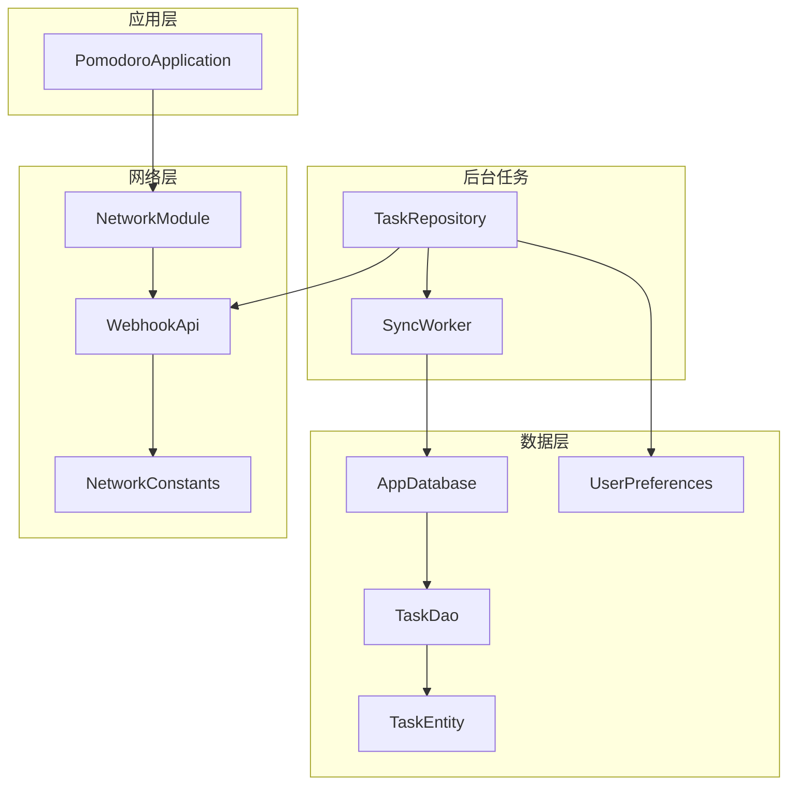
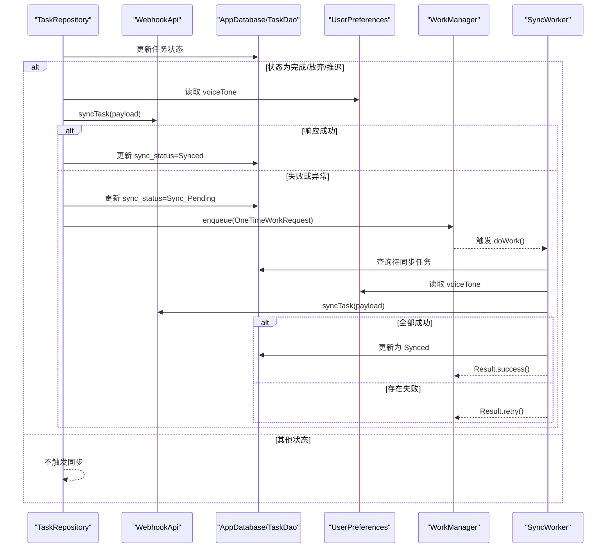
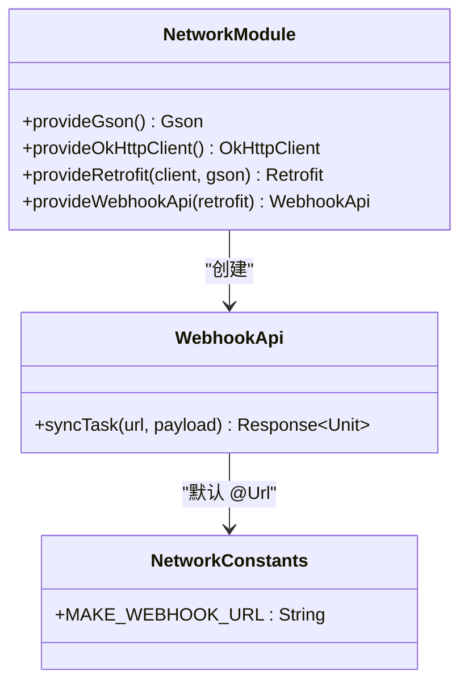
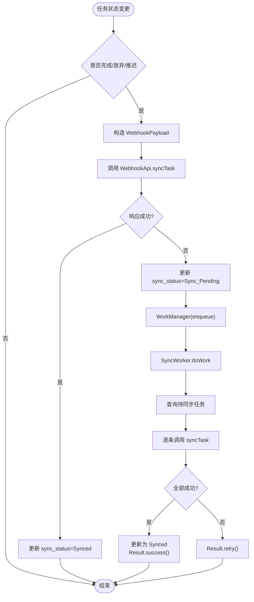
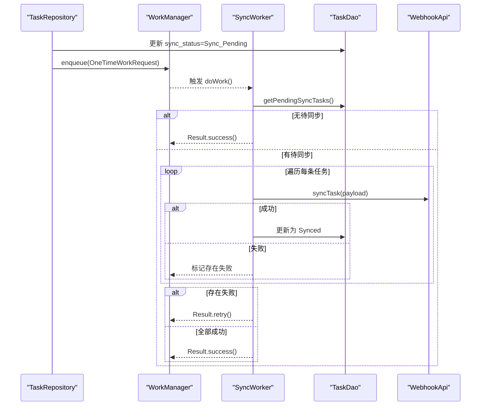
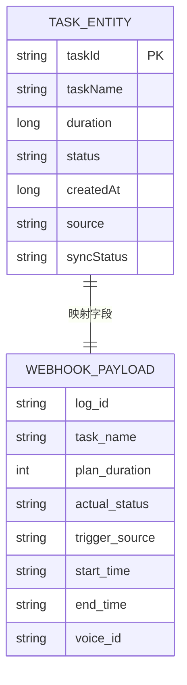
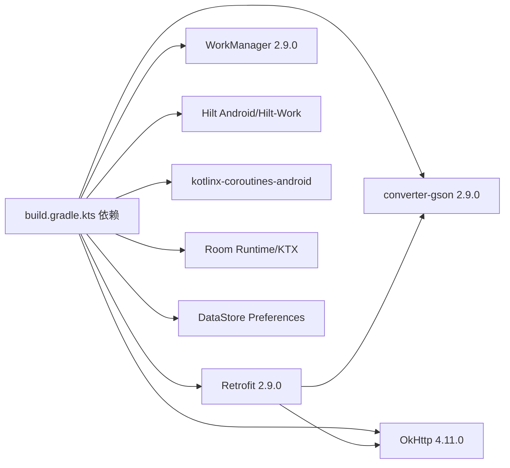

# 网络服务

<cite>
**本文引用的文件**
- [WebhookApi.kt](file://app/src/main/java/com/pomodoroalert/network/WebhookApi.kt)
- [NetworkConstants.kt](file://app/src/main/java/com/pomodoroalert/network/NetworkConstants.kt)
- [NetworkModule.kt](file://app/src/main/java/com/pomodoroalert/di/NetworkModule.kt)
- [WebhookPayload.kt](file://app/src/main/java/com/pomodoroalert/data/WebhookPayload.kt)
- [TaskRepository.kt](file://app/src/main/java/com/pomodoroalert/data/TaskRepository.kt)
- [SyncWorker.kt](file://app/src/main/java/com/pomodoroalert/worker/SyncWorker.kt)
- [TaskDao.kt](file://app/src/main/java/com/pomodoroalert/data/TaskDao.kt)
- [TaskEntity.kt](file://app/src/main/java/com/pomodoroalert/data/TaskEntity.kt)
- [UserPreferences.kt](file://app/src/main/java/com/pomodoroalert/data/UserPreferences.kt)
- [AppDatabase.kt](file://app/src/main/java/com/pomodoroalert/data/AppDatabase.kt)
- [PomodoroApplication.kt](file://app/src/main/java/com/pomodoroalert/PomodoroApplication.kt)
- [build.gradle.kts](file://app/build.gradle.kts)
- [libs.versions.toml](file://gradle/libs.versions.toml)
</cite>

## 目录
1. [简介](#简介)
2. [项目结构](#项目结构)
3. [核心组件](#核心组件)
4. [架构总览](#架构总览)
5. [详细组件分析](#详细组件分析)
6. [依赖分析](#依赖分析)
7. [性能考虑](#性能考虑)
8. [故障排查指南](#故障排查指南)
9. [结论](#结论)
10. [附录](#附录)

## 简介
本文件聚焦于 PomodoroAlert 的网络服务模块，系统性阐述 Retrofit 配置与使用、Webhook 同步机制、WorkManager 后台任务调度、安全性与容错策略，以及性能优化与监控建议。目标是帮助开发者快速理解并扩展该模块。

## 项目结构
网络服务相关代码按职责分层组织：
- 网络接口与常量：位于 network 包，定义 Webhook 接口与基础 URL 常量
- 数据模型：位于 data 包，定义 Webhook 请求载荷与数据库实体、DAO
- 依赖注入：位于 di 包，提供 Retrofit、OkHttp、Gson 及 WebhookApi 实例
- 业务触发与重试：位于 data 包，TaskRepository 在任务状态变更时触发同步或标记待同步并调度 WorkManager
- 后台同步：位于 worker 包，SyncWorker 负责批量拉取待同步任务并调用 WebhookApi 发送
- 应用入口：位于根包，声明 Hilt 应用入口以启用 DI

**图表来源**
- [PomodoroApplication.kt:1-8](file://app/src/main/java/com/pomodoroalert/PomodoroApplication.kt#L1-L8)
- [NetworkModule.kt:1-53](file://app/src/main/java/com/pomodoroalert/di/NetworkModule.kt#L1-L53)
- [WebhookApi.kt:1-16](file://app/src/main/java/com/pomodoroalert/network/WebhookApi.kt#L1-L16)
- [NetworkConstants.kt:1-7](file://app/src/main/java/com/pomodoroalert/network/NetworkConstants.kt#L1-L7)
- [TaskRepository.kt:1-101](file://app/src/main/java/com/pomodoroalert/data/TaskRepository.kt#L1-L101)
- [SyncWorker.kt:1-78](file://app/src/main/java/com/pomodoroalert/worker/SyncWorker.kt#L1-L78)
- [AppDatabase.kt:1-10](file://app/src/main/java/com/pomodoroalert/data/AppDatabase.kt#L1-L10)
- [TaskDao.kt:1-29](file://app/src/main/java/com/pomodoroalert/data/TaskDao.kt#L1-L29)
- [TaskEntity.kt:1-19](file://app/src/main/java/com/pomodoroalert/data/TaskEntity.kt#L1-L19)
- [UserPreferences.kt:1-36](file://app/src/main/java/com/pomodoroalert/data/UserPreferences.kt#L1-L36)

**章节来源**
- [build.gradle.kts:43-79](file://app/build.gradle.kts#L43-L79)
- [libs.versions.toml:20-47](file://gradle/libs.versions.toml#L20-L47)

## 核心组件
- Retrofit 与 OkHttp 配置：通过 NetworkModule 提供单例 OkHttpClient（含连接/读/写超时）与 Retrofit（Gson 转换器），并暴露 WebhookApi
- Webhook 接口：定义同步任务的 POST 接口，支持动态 @Url 注入目标地址
- 数据模型：WebhookPayload 映射云端字段；TaskEntity/TaskDao 支持本地持久化与待同步查询
- 业务触发：TaskRepository 在任务完成后尝试立即同步；失败则标记待同步并调度 WorkManager
- 后台同步：SyncWorker 拉取待同步任务，构造 WebhookPayload 并调用 WebhookApi，成功则更新状态，否则返回重试

**章节来源**
- [NetworkModule.kt:16-52](file://app/src/main/java/com/pomodoroalert/di/NetworkModule.kt#L16-L52)
- [WebhookApi.kt:9-15](file://app/src/main/java/com/pomodoroalert/network/WebhookApi.kt#L9-L15)
- [WebhookPayload.kt:8-17](file://app/src/main/java/com/pomodoroalert/data/WebhookPayload.kt#L8-L17)
- [TaskRepository.kt:32-80](file://app/src/main/java/com/pomodoroalert/data/TaskRepository.kt#L32-L80)
- [SyncWorker.kt:24-71](file://app/src/main/java/com/pomodoroalert/worker/SyncWorker.kt#L24-L71)
- [TaskDao.kt:23-27](file://app/src/main/java/com/pomodoroalert/data/TaskDao.kt#L23-L27)
- [TaskEntity.kt:16-17](file://app/src/main/java/com/pomodoroalert/data/TaskEntity.kt#L16-L17)

## 架构总览
下图展示从任务状态变更到后台同步的整体流程，包括 Retrofit 调用链与 WorkManager 重试机制。

**图表来源**
- [TaskRepository.kt:32-94](file://app/src/main/java/com/pomodoroalert/data/TaskRepository.kt#L32-L94)
- [SyncWorker.kt:24-71](file://app/src/main/java/com/pomodoroalert/worker/SyncWorker.kt#L24-L71)
- [WebhookApi.kt:11-14](file://app/src/main/java/com/pomodoroalert/network/WebhookApi.kt#L11-L14)
- [TaskDao.kt:23-27](file://app/src/main/java/com/pomodoroalert/data/TaskDao.kt#L23-L27)
- [UserPreferences.kt:24](file://app/src/main/java/com/pomodoroalert/data/UserPreferences.kt#L24)

## 详细组件分析

### Retrofit 与网络配置
- OkHttpClient：设置连接、读、写超时均为 15 秒，保证在网络波动时快速失败并可由 WorkManager 重试
- Retrofit：以 https://hook.make.com/ 作为基础 URL 占位，实际请求通过 @Url 动态传入完整地址
- Gson 转换器：使用默认 GsonBuilder，确保 WebhookPayload 正确序列化
- 作用域：均以 @Singleton 提供，贯穿应用生命周期

**图表来源**
- [NetworkModule.kt:16-52](file://app/src/main/java/com/pomodoroalert/di/NetworkModule.kt#L16-L52)
- [WebhookApi.kt:9-15](file://app/src/main/java/com/pomodoroalert/network/WebhookApi.kt#L9-L15)
- [NetworkConstants.kt:3-6](file://app/src/main/java/com/pomodoroalert/network/NetworkConstants.kt#L3-L6)

**章节来源**
- [NetworkModule.kt:20-44](file://app/src/main/java/com/pomodoroalert/di/NetworkModule.kt#L20-L44)
- [NetworkConstants.kt:3-6](file://app/src/main/java/com/pomodoroalert/network/NetworkConstants.kt#L3-L6)

### Webhook 同步机制
- 接口定义：syncTask 使用 @POST 与 @Url，@Body 传入 WebhookPayload
- 数据序列化：WebhookPayload 字段映射云端 schema，使用 @SerializedName 保持一致性
- 同步策略：
  - 业务层触发：TaskRepository 在任务完成后立即尝试同步
  - 失败处理：若响应非成功或抛出异常，则标记为待同步并调度 WorkManager
  - 后台重试：SyncWorker 拉取所有待同步任务，逐条发送；全部成功返回成功，否则返回重试

**图表来源**
- [TaskRepository.kt:32-94](file://app/src/main/java/com/pomodoroalert/data/TaskRepository.kt#L32-L94)
- [SyncWorker.kt:24-71](file://app/src/main/java/com/pomodoroalert/worker/SyncWorker.kt#L24-L71)
- [WebhookPayload.kt:8-17](file://app/src/main/java/com/pomodoroalert/data/WebhookPayload.kt#L8-L17)

**章节来源**
- [WebhookApi.kt:9-15](file://app/src/main/java/com/pomodoroalert/network/WebhookApi.kt#L9-L15)
- [WebhookPayload.kt:8-17](file://app/src/main/java/com/pomodoroalert/data/WebhookPayload.kt#L8-L17)
- [TaskRepository.kt:42-94](file://app/src/main/java/com/pomodoroalert/data/TaskRepository.kt#L42-L94)
- [SyncWorker.kt:34-71](file://app/src/main/java/com/pomodoroalert/worker/SyncWorker.kt#L34-L71)

### WorkManager 后台任务调度
- 任务约束：仅在有网络时执行（NetworkType.CONNECTED）
- 任务队列：一次性任务，每次从待同步集合中拉取并处理
- 重试机制：全部成功返回成功，否则返回重试，由 WorkManager 自动指数退避
- 任务编排：TaskRepository 在标记待同步后入队；SyncWorker 内部循环发送，最终统一决定结果

**图表来源**
- [TaskRepository.kt:82-94](file://app/src/main/java/com/pomodoroalert/data/TaskRepository.kt#L82-L94)
- [SyncWorker.kt:24-71](file://app/src/main/java/com/pomodoroalert/worker/SyncWorker.kt#L24-L71)
- [TaskDao.kt:23-27](file://app/src/main/java/com/pomodoroalert/data/TaskDao.kt#L23-L27)

**章节来源**
- [TaskRepository.kt:82-94](file://app/src/main/java/com/pomodoroalert/data/TaskRepository.kt#L82-L94)
- [SyncWorker.kt:24-71](file://app/src/main/java/com/pomodoroalert/worker/SyncWorker.kt#L24-L71)

### 数据模型与持久化
- WebhookPayload：与云端 schema 对齐的 DTO，用于序列化发送
- TaskEntity：包含 taskId、taskName、duration、status、createdAt、source、syncStatus 等字段
- TaskDao：提供插入、查询活跃任务、按 ID 查询、更新状态、查询待同步、更新同步状态等操作
- AppDatabase：Room 数据库入口，暴露 TaskDao

**图表来源**
- [TaskEntity.kt:8-18](file://app/src/main/java/com/pomodoroalert/data/TaskEntity.kt#L8-L18)
- [WebhookPayload.kt:8-17](file://app/src/main/java/com/pomodoroalert/data/WebhookPayload.kt#L8-L17)

**章节来源**
- [TaskEntity.kt:8-18](file://app/src/main/java/com/pomodoroalert/data/TaskEntity.kt#L8-L18)
- [TaskDao.kt:10-28](file://app/src/main/java/com/pomodoroalert/data/TaskDao.kt#L10-L28)
- [AppDatabase.kt:6-9](file://app/src/main/java/com/pomodoroalert/data/AppDatabase.kt#L6-L9)
- [WebhookPayload.kt:8-17](file://app/src/main/java/com/pomodoroalert/data/WebhookPayload.kt#L8-L17)

## 依赖分析
- 网络栈：Retrofit 2.9.0 + Gson 转换器 + OkHttp 4.11.0
- 工作管理：WorkManager 2.9.0
- 依赖注入：Hilt（Android/Hilt-Work）
- 协程：kotlinx-coroutines-android
- 数据存储：Room + DataStore Preferences

**图表来源**
- [build.gradle.kts:67-71](file://app/build.gradle.kts#L67-L71)
- [libs.versions.toml:20-47](file://gradle/libs.versions.toml#L20-L47)

**章节来源**
- [build.gradle.kts:43-79](file://app/build.gradle.kts#L43-L79)
- [libs.versions.toml:20-47](file://gradle/libs.versions.toml#L20-L47)

## 性能考虑
- 连接与超时：OkHttpClient 设置统一超时，避免长时间阻塞 UI 或后台任务
- 序列化成本：Gson 默认配置，字段较少且结构简单，序列化开销可控
- 批处理策略：WorkManager 一次处理多条待同步任务，减少频繁唤醒
- 网络约束：仅在有网络时运行，降低无效重试
- 建议优化（可选）：
  - 引入缓存控制头（如需要）与合理的重试退避策略
  - 对高频任务合并上报（如批量发送）
  - 在网络状态变化时主动触发 WorkManager 重试（需结合系统广播）

[本节为通用性能建议，不直接分析具体文件]

## 故障排查指南
- 常见问题
  - Webhook 地址未配置：NetworkConstants 中占位符需替换为真实地址
  - 无网络导致同步失败：检查 WorkManager 约束与网络可用性
  - 时间格式不一致：SyncWorker 与 TaskRepository 使用相同时间格式，确保云端解析一致
- 定位方法
  - 查看 TaskRepository 标记待同步逻辑与 WorkManager 入队位置
  - 检查 SyncWorker 的 doWork 返回值与 DAO 更新状态
  - 关注 Retrofit/OkHttp 超时与异常捕获
- 建议
  - 在生产环境记录网络请求日志（建议使用 OkHttp 日志拦截器）
  - 对关键路径增加监控埋点（如同步耗时、成功率）

**章节来源**
- [NetworkConstants.kt:4-5](file://app/src/main/java/com/pomodoroalert/network/NetworkConstants.kt#L4-L5)
- [TaskRepository.kt:82-94](file://app/src/main/java/com/pomodoroalert/data/TaskRepository.kt#L82-L94)
- [SyncWorker.kt:57-67](file://app/src/main/java/com/pomodoroalert/worker/SyncWorker.kt#L57-L67)

## 结论
该网络服务模块以 Retrofit 为核心，结合 Hilt 注入、Room 持久化与 WorkManager 后台重试，实现了稳定可靠的 Webhook 同步能力。通过明确的数据模型、清晰的业务触发与重试策略，系统在弱网环境下具备良好的容错性。后续可在安全、监控与性能方面进一步增强。

[本节为总结性内容，不直接分析具体文件]

## 附录

### 安全性与 HTTPS 配置
- HTTPS：Retrofit baseUrl 采用 https://hook.make.com/，默认使用系统信任的证书链
- 认证机制：当前未实现自定义鉴权头；建议在 WebhookApi 中增加认证参数或拦截器
- 数据加密：传输层由 TLS 保障；敏感字段建议在云端侧加密存储

**章节来源**
- [NetworkModule.kt:39-44](file://app/src/main/java/com/pomodoroalert/di/NetworkModule.kt#L39-L44)

### 错误处理与超时重试
- 超时：连接/读/写均设为 15 秒，避免长时间等待
- 重试：业务层失败时标记待同步并入队 WorkManager；WorkManager 统一指数退避重试
- 断线重连：WorkManager 在网络恢复后自动执行

**章节来源**
- [NetworkModule.kt:28-34](file://app/src/main/java/com/pomodoroalert/di/NetworkModule.kt#L28-L34)
- [TaskRepository.kt:82-94](file://app/src/main/java/com/pomodoroalert/data/TaskRepository.kt#L82-L94)
- [SyncWorker.kt:70](file://app/src/main/java/com/pomodoroalert/worker/SyncWorker.kt#L70)

### 监控与可观测性建议
- 网络层：添加 OkHttp 日志拦截器输出请求/响应摘要
- 业务层：统计同步成功率、平均耗时、失败原因分布
- 后台层：记录 WorkManager 任务执行次数与重试次数

[本节为通用建议，不直接分析具体文件]