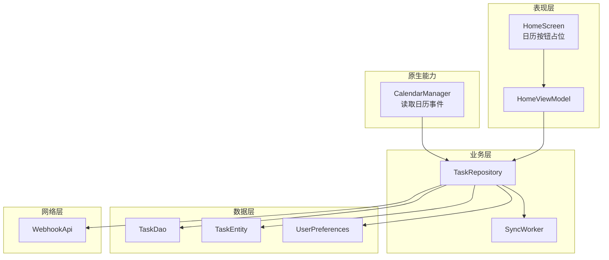
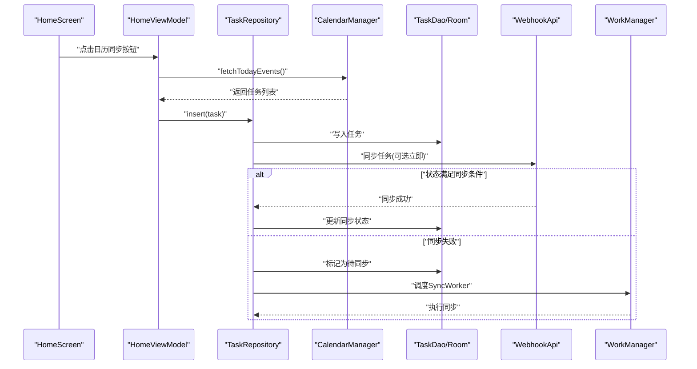
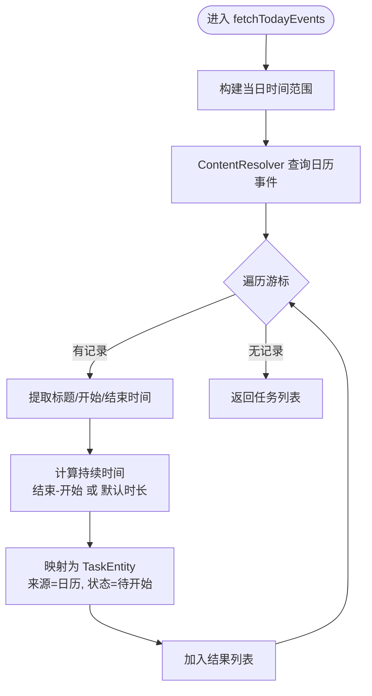
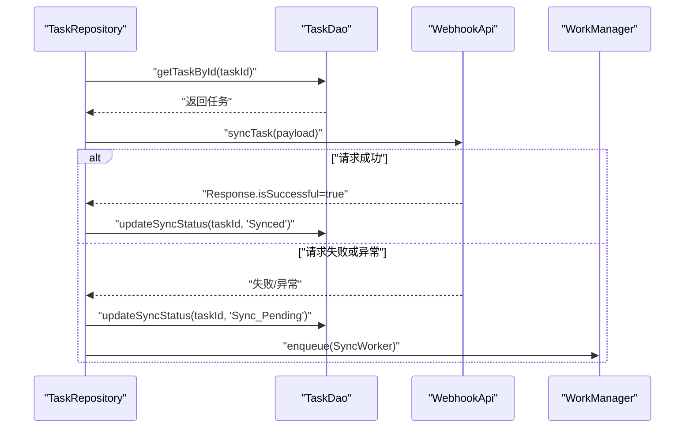
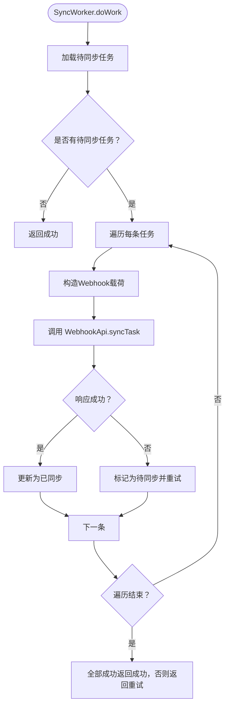
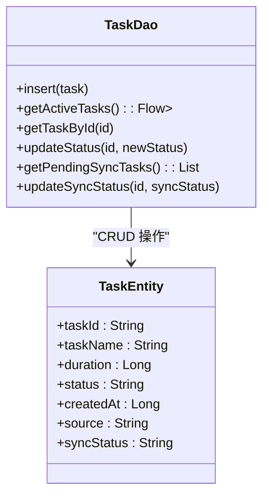
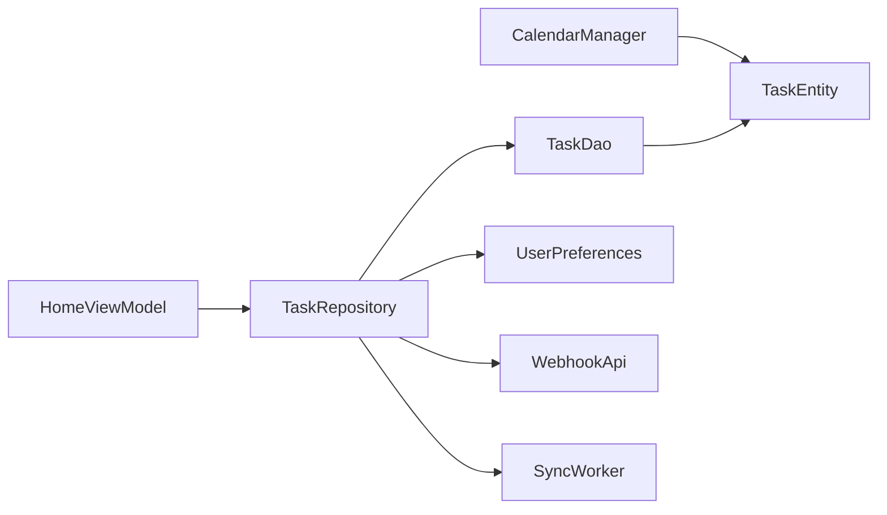

# 日历集成功能

<cite>
**本文档引用的文件**
- [CalendarManager.kt](file://app/src/main/java/com/pomodoroalert/voice/CalendarManager.kt)
- [SyncWorker.kt](file://app/src/main/java/com/pomodoroalert/worker/SyncWorker.kt)
- [TaskEntity.kt](file://app/src/main/java/com/pomodoroalert/data/TaskEntity.kt)
- [TaskRepository.kt](file://app/src/main/java/com/pomodoroalert/data/TaskRepository.kt)
- [TaskDao.kt](file://app/src/main/java/com/pomodoroalert/data/TaskDao.kt)
- [AndroidManifest.xml](file://app/src/main/AndroidManifest.xml)
- [HomeScreen.kt](file://app/src/main/java/com/pomodoroalert/ui/screens/HomeScreen.kt)
- [HomeViewModel.kt](file://app/src/main/java/com/pomodoroalert/ui/viewmodel/HomeViewModel.kt)
- [UserPreferences.kt](file://app/src/main/java/com/pomodoroalert/data/UserPreferences.kt)
- [WebhookApi.kt](file://app/src/main/java/com/pomodoroalert/network/WebhookApi.kt)
</cite>

## 目录
1. [简介](#简介)
2. [项目结构](#项目结构)
3. [核心组件](#核心组件)
4. [架构总览](#架构总览)
5. [详细组件分析](#详细组件分析)
6. [依赖关系分析](#依赖关系分析)
7. [性能考虑](#性能考虑)
8. [故障排除指南](#故障排除指南)
9. [结论](#结论)
10. [附录](#附录)

## 简介
本技术文档围绕日历集成功能展开，系统阐述Android日历API的使用方式与实现细节，涵盖以下方面：
- 日历事件的查询、过滤与排序
- 日历事件到任务实体的自动转换机制（事件信息提取、字段映射、默认时长处理）
- 权限申请与管理（READ_CALENDAR权限检查与运行时权限处理建议）
- 同步策略（增量同步、冲突解决、数据一致性保障）
- 日历事件解析与处理逻辑（时间格式转换、重复规则与提醒设置的扩展点）
- 兼容性处理、错误处理与性能优化方案

## 项目结构
日历集成功能主要涉及以下模块：
- 数据层：Room数据库、DAO接口、实体定义
- 业务层：仓库（Repository）与工作（Worker）类
- 表现层：UI界面与视图模型
- 网络层：Webhook同步接口
- 原生能力：Android日历API（CalendarContract）

图表来源
- [HomeScreen.kt](file://app/src/main/java/com/pomodoroalert/ui/screens/HomeScreen.kt)
- [HomeViewModel.kt](file://app/src/main/java/com/pomodoroalert/ui/viewmodel/HomeViewModel.kt)
- [TaskRepository.kt](file://app/src/main/java/com/pomodoroalert/data/TaskRepository.kt)
- [TaskDao.kt](file://app/src/main/java/com/pomodoroalert/data/TaskDao.kt)
- [TaskEntity.kt](file://app/src/main/java/com/pomodoroalert/data/TaskEntity.kt)
- [UserPreferences.kt](file://app/src/main/java/com/pomodoroalert/data/UserPreferences.kt)
- [WebhookApi.kt](file://app/src/main/java/com/pomodoroalert/network/WebhookApi.kt)
- [CalendarManager.kt](file://app/src/main/java/com/pomodoroalert/voice/CalendarManager.kt)

章节来源
- [HomeScreen.kt](file://app/src/main/java/com/pomodoroalert/ui/screens/HomeScreen.kt)
- [HomeViewModel.kt](file://app/src/main/java/com/pomodoroalert/ui/viewmodel/HomeViewModel.kt)
- [TaskRepository.kt](file://app/src/main/java/com/pomodoroalert/data/TaskRepository.kt)
- [TaskDao.kt](file://app/src/main/java/com/pomodoroalert/data/TaskDao.kt)
- [TaskEntity.kt](file://app/src/main/java/com/pomodoroalert/data/TaskEntity.kt)
- [UserPreferences.kt](file://app/src/main/java/com/pomodoroalert/data/UserPreferences.kt)
- [WebhookApi.kt](file://app/src/main/java/com/pomodoroalert/network/WebhookApi.kt)
- [CalendarManager.kt](file://app/src/main/java/com/pomodoroalert/voice/CalendarManager.kt)

## 核心组件
- 日历事件读取器：负责通过ContentResolver访问系统日历，按日期范围筛选事件，并转换为任务实体列表。
- 任务仓库：负责插入任务、更新状态、触发同步；当任务状态满足条件时直接同步，否则标记为待同步并由后台Worker处理。
- 同步工作器：周期性拉取待同步任务，构造Webhook载荷并调用网络接口，失败时回退为待同步并由WorkManager调度重试。
- 数据持久化：Room数据库存储任务与同步状态，DAO提供查询与更新操作。
- UI与配置：HomeScreen提供入口（图标占位），HomeViewModel订阅活跃任务流；UserPreferences提供默认参数（如语音音色）。

章节来源
- [CalendarManager.kt](file://app/src/main/java/com/pomodoroalert/voice/CalendarManager.kt)
- [TaskRepository.kt](file://app/src/main/java/com/pomodoroalert/data/TaskRepository.kt)
- [SyncWorker.kt](file://app/src/main/java/com/pomodoroalert/worker/SyncWorker.kt)
- [TaskDao.kt](file://app/src/main/java/com/pomodoroalert/data/TaskDao.kt)
- [TaskEntity.kt](file://app/src/main/java/com/pomodoroalert/data/TaskEntity.kt)
- [HomeScreen.kt](file://app/src/main/java/com/pomodoroalert/ui/screens/HomeScreen.kt)
- [HomeViewModel.kt](file://app/src/main/java/com/pomodoroalert/ui/viewmodel/HomeViewModel.kt)
- [UserPreferences.kt](file://app/src/main/java/com/pomodoroalert/data/UserPreferences.kt)

## 架构总览
日历集成功能遵循“读取—转换—入库—同步”的闭环流程。UI触发后，通过仓库将日历事件转换为任务实体并写入数据库；当任务状态变化或定时任务触发时，通过Webhook上报并维护同步状态。

图表来源
- [HomeScreen.kt](file://app/src/main/java/com/pomodoroalert/ui/screens/HomeScreen.kt)
- [HomeViewModel.kt](file://app/src/main/java/com/pomodoroalert/ui/viewmodel/HomeViewModel.kt)
- [TaskRepository.kt](file://app/src/main/java/com/pomodoroalert/data/TaskRepository.kt)
- [CalendarManager.kt](file://app/src/main/java/com/pomodoroalert/voice/CalendarManager.kt)
- [TaskDao.kt](file://app/src/main/java/com/pomodoroalert/data/TaskDao.kt)
- [WebhookApi.kt](file://app/src/main/java/com/pomodoroalert/network/WebhookApi.kt)

## 详细组件分析

### 日历事件读取与转换（CalendarManager）
- 查询范围：以当日00:00:00至23:59:59为边界，筛选DTSTART在该范围内的事件。
- 字段提取：从事件表读取标题、开始时间、结束时间。
- 默认时长处理：若结束时间不晚于开始时间，则采用默认时长（示例中为固定时长）。
- 实体映射：将事件转换为任务实体，设置来源为“日历”，状态为“待开始”，创建时间为当前时间戳。

图表来源
- [CalendarManager.kt](file://app/src/main/java/com/pomodoroalert/voice/CalendarManager.kt)

章节来源
- [CalendarManager.kt](file://app/src/main/java/com/pomodoroalert/voice/CalendarManager.kt)

### 任务仓库与同步策略（TaskRepository）
- 插入与状态更新：提供插入任务与更新状态的方法；当状态为“已完成/已放弃/推迟”时触发同步。
- 直接同步：构造Webhook载荷，调用网络接口；成功则更新同步状态为“已同步”，失败则标记为“待同步”并调度后台重试。
- 后台重试：通过WorkManager约束网络可用时执行SyncWorker，批量处理待同步任务。

图表来源
- [TaskRepository.kt](file://app/src/main/java/com/pomodoroalert/data/TaskRepository.kt)
- [TaskDao.kt](file://app/src/main/java/com/pomodoroalert/data/TaskDao.kt)
- [WebhookApi.kt](file://app/src/main/java/com/pomodoroalert/network/WebhookApi.kt)

章节来源
- [TaskRepository.kt](file://app/src/main/java/com/pomodoroalert/data/TaskRepository.kt)
- [TaskDao.kt](file://app/src/main/java/com/pomodoroalert/data/TaskDao.kt)
- [WebhookApi.kt](file://app/src/main/java/com/pomodoroalert/network/WebhookApi.kt)

### 后台同步工作器（SyncWorker）
- 触发条件：当存在“待同步”任务时执行。
- 批量处理：逐条构造Webhook载荷并调用网络接口；全部成功返回成功，否则返回重试。
- 时间格式：统一使用本地格式化字符串表示时间戳。

图表来源
- [SyncWorker.kt](file://app/src/main/java/com/pomodoroalert/worker/SyncWorker.kt)
- [TaskDao.kt](file://app/src/main/java/com/pomodoroalert/data/TaskDao.kt)
- [WebhookApi.kt](file://app/src/main/java/com/pomodoroalert/network/WebhookApi.kt)

章节来源
- [SyncWorker.kt](file://app/src/main/java/com/pomodoroalert/worker/SyncWorker.kt)
- [TaskDao.kt](file://app/src/main/java/com/pomodoroalert/data/TaskDao.kt)
- [WebhookApi.kt](file://app/src/main/java/com/pomodoroalert/network/WebhookApi.kt)

### 数据模型与排序（TaskEntity、TaskDao）
- 实体字段：包含主键、任务名、持续时间、状态、创建时间、来源、同步状态等。
- 排序规则：查询活跃任务时按创建时间降序排列，便于展示最新任务在前。
- 待同步查询：DAO提供按同步状态筛选的查询接口，支持后台Worker批量处理。

图表来源
- [TaskEntity.kt](file://app/src/main/java/com/pomodoroalert/data/TaskEntity.kt)
- [TaskDao.kt](file://app/src/main/java/com/pomodoroalert/data/TaskDao.kt)

章节来源
- [TaskEntity.kt](file://app/src/main/java/com/pomodoroalert/data/TaskEntity.kt)
- [TaskDao.kt](file://app/src/main/java/com/pomodoroalert/data/TaskDao.kt)

### UI与交互（HomeScreen、HomeViewModel）
- UI入口：HomeScreen中包含“同步日历”图标按钮（占位），用于触发日历同步流程。
- 数据绑定：HomeViewModel订阅仓库提供的活跃任务流，实现UI实时刷新。
- 任务创建：用户输入任务名后，通过仓库插入默认时长的任务，状态为“待开始”。

章节来源
- [HomeScreen.kt](file://app/src/main/java/com/pomodoroalert/ui/screens/HomeScreen.kt)
- [HomeViewModel.kt](file://app/src/main/java/com/pomodoroalert/ui/viewmodel/HomeViewModel.kt)

### 权限与兼容性（AndroidManifest、权限检查与运行时处理建议）
- 已声明权限：应用清单中声明了READ_CALENDAR权限，确保可访问系统日历。
- 运行时权限：建议在调用日历API前进行权限检查与请求，若被拒绝需引导用户前往设置开启。
- 兼容性：针对不同Android版本的权限模型差异，应分别处理权限请求与行为降级。

章节来源
- [AndroidManifest.xml](file://app/src/main/AndroidManifest.xml)

## 依赖关系分析
- 组件耦合：CalendarManager与TaskRepository解耦，通过TaskEntity进行数据传递；TaskRepository与TaskDao、WebhookApi、WorkManager形成清晰的职责边界。
- 外部依赖：Android日历API（CalendarContract）、Room数据库、Retrofit网络库、WorkManager后台调度。
- 可能的循环依赖：当前结构未见循环依赖，各层职责明确。

图表来源
- [CalendarManager.kt](file://app/src/main/java/com/pomodoroalert/voice/CalendarManager.kt)
- [HomeViewModel.kt](file://app/src/main/java/com/pomodoroalert/ui/viewmodel/HomeViewModel.kt)
- [TaskRepository.kt](file://app/src/main/java/com/pomodoroalert/data/TaskRepository.kt)
- [TaskDao.kt](file://app/src/main/java/com/pomodoroalert/data/TaskDao.kt)
- [TaskEntity.kt](file://app/src/main/java/com/pomodoroalert/data/TaskEntity.kt)
- [UserPreferences.kt](file://app/src/main/java/com/pomodoroalert/data/UserPreferences.kt)
- [WebhookApi.kt](file://app/src/main/java/com/pomodoroalert/network/WebhookApi.kt)
- [SyncWorker.kt](file://app/src/main/java/com/pomodoroalert/worker/SyncWorker.kt)

章节来源
- [TaskRepository.kt](file://app/src/main/java/com/pomodoroalert/data/TaskRepository.kt)
- [TaskDao.kt](file://app/src/main/java/com/pomodoroalert/data/TaskDao.kt)
- [TaskEntity.kt](file://app/src/main/java/com/pomodoroalert/data/TaskEntity.kt)
- [WebhookApi.kt](file://app/src/main/java/com/pomodoroalert/network/WebhookApi.kt)
- [SyncWorker.kt](file://app/src/main/java/com/pomodoroalert/worker/SyncWorker.kt)
- [CalendarManager.kt](file://app/src/main/java/com/pomodoroalert/voice/CalendarManager.kt)
- [UserPreferences.kt](file://app/src/main/java/com/pomodoroalert/data/UserPreferences.kt)

## 性能考虑
- 查询优化：日历查询按当日范围过滤，避免全量扫描；建议在高并发场景下限制查询数量或分页。
- 写入策略：批量插入任务时优先使用事务或合并请求，减少数据库写入次数。
- 同步策略：利用WorkManager的约束与退避策略，避免频繁网络请求；仅在必要时触发同步。
- UI渲染：使用LazyColumn懒加载与key稳定化，降低重组成本。
- 内存管理：避免在主线程执行数据库与网络操作，使用协程与IO调度器。

## 故障排除指南
- 无法读取日历事件
  - 检查是否授予READ_CALENDAR权限且未被系统拦截。
  - 确认设备日历账户已正确配置且有可见事件。
- 同步失败
  - 查看网络接口返回状态与异常日志，确认URL与载荷格式。
  - 若出现部分失败，系统会标记为“待同步”，等待WorkManager重试。
- 数据不一致
  - 确保状态变更与同步状态更新在同一事务或顺序执行路径中。
  - 对于需要精确结束时间的场景，建议在实体中增加结束时间字段并持久化。

章节来源
- [TaskRepository.kt](file://app/src/main/java/com/pomodoroalert/data/TaskRepository.kt)
- [SyncWorker.kt](file://app/src/main/java/com/pomodoroalert/worker/SyncWorker.kt)
- [TaskDao.kt](file://app/src/main/java/com/pomodoroalert/data/TaskDao.kt)

## 结论
日历集成功能通过清晰的分层设计实现了从日历事件到任务实体的自动化转换，并结合仓库与后台工作器完成了可靠的增量同步与一致性保障。后续可在以下方面进一步增强：扩展重复规则与提醒设置解析、完善运行时权限处理、引入更细粒度的冲突解决策略以及优化UI交互与性能指标监控。

## 附录
- 术语说明
  - 同步状态：已同步（Synced）、待同步（Sync_Pending）
  - 触发源：手动、语音、日历
  - 状态枚举：待开始、进行中、已完成、已放弃、推迟
- 建议扩展
  - 重复事件处理：解析RRULE并生成多条任务实例
  - 提醒设置：读取事件提醒字段并映射到任务提醒策略
  - 冲突解决：基于任务ID或去重策略避免重复导入
  - 错误码与重试：细化异常类型与退避策略