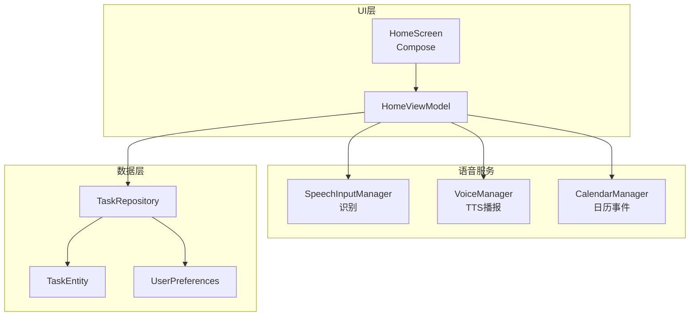
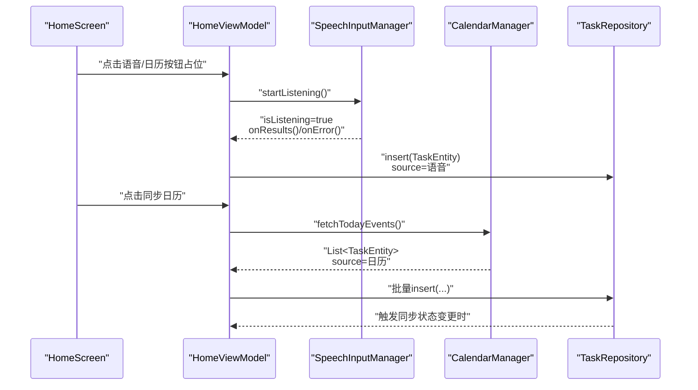
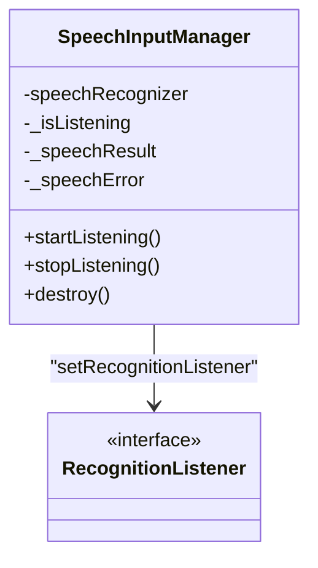
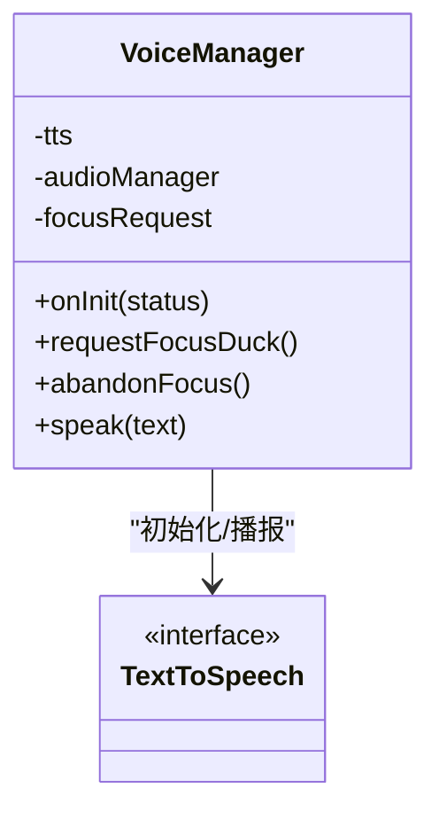
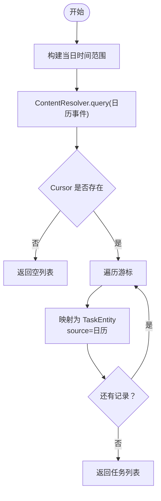
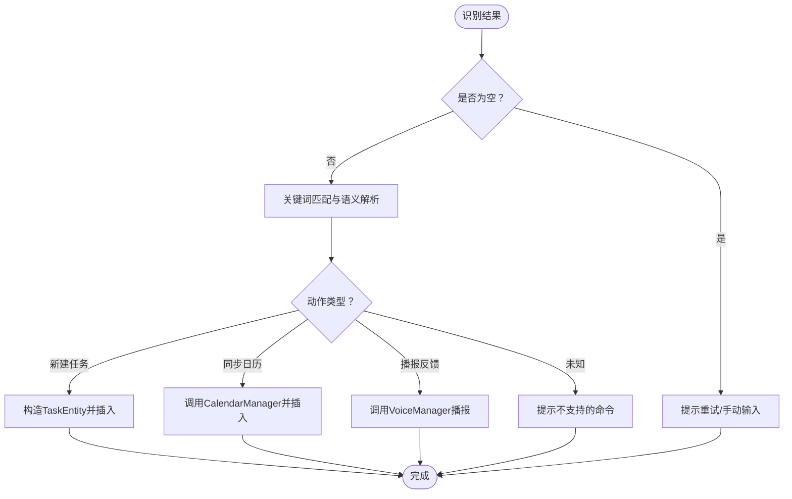
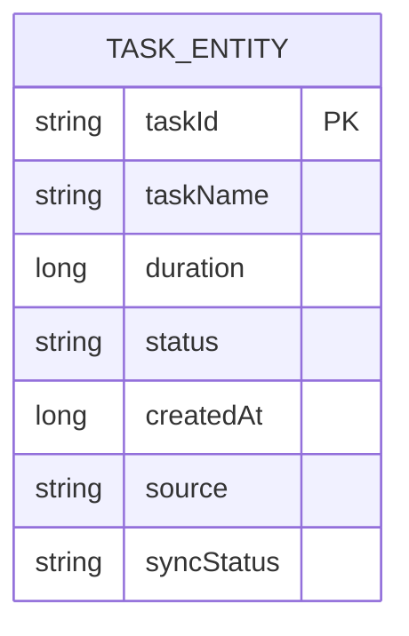
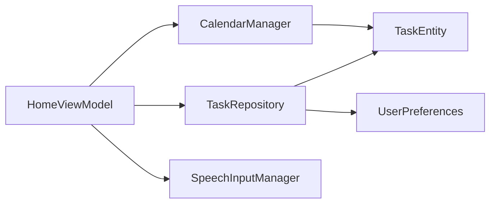

# 语音功能

<cite>
**本文引用的文件**
- [VoiceManager.kt](file://app/src/main/java/com/pomodoroalert/voice/VoiceManager.kt)
- [SpeechInputManager.kt](file://app/src/main/java/com/pomodoroalert/voice/SpeechInputManager.kt)
- [CalendarManager.kt](file://app/src/main/java/com/pomodoroalert/voice/CalendarManager.kt)
- [TaskEntity.kt](file://app/src/main/java/com/pomodoroalert/data/TaskEntity.kt)
- [TaskRepository.kt](file://app/src/main/java/com/pomodoroalert/data/TaskRepository.kt)
- [UserPreferences.kt](file://app/src/main/java/com/pomodoroalert/data/UserPreferences.kt)
- [HomeScreen.kt](file://app/src/main/java/com/pomodoroalert/ui/screens/HomeScreen.kt)
- [HomeViewModel.kt](file://app/src/main/java/com/pomodoroalert/ui/viewmodel/HomeViewModel.kt)
- [AndroidManifest.xml](file://app/src/main/AndroidManifest.xml)
</cite>

## 目录
1. [简介](#简介)
2. [项目结构](#项目结构)
3. [核心组件](#核心组件)
4. [架构总览](#架构总览)
5. [详细组件分析](#详细组件分析)
6. [依赖关系分析](#依赖关系分析)
7. [性能考虑](#性能考虑)
8. [故障排查指南](#故障排查指南)
9. [结论](#结论)
10. [附录](#附录)

## 简介
本文件面向PomodoroAlert的语音功能模块，系统性阐述以下能力与实现细节：
- 语音识别系统：SpeechRecognizer的配置、监听状态与错误处理、识别结果提取与流式更新。
- 语音播报系统：TextToSpeech API的初始化与音频焦点管理、播报参数配置与生命周期控制。
- 日历集成功能：日历事件读取、按当日过滤、事件到任务实体的映射与来源标记。
- 语音命令处理流程：关键词匹配、语义解析与动作执行（当前仓库中语音命令解析逻辑尚未实现，仅提供可扩展建议）。
- 用户体验优化与错误处理：识别状态反馈、错误提示、权限与隐私保护、性能优化策略。

## 项目结构
语音功能相关代码主要位于以下位置：
- 语音识别与播报：voice 包下的 SpeechInputManager 与 VoiceManager
- 日历集成：voice 包下的 CalendarManager
- 数据模型与持久化：data 包下的 TaskEntity、TaskRepository、UserPreferences
- UI 层：HomeScreen 与 HomeViewModel 中预留了语音与日历入口按钮（当前点击事件占位）
- 权限声明：AndroidManifest.xml 声明了录音与日历读取权限

图表来源
- [HomeScreen.kt:78-112](file://app/src/main/java/com/pomodoroalert/ui/screens/HomeScreen.kt#L78-L112)
- [HomeViewModel.kt:15-53](file://app/src/main/java/com/pomodoroalert/ui/viewmodel/HomeViewModel.kt#L15-L53)
- [SpeechInputManager.kt:13-65](file://app/src/main/java/com/pomodoroalert/voice/SpeechInputManager.kt#L13-L65)
- [VoiceManager.kt:12-62](file://app/src/main/java/com/pomodoroalert/voice/VoiceManager.kt#L12-L62)
- [CalendarManager.kt:10-65](file://app/src/main/java/com/pomodoroalert/voice/CalendarManager.kt#L10-L65)
- [TaskEntity.kt:8-19](file://app/src/main/java/com/pomodoroalert/data/TaskEntity.kt#L8-L19)
- [TaskRepository.kt:19-101](file://app/src/main/java/com/pomodoroalert/data/TaskRepository.kt#L19-L101)
- [UserPreferences.kt:15-36](file://app/src/main/java/com/pomodoroalert/data/UserPreferences.kt#L15-L36)

章节来源
- [HomeScreen.kt:48-206](file://app/src/main/java/com/pomodoroalert/ui/screens/HomeScreen.kt#L48-L206)
- [HomeViewModel.kt:15-53](file://app/src/main/java/com/pomodoroalert/ui/viewmodel/HomeViewModel.kt#L15-L53)
- [SpeechInputManager.kt:13-65](file://app/src/main/java/com/pomodoroalert/voice/SpeechInputManager.kt#L13-L65)
- [VoiceManager.kt:12-62](file://app/src/main/java/com/pomodoroalert/voice/VoiceManager.kt#L12-L62)
- [CalendarManager.kt:10-65](file://app/src/main/java/com/pomodoroalert/voice/CalendarManager.kt#L10-L65)
- [TaskEntity.kt:8-19](file://app/src/main/java/com/pomodoroalert/data/TaskEntity.kt#L8-L19)
- [TaskRepository.kt:19-101](file://app/src/main/java/com/pomodoroalert/data/TaskRepository.kt#L19-L101)
- [UserPreferences.kt:15-36](file://app/src/main/java/com/pomodoroalert/data/UserPreferences.kt#L15-L36)

## 核心组件
- 语音识别（SpeechRecognizer）
  - 使用 SpeechRecognizer 创建识别器，注册 RecognitionListener 监听准备、开始、结束、错误与结果回调。
  - 通过状态流暴露 isListening、speechResult、speechError，便于UI订阅与反馈。
  - 提供 startListening、stopListening、destroy 方法控制生命周期。
- 语音播报（TextToSpeech）
  - 初始化 TextToSpeech 并设置默认语言；在播报前请求临时音频焦点（允许降音），播报完成后释放焦点。
  - 使用 UtteranceProgressListener 在播报完成或出错时自动释放焦点，避免资源占用。
- 日历集成（CalendarContract）
  - 查询当日日历事件，投影标题、开始时间、结束时间，映射为任务实体，标记来源为“日历”。
  - 当事件无结束时间时，采用默认时长兜底。
- 数据与偏好
  - TaskEntity 定义任务字段，含来源标识与同步状态。
  - TaskRepository 负责插入任务、更新状态并在任务完成/放弃/推迟时触发同步。
  - UserPreferences 提供语音音色键值读取，用于同步上报。

章节来源
- [SpeechInputManager.kt:13-65](file://app/src/main/java/com/pomodoroalert/voice/SpeechInputManager.kt#L13-L65)
- [VoiceManager.kt:12-62](file://app/src/main/java/com/pomodoroalert/voice/VoiceManager.kt#L12-L62)
- [CalendarManager.kt:10-65](file://app/src/main/java/com/pomodoroalert/voice/CalendarManager.kt#L10-L65)
- [TaskEntity.kt:8-19](file://app/src/main/java/com/pomodoroalert/data/TaskEntity.kt#L8-L19)
- [TaskRepository.kt:19-101](file://app/src/main/java/com/pomodoroalert/data/TaskRepository.kt#L19-L101)
- [UserPreferences.kt:15-36](file://app/src/main/java/com/pomodoroalert/data/UserPreferences.kt#L15-L36)

## 架构总览
语音功能在应用中的交互路径如下：
- UI 层通过 HomeScreen 的麦克风图标与日历图标触发语音输入与日历同步（当前点击事件占位，后续由 HomeViewModel 驱动）。
- HomeViewModel 调用语音识别与日历接口，得到识别文本或日历事件列表。
- 识别文本可作为任务名称，结合默认时长创建 TaskEntity 并写入数据库。
- 日历事件转换为 TaskEntity 列表，同样写入数据库并标记来源。
- 任务状态变更（完成/放弃/推迟）触发同步流程，携带来源标识与用户偏好音色。

图表来源
- [HomeScreen.kt:78-112](file://app/src/main/java/com/pomodoroalert/ui/screens/HomeScreen.kt#L78-L112)
- [HomeViewModel.kt:15-53](file://app/src/main/java/com/pomodoroalert/ui/viewmodel/HomeViewModel.kt#L15-L53)
- [SpeechInputManager.kt:13-65](file://app/src/main/java/com/pomodoroalert/voice/SpeechInputManager.kt#L13-L65)
- [CalendarManager.kt:10-65](file://app/src/main/java/com/pomodoroalert/voice/CalendarManager.kt#L10-L65)
- [TaskRepository.kt:19-101](file://app/src/main/java/com/pomodoroalert/data/TaskRepository.kt#L19-L101)

## 详细组件分析

### 语音识别组件（SpeechInputManager）
- 关键点
  - 识别器生命周期：创建、启动、停止、销毁。
  - 状态流：isListening、speechResult、speechError，便于UI即时反馈。
  - 错误处理：onError 回调中设置错误状态并提示用户。
  - 结果处理：onResults 提取最佳匹配文本，更新结果流。
- 复杂度与性能
  - 识别过程为异步回调，UI侧通过状态流订阅，避免阻塞主线程。
  - 错误码与网络问题提示，提升健壮性。
- 可扩展性
  - 支持多候选结果与部分结果，便于未来实现关键词匹配与语义解析。

图表来源
- [SpeechInputManager.kt:13-65](file://app/src/main/java/com/pomodoroalert/voice/SpeechInputManager.kt#L13-L65)

章节来源
- [SpeechInputManager.kt:13-65](file://app/src/main/java/com/pomodoroalert/voice/SpeechInputManager.kt#L13-L65)

### 语音播报组件（VoiceManager）
- 关键点
  - 初始化：TextToSpeech.OnInitListener 设置默认语言。
  - 音频焦点：请求临时音频焦点（允许降音），播报结束后释放，避免与其他媒体冲突。
  - 播报参数：设置音频属性为语音类型，使用 QUEUE_FLUSH 立即播报。
  - 生命周期：通过 UtteranceProgressListener 在完成或错误时自动释放焦点。
- 复杂度与性能
  - TTS 同步调用开销较小，但需注意在后台或低电量场景下可能被系统限制。
  - 降音策略确保播报时不影响其他媒体播放体验。

图表来源
- [VoiceManager.kt:12-62](file://app/src/main/java/com/pomodoroalert/voice/VoiceManager.kt#L12-L62)

章节来源
- [VoiceManager.kt:12-62](file://app/src/main/java/com/pomodoroalert/voice/VoiceManager.kt#L12-L62)

### 日历集成功能（CalendarManager）
- 关键点
  - 查询范围：当日起止时间边界，使用 ContentResolver 查询事件。
  - 投影字段：标题、开始时间、结束时间。
  - 映射规则：标题为空时使用默认名称；若结束时间无效则按默认时长计算。
  - 来源标记：source 字段标注为“日历”，便于后续统计与同步。
- 复杂度与性能
  - 查询为单次 Cursor 遍历，时间复杂度 O(n)，n 为当日事件数。
  - 建议在后台线程执行查询，避免阻塞主线程。

图表来源
- [CalendarManager.kt:10-65](file://app/src/main/java/com/pomodoroalert/voice/CalendarManager.kt#L10-L65)

章节来源
- [CalendarManager.kt:10-65](file://app/src/main/java/com/pomodoroalert/voice/CalendarManager.kt#L10-L65)

### 语音命令识别与处理流程（可扩展设计）
- 当前状态
  - 语音识别与日历读取已具备基础能力，但语音命令的关键词匹配、语义解析与动作执行尚未实现。
- 建议流程
  - 识别结果到达后，先进行关键词匹配（如“新建任务”、“开始专注”、“同步日历”等）。
  - 对于任务创建类命令，解析任务名与时长，生成 TaskEntity 并插入数据库。
  - 对于日历同步类命令，调用 CalendarManager 获取当日事件并批量插入。
  - 对于播报类命令，调用 VoiceManager 进行语音反馈。
- 错误处理
  - 识别失败或解析失败时，通过 UI 流程提示用户重试或改用手动输入。

（本图为概念性流程图，不直接对应具体源码）

### 数据模型与同步机制
- TaskEntity
  - 字段包含任务ID、名称、持续时间、状态、创建时间、来源与同步状态。
  - 来源字段用于区分手动、语音、日历三类创建渠道。
- 同步机制
  - TaskRepository 在任务状态变为“已完成/已放弃/推迟”时触发同步。
  - 同步时从 UserPreferences 读取语音音色键值，封装 WebhookPayload 并发起网络请求。
  - 若同步失败，标记为“Sync_Pending”，并通过 WorkManager 触发一次性的重试任务。

图表来源
- [TaskEntity.kt:8-19](file://app/src/main/java/com/pomodoroalert/data/TaskEntity.kt#L8-L19)

章节来源
- [TaskEntity.kt:8-19](file://app/src/main/java/com/pomodoroalert/data/TaskEntity.kt#L8-L19)
- [TaskRepository.kt:19-101](file://app/src/main/java/com/pomodoroalert/data/TaskRepository.kt#L19-L101)
- [UserPreferences.kt:15-36](file://app/src/main/java/com/pomodoroalert/data/UserPreferences.kt#L15-L36)

## 依赖关系分析
- 组件耦合
  - HomeViewModel 依赖 TaskRepository、ConfigRepository，负责任务增删改查与默认时长配置。
  - 语音与日历能力通过 HomeViewModel 的占位点击事件接入，当前未直接依赖具体语音实现。
- 外部依赖
  - Android SpeechRecognizer 与 TextToSpeech API。
  - Android CalendarContract 与 ContentResolver。
  - WorkManager 用于延迟重试同步。
- 权限与隐私
  - Manifest 声明录音与日历读取权限，需在运行时向用户申请。
  - 日历数据仅用于读取事件，不写入日历，遵循最小权限原则。

图表来源
- [HomeViewModel.kt:15-53](file://app/src/main/java/com/pomodoroalert/ui/viewmodel/HomeViewModel.kt#L15-L53)
- [TaskRepository.kt:19-101](file://app/src/main/java/com/pomodoroalert/data/TaskRepository.kt#L19-L101)
- [CalendarManager.kt:10-65](file://app/src/main/java/com/pomodoroalert/voice/CalendarManager.kt#L10-L65)
- [SpeechInputManager.kt:13-65](file://app/src/main/java/com/pomodoroalert/voice/SpeechInputManager.kt#L13-L65)
- [TaskEntity.kt:8-19](file://app/src/main/java/com/pomodoroalert/data/TaskEntity.kt#L8-L19)
- [UserPreferences.kt:15-36](file://app/src/main/java/com/pomodoroalert/data/UserPreferences.kt#L15-L36)

章节来源
- [HomeViewModel.kt:15-53](file://app/src/main/java/com/pomodoroalert/ui/viewmodel/HomeViewModel.kt#L15-L53)
- [AndroidManifest.xml:4-9](file://app/src/main/AndroidManifest.xml#L4-L9)

## 性能考虑
- 识别性能
  - 使用自由模式语言模型，适合开放域口语表达；若未来引入关键词，可切换为语音识别模型以提升准确率。
  - onPartialResults 可用于实时反馈，但需谨慎处理抖动与重复提示。
- 播报性能
  - 请求临时音频焦点并允许降音，减少与其他媒体冲突。
  - 使用 QUEUE_FLUSH 确保播报及时性，避免队列堆积。
- 数据库与网络
  - 日历查询在后台线程执行；任务插入与同步在 IO 线程，避免阻塞主线程。
  - 同步失败时通过 WorkManager 延迟重试，降低网络波动影响。

## 故障排查指南
- 识别失败
  - 检查录音权限与设备麦克风可用性；确认网络连接正常（离线时识别可能失败）。
  - 查看 speechError 状态流，根据错误码提示用户重试或改用手动输入。
- 播报无声
  - 确认音频焦点请求成功且未被其他应用抢占；检查系统音量与勿扰模式。
  - 确认 TTS 引擎已安装并可正常使用。
- 日历未同步
  - 确认日历读取权限已授予；检查系统日历应用是否启用且有当日事件。
  - 若事件无结束时间，系统会按默认时长计算，可能导致时长与预期不符。
- 同步失败
  - 检查网络状态；查看同步状态是否被标记为“Sync_Pending”，等待 WorkManager 重试。

章节来源
- [SpeechInputManager.kt:33-36](file://app/src/main/java/com/pomodoroalert/voice/SpeechInputManager.kt#L33-L36)
- [VoiceManager.kt:28-43](file://app/src/main/java/com/pomodoroalert/voice/VoiceManager.kt#L28-L43)
- [CalendarManager.kt:30-39](file://app/src/main/java/com/pomodoroalert/voice/CalendarManager.kt#L30-L39)
- [TaskRepository.kt:72-78](file://app/src/main/java/com/pomodoroalert/data/TaskRepository.kt#L72-L78)

## 结论
- 语音识别与播报模块已具备基础能力，状态流与音频焦点管理保证了良好的用户体验。
- 日历集成功能完善地实现了当日事件读取与任务映射，为语音驱动的任务创建提供了数据基础。
- 语音命令的语义解析与动作执行尚未实现，建议在现有状态流基础上扩展关键词匹配与命令路由。
- 权限与隐私方面，已声明必要权限并限定日历只读访问，符合最小权限原则。

## 附录
- 权限清单
  - 录音权限：用于语音识别。
  - 日历读取权限：用于读取当日事件。
- UI入口
  - HomeScreen 中预留了麦克风与日历图标按钮，当前点击事件占位，后续由 HomeViewModel 实现具体逻辑。

章节来源
- [AndroidManifest.xml:4-9](file://app/src/main/AndroidManifest.xml#L4-L9)
- [HomeScreen.kt:78-112](file://app/src/main/java/com/pomodoroalert/ui/screens/HomeScreen.kt#L78-L112)