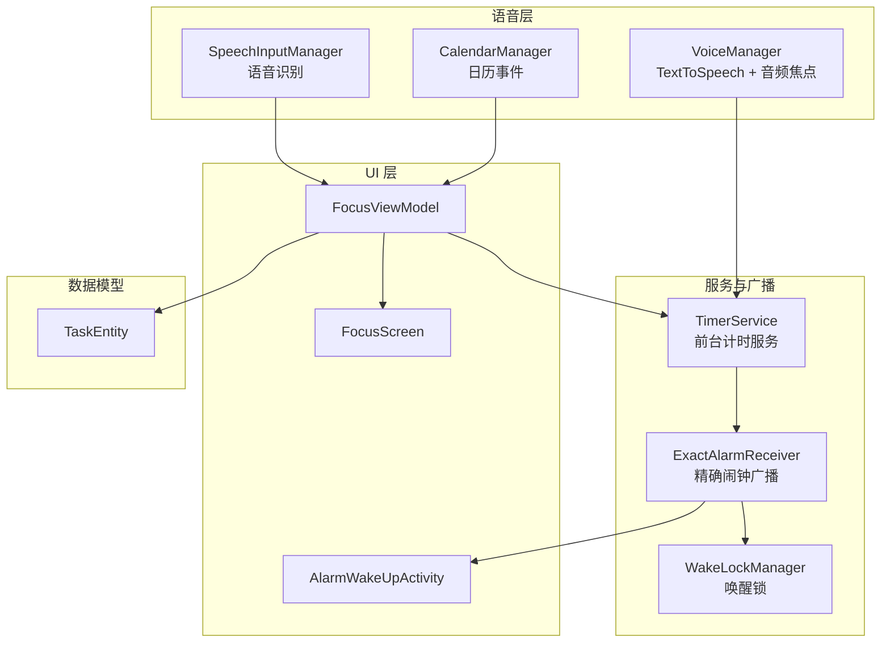
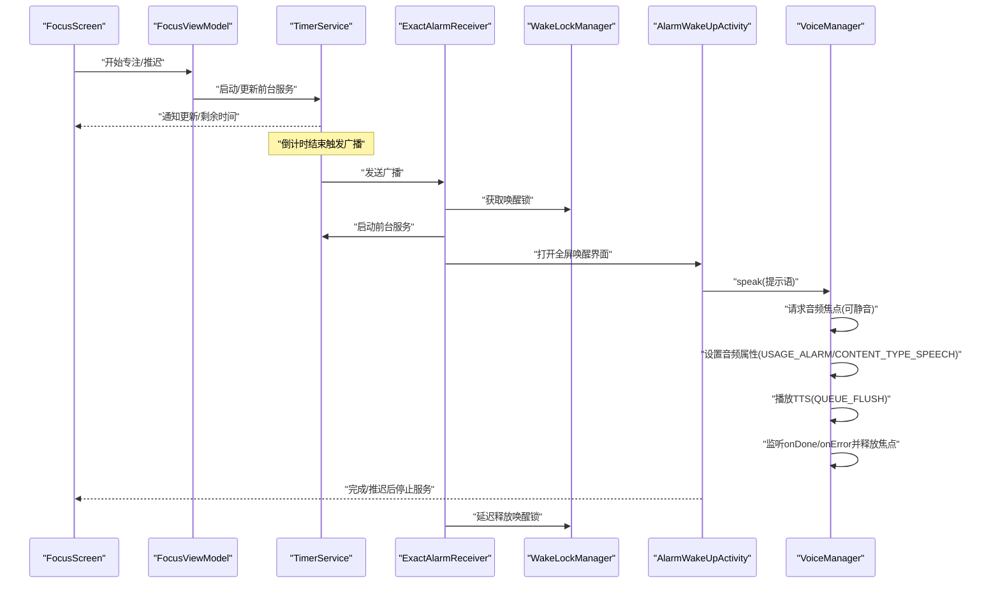
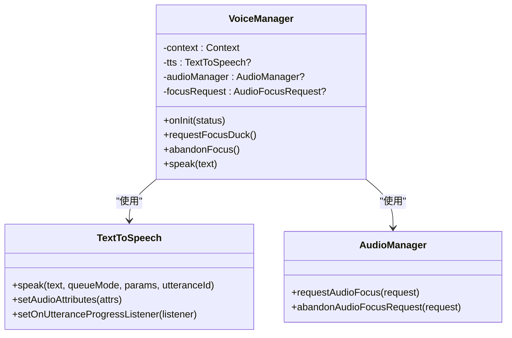
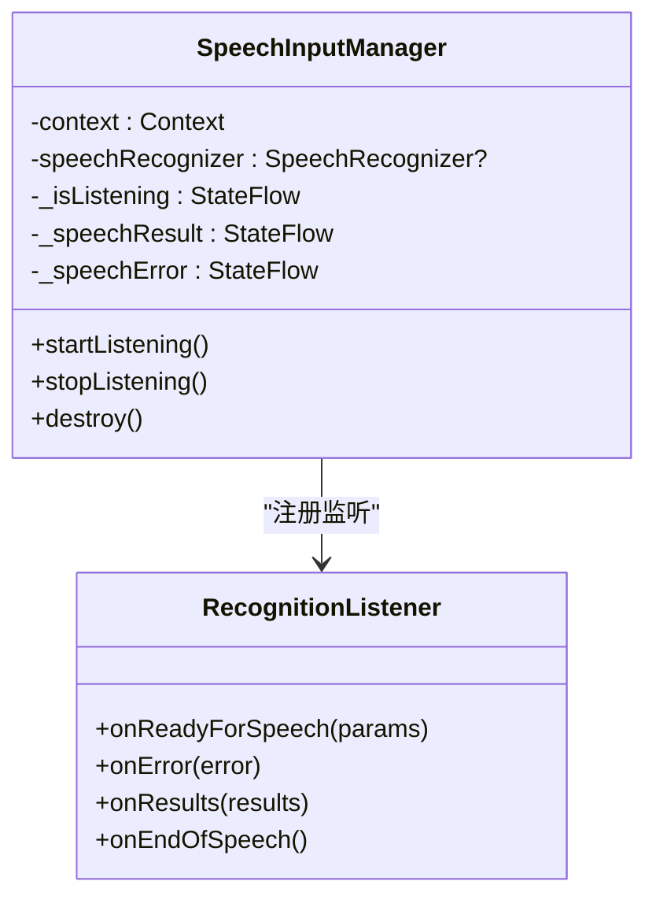
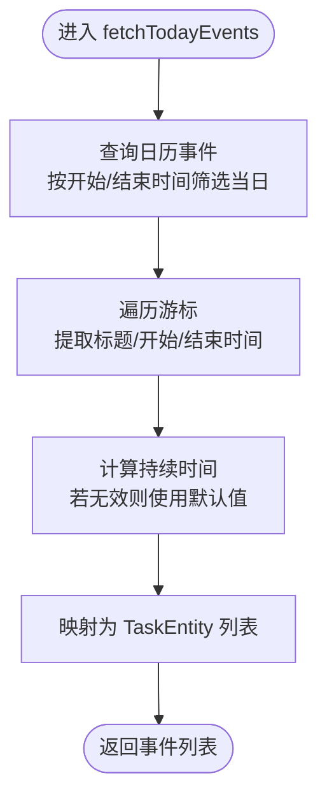
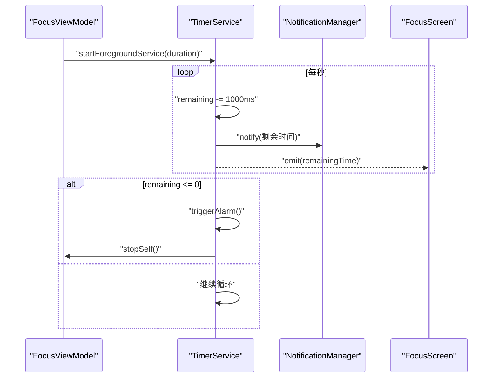
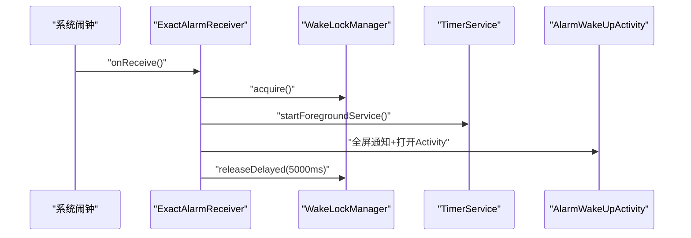
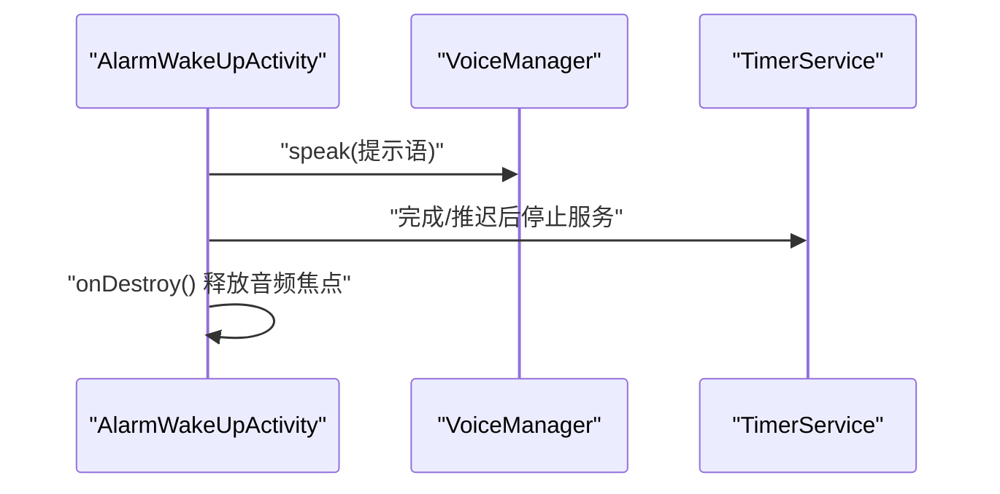
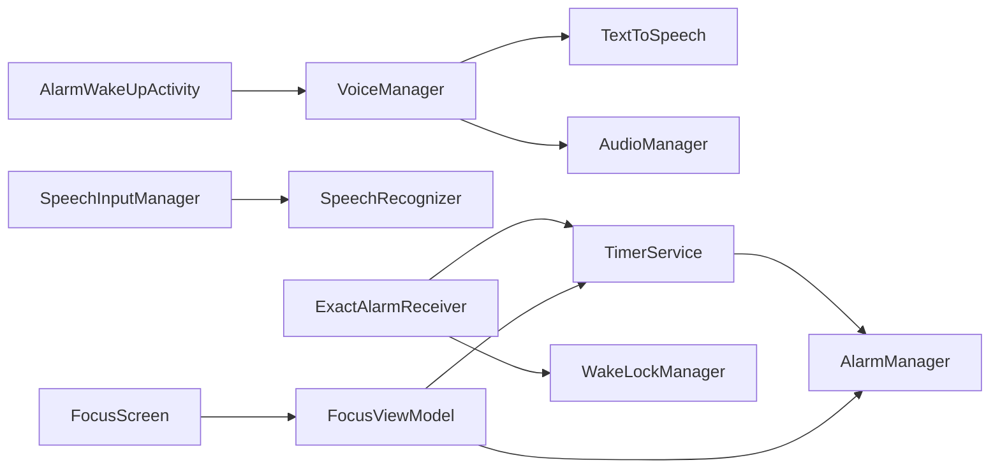

# 语音播报引擎

<cite>
**本文引用的文件列表**
- [VoiceManager.kt](file://app/src/main/java/com/pomodoroalert/voice/VoiceManager.kt)
- [SpeechInputManager.kt](file://app/src/main/java/com/pomodoroalert/voice/SpeechInputManager.kt)
- [CalendarManager.kt](file://app/src/main/java/com/pomodoroalert/voice/CalendarManager.kt)
- [TimerService.kt](file://app/src/main/java/com/pomodoroalert/service/TimerService.kt)
- [AlarmWakeUpActivity.kt](file://app/src/main/java/com/pomodoroalert/ui/AlarmWakeUpActivity.kt)
- [ExactAlarmReceiver.kt](file://app/src/main/java/com/pomodoroalert/receiver/ExactAlarmReceiver.kt)
- [WakeLockManager.kt](file://app/src/main/java/com/pomodoroalert/receiver/WakeLockManager.kt)
- [FocusViewModel.kt](file://app/src/main/java/com/pomodoroalert/ui/viewmodel/FocusViewModel.kt)
- [FocusScreen.kt](file://app/src/main/java/com/pomodoroalert/ui/screens/FocusScreen.kt)
- [TaskEntity.kt](file://app/src/main/java/com/pomodoroalert/data/TaskEntity.kt)
- [AndroidManifest.xml](file://app/src/main/AndroidManifest.xml)
- [build.gradle.kts](file://app/build.gradle.kts)
</cite>

## 目录
1. [简介](#简介)
2. [项目结构](#项目结构)
3. [核心组件](#核心组件)
4. [架构总览](#架构总览)
5. [详细组件分析](#详细组件分析)
6. [依赖关系分析](#依赖关系分析)
7. [性能与体验优化](#性能与体验优化)
8. [故障排查指南](#故障排查指南)
9. [结论](#结论)
10. [附录](#附录)

## 简介
本技术文档围绕“语音播报引擎”展开，系统性阐述以下内容：
- TextToSpeech API 的集成与配置：包括语音合成器初始化、语言设置、语音参数（音量、语速、音调）的可扩展点说明。
- 音频焦点管理机制：AudioFocusRequest 的创建、音频流类型与用途配置、焦点请求与释放策略。
- 语音播报实现细节：文本预处理建议、播放队列管理、错误回调与异常恢复。
- 音频属性配置：USAGE_ALARM、CONTENT_TYPE_SPEECH 等参数的作用与影响。
- 错误处理与异常恢复：焦点冲突、TTS 异常、唤醒锁与通知交互。
- 性能优化与用户体验最佳实践：前台服务、精确闹钟、WakeLock 使用、Compose UI 响应。

## 项目结构
该项目采用模块化分层组织，语音播报能力主要集中在 voice 包；计时与闹钟通过 TimerService、ExactAlarmReceiver 和 AlarmWakeUpActivity 协同实现；UI 层使用 Jetpack Compose 并通过 ViewModel 提供状态管理。

图表来源
- [VoiceManager.kt:12-62](file://app/src/main/java/com/pomodoroalert/voice/VoiceManager.kt#L12-L62)
- [SpeechInputManager.kt:13-65](file://app/src/main/java/com/pomodoroalert/voice/SpeechInputManager.kt#L13-L65)
- [CalendarManager.kt:10-65](file://app/src/main/java/com/pomodoroalert/voice/CalendarManager.kt#L10-L65)
- [TimerService.kt:24-102](file://app/src/main/java/com/pomodoroalert/service/TimerService.kt#L24-L102)
- [ExactAlarmReceiver.kt:13-48](file://app/src/main/java/com/pomodoroalert/receiver/ExactAlarmReceiver.kt#L13-L48)
- [WakeLockManager.kt:8-30](file://app/src/main/java/com/pomodoroalert/receiver/WakeLockManager.kt#L8-L30)
- [FocusViewModel.kt:21-84](file://app/src/main/java/com/pomodoroalert/ui/viewmodel/FocusViewModel.kt#L21-L84)
- [FocusScreen.kt:16-70](file://app/src/main/java/com/pomodoroalert/ui/screens/FocusScreen.kt#L16-L70)
- [AlarmWakeUpActivity.kt:24-104](file://app/src/main/java/com/pomodoroalert/ui/AlarmWakeUpActivity.kt#L24-L104)
- [TaskEntity.kt:8-19](file://app/src/main/java/com/pomodoroalert/data/TaskEntity.kt#L8-L19)

章节来源
- [AndroidManifest.xml:1-39](file://app/src/main/AndroidManifest.xml#L1-L39)
- [build.gradle.kts:9-41](file://app/build.gradle.kts#L9-L41)

## 核心组件
- VoiceManager：封装 TextToSpeech 初始化、语言设置、音频属性配置、音频焦点请求与释放、TTS 播放与回调。
- SpeechInputManager：封装 SpeechRecognizer 的生命周期、监听器回调、结果与错误流。
- CalendarManager：从系统日历读取当日事件并转换为任务实体。
- TimerService：前台服务计时器，负责倒计时、通知更新、闹钟触发。
- ExactAlarmReceiver：接收精确闹钟广播，启动前台服务、显示全屏通知、短暂持有唤醒锁。
- WakeLockManager：管理 PowerManager.WakeLock 的获取与延迟释放。
- FocusViewModel/FocusScreen：专注模式的 UI 与业务逻辑，调度 TimerService 与闹钟。
- AlarmWakeUpActivity：时间到后的全屏唤醒界面，触发语音播报并提供完成/推迟操作。

章节来源
- [VoiceManager.kt:12-62](file://app/src/main/java/com/pomodoroalert/voice/VoiceManager.kt#L12-L62)
- [SpeechInputManager.kt:13-65](file://app/src/main/java/com/pomodoroalert/voice/SpeechInputManager.kt#L13-L65)
- [CalendarManager.kt:10-65](file://app/src/main/java/com/pomodoroalert/voice/CalendarManager.kt#L10-L65)
- [TimerService.kt:24-102](file://app/src/main/java/com/pomodoroalert/service/TimerService.kt#L24-L102)
- [ExactAlarmReceiver.kt:13-48](file://app/src/main/java/com/pomodoroalert/receiver/ExactAlarmReceiver.kt#L13-L48)
- [WakeLockManager.kt:8-30](file://app/src/main/java/com/pomodoroalert/receiver/WakeLockManager.kt#L8-L30)
- [FocusViewModel.kt:21-84](file://app/src/main/java/com/pomodoroalert/ui/viewmodel/FocusViewModel.kt#L21-L84)
- [FocusScreen.kt:16-70](file://app/src/main/java/com/pomodoroalert/ui/screens/FocusScreen.kt#L16-L70)
- [AlarmWakeUpActivity.kt:24-104](file://app/src/main/java/com/pomodoroalert/ui/AlarmWakeUpActivity.kt#L24-L104)
- [TaskEntity.kt:8-19](file://app/src/main/java/com/pomodoroalert/data/TaskEntity.kt#L8-L19)

## 架构总览
语音播报引擎在系统中的位置与交互如下：

图表来源
- [FocusScreen.kt:16-70](file://app/src/main/java/com/pomodoroalert/ui/screens/FocusScreen.kt#L16-L70)
- [FocusViewModel.kt:32-46](file://app/src/main/java/com/pomodoroalert/ui/viewmodel/FocusViewModel.kt#L32-L46)
- [TimerService.kt:46-66](file://app/src/main/java/com/pomodoroalert/service/TimerService.kt#L46-L66)
- [ExactAlarmReceiver.kt:13-48](file://app/src/main/java/com/pomodoroalert/receiver/ExactAlarmReceiver.kt#L13-L48)
- [WakeLockManager.kt:12-29](file://app/src/main/java/com/pomodoroalert/receiver/WakeLockManager.kt#L12-L29)
- [AlarmWakeUpActivity.kt:30-36](file://app/src/main/java/com/pomodoroalert/ui/AlarmWakeUpActivity.kt#L30-L36)
- [VoiceManager.kt:28-61](file://app/src/main/java/com/pomodoroalert/voice/VoiceManager.kt#L28-L61)

## 详细组件分析

### VoiceManager 组件分析
VoiceManager 负责 TextToSpeech 的初始化、语言设置、音频属性配置、音频焦点请求与释放，以及 TTS 播放与回调。

图表来源
- [VoiceManager.kt:12-62](file://app/src/main/java/com/pomodoroalert/voice/VoiceManager.kt#L12-L62)

实现要点与复杂度
- 初始化与语言设置：在构造函数中创建 TextToSpeech 实例并在回调中设置默认语言，时间复杂度 O(1)。
- 音频焦点请求：使用 Builder 模式构建 AudioFocusRequest，支持“可静音”的临时焦点，时间复杂度 O(1)。
- TTS 播放：设置音频属性为 USAGE_ALARM + CONTENT_TYPE_SPEECH，使用 QUEUE_FLUSH 清空旧队列，时间复杂度 O(1)。
- 回调与释放：通过 UtteranceProgressListener 在完成或错误时释放焦点，避免资源泄漏，时间复杂度 O(1)。

章节来源
- [VoiceManager.kt:12-62](file://app/src/main/java/com/pomodoroalert/voice/VoiceManager.kt#L12-L62)

### SpeechInputManager 组件分析
SpeechInputManager 封装了 SpeechRecognizer 的生命周期与监听器，提供可观察的状态流（是否在听、识别结果、错误信息）。

图表来源
- [SpeechInputManager.kt:13-65](file://app/src/main/java/com/pomodoroalert/voice/SpeechInputManager.kt#L13-L65)

实现要点
- 状态流：使用 MutableStateFlow 暴露 isListening/speechResult/speechError，便于 UI 订阅。
- 错误处理：在 onError 中设置错误状态并提示用户，便于降级为手动输入。
- 生命周期管理：start/stop/destroy 对应 SpeechRecognizer 的生命周期方法。

章节来源
- [SpeechInputManager.kt:13-65](file://app/src/main/java/com/pomodoroalert/voice/SpeechInputManager.kt#L13-L65)

### CalendarManager 组件分析
CalendarManager 从系统日历读取当日事件，转换为应用内的 TaskEntity 列表。

图表来源
- [CalendarManager.kt:10-65](file://app/src/main/java/com/pomodoroalert/voice/CalendarManager.kt#L10-L65)

章节来源
- [CalendarManager.kt:10-65](file://app/src/main/java/com/pomodoroalert/voice/CalendarManager.kt#L10-L65)
- [TaskEntity.kt:8-19](file://app/src/main/java/com/pomodoroalert/data/TaskEntity.kt#L8-L19)

### TimerService 组件分析
TimerService 是前台服务，负责倒计时、通知更新、闹钟触发。

图表来源
- [TimerService.kt:24-102](file://app/src/main/java/com/pomodoroalert/service/TimerService.kt#L24-L102)
- [FocusViewModel.kt:32-46](file://app/src/main/java/com/pomodoroalert/ui/viewmodel/FocusViewModel.kt#L32-L46)
- [FocusScreen.kt:16-70](file://app/src/main/java/com/pomodoroalert/ui/screens/FocusScreen.kt#L16-L70)

章节来源
- [TimerService.kt:24-102](file://app/src/main/java/com/pomodoroalert/service/TimerService.kt#L24-L102)
- [FocusViewModel.kt:32-46](file://app/src/main/java/com/pomodoroalert/ui/viewmodel/FocusViewModel.kt#L32-L46)
- [FocusScreen.kt:16-70](file://app/src/main/java/com/pomodoroalert/ui/screens/FocusScreen.kt#L16-L70)

### ExactAlarmReceiver 与 WakeLockManager 组件分析
ExactAlarmReceiver 接收精确闹钟广播，启动前台服务、显示全屏通知、短暂持有唤醒锁；WakeLockManager 负责 WakeLock 的获取与延迟释放。

图表来源
- [ExactAlarmReceiver.kt:13-48](file://app/src/main/java/com/pomodoroalert/receiver/ExactAlarmReceiver.kt#L13-L48)
- [WakeLockManager.kt:8-30](file://app/src/main/java/com/pomodoroalert/receiver/WakeLockManager.kt#L8-L30)

章节来源
- [ExactAlarmReceiver.kt:13-48](file://app/src/main/java/com/pomodoroalert/receiver/ExactAlarmReceiver.kt#L13-L48)
- [WakeLockManager.kt:8-30](file://app/src/main/java/com/pomodoroalert/receiver/WakeLockManager.kt#L8-L30)

### AlarmWakeUpActivity 组件分析
AlarmWakeUpActivity 在时间到时以全屏方式唤醒用户，触发语音播报，并提供完成/推迟操作。

图表来源
- [AlarmWakeUpActivity.kt:24-104](file://app/src/main/java/com/pomodoroalert/ui/AlarmWakeUpActivity.kt#L24-L104)
- [VoiceManager.kt:45-61](file://app/src/main/java/com/pomodoroalert/voice/VoiceManager.kt#L45-L61)

章节来源
- [AlarmWakeUpActivity.kt:24-104](file://app/src/main/java/com/pomodoroalert/ui/AlarmWakeUpActivity.kt#L24-L104)

## 依赖关系分析
- 语音播报依赖 TextToSpeech 与 AudioManager；音频焦点用于协调系统内其他音频源。
- 语音识别依赖 SpeechRecognizer；识别结果通过状态流反馈给 UI。
- 计时与闹钟通过 AlarmManager/ExactAlarmReceiver 触发 TimerService；TimerService 作为前台服务保证稳定性。
- WakeLockManager 与通知配合，确保在锁屏状态下及时唤醒用户。
- UI 通过 ViewModel 协调服务与数据，保持状态一致与响应性。

图表来源
- [VoiceManager.kt:12-62](file://app/src/main/java/com/pomodoroalert/voice/VoiceManager.kt#L12-L62)
- [SpeechInputManager.kt:13-65](file://app/src/main/java/com/pomodoroalert/voice/SpeechInputManager.kt#L13-L65)
- [TimerService.kt:24-102](file://app/src/main/java/com/pomodoroalert/service/TimerService.kt#L24-L102)
- [ExactAlarmReceiver.kt:13-48](file://app/src/main/java/com/pomodoroalert/receiver/ExactAlarmReceiver.kt#L13-L48)
- [AlarmWakeUpActivity.kt:24-104](file://app/src/main/java/com/pomodoroalert/ui/AlarmWakeUpActivity.kt#L24-L104)
- [FocusViewModel.kt:21-84](file://app/src/main/java/com/pomodoroalert/ui/viewmodel/FocusViewModel.kt#L21-L84)
- [FocusScreen.kt:16-70](file://app/src/main/java/com/pomodoroalert/ui/screens/FocusScreen.kt#L16-L70)

## 性能与体验优化
- 前台服务与通知：TimerService 以前台服务运行，避免被系统回收；通知持续显示，提升可见性。
- 精确闹钟：使用 AlarmManager 的精确模式，结合 WakeLock 短暂唤醒，确保及时触发。
- 音频焦点策略：请求可静音的临时焦点，允许媒体音量降低，减少冲突；播放完成后立即释放。
- UI 响应：使用 StateFlow 与 Compose 状态收集，避免主线程阻塞。
- 文本预处理：建议在 speak 前对文本进行长度限制、特殊字符转义与停顿控制，提升 TTS 自然度。
- 语音参数扩展：可通过 setPitch/setSpeechRate 等接口动态调整音质与语速，结合用户偏好持久化。
- 错误降级：当 TTS 初始化失败或网络语音识别不可用时，回退至手动输入或本地提示。

[本节为通用优化建议，不直接分析具体文件，故无章节来源]

## 故障排查指南
常见问题与定位思路：
- TTS 无法播放
  - 检查 TextToSpeech 初始化回调状态；确认语言设置与设备 TTS 引擎可用。
  - 参考路径：[VoiceManager.kt:22-26](file://app/src/main/java/com/pomodoroalert/voice/VoiceManager.kt#L22-L26)
- 音频焦点冲突
  - 确认请求的焦点类型与会话属性；检查是否在播放期间被系统中断。
  - 参考路径：[VoiceManager.kt:28-43](file://app/src/main/java/com/pomodoroalert/voice/VoiceManager.kt#L28-L43)
- 语音识别错误
  - 查看 SpeechInputManager 的 onError 流，区分网络与权限问题。
  - 参考路径：[SpeechInputManager.kt:33-36](file://app/src/main/java/com/pomodoroalert/voice/SpeechInputManager.kt#L33-L36)
- 闹钟未触发
  - 检查 AlarmManager 设置与权限；确认 WakeLock 是否及时释放。
  - 参考路径：[ExactAlarmReceiver.kt:13-48](file://app/src/main/java/com/pomodoroalert/receiver/ExactAlarmReceiver.kt#L13-L48)，[WakeLockManager.kt:12-29](file://app/src/main/java/com/pomodoroalert/receiver/WakeLockManager.kt#L12-L29)
- 语音播报结束后无焦点释放
  - 确认 UtteranceProgressListener 的回调是否执行；Activity onDestroy 是否调用 abandonFocus。
  - 参考路径：[VoiceManager.kt:56-61](file://app/src/main/java/com/pomodoroalert/voice/VoiceManager.kt#L56-L61)，[AlarmWakeUpActivity.kt:100-103](file://app/src/main/java/com/pomodoroalert/ui/AlarmWakeUpActivity.kt#L100-L103)

章节来源
- [VoiceManager.kt:22-26](file://app/src/main/java/com/pomodoroalert/voice/VoiceManager.kt#L22-L26)
- [VoiceManager.kt:28-43](file://app/src/main/java/com/pomodoroalert/voice/VoiceManager.kt#L28-L43)
- [VoiceManager.kt:56-61](file://app/src/main/java/com/pomodoroalert/voice/VoiceManager.kt#L56-L61)
- [SpeechInputManager.kt:33-36](file://app/src/main/java/com/pomodoroalert/voice/SpeechInputManager.kt#L33-L36)
- [ExactAlarmReceiver.kt:13-48](file://app/src/main/java/com/pomodoroalert/receiver/ExactAlarmReceiver.kt#L13-L48)
- [WakeLockManager.kt:12-29](file://app/src/main/java/com/pomodoroalert/receiver/WakeLockManager.kt#L12-L29)
- [AlarmWakeUpActivity.kt:100-103](file://app/src/main/java/com/pomodoroalert/ui/AlarmWakeUpActivity.kt#L100-L103)

## 结论
该语音播报引擎通过 VoiceManager 完成 TTS 初始化与音频焦点管理，结合 TimerService、ExactAlarmReceiver 与 AlarmWakeUpActivity 实现稳定可靠的语音提醒流程。配合 SpeechInputManager 与 CalendarManager，形成从语音输入、日历导入到专注计时与语音播报的完整闭环。建议在实际部署中进一步完善文本预处理、语音参数个性化与错误降级策略，以获得更佳的用户体验。

[本节为总结性内容，不直接分析具体文件，故无章节来源]

## 附录

### TextToSpeech API 集成与配置要点
- 合成器初始化：在构造函数中创建实例并在回调中设置语言。
- 语言设置：根据系统默认语言或用户偏好设置 Locale。
- 语音参数：可扩展 setPitch、setSpeechRate 等参数，结合用户偏好持久化。
- 播放队列：使用 QUEUE_FLUSH 清空旧队列，避免串音；必要时使用 QUEUE_ADD 追加。
- 回调处理：监听 onDone/onError，及时释放音频焦点与资源。

章节来源
- [VoiceManager.kt:12-62](file://app/src/main/java/com/pomodoroalert/voice/VoiceManager.kt#L12-L62)

### 音频焦点管理机制
- 请求类型：AUDIOFOCUS_GAIN_TRANSIENT_MAY_DUCK 支持可静音的临时焦点。
- 音频属性：USAGE_ALARM + CONTENT_TYPE_SPEECH 适配系统闹钟场景。
- 请求与释放：播放前请求，播放完成或出错时释放；Activity onDestroy 也需兜底释放。

章节来源
- [VoiceManager.kt:28-43](file://app/src/main/java/com/pomodoroalert/voice/VoiceManager.kt#L28-L43)
- [VoiceManager.kt:45-61](file://app/src/main/java/com/pomodoroalert/voice/VoiceManager.kt#L45-L61)
- [AlarmWakeUpActivity.kt:100-103](file://app/src/main/java/com/pomodoroalert/ui/AlarmWakeUpActivity.kt#L100-L103)

### 音频属性配置说明
- USAGE_ALARM：表示音频用途为系统告警/提醒，适合 TTS 语音播报。
- CONTENT_TYPE_SPEECH：表示内容类型为语音，有助于系统正确路由与处理。

章节来源
- [VoiceManager.kt:48-53](file://app/src/main/java/com/pomodoroalert/voice/VoiceManager.kt#L48-L53)

### 语音播报实现细节
- 文本预处理：建议长度限制、特殊字符转义、停顿控制。
- 播放队列管理：QUEUE_FLUSH 清理旧队列；必要时使用 QUEUE_ADD。
- 错误处理与异常恢复：onError 回调释放焦点；Activity onDestroy 兜底释放。

章节来源
- [VoiceManager.kt:45-61](file://app/src/main/java/com/pomodoroalert/voice/VoiceManager.kt#L45-L61)
- [AlarmWakeUpActivity.kt:100-103](file://app/src/main/java/com/pomodoroalert/ui/AlarmWakeUpActivity.kt#L100-L103)

### 权限与前台服务声明
- 前台服务权限与类型：声明 FOREGROUND_SERVICE 与 mediaPlayback 类型。
- 语音识别与录音权限：RECORD_AUDIO 与 POST_NOTIFICATIONS。
- 闹钟与唤醒：REQUEST_IGNORE_BATTERY_OPTIMIZATIONS 与 WAKE_LOCK。

章节来源
- [AndroidManifest.xml:4-9](file://app/src/main/AndroidManifest.xml#L4-L9)
- [AndroidManifest.xml:33-36](file://app/src/main/AndroidManifest.xml#L33-L36)