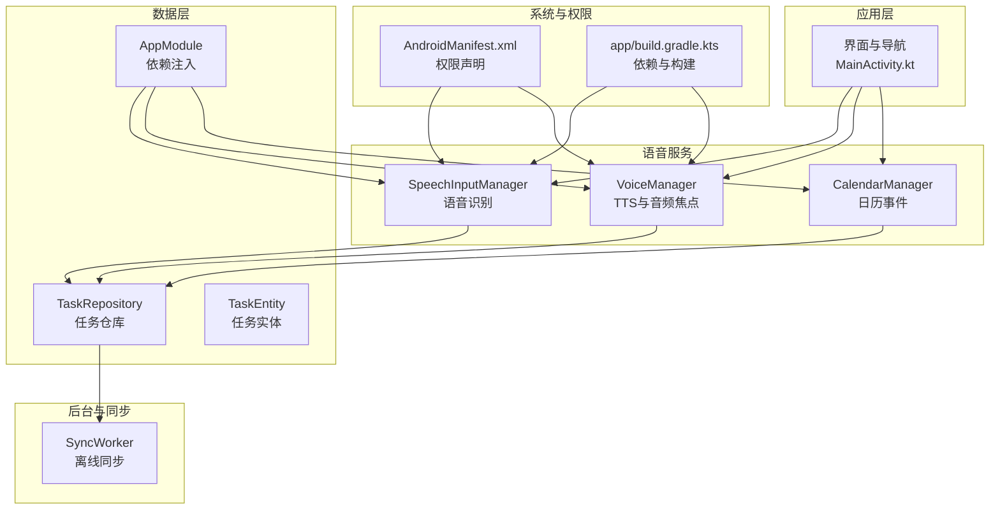
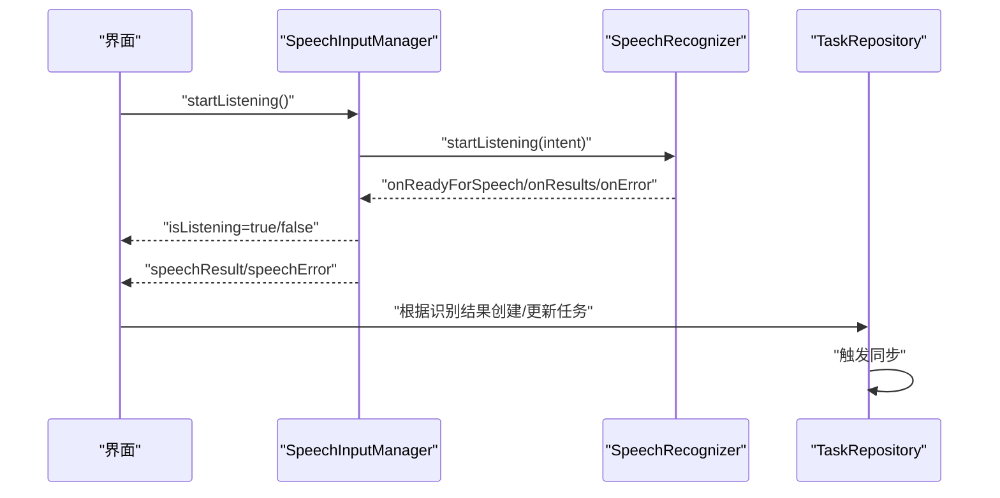
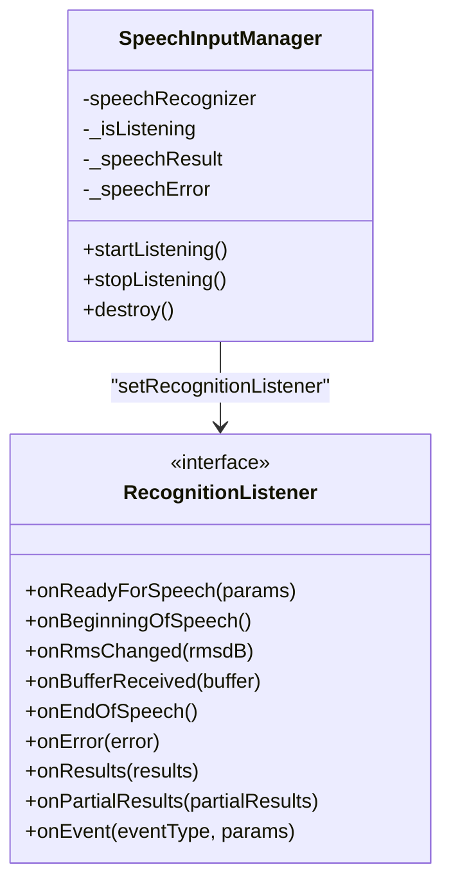
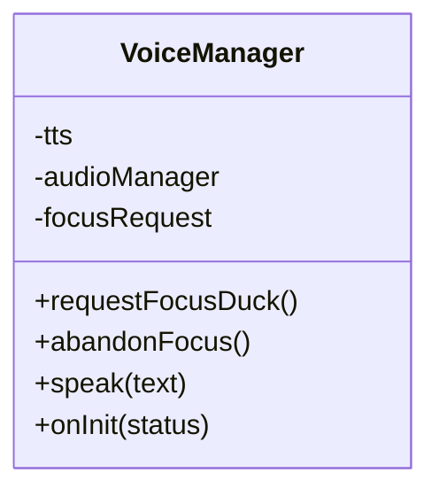
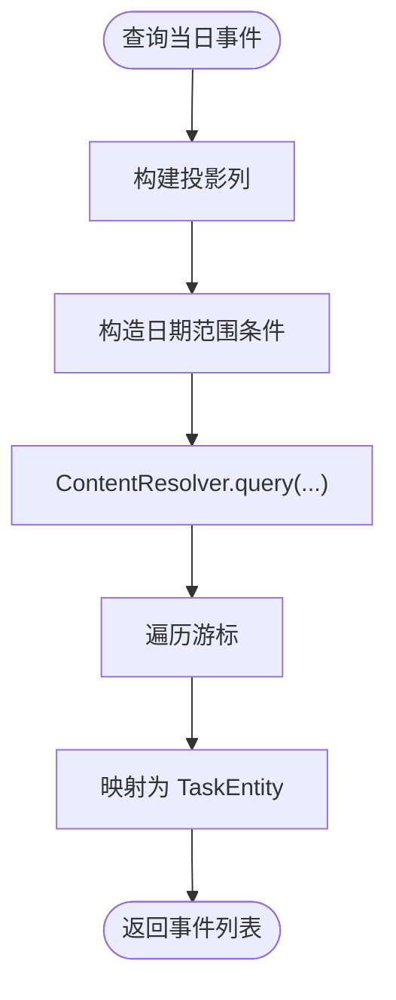
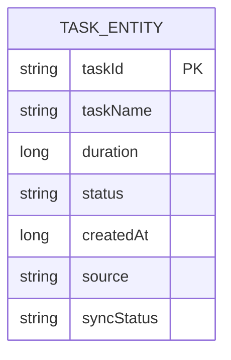
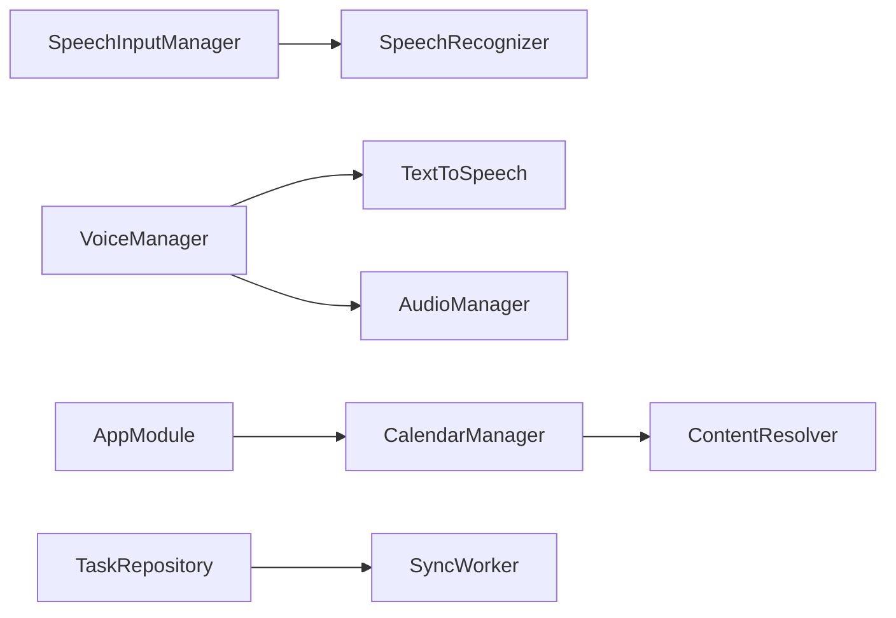

# 语音识别系统

<cite>
**本文引用的文件**
- [SpeechInputManager.kt](file://app/src/main/java/com/pomodoroalert/voice/SpeechInputManager.kt)
- [VoiceManager.kt](file://app/src/main/java/com/pomodoroalert/voice/VoiceManager.kt)
- [CalendarManager.kt](file://app/src/main/java/com/pomodoroalert/voice/CalendarManager.kt)
- [AndroidManifest.xml](file://app/src/main/AndroidManifest.xml)
- [TaskEntity.kt](file://app/src/main/java/com/pomodoroalert/data/TaskEntity.kt)
- [TaskRepository.kt](file://app/src/main/java/com/pomodoroalert/data/TaskRepository.kt)
- [AppModule.kt](file://app/src/main/java/com/pomodoroalert/di/AppModule.kt)
- [SyncWorker.kt](file://app/src/main/java/com/pomodoroalert/worker/SyncWorker.kt)
- [MainActivity.kt](file://app/src/main/java/com/pomodoroalert/MainActivity.kt)
- [app/build.gradle.kts](file://app/build.gradle.kts)
</cite>

## 目录
1. [简介](#简介)
2. [项目结构](#项目结构)
3. [核心组件](#核心组件)
4. [架构总览](#架构总览)
5. [详细组件分析](#详细组件分析)
6. [依赖关系分析](#依赖关系分析)
7. [性能考虑](#性能考虑)
8. [故障排查指南](#故障排查指南)
9. [结论](#结论)
10. [附录](#附录)

## 简介
本文件面向语音识别系统的技术文档，围绕 SpeechRecognizer 的初始化与配置、音频输入处理、语音到文本转换、生命周期管理（启动/停止/状态监控）、识别结果处理（文本提取、置信度评估、错误处理）、权限与录音配置、噪声抑制等技术要点展开，并结合项目现有实现给出可操作的优化建议与常见问题解决方案。

## 项目结构
本项目采用模块化组织，语音识别相关能力集中在 voice 包内，配合数据层、依赖注入与后台同步工作流协同工作。核心文件分布如下：
- 语音识别：SpeechInputManager.kt
- 文本转语音与音频焦点：VoiceManager.kt
- 日历事件读取：CalendarManager.kt
- 权限声明：AndroidManifest.xml
- 数据模型与仓库：TaskEntity.kt、TaskRepository.kt
- 依赖注入：AppModule.kt
- 后台同步：SyncWorker.kt
- 应用入口：MainActivity.kt
- 构建与依赖：app/build.gradle.kts

图表来源
- [SpeechInputManager.kt:1-66](file://app/src/main/java/com/pomodoroalert/voice/SpeechInputManager.kt#L1-L66)
- [VoiceManager.kt:1-63](file://app/src/main/java/com/pomodoroalert/voice/VoiceManager.kt#L1-L63)
- [CalendarManager.kt:1-66](file://app/src/main/java/com/pomodoroalert/voice/CalendarManager.kt#L1-L66)
- [TaskRepository.kt:40-66](file://app/src/main/java/com/pomodoroalert/data/TaskRepository.kt#L40-L66)
- [TaskEntity.kt:1-19](file://app/src/main/java/com/pomodoroalert/data/TaskEntity.kt#L1-L19)
- [AppModule.kt:1-61](file://app/src/main/java/com/pomodoroalert/di/AppModule.kt#L1-L61)
- [SyncWorker.kt:28-55](file://app/src/main/java/com/pomodoroalert/worker/SyncWorker.kt#L28-L55)
- [AndroidManifest.xml:1-39](file://app/src/main/AndroidManifest.xml#L1-L39)
- [app/build.gradle.kts:1-81](file://app/build.gradle.kts#L1-L81)

章节来源
- [MainActivity.kt:1-24](file://app/src/main/java/com/pomodoroalert/MainActivity.kt#L1-L24)
- [AndroidManifest.xml:1-39](file://app/src/main/AndroidManifest.xml#L1-L39)
- [app/build.gradle.kts:1-81](file://app/build.gradle.kts#L1-L81)

## 核心组件
- 语音识别器 SpeechInputManager
  - 负责创建与配置 Android 原生 SpeechRecognizer，设置 RecognitionListener 监听准备、开始/结束说话、错误与最终结果回调；通过状态流暴露 isListening、speechResult、speechError。
  - 提供 startListening、stopListening、destroy 生命周期方法。
- 文本转语音与音频焦点 VoiceManager
  - 初始化 TextToSpeech，设置语言；请求临时音频焦点（可静音）以播放 TTS；在 Utterance 完成或出错后释放音频焦点。
- 日历事件读取 CalendarManager
  - 查询当日日历事件，转换为任务实体列表，用于语音识别触发的任务来源之一。
- 数据模型与仓库 TaskEntity、TaskRepository
  - TaskEntity 描述任务字段（名称、时长、状态、来源、同步状态等）；TaskRepository 负责任务更新与触发同步。
- 依赖注入 AppModule
  - 提供数据库、DAO、UserPreferences、CalendarManager 等单例，供视图模型与服务使用。
- 后台同步 SyncWorker
  - 对待同步任务生成 WebhookPayload 并上报，其中包含触发来源（含“语音”）。

章节来源
- [SpeechInputManager.kt:1-66](file://app/src/main/java/com/pomodoroalert/voice/SpeechInputManager.kt#L1-L66)
- [VoiceManager.kt:1-63](file://app/src/main/java/com/pomodoroalert/voice/VoiceManager.kt#L1-L63)
- [CalendarManager.kt:1-66](file://app/src/main/java/com/pomodoroalert/voice/CalendarManager.kt#L1-L66)
- [TaskEntity.kt:1-19](file://app/src/main/java/com/pomodoroalert/data/TaskEntity.kt#L1-L19)
- [TaskRepository.kt:40-66](file://app/src/main/java/com/pomodoroalert/data/TaskRepository.kt#L40-L66)
- [AppModule.kt:1-61](file://app/src/main/java/com/pomodoroalert/di/AppModule.kt#L1-L61)
- [SyncWorker.kt:28-55](file://app/src/main/java/com/pomodoroalert/worker/SyncWorker.kt#L28-L55)

## 架构总览
语音识别系统在应用中的调用路径如下：界面触发识别 -> 语音识别器监听回调 -> 结果写入仓库 -> 同步工作流上报。

图表来源
- [SpeechInputManager.kt:25-65](file://app/src/main/java/com/pomodoroalert/voice/SpeechInputManager.kt#L25-L65)
- [TaskRepository.kt:40-66](file://app/src/main/java/com/pomodoroalert/data/TaskRepository.kt#L40-L66)

## 详细组件分析

### 组件一：SpeechInputManager（语音识别器）
- 初始化与配置
  - 使用 SpeechRecognizer.createSpeechRecognizer 创建识别器实例。
  - 设置 RecognitionListener，监听准备就绪、开始/结束说话、错误与最终结果。
  - 通过 Intent 配置语言模型为自由语料（LANGUAGE_MODEL_FREE_FORM）。
- 生命周期管理
  - startListening：清空上次结果与错误，启动识别。
  - stopListening：停止识别并将 isListening 置为 false。
  - destroy：销毁识别器资源。
- 结果处理
  - onResults：从 Bundle 中提取 RESULTS_RECOGNITION 列表，取第一个候选项作为最终文本。
  - onError：设置 isListening=false，并输出错误提示（包含网络问题提示）。
- 状态监控
  - isListening：在 onReadyForSpeech 与 onEndOfSpeech 之间为 true。
  - speechResult：保存最佳识别结果。
  - speechError：保存错误信息。

图表来源
- [SpeechInputManager.kt:13-65](file://app/src/main/java/com/pomodoroalert/voice/SpeechInputManager.kt#L13-L65)

章节来源
- [SpeechInputManager.kt:1-66](file://app/src/main/java/com/pomodoroalert/voice/SpeechInputManager.kt#L1-L66)

### 组件二：VoiceManager（TTS与音频焦点）
- 初始化与语言设置
  - 在构造函数中初始化 TextToSpeech，并在 onInit 成功后设置默认语言。
- 音频焦点管理
  - requestFocusDuck：请求临时音频焦点（可静音），用于播放 TTS 时降低其他音频音量。
  - abandonFocus：释放音频焦点。
- 播放 TTS
  - speak：设置音频属性为 USAGE_ALARM/CONTENT_TYPE_SPEECH，使用 QUEUE_FLUSH 立即播放；注册 UtteranceProgressListener，在完成或错误时自动释放音频焦点。

图表来源
- [VoiceManager.kt:12-62](file://app/src/main/java/com/pomodoroalert/voice/VoiceManager.kt#L12-L62)

章节来源
- [VoiceManager.kt:1-63](file://app/src/main/java/com/pomodoroalert/voice/VoiceManager.kt#L1-L63)

### 组件三：CalendarManager（日历事件）
- 功能概述
  - 查询当日日历事件，投影标题、开始/结束时间，计算持续时间，封装为 TaskEntity 列表。
- 关键点
  - 使用 ContentResolver 查询 CalendarContract.Events，按当日范围筛选。
  - 将事件转换为任务实体，source 字段可用于区分“日历”来源。

图表来源
- [CalendarManager.kt:10-65](file://app/src/main/java/com/pomodoroalert/voice/CalendarManager.kt#L10-L65)

章节来源
- [CalendarManager.kt:1-66](file://app/src/main/java/com/pomodoroalert/voice/CalendarManager.kt#L1-L66)

### 组件四：数据模型与仓库（TaskEntity、TaskRepository）
- TaskEntity
  - 字段：taskId、taskName、duration、status、createdAt、source、syncStatus。
  - 用途：统一表示任务，支持“语音”、“日历”、“手动”等来源标记。
- TaskRepository
  - 提供任务更新与触发同步逻辑；在触发同步时生成 WebhookPayload，其中 triggerSource 可能包含“Voice”。

图表来源
- [TaskEntity.kt:8-19](file://app/src/main/java/com/pomodoroalert/data/TaskEntity.kt#L8-L19)

章节来源
- [TaskEntity.kt:1-19](file://app/src/main/java/com/pomodoroalert/data/TaskEntity.kt#L1-L19)
- [TaskRepository.kt:40-66](file://app/src/main/java/com/pomodoroalert/data/TaskRepository.kt#L40-L66)

### 组件五：依赖注入与后台同步
- AppModule
  - 提供 CalendarManager 单例，供上层使用。
- SyncWorker
  - 对待同步任务生成 WebhookPayload，triggerSource 可能为“Voice”，用于上报语音触发的任务完成情况。

章节来源
- [AppModule.kt:55-59](file://app/src/main/java/com/pomodoroalert/di/AppModule.kt#L55-L59)
- [SyncWorker.kt:28-55](file://app/src/main/java/com/pomodoroalert/worker/SyncWorker.kt#L28-L55)

## 依赖关系分析
- 组件耦合
  - SpeechInputManager 依赖 Android 原生 SpeechRecognizer；通过状态流向 UI 暴露结果与错误。
  - VoiceManager 依赖 TextToSpeech 与 AudioManager，负责音频焦点与 TTS 播放。
  - CalendarManager 依赖系统日历内容提供者，用于任务来源扩展。
  - TaskRepository 与 SyncWorker 共同完成任务状态变更后的上报流程。
- 外部依赖
  - 构建脚本引入 Hilt、Room、WorkManager、Coroutines 等，支撑依赖注入、本地存储、后台任务与协程。

图表来源
- [SpeechInputManager.kt:13-27](file://app/src/main/java/com/pomodoroalert/voice/SpeechInputManager.kt#L13-L27)
- [VoiceManager.kt:12-20](file://app/src/main/java/com/pomodoroalert/voice/VoiceManager.kt#L12-L20)
- [CalendarManager.kt:10-39](file://app/src/main/java/com/pomodoroalert/voice/CalendarManager.kt#L10-L39)
- [AppModule.kt:55-59](file://app/src/main/java/com/pomodoroalert/di/AppModule.kt#L55-L59)
- [TaskRepository.kt:40-66](file://app/src/main/java/com/pomodoroalert/data/TaskRepository.kt#L40-L66)
- [SyncWorker.kt:28-55](file://app/src/main/java/com/pomodoroalert/worker/SyncWorker.kt#L28-L55)

章节来源
- [app/build.gradle.kts:43-79](file://app/build.gradle.kts#L43-L79)

## 性能考虑
- 识别速度提升
  - 语言模型：当前使用自由语料模型，适合口语表达但可能牺牲准确性；如需更快更准，可考虑在线/离线模型或自定义语言模型（需评估系统支持与权限）。
  - 采样率与编码：SpeechRecognizer 默认由系统处理，若需自定义可改用 MediaRecorder + 自定义音频源（需额外权限与复杂度）。
  - 预处理：在 UI 层减少不必要的 UI 更新频率，避免频繁重组导致主线程阻塞。
- 准确率改善
  - 语言设置：确保设备语言与识别语言一致；必要时引导用户在系统设置中下载离线语言包。
  - 环境噪声：尽量在安静环境下触发识别；可在 UI 层增加“环境噪声检测”提示（当前实现未包含）。
  - 说话节奏：提示用户清晰、缓慢、完整地表达指令。
- 资源占用控制
  - 生命周期：及时调用 stopListening 与 destroy，避免长时间占用麦克风与识别资源。
  - 音频焦点：TTS 播放完成后及时释放音频焦点，避免影响其他音频。
  - 后台同步：合理设置 WorkManager 的约束与退避策略，避免频繁唤醒。

## 故障排查指南
- 常见错误与处理
  - 网络问题：onError 回调中提示“网络问题，请重试或改为手动输入”，建议在网络可用时重试或降级为手动输入。
  - 无结果：onResults 为空时，检查语言模型与设备语言设置；确认录音权限已授予。
  - 权限缺失：RECORD_AUDIO 未授权会导致无法启动识别；请在运行时请求权限并引导用户授权。
- 生命周期与状态
  - isListening 状态：在 onReadyForSpeech 与 onEndOfSpeech 间为 true；若长时间为 true，检查是否遗漏 onEndOfSpeech 或异常中断。
  - 错误恢复：捕获 speechError 并提示用户；在 UI 层提供“重试/手动输入”按钮。
- 音频焦点与 TTS
  - 若 TTS 无法播放或被系统静音，检查 requestFocusDuck 是否成功以及音频焦点释放时机。

章节来源
- [SpeechInputManager.kt:33-36](file://app/src/main/java/com/pomodoroalert/voice/SpeechInputManager.kt#L33-L36)
- [AndroidManifest.xml:7-9](file://app/src/main/AndroidManifest.xml#L7-L9)

## 结论
本语音识别系统基于 Android 原生 SpeechRecognizer 实现，具备基础的识别启动/停止、结果与错误处理、状态监控能力；结合 CalendarManager、TaskRepository 与 SyncWorker 形成从语音输入到任务创建与上报的闭环。建议在后续版本中补充噪声抑制、离线模型、权限动态申请与错误重试策略，以进一步提升识别稳定性与用户体验。

## 附录
- 权限与清单
  - 必要权限：RECORD_AUDIO、READ_CALENDAR、POST_NOTIFICATIONS 等。
  - 服务与活动声明：前台服务类型、闹钟唤醒 Activity 等。
- 构建与依赖
  - Hilt、Room、WorkManager、Coroutines、Compose 等依赖已配置，支撑依赖注入、本地存储、后台任务与 UI 框架。

章节来源
- [AndroidManifest.xml:1-39](file://app/src/main/AndroidManifest.xml#L1-L39)
- [app/build.gradle.kts:43-79](file://app/build.gradle.kts#L43-L79)