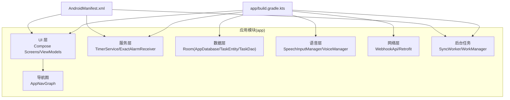
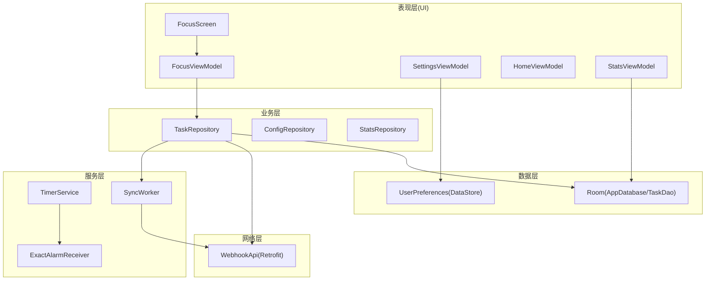
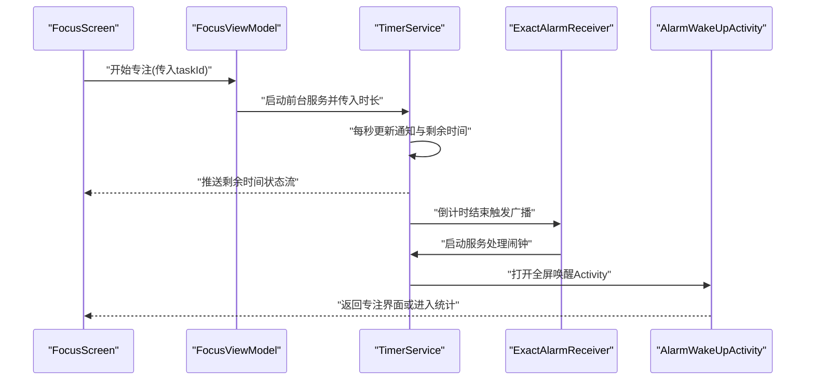
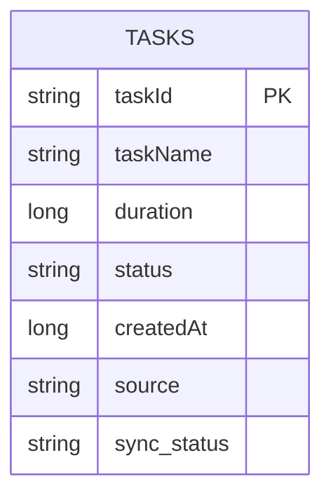
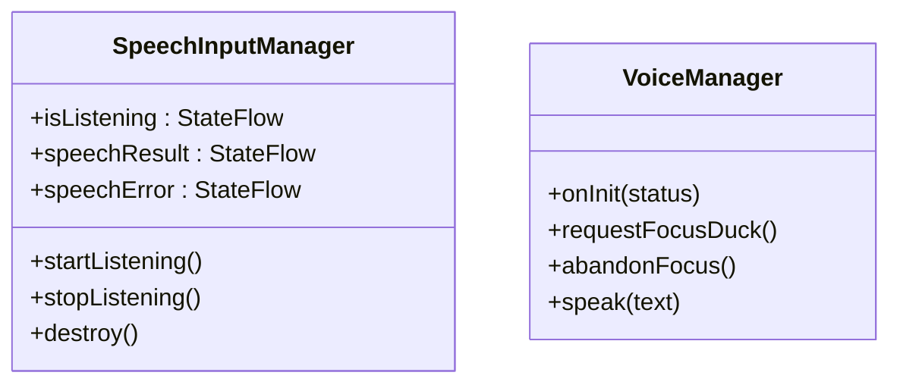
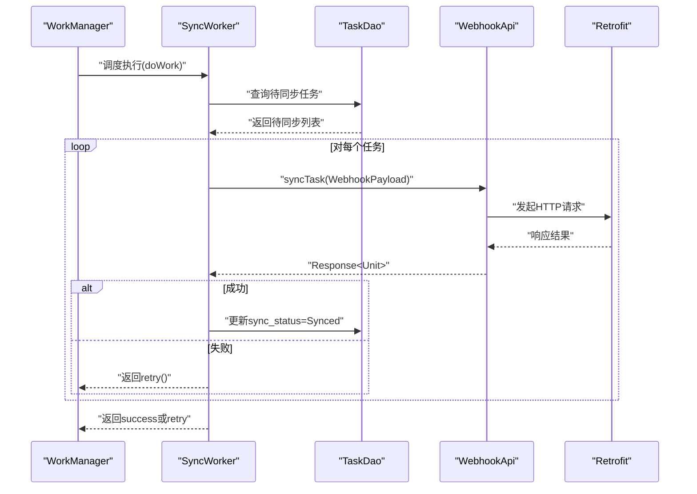
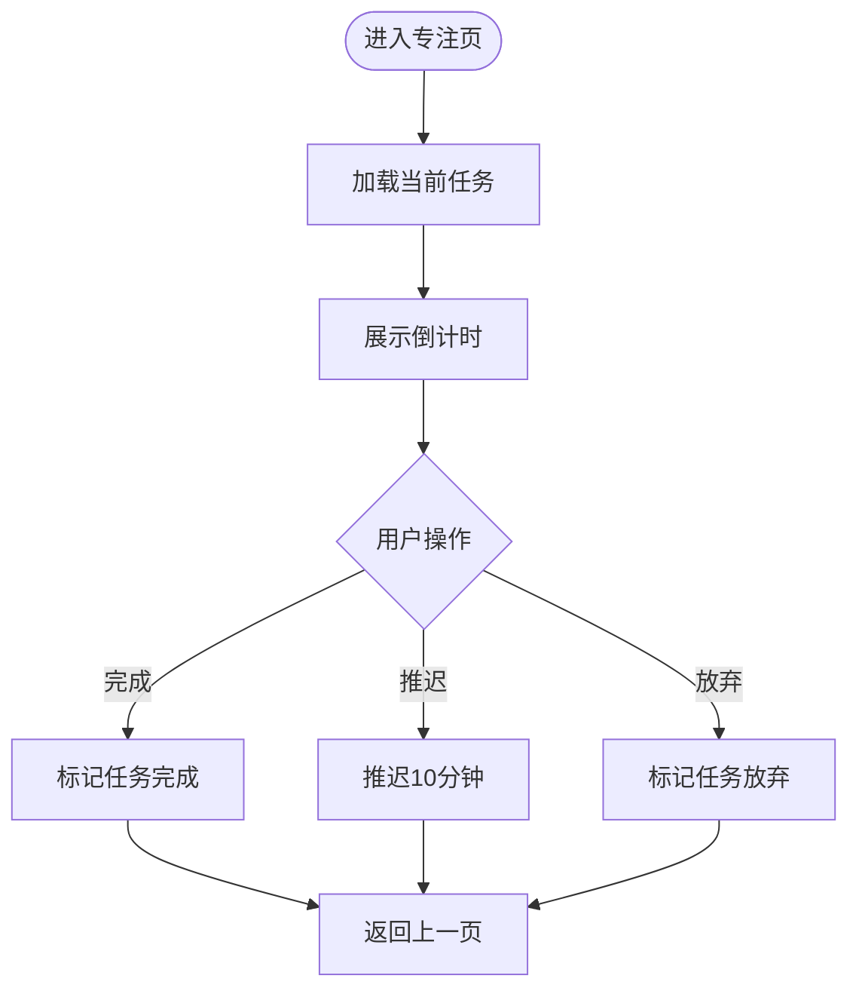
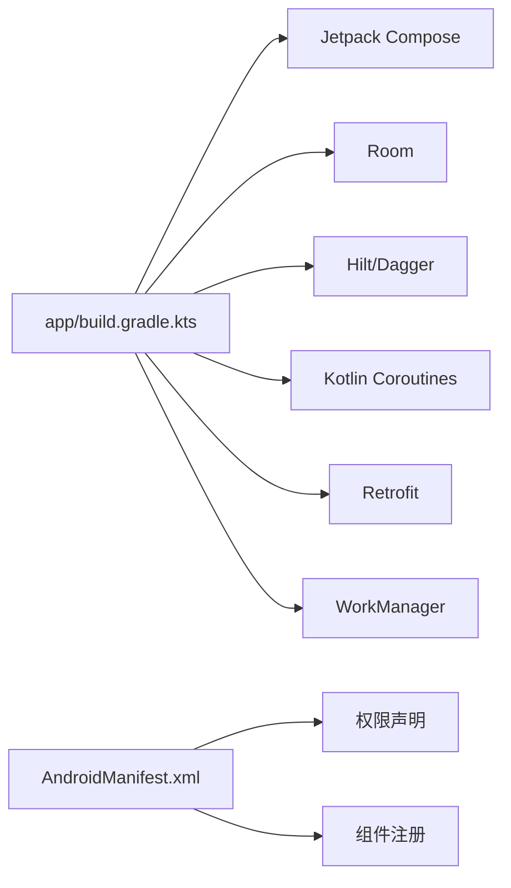

# 项目概述

<cite>
**本文引用的文件**
- [app/build.gradle.kts](file://app/build.gradle.kts)
- [settings.gradle.kts](file://settings.gradle.kts)
- [app/src/main/AndroidManifest.xml](file://app/src/main/AndroidManifest.xml)
- [app/src/main/java/com/pomodoroalert/PomodoroApplication.kt](file://app/src/main/java/com/pomodoroalert/PomodoroApplication.kt)
- [app/src/main/java/com/pomodoroalert/MainActivity.kt](file://app/src/main/java/com/pomodoroalert/MainActivity.kt)
- [app/src/main/java/com/pomodoroalert/ui/AppNavGraph.kt](file://app/src/main/java/com/pomodoroalert/ui/AppNavGraph.kt)
- [app/src/main/java/com/pomodoroalert/service/TimerService.kt](file://app/src/main/java/com/pomodoroalert/service/TimerService.kt)
- [app/src/main/java/com/pomodoroalert/receiver/ExactAlarmReceiver.kt](file://app/src/main/java/com/pomodoroalert/receiver/ExactAlarmReceiver.kt)
- [app/src/main/java/com/pomodoroalert/data/AppDatabase.kt](file://app/src/main/java/com/pomodoroalert/data/AppDatabase.kt)
- [app/src/main/java/com/pomodoroalert/data/TaskEntity.kt](file://app/src/main/java/com/pomodoroalert/data/TaskEntity.kt)
- [app/src/main/java/com/pomodoroalert/data/TaskDao.kt](file://app/src/main/java/com/pomodoroalert/data/TaskDao.kt)
- [app/src/main/java/com/pomodoroalert/voice/SpeechInputManager.kt](file://app/src/main/java/com/pomodoroalert/voice/SpeechInputManager.kt)
- [app/src/main/java/com/pomodoroalert/voice/VoiceManager.kt](file://app/src/main/java/com/pomodoroalert/voice/VoiceManager.kt)
- [app/src/main/java/com/pomodoroalert/network/WebhookApi.kt](file://app/src/main/java/com/pomodoroalert/network/WebhookApi.kt)
- [app/src/main/java/com/pomodoroalert/worker/SyncWorker.kt](file://app/src/main/java/com/pomodoroalert/worker/SyncWorker.kt)
- [app/src/main/java/com/pomodoroalert/ui/screens/FocusScreen.kt](file://app/src/main/java/com/pomodoroalert/ui/screens/FocusScreen.kt)
</cite>

## 目录
1. [引言](#引言)
2. [项目结构](#项目结构)
3. [核心组件](#核心组件)
4. [架构总览](#架构总览)
5. [详细组件分析](#详细组件分析)
6. [依赖关系分析](#依赖关系分析)
7. [性能考虑](#性能考虑)
8. [故障排查指南](#故障排查指南)
9. [结论](#结论)
10. [附录](#附录)

## 引言
PomodoroAlert 是一款基于 Android 的番茄工作法时间管理应用，旨在通过专注计时、任务管理、语音控制与日历同步等功能，帮助用户提升专注力与工作效率。应用采用现代 Android 技术栈，结合 Jetpack Compose UI、Room 数据库、WorkManager 后台同步、Hilt 依赖注入以及 Retrofit 网络层，构建出稳定、可扩展且用户体验友好的移动端产品。

## 项目结构
应用采用模块化分层组织，核心目录与职责如下：
- app：主应用模块，包含 UI 层（Compose）、业务层（ViewModel）、数据层（Room/Repository）、服务层（Service/BroadcastReceiver）、语音与网络层、后台任务（WorkManager）等。
- 资源与清单：AndroidManifest 定义权限、Activity、Service、BroadcastReceiver；res 提供图标、主题与字符串资源。
- 构建配置：Gradle 配置统一管理依赖版本与编译选项，启用 Compose、KSP、Hilt、Retrofit 等插件。

图表来源
- [app/src/main/AndroidManifest.xml:1-39](file://app/src/main/AndroidManifest.xml#L1-L39)
- [app/build.gradle.kts:1-81](file://app/build.gradle.kts#L1-L81)

章节来源
- [settings.gradle.kts:1-18](file://settings.gradle.kts#L1-L18)
- [app/build.gradle.kts:1-81](file://app/build.gradle.kts#L1-L81)
- [app/src/main/AndroidManifest.xml:1-39](file://app/src/main/AndroidManifest.xml#L1-L39)

## 核心组件
- 应用入口与启动
  - 应用程序类负责 Hilt 初始化，确保依赖注入可用。
  - 主 Activity 设置 Compose 内容并通过导航图承载页面。
- 专注计时与提醒
  - 前台服务持续倒计时并在通知栏显示剩余时间；闹钟触发后打开全屏唤醒界面。
- 任务管理与持久化
  - 使用 Room 管理任务实体与 DAO 查询，支持状态变更与离线同步标记。
- 语音控制与播报
  - 语音识别接收器监听语音指令，TTS 在音频焦点允许下播报提示。
- 后台同步与网络
  - WorkManager 定期拉取待同步任务，通过 Retrofit 调用 Webhook 接口上报。
- 用户界面
  - 专注面板提供倒计时展示与“完成/推迟/放弃”操作，配合 ViewModel 管理状态。

章节来源
- [app/src/main/java/com/pomodoroalert/PomodoroApplication.kt:1-8](file://app/src/main/java/com/pomodoroalert/PomodoroApplication.kt#L1-L8)
- [app/src/main/java/com/pomodoroalert/MainActivity.kt:1-24](file://app/src/main/java/com/pomodoroalert/MainActivity.kt#L1-L24)
- [app/src/main/java/com/pomodoroalert/service/TimerService.kt:1-103](file://app/src/main/java/com/pomodoroalert/service/TimerService.kt#L1-L103)
- [app/src/main/java/com/pomodoroalert/receiver/ExactAlarmReceiver.kt:1-49](file://app/src/main/java/com/pomodoroalert/receiver/ExactAlarmReceiver.kt#L1-L49)
- [app/src/main/java/com/pomodoroalert/data/AppDatabase.kt:1-10](file://app/src/main/java/com/pomodoroalert/data/AppDatabase.kt#L1-L10)
- [app/src/main/java/com/pomodoroalert/data/TaskEntity.kt:1-19](file://app/src/main/java/com/pomodoroalert/data/TaskEntity.kt#L1-L19)
- [app/src/main/java/com/pomodoroalert/data/TaskDao.kt:1-29](file://app/src/main/java/com/pomodoroalert/data/TaskDao.kt#L1-L29)
- [app/src/main/java/com/pomodoroalert/voice/SpeechInputManager.kt:1-66](file://app/src/main/java/com/pomodoroalert/voice/SpeechInputManager.kt#L1-L66)
- [app/src/main/java/com/pomodoroalert/voice/VoiceManager.kt:1-63](file://app/src/main/java/com/pomodoroalert/voice/VoiceManager.kt#L1-L63)
- [app/src/main/java/com/pomodoroalert/network/WebhookApi.kt:1-16](file://app/src/main/java/com/pomodoroalert/network/WebhookApi.kt#L1-L16)
- [app/src/main/java/com/pomodoroalert/worker/SyncWorker.kt:1-78](file://app/src/main/java/com/pomodoroalert/worker/SyncWorker.kt#L1-L78)
- [app/src/main/java/com/pomodoroalert/ui/screens/FocusScreen.kt:1-70](file://app/src/main/java/com/pomodoroalert/ui/screens/FocusScreen.kt#L1-L70)

## 架构总览
应用遵循 MVVM 与 Clean Architecture 思想，UI 通过 ViewModel 订阅状态流，数据层通过 Repository/DAO 与数据库交互，网络层通过 Retrofit 进行云端同步，后台通过 WorkManager 实现可靠重试与调度。

图表来源
- [app/src/main/java/com/pomodoroalert/ui/screens/FocusScreen.kt:1-70](file://app/src/main/java/com/pomodoroalert/ui/screens/FocusScreen.kt#L1-L70)
- [app/src/main/java/com/pomodoroalert/service/TimerService.kt:1-103](file://app/src/main/java/com/pomodoroalert/service/TimerService.kt#L1-L103)
- [app/src/main/java/com/pomodoroalert/receiver/ExactAlarmReceiver.kt:1-49](file://app/src/main/java/com/pomodoroalert/receiver/ExactAlarmReceiver.kt#L1-L49)
- [app/src/main/java/com/pomodoroalert/worker/SyncWorker.kt:1-78](file://app/src/main/java/com/pomodoroalert/worker/SyncWorker.kt#L1-L78)
- [app/src/main/java/com/pomodoroalert/data/AppDatabase.kt:1-10](file://app/src/main/java/com/pomodoroalert/data/AppDatabase.kt#L1-L10)
- [app/src/main/java/com/pomodoroalert/network/WebhookApi.kt:1-16](file://app/src/main/java/com/pomodoroalert/network/WebhookApi.kt#L1-L16)

## 详细组件分析

### 专注计时与前台服务
- TimerService 在前台运行，持续倒计时并通过通知更新剩余时间；倒计时结束时启动唤醒 Activity 并停止自身。
- ExactAlarmReceiver 在系统闹钟触发时启动服务并发送全屏提醒通知，短暂持有唤醒锁后释放。

图表来源
- [app/src/main/java/com/pomodoroalert/ui/screens/FocusScreen.kt:1-70](file://app/src/main/java/com/pomodoroalert/ui/screens/FocusScreen.kt#L1-L70)
- [app/src/main/java/com/pomodoroalert/service/TimerService.kt:1-103](file://app/src/main/java/com/pomodoroalert/service/TimerService.kt#L1-L103)
- [app/src/main/java/com/pomodoroalert/receiver/ExactAlarmReceiver.kt:1-49](file://app/src/main/java/com/pomodoroalert/receiver/ExactAlarmReceiver.kt#L1-L49)

章节来源
- [app/src/main/java/com/pomodoroalert/service/TimerService.kt:1-103](file://app/src/main/java/com/pomodoroalert/service/TimerService.kt#L1-L103)
- [app/src/main/java/com/pomodoroalert/receiver/ExactAlarmReceiver.kt:1-49](file://app/src/main/java/com/pomodoroalert/receiver/ExactAlarmReceiver.kt#L1-L49)

### 任务管理与数据模型
- TaskEntity 描述任务的基本属性（名称、时长、状态、来源、创建时间、同步状态等），作为 Room 表映射。
- TaskDao 提供插入、查询活动任务、按 ID 查询、状态更新、待同步任务查询与同步状态更新等方法。
- AppDatabase 汇聚实体与 DAO，提供数据库访问入口。

图表来源
- [app/src/main/java/com/pomodoroalert/data/TaskEntity.kt:1-19](file://app/src/main/java/com/pomodoroalert/data/TaskEntity.kt#L1-L19)
- [app/src/main/java/com/pomodoroalert/data/TaskDao.kt:1-29](file://app/src/main/java/com/pomodoroalert/data/TaskDao.kt#L1-L29)
- [app/src/main/java/com/pomodoroalert/data/AppDatabase.kt:1-10](file://app/src/main/java/com/pomodoroalert/data/AppDatabase.kt#L1-L10)

章节来源
- [app/src/main/java/com/pomodoroalert/data/TaskEntity.kt:1-19](file://app/src/main/java/com/pomodoroalert/data/TaskEntity.kt#L1-L19)
- [app/src/main/java/com/pomodoroalert/data/TaskDao.kt:1-29](file://app/src/main/java/com/pomodoroalert/data/TaskDao.kt#L1-L29)
- [app/src/main/java/com/pomodoroalert/data/AppDatabase.kt:1-10](file://app/src/main/java/com/pomodoroalert/data/AppDatabase.kt#L1-L10)

### 语音控制与播报
- SpeechInputManager 封装语音识别生命周期与状态流，提供开始/停止监听与错误回调。
- VoiceManager 管理 TTS 初始化、请求音频焦点（允许其他声音短暂降音）并播报文本，结束后释放焦点。

图表来源
- [app/src/main/java/com/pomodoroalert/voice/SpeechInputManager.kt:1-66](file://app/src/main/java/com/pomodoroalert/voice/SpeechInputManager.kt#L1-L66)
- [app/src/main/java/com/pomodoroalert/voice/VoiceManager.kt:1-63](file://app/src/main/java/com/pomodoroalert/voice/VoiceManager.kt#L1-L63)

章节来源
- [app/src/main/java/com/pomodoroalert/voice/SpeechInputManager.kt:1-66](file://app/src/main/java/com/pomodoroalert/voice/SpeechInputManager.kt#L1-L66)
- [app/src/main/java/com/pomodoroalert/voice/VoiceManager.kt:1-63](file://app/src/main/java/com/pomodoroalert/voice/VoiceManager.kt#L1-L63)

### 后台同步与网络
- SyncWorker 每次运行拉取所有待同步任务，构造 WebhookPayload 并调用 WebhookApi 同步；成功则更新同步状态为已同步，失败返回重试。
- WebhookApi 基于 Retrofit 定义同步接口，默认 URL 来自常量定义。

图表来源
- [app/src/main/java/com/pomodoroalert/worker/SyncWorker.kt:1-78](file://app/src/main/java/com/pomodoroalert/worker/SyncWorker.kt#L1-L78)
- [app/src/main/java/com/pomodoroalert/network/WebhookApi.kt:1-16](file://app/src/main/java/com/pomodoroalert/network/WebhookApi.kt#L1-L16)

章节来源
- [app/src/main/java/com/pomodoroalert/worker/SyncWorker.kt:1-78](file://app/src/main/java/com/pomodoroalert/worker/SyncWorker.kt#L1-L78)
- [app/src/main/java/com/pomodoroalert/network/WebhookApi.kt:1-16](file://app/src/main/java/com/pomodoroalert/network/WebhookApi.kt#L1-L16)

### 用户界面与导航
- FocusScreen 通过 ViewModel 获取剩余时间与当前任务，展示倒计时并提供完成/推迟/放弃操作。
- AppNavGraph 组织页面导航，配合 Hilt 注入 ViewModel。

图表来源
- [app/src/main/java/com/pomodoroalert/ui/screens/FocusScreen.kt:1-70](file://app/src/main/java/com/pomodoroalert/ui/screens/FocusScreen.kt#L1-L70)

章节来源
- [app/src/main/java/com/pomodoroalert/ui/screens/FocusScreen.kt:1-70](file://app/src/main/java/com/pomodoroalert/ui/screens/FocusScreen.kt#L1-L70)

## 依赖关系分析
- 构建与插件
  - 应用启用 Kotlin、Compose、KSP、Hilt、Retrofit、WorkManager 等插件与依赖。
- 运行时权限
  - 前台服务、唤醒锁、忽略电池优化、录音、读取日历、通知等权限在清单中声明。
- 组件注册
  - MainActivity、AlarmWakeUpActivity、TimerService、ExactAlarmReceiver 在清单中注册。

图表来源
- [app/build.gradle.kts:1-81](file://app/build.gradle.kts#L1-L81)
- [app/src/main/AndroidManifest.xml:1-39](file://app/src/main/AndroidManifest.xml#L1-L39)

章节来源
- [app/build.gradle.kts:1-81](file://app/build.gradle.kts#L1-L81)
- [app/src/main/AndroidManifest.xml:1-39](file://app/src/main/AndroidManifest.xml#L1-L39)

## 性能考虑
- 前台服务与通知：使用前台服务与低重要性的通知通道，保证计时稳定性与系统兼容性。
- 协程与状态流：通过协程与 StateFlow 管理 UI 状态，避免主线程阻塞。
- 数据库与查询：Room 查询采用 Flow/挂起函数，避免阻塞 UI 线程；DAO 提供批量更新与条件查询。
- 网络与重试：WorkManager 支持退避策略与重试，Retrofit 使用 OkHttp 优化连接复用。
- 语音与音频焦点：TTS 请求临时音频焦点，减少对其他应用的影响。

## 故障排查指南
- 无法收到提醒
  - 检查前台服务是否正常启动与通知通道创建。
  - 确认 ExactAlarmReceiver 是否被系统广播触发。
- 语音识别失败
  - 检查录音权限与网络状态；SpeechInputManager 提供错误状态流。
- 同步失败
  - 查看 SyncWorker 返回值与网络异常；确认 Webhook 地址与参数构造。
- 任务状态不一致
  - 检查 DAO 更新状态与同步状态字段是否正确写入。

章节来源
- [app/src/main/java/com/pomodoroalert/service/TimerService.kt:1-103](file://app/src/main/java/com/pomodoroalert/service/TimerService.kt#L1-L103)
- [app/src/main/java/com/pomodoroalert/receiver/ExactAlarmReceiver.kt:1-49](file://app/src/main/java/com/pomodoroalert/receiver/ExactAlarmReceiver.kt#L1-L49)
- [app/src/main/java/com/pomodoroalert/voice/SpeechInputManager.kt:1-66](file://app/src/main/java/com/pomodoroalert/voice/SpeechInputManager.kt#L1-L66)
- [app/src/main/java/com/pomodoroalert/worker/SyncWorker.kt:1-78](file://app/src/main/java/com/pomodoroalert/worker/SyncWorker.kt#L1-L78)

## 结论
PomodoroAlert 通过清晰的分层架构与现代 Android 技术栈，实现了从专注计时、任务管理到语音控制与云端同步的完整闭环。其模块化设计便于扩展与维护，适合希望提升专注力与效率的个人用户与团队使用。

## 附录

### 系统要求与兼容性
- 最低 SDK：26
- 目标 SDK：34
- 编译 SDK：34
- JVM 目标：17
- Compose：启用
- 依赖注入：Hilt
- 数据持久化：Room
- 网络：Retrofit + OkHttp
- 后台任务：WorkManager

章节来源
- [app/build.gradle.kts:9-41](file://app/build.gradle.kts#L9-L41)

### 安装与部署
- 开发环境：Android Studio + Gradle Wrapper
- 构建命令：使用 Gradle Wrapper 或 Android Studio 构建 assembleDebug/assembleRelease
- 安装：连接设备或模拟器，运行安装包
- 权限：应用在首次运行时申请所需权限（如录音、日历、通知等）

章节来源
- [settings.gradle.kts:1-18](file://settings.gradle.kts#L1-L18)
- [app/build.gradle.kts:1-81](file://app/build.gradle.kts#L1-L81)
- [app/src/main/AndroidManifest.xml:1-39](file://app/src/main/AndroidManifest.xml#L1-L39)